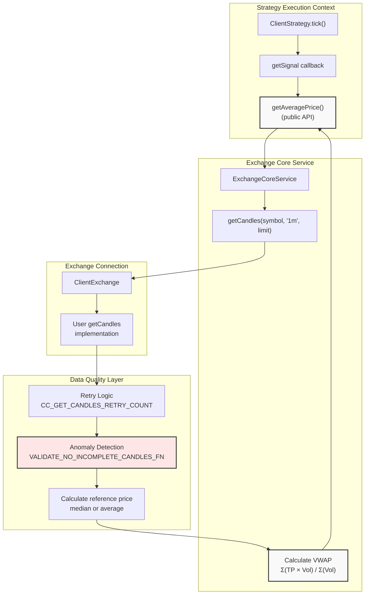
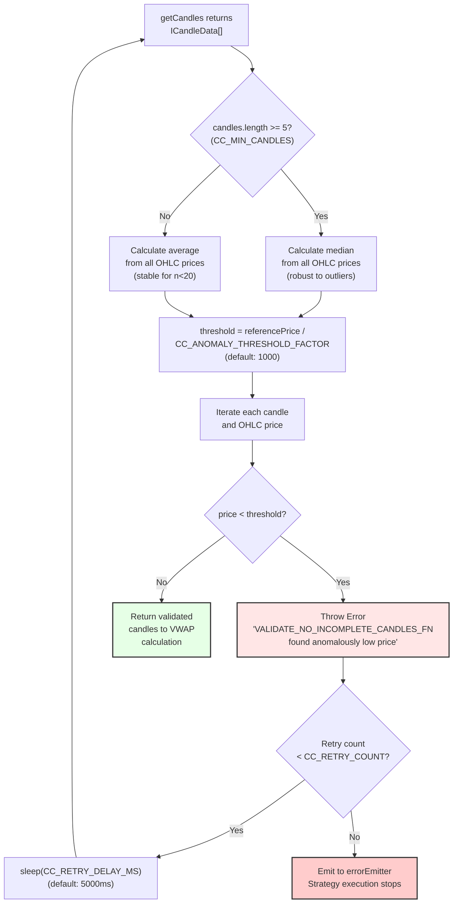
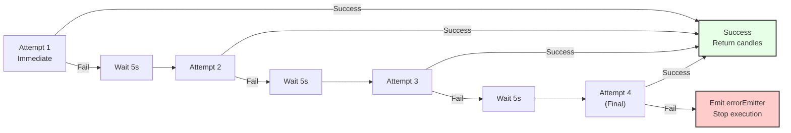
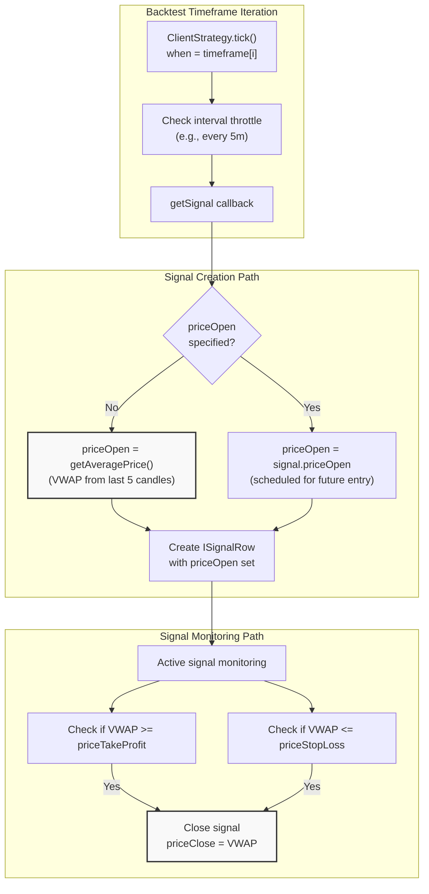

# Candle Data and VWAP

# Candle Data and VWAP

<details>
<summary>Relevant source files</summary>

The following files were used as context for generating this wiki page:

- [README.md](README.md)
- [src/config/emitters.ts](src/config/emitters.ts)
- [src/config/params.ts](src/config/params.ts)
- [src/function/event.ts](src/function/event.ts)
- [src/function/setup.ts](src/function/setup.ts)
- [src/helpers/toProfitLossDto.ts](src/helpers/toProfitLossDto.ts)
- [src/index.ts](src/index.ts)
- [src/interfaces/Heatmap.interface.ts](src/interfaces/Heatmap.interface.ts)
- [src/lib/services/validation/ConfigValidationService.ts](src/lib/services/validation/ConfigValidationService.ts)
- [test/config/setup.mjs](test/config/setup.mjs)
- [test/e2e/config.test.mjs](test/e2e/config.test.mjs)
- [test/e2e/defend.test.mjs](test/e2e/defend.test.mjs)
- [test/e2e/risk.test.mjs](test/e2e/risk.test.mjs)
- [test/e2e/sanitize.test.mjs](test/e2e/sanitize.test.mjs)
- [test/index.mjs](test/index.mjs)
- [test/mock/getMockCandles.mjs](test/mock/getMockCandles.mjs)
- [test/spec/config.test.mjs](test/spec/config.test.mjs)
- [test/spec/heat.test.mjs](test/spec/heat.test.mjs)
- [test/spec/list.test.mjs](test/spec/list.test.mjs)
- [types.d.ts](types.d.ts)

</details>


This page documents the candlestick data structure (`ICandleData`), Volume-Weighted Average Price (VWAP) calculation for realistic trade execution pricing, and data quality mechanisms including anomaly detection and retry logic for handling incomplete or failed candle fetches.

For exchange configuration and data source integration, see [Exchange Configuration](./22-exchange-configuration.md). For timeframe generation and backtest iteration, see [Timeframes and Frames](./24-timeframes-and-frames.md).

---

## Candle Data Structure

All market data in the framework is represented using the `ICandleData` interface, which contains standard OHLCV (Open-High-Low-Close-Volume) candlestick fields:

| Field | Type | Description |
|-------|------|-------------|
| `timestamp` | `number` | Unix timestamp in milliseconds when candle opened |
| `open` | `number` | Opening price at candle start |
| `high` | `number` | Highest price during candle period |
| `low` | `number` | Lowest price during candle period |
| `close` | `number` | Closing price at candle end |
| `volume` | `number` | Trading volume during candle period |

This structure is used consistently across:
- Exchange `getCandles()` implementations (historical data)
- Backtest fast-forward processing via `getNextCandles()`
- VWAP calculation for realistic entry/exit pricing

**Sources:** [types.d.ts:287-308]()

---

## VWAP Calculation

### Purpose and Formula

VWAP (Volume-Weighted Average Price) provides realistic execution pricing by weighting candle prices by their trading volume. This prevents unrealistic backtest results from using simple average or close prices.

**Formula:**
```
Typical Price = (High + Low + Close) / 3
VWAP = Σ(Typical Price × Volume) / Σ(Volume)
```

The calculation uses the last N candles (configured via `CC_AVG_PRICE_CANDLES_COUNT`) to smooth short-term volatility while remaining responsive to price movements.

### Configuration Parameters

```typescript
CC_AVG_PRICE_CANDLES_COUNT: 5  // Default: 5 1-minute candles
```

This parameter controls:
- Number of recent candles to include in VWAP calculation
- Sensitivity to price changes (lower = more responsive, higher = more stable)
- Minimum data requirement for calculation

**Typical Usage:**
- `5 candles`: Standard for 1-minute intervals (last 5 minutes)
- `10+ candles`: Smoother VWAP for higher timeframes or volatile assets
- `3 candles`: More responsive for fast-moving markets (minimum recommended)

**Sources:** [types.d.ts:14-15](), [src/config/params.ts:8-11]()

---

## VWAP Calculation Flow



**Sources:** [types.d.ts:367-413]()

---

## Anomaly Detection for Incomplete Candles

### Problem Statement

Exchange APIs (particularly Binance) occasionally return incomplete candles with anomalously low prices:

| Normal Candle | Incomplete Candle | Issue |
|---------------|-------------------|-------|
| `open: 42000` | `open: 0.1` | 420,000× lower (factor violation) |
| `volume: 100` | `volume: 0` | Zero volume indicator |
| `close: 42050` | `close: 0.12` | Far below market price |

These anomalies cause:
- False signal generation (apparent 99.9% price drops)
- Incorrect VWAP calculations
- Misleading backtest results

### Detection Algorithm

The framework implements two-stage anomaly detection:

**Stage 1: Calculate Reference Price**

```typescript
// If sufficient candles, use median (robust to outliers)
if (candles.length >= CC_GET_CANDLES_MIN_CANDLES_FOR_MEDIAN) {
  referencePrice = median([all OHLC prices])
} else {
  // For small datasets, use average (more stable)
  referencePrice = average([all OHLC prices])
}
```

**Stage 2: Validate Against Threshold**

```typescript
threshold = referencePrice / CC_GET_CANDLES_PRICE_ANOMALY_THRESHOLD_FACTOR

for each price in candle {
  if (price < threshold) {
    throw Error("Anomalously low price detected")
  }
}
```

### Configuration Parameters

| Parameter | Default | Purpose |
|-----------|---------|---------|
| `CC_GET_CANDLES_PRICE_ANOMALY_THRESHOLD_FACTOR` | `1000` | Maximum allowed deviation factor |
| `CC_GET_CANDLES_MIN_CANDLES_FOR_MEDIAN` | `5` | Minimum candles for median calculation |

**Example:** BTC at $50,000 median
- Threshold: $50,000 / 1,000 = $50
- Catches incomplete candles with prices $0.01-$1 (typical incomplete values)
- Allows legitimate price ranges ($45,000-$55,000)

### Rationale for Factor 1000

```
Factor   | BTC Threshold | Catches Anomalies? | False Positives?
---------|---------------|-------------------|------------------
100      | $500          | ✓ Yes            | ✗ Too permissive
1,000    | $50           | ✓ Yes            | ✓ Optimal
10,000   | $5            | ✓ Yes            | ✗ Too strict (altcoins)
```

**Sources:** [types.d.ts:80-106](), [src/config/params.ts:76-104](), [test/e2e/sanitize.test.mjs:666-784]()

---

## Anomaly Detection Flow Diagram



**Sources:** [types.d.ts:80-106](), [test/e2e/sanitize.test.mjs:666-784]()

---

## Retry Logic for Failed Requests

### Configuration

```typescript
CC_GET_CANDLES_RETRY_COUNT: 3       // Number of retry attempts
CC_GET_CANDLES_RETRY_DELAY_MS: 5000 // Delay between retries (5 seconds)
```

### Retry Scenarios

The framework automatically retries `getCandles()` calls on:

1. **Network failures** (connection timeout, DNS errors)
2. **Exchange API errors** (rate limits, temporary unavailability)
3. **Anomaly detection failures** (incomplete candles rejected)

### Retry Strategy



**Total Time Budget:** `3 retries × 5 seconds = 15 seconds` (plus request time)

**Sources:** [types.d.ts:69-78](), [src/config/params.ts:66-74]()

---

## Integration with Strategy Execution

### Entry Price Determination

When strategies generate signals, the entry price (`priceOpen`) is determined based on signal type:

| Signal Type | Entry Price | Source |
|-------------|-------------|--------|
| **Immediate** (no `priceOpen`) | Current VWAP | `getAveragePrice()` |
| **Scheduled** (with `priceOpen`) | User-specified | Signal DTO |

### VWAP Usage in Backtest



**Key Points:**
- VWAP provides realistic execution prices (not optimistic high/low)
- Slippage and fees are applied on top of VWAP in PnL calculation
- Backtest uses `getNextCandles()` to simulate future price action for TP/SL checks

**Sources:** [types.d.ts:367-413]()

---

## Usage Examples

### Accessing VWAP in Strategy

```typescript
import { getAveragePrice } from 'backtest-kit';

addStrategy({
  strategyName: 'vwap-based-strategy',
  interval: '5m',
  getSignal: async (symbol) => {
    // Get current VWAP (last 5 candles by default)
    const currentPrice = await getAveragePrice(symbol);
    
    // Optional: Get custom candle count via getCandles
    const candles = await getCandles(symbol, '1m', 10);
    
    return {
      position: 'long',
      priceTakeProfit: currentPrice * 1.02,  // 2% above VWAP
      priceStopLoss: currentPrice * 0.98,    // 2% below VWAP
      minuteEstimatedTime: 60
    };
  }
});
```

### Configuring VWAP Calculation

```typescript
import { setConfig } from 'backtest-kit';

// Use 10 candles for smoother VWAP (less noise)
setConfig({
  CC_AVG_PRICE_CANDLES_COUNT: 10
});

// Increase retry tolerance for unreliable exchange API
setConfig({
  CC_GET_CANDLES_RETRY_COUNT: 5,
  CC_GET_CANDLES_RETRY_DELAY_MS: 3000  // 3 seconds between retries
});
```

### Handling Anomaly Detection

```typescript
import { listenError } from 'backtest-kit';

// Monitor anomaly detection failures
listenError((error) => {
  if (error.message.includes('VALIDATE_NO_INCOMPLETE_CANDLES_FN')) {
    console.error('Incomplete candle detected and rejected:', error);
    // Alert monitoring system, log for debugging
  }
});
```

**Sources:** [types.d.ts:14-15](), [src/config/params.ts:8-11](), [test/e2e/sanitize.test.mjs:666-784]()

---

## Configuration Summary

| Parameter | Default | Valid Range | Impact |
|-----------|---------|-------------|--------|
| `CC_AVG_PRICE_CANDLES_COUNT` | `5` | 1-50 | Number of candles for VWAP calculation |
| `CC_GET_CANDLES_RETRY_COUNT` | `3` | 0-10 | Number of retry attempts on failure |
| `CC_GET_CANDLES_RETRY_DELAY_MS` | `5000` | 1000-30000 | Milliseconds between retries |
| `CC_GET_CANDLES_PRICE_ANOMALY_THRESHOLD_FACTOR` | `1000` | 100-10000 | Maximum price deviation factor |
| `CC_GET_CANDLES_MIN_CANDLES_FOR_MEDIAN` | `5` | 3-20 | Minimum candles to use median vs average |

**Trade-offs:**
- **Higher `CC_AVG_PRICE_CANDLES_COUNT`**: Smoother VWAP, less responsive to sudden moves
- **Higher `CC_GET_CANDLES_RETRY_COUNT`**: More resilient to temporary failures, slower execution on persistent errors
- **Lower `CC_GET_CANDLES_PRICE_ANOMALY_THRESHOLD_FACTOR`**: Stricter anomaly detection, may reject valid low-cap altcoin prices

**Sources:** [src/config/params.ts:8-104](), [types.d.ts:14-15, 69-106]()