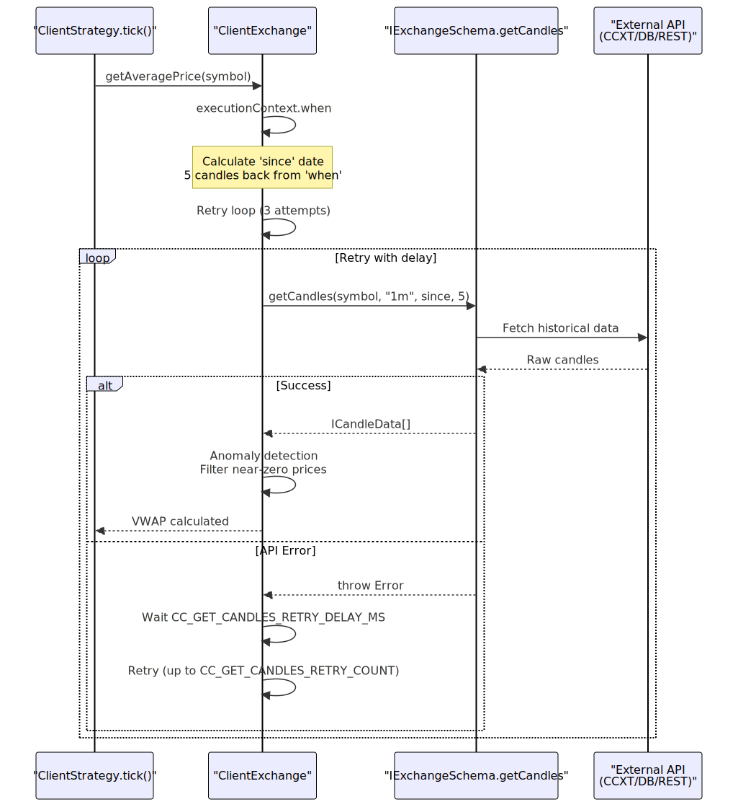
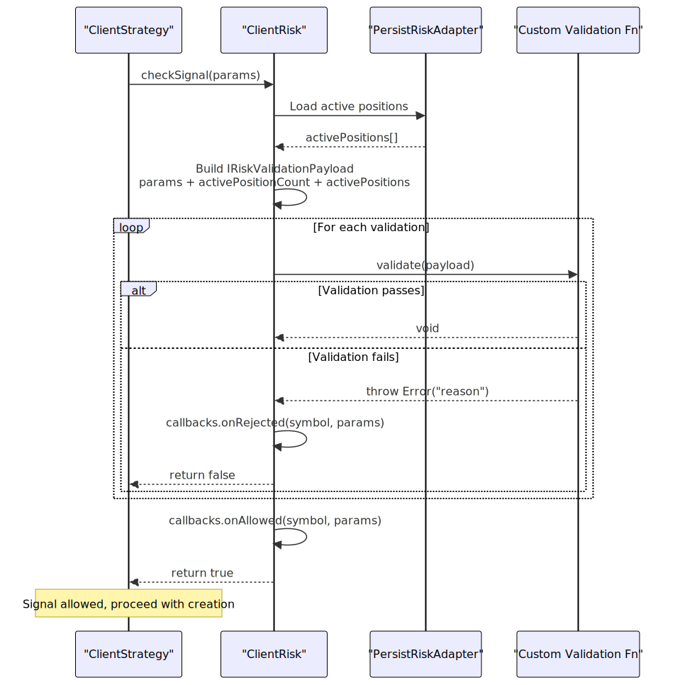
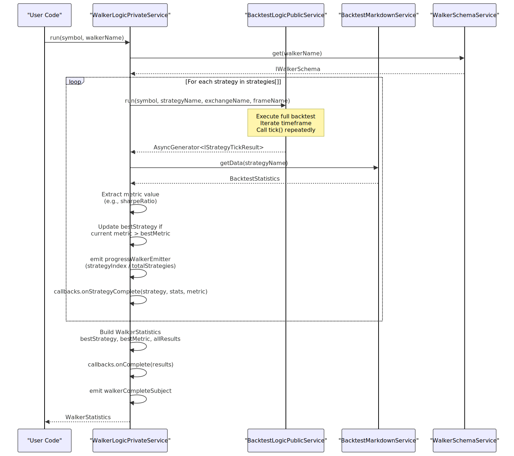

# Component Types

Component types define the schema interfaces for all registerable components in the backtest-kit framework. Each component type represents a distinct architectural concern: strategies define signal generation logic, exchanges provide market data, frames specify backtesting periods, risk profiles enforce portfolio constraints, sizing algorithms calculate position quantities, walkers orchestrate strategy comparisons, and optimizers generate AI-powered strategies. All components are registered via `add*` functions that validate schemas and store them in corresponding schema services for dependency injection.

For information about how these components are instantiated and connected at runtime, see [Service Layer](./38_Service_Layer.md). For details on the registration and validation process, see [Component Registration](./08_Component_Registration.md). For the public API signatures of registration functions, see [Component Registration Functions](./16_Component_Registration_Functions.md).

---

## Component Type Architecture

The framework organizes components into seven distinct types, each registered through a dedicated function and validated by a corresponding service. All schemas follow a consistent pattern: a required `name` field for unique identification, optional `note` field for documentation, required configuration parameters specific to the component type, and optional `callbacks` object for lifecycle hooks.




---

## Schema Interface Pattern

All component schemas share a common structural pattern with three tiers of fields: identification (unique name), configuration (component-specific parameters), and hooks (optional lifecycle callbacks). The name field serves as the primary key in schema services, configuration fields define component behavior, and callbacks enable event-driven integration with external systems.

| Field Category | Purpose | Common Fields | Component-Specific |
|---|---|---|---|
| **Identification** | Unique component reference | `*Name: string` (strategyName, exchangeName, etc.) | Required for all types |
| **Documentation** | Developer annotations | `note?: string` | Optional for all types |
| **Configuration** | Component behavior | Varies by type | Required, type-specific validation |
| **Lifecycle Hooks** | Event callbacks | `callbacks?: Partial<I*Callbacks>` | Optional, type-specific events |


---

## Registration and Validation Flow

Component registration follows a three-phase pipeline: user code calls an `add*` function with a schema object, the function delegates to a validation service that applies 10-30 validation rules depending on component type, and upon successful validation the schema is stored in a schema service for later retrieval by connection services during execution.


---

## Strategy Schemas (IStrategySchema)

Strategy schemas define signal generation logic through a required `getSignal` function that returns trading signals or null. The schema specifies signal generation interval for throttling, optional risk profile reference for portfolio-level constraints, and lifecycle callbacks that fire on signal state transitions (idle, scheduled, opened, active, closed, cancelled).

### Interface Structure

```typescript
interface IStrategySchema {
  strategyName: StrategyName;           // Unique identifier (string)
  note?: string;                        // Optional documentation
  interval: SignalInterval;             // "1m" | "3m" | "5m" | "15m" | "30m" | "1h"
  getSignal: (symbol: string, when: Date) => Promise<ISignalDto | null>;
  callbacks?: Partial<IStrategyCallbacks>;
  riskName?: RiskName;                  // Optional risk profile reference
}

type SignalInterval = "1m" | "3m" | "5m" | "15m" | "30m" | "1h";
type StrategyName = string;
```

**Key Fields:**

- **`strategyName`**: Primary key for strategy lookup in `StrategySchemaService`. Must be unique across all registered strategies.
- **`interval`**: Minimum time between `getSignal()` calls. Enforced by `ClientStrategy._lastSignalTimestamp` to prevent signal spam. Converted to milliseconds via `INTERVAL_MINUTES` lookup table.
- **`getSignal`**: Core signal generation function. Returns `ISignalDto` with prices and timing, or `null` if no opportunity. If `priceOpen` is provided in the returned DTO, creates a scheduled signal waiting for price activation; if omitted, opens immediately at current VWAP.
- **`riskName`**: Optional reference to `IRiskSchema` for portfolio-level risk management. If provided, `ClientRisk.checkSignal()` is called before signal creation and activation.
- **`callbacks`**: Optional hooks for signal lifecycle events (see callback diagram below).


### Signal DTO Structure

The `ISignalDto` object returned by `getSignal()` is transformed into `ISignalRow` with additional metadata before storage. The framework auto-generates `id` (UUID v4), sets `priceOpen` to current VWAP if omitted, injects `symbol`/`exchangeName`/`strategyName` from context, and records `scheduledAt`/`pendingAt` timestamps.

```typescript
interface ISignalDto {
  id?: string;                          // Optional (auto-generated UUID v4)
  position: "long" | "short";           // Trade direction
  note?: string;                        // Human-readable signal reason
  priceOpen?: number;                   // Entry price (if provided → scheduled signal)
  priceTakeProfit: number;              // TP target (must be > priceOpen for long)
  priceStopLoss: number;                // SL exit (must be < priceOpen for long)
  minuteEstimatedTime: number;          // Max signal lifetime before time_expired
}

interface ISignalRow extends ISignalDto {
  id: string;                           // Required after transformation
  priceOpen: number;                    // Required after transformation
  exchangeName: ExchangeName;           // Injected from context
  strategyName: StrategyName;           // Injected from context
  symbol: string;                       // Injected from context
  scheduledAt: number;                  // Signal creation timestamp (ms)
  pendingAt: number;                    // Activation timestamp (ms)
  _isScheduled: boolean;                // Internal marker for scheduled signals
}
```

**Validation Rules (30+ checks):**

1. **Required fields:** `position`, `priceTakeProfit`, `priceStopLoss`, `minuteEstimatedTime`
2. **NaN/Infinity protection:** All prices must be finite numbers
3. **Positive prices:** All prices must be > 0
4. **Long position logic:** `priceTakeProfit > priceOpen > priceStopLoss`
5. **Short position logic:** `priceStopLoss > priceOpen > priceTakeProfit`
6. **Edge case protection:** For immediate signals, `currentPrice` must not have breached SL/TP
7. **Micro-profit prevention:** TP distance must exceed `CC_MIN_TAKEPROFIT_DISTANCE_PERCENT` (default 0.3%) to cover trading fees
8. **Extreme SL protection:** SL distance must not exceed `CC_MAX_STOPLOSS_DISTANCE_PERCENT` (default 20%)
9. **Time limits:** `minuteEstimatedTime` must not exceed `CC_MAX_SIGNAL_LIFETIME_MINUTES` (default 1440 = 1 day)


### Strategy Lifecycle Callbacks

Strategy callbacks fire at eight distinct lifecycle points, providing hooks for logging, monitoring, and custom business logic. All callbacks receive the `backtest` boolean flag to distinguish between historical simulation and live trading.



**Callback Interface:**

```typescript
interface IStrategyCallbacks {
  onTick: (symbol: string, result: IStrategyTickResult, backtest: boolean) => void;
  onIdle: (symbol: string, currentPrice: number, backtest: boolean) => void;
  onSchedule: (symbol: string, data: IScheduledSignalRow, currentPrice: number, backtest: boolean) => void;
  onOpen: (symbol: string, data: ISignalRow, currentPrice: number, backtest: boolean) => void;
  onActive: (symbol: string, data: ISignalRow, currentPrice: number, backtest: boolean) => void;
  onPartialProfit: (symbol: string, data: ISignalRow, currentPrice: number, revenuePercent: number, backtest: boolean) => void;
  onPartialLoss: (symbol: string, data: ISignalRow, currentPrice: number, lossPercent: number, backtest: boolean) => void;
  onClose: (symbol: string, data: ISignalRow, priceClose: number, backtest: boolean) => void;
  onCancel: (symbol: string, data: IScheduledSignalRow, currentPrice: number, backtest: boolean) => void;
  onWrite: (symbol: string, data: ISignalRow | null, backtest: boolean) => void;
}
```

**Callback Invocation Points:**

- **`onTick`**: Called at the end of every `tick()` call with the discriminated union result (`IStrategyTickResult`). Use for comprehensive state tracking.
- **`onIdle`**: Fired when no active signal exists and `getSignal()` returns null.
- **`onSchedule`**: Triggered when `getSignal()` returns a signal with `priceOpen` specified. Signal is written to persistence layer (live mode only).
- **`onOpen`**: Called when signal opens (either immediate open or scheduled signal activation). Occurs after risk validation and persistence write.
- **`onActive`**: Fires on every tick while monitoring an active position (between open and close). Useful for real-time monitoring dashboards.
- **`onPartialProfit`**: Emitted when unrealized profit crosses 10%/20%/30%/...100% thresholds. Deduplicated via `ClientPartial` state tracking.
- **`onPartialLoss`**: Emitted when unrealized loss crosses -10%/-20%/-30%/...-100% thresholds. Deduplicated via `ClientPartial` state tracking.
- **`onClose`**: Triggered when signal closes with `closeReason` ("take_profit" | "stop_loss" | "time_expired") and calculated PnL. Signal is removed from persistence layer.
- **`onCancel`**: Fires when scheduled signal is cancelled without opening (timeout or pre-activation SL breach).
- **`onWrite`**: Low-level hook called whenever signal state is persisted (open) or cleared (close/cancel). Used for testing persistence layer.


### Registration Example

```typescript
import { addStrategy } from "backtest-kit";

addStrategy({
  strategyName: "rsi-oversold-long",
  note: "Buy when RSI < 30, sell at +2% TP or -1% SL",
  interval: "5m",
  riskName: "conservative",
  
  getSignal: async (symbol, when) => {
    const rsi = await calculateRSI(symbol, when, 14);
    
    if (rsi >= 30) {
      return null; // No signal
    }
    
    const currentPrice = await getCurrentPrice(symbol);
    
    return {
      position: "long",
      note: `RSI oversold: ${rsi.toFixed(2)}`,
      priceTakeProfit: currentPrice * 1.02,  // +2%
      priceStopLoss: currentPrice * 0.99,     // -1%
      minuteEstimatedTime: 120,               // 2 hours
    };
  },
  
  callbacks: {
    onOpen: (symbol, signal, currentPrice, backtest) => {
      console.log(`[OPEN] ${symbol} ${signal.position} @ ${currentPrice}`);
    },
    onClose: (symbol, signal, priceClose, backtest) => {
      console.log(`[CLOSE] ${symbol} @ ${priceClose}`);
    },
  },
});
```


---

## Exchange Schemas (IExchangeSchema)

Exchange schemas provide market data access through three required functions: `getCandles` for historical OHLCV data, `formatPrice` for exchange-specific price precision, and `formatQuantity` for lot size formatting. Exchanges integrate with CCXT libraries, databases, or custom REST APIs to supply candle data for backtesting and VWAP calculation.

### Interface Structure

```typescript
interface IExchangeSchema {
  exchangeName: ExchangeName;
  note?: string;
  getCandles: (symbol: string, interval: CandleInterval, since: Date, limit: number) => Promise<ICandleData[]>;
  formatQuantity: (symbol: string, quantity: number) => Promise<string>;
  formatPrice: (symbol: string, price: number) => Promise<string>;
  callbacks?: Partial<IExchangeCallbacks>;
}

type CandleInterval = "1m" | "3m" | "5m" | "15m" | "30m" | "1h" | "2h" | "4h" | "6h" | "8h";
type ExchangeName = string;

interface ICandleData {
  timestamp: number;  // Unix milliseconds
  open: number;
  high: number;
  low: number;
  close: number;
  volume: number;
}
```

**Key Fields:**

- **`exchangeName`**: Primary key for exchange lookup in `ExchangeSchemaService`. Used to route candle requests to correct data source.
- **`getCandles`**: Core data fetching function. Must return array of `ICandleData` sorted by timestamp ascending. Called by `ClientExchange.getCandles()` with retry logic (`CC_GET_CANDLES_RETRY_COUNT` = 3 attempts, `CC_GET_CANDLES_RETRY_DELAY_MS` = 5000ms delay).
- **`formatPrice`**: Exchange-specific price formatting (e.g., 2 decimals for BTC/USDT, 8 decimals for alts). Used when displaying prices in reports.
- **`formatQuantity`**: Lot size formatting based on exchange rules (e.g., minimum quantity = 0.001 BTC). Used for position sizing display.
- **`callbacks.onCandleData`**: Optional hook called after successful candle fetch. Receives `symbol`, `interval`, `since`, `limit`, and fetched `data` array.


### Candle Data Flow

`ClientExchange` wraps the schema's `getCandles` function with additional logic: anomaly detection filters out incomplete candles with near-zero prices, retry logic handles transient API failures, and execution context determines whether to fetch backward (past candles) or forward (future candles for backtest fast-forward).



**Anomaly Detection Logic:**

The framework applies price anomaly detection to filter incomplete candles from Binance API responses. Candles with prices below `median / CC_GET_CANDLES_PRICE_ANOMALY_THRESHOLD_FACTOR` (default 1000x deviation) are rejected. This catches incomplete candles with $0.01-$1 prices when median is $20k-$100k.


### Exchange Callbacks

```typescript
interface IExchangeCallbacks {
  onCandleData: (symbol: string, interval: CandleInterval, since: Date, limit: number, data: ICandleData[]) => void;
}
```

**`onCandleData`**: Called after successful candle fetch but before anomaly detection. Receives all parameters passed to `getCandles` plus the returned data array. Useful for logging, caching, or monitoring data source health.


### Registration Example

```typescript
import { addExchange } from "backtest-kit";
import ccxt from "ccxt";

const binance = new ccxt.binance({ enableRateLimit: true });

addExchange({
  exchangeName: "binance-spot",
  note: "Binance spot market via CCXT",
  
  getCandles: async (symbol, interval, since, limit) => {
    const ohlcv = await binance.fetchOHLCV(symbol, interval, since.getTime(), limit);
    return ohlcv.map(([timestamp, open, high, low, close, volume]) => ({
      timestamp,
      open,
      high,
      low,
      close,
      volume,
    }));
  },
  
  formatPrice: async (symbol, price) => {
    const market = await binance.loadMarkets();
    const precision = market[symbol].precision.price;
    return price.toFixed(precision);
  },
  
  formatQuantity: async (symbol, quantity) => {
    const market = await binance.loadMarkets();
    const precision = market[symbol].precision.amount;
    return quantity.toFixed(precision);
  },
  
  callbacks: {
    onCandleData: (symbol, interval, since, limit, data) => {
      console.log(`Fetched ${data.length} ${interval} candles for ${symbol}`);
    },
  },
});
```


---

## Frame Schemas (IFrameSchema)

Frame schemas define backtesting time periods by specifying `startDate`, `endDate`, and `interval` for timeframe generation. The framework generates an array of `Date` objects spaced by the interval, which `BacktestLogicPrivateService` iterates through when calling `ClientStrategy.tick()` for each timestamp.

### Interface Structure

```typescript
interface IFrameSchema {
  frameName: FrameName;
  note?: string;
  interval: FrameInterval;
  startDate: Date;
  endDate: Date;
  callbacks?: Partial<IFrameCallbacks>;
}

type FrameInterval = "1m" | "3m" | "5m" | "15m" | "30m" | "1h" | "2h" | "4h" | "6h" | "8h" | "12h" | "1d" | "3d";
type FrameName = string;
```

**Key Fields:**

- **`frameName`**: Primary key for frame lookup in `FrameSchemaService`. Used by backtest and walker modes to retrieve timeframe generators.
- **`interval`**: Spacing between generated timestamps. Converted to milliseconds and added iteratively from `startDate` to `endDate`.
- **`startDate`**: Inclusive start of backtest period. First generated timestamp.
- **`endDate`**: Inclusive end of backtest period. Last generated timestamp (may be truncated to align with interval).
- **`callbacks.onTimeframe`**: Optional hook called after timeframe array generation. Receives the complete array, start/end dates, and interval.


### Timeframe Generation Logic

`ClientFrame.getTimeframe()` generates timestamps by starting at `startDate` and incrementing by `interval` milliseconds until exceeding `endDate`. The resulting array is chronologically ordered and used by `BacktestLogicPrivateService` for sequential strategy execution.


**Interval to Milliseconds Conversion:**

| Interval | Milliseconds | Duration |
|---|---|---|
| `"1m"` | 60,000 | 1 minute |
| `"5m"` | 300,000 | 5 minutes |
| `"15m"` | 900,000 | 15 minutes |
| `"1h"` | 3,600,000 | 1 hour |
| `"1d"` | 86,400,000 | 1 day |


### Frame Callbacks

```typescript
interface IFrameCallbacks {
  onTimeframe: (timeframe: Date[], startDate: Date, endDate: Date, interval: FrameInterval) => void;
}
```

**`onTimeframe`**: Called once after timeframe array generation. Receives the complete array of timestamps, the original start/end dates, and the interval. Useful for logging timeframe size or validating date ranges before backtest execution.


### Registration Example

```typescript
import { addFrame } from "backtest-kit";

addFrame({
  frameName: "2024-q1-1h",
  note: "Q1 2024 backtest with 1-hour intervals",
  interval: "1h",
  startDate: new Date("2024-01-01T00:00:00Z"),
  endDate: new Date("2024-03-31T23:59:59Z"),
  
  callbacks: {
    onTimeframe: (timeframe, startDate, endDate, interval) => {
      console.log(`Generated ${timeframe.length} timestamps`);
      console.log(`First: ${timeframe[0].toISOString()}`);
      console.log(`Last: ${timeframe[timeframe.length - 1].toISOString()}`);
    },
  },
});
```


---

## Risk Schemas (IRiskSchema)

Risk schemas enforce portfolio-level constraints through custom validation functions that execute before signal creation and activation. Each validation receives the current risk check parameters (symbol, strategy, price, timestamp) plus portfolio state (active position count, active positions array) and throws errors to reject signals that violate risk rules.

### Interface Structure

```typescript
interface IRiskSchema {
  riskName: RiskName;
  note?: string;
  callbacks?: Partial<IRiskCallbacks>;
  validations: (IRiskValidation | IRiskValidationFn)[];
}

type RiskName = string;

interface IRiskValidation {
  validate: IRiskValidationFn;
  note?: string;
}

interface IRiskValidationFn {
  (payload: IRiskValidationPayload): void | Promise<void>;
}

interface IRiskValidationPayload extends IRiskCheckArgs {
  activePositionCount: number;
  activePositions: IRiskActivePosition[];
}

interface IRiskCheckArgs {
  symbol: string;
  strategyName: StrategyName;
  exchangeName: ExchangeName;
  currentPrice: number;
  timestamp: number;
}

interface IRiskActivePosition {
  signal: ISignalRow;
  strategyName: string;
  exchangeName: string;
  openTimestamp: number;
}
```

**Key Fields:**

- **`riskName`**: Primary key for risk lookup in `RiskSchemaService`. Referenced by `IStrategySchema.riskName` to link strategies to risk profiles.
- **`validations`**: Array of validation functions or objects. Each is executed sequentially during `ClientRisk.checkSignal()`. If any throws, signal is rejected.
- **`callbacks.onRejected`**: Optional hook called when a signal fails risk validation. Receives symbol and risk check parameters.
- **`callbacks.onAllowed`**: Optional hook called when a signal passes all risk validations.


### Validation Execution Flow

`ClientRisk.checkSignal()` is called twice per signal lifecycle: once before `getSignal()` (pre-generation check) and once at scheduled signal activation (pre-open check). Each validation in the `validations` array is executed sequentially with access to current portfolio state via `PersistRiskAdapter`.




### Active Position Tracking

`ClientRisk` maintains a registry of active positions via `PersistRiskAdapter` (live mode) or in-memory Map (backtest mode). Positions are added via `addSignal()` when signals open and removed via `removeSignal()` when signals close. The active positions array is injected into validation payloads, enabling cross-strategy portfolio analysis.

```typescript
interface IRiskActivePosition {
  signal: ISignalRow;         // Complete signal data (prices, TP/SL, etc.)
  strategyName: string;       // Strategy that owns this position
  exchangeName: string;       // Exchange for this position
  openTimestamp: number;      // When position opened (ms)
}
```

**Position Lifecycle:**

1. **Add:** `ClientStrategy.OPEN_NEW_PENDING_SIGNAL_FN()` calls `risk.addSignal()` after signal opens
2. **Validate:** Custom validations access `payload.activePositions` during `checkSignal()`
3. **Remove:** `ClientStrategy.CLOSE_PENDING_SIGNAL_FN()` calls `risk.removeSignal()` after signal closes


### Risk Callbacks

```typescript
interface IRiskCallbacks {
  onRejected: (symbol: string, params: IRiskCheckArgs) => void;
  onAllowed: (symbol: string, params: IRiskCheckArgs) => void;
}
```

**Callbacks:**

- **`onRejected`**: Fired when any validation throws an error. Receives symbol and original check parameters (includes currentPrice, timestamp).
- **`onAllowed`**: Fired when all validations pass. Receives symbol and check parameters.


### Registration Example

```typescript
import { addRisk } from "backtest-kit";

addRisk({
  riskName: "portfolio-limit-5",
  note: "Maximum 5 concurrent positions across all strategies",
  
  validations: [
    {
      validate: ({ activePositionCount }) => {
        if (activePositionCount >= 5) {
          throw new Error("Maximum 5 concurrent positions reached");
        }
      },
      note: "Basic position count limit",
    },
    
    async ({ symbol, activePositions, currentPrice }) => {
      // Check symbol exposure
      const symbolPositions = activePositions.filter(p => p.signal.symbol === symbol);
      if (symbolPositions.length >= 2) {
        throw new Error(`Maximum 2 positions per symbol (${symbol} already has ${symbolPositions.length})`);
      }
      
      // Check portfolio drawdown
      const portfolio = await getPortfolioState();
      if (portfolio.drawdown > 15) {
        throw new Error(`Portfolio drawdown ${portfolio.drawdown.toFixed(2)}% exceeds 15% limit`);
      }
    },
  ],
  
  callbacks: {
    onRejected: (symbol, params) => {
      console.log(`[RISK REJECT] ${symbol} for ${params.strategyName}`);
    },
    onAllowed: (symbol, params) => {
      console.log(`[RISK ALLOW] ${symbol} for ${params.strategyName}`);
    },
  },
});
```


---

## Sizing Schemas (ISizingSchema)

Sizing schemas calculate position quantities using three algorithms: fixed-percentage (risk a fixed % of account per trade), kelly-criterion (optimal bet sizing based on win rate), or ATR-based (size positions based on volatility). Each method requires different configuration parameters in a discriminated union structure.

### Interface Structure

```typescript
type ISizingSchema = 
  | ISizingSchemaFixedPercentage 
  | ISizingSchemaKellyCriterion 
  | ISizingSchemaATRBased;

// Fixed percentage method
interface ISizingSchemaFixedPercentage {
  sizingName: SizingName;
  note?: string;
  method: "fixed-percentage";
  riskPercentage: number;           // % of account to risk per trade
  maxPositionPercentage?: number;   // Optional max position size
  minPositionSize?: number;
  maxPositionSize?: number;
  callbacks?: Partial<ISizingCallbacks>;
}

// Kelly Criterion method
interface ISizingSchemaKellyCriterion {
  sizingName: SizingName;
  note?: string;
  method: "kelly-criterion";
  kellyMultiplier?: number;         // Default 0.25 (quarter-kelly)
  maxPositionPercentage?: number;
  minPositionSize?: number;
  maxPositionSize?: number;
  callbacks?: Partial<ISizingCallbacks>;
}

// ATR-based method
interface ISizingSchemaATRBased {
  sizingName: SizingName;
  note?: string;
  method: "atr-based";
  riskPercentage: number;
  atrMultiplier?: number;           // Default 2.0
  maxPositionPercentage?: number;
  minPositionSize?: number;
  maxPositionSize?: number;
  callbacks?: Partial<ISizingCallbacks>;
}

type SizingName = string;
```

**Key Fields:**

- **`sizingName`**: Primary key for sizing lookup in `SizingSchemaService`.
- **`method`**: Discriminator field determines which algorithm to use. Each method requires different parameters.
- **`riskPercentage`**: For fixed-percentage and ATR-based. Percentage of account to risk per trade (e.g., 2 = risk 2% per trade).
- **`kellyMultiplier`**: For Kelly Criterion. Reduces full Kelly size to prevent over-leveraging (0.25 = quarter-Kelly). Formula: `position = kellyMultiplier × (winRate - (1 - winRate) / (avgWin / avgLoss))`.
- **`atrMultiplier`**: For ATR-based. Multiplies ATR to set stop loss distance. Larger values = wider stops = smaller positions.
- **`maxPositionPercentage`**: Optional cap on position size as percentage of account balance.
- **`minPositionSize`/`maxPositionSize`**: Optional absolute quantity limits.


### Position Sizing Algorithms

The three sizing methods optimize for different objectives: fixed-percentage maintains consistent risk per trade, Kelly Criterion maximizes long-term growth rate based on historical win rate, and ATR-based adjusts position size inversely to market volatility.



**Algorithm Details:**

1. **Fixed Percentage:** 
   - Risk amount = `accountBalance × (riskPercentage / 100)`
   - Position = `riskAmount / (priceOpen - priceStopLoss)` for long
   - Simple, predictable risk per trade

2. **Kelly Criterion:**
   - Requires historical win rate and profit factor
   - Formula: `kelly = (winRate × avgWin - lossRate × avgLoss) / avgWin`
   - Position = `kellyMultiplier × kelly × accountBalance / currentPrice`
   - Optimal for maximizing long-term growth

3. **ATR-Based:**
   - Calculates Average True Range from recent candles
   - Stop distance = `ATR × atrMultiplier`
   - Position = `(accountBalance × riskPercentage) / stopDistance`
   - Adapts to volatility: smaller positions in volatile markets


### Sizing Callbacks

```typescript
interface ISizingCallbacks {
  onCalculate: (quantity: number, params: ISizingCalculateParams) => void;
}

interface ISizingCalculateParams {
  symbol: string;
  accountBalance: number;
  currentPrice: number;
  signal: ISignalRow;
}
```

**`onCalculate`**: Called after position quantity calculation but before formatting. Receives the raw quantity and calculation parameters. Useful for logging, monitoring, or external position tracking.


### Registration Example

```typescript
import { addSizing } from "backtest-kit";

// Fixed percentage sizing
addSizing({
  sizingName: "fixed-2pct",
  method: "fixed-percentage",
  riskPercentage: 2,
  maxPositionPercentage: 10,
  minPositionSize: 0.001,
  callbacks: {
    onCalculate: (quantity, params) => {
      console.log(`Position size: ${quantity} ${params.symbol}`);
    },
  },
});

// Kelly Criterion sizing
addSizing({
  sizingName: "quarter-kelly",
  method: "kelly-criterion",
  kellyMultiplier: 0.25,
  maxPositionPercentage: 15,
});

// ATR-based sizing
addSizing({
  sizingName: "atr-volatility",
  method: "atr-based",
  riskPercentage: 1.5,
  atrMultiplier: 2,
  maxPositionPercentage: 12,
});
```


---

## Walker Schemas (IWalkerSchema)

Walker schemas orchestrate strategy comparison by running multiple strategies through the same backtest frame and ranking them by a specified metric (sharpeRatio, winRate, avgPnl, etc.). The walker executes strategies serially, collects performance statistics, and identifies the best-performing strategy based on the configured metric.

### Interface Structure

```typescript
interface IWalkerSchema {
  walkerName: WalkerName;
  note?: string;
  exchangeName: ExchangeName;
  frameName: FrameName;
  strategies: StrategyName[];
  metric?: WalkerMetric;              // Default: "sharpeRatio"
  callbacks?: Partial<IWalkerCallbacks>;
}

type WalkerName = string;
type WalkerMetric = 
  | "sharpeRatio" 
  | "winRate" 
  | "avgPnl" 
  | "totalPnl" 
  | "certaintyRatio"
  | "maxDrawdown";
```

**Key Fields:**

- **`walkerName`**: Primary key for walker lookup in `WalkerSchemaService`.
- **`exchangeName`**: Exchange to use for all strategy backtests. Must be registered via `addExchange()`.
- **`frameName`**: Frame to use for all strategy backtests. Must be registered via `addFrame()`.
- **`strategies`**: Array of strategy names to compare. Each must be registered via `addStrategy()`.
- **`metric`**: Performance metric for ranking. Default is `"sharpeRatio"`. Extracted from `BacktestStatistics` after each strategy completes.
- **`callbacks`**: Optional hooks for progress tracking and results.


### Walker Execution Flow

`WalkerLogicPrivateService` iterates through the strategies array sequentially, running a full backtest for each and collecting performance metrics. After all strategies complete, the walker identifies the best strategy by comparing metric values and emits the final results.




### Performance Metrics

Walker compares strategies using one of six performance metrics extracted from `BacktestStatistics`:

| Metric | Description | Formula | Optimization Goal |
|---|---|---|---|
| **sharpeRatio** | Risk-adjusted return | `(avgReturn - riskFreeRate) / stdDevReturn` | Maximize (higher = better) |
| **winRate** | Percentage of winning trades | `winningTrades / totalTrades × 100` | Maximize |
| **avgPnl** | Average profit per trade | `totalPnl / totalTrades` | Maximize |
| **totalPnl** | Cumulative profit | `sum(all signal PnLs)` | Maximize |
| **certaintyRatio** | Win consistency | `winRate × avgWin / avgLoss` | Maximize |
| **maxDrawdown** | Largest peak-to-trough decline | `max((peak - trough) / peak)` | Minimize (invert for comparison) |

**Default Metric:** `"sharpeRatio"` is used if no metric is specified in the schema. Sharpe ratio balances returns against volatility, making it suitable for most strategy comparisons.


### Walker Callbacks

```typescript
interface IWalkerCallbacks {
  onStrategyComplete: (strategyName: string, symbol: string, stats: BacktestStatistics, metric: number) => void;
  onComplete: (results: WalkerStatistics) => void;
}

interface WalkerStatistics {
  bestStrategy: StrategyName;
  bestMetric: number;
  metric: WalkerMetric;
  results: Array<{
    strategyName: StrategyName;
    stats: BacktestStatistics;
    metricValue: number;
  }>;
}
```

**Callbacks:**

- **`onStrategyComplete`**: Fired after each strategy backtest completes. Receives strategy name, symbol, full statistics object, and extracted metric value. Useful for progress tracking.
- **`onComplete`**: Fired once after all strategies complete. Receives complete results including best strategy identification and all strategy metrics.


### Registration Example

```typescript
import { addWalker } from "backtest-kit";

addWalker({
  walkerName: "rsi-parameter-sweep",
  note: "Compare RSI strategies with different oversold thresholds",
  exchangeName: "binance-spot",
  frameName: "2024-q1-1h",
  strategies: [
    "rsi-20-oversold",
    "rsi-25-oversold",
    "rsi-30-oversold",
    "rsi-35-oversold",
  ],
  metric: "sharpeRatio",
  
  callbacks: {
    onStrategyComplete: (strategyName, symbol, stats, metric) => {
      console.log(`${strategyName}: Sharpe ${metric.toFixed(3)}, Win Rate ${stats.winRate?.toFixed(1)}%`);
    },
    onComplete: (results) => {
      console.log(`\nBest strategy: ${results.bestStrategy}`);
      console.log(`Best Sharpe: ${results.bestMetric.toFixed(3)}`);
      
      // Rank all strategies
      results.results
        .sort((a, b) => b.metricValue - a.metricValue)
        .forEach((r, i) => {
          console.log(`${i + 1}. ${r.strategyName}: ${r.metricValue.toFixed(3)}`);
        });
    },
  },
});
```


---

## Optimizer Schemas (IOptimizerSchema)

Optimizer schemas generate AI-powered trading strategies by collecting multi-timeframe market data from specified sources, building LLM conversation histories with the fetched data, generating strategy prompts via `getPrompt()`, and assembling complete executable backtest code using template methods. The optimizer produces a standalone `.mjs` file containing exchange configuration, frame definitions, multiple AI-generated strategies, and walker comparison logic.

### Interface Structure

```typescript
interface IOptimizerSchema {
  optimizerName: OptimizerName;
  note?: string;
  rangeTrain: IOptimizerRange[];
  rangeTest: IOptimizerRange;
  source: (IOptimizerSourceFn | IOptimizerSource)[];
  getPrompt: (symbol: string, messages: IOptimizerMessage[]) => Promise<string>;
  template?: Partial<IOptimizerTemplate>;
  callbacks?: Partial<IOptimizerCallbacks>;
}

type OptimizerName = string;

interface IOptimizerRange {
  note?: string;
  startDate: Date;
  endDate: Date;
}

interface IOptimizerSourceFn {
  (params: IOptimizerSourceParams): Promise<any[]>;
}

interface IOptimizerSource {
  name: string;
  fetch: IOptimizerSourceFn;
  user: (symbol: string, data: any[], sourceName: string) => Promise<string>;
  assistant: (symbol: string, data: any[], sourceName: string) => Promise<string>;
}

interface IOptimizerSourceParams {
  symbol: string;
  startDate: Date;
  endDate: Date;
  limit: number;
  offset: number;
}

interface IOptimizerMessage {
  role: "user" | "assistant";
  content: string;
}
```

**Key Fields:**

- **`optimizerName`**: Primary key for optimizer lookup in `OptimizerSchemaService`.
- **`rangeTrain`**: Array of training date ranges. Each generates a separate strategy variant by analyzing that period's market data. Used for walk-forward validation.
- **`rangeTest`**: Testing date range for strategy validation. Used in the generated walker to evaluate strategies on out-of-sample data.
- **`source`**: Array of data sources (functions or source objects). Each source fetches historical data (candles, indicators, backtest results) for inclusion in LLM conversation. Sources can be simple functions or objects with custom user/assistant message formatters.
- **`getPrompt`**: Strategy generation function. Receives symbol and complete conversation history (all user/assistant messages from all sources across all training ranges). Returns a prompt string that the generated strategy will use to query the LLM at runtime.
- **`template`**: Optional template overrides. Allows customizing the generated code (imports, helpers, strategy logic, walker configuration). Merges with default templates from `OptimizerTemplateService`.
- **`callbacks`**: Optional hooks for monitoring data collection, code generation, and file export.


### Data Collection Pipeline

The optimizer iterates through training ranges and sources in nested loops: for each training range, it fetches data from each source (with pagination support), formats the data into user/assistant message pairs, and appends to the conversation history. After collecting all data, it calls `getPrompt()` with the complete message history to generate a strategy prompt for that training range.


**Pagination Logic:**

Sources are fetched with pagination to handle large datasets. The optimizer starts with `offset = 0`, `limit = 1000`, and repeatedly calls the source function until the returned data length is less than `limit`, indicating no more data. All fetched pages are concatenated and passed to message formatters.


### Code Generation Pipeline

After data collection, the optimizer assembles a complete standalone backtest script by calling 11 template methods in sequence. Each method generates a code section (imports, helpers, configurations, launcher), which are concatenated into a final string and written to disk.

**Template Method Sequence:**

1. **`getTopBanner(symbol)`**: Imports and constants (`import { addStrategy, addExchange, ... }`)
2. **`getJsonDumpTemplate()`**: `dumpJson()` helper for writing results to file
3. **`getTextTemplate()`**: `text()` LLM helper for natural language queries
4. **`getJsonTemplate()`**: `json()` LLM helper for structured JSON extraction
5. **`getExchangeTemplate(symbol, exchangeName)`**: `addExchange()` call with CCXT configuration
6. **`getFrameTemplate(range)` (for each rangeTrain)**: `addFrame()` calls for training periods
7. **`getFrameTemplate(rangeTest)`**: `addFrame()` call for test period
8. **`getStrategyTemplate(strategyName, interval, prompt)` (for each strategy)**: `addStrategy()` calls with LLM integration
9. **`getWalkerTemplate(strategies, metric)`**: `addWalker()` call for strategy comparison
10. **`getLauncherTemplate(walkerName)`**: `Walker.background()` call with event listeners
11. **Custom template overrides** (if provided in schema)

**Generated Code Structure:**

```javascript
// 1. Imports and constants
import { addStrategy, addExchange, addFrame, addWalker, Walker } from "backtest-kit";
const symbol = "BTCUSDT";

// 2-4. Helper functions
function dumpJson(data, filename) { /* ... */ }
async function text(prompt) { /* LLM call via Ollama */ }
async function json(prompt) { /* LLM call via Ollama */ }

// 5. Exchange configuration
addExchange({ exchangeName: "binance", /* ... */ });

// 6-7. Frame configurations
addFrame({ frameName: "train-1", startDate: new Date("2024-01-01"), /* ... */ });
addFrame({ frameName: "test", startDate: new Date("2024-03-01"), /* ... */ });

// 8. Strategy configurations (one per training range)
addStrategy({
  strategyName: "llm-strategy-1",
  getSignal: async (symbol, when) => {
    const analysis = await text("Analyze market and suggest entry...");
    const signal = await json("Extract signal parameters...");
    return signal;
  },
});

// 9. Walker configuration
addWalker({
  walkerName: "llm-comparison",
  strategies: ["llm-strategy-1", "llm-strategy-2", "llm-strategy-3"],
  metric: "sharpeRatio",
});

// 10. Launcher with event listeners
Walker.background(symbol, { walkerName: "llm-comparison" });
```


### Optimizer Template Customization

The `template` field allows overriding individual template methods while keeping others at their defaults. Templates are merged with `OptimizerTemplateService` defaults using object spread.

```typescript
interface IOptimizerTemplate {
  getTopBanner?: (symbol: string) => string;
  getJsonDumpTemplate?: () => string;
  getTextTemplate?: () => string;
  getJsonTemplate?: () => string;
  getExchangeTemplate?: (symbol: string, exchangeName: string) => string;
  getFrameTemplate?: (range: IOptimizerRange) => string;
  getStrategyTemplate?: (strategyName: string, interval: string, prompt: string) => string;
  getWalkerTemplate?: (strategies: string[], metric: string) => string;
  getLauncherTemplate?: (walkerName: string) => string;
}
```

**Example:**

```typescript
addOptimizer({
  optimizerName: "custom-template",
  // ... other fields
  template: {
    getTopBanner: (symbol) => `
      import { addStrategy } from "backtest-kit";
      import { myCustomHelper } from "./helpers.js";
      const SYMBOL = "${symbol}";
    `,
    getStrategyTemplate: (strategyName, interval, prompt) => `
      addStrategy({
        strategyName: "${strategyName}",
        interval: "${interval}",
        getSignal: async (symbol, when) => {
          return await myCustomHelper(symbol, when, "${prompt}");
        },
      });
    `,
  },
});
```


### Optimizer Callbacks

```typescript
interface IOptimizerCallbacks {
  onData: (symbol: string, strategyData: Array<{ rangeTrain: IOptimizerRange; prompt: string }>) => void;
  onCode: (symbol: string, code: string) => void;
  onDump: (symbol: string, filepath: string) => void;
  onSourceData: (symbol: string, sourceName: string, data: any[], startDate: Date, endDate: Date) => void;
}
```

**Callbacks:**

- **`onData`**: Called after data collection completes. Receives symbol and array of generated strategies (one per training range) with prompts.
- **`onCode`**: Called after code generation completes. Receives symbol and full generated code string before file write.
- **`onDump`**: Called after file write completes. Receives symbol and output file path.
- **`onSourceData`**: Called after each source fetch completes. Receives symbol, source name, fetched data array, and date range. Useful for monitoring data collection progress.


### Registration Example

```typescript
import { addOptimizer } from "backtest-kit";

addOptimizer({
  optimizerName: "llm-multi-timeframe",
  note: "Generate strategies by analyzing 1h, 30m, 15m, 1m data",
  
  rangeTrain: [
    {
      note: "Bull market training",
      startDate: new Date("2024-01-01"),
      endDate: new Date("2024-01-31"),
    },
    {
      note: "Bear market training",
      startDate: new Date("2024-02-01"),
      endDate: new Date("2024-02-28"),
    },
  ],
  
  rangeTest: {
    note: "Out-of-sample validation",
    startDate: new Date("2024-03-01"),
    endDate: new Date("2024-03-31"),
  },
  
  source: [
    // Simple function source (fetches 1h candles)
    async ({ symbol, startDate, endDate, limit, offset }) => {
      return await fetchCandles(symbol, "1h", startDate, endDate, limit, offset);
    },
    
    // Object source with custom formatters
    {
      name: "technical-indicators",
      fetch: async ({ symbol, startDate, endDate, limit, offset }) => {
        return await fetchIndicators(symbol, startDate, endDate, limit, offset);
      },
      user: async (symbol, data, sourceName) => {
        return `Analyze these ${data.length} indicator readings for ${symbol}:\n${formatIndicators(data)}`;
      },
      assistant: async (symbol, data, sourceName) => {
        return `Indicators analyzed. Key observations: RSI shows oversold conditions in ${data.filter(d => d.rsi < 30).length} periods.`;
      },
    },
  ],
  
  getPrompt: async (symbol, messages) => {
    // Build comprehensive prompt from conversation history
    const marketAnalysis = messages.filter(m => m.role === "user").map(m => m.content).join("\n\n");
    
    return `
      Based on this multi-timeframe analysis for ${symbol}:
      ${marketAnalysis}
      
      Generate a trading strategy that:
      1. Identifies optimal entry points for LONG positions
      2. Sets realistic take-profit targets (2-5%)
      3. Uses tight stop-losses (0.5-1%)
      
      Return analysis with entry conditions and exit rules.
    `;
  },
  
  callbacks: {
    onSourceData: (symbol, sourceName, data, startDate, endDate) => {
      console.log(`Fetched ${data.length} rows from ${sourceName} for ${symbol}`);
    },
    onData: (symbol, strategyData) => {
      console.log(`Generated ${strategyData.length} strategies for ${symbol}`);
    },
    onCode: (symbol, code) => {
      console.log(`Generated ${code.length} characters of code`);
    },
    onDump: (symbol, filepath) => {
      console.log(`Saved to ${filepath}`);
    },
  },
});
```


---

## Component Type Relationships

Component types form a dependency graph where strategies reference exchanges and risk profiles, walkers reference strategies and frames, and optimizers generate complete component configurations. The framework enforces referential integrity at registration time by validating that referenced component names exist in their respective schema services.


**Dependency Rules:**

1. **Strategy → Risk (optional)**: If `strategy.riskName` is provided, must reference an existing `IRiskSchema` via `RiskSchemaService.get(riskName)`.
2. **Walker → Strategy (required)**: All entries in `walker.strategies[]` must reference existing `IStrategySchema` instances.
3. **Walker → Exchange (required)**: `walker.exchangeName` must reference an existing `IExchangeSchema`.
4. **Walker → Frame (required)**: `walker.frameName` must reference an existing `IFrameSchema`.
5. **Optimizer → All**: Optimizer generates all component types. Generated code includes `addStrategy`, `addExchange`, `addFrame`, `addWalker` calls.

**Validation Timing:**

- **Registration**: Component name uniqueness is validated by schema services (throws if duplicate name).
- **Execution**: Referential integrity is validated by connection services (throws if referenced component doesn't exist).
- **Walker**: Strategy/exchange/frame existence is validated by `WalkerValidationService` before execution.

