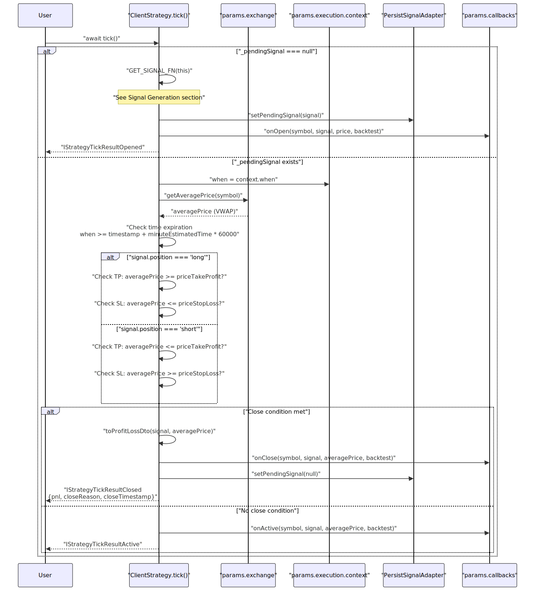

# Signal Lifecycle

## Purpose and Scope

This document provides a comprehensive technical reference for signal lifecycle management in the backtest-kit framework. It covers the four discrete states a trading signal can occupy (idle, opened, active, closed), the discriminated union type system used for type-safe state handling, validation rules, and the persistence mechanisms that enable crash-safe operation in live trading.

For execution orchestration of signals in backtest mode, see [Backtesting](28_Backtesting.md). For live trading execution with crash recovery, see [Live Trading](32_Live_Trading.md). For ClientStrategy's broader role in business logic, see [ClientStrategy](15_ClientStrategy.md).

---

## Signal State Overview

A signal exists in exactly one of four states at any given time. The framework uses TypeScript discriminated unions to ensure type-safe handling of each state.

### State Summary Table

| State | Action Discriminator | Signal Presence | Description | Yielded in Live Mode |
|-------|---------------------|-----------------|-------------|---------------------|
| **Idle** | `"idle"` | `null` | No active signal, strategy monitoring market conditions | Yes |
| **Opened** | `"opened"` | `ISignalRow` | Signal just created, validated, and persisted | Yes |
| **Active** | `"active"` | `ISignalRow` | Signal monitoring for TP/SL/time expiration | No (filtered) |
| **Closed** | `"closed"` | `ISignalRow` | Signal completed with PNL calculation | Yes |


---

## Signal Data Structures

### Core Signal Types

The framework distinguishes between three signal representations:

| Type | Purpose | ID Field | Usage Context |
|------|---------|----------|---------------|
| `ISignalDto` | User-provided signal data | `id?: string` (optional) | Returned by `getSignal()` function |
| `ISignalRow` | Validated signal with metadata | `id: string` (required) | Internal state, persistence, results |
| `IStrategyTickResult` | Discriminated union of states | N/A (contains `ISignalRow` or `null`) | Return type of `tick()` and `backtest()` |


### Signal DTO to Signal Row Transformation

When `getSignal()` returns a signal, it undergoes augmentation in [src/client/ClientStrategy.ts:114-121]():

```typescript
const signalRow: ISignalRow = {
  id: randomString(),           // Auto-generated UUID v4
  ...signal,                    // User-provided ISignalDto fields
  symbol: self.params.execution.context.symbol,
  exchangeName: self.params.method.context.exchangeName,
  strategyName: self.params.method.context.strategyName,
  timestamp: currentTime,       // Execution context time
};
```


### Discriminated Union Structure

The `IStrategyTickResult` type uses the `action` field as a discriminator:

```typescript
type IStrategyTickResult =
  | IStrategyTickResultIdle      // action: "idle"
  | IStrategyTickResultOpened    // action: "opened"
  | IStrategyTickResultActive    // action: "active"
  | IStrategyTickResultClosed    // action: "closed"
```

This enables type-safe narrowing using the discriminator:

```typescript
const result = await strategy.tick();
if (result.action === "closed") {
  // TypeScript knows result is IStrategyTickResultClosed
  console.log(result.pnl.pnlPercentage);  // Type-safe access
  console.log(result.closeReason);        // Type-safe access
}
```


---

## Signal Generation and Throttling

### Generation Flow

The `tick()` method calls `GET_SIGNAL_FN` when no pending signal exists. The following diagram shows the complete generation pipeline:




### Throttling Intervals

Signal generation is throttled using the `interval` parameter from `IStrategySchema`. The mapping is defined in [src/client/ClientStrategy.ts:19-26]():

| Interval | Minutes | Milliseconds |
|----------|---------|--------------|
| `"1m"` | 1 | 60,000 |
| `"3m"` | 3 | 180,000 |
| `"5m"` | 5 | 300,000 |
| `"15m"` | 15 | 900,000 |
| `"30m"` | 30 | 1,800,000 |
| `"1h"` | 60 | 3,600,000 |

The throttle check occurs in [src/client/ClientStrategy.ts:94-106]():

```typescript
const intervalMinutes = INTERVAL_MINUTES[self.params.interval];
const intervalMs = intervalMinutes * 60 * 1000;

if (
  self._lastSignalTimestamp !== null &&
  currentTime - self._lastSignalTimestamp < intervalMs
) {
  return null;  // Throttled, skip this tick
}

self._lastSignalTimestamp = currentTime;
```


---

## Signal Validation

### Validation Rules

The `VALIDATE_SIGNAL_FN` performs comprehensive validation before accepting a signal. All validation occurs in [src/client/ClientStrategy.ts:28-88]():

#### Price Validation

| Field | Rule | Error Message |
|-------|------|---------------|
| `priceOpen` | Must be > 0 | `"priceOpen must be positive, got {value}"` |
| `priceTakeProfit` | Must be > 0 | `"priceTakeProfit must be positive, got {value}"` |
| `priceStopLoss` | Must be > 0 | `"priceStopLoss must be positive, got {value}"` |

#### Long Position Validation

| Condition | Rule | Error Message |
|-----------|------|---------------|
| Take Profit | `priceTakeProfit > priceOpen` | `"Long: priceTakeProfit ({TP}) must be > priceOpen ({open})"` |
| Stop Loss | `priceStopLoss < priceOpen` | `"Long: priceStopLoss ({SL}) must be < priceOpen ({open})"` |

#### Short Position Validation

| Condition | Rule | Error Message |
|-----------|------|---------------|
| Take Profit | `priceTakeProfit < priceOpen` | `"Short: priceTakeProfit ({TP}) must be < priceOpen ({open})"` |
| Stop Loss | `priceStopLoss > priceOpen` | `"Short: priceStopLoss ({SL}) must be > priceOpen ({open})"` |

#### Temporal Validation

| Field | Rule | Error Message |
|-------|------|---------------|
| `minuteEstimatedTime` | Must be > 0 | `"minuteEstimatedTime must be positive, got {value}"` |
| `timestamp` | Must be > 0 | `"timestamp must be positive, got {value}"` |


### Validation Error Handling

When validation fails, all errors are aggregated and thrown as a single Error with newline-separated messages:

```typescript
if (errors.length > 0) {
  throw new Error(
    `Invalid signal for ${signal.position} position:\n${errors.join("\n")}`
  );
}
```

The error is caught by the `trycatch` wrapper in `GET_SIGNAL_FN`, which returns `null` on failure [src/client/ClientStrategy.ts:90-131]().


---

## Monitoring Active Signals (tick Method)

### Execution Flow

When a pending signal exists, the `tick()` method monitors it against three closure conditions. The following sequence diagram shows the complete monitoring flow:




### Close Condition Logic

The closure conditions are checked in [src/client/ClientStrategy.ts:343-371]():

#### Time Expiration Check

```typescript
const signalEndTime = signal.timestamp + signal.minuteEstimatedTime * 60 * 1000;
if (when.getTime() >= signalEndTime) {
  shouldClose = true;
  closeReason = "time_expired";
}
```

#### Long Position TP/SL Check

```typescript
if (signal.position === "long") {
  if (averagePrice >= signal.priceTakeProfit) {
    shouldClose = true;
    closeReason = "take_profit";
  } else if (averagePrice <= signal.priceStopLoss) {
    shouldClose = true;
    closeReason = "stop_loss";
  }
}
```

#### Short Position TP/SL Check

```typescript
if (signal.position === "short") {
  if (averagePrice <= signal.priceTakeProfit) {
    shouldClose = true;
    closeReason = "take_profit";
  } else if (averagePrice >= signal.priceStopLoss) {
    shouldClose = true;
    closeReason = "stop_loss";
  }
}
```


---

## Fast-Forward Backtest Simulation

### Method Overview

The `backtest()` method provides fast-forward simulation by processing an array of historical candles without iterating through every timestamp. This is called by `BacktestLogicPrivateService` after a signal opens.


### Backtest vs Tick Comparison

| Aspect | `tick()` | `backtest()` |
|--------|----------|--------------|
| **Context** | Live or Backtest | Backtest only |
| **Input** | Execution context time | Array of future candles |
| **Monitoring** | Single price point (VWAP) | Iterates through candles |
| **VWAP Calculation** | Exchange service | Internal `GET_AVG_PRICE_FN` |
| **Return Type** | `IStrategyTickResult` (4 states) | `IStrategyBacktestResult` (always closed) |
| **Closure** | May return "active" | Always returns "closed" |
| **Starting Index** | N/A | Index 4 (needs 5 candles for VWAP) |


### Backtest Execution Flow


### VWAP Calculation for Backtest

The `GET_AVG_PRICE_FN` calculates Volume-Weighted Average Price from candle data [src/client/ClientStrategy.ts:133-144]():

```typescript
const GET_AVG_PRICE_FN = (candles: ICandleData[]): number => {
  const sumPriceVolume = candles.reduce((acc, c) => {
    const typicalPrice = (c.high + c.low + c.close) / 3;
    return acc + typicalPrice * c.volume;
  }, 0);

  const totalVolume = candles.reduce((acc, c) => acc + c.volume, 0);

  return totalVolume === 0
    ? candles.reduce((acc, c) => acc + c.close, 0) / candles.length
    : sumPriceVolume / totalVolume;
};
```

This uses a 5-candle rolling window starting from index 4 [src/client/ClientStrategy.ts:512-515]():

```typescript
for (let i = 4; i < candles.length; i++) {
  const recentCandles = candles.slice(i - 4, i + 1);  // 5 candles
  const averagePrice = GET_AVG_PRICE_FN(recentCandles);
```


---

## Signal Persistence and Crash Recovery

### setPendingSignal Method

All signal state changes flow through the centralized `setPendingSignal()` method [src/client/ClientStrategy.ts:220-233]():

```typescript
public async setPendingSignal(pendingSignal: ISignalRow | null) {
  this.params.logger.debug("ClientStrategy setPendingSignal", {
    pendingSignal,
  });
  this._pendingSignal = pendingSignal;
  if (this.params.execution.context.backtest) {
    return;  // Skip persistence in backtest mode
  }
  await PersistSignalAdaper.writeSignalData(
    this._pendingSignal,
    this.params.strategyName,
    this.params.execution.context.symbol
  );
}
```

This method:
1. Updates in-memory `_pendingSignal` field
2. Skips disk writes in backtest mode (performance optimization)
3. Calls `PersistSignalAdaper.writeSignalData()` for atomic file write in live mode


### State Recovery on Initialization

The `waitForInit()` method loads persisted state during strategy startup [src/client/ClientStrategy.ts:146-165](), [src/client/ClientStrategy.ts:209]():

```typescript
const WAIT_FOR_INIT_FN = async (self: ClientStrategy) => {
  self.params.logger.debug("ClientStrategy waitForInit");
  if (self.params.execution.context.backtest) {
    return;  // No state to load in backtest
  }
  const pendingSignal = await PersistSignalAdaper.readSignalData(
    self.params.strategyName,
    self.params.execution.context.symbol
  );
  if (!pendingSignal) {
    return;  // No persisted signal
  }
  // Validate loaded signal matches current execution context
  if (pendingSignal.exchangeName !== self.params.method.context.exchangeName) {
    return;
  }
  if (pendingSignal.strategyName !== self.params.method.context.strategyName) {
    return;
  }
  self._pendingSignal = pendingSignal;  // Restore state
};

public waitForInit = singleshot(async () => await WAIT_FOR_INIT_FN(this));
```

The `singleshot` wrapper ensures initialization happens exactly once, even if called multiple times.


### Persistence Call Sites

Signal persistence occurs at exactly two points in the lifecycle:

| Location | State Change | Persisted Value |
|----------|-------------|-----------------|
| [src/client/ClientStrategy.ts:263]() | Signal opened | `ISignalRow` (new signal) |
| [src/client/ClientStrategy.ts:414]() | Signal closed (tick) | `null` (clear state) |
| [src/client/ClientStrategy.ts:575]() | Signal closed (backtest) | `null` (clear state) |
| [src/client/ClientStrategy.ts:634]() | Signal closed (backtest time_expired) | `null` (clear state) |

This ensures:
- No duplicate signals after crash (cleared on close)
- Active signals resume correctly after restart (preserved until close)
- Backtest mode skips all disk I/O for performance

For detailed persistence implementation, see [Signal Persistence](26_Signal_Persistence.md).


---

## PnL Calculation

### Calculation Function

Profit and loss calculation occurs in the `toProfitLossDto` helper function (referenced at [src/client/ClientStrategy.ts:15]()). The calculation applies realistic trading costs:

1. **Entry Slippage**: ±0.1% on `priceOpen`
2. **Exit Slippage**: ±0.1% on `priceClose`
3. **Trading Fees**: 0.1% entry + 0.1% exit = 0.2% total

For long positions:
- Entry price adjusted up (unfavorable): `priceOpen * 1.001`
- Exit price adjusted down (unfavorable): `priceClose * 0.999`

For short positions:
- Entry price adjusted down (unfavorable): `priceOpen * 0.999`
- Exit price adjusted up (unfavorable): `priceClose * 1.001`


### Usage in ClientStrategy

PnL calculation is called when a signal closes in both `tick()` and `backtest()` methods:

| Method | Call Site | Context |
|--------|-----------|---------|
| `tick()` | [src/client/ClientStrategy.ts:375]() | Live or backtest real-time closure |
| `backtest()` | [src/client/ClientStrategy.ts:544]() | Backtest TP/SL hit |
| `backtest()` | [src/client/ClientStrategy.ts:606]() | Backtest time_expired |

Example call:

```typescript
const pnl = toProfitLossDto(signal, averagePrice);
// pnl.pnlPercentage: e.g., 1.5 for +1.5% profit
// pnl.priceOpen: adjusted entry price with fees/slippage
// pnl.priceClose: adjusted exit price with fees/slippage
```


### Loss Warnings

ClientStrategy logs warnings when signals close at a loss:

| Condition | Log Level | Message Pattern |
|-----------|-----------|-----------------|
| Stop Loss hit (tick) | `warn` | `"Signal closed with loss (stop_loss), PNL: {percentage}%"` |
| Time expired with loss (tick) | `warn` | `"Signal closed with loss (time_expired), PNL: {percentage}%"` |
| Stop Loss hit (backtest) | `warn` | `"Signal closed with loss (stop_loss), PNL: {percentage}%"` |
| Time expired with loss (backtest) | `warn` | `"Signal closed with loss (time_expired), PNL: {percentage}%"` |

These warnings occur at:
- [src/client/ClientStrategy.ts:379-384]() (tick stop_loss)
- [src/client/ClientStrategy.ts:388-393]() (tick time_expired)
- [src/client/ClientStrategy.ts:558-563]() (backtest stop_loss)
- [src/client/ClientStrategy.ts:617-622]() (backtest time_expired)

For detailed PnL calculation implementation, see [PnL Calculation](27_PnL_Calculation.md).


---

## Summary

The signal lifecycle in backtest-kit follows a deterministic state machine with four discrete states (idle, opened, active, closed) represented using TypeScript discriminated unions. The `ClientStrategy` class in [src/client/ClientStrategy.ts]() orchestrates all state transitions, applying comprehensive validation rules, throttling signal generation by configurable intervals, monitoring active signals against VWAP-based TP/SL conditions, and calculating realistic PnL including fees (0.2%) and slippage (0.2% total). 

In live trading mode, all state changes are atomically persisted to disk via `PersistSignalAdapter` before yielding results, enabling crash-safe recovery. In backtest mode, the `backtest()` method provides fast-forward simulation by iterating through historical candles without intermediate state persistence, always returning a closed result.

The discriminated union type system ensures type-safe handling of all states, with the `action` field serving as the discriminator for pattern matching.

