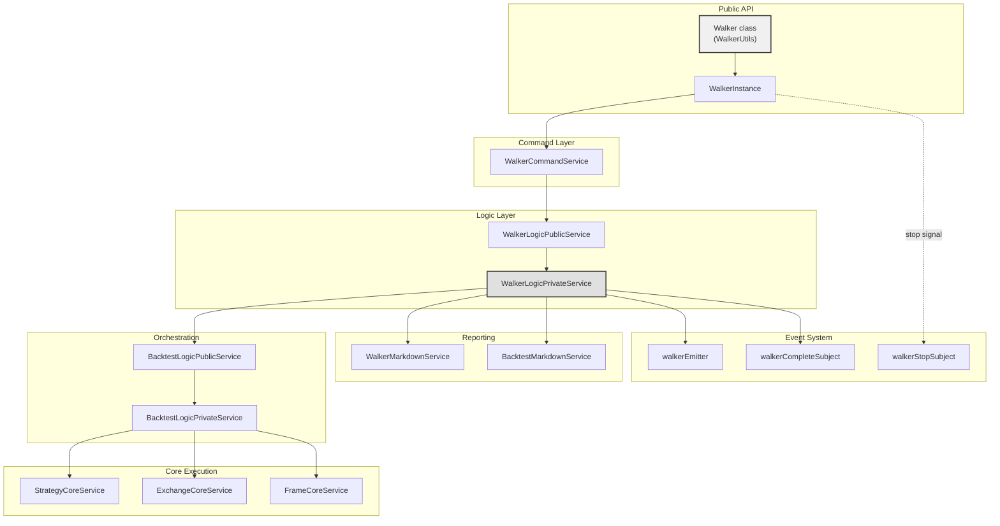
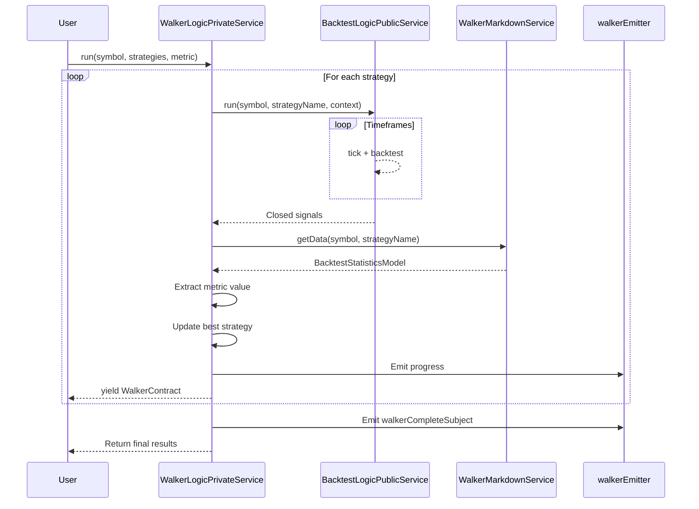
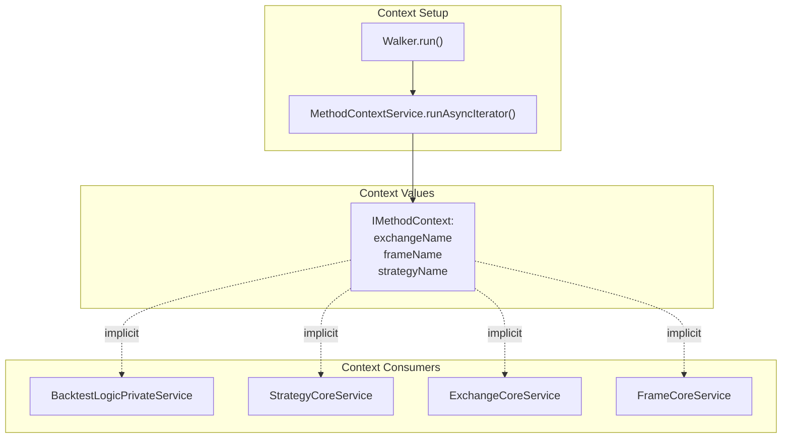
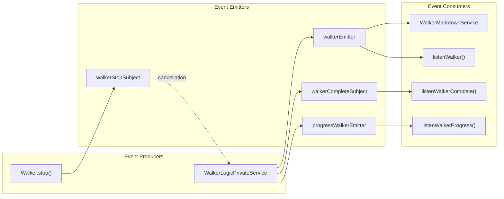

# Walker (Strategy Comparison)

The Walker execution mode enables systematic comparison of multiple trading strategies on the same market data. Unlike Backtest mode ([5.1](./20_execution-modes.md)) which tests a single strategy, or Live mode ([5.2](./20_execution-modes.md)) which executes real-time trading, Walker orchestrates sequential backtests for multiple strategies and ranks them by a configurable performance metric. This allows data-driven strategy selection and hyperparameter optimization.

For information about individual backtest execution mechanics, see Backtest Mode ([5.1](./20_execution-modes.md)). For the shared async generator architecture used by all execution modes, see Async Generator Patterns ([5.4](./20_execution-modes.md)).

---

## Walker Schema Definition

Walker execution is configured via the `IWalkerSchema` interface, which is registered using `addWalker()`. The schema defines which strategies to compare, the metric for ranking, and the execution environment (exchange and timeframe).

### IWalkerSchema Interface

```typescript
interface IWalkerSchema {
  walkerName: WalkerName;           // Unique identifier
  note?: string;                     // Optional documentation
  exchangeName: ExchangeName;        // Exchange for all strategies
  frameName: FrameName;              // Timeframe for all strategies
  strategies: StrategyName[];        // List of strategies to compare
  metric?: WalkerMetric;             // Optimization metric (default: "sharpeRatio")
  callbacks?: Partial<IWalkerCallbacks>;  // Lifecycle event callbacks
}
```

**Sources:** [types.d.ts:954-969]()

### Supported Metrics

Walker supports seven optimization metrics, all maximized (higher is better):

| Metric | Type | Description |
|--------|------|-------------|
| `sharpeRatio` | `WalkerMetric` | Risk-adjusted return (avgPnl / stdDev) |
| `annualizedSharpeRatio` | `WalkerMetric` | Sharpe ratio scaled by √365 |
| `winRate` | `WalkerMetric` | Percentage of winning trades (0-100) |
| `totalPnl` | `WalkerMetric` | Cumulative profit/loss percentage |
| `certaintyRatio` | `WalkerMetric` | Average win divided by average loss |
| `avgPnl` | `WalkerMetric` | Mean profit/loss per trade |
| `expectedYearlyReturns` | `WalkerMetric` | Annualized return projection |

**Sources:** [types.d.ts:949]()

### Callback Hooks

```typescript
interface IWalkerCallbacks {
  onStrategyStart: (strategyName: StrategyName, symbol: string) => void;
  onStrategyComplete: (
    strategyName: StrategyName, 
    symbol: string, 
    stats: BacktestStatisticsModel, 
    metric: number | null
  ) => void;
}
```

**Sources:** [types.d.ts:974-979]()

---

## Execution Architecture

### Component Hierarchy



**Sources:** [src/classes/Walker.ts:1-650](), [src/lib/services/logic/private/WalkerLogicPrivateService.ts:1-264]()

### Sequential Backtest Flow

Walker executes strategies sequentially, not in parallel. This design ensures:
- Deterministic execution order
- Predictable resource usage
- Isolated metric calculation per strategy
- Clean event emission



**Sources:** [src/lib/services/logic/private/WalkerLogicPrivateService.ts:68-175]()

---

## Walker Execution Flow

### WalkerLogicPrivateService.run() Implementation

The core orchestration logic in `WalkerLogicPrivateService` follows this algorithm:

1. **Initialization**: Load walker schema, validate all strategy names
2. **Sequential Execution**: Iterate through `strategies` array
3. **Per-Strategy Backtest**: 
   - Run `BacktestLogicPublicService.run()` with context propagation
   - Consume all closed signals from backtest
   - Extract statistics via `BacktestMarkdownService.getData()`
4. **Metric Extraction**: Read metric value from `BacktestStatisticsModel`
5. **Ranking Update**: Compare with current best, update if better
6. **Progress Emission**: Emit `WalkerContract` via `walkerEmitter`
7. **Early Termination**: Check `walkerStopSubject` for stop signals
8. **Completion**: Emit `walkerCompleteSubject` with final ranking

**Sources:** [src/lib/services/logic/private/WalkerLogicPrivateService.ts:68-175]()

### Stop Signal Handling

Walker supports graceful cancellation via `walkerStopSubject`. Stop signals are filtered by `walkerName` to prevent interference when multiple walkers run simultaneously on the same symbol:

```typescript
// Stop signal emission (Walker.stop)
for (const strategyName of walkerSchema.strategies) {
  await walkerStopSubject.next({ symbol, strategyName, walkerName });
  await backtest.strategyCoreService.stop({ symbol, strategyName }, true);
}
```

```typescript
// Stop signal consumption (WalkerLogicPrivateService)
const stopPromise = resolveDocuments(
  walkerStopSubject.toPromise((event) =>
    event.symbol === symbol &&
    event.strategyName === strategyName &&
    event.walkerName === context.walkerName
  )
);

const shouldStop = await Promise.race([backtestPromise, stopPromise]);
```

**Sources:** [src/classes/Walker.ts:271-283](), [src/lib/services/logic/private/WalkerLogicPrivateService.ts:100-122]()

---

## Results and Reporting

### WalkerStatisticsModel Structure

```typescript
interface WalkerStatisticsModel {
  walkerName: string;
  metric: WalkerMetric;
  strategyResults: IWalkerStrategyResult[];
  bestStrategy: IWalkerStrategyResult | null;
  totalStrategies: number;
  completedStrategies: number;
}

interface IWalkerStrategyResult {
  strategyName: string;
  stats: BacktestStatisticsModel;
  metricValue: number | null;
  rank: number;
}
```

Each strategy result includes:
- Full `BacktestStatisticsModel` with all backtest metrics
- Extracted `metricValue` for the optimization metric
- `rank` based on metric value (1 = best)

**Sources:** [src/model/WalkerStatistics.model.ts:1-54]()

### Real-Time Progress Tracking

Walker emits progress updates after each strategy completes via `walkerEmitter`:

```typescript
interface WalkerContract {
  walkerName: string;
  symbol: string;
  strategyName: string;          // Just completed
  stats: BacktestStatisticsModel;
  metric: WalkerMetric;
  metricValue: number | null;
  bestStrategyName: string | null;
  bestMetricValue: number | null;
  strategiesTested: number;
  totalStrategies: number;
  progress: number;              // 0.0 to 1.0
}
```

**Sources:** [src/contract/Walker.contract.ts:1-48]()

### Markdown Report Generation

Walker reports display comparative statistics in tabular format:

| Strategy | Sharpe Ratio | Win Rate | Total PNL | Avg PNL | Signals |
|----------|--------------|----------|-----------|---------|---------|
| strategy-A | 2.45 ⭐ | 65.2% | 45.3% | 1.2% | 120 |
| strategy-B | 1.87 | 72.1% | 52.1% | 1.1% | 135 |
| strategy-C | 1.34 | 58.9% | 38.7% | 0.9% | 105 |

The best strategy (by selected metric) is marked with ⭐.

**Sources:** [src/lib/services/markdown/WalkerMarkdownService.ts:1-300]()

---

## Walker Class API

### Walker.run() - Async Generator

Streams progress updates as each strategy completes:

```typescript
for await (const progress of Walker.run("BTCUSDT", {
  walkerName: "my-optimizer"
})) {
  console.log(`Tested ${progress.strategiesTested}/${progress.totalStrategies}`);
  console.log(`Current best: ${progress.bestStrategyName} (${progress.bestMetricValue})`);
  
  // Early termination based on criteria
  if (progress.bestMetricValue > 3.0) {
    break;
  }
}
```

**Sources:** [src/classes/Walker.ts:378-429]()

### Walker.background() - Fire-and-Forget

Runs walker in background, emitting events via `listenWalker()`:

```typescript
import { Walker, listenWalker, listenWalkerComplete } from "backtest-kit";

const cancel = Walker.background("BTCUSDT", {
  walkerName: "my-optimizer"
});

listenWalker((progress) => {
  console.log(`Progress: ${(progress.progress * 100).toFixed(1)}%`);
});

listenWalkerComplete((results) => {
  console.log(`Winner: ${results.bestStrategy?.strategyName}`);
  cancel(); // Cleanup (already done, but safe to call)
});
```

**Sources:** [src/classes/Walker.ts:431-481]()

### Walker.stop() - Graceful Cancellation

Stops walker comparison, allowing current strategy to complete:

```typescript
await Walker.stop("BTCUSDT", "my-optimizer");
// Current running strategy will finish its backtest
// Subsequent strategies will not execute
```

**Sources:** [src/classes/Walker.ts:483-529]()

### Walker.getData() - Retrieve Results

Fetches complete comparison results:

```typescript
const results = await Walker.getData("BTCUSDT", "my-optimizer");

console.log(`Best: ${results.bestStrategy?.strategyName}`);
console.log(`Metric: ${results.metric} = ${results.bestStrategy?.metricValue}`);

results.strategyResults
  .sort((a, b) => (b.metricValue || 0) - (a.metricValue || 0))
  .forEach((result, i) => {
    console.log(`${i + 1}. ${result.strategyName}: ${result.metricValue}`);
  });
```

**Sources:** [src/classes/Walker.ts:531-568]()

### Walker.getReport() - Generate Markdown

Creates formatted comparison report:

```typescript
const markdown = await Walker.getReport("BTCUSDT", "my-optimizer", [
  "strategyName",
  "sharpeRatio",
  "winRate",
  "totalPnl"
]);

console.log(markdown);
// Outputs:
// # Walker Comparison: my-optimizer
// **Symbol:** BTCUSDT
// **Metric:** sharpeRatio
// 
// | Strategy | Sharpe Ratio | Win Rate | Total PNL |
// |----------|--------------|----------|-----------|
// | ... | ... | ... | ... |
```

**Sources:** [src/classes/Walker.ts:570-616]()

### Walker.dump() - Save to Disk

Exports report to file system:

```typescript
await Walker.dump("BTCUSDT", "my-optimizer");
// Saves to: ./dump/walker/my-optimizer.md

await Walker.dump("BTCUSDT", "my-optimizer", "./custom/reports");
// Saves to: ./custom/reports/my-optimizer.md
```

**Sources:** [src/classes/Walker.ts:618-650]()

---

## Context Propagation

Walker uses `MethodContextService` to propagate execution context through the call stack:



Each strategy execution updates `context.strategyName` while preserving `exchangeName` and `frameName`. This ensures consistent exchange and timeframe across all strategy comparisons.

**Sources:** [src/lib/services/logic/private/WalkerLogicPrivateService.ts:68-175](), [src/lib/services/context/MethodContextService.ts:1-100]()

---

## Event System Integration

Walker integrates with the framework's event system via four emitters:

| Emitter | Type | Purpose |
|---------|------|---------|
| `walkerEmitter` | `Subject<WalkerContract>` | Progress after each strategy |
| `walkerCompleteSubject` | `Subject<WalkerCompleteContract>` | Final results |
| `walkerStopSubject` | `Subject<WalkerStopContract>` | Cancellation signals |
| `progressWalkerEmitter` | `Subject<ProgressWalkerContract>` | Percentage progress |

### Event Flow Diagram



**Sources:** [src/config/emitters.ts:1-150](), [src/function/event.ts:1-800]()

---

## State Management and Cleanup

Walker maintains isolated state per symbol-walker pair via memoization:

```typescript
// WalkerUtils class
private _getInstance = memoize<
  (symbol: string, walkerName: WalkerName) => WalkerInstance
>(
  ([symbol, walkerName]) => `${symbol}:${walkerName}`,
  (symbol: string, walkerName: WalkerName) => new WalkerInstance(symbol, walkerName)
);
```

Each `WalkerInstance` tracks:
- `_isStopped`: Manual cancellation flag
- `_isDone`: Completion flag
- `id`: Unique random identifier
- `task`: Singlerun-wrapped execution function

**State Cleanup on Walker Start:**

```typescript
backtest.walkerMarkdownService.clear(context.walkerName);

// Clear backtest data for all strategies
for (const strategyName of walkerSchema.strategies) {
  backtest.backtestMarkdownService.clear({ symbol, strategyName });
  backtest.scheduleMarkdownService.clear({ symbol, strategyName });
  backtest.strategyCoreService.clear({ symbol, strategyName });
  
  const { riskName, riskList } = backtest.strategySchemaService.get(strategyName);
  riskName && backtest.riskGlobalService.clear(riskName);
  riskList?.forEach((riskName) => backtest.riskGlobalService.clear(riskName));
}
```

This ensures each walker run starts with clean state, preventing contamination from previous executions.

**Sources:** [src/classes/Walker.ts:363-370](), [src/classes/Walker.ts:162-187]()

---

## Walker vs. Optimizer

Walker and Optimizer ([10.2](./46_advanced-features.md)) serve different purposes:

| Aspect | Walker | Optimizer |
|--------|--------|-----------|
| **Purpose** | Compare existing strategies | Generate new strategies via LLM |
| **Input** | Predefined strategy list | Market data + prompt template |
| **Output** | Ranking by metric | Executable strategy code |
| **Execution** | Sequential backtests | Data collection + code generation |
| **Use Case** | Strategy selection | Strategy discovery |

Walker is used for **quantitative comparison** of known strategies. Optimizer is used for **automated strategy creation** using AI.

**Sources:** [src/classes/Walker.ts:1-650](), [src/classes/Optimizer.ts:1-500]()

---

## Performance Considerations

### Memory Efficiency

Walker uses async generators to stream results, avoiding accumulation of all backtest data in memory:

```typescript
public async *run(symbol: string, strategies: StrategyName[], metric: WalkerMetric) {
  for (const strategyName of strategies) {
    // Backtest executed here
    for await (const _ of this.backtestLogicPublicService.run(symbol, context)) {
      // Results consumed and discarded
    }
    
    // Only statistics retained
    const stats = await this.backtestMarkdownService.getData(symbol, strategyName);
    
    // Yield progress, then continue
    yield {
      strategyName,
      stats,
      // ...
    };
  }
}
```

Only `BacktestStatisticsModel` (aggregate metrics) is retained per strategy, not individual signals.

**Sources:** [src/lib/services/logic/private/WalkerLogicPrivateService.ts:68-175]()

### Parallel Execution Not Supported

Walker executes strategies sequentially by design. For parallel execution, run multiple `Walker.background()` instances with different walker names:

```typescript
// Parallel walker execution
Walker.background("BTCUSDT", { walkerName: "optimizer-group-1" });
Walker.background("ETHUSDT", { walkerName: "optimizer-group-2" });
Walker.background("BNBUSDT", { walkerName: "optimizer-group-3" });
```

Each walker operates independently with its own state.

**Sources:** [src/lib/services/logic/private/WalkerLogicPrivateService.ts:68-175]()

---

## Example: Complete Walker Usage

```typescript
import { 
  addWalker, 
  Walker, 
  listenWalker, 
  listenWalkerComplete 
} from "backtest-kit";

// Define walker configuration
addWalker({
  walkerName: "strategy-optimizer",
  exchangeName: "binance",
  frameName: "1d-backtest",
  strategies: [
    "rsi-strategy",
    "macd-strategy", 
    "bollinger-strategy",
    "ema-crossover-strategy"
  ],
  metric: "sharpeRatio",
  callbacks: {
    onStrategyStart: (strategyName, symbol) => {
      console.log(`Testing ${strategyName} on ${symbol}...`);
    },
    onStrategyComplete: (strategyName, symbol, stats, metric) => {
      console.log(`${strategyName}: Sharpe = ${metric?.toFixed(2)}`);
    }
  }
});

// Listen to progress
listenWalker((progress) => {
  console.log(`Progress: ${progress.strategiesTested}/${progress.totalStrategies}`);
  console.log(`Current leader: ${progress.bestStrategyName}`);
});

// Listen to completion
listenWalkerComplete(async (results) => {
  console.log("\n=== Walker Results ===");
  console.log(`Best: ${results.bestStrategy?.strategyName}`);
  console.log(`Sharpe: ${results.bestStrategy?.metricValue?.toFixed(2)}`);
  
  // Generate and save report
  await Walker.dump("BTCUSDT", "strategy-optimizer");
  console.log("Report saved to ./dump/walker/strategy-optimizer.md");
});

// Execute walker
Walker.background("BTCUSDT", {
  walkerName: "strategy-optimizer"
});
```

**Sources:** [src/function/add.ts:1-200](), [src/classes/Walker.ts:1-650](), [src/function/event.ts:1-800]()