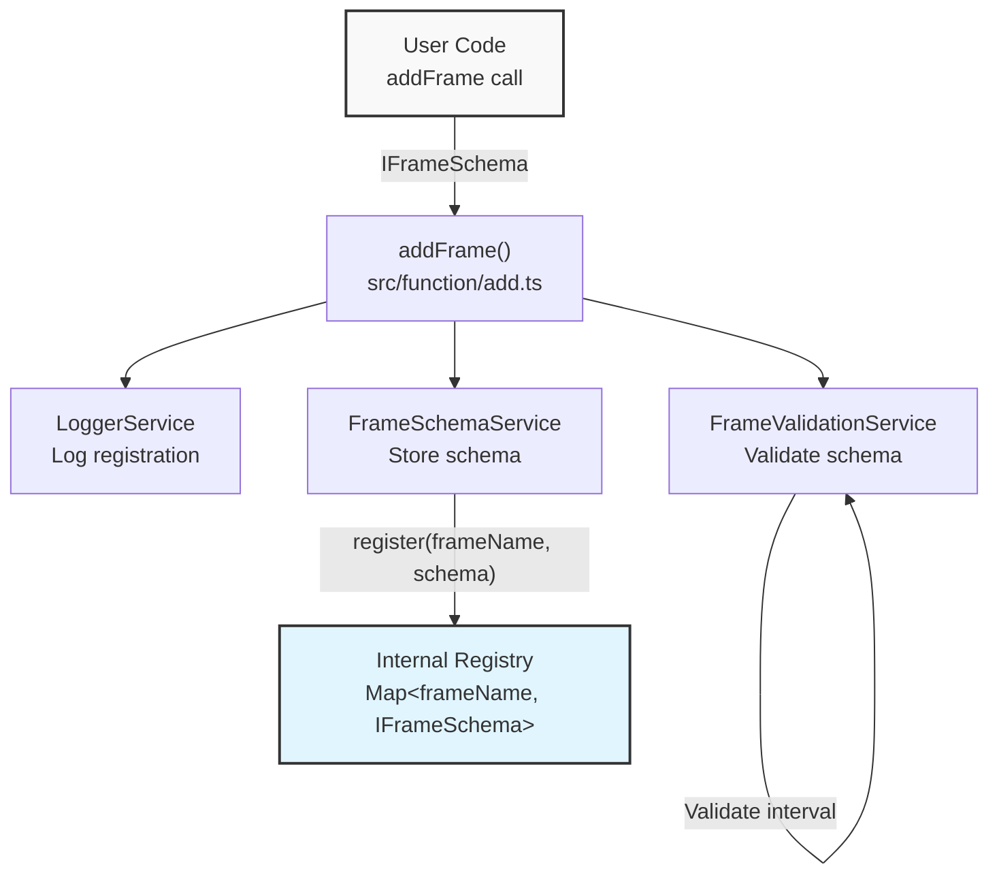
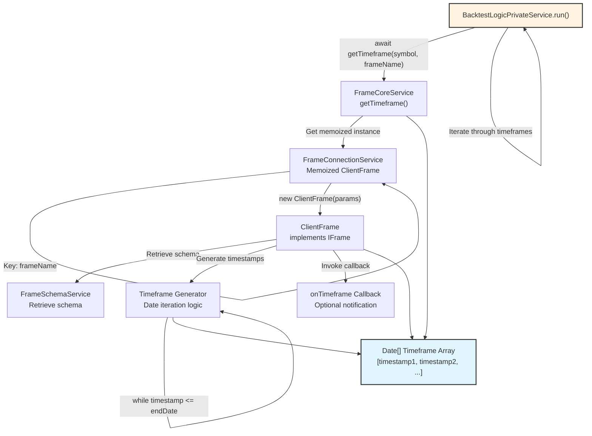
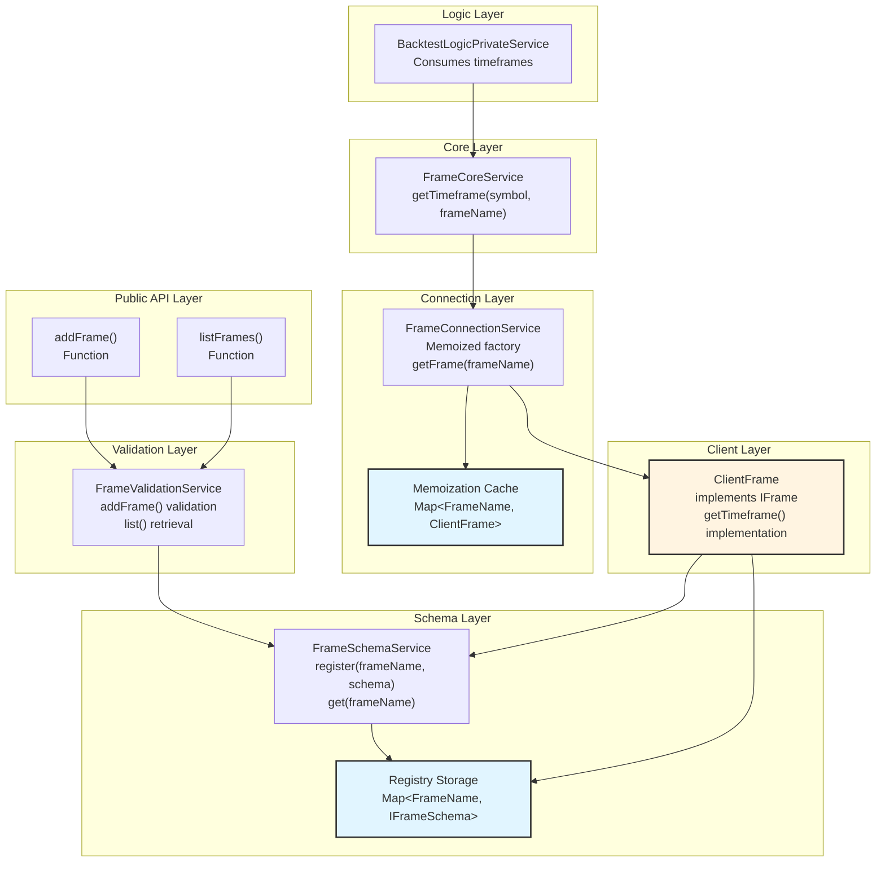
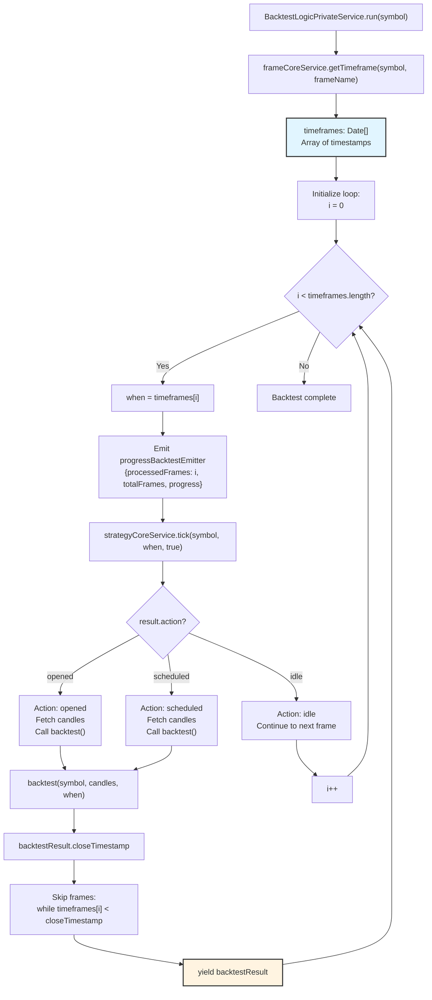
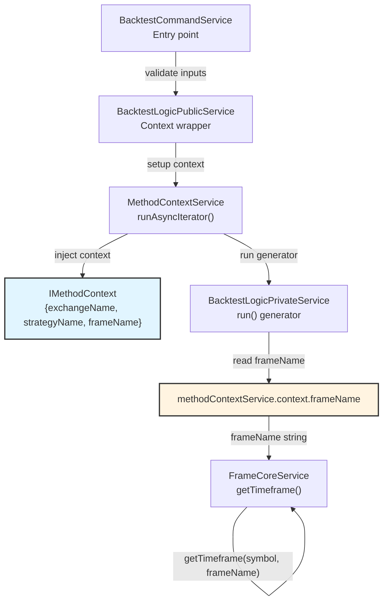

# Timeframes and Frames

# Timeframes and Frames

<details>
<summary>Relevant source files</summary>

The following files were used as context for generating this wiki page:

- [src/config/emitters.ts](src/config/emitters.ts)
- [src/function/add.ts](src/function/add.ts)
- [src/function/event.ts](src/function/event.ts)
- [src/function/list.ts](src/function/list.ts)
- [src/index.ts](src/index.ts)
- [src/lib/core/provide.ts](src/lib/core/provide.ts)
- [src/lib/core/types.ts](src/lib/core/types.ts)
- [src/lib/index.ts](src/lib/index.ts)
- [src/lib/services/logic/private/BacktestLogicPrivateService.ts](src/lib/services/logic/private/BacktestLogicPrivateService.ts)
- [src/lib/services/logic/private/LiveLogicPrivateService.ts](src/lib/services/logic/private/LiveLogicPrivateService.ts)
- [src/lib/services/logic/private/WalkerLogicPrivateService.ts](src/lib/services/logic/private/WalkerLogicPrivateService.ts)
- [types.d.ts](types.d.ts)

</details>


## Purpose and Scope

This page documents the frame system, which defines backtest periods and generates timeframe arrays for historical simulation. Frames specify date ranges and intervals for backtest execution, producing sequential timestamps that drive strategy tick evaluation.

For exchange data fetching and candle retrieval, see [Exchange Configuration](./22-exchange-configuration.md). For candle data structures and VWAP calculation, see [Candle Data and VWAP](./23-candle-data-and-vwap.md). For overall backtest execution flow, see [Backtest Mode](./17-backtest-mode.md).

---

## Frame Configuration Schema

Frames are registered via `addFrame()` using the `IFrameSchema` interface, which defines the backtest period and timestamp generation parameters.

### IFrameSchema Structure

| Field | Type | Description |
|-------|------|-------------|
| `frameName` | `FrameName` (string) | Unique identifier for the frame |
| `note` | `string` (optional) | Developer note for documentation |
| `interval` | `FrameInterval` | Timestamp spacing interval (e.g., "1m", "1h", "1d") |
| `startDate` | `Date` | Start of backtest period (inclusive) |
| `endDate` | `Date` | End of backtest period (inclusive) |
| `callbacks` | `Partial<IFrameCallbacks>` (optional) | Lifecycle event handlers |

### Frame Intervals

The `FrameInterval` type defines the granularity of timestamps in the generated timeframe array. Each timestamp represents a tick moment when `ClientStrategy.tick()` is called during backtest execution.

| Interval | Description | Typical Use Case |
|----------|-------------|------------------|
| `"1m"` | 1 minute | High-frequency strategies, precise entry timing |
| `"3m"` | 3 minutes | Reduced tick count while maintaining granularity |
| `"5m"` | 5 minutes | Intraday strategies with moderate frequency |
| `"15m"` | 15 minutes | Standard intraday timeframe |
| `"30m"` | 30 minutes | Swing trading, reduced computational overhead |
| `"1h"` | 1 hour | Hourly strategy evaluation |
| `"2h"` | 2 hours | Multi-hour analysis |
| `"4h"` | 4 hours | Standard 4-hour trading timeframe |
| `"6h"` | 6 hours | Quarter-day analysis |
| `"8h"` | 8 hours | Third-day analysis |
| `"12h"` | 12 hours | Half-day analysis |
| `"1d"` | 1 day | Daily strategy evaluation |
| `"3d"` | 3 days | Multi-day swing trading |

**Sources:** [types.d.ts:427](), [types.d.ts:470-483]()

---

## Frame Callbacks

The `IFrameCallbacks` interface provides lifecycle hooks for frame events.

### onTimeframe Callback

Called after timeframe array generation, providing access to the generated timestamps and configuration parameters.

**Signature:**
```typescript
onTimeframe: (
  timeframe: Date[],
  startDate: Date,
  endDate: Date,
  interval: FrameInterval
) => void
```

**Parameters:**
- `timeframe`: Array of Date objects representing tick timestamps
- `startDate`: Start of the backtest period
- `endDate`: End of the backtest period  
- `interval`: Interval used for generation

**Use Cases:**
- Logging timeframe size for debugging
- Validating generated timestamps
- Performance monitoring
- Custom reporting

**Sources:** [types.d.ts:438-450]()

---

## Frame Registration and Discovery

### Registration via addFrame

Frames are registered using the `addFrame()` function, which validates and stores the frame schema in `FrameSchemaService`.

**Example:**
```typescript
addFrame({
  frameName: "1d-backtest",
  note: "One day test period",
  interval: "1m",
  startDate: new Date("2024-01-01T00:00:00Z"),
  endDate: new Date("2024-01-02T00:00:00Z"),
  callbacks: {
    onTimeframe: (timeframe, startDate, endDate, interval) => {
      console.log(`Generated ${timeframe.length} timestamps from ${startDate.toISOString()} to ${endDate.toISOString()} at ${interval} intervals`);
    }
  }
});
```

### Registration Flow



**Sources:** [src/function/add.ts:145-151](), [src/lib/index.ts:24](), [src/lib/index.ts:44]()

### Discovery via listFrames

All registered frames can be retrieved using `listFrames()`, which returns an array of `IFrameSchema` objects.

**Example:**
```typescript
const frames = await listFrames();
for (const frame of frames) {
  console.log(`Frame: ${frame.frameName}, Interval: ${frame.interval}`);
  console.log(`Period: ${frame.startDate.toISOString()} to ${frame.endDate.toISOString()}`);
}
```

**Sources:** [src/function/list.ts:108-111]()

---

## Timeframe Generation

### getTimeframe Method

The `IFrame.getTimeframe()` method generates an array of Date objects spaced according to the configured interval. This array drives backtest execution by defining every moment when `ClientStrategy.tick()` is called.

**Signature:**
```typescript
getTimeframe: (symbol: string, frameName: FrameName) => Promise<Date[]>
```

**Parameters:**
- `symbol`: Trading pair symbol (unused in implementation, present for API consistency)
- `frameName`: Frame identifier to retrieve from registry

**Returns:** Promise resolving to array of Date objects representing tick timestamps

### Timeframe Generation Architecture



**Sources:** [types.d.ts:488-497](), [src/lib/services/logic/private/BacktestLogicPrivateService.ts:69-73]()

### Generation Algorithm

The timeframe generation follows this logic:

1. Retrieve `IFrameSchema` from `FrameSchemaService` by `frameName`
2. Initialize array with `startDate`
3. Increment timestamp by interval duration
4. Append to array while timestamp <= `endDate`
5. Invoke `onTimeframe` callback if configured
6. Return Date array

**Example Output:**
```typescript
// Frame: interval="1m", startDate=2024-01-01T00:00:00Z, endDate=2024-01-01T00:05:00Z
// Generated timeframe:
[
  new Date("2024-01-01T00:00:00Z"), // timestamp 0
  new Date("2024-01-01T00:01:00Z"), // timestamp 1
  new Date("2024-01-01T00:02:00Z"), // timestamp 2
  new Date("2024-01-01T00:03:00Z"), // timestamp 3
  new Date("2024-01-01T00:04:00Z"), // timestamp 4
  new Date("2024-01-01T00:05:00Z"), // timestamp 5
]
// Total: 6 timestamps (5 minutes + 1 for inclusive endDate)
```

**Sources:** [types.d.ts:488-497](), [src/lib/services/logic/private/BacktestLogicPrivateService.ts:69-73]()

---

## Frame Service Architecture

The frame system uses a layered service architecture with dependency injection for loose coupling and memoization for performance optimization.

### Service Layer Diagram



**Sources:** [src/lib/index.ts:24](), [src/lib/index.ts:44](), [src/lib/index.ts:81](), [src/lib/index.ts:116]()

### Service Responsibilities

| Service | File Reference | Responsibility |
|---------|----------------|----------------|
| `FrameValidationService` | [src/lib/index.ts:44]() | Validates frame schema structure on registration, provides list() method |
| `FrameSchemaService` | [src/lib/index.ts:24]() | Stores frame schemas in registry, provides get(frameName) retrieval |
| `FrameConnectionService` | [src/lib/index.ts:81]() | Creates and memoizes ClientFrame instances, key: frameName |
| `FrameCoreService` | [src/lib/index.ts:116]() | Provides getTimeframe() method, delegates to connection service |
| `ClientFrame` | [types.d.ts:432-435]() | Implements IFrame interface, generates timeframe arrays |

**Sources:** [src/lib/index.ts:24](), [src/lib/index.ts:44](), [src/lib/index.ts:81](), [src/lib/index.ts:116]()

---

## Frame Usage in Backtest Execution

Frames drive the backtest execution loop by providing an ordered sequence of timestamps for strategy evaluation.

### Backtest Iteration Flow



**Sources:** [src/lib/services/logic/private/BacktestLogicPrivateService.ts:62-477]()

### Key Implementation Details

1. **Frame Retrieval** ([src/lib/services/logic/private/BacktestLogicPrivateService.ts:69-73]()):
   - `BacktestLogicPrivateService` calls `frameCoreService.getTimeframe(symbol, frameName)`
   - Returns `Date[]` array of timestamps
   - Stored in `timeframes` variable for iteration

2. **Sequential Iteration** ([src/lib/services/logic/private/BacktestLogicPrivateService.ts:78-449]()):
   - Loop: `while (i < timeframes.length)`
   - Each iteration: `when = timeframes[i]`
   - `when` passed to `strategyCoreService.tick(symbol, when, true)`

3. **Progress Tracking** ([src/lib/services/logic/private/BacktestLogicPrivateService.ts:84-92]()):
   - Emits `progressBacktestEmitter` with processed/total frame counts
   - Progress calculation: `i / totalFrames`

4. **Frame Skipping Optimization** ([src/lib/services/logic/private/BacktestLogicPrivateService.ts:273-279](), [src/lib/services/logic/private/BacktestLogicPrivateService.ts:403-409]()):
   - When signal opens, `backtest()` processes all candles until close
   - After signal closes, skip timeframes until `closeTimestamp`
   - Optimization: avoids redundant tick calls while position is active

**Sources:** [src/lib/services/logic/private/BacktestLogicPrivateService.ts:62-477]()

---

## Frame Context Propagation

Frames are propagated through the execution context via `MethodContextService`, which uses dependency injection scoping to provide implicit context without explicit parameter passing.

### Context Flow Architecture



**Sources:** [types.d.ts:510-517](), [src/lib/services/logic/private/BacktestLogicPrivateService.ts:44-46](), [src/lib/services/logic/private/BacktestLogicPrivateService.ts:69-73]()

### Context Structure

The `IMethodContext` interface provides routing information for service lookups:

```typescript
interface IMethodContext {
  exchangeName: ExchangeName;
  strategyName: StrategyName;
  frameName: FrameName;  // Used for frame retrieval
}
```

**Usage in BacktestLogicPrivateService:**
- Injected: [src/lib/services/logic/private/BacktestLogicPrivateService.ts:44-46]()
- Read: [src/lib/services/logic/private/BacktestLogicPrivateService.ts:71]()
- Passed to: `frameCoreService.getTimeframe(symbol, this.methodContextService.context.frameName)`

**Sources:** [types.d.ts:510-517](), [src/lib/services/logic/private/BacktestLogicPrivateService.ts:44-46](), [src/lib/services/logic/private/BacktestLogicPrivateService.ts:69-73]()

---

## Complete Frame Lifecycle Example

This example demonstrates the complete lifecycle from frame registration to backtest execution.

```typescript
// 1. Register frame
addFrame({
  frameName: "jan-2024-test",
  interval: "5m",
  startDate: new Date("2024-01-01T00:00:00Z"),
  endDate: new Date("2024-01-01T12:00:00Z"),  // 12 hours
  callbacks: {
    onTimeframe: (timeframe, startDate, endDate, interval) => {
      console.log(`Frame generated: ${timeframe.length} timestamps`);
      console.log(`Period: ${startDate.toISOString()} to ${endDate.toISOString()}`);
      console.log(`Interval: ${interval}`);
      // Output: Frame generated: 145 timestamps (12 hours * 12 per hour + 1)
    }
  }
});

// 2. Register other required components
addExchange({ /* exchange config */ });
addStrategy({ /* strategy config */ });

// 3. Run backtest
for await (const result of Backtest.run("BTCUSDT", {
  strategyName: "my-strategy",
  exchangeName: "binance",
  frameName: "jan-2024-test"  // References registered frame
})) {
  if (result.action === "closed") {
    console.log(`Signal closed at ${new Date(result.closeTimestamp).toISOString()}`);
  }
}

// Internal execution flow:
// 1. BacktestLogicPrivateService.run() called
// 2. frameCoreService.getTimeframe("BTCUSDT", "jan-2024-test")
// 3. FrameConnectionService retrieves/creates ClientFrame
// 4. ClientFrame generates 145 timestamps (5-minute intervals for 12 hours)
// 5. Loop iterates: i=0 to i=144
// 6. Each iteration: strategyCoreService.tick() called with timeframes[i]
// 7. When signal opens: backtest() processes candles, skips to close
// 8. Process continues until i >= 145
```

**Sources:** [src/function/add.ts:145-151](), [src/lib/services/logic/private/BacktestLogicPrivateService.ts:62-477]()