# Component Schemas

Component schemas are TypeScript interface definitions that specify the structure and configuration requirements for all registerable components in backtest-kit. Each schema defines required fields, optional parameters, and callback hooks for a specific component type. Schemas are validated at registration time and stored in schema services for dependency injection during execution.

**Schema Categories:**

| Schema Type | Interface | Registration Function | Primary Key Field |
|---|---|---|---|
| Strategy | `IStrategySchema` | `addStrategy()` | `strategyName` |
| Exchange | `IExchangeSchema` | `addExchange()` | `exchangeName` |
| Frame | `IFrameSchema` | `addFrame()` | `frameName` |
| Risk | `IRiskSchema` | `addRisk()` | `riskName` |
| Sizing | `ISizingSchema` | `addSizing()` | `sizingName` |
| Walker | `IWalkerSchema` | `addWalker()` | `walkerName` |
| Optimizer | `IOptimizerSchema` | `addOptimizer()` | `optimizerName` |

Related pages: [Service Layer](./40_Service_Layer.md), [Component Registration](./08_Component_Registration.md), [Component Registration Functions](./17_Component_Registration_Functions.md), [Client Implementations](./32_Client_Implementations.md).


---

## Schema Interface Pattern

All component schemas follow a consistent structural pattern with three categories of fields:

| Field Category | Purpose | Common Pattern | Example |
|---|---|---|---|
| **Identifier** | Unique component key | `{type}Name: string` | `strategyName`, `exchangeName` |
| **Documentation** | Developer notes | `note?: string` | Optional description |
| **Configuration** | Component-specific | Varies by type | `getSignal`, `getCandles`, etc. |
| **Lifecycle Hooks** | Event callbacks | `callbacks?: Partial<I{Type}Callbacks>` | `onOpen`, `onCandleData` |

**Common Fields Across All Schemas:**

```typescript
// Pattern repeated in every schema interface
interface ISchemaPattern {
  {type}Name: string;           // Required: unique identifier
  note?: string;                // Optional: documentation
  // ... type-specific configuration fields
  callbacks?: Partial<I{Type}Callbacks>;  // Optional: lifecycle hooks
}
```


## Schema Registration and Storage Flow

**Diagram: Schema Registration Pipeline**



**Storage Structure:**

Each schema service maintains an in-memory `Map<string, ISchema>` where the key is the component name field (`strategyName`, `exchangeName`, etc.) and the value is the complete schema object. Schema services use the `ToolRegistry` pattern from the codebase for registration and retrieval.


---

## Validation and Error Handling

Schema validation occurs at registration time via dedicated validation services. Each validation service applies 10-30 rules depending on component complexity.

**Validation Stages:**

| Stage | Performed By | Checks | Error Behavior |
|---|---|---|---|
| **Structure Validation** | `*ValidationService` | Required fields present, correct types | Throws synchronously |
| **Business Logic** | `*ValidationService` | Price logic, date ranges, references | Throws synchronously |
| **Referential Integrity** | `*ConnectionService` | Referenced components exist | Throws at runtime |

**Common Validation Rules:**

```typescript
// Example validation patterns applied across schemas
- Required field presence (strategyName, exchangeName, etc.)
- Type checking (string, number, function, Date)
- Numeric constraints (positive values, percentage ranges)
- Reference validation (riskName exists in RiskSchemaService)
- Callback signature validation (correct parameter types)
```


---

## Registration and Validation Flow

Component registration follows a three-phase pipeline: user code calls an `add*` function with a schema object, the function delegates to a validation service that applies 10-30 validation rules depending on component type, and upon successful validation the schema is stored in a schema service for later retrieval by connection services during execution.




---

## IStrategySchema

Defines signal generation logic and trading strategy configuration. The core of the schema is the `getSignal` function which returns trading signals based on market analysis.

### Interface Definition

```typescript
// From types.d.ts:730-749
interface IStrategySchema {
  strategyName: StrategyName;
  note?: string;
  interval: SignalInterval;
  getSignal: (symbol: string, when: Date) => Promise<ISignalDto | null>;
  callbacks?: Partial<IStrategyCallbacks>;
  riskName?: RiskName;
  riskList?: RiskName[];
}

type SignalInterval = "1m" | "3m" | "5m" | "15m" | "30m" | "1h";
type StrategyName = string;
```

### Field Reference

| Field | Type | Required | Description |
|---|---|---|---|
| `strategyName` | `string` | Yes | Unique identifier for strategy lookup |
| `note` | `string` | No | Developer documentation |
| `interval` | `SignalInterval` | Yes | Minimum time between signal generation calls (throttling) |
| `getSignal` | `function` | Yes | Core signal generation logic: `(symbol, when) => Promise<ISignalDto \| null>` |
| `callbacks` | `Partial<IStrategyCallbacks>` | No | Lifecycle event hooks (onOpen, onClose, etc.) |
| `riskName` | `string` | No | Single risk profile reference |
| `riskList` | `string[]` | No | Multiple risk profile references |


### Signal Data Transfer Objects

**ISignalDto** is the return type from `getSignal()`. It is transformed into **ISignalRow** by the framework with auto-generated fields.

```typescript
// From types.d.ts:652-667
interface ISignalDto {
  id?: string;                    // Optional, auto-generated if omitted
  position: "long" | "short";
  note?: string;
  priceOpen?: number;             // If provided → scheduled signal
  priceTakeProfit: number;
  priceStopLoss: number;
  minuteEstimatedTime: number;
}

// From types.d.ts:672-689
interface ISignalRow extends ISignalDto {
  id: string;                     // Required (UUID v4)
  priceOpen: number;              // Required (VWAP if not provided)
  exchangeName: ExchangeName;
  strategyName: StrategyName;
  symbol: string;
  scheduledAt: number;            // Signal creation time (ms)
  pendingAt: number;              // Activation time (ms)
  _isScheduled: boolean;
}
```

**Transformation Flow:**

| Field | ISignalDto | ISignalRow | Auto-Generated By |
|---|---|---|---|
| `id` | Optional | Required | `ClientStrategy` (UUID v4) |
| `priceOpen` | Optional | Required | Current VWAP if omitted |
| `symbol` | N/A | Required | Execution context |
| `exchangeName` | N/A | Required | Method context |
| `strategyName` | N/A | Required | Method context |
| `scheduledAt` | N/A | Required | `Date.now()` |
| `pendingAt` | N/A | Required | Activation timestamp |


### IStrategyCallbacks

Strategy callbacks provide hooks at 10 distinct lifecycle points. All callbacks include a `backtest: boolean` parameter to differentiate backtest from live execution.

```typescript
// From types.d.ts:704-725
interface IStrategyCallbacks {
  onTick: (symbol: string, result: IStrategyTickResult, backtest: boolean) => void;
  onOpen: (symbol: string, data: ISignalRow, currentPrice: number, backtest: boolean) => void;
  onActive: (symbol: string, data: ISignalRow, currentPrice: number, backtest: boolean) => void;
  onIdle: (symbol: string, currentPrice: number, backtest: boolean) => void;
  onClose: (symbol: string, data: ISignalRow, priceClose: number, backtest: boolean) => void;
  onSchedule: (symbol: string, data: IScheduledSignalRow, currentPrice: number, backtest: boolean) => void;
  onCancel: (symbol: string, data: IScheduledSignalRow, currentPrice: number, backtest: boolean) => void;
  onWrite: (symbol: string, data: ISignalRow | null, backtest: boolean) => void;
  onPartialProfit: (symbol: string, data: ISignalRow, currentPrice: number, revenuePercent: number, backtest: boolean) => void;
  onPartialLoss: (symbol: string, data: ISignalRow, currentPrice: number, lossPercent: number, backtest: boolean) => void;
}
```

**Callback Trigger Points:**

| Callback | Triggered When | Use Case |
|---|---|---|
| `onTick` | Every `ClientStrategy.tick()` call | Comprehensive state tracking |
| `onIdle` | No active signal, `getSignal()` returns null | Monitor idle periods |
| `onSchedule` | Scheduled signal created (priceOpen specified) | Track pending limit orders |
| `onOpen` | Signal opens (immediate or activated) | Log entry execution |
| `onActive` | Every tick while position is open | Real-time monitoring |
| `onPartialProfit` | Profit milestone reached (10%, 20%, ...) | Partial take-profit triggers |
| `onPartialLoss` | Loss milestone reached (-10%, -20%, ...) | Partial stop-loss triggers |
| `onClose` | Signal closes (TP/SL/timeout) | Log exit execution |
| `onCancel` | Scheduled signal cancelled | Track failed activations |
| `onWrite` | Signal persisted to disk (live mode) | Testing persistence layer |


### Registration Example

```typescript
import { addStrategy } from "backtest-kit";

addStrategy({
  strategyName: "rsi-oversold-long",
  note: "Buy when RSI < 30, sell at +2% TP or -1% SL",
  interval: "5m",
  riskName: "conservative",
  
  getSignal: async (symbol, when) => {
    const rsi = await calculateRSI(symbol, when, 14);
    
    if (rsi >= 30) {
      return null; // No signal
    }
    
    const currentPrice = await getCurrentPrice(symbol);
    
    return {
      position: "long",
      note: `RSI oversold: ${rsi.toFixed(2)}`,
      priceTakeProfit: currentPrice * 1.02,  // +2%
      priceStopLoss: currentPrice * 0.99,     // -1%
      minuteEstimatedTime: 120,               // 2 hours
    };
  },
  
  callbacks: {
    onOpen: (symbol, signal, currentPrice, backtest) => {
      console.log(`[OPEN] ${symbol} ${signal.position} @ ${currentPrice}`);
    },
    onClose: (symbol, signal, priceClose, backtest) => {
      console.log(`[CLOSE] ${symbol} @ ${priceClose}`);
    },
  },
});
```


---

## IExchangeSchema

Provides market data access and price/quantity formatting. The core function is `getCandles` which fetches historical OHLCV data.

### Interface Definition

```typescript
// From types.d.ts:122-155
interface IExchangeSchema {
  exchangeName: ExchangeName;
  note?: string;
  getCandles: (symbol: string, interval: CandleInterval, since: Date, limit: number) => Promise<ICandleData[]>;
  formatQuantity: (symbol: string, quantity: number) => Promise<string>;
  formatPrice: (symbol: string, price: number) => Promise<string>;
  callbacks?: Partial<IExchangeCallbacks>;
}

type CandleInterval = "1m" | "3m" | "5m" | "15m" | "30m" | "1h" | "2h" | "4h" | "6h" | "8h";
type ExchangeName = string;

// From types.d.ts:87-100
interface ICandleData {
  timestamp: number;    // Unix milliseconds
  open: number;
  high: number;
  low: number;
  close: number;
  volume: number;
}
```

### Field Reference

| Field | Type | Required | Description |
|---|---|---|---|
| `exchangeName` | `string` | Yes | Unique identifier for exchange lookup |
| `note` | `string` | No | Developer documentation |
| `getCandles` | `function` | Yes | Fetch historical OHLCV: `(symbol, interval, since, limit) => Promise<ICandleData[]>` |
| `formatPrice` | `function` | Yes | Format price for display: `(symbol, price) => Promise<string>` |
| `formatQuantity` | `function` | Yes | Format quantity for display: `(symbol, quantity) => Promise<string>` |
| `callbacks` | `Partial<IExchangeCallbacks>` | No | Lifecycle event hooks (onCandleData) |

### IExchangeCallbacks

```typescript
// From types.d.ts:113-117
interface IExchangeCallbacks {
  onCandleData: (symbol: string, interval: CandleInterval, since: Date, limit: number, data: ICandleData[]) => void;
}
```

**`onCandleData`**: Invoked after `getCandles()` successfully fetches data. Receives all function parameters plus the returned candle array. Useful for caching, logging, or monitoring data source health.



### Registration Example

```typescript
import { addExchange } from "backtest-kit";
import ccxt from "ccxt";

const binance = new ccxt.binance({ enableRateLimit: true });

addExchange({
  exchangeName: "binance-spot",
  note: "Binance spot market via CCXT",
  
  getCandles: async (symbol, interval, since, limit) => {
    const ohlcv = await binance.fetchOHLCV(symbol, interval, since.getTime(), limit);
    return ohlcv.map(([timestamp, open, high, low, close, volume]) => ({
      timestamp,
      open,
      high,
      low,
      close,
      volume,
    }));
  },
  
  formatPrice: async (symbol, price) => {
    const market = await binance.loadMarkets();
    const precision = market[symbol].precision.price;
    return price.toFixed(precision);
  },
  
  formatQuantity: async (symbol, quantity) => {
    const market = await binance.loadMarkets();
    const precision = market[symbol].precision.amount;
    return quantity.toFixed(precision);
  },
  
  callbacks: {
    onCandleData: (symbol, interval, since, limit, data) => {
      console.log(`Fetched ${data.length} ${interval} candles for ${symbol}`);
    },
  },
});
```


---

## IFrameSchema

Defines backtesting time periods for historical simulation. Specifies start/end dates and interval for generating an array of timestamps.

### Interface Definition

```typescript
// From types.d.ts:262-275
interface IFrameSchema {
  frameName: FrameName;
  note?: string;
  interval: FrameInterval;
  startDate: Date;
  endDate: Date;
  callbacks?: Partial<IFrameCallbacks>;
}

type FrameInterval = "1m" | "3m" | "5m" | "15m" | "30m" | "1h" | "2h" | "4h" | "6h" | "8h" | "12h" | "1d" | "3d";
type FrameName = string;
```

### Field Reference

| Field | Type | Required | Description |
|---|---|---|---|
| `frameName` | `string` | Yes | Unique identifier for frame lookup |
| `note` | `string` | No | Developer documentation |
| `interval` | `FrameInterval` | Yes | Time spacing between generated timestamps |
| `startDate` | `Date` | Yes | Inclusive start of backtest period |
| `endDate` | `Date` | Yes | Inclusive end of backtest period |
| `callbacks` | `Partial<IFrameCallbacks>` | No | Lifecycle event hooks (onTimeframe) |

### IFrameCallbacks

```typescript
// From types.d.ts:229-242
interface IFrameCallbacks {
  onTimeframe: (timeframe: Date[], startDate: Date, endDate: Date, interval: FrameInterval) => void;
}
```

**`onTimeframe`**: Invoked after `ClientFrame.getTimeframe()` generates the timestamp array. Receives the complete array, original start/end dates, and interval. Useful for logging array size or validating date ranges.

**Timeframe Generation:**

`ClientFrame.getTimeframe()` generates an array by starting at `startDate` and incrementing by `interval` milliseconds until exceeding `endDate`. Example: `["2024-01-01 00:00", "2024-01-01 01:00", "2024-01-01 02:00", ...]` for 1-hour intervals.


### Registration Example

```typescript
import { addFrame } from "backtest-kit";

addFrame({
  frameName: "2024-q1-1h",
  note: "Q1 2024 backtest with 1-hour intervals",
  interval: "1h",
  startDate: new Date("2024-01-01T00:00:00Z"),
  endDate: new Date("2024-03-31T23:59:59Z"),
  
  callbacks: {
    onTimeframe: (timeframe, startDate, endDate, interval) => {
      console.log(`Generated ${timeframe.length} timestamps`);
      console.log(`First: ${timeframe[0].toISOString()}`);
      console.log(`Last: ${timeframe[timeframe.length - 1].toISOString()}`);
    },
  },
});
```


---

## IRiskSchema

Enforces portfolio-level constraints via custom validation functions. Validations execute before signal creation and can reject signals by throwing errors.

### Interface Definition

```typescript
// From types.d.ts:417-426
interface IRiskSchema {
  riskName: RiskName;
  note?: string;
  callbacks?: Partial<IRiskCallbacks>;
  validations: (IRiskValidation | IRiskValidationFn)[];
}

type RiskName = string;

// From types.d.ts:399-412
interface IRiskValidation {
  validate: IRiskValidationFn;
  note?: string;
}

interface IRiskValidationFn {
  (payload: IRiskValidationPayload): void | Promise<void>;
}
```

### Field Reference

| Field | Type | Required | Description |
|---|---|---|---|
| `riskName` | `string` | Yes | Unique identifier for risk profile lookup |
| `note` | `string` | No | Developer documentation |
| `validations` | `(IRiskValidation \| IRiskValidationFn)[]` | Yes | Array of validation functions (throw to reject) |
| `callbacks` | `Partial<IRiskCallbacks>` | No | Lifecycle event hooks (onRejected, onAllowed) |

### Validation Payload Structure

```typescript
// From types.d.ts:383-390
interface IRiskValidationPayload extends IRiskCheckArgs {
  pendingSignal: ISignalDto;
  activePositionCount: number;
  activePositions: IRiskActivePosition[];
}

// From types.d.ts:343-356
interface IRiskCheckArgs {
  symbol: string;
  pendingSignal: ISignalDto;
  strategyName: StrategyName;
  exchangeName: ExchangeName;
  currentPrice: number;
  timestamp: number;
}

// From types.d.ts:359-369
interface IRiskActivePosition {
  signal: ISignalRow;
  strategyName: string;
  exchangeName: string;
  openTimestamp: number;
}
```

**Validation Execution:** Each validation function in the `validations` array is called sequentially. If any throws an error, the signal is rejected and `callbacks.onRejected` is invoked. If all pass, `callbacks.onAllowed` is invoked.


### IRiskCallbacks

```typescript
// From types.d.ts:372-378
interface IRiskCallbacks {
  onRejected: (symbol: string, params: IRiskCheckArgs) => void;
  onAllowed: (symbol: string, params: IRiskCheckArgs) => void;
}
```

| Callback | Triggered When | Parameters |
|---|---|---|
| `onRejected` | Any validation throws | `symbol`, `IRiskCheckArgs` |
| `onAllowed` | All validations pass | `symbol`, `IRiskCheckArgs` |


### Registration Example

```typescript
import { addRisk } from "backtest-kit";

addRisk({
  riskName: "portfolio-limit-5",
  note: "Maximum 5 concurrent positions across all strategies",
  
  validations: [
    {
      validate: ({ activePositionCount }) => {
        if (activePositionCount >= 5) {
          throw new Error("Maximum 5 concurrent positions reached");
        }
      },
      note: "Basic position count limit",
    },
    
    async ({ symbol, activePositions, currentPrice }) => {
      // Check symbol exposure
      const symbolPositions = activePositions.filter(p => p.signal.symbol === symbol);
      if (symbolPositions.length >= 2) {
        throw new Error(`Maximum 2 positions per symbol (${symbol} already has ${symbolPositions.length})`);
      }
      
      // Check portfolio drawdown
      const portfolio = await getPortfolioState();
      if (portfolio.drawdown > 15) {
        throw new Error(`Portfolio drawdown ${portfolio.drawdown.toFixed(2)}% exceeds 15% limit`);
      }
    },
  ],
  
  callbacks: {
    onRejected: (symbol, params) => {
      console.log(`[RISK REJECT] ${symbol} for ${params.strategyName}`);
    },
    onAllowed: (symbol, params) => {
      console.log(`[RISK ALLOW] ${symbol} for ${params.strategyName}`);
    },
  },
});
```


---

## ISizingSchema

Position sizing schemas using three algorithms: fixed-percentage, kelly-criterion, or ATR-based. Implemented as a discriminated union with `method` as the discriminator.

### Interface Definition

```typescript
// Discriminated union based on method field
type ISizingSchema = 
  | ISizingSchemaFixedPercentage 
  | ISizingSchemaKelly 
  | ISizingSchemaATR;

// Fixed percentage method
interface ISizingSchemaFixedPercentage {
  sizingName: SizingName;
  note?: string;
  method: "fixed-percentage";
  riskPercentage: number;
  maxPositionPercentage?: number;
  minPositionSize?: number;
  maxPositionSize?: number;
  callbacks?: Partial<ISizingCallbacks>;
}

// Kelly Criterion method
interface ISizingSchemaKelly {
  sizingName: SizingName;
  note?: string;
  method: "kelly-criterion";
  kellyMultiplier?: number;
  maxPositionPercentage?: number;
  minPositionSize?: number;
  maxPositionSize?: number;
  callbacks?: Partial<ISizingCallbacks>;
}

// ATR-based method
interface ISizingSchemaATR {
  sizingName: SizingName;
  note?: string;
  method: "atr-based";
  riskPercentage: number;
  atrMultiplier?: number;
  maxPositionPercentage?: number;
  minPositionSize?: number;
  maxPositionSize?: number;
  callbacks?: Partial<ISizingCallbacks>;
}

type SizingName = string;
```

### Common Fields

| Field | Type | Required | Description |
|---|---|---|---|
| `sizingName` | `string` | Yes | Unique identifier for sizing profile lookup |
| `note` | `string` | No | Developer documentation |
| `method` | `"fixed-percentage" \| "kelly-criterion" \| "atr-based"` | Yes | Discriminator field |
| `maxPositionPercentage` | `number` | No | Max position as % of account balance |
| `minPositionSize` | `number` | No | Absolute minimum position quantity |
| `maxPositionSize` | `number` | No | Absolute maximum position quantity |
| `callbacks` | `Partial<ISizingCallbacks>` | No | Lifecycle event hooks (onCalculate) |

### Method-Specific Fields

| Method | Additional Fields | Formula |
|---|---|---|
| **fixed-percentage** | `riskPercentage` (required) | `(account × risk%) / stopDistance` |
| **kelly-criterion** | `kellyMultiplier` (default 0.25) | `kellyMultiplier × kelly × account / price` |
| **atr-based** | `riskPercentage` (required), `atrMultiplier` (default 2.0) | `(account × risk%) / (ATR × atrMultiplier)` |


### ISizingCallbacks

```typescript
interface ISizingCallbacks {
  onCalculate: (quantity: number, params: ISizingCalculateParams) => void;
}

interface ISizingCalculateParams {
  symbol: string;
  accountBalance: number;
  currentPrice: number;
  signal: ISignalRow;
}
```

**`onCalculate`**: Invoked after position quantity calculation. Receives calculated quantity and input parameters. Use for logging or external tracking.


### Registration Example

```typescript
import { addSizing } from "backtest-kit";

// Fixed percentage sizing
addSizing({
  sizingName: "fixed-2pct",
  method: "fixed-percentage",
  riskPercentage: 2,
  maxPositionPercentage: 10,
  minPositionSize: 0.001,
  callbacks: {
    onCalculate: (quantity, params) => {
      console.log(`Position size: ${quantity} ${params.symbol}`);
    },
  },
});

// Kelly Criterion sizing
addSizing({
  sizingName: "quarter-kelly",
  method: "kelly-criterion",
  kellyMultiplier: 0.25,
  maxPositionPercentage: 15,
});

// ATR-based sizing
addSizing({
  sizingName: "atr-volatility",
  method: "atr-based",
  riskPercentage: 1.5,
  atrMultiplier: 2,
  maxPositionPercentage: 12,
});
```


---

## IWalkerSchema

Orchestrates strategy comparison by running multiple strategies through identical backtest parameters and ranking by a performance metric.

### Interface Definition

```typescript
// From types.d.ts:956-971
interface IWalkerSchema {
  walkerName: WalkerName;
  note?: string;
  exchangeName: ExchangeName;
  frameName: FrameName;
  strategies: StrategyName[];
  metric?: WalkerMetric;
  callbacks?: Partial<IWalkerCallbacks>;
}

type WalkerName = string;

// From types.d.ts:951
type WalkerMetric = 
  | "sharpeRatio" 
  | "annualizedSharpeRatio"
  | "winRate" 
  | "totalPnl" 
  | "certaintyRatio"
  | "avgPnl"
  | "expectedYearlyReturns";
```

### Field Reference

| Field | Type | Required | Description |
|---|---|---|---|
| `walkerName` | `string` | Yes | Unique identifier for walker lookup |
| `note` | `string` | No | Developer documentation |
| `exchangeName` | `string` | Yes | Exchange to use for all strategy backtests (must exist) |
| `frameName` | `string` | Yes | Frame to use for all strategy backtests (must exist) |
| `strategies` | `string[]` | Yes | Array of strategy names to compare (all must exist) |
| `metric` | `WalkerMetric` | No | Performance metric for ranking (default: `"sharpeRatio"`) |
| `callbacks` | `Partial<IWalkerCallbacks>` | No | Lifecycle event hooks (onStrategyStart, onStrategyComplete) |


### IWalkerCallbacks

```typescript
// From types.d.ts:976-980
interface IWalkerCallbacks {
  onStrategyStart: (strategyName: StrategyName, symbol: string) => void;
  onStrategyComplete: (strategyName: StrategyName, symbol: string, stats: BacktestStatisticsModel, metricValue: number) => void;
}
```

| Callback | Triggered When | Parameters |
|---|---|---|
| `onStrategyStart` | Before each strategy backtest begins | `strategyName`, `symbol` |
| `onStrategyComplete` | After each strategy backtest finishes | `strategyName`, `symbol`, `BacktestStatisticsModel`, `metricValue` |


### Registration Example

```typescript
import { addWalker } from "backtest-kit";

addWalker({
  walkerName: "rsi-parameter-sweep",
  note: "Compare RSI strategies with different oversold thresholds",
  exchangeName: "binance-spot",
  frameName: "2024-q1-1h",
  strategies: [
    "rsi-20-oversold",
    "rsi-25-oversold",
    "rsi-30-oversold",
    "rsi-35-oversold",
  ],
  metric: "sharpeRatio",
  
  callbacks: {
    onStrategyComplete: (strategyName, symbol, stats, metric) => {
      console.log(`${strategyName}: Sharpe ${metric.toFixed(3)}, Win Rate ${stats.winRate?.toFixed(1)}%`);
    },
    onComplete: (results) => {
      console.log(`\nBest strategy: ${results.bestStrategy}`);
      console.log(`Best Sharpe: ${results.bestMetric.toFixed(3)}`);
      
      // Rank all strategies
      results.results
        .sort((a, b) => b.metricValue - a.metricValue)
        .forEach((r, i) => {
          console.log(`${i + 1}. ${r.strategyName}: ${r.metricValue.toFixed(3)}`);
        });
    },
  },
});
```


---

## IOptimizerSchema

Generates AI-powered strategies by collecting market data, building LLM conversation histories, and producing executable backtest code via template methods.

### Interface Definition

```typescript
interface IOptimizerSchema {
  optimizerName: OptimizerName;
  note?: string;
  rangeTrain: IOptimizerRange[];
  rangeTest: IOptimizerRange;
  source: (IOptimizerSource | ((params: IOptimizerFetchArgs) => Promise<IOptimizerData[]>))[];
  getPrompt: (symbol: string, messages: MessageModel[]) => Promise<string>;
  template?: Partial<IOptimizerTemplate>;
  callbacks?: Partial<IOptimizerCallbacks>;
}

type OptimizerName = string;

interface IOptimizerRange {
  note?: string;
  startDate: Date;
  endDate: Date;
}

interface IOptimizerSource {
  name?: string;
  fetch: (params: IOptimizerFetchArgs) => Promise<IOptimizerData[]>;
  user?: (symbol: string, data: IOptimizerData[], sourceName: string) => Promise<string>;
  assistant?: (symbol: string, data: IOptimizerData[], sourceName: string) => Promise<string>;
}

interface IOptimizerFetchArgs {
  symbol: string;
  startDate: Date;
  endDate: Date;
  limit: number;
  offset: number;
}

interface IOptimizerData {
  id: string;
  [key: string]: any;
}
```

### Field Reference

| Field | Type | Required | Description |
|---|---|---|---|
| `optimizerName` | `string` | Yes | Unique identifier for optimizer lookup |
| `note` | `string` | No | Developer documentation |
| `rangeTrain` | `IOptimizerRange[]` | Yes | Training date ranges (one strategy per range) |
| `rangeTest` | `IOptimizerRange` | Yes | Testing date range for walker validation |
| `source` | `(IOptimizerSource \| function)[]` | Yes | Data sources for LLM context building |
| `getPrompt` | `function` | Yes | Generate strategy prompt from messages: `(symbol, messages) => Promise<string>` |
| `template` | `Partial<IOptimizerTemplate>` | No | Override code generation templates |
| `callbacks` | `Partial<IOptimizerCallbacks>` | No | Lifecycle event hooks |


### Data Collection Pipeline

The optimizer iterates through training ranges and sources in nested loops: for each training range, it fetches data from each source (with pagination support), formats the data into user/assistant message pairs, and appends to the conversation history. After collecting all data, it calls `getPrompt()` with the complete message history to generate a strategy prompt for that training range.



**Pagination Logic:**

Sources are fetched with pagination to handle large datasets. The optimizer starts with `offset = 0`, `limit = 1000`, and repeatedly calls the source function until the returned data length is less than `limit`, indicating no more data. All fetched pages are concatenated and passed to message formatters.


### Code Generation Pipeline

After data collection, the optimizer assembles a complete standalone backtest script by calling 11 template methods in sequence. Each method generates a code section (imports, helpers, configurations, launcher), which are concatenated into a final string and written to disk.

**Template Method Sequence:**

1. **`getTopBanner(symbol)`**: Imports and constants (`import { addStrategy, addExchange, ... }`)
2. **`getJsonDumpTemplate()`**: `dumpJson()` helper for writing results to file
3. **`getTextTemplate()`**: `text()` LLM helper for natural language queries
4. **`getJsonTemplate()`**: `json()` LLM helper for structured JSON extraction
5. **`getExchangeTemplate(symbol, exchangeName)`**: `addExchange()` call with CCXT configuration
6. **`getFrameTemplate(range)` (for each rangeTrain)**: `addFrame()` calls for training periods
7. **`getFrameTemplate(rangeTest)`**: `addFrame()` call for test period
8. **`getStrategyTemplate(strategyName, interval, prompt)` (for each strategy)**: `addStrategy()` calls with LLM integration
9. **`getWalkerTemplate(strategies, metric)`**: `addWalker()` call for strategy comparison
10. **`getLauncherTemplate(walkerName)`**: `Walker.background()` call with event listeners
11. **Custom template overrides** (if provided in schema)

**Generated Code Structure:**

```javascript
// 1. Imports and constants
import { addStrategy, addExchange, addFrame, addWalker, Walker } from "backtest-kit";
const symbol = "BTCUSDT";

// 2-4. Helper functions
function dumpJson(data, filename) { /* ... */ }
async function text(prompt) { /* LLM call via Ollama */ }
async function json(prompt) { /* LLM call via Ollama */ }

// 5. Exchange configuration
addExchange({ exchangeName: "binance", /* ... */ });

// 6-7. Frame configurations
addFrame({ frameName: "train-1", startDate: new Date("2024-01-01"), /* ... */ });
addFrame({ frameName: "test", startDate: new Date("2024-03-01"), /* ... */ });

// 8. Strategy configurations (one per training range)
addStrategy({
  strategyName: "llm-strategy-1",
  getSignal: async (symbol, when) => {
    const analysis = await text("Analyze market and suggest entry...");
    const signal = await json("Extract signal parameters...");
    return signal;
  },
});

// 9. Walker configuration
addWalker({
  walkerName: "llm-comparison",
  strategies: ["llm-strategy-1", "llm-strategy-2", "llm-strategy-3"],
  metric: "sharpeRatio",
});

// 10. Launcher with event listeners
Walker.background(symbol, { walkerName: "llm-comparison" });
```


### Optimizer Template Customization

The `template` field allows overriding individual template methods while keeping others at their defaults. Templates are merged with `OptimizerTemplateService` defaults using object spread.

```typescript
interface IOptimizerTemplate {
  getTopBanner?: (symbol: string) => string;
  getJsonDumpTemplate?: () => string;
  getTextTemplate?: () => string;
  getJsonTemplate?: () => string;
  getExchangeTemplate?: (symbol: string, exchangeName: string) => string;
  getFrameTemplate?: (range: IOptimizerRange) => string;
  getStrategyTemplate?: (strategyName: string, interval: string, prompt: string) => string;
  getWalkerTemplate?: (strategies: string[], metric: string) => string;
  getLauncherTemplate?: (walkerName: string) => string;
}
```

**Example:**

```typescript
addOptimizer({
  optimizerName: "custom-template",
  // ... other fields
  template: {
    getTopBanner: (symbol) => `
      import { addStrategy } from "backtest-kit";
      import { myCustomHelper } from "./helpers.js";
      const SYMBOL = "${symbol}";
    `,
    getStrategyTemplate: (strategyName, interval, prompt) => `
      addStrategy({
        strategyName: "${strategyName}",
        interval: "${interval}",
        getSignal: async (symbol, when) => {
          return await myCustomHelper(symbol, when, "${prompt}");
        },
      });
    `,
  },
});
```


### Optimizer Callbacks

```typescript
interface IOptimizerCallbacks {
  onData: (symbol: string, strategyData: Array<{ rangeTrain: IOptimizerRange; prompt: string }>) => void;
  onCode: (symbol: string, code: string) => void;
  onDump: (symbol: string, filepath: string) => void;
  onSourceData: (symbol: string, sourceName: string, data: any[], startDate: Date, endDate: Date) => void;
}
```

**Callbacks:**

- **`onData`**: Called after data collection completes. Receives symbol and array of generated strategies (one per training range) with prompts.
- **`onCode`**: Called after code generation completes. Receives symbol and full generated code string before file write.
- **`onDump`**: Called after file write completes. Receives symbol and output file path.
- **`onSourceData`**: Called after each source fetch completes. Receives symbol, source name, fetched data array, and date range. Useful for monitoring data collection progress.


### Registration Example

```typescript
import { addOptimizer } from "backtest-kit";

addOptimizer({
  optimizerName: "llm-multi-timeframe",
  note: "Generate strategies by analyzing 1h, 30m, 15m, 1m data",
  
  rangeTrain: [
    {
      note: "Bull market training",
      startDate: new Date("2024-01-01"),
      endDate: new Date("2024-01-31"),
    },
    {
      note: "Bear market training",
      startDate: new Date("2024-02-01"),
      endDate: new Date("2024-02-28"),
    },
  ],
  
  rangeTest: {
    note: "Out-of-sample validation",
    startDate: new Date("2024-03-01"),
    endDate: new Date("2024-03-31"),
  },
  
  source: [
    // Simple function source (fetches 1h candles)
    async ({ symbol, startDate, endDate, limit, offset }) => {
      return await fetchCandles(symbol, "1h", startDate, endDate, limit, offset);
    },
    
    // Object source with custom formatters
    {
      name: "technical-indicators",
      fetch: async ({ symbol, startDate, endDate, limit, offset }) => {
        return await fetchIndicators(symbol, startDate, endDate, limit, offset);
      },
      user: async (symbol, data, sourceName) => {
        return `Analyze these ${data.length} indicator readings for ${symbol}:\n${formatIndicators(data)}`;
      },
      assistant: async (symbol, data, sourceName) => {
        return `Indicators analyzed. Key observations: RSI shows oversold conditions in ${data.filter(d => d.rsi < 30).length} periods.`;
      },
    },
  ],
  
  getPrompt: async (symbol, messages) => {
    // Build comprehensive prompt from conversation history
    const marketAnalysis = messages.filter(m => m.role === "user").map(m => m.content).join("\n\n");
    
    return `
      Based on this multi-timeframe analysis for ${symbol}:
      ${marketAnalysis}
      
      Generate a trading strategy that:
      1. Identifies optimal entry points for LONG positions
      2. Sets realistic take-profit targets (2-5%)
      3. Uses tight stop-losses (0.5-1%)
      
      Return analysis with entry conditions and exit rules.
    `;
  },
  
  callbacks: {
    onSourceData: (symbol, sourceName, data, startDate, endDate) => {
      console.log(`Fetched ${data.length} rows from ${sourceName} for ${symbol}`);
    },
    onData: (symbol, strategyData) => {
      console.log(`Generated ${strategyData.length} strategies for ${symbol}`);
    },
    onCode: (symbol, code) => {
      console.log(`Generated ${code.length} characters of code`);
    },
    onDump: (symbol, filepath) => {
      console.log(`Saved to ${filepath}`);
    },
  },
});
```


---

## Component Type Relationships

Component types form a dependency graph where strategies reference exchanges and risk profiles, walkers reference strategies and frames, and optimizers generate complete component configurations. The framework enforces referential integrity at registration time by validating that referenced component names exist in their respective schema services.



**Dependency Rules:**

1. **Strategy → Risk (optional)**: If `strategy.riskName` is provided, must reference an existing `IRiskSchema` via `RiskSchemaService.get(riskName)`.
2. **Walker → Strategy (required)**: All entries in `walker.strategies[]` must reference existing `IStrategySchema` instances.
3. **Walker → Exchange (required)**: `walker.exchangeName` must reference an existing `IExchangeSchema`.
4. **Walker → Frame (required)**: `walker.frameName` must reference an existing `IFrameSchema`.
5. **Optimizer → All**: Optimizer generates all component types. Generated code includes `addStrategy`, `addExchange`, `addFrame`, `addWalker` calls.

**Validation Timing:**

- **Registration**: Component name uniqueness is validated by schema services (throws if duplicate name).
- **Execution**: Referential integrity is validated by connection services (throws if referenced component doesn't exist).
- **Walker**: Strategy/exchange/frame existence is validated by `WalkerValidationService` before execution.

