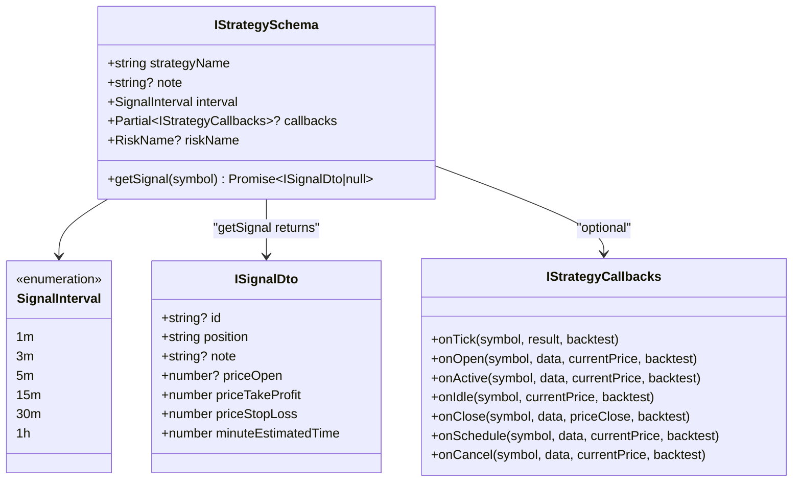
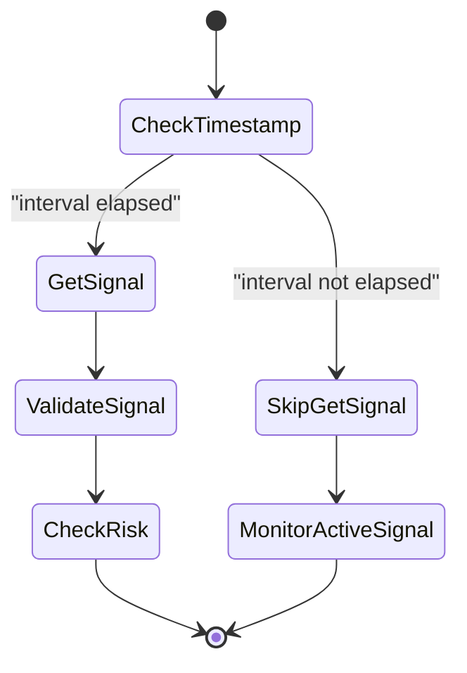
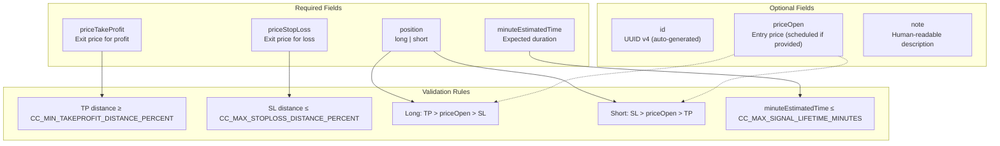
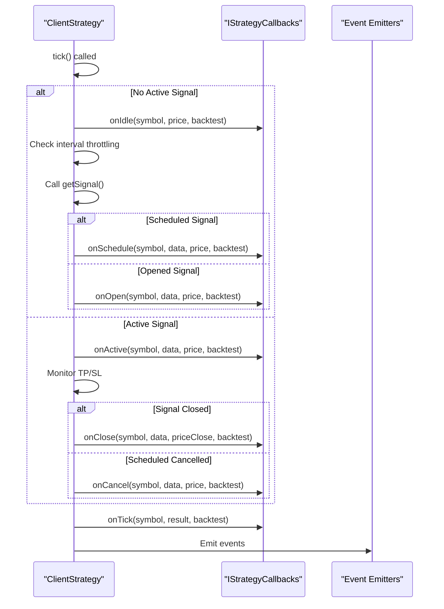
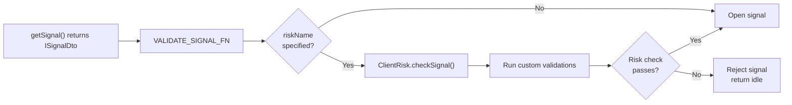
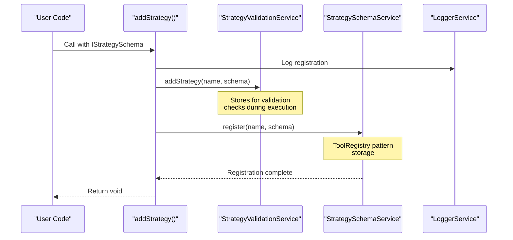
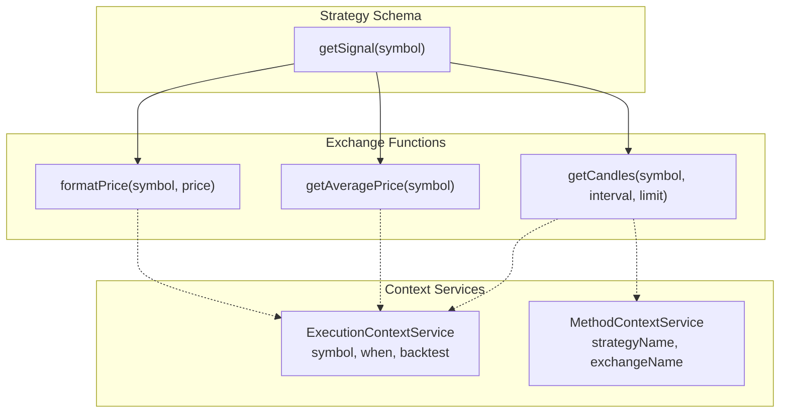
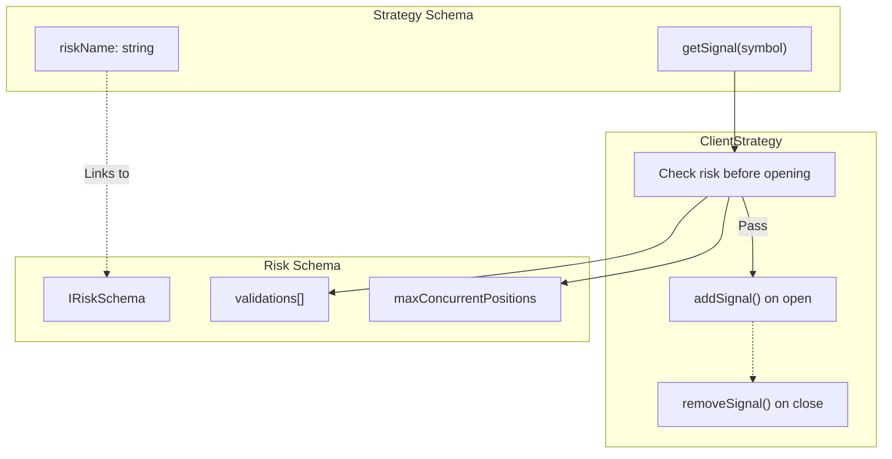

# Strategy Schemas

## Purpose and Scope

This page documents the `IStrategySchema` interface, which defines the configuration structure for trading strategies in backtest-kit. Strategy schemas specify signal generation logic, throttling intervals, lifecycle callbacks, and optional risk management integration.

For information about risk management configuration, see [Risk Schemas](#5.4). For exchange data source configuration, see [Exchange Schemas](#5.2). For strategy execution patterns, see [ClientStrategy](#6.1).

**Sources:** [types.d.ts:536-633](), [src/function/add.ts:9-62]()

---

## Schema Structure Overview

The `IStrategySchema` interface defines the complete configuration for a trading strategy. When registered via `addStrategy()`, the schema is stored in `StrategySchemaService` and validated by `StrategyValidationService`.



**Sources:** [types.d.ts:616-633](), [types.d.ts:544-559](), [types.d.ts:593-611]()

---

## Core Required Fields

### strategyName

**Type:** `StrategyName` (string)

Unique identifier for the strategy. Used throughout the framework for:
- Schema storage and retrieval in `StrategySchemaService`
- Context propagation via `MethodContextService`
- Persistence file naming (e.g., `signal-{strategyName}-{symbol}.json`)
- Risk position tracking (key format: `strategyName:symbol`)
- Report generation and markdown output

The strategy name must be unique across all registered strategies. Multiple calls to `addStrategy()` with the same `strategyName` will overwrite the previous registration.

**Sources:** [types.d.ts:617](), [src/function/add.ts:50-62]()

---

### interval

**Type:** `SignalInterval` = `"1m" | "3m" | "5m" | "15m" | "30m" | "1h"`

Minimum time interval between `getSignal()` invocations. Implements throttling to prevent signal spam and reduce computational overhead.

The framework enforces this interval using `_lastSignalTimestamp` tracking in `ClientStrategy`. When `tick()` is called, the framework checks elapsed time since last signal generation:



**Interval Mappings (INTERVAL_MINUTES):**

| Interval | Minutes | Use Case |
|----------|---------|----------|
| `1m` | 1 | High-frequency strategies, live monitoring |
| `3m` | 3 | Short-term scalping strategies |
| `5m` | 5 | Standard intraday strategies |
| `15m` | 15 | Medium-term swing strategies |
| `30m` | 30 | Longer-term position strategies |
| `1h` | 60 | Low-frequency strategies |

**Sources:** [types.d.ts:539](), [src/lib/constants/interval.ts]()

---

### getSignal

**Type:** `(symbol: string) => Promise<ISignalDto | null>`

Async function that generates trading signals. Called by `ClientStrategy.tick()` when:
1. No active signal exists (idle state)
2. Interval throttling period has elapsed
3. Strategy has not been stopped via `stop()`

**Return Values:**
- `ISignalDto` object: Creates new signal (opened or scheduled)
- `null`: No signal, remains in idle state

**Function Signature:**

```typescript
async getSignal(symbol: string): Promise<ISignalDto | null> {
  // Access to:
  // - symbol: trading pair (e.g., "BTCUSDT")
  // - Implicit context via ExecutionContextService (when, backtest)
  // - Exchange functions: getCandles(), getAveragePrice(), etc.
  
  // Return signal or null
  return {
    position: "long",
    priceOpen: 50000,        // Optional: scheduled signal
    priceTakeProfit: 51000,  // Required
    priceStopLoss: 49000,    // Required
    minuteEstimatedTime: 60, // Required
    note: "MA crossover",    // Optional
  };
}
```

**Context Availability:**

The `getSignal` function executes within `ExecutionContextService.runInContext()`, providing implicit access to:
- Current timestamp via `executionContext.when`
- Backtest flag via `executionContext.backtest`
- Exchange operations via `getCandles(symbol, interval, limit)`
- Price formatting via `formatPrice(symbol, price)`

**Sources:** [types.d.ts:628](), [src/lib/classes/client/ClientStrategy.ts]()

---

## Signal Data Transfer Object

The `ISignalDto` interface defines the structure returned by `getSignal()`. It is validated by `VALIDATE_SIGNAL_FN` before conversion to `ISignalRow`.

### ISignalDto Fields



**Field Details:**

| Field | Type | Required | Description |
|-------|------|----------|-------------|
| `id` | `string` | No | UUID v4, auto-generated if not provided |
| `position` | `"long" \| "short"` | Yes | Trade direction |
| `note` | `string` | No | Human-readable signal description |
| `priceOpen` | `number` | No | Entry price. If provided, creates scheduled signal |
| `priceTakeProfit` | `number` | Yes | Exit price for profit target |
| `priceStopLoss` | `number` | Yes | Exit price for stop loss |
| `minuteEstimatedTime` | `number` | Yes | Expected signal lifetime in minutes |

**Scheduled vs Immediate Entry:**

- **`priceOpen` provided:** Signal enters `scheduled` state, waits for price activation
- **`priceOpen` omitted:** Signal enters `opened` state immediately at current VWAP

**Sources:** [types.d.ts:544-559](), [src/lib/utils/validate/signal.ts]()

---

## Optional Configuration Fields

### callbacks

**Type:** `Partial<IStrategyCallbacks>`

Lifecycle event handlers called during signal state transitions. All callbacks are optional.



**Callback Signatures:**

```typescript
interface IStrategyCallbacks {
  // Called on every tick with unified result
  onTick: (symbol: string, result: IStrategyTickResult, backtest: boolean) => void;
  
  // Called when signal opens (immediate entry)
  onOpen: (symbol: string, data: ISignalRow, currentPrice: number, backtest: boolean) => void;
  
  // Called when signal is monitoring TP/SL
  onActive: (symbol: string, data: ISignalRow, currentPrice: number, backtest: boolean) => void;
  
  // Called when no active signal exists
  onIdle: (symbol: string, currentPrice: number, backtest: boolean) => void;
  
  // Called when signal closes (TP/SL/time)
  onClose: (symbol: string, data: ISignalRow, priceClose: number, backtest: boolean) => void;
  
  // Called when scheduled signal is created
  onSchedule: (symbol: string, data: IScheduledSignalRow, currentPrice: number, backtest: boolean) => void;
  
  // Called when scheduled signal cancelled
  onCancel: (symbol: string, data: IScheduledSignalRow, currentPrice: number, backtest: boolean) => void;
}
```

**Execution Order:**

1. State-specific callback (`onIdle`, `onOpen`, `onActive`, `onClose`, `onSchedule`, `onCancel`)
2. Universal `onTick` callback (receives discriminated union result)

**Common Use Cases:**

- **Logging:** Record signal events with timestamps and prices
- **Notifications:** Alert external systems on signal creation/closure
- **Metrics:** Track custom performance indicators
- **Debugging:** Inspect signal lifecycle during development
- **Integration:** Connect to external monitoring systems

**Sources:** [types.d.ts:593-611](), [types.d.ts:630](), [src/lib/classes/client/ClientStrategy.ts]()

---

### riskName

**Type:** `RiskName` (string, optional)

Reference to a registered risk profile via `addRisk()`. When specified, the strategy's signals are validated against the risk profile's constraints before opening positions.

**Risk Integration Flow:**



**Cross-Strategy Position Tracking:**

Multiple strategies sharing the same `riskName` share a single `ClientRisk` instance, enabling portfolio-level risk management:

- Concurrent position limits enforced across all strategies
- Custom validations receive all active positions
- Position tracking via `addSignal()` / `removeSignal()`

**Example:**

```typescript
// Register risk profile
addRisk({
  riskName: "conservative",
  validations: [
    ({ activePositionCount }) => {
      if (activePositionCount >= 5) {
        throw new Error("Max 5 concurrent positions");
      }
    }
  ]
});

// Register strategy with risk profile
addStrategy({
  strategyName: "my-strategy",
  riskName: "conservative",  // Links to risk profile
  // ... other fields
});
```

For detailed risk management configuration, see [Risk Schemas](#5.4).

**Sources:** [types.d.ts:632](), [types.d.ts:476-533](), [src/function/add.ts:50-62]()

---

### note

**Type:** `string` (optional)

Developer documentation string. Used for:
- In-code documentation
- Report generation metadata
- UI display in strategy selection interfaces

Not used by framework logic, purely informational.

**Sources:** [types.d.ts:620]()

---

## Strategy Registration Process

Strategies are registered via the `addStrategy()` function, which performs validation and storage in two services.



**Registration Code Path:**

1. User calls `addStrategy(schema)` [src/function/add.ts:50]()
2. `LoggerService.info()` logs registration [src/function/add.ts:51-53]()
3. `StrategyValidationService.addStrategy()` stores for validation [src/function/add.ts:54-57]()
4. `StrategySchemaService.register()` stores in registry [src/function/add.ts:58-61]()

**Connection Service Instantiation:**

When strategy is first used (during `Backtest.run()` or `Live.run()`):

1. `StrategyConnectionService.get(strategyName)` resolves schema
2. Creates `ClientStrategy` instance with injected dependencies:
   - `IStrategySchema` (schema from registry)
   - `LoggerService` (for debug output)
   - `ExecutionContextService` (symbol, when, backtest)
   - `TExchangeGlobalService` (exchange operations)
   - `TRiskGlobalService` (risk checking, if `riskName` specified)
3. Instance is memoized (one per strategy name)

**Sources:** [src/function/add.ts:50-62](), [src/lib/services/connection/StrategyConnectionService.ts]()

---

## Integration with Framework Components

### Relationship with Exchange



The `getSignal` function has implicit access to exchange operations via context propagation. No explicit parameters needed.

**Sources:** [src/function/exchange.ts](), [src/lib/services/context/ExecutionContextService.ts]()

---

### Relationship with Risk Management



**Risk Check Flow:**

1. Strategy returns `ISignalDto` from `getSignal()`
2. If `riskName` specified, `ClientRisk.checkSignal()` invoked
3. Risk validations execute with access to:
   - `activePositionCount`: Current open positions
   - `activePositions`: Array of all active signals
   - `params`: Signal details (symbol, price, timestamp)
4. If validation passes, signal opens and `addSignal()` called
5. On signal close, `removeSignal()` called to update portfolio state

**Sources:** [src/lib/classes/client/ClientStrategy.ts](), [src/lib/classes/client/ClientRisk.ts]()

---

## Complete Registration Example

```typescript
import { addStrategy, getCandles, getAveragePrice } from "backtest-kit";

addStrategy({
  // Required: Unique identifier
  strategyName: "sma-crossover",
  
  // Optional: Documentation
  note: "Simple moving average crossover strategy with 20/50 period EMAs",
  
  // Required: Throttling interval
  interval: "5m",
  
  // Required: Signal generation logic
  getSignal: async (symbol) => {
    // Fetch historical data
    const candles = await getCandles(symbol, "1h", 100);
    
    // Calculate indicators
    const sma20 = calculateSMA(candles, 20);
    const sma50 = calculateSMA(candles, 50);
    
    // Generate signal based on crossover
    if (sma20 > sma50) {
      const currentPrice = await getAveragePrice(symbol);
      
      return {
        position: "long",
        priceTakeProfit: currentPrice * 1.02,  // 2% profit target
        priceStopLoss: currentPrice * 0.98,    // 2% stop loss
        minuteEstimatedTime: 240,              // 4 hours
        note: "SMA20 crossed above SMA50",
      };
    }
    
    // No signal
    return null;
  },
  
  // Optional: Lifecycle callbacks
  callbacks: {
    onOpen: (symbol, signal, price, backtest) => {
      console.log(`[OPEN] ${symbol} @ ${price}`);
    },
    
    onClose: (symbol, signal, price, backtest) => {
      console.log(`[CLOSE] ${symbol} @ ${price}`);
    },
    
    onTick: (symbol, result, backtest) => {
      if (result.action === "closed") {
        console.log(`PnL: ${result.pnl.pnlPercentage}%`);
      }
    },
  },
  
  // Optional: Link to risk profile
  riskName: "conservative",
});
```

**Sources:** [src/function/add.ts:16-62](), [types.d.ts:616-633]()

---

## Related Interfaces Reference

### StrategyName

Type alias: `string`

Unique identifier for strategy schemas. Used as registry key in `StrategySchemaService`.

**Sources:** [types.d.ts:824]()

---

### SignalInterval

Type: `"1m" | "3m" | "5m" | "15m" | "30m" | "1h"`

Throttling intervals for signal generation. Enforced by `ClientStrategy._lastSignalTimestamp` tracking.

**Sources:** [types.d.ts:539]()

---

### ISignalRow

Extended version of `ISignalDto` with auto-generated fields:

- `id`: UUID v4 (always present)
- `exchangeName`: From context
- `strategyName`: From context
- `scheduledAt`: Creation timestamp
- `pendingAt`: Activation timestamp
- `symbol`: Trading pair
- `_isScheduled`: Internal runtime flag

Used internally by `ClientStrategy` and emitted in callbacks.

**Sources:** [types.d.ts:564-581]()

---

### IStrategyTickResult

Discriminated union of tick results:

- `IStrategyTickResultIdle`: No signal, idle state
- `IStrategyTickResultScheduled`: Scheduled signal created
- `IStrategyTickResultOpened`: New signal opened
- `IStrategyTickResultActive`: Signal monitoring TP/SL
- `IStrategyTickResultClosed`: Signal closed with PnL
- `IStrategyTickResultCancelled`: Scheduled signal cancelled

Use discriminant `result.action` for type-safe handling.

**Sources:** [types.d.ts:654-774]()