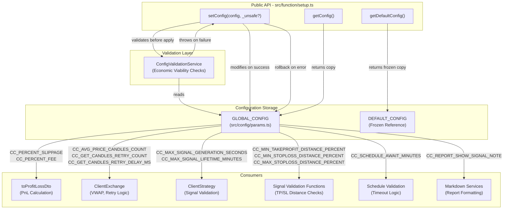
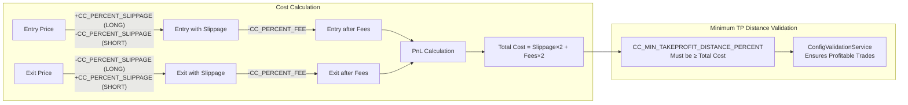
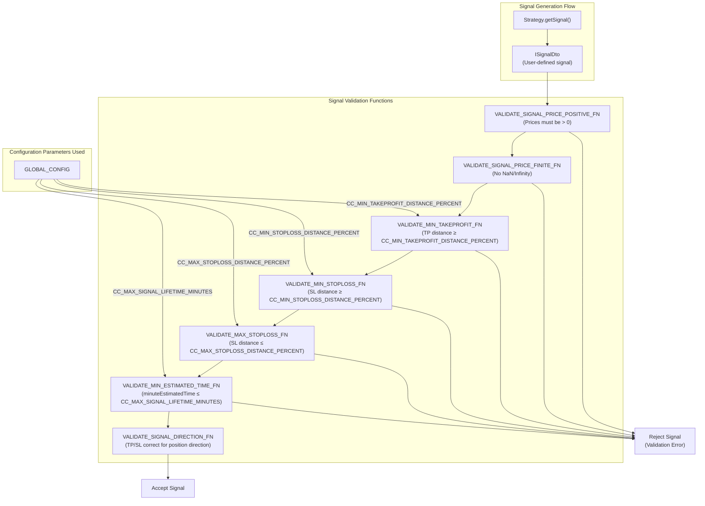
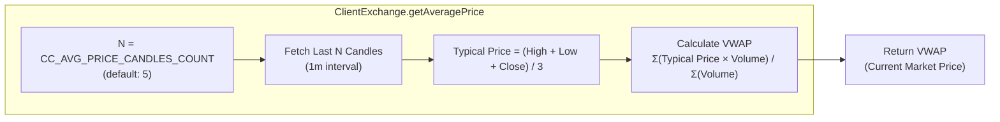
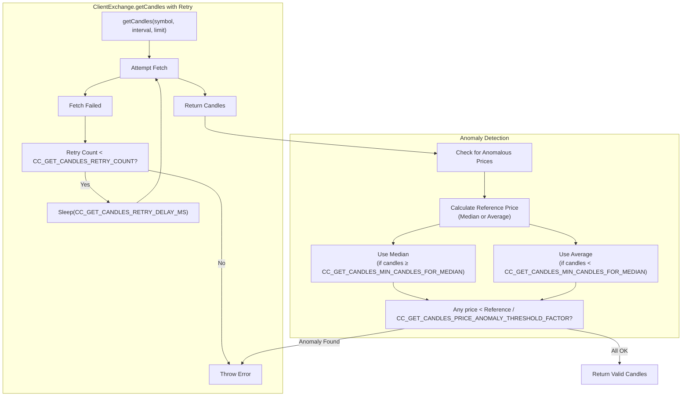

# Configuration System

The Configuration System provides centralized management of global parameters that control framework behavior, economic constraints, and safety limits. It enforces economic viability validation to prevent unprofitable trading configurations and provides runtime configuration updates with automatic rollback on validation failure.

For strategy-specific configuration, see [Defining Strategies](./12-defining-strategies.md). For risk management configuration, see [Risk Management](./14-risk-management.md). For exchange and frame configuration, see [Exchange Configuration](./22-exchange-configuration.md) and [Timeframes and Frames](./24-timeframes-and-frames.md).

---

## Architecture Overview

The configuration system consists of a global configuration object, validation service, and API functions that ensure type safety and economic viability.



---

## Global Configuration Parameters

The `GLOBAL_CONFIG` object contains 14 parameters organized into four categories:

| Parameter | Type | Default | Description |
|-----------|------|---------|-------------|
| **Economic Parameters** |
| `CC_PERCENT_SLIPPAGE` | `number` | `0.1` | Slippage percentage per transaction (applied twice: entry + exit) |
| `CC_PERCENT_FEE` | `number` | `0.1` | Fee percentage per transaction (applied twice: entry + exit) |
| `CC_MIN_TAKEPROFIT_DISTANCE_PERCENT` | `number` | `0.5` | Minimum TP distance from priceOpen (must cover slippage + fees) |
| `CC_MIN_STOPLOSS_DISTANCE_PERCENT` | `number` | `0.5` | Minimum SL distance from priceOpen (prevents instant stops) |
| `CC_MAX_STOPLOSS_DISTANCE_PERCENT` | `number` | `20.0` | Maximum SL distance from priceOpen (caps risk per signal) |
| **Time-Based Parameters** |
| `CC_SCHEDULE_AWAIT_MINUTES` | `number` | `120` | Time to wait for scheduled signal activation before cancellation |
| `CC_MAX_SIGNAL_LIFETIME_MINUTES` | `number` | `1440` | Maximum signal lifetime (prevents eternal positions) |
| `CC_MAX_SIGNAL_GENERATION_SECONDS` | `number` | `180` | Maximum time allowed for signal generation (prevents hangs) |
| **Data Fetching Parameters** |
| `CC_AVG_PRICE_CANDLES_COUNT` | `number` | `5` | Number of candles for VWAP calculation |
| `CC_GET_CANDLES_RETRY_COUNT` | `number` | `3` | Number of retries for failed candle fetches |
| `CC_GET_CANDLES_RETRY_DELAY_MS` | `number` | `5000` | Delay between retry attempts (milliseconds) |
| `CC_GET_CANDLES_PRICE_ANOMALY_THRESHOLD_FACTOR` | `number` | `1000` | Maximum deviation factor for anomaly detection (catches incomplete candles) |
| `CC_GET_CANDLES_MIN_CANDLES_FOR_MEDIAN` | `number` | `5` | Minimum candles required for median calculation (use average below this) |
| **Reporting Parameters** |
| `CC_REPORT_SHOW_SIGNAL_NOTE` | `boolean` | `false` | Controls visibility of signal notes in markdown reports |

---

## Economic Parameters and Cost Model

The framework uses a realistic cost model that applies slippage and fees to both entry and exit prices. The economic parameters ensure that signals are profitable when TakeProfit is hit.



### Cost Breakdown Example

For default configuration (`CC_PERCENT_SLIPPAGE = 0.1%`, `CC_PERCENT_FEE = 0.1%`):

- **Slippage Effect**: 0.1% × 2 = 0.2% (entry + exit)
- **Total Fees**: 0.1% × 2 = 0.2% (entry + exit)
- **Total Cost**: 0.4%
- **Minimum TP Distance**: 0.5% (default, covers costs + 0.1% profit buffer)

This ensures that when TakeProfit is hit, the signal yields at least 0.1% net profit after all costs.

---

## Economic Viability Validation

The `ConfigValidationService` enforces constraints that prevent mathematically unprofitable configurations. Validation occurs automatically when `setConfig()` is called (unless `_unsafe` flag is set).

### Validation Rules

```mermaid
graph TB
    subgraph "Validation Checks"
        Check1["Slippage ≥ 0<br/>(CC_PERCENT_SLIPPAGE)"]
        Check2["Fees ≥ 0<br/>(CC_PERCENT_FEE)"]
        Check3["Min TP Distance > 0<br/>(CC_MIN_TAKEPROFIT_DISTANCE_PERCENT)"]
        Check4["Min TP ≥ (Slippage×2 + Fees×2)<br/>(Economic Viability)"]
        Check5["Min SL > 0<br/>(CC_MIN_STOPLOSS_DISTANCE_PERCENT)"]
        Check6["Max SL > 0<br/>(CC_MAX_STOPLOSS_DISTANCE_PERCENT)"]
        Check7["Min SL < Max SL<br/>(Range Consistency)"]
        Check8["Schedule Timeout > 0<br/>(CC_SCHEDULE_AWAIT_MINUTES)"]
        Check9["Signal Lifetime > 0<br/>(CC_MAX_SIGNAL_LIFETIME_MINUTES)"]
        Check10["Generation Timeout > 0<br/>(CC_MAX_SIGNAL_GENERATION_SECONDS)"]
        Check11["Candle Count > 0<br/>(CC_AVG_PRICE_CANDLES_COUNT)"]
        Check12["Retry Count ≥ 0<br/>(CC_GET_CANDLES_RETRY_COUNT)"]
        Check13["Retry Delay > 0<br/>(CC_GET_CANDLES_RETRY_DELAY_MS)"]
        Check14["Anomaly Threshold > 0<br/>(CC_GET_CANDLES_PRICE_ANOMALY_THRESHOLD_FACTOR)"]
        Check15["Min Candles for Median > 0<br/>(CC_GET_CANDLES_MIN_CANDLES_FOR_MEDIAN)"]
    end
    
    subgraph "Critical Validation"
        Check4 -->|"MOST IMPORTANT"| EconomicViability["Ensures all TP signals<br/>are profitable after costs"]
    end
    
    AllChecks["All 15 Checks"] --> Pass["Pass: Apply Config"]
    AllChecks --> Fail["Fail: Throw Error<br/>Rollback to Previous Config"]
```



### Key Validation: Economic Viability

The most critical validation ensures `CC_MIN_TAKEPROFIT_DISTANCE_PERCENT` covers all trading costs:

```typescript
// From ConfigValidationService
const slippageEffect = GLOBAL_CONFIG.CC_PERCENT_SLIPPAGE * 2; // Entry + exit
const feesTotal = GLOBAL_CONFIG.CC_PERCENT_FEE * 2; // Entry + exit
const minRequiredTpDistance = slippageEffect + feesTotal;

if (GLOBAL_CONFIG.CC_MIN_TAKEPROFIT_DISTANCE_PERCENT < minRequiredTpDistance) {
  throw new Error(
    `CC_MIN_TAKEPROFIT_DISTANCE_PERCENT (${GLOBAL_CONFIG.CC_MIN_TAKEPROFIT_DISTANCE_PERCENT}%) ` +
    `is too low to cover trading costs.\n` +
    `Required minimum: ${minRequiredTpDistance.toFixed(2)}%\n` +
    `All TakeProfit signals will be unprofitable with current settings!`
  );
}
```

**Example Error Output**:

```
GLOBAL_CONFIG validation failed:
  CC_MIN_TAKEPROFIT_DISTANCE_PERCENT (0.3%) is too low to cover trading costs.
  Required minimum: 0.40%
  Breakdown:
    - Slippage effect: 0.20% (0.1% × 2 transactions)
    - Fees: 0.20% (0.1% × 2 transactions)
  All TakeProfit signals will be unprofitable with current settings!
```

---

## Configuration API

The framework provides three functions for configuration management:

### `setConfig(config, _unsafe?)`

Updates global configuration with validation. On validation failure, automatically rolls back to previous configuration.

**Parameters**:
- `config`: `Partial<GlobalConfig>` - Parameters to update (only specified fields are changed)
- `_unsafe`: `boolean` - Skip validation (used in test environments)

**Behavior**:
1. Saves current configuration for rollback
2. Applies partial update to `GLOBAL_CONFIG`
3. Runs `ConfigValidationService.validate()` (unless `_unsafe` is true)
4. On error: restores previous configuration and re-throws error
5. On success: new configuration is active

**Example**:

```typescript
import { setConfig } from 'backtest-kit';

// Update slippage and fees
setConfig({
  CC_PERCENT_SLIPPAGE: 0.15,  // Increase slippage to 0.15%
  CC_PERCENT_FEE: 0.12,       // Increase fees to 0.12%
});

// Validation will fail if TP distance is too low
try {
  setConfig({
    CC_MIN_TAKEPROFIT_DISTANCE_PERCENT: 0.2,  // Too low for new costs
  });
} catch (error) {
  console.error('Config rejected:', error.message);
  // GLOBAL_CONFIG remains unchanged
}
```

### `getConfig()`

Returns a shallow copy of the current configuration. Use this to inspect current settings without modifying them.

**Returns**: `GlobalConfig` - Copy of current configuration

**Example**:

```typescript
import { getConfig } from 'backtest-kit';

const currentConfig = getConfig();
console.log('Current slippage:', currentConfig.CC_PERCENT_SLIPPAGE);
console.log('Current fee:', currentConfig.CC_PERCENT_FEE);

// Modifying the returned object does NOT affect GLOBAL_CONFIG
currentConfig.CC_PERCENT_SLIPPAGE = 999; // No effect on actual config
```

### `getDefaultConfig()`

Returns a frozen reference to the default configuration. Use this to see all available parameters and their default values.

**Returns**: `Readonly<GlobalConfig>` - Frozen reference to defaults

**Example**:

```typescript
import { getDefaultConfig } from 'backtest-kit';

const defaults = getDefaultConfig();
console.log('Default slippage:', defaults.CC_PERCENT_SLIPPAGE); // 0.1
console.log('Default fee:', defaults.CC_PERCENT_FEE); // 0.1

// Cannot modify (frozen object)
defaults.CC_PERCENT_SLIPPAGE = 999; // TypeError in strict mode
```

---

## Validation Rule Reference

Complete list of validation rules enforced by `ConfigValidationService`:

### Percentage Parameters

| Parameter | Rule | Rationale |
|-----------|------|-----------|
| `CC_PERCENT_SLIPPAGE` | Must be ≥ 0 | Negative slippage is meaningless |
| `CC_PERCENT_FEE` | Must be ≥ 0 | Negative fees are impossible |
| `CC_MIN_TAKEPROFIT_DISTANCE_PERCENT` | Must be > 0 | Zero TP distance is invalid |
| `CC_MIN_TAKEPROFIT_DISTANCE_PERCENT` | Must be ≥ (slippage×2 + fees×2) | **Critical**: Ensures profitable trades |
| `CC_MIN_STOPLOSS_DISTANCE_PERCENT` | Must be > 0 | Zero SL distance causes instant stops |
| `CC_MAX_STOPLOSS_DISTANCE_PERCENT` | Must be > 0 | Caps maximum risk per signal |
| `CC_MIN_STOPLOSS_DISTANCE_PERCENT` | Must be < `CC_MAX_STOPLOSS_DISTANCE_PERCENT` | Range consistency |

### Integer Parameters

| Parameter | Rule | Rationale |
|-----------|------|-----------|
| `CC_SCHEDULE_AWAIT_MINUTES` | Must be positive integer | Prevents eternal scheduled signals |
| `CC_MAX_SIGNAL_LIFETIME_MINUTES` | Must be positive integer | Prevents eternal open positions |
| `CC_MAX_SIGNAL_GENERATION_SECONDS` | Must be positive integer | Prevents hanging signal generation |
| `CC_AVG_PRICE_CANDLES_COUNT` | Must be positive integer | VWAP requires at least 1 candle |
| `CC_GET_CANDLES_RETRY_COUNT` | Must be non-negative integer | 0 retries = no retry, ≥1 = retry N times |
| `CC_GET_CANDLES_RETRY_DELAY_MS` | Must be positive integer | Retry delay must be positive |
| `CC_GET_CANDLES_PRICE_ANOMALY_THRESHOLD_FACTOR` | Must be positive number | Anomaly detection requires threshold |
| `CC_GET_CANDLES_MIN_CANDLES_FOR_MEDIAN` | Must be positive integer | Median calculation requires data points |

### Boolean Parameters

| Parameter | Rule | Rationale |
|-----------|------|-----------|
| `CC_REPORT_SHOW_SIGNAL_NOTE` | Must be boolean | Controls report formatting |

---

## Integration with Signal Validation

Configuration parameters are used throughout signal validation to enforce economic constraints and safety limits.



**Example Validation Errors**:

```typescript
// TP distance too close (below CC_MIN_TAKEPROFIT_DISTANCE_PERCENT)
{
  position: "long",
  priceOpen: 50000,
  priceTakeProfit: 50200,  // Only 0.4% profit
  priceStopLoss: 49000,
  minuteEstimatedTime: 60
}
// Error: "TP distance (0.40%) is below minimum (0.50%)"

// SL distance too large (above CC_MAX_STOPLOSS_DISTANCE_PERCENT)
{
  position: "long",
  priceOpen: 50000,
  priceTakeProfit: 55000,
  priceStopLoss: 30000,  // 40% risk - exceeds 20% max
  minuteEstimatedTime: 60
}
// Error: "SL distance (40.00%) exceeds maximum (20.00%)"

// Signal lifetime too long (above CC_MAX_SIGNAL_LIFETIME_MINUTES)
{
  position: "long",
  priceOpen: 50000,
  priceTakeProfit: 55000,
  priceStopLoss: 45000,
  minuteEstimatedTime: 50000  // >34 days (exceeds 1440 min default)
}
// Error: "Signal lifetime (50000 min) exceeds maximum (1440 min)"
```

(inferred from test files), [test/e2e/sanitize.test.mjs:1-887]()

---

## Integration with VWAP Calculation

The `CC_AVG_PRICE_CANDLES_COUNT` parameter controls how many recent 1-minute candles are used for VWAP (Volume-Weighted Average Price) calculation.



**Formula**:

```
VWAP = Σ(Typical Price × Volume) / Σ(Volume)

where Typical Price = (High + Low + Close) / 3
```

**Example with default `CC_AVG_PRICE_CANDLES_COUNT = 5`**:

| Candle | High | Low | Close | Volume | Typical Price | Weighted |
|--------|------|-----|-------|--------|---------------|----------|
| 1 | 50100 | 49900 | 50000 | 100 | 50000 | 5000000 |
| 2 | 50200 | 50000 | 50100 | 120 | 50100 | 6012000 |
| 3 | 50300 | 50100 | 50200 | 110 | 50200 | 5522000 |
| 4 | 50400 | 50200 | 50300 | 130 | 50300 | 6539000 |
| 5 | 50500 | 50300 | 50400 | 140 | 50400 | 7056000 |
| **Total** | | | | **600** | | **30129000** |

VWAP = 30129000 / 600 = **50215**

(inferred), [types.d.ts:404-412](), [src/config/params.ts:7-11]()

---

## Integration with Retry Logic

Data fetching parameters control retry behavior and anomaly detection when fetching candles from exchanges.



**Default Retry Configuration**:
- `CC_GET_CANDLES_RETRY_COUNT = 3`: Retry up to 3 times on failure
- `CC_GET_CANDLES_RETRY_DELAY_MS = 5000`: Wait 5 seconds between retries

**Anomaly Detection Example**:

```typescript
// Candles fetched: BTC at ~$50,000
const candles = [
  { open: 50000, high: 50100, low: 49900, close: 50000, volume: 100 },
  { open: 50100, high: 50200, low: 50000, close: 50100, volume: 110 },
  { open: 0.01, high: 0.02, low: 0.01, close: 0.01, volume: 0 }, // ANOMALY!
  { open: 50200, high: 50300, low: 50100, close: 50200, volume: 120 },
  { open: 50300, high: 50400, low: 50200, close: 50300, volume: 130 },
];

// Reference price (median): ~50000
// Anomaly threshold: 50000 / 1000 = 50
// Candle 3 has price 0.01 < 50 → REJECTED
// Error: "VALIDATE_NO_INCOMPLETE_CANDLES_FN detected anomalously low price"
```

This protects against incomplete candles from Binance API that sometimes have near-zero prices.

---

## Test Configuration

For test environments, the `_unsafe` parameter allows skipping validation:

```typescript
import { setConfig } from 'backtest-kit';

// Test setup: disable validations for old test compatibility
setConfig({
  CC_MIN_TAKEPROFIT_DISTANCE_PERCENT: 0,  // Normally invalid
  CC_MIN_STOPLOSS_DISTANCE_PERCENT: 0,
  CC_MAX_STOPLOSS_DISTANCE_PERCENT: 100,
  CC_MAX_SIGNAL_LIFETIME_MINUTES: 999999,
}, true);  // _unsafe = true, skip validation
```

**Warning**: Never use `_unsafe = true` in production. It bypasses all safety checks including economic viability validation.

---

## Configuration in Practice

### Example: Conservative Trading Configuration

```typescript
import { setConfig } from 'backtest-kit';

// Conservative settings: higher costs, stricter limits
setConfig({
  // Economic constraints
  CC_PERCENT_SLIPPAGE: 0.15,              // 0.15% slippage
  CC_PERCENT_FEE: 0.12,                   // 0.12% fees
  CC_MIN_TAKEPROFIT_DISTANCE_PERCENT: 1.0, // 1% minimum profit (well above 0.54% costs)
  CC_MIN_STOPLOSS_DISTANCE_PERCENT: 0.8,  // 0.8% minimum SL distance
  CC_MAX_STOPLOSS_DISTANCE_PERCENT: 10.0, // 10% maximum risk per signal
  
  // Time constraints
  CC_SCHEDULE_AWAIT_MINUTES: 60,          // 1 hour max for limit orders
  CC_MAX_SIGNAL_LIFETIME_MINUTES: 720,    // 12 hours max per signal
  
  // Data quality
  CC_AVG_PRICE_CANDLES_COUNT: 10,         // Use 10 candles for VWAP (more stable)
  CC_GET_CANDLES_RETRY_COUNT: 5,          // 5 retries (more resilient)
});
```

### Example: Aggressive Trading Configuration

```typescript
import { setConfig } from 'backtest-kit';

// Aggressive settings: lower costs, looser limits
setConfig({
  // Economic constraints
  CC_PERCENT_SLIPPAGE: 0.05,              // 0.05% slippage
  CC_PERCENT_FEE: 0.05,                   // 0.05% fees
  CC_MIN_TAKEPROFIT_DISTANCE_PERCENT: 0.25, // 0.25% minimum profit (just above 0.2% costs)
  CC_MIN_STOPLOSS_DISTANCE_PERCENT: 0.3,  // 0.3% minimum SL distance
  CC_MAX_STOPLOSS_DISTANCE_PERCENT: 30.0, // 30% maximum risk per signal
  
  // Time constraints
  CC_SCHEDULE_AWAIT_MINUTES: 240,         // 4 hours max for limit orders
  CC_MAX_SIGNAL_LIFETIME_MINUTES: 2880,   // 48 hours max per signal
  
  // Data quality
  CC_AVG_PRICE_CANDLES_COUNT: 3,          // Use 3 candles for VWAP (faster response)
  CC_GET_CANDLES_RETRY_COUNT: 2,          // 2 retries (fail faster)
});
```

---

## Summary

The Configuration System provides:

1. **Centralized Management**: Single `GLOBAL_CONFIG` object for all framework parameters
2. **Economic Viability**: Automatic validation ensures profitable trading configurations
3. **Type Safety**: TypeScript types prevent invalid parameter values
4. **Rollback Protection**: Failed configuration updates do not corrupt the system
5. **Runtime Updates**: Configuration can be changed at any time with `setConfig()`
6. **Default Values**: Sensible defaults for production use (0.1% slippage, 0.1% fees, 0.5% min TP)

**Key Design Principles**:
- **Fail-Fast**: Validation errors prevent system execution with invalid configuration
- **Rollback Safety**: On validation failure, previous configuration is restored
- **Economic Correctness**: Mathematical validation ensures profitable trades
- **Test Flexibility**: `_unsafe` flag allows test environments to bypass validation

