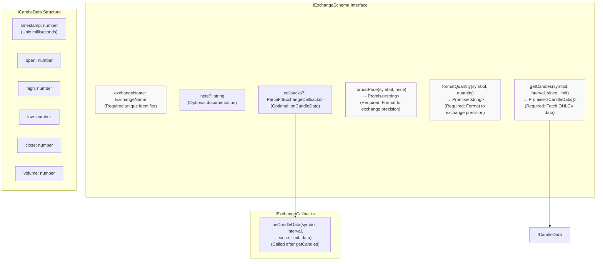
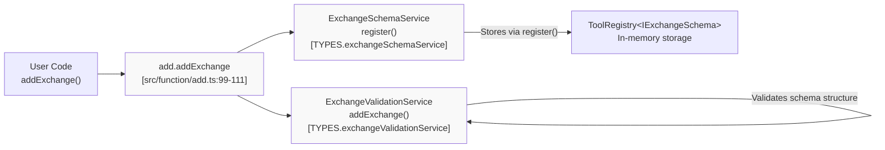
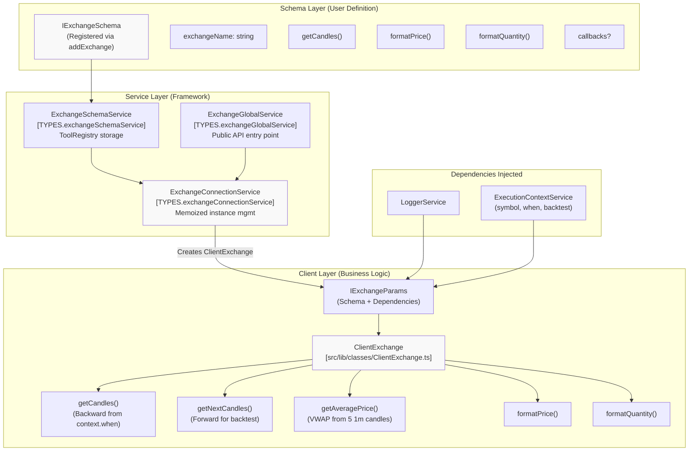
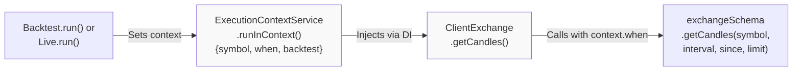

# Exchange Schemas

<details>
<summary>Relevant source files</summary>

The following files were used as context for generating this wiki page:

- [src/function/add.ts](src/function/add.ts)
- [src/function/list.ts](src/function/list.ts)
- [src/index.ts](src/index.ts)
- [src/lib/core/provide.ts](src/lib/core/provide.ts)
- [src/lib/core/types.ts](src/lib/core/types.ts)
- [src/lib/index.ts](src/lib/index.ts)
- [test/index.mjs](test/index.mjs)
- [types.d.ts](types.d.ts)

</details>


Exchange schemas define data source interfaces for fetching historical market data and formatting prices/quantities according to exchange-specific precision rules. They provide the abstraction layer between the framework's signal processing logic and external data sources (APIs, databases, CSV files, etc.).

This page covers the structure and registration of exchange schemas. For information about the runtime exchange client implementation, see [ClientExchange](#6.2). For utility functions that use registered exchanges, see [Exchange Functions](#4.7).

## Overview

An exchange schema registered via `addExchange()` must implement the `IExchangeSchema` interface, which defines three core responsibilities:

1. **Candle Data Fetching** - Retrieve historical OHLCV data via `getCandles()`
2. **Price Formatting** - Format prices to exchange precision via `formatPrice()`
3. **Quantity Formatting** - Format quantities to exchange precision via `formatQuantity()`

The framework uses these methods internally for backtesting (historical data iteration) and live trading (VWAP calculation, TP/SL monitoring). The exchange schema does not contain business logic—it is a pure data access interface. Runtime logic is handled by `ClientExchange`.

Sources: [types.d.ts:188-221](), [src/function/add.ts:64-111]()

## Exchange Schema Structure



**Required Fields:**

- **exchangeName** - Unique identifier for this exchange (type: `ExchangeName` = `string`)
- **getCandles** - Function to fetch historical candle data
- **formatPrice** - Function to format prices according to exchange precision rules
- **formatQuantity** - Function to format quantities according to exchange precision rules

**Optional Fields:**

- **note** - Developer documentation string
- **callbacks** - Lifecycle event callbacks for candle data events

Sources: [types.d.ts:188-221](), [types.d.ts:153-166](), [types.d.ts:180-183]()

## Registration Flow



The registration process follows this sequence:

1. **User calls `addExchange(exchangeSchema)`** - Provides schema configuration
2. **ValidationService validates** - Checks schema structure, required methods exist
3. **SchemaService stores** - Uses `ToolRegistry` pattern to store schema by `exchangeName`
4. **Logger records** - Logs registration via `loggerService.info()`

Once registered, the schema becomes available for use in backtest and live execution modes. The framework uses `ExchangeConnectionService` to lazily instantiate `ClientExchange` instances from the stored schema.

Sources: [src/function/add.ts:99-111](), [src/lib/core/types.ts:10-16](), [src/lib/core/provide.ts:54-59]()

## Required Methods

### getCandles Method

The `getCandles()` method is the primary data source interface for the framework. It must return an array of OHLCV candles sorted chronologically.

**Signature:**
```typescript
getCandles: (
  symbol: string,
  interval: CandleInterval,
  since: Date,
  limit: number
) => Promise<ICandleData[]>
```

**Parameters:**

| Parameter | Type | Description |
|-----------|------|-------------|
| `symbol` | `string` | Trading pair symbol (e.g., `"BTCUSDT"`) |
| `interval` | `CandleInterval` | Candle timeframe (`"1m"` \| `"3m"` \| `"5m"` \| `"15m"` \| `"30m"` \| `"1h"` \| `"2h"` \| `"4h"` \| `"6h"` \| `"8h"`) |
| `since` | `Date` | Start date for candle fetching |
| `limit` | `number` | Maximum number of candles to return |

**Return Value:**

Array of `ICandleData` objects with fields:
- `timestamp` - Unix milliseconds when candle opened
- `open` - Opening price
- `high` - Highest price during period
- `low` - Lowest price during period
- `close` - Closing price
- `volume` - Trading volume

**Usage Context:**

- **Backtest Mode** - Called once per strategy tick to fetch historical candles backward from `executionContext.when`
- **Live Mode** - Called for VWAP calculation (last 5 1-minute candles) and TP/SL monitoring
- **Fast-Forward Backtest** - Called once to fetch large candle array for `strategy.backtest()`

Sources: [types.d.ts:148-166](), [types.d.ts:196-202]()

### formatPrice Method

The `formatPrice()` method formats raw price values to exchange-specific precision rules. This ensures displayed prices match exchange conventions.

**Signature:**
```typescript
formatPrice: (
  symbol: string,
  price: number
) => Promise<string>
```

**Parameters:**

| Parameter | Type | Description |
|-----------|------|-------------|
| `symbol` | `string` | Trading pair symbol (e.g., `"BTCUSDT"`) |
| `price` | `number` | Raw price value to format |

**Return Value:** 

Formatted price string respecting exchange precision (e.g., `"50123.45"` for BTC with 2 decimal places).

**Usage Context:**

- Formatting prices in markdown reports
- Displaying prices in callbacks
- Logging formatted price values

Sources: [types.d.ts:211-218]()

### formatQuantity Method

The `formatQuantity()` method formats raw quantity values to exchange-specific precision rules. This ensures displayed quantities match exchange conventions.

**Signature:**
```typescript
formatQuantity: (
  symbol: string,
  quantity: number
) => Promise<string>
```

**Parameters:**

| Parameter | Type | Description |
|-----------|------|-------------|
| `symbol` | `string` | Trading pair symbol (e.g., `"BTCUSDT"`) |
| `quantity` | `number` | Raw quantity value to format |

**Return Value:** 

Formatted quantity string respecting exchange precision (e.g., `"0.00123456"` for BTC with 8 decimal places).

**Usage Context:**

- Formatting quantities in markdown reports
- Displaying quantities in callbacks
- Logging formatted quantity values

Sources: [types.d.ts:204-210]()

## Optional Callbacks

The `callbacks` field allows registering lifecycle event handlers. Currently, only `onCandleData` is supported.

### onCandleData Callback

Called immediately after `getCandles()` completes successfully. Useful for logging, debugging, or caching candle data.

**Signature:**
```typescript
onCandleData: (
  symbol: string,
  interval: CandleInterval,
  since: Date,
  limit: number,
  data: ICandleData[]
) => void
```

**Parameters:**

| Parameter | Type | Description |
|-----------|------|-------------|
| `symbol` | `string` | Trading pair symbol |
| `interval` | `CandleInterval` | Requested candle interval |
| `since` | `Date` | Requested start date |
| `limit` | `number` | Requested limit |
| `data` | `ICandleData[]` | Fetched candle data array |

**Example:**
```typescript
addExchange({
  exchangeName: "binance",
  getCandles: async (symbol, interval, since, limit) => { /* ... */ },
  formatPrice: async (symbol, price) => price.toFixed(2),
  formatQuantity: async (symbol, quantity) => quantity.toFixed(8),
  callbacks: {
    onCandleData: (symbol, interval, since, limit, data) => {
      console.log(`Fetched ${data.length} candles for ${symbol} ${interval}`);
    }
  }
});
```

Sources: [types.d.ts:180-183](), [types.d.ts:220]()

## Runtime Integration



**Flow:**

1. **Schema Registration** - User calls `addExchange(schema)`, stored in `ExchangeSchemaService`
2. **Lazy Instantiation** - `ExchangeConnectionService.get(exchangeName)` creates memoized `ClientExchange` instance
3. **Dependency Injection** - Framework injects `IExchangeParams` with schema, logger, and execution context
4. **Runtime Operations** - `ClientExchange` delegates to schema methods, adds VWAP calculation logic

**Key Distinction:**

- `IExchangeSchema` - User-defined data access interface (no business logic)
- `IExchange` - Runtime interface implemented by `ClientExchange` (adds VWAP, forward/backward candle fetching)

The `ClientExchange` class wraps the schema methods and adds framework-specific functionality like VWAP calculation and context-aware candle fetching. It uses `executionContext.when` to determine the current timestamp for fetching candles backward (past data) or forward (future data for backtesting).

Sources: [types.d.ts:171-176](), [types.d.ts:226-271](), [src/lib/core/types.ts:10-16]()

## Context Propagation

The exchange schema methods do not receive explicit context parameters. Instead, context flows implicitly through `ExecutionContextService`:



**Context Fields Used:**

- `executionContext.when` - Used to calculate `since` parameter for `getCandles()`
- `executionContext.symbol` - Passed directly to schema methods
- `executionContext.backtest` - Determines whether to fetch backward (backtest) or forward (live)

The schema implementation does not need to be aware of this context—it simply receives parameters and returns data. The framework handles all context-aware logic in `ClientExchange`.

Sources: [types.d.ts:105-112](), [types.d.ts:132-138]()

## Common Integration Patterns

### CCXT Exchange Integration

```typescript
import ccxt from 'ccxt';

const exchange = new ccxt.binance();

addExchange({
  exchangeName: "binance-ccxt",
  getCandles: async (symbol, interval, since, limit) => {
    const ohlcv = await exchange.fetchOHLCV(
      symbol,
      interval,
      since.getTime(),
      limit
    );
    return ohlcv.map(([timestamp, open, high, low, close, volume]) => ({
      timestamp,
      open,
      high,
      low,
      close,
      volume
    }));
  },
  formatPrice: async (symbol, price) => {
    const market = exchange.market(symbol);
    return exchange.priceToPrecision(symbol, price);
  },
  formatQuantity: async (symbol, quantity) => {
    const market = exchange.market(symbol);
    return exchange.amountToPrecision(symbol, quantity);
  }
});
```

### Database Integration

```typescript
import { Database } from './db';

const db = new Database('./candles.db');

addExchange({
  exchangeName: "sqlite-candles",
  getCandles: async (symbol, interval, since, limit) => {
    return await db.query(`
      SELECT timestamp, open, high, low, close, volume
      FROM candles
      WHERE symbol = ? AND interval = ? AND timestamp >= ?
      ORDER BY timestamp ASC
      LIMIT ?
    `, [symbol, interval, since.getTime(), limit]);
  },
  formatPrice: async (symbol, price) => {
    // Get precision from metadata table
    const { pricePrecision } = await db.getSymbolInfo(symbol);
    return price.toFixed(pricePrecision);
  },
  formatQuantity: async (symbol, quantity) => {
    const { quantityPrecision } = await db.getSymbolInfo(symbol);
    return quantity.toFixed(quantityPrecision);
  }
});
```

### CSV File Integration

```typescript
import { readCSV } from './csv-reader';

addExchange({
  exchangeName: "csv-historical",
  getCandles: async (symbol, interval, since, limit) => {
    const allCandles = await readCSV(`./data/${symbol}_${interval}.csv`);
    const filtered = allCandles.filter(c => c.timestamp >= since.getTime());
    return filtered.slice(0, limit);
  },
  formatPrice: async (symbol, price) => price.toFixed(2),
  formatQuantity: async (symbol, quantity) => quantity.toFixed(8)
});
```

Sources: [src/function/add.ts:64-111]()

## Validation Rules

The `ExchangeValidationService` enforces these validation rules during registration:

1. **exchangeName must be unique** - Cannot register duplicate exchange names
2. **getCandles must be a function** - Required method must exist and be callable
3. **formatPrice must be a function** - Required method must exist and be callable
4. **formatQuantity must be a function** - Required method must exist and be callable
5. **callbacks must be an object** - If provided, must be valid object with valid function properties

Validation errors are thrown synchronously from `addExchange()` to provide immediate feedback.

Sources: [src/lib/core/types.ts:59-66](), [src/lib/core/provide.ts:103-109]()

## Listing Registered Exchanges

Use `listExchanges()` to retrieve all registered exchange schemas:

```typescript
import { listExchanges } from 'backtest-kit';

const exchanges = await listExchanges();
console.log(exchanges.map(e => e.exchangeName));
// ["binance", "coinbase", "sqlite-candles"]
```

This is useful for:
- Building dynamic UIs that list available exchanges
- Debugging registration issues
- Generating documentation from registered schemas
- Validating that required exchanges are registered before execution

Sources: [src/function/list.ts:41-44](), [src/index.ts:1-32]()

## Best Practices

**1. Cache candle data when possible** - Avoid redundant API calls by implementing caching in `getCandles()`:
```typescript
const candleCache = new Map();

getCandles: async (symbol, interval, since, limit) => {
  const key = `${symbol}:${interval}:${since.getTime()}:${limit}`;
  if (!candleCache.has(key)) {
    candleCache.set(key, await fetchFromAPI(symbol, interval, since, limit));
  }
  return candleCache.get(key);
}
```

**2. Handle rate limiting** - Implement exponential backoff for API-based exchanges to avoid rate limit errors.

**3. Validate candle data** - Ensure returned candles are sorted chronologically and contain valid OHLCV values.

**4. Use callbacks for observability** - Implement `onCandleData` to log data fetching for debugging:
```typescript
callbacks: {
  onCandleData: (symbol, interval, since, limit, data) => {
    logger.debug(`[Exchange] Fetched ${data.length}/${limit} candles for ${symbol}`);
  }
}
```

**5. Keep schemas stateless** - Exchange schemas should not maintain state. Store state in external services (databases, caches) and keep the schema as a pure interface.

Sources: [types.d.ts:180-183](), [src/function/add.ts:99-111]()