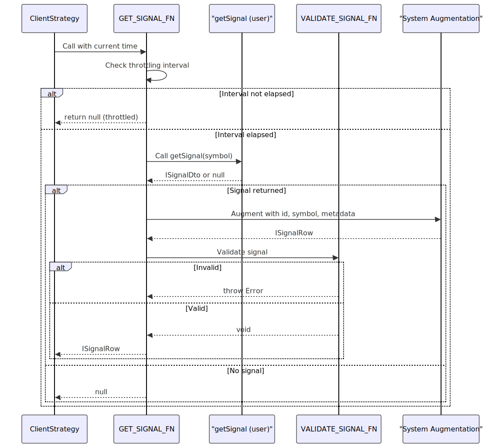

# Signal Generation and Validation

This document describes how trading signals are generated and validated before execution in the backtest-kit framework. It covers the throttling mechanism that prevents signal spam, the transformation from user-provided data to validated signal rows, and the comprehensive validation rules that ensure signal integrity for both long and short positions.

For information about signal state transitions during execution, see [Signal States](24_Signal_States.md). For information about crash-safe persistence of signals, see [Signal Persistence](26_Signal_Persistence.md).

## Overview

Signal generation occurs during the `tick()` method when no pending signal exists. The framework calls the user-provided `getSignal` function from the strategy schema, applies interval-based throttling, validates the returned signal, and augments it with system metadata before persisting and yielding it to the user.

### Signal Generation Flow




## Signal DTO Transformation

The user's `getSignal` function returns an `ISignalDto` which contains the core signal parameters. The framework augments this with system metadata to create an `ISignalRow` used throughout execution.

### DTO to Row Mapping

| Field | Source | Description |
|-------|--------|-------------|
| `id` | Auto-generated | UUID v4 generated by `randomString()` |
| `position` | User DTO | `"long"` or `"short"` |
| `note` | User DTO | Optional human-readable description |
| `priceOpen` | User DTO | Entry price for position |
| `priceTakeProfit` | User DTO | Target exit price for profit |
| `priceStopLoss` | User DTO | Target exit price for loss |
| `minuteEstimatedTime` | User DTO | Expected signal duration in minutes |
| `symbol` | Execution context | Trading pair (e.g., `"BTCUSDT"`) |
| `exchangeName` | Method context | Exchange identifier from schema |
| `strategyName` | Method context | Strategy identifier from schema |
| `timestamp` | Current time | Signal creation time in milliseconds |

The transformation occurs in the `GET_SIGNAL_FN` wrapper function:

```typescript
const signalRow: ISignalRow = {
  id: randomString(),
  ...signal,
  symbol: self.params.execution.context.symbol,
  exchangeName: self.params.method.context.exchangeName,
  strategyName: self.params.method.context.strategyName,
  timestamp: currentTime,
};
```


## Interval-Based Throttling

To prevent signal spam, the framework enforces a minimum time interval between `getSignal` calls. This throttling operates at the strategy level using the `interval` field from `IStrategySchema`.

### Supported Intervals




### Throttling Implementation

The throttling mechanism tracks the last signal generation time in `_lastSignalTimestamp` and compares it against the current execution time:

```typescript
const intervalMinutes = INTERVAL_MINUTES[self.params.interval];
const intervalMs = intervalMinutes * 60 * 1000;

if (
  self._lastSignalTimestamp !== null &&
  currentTime - self._lastSignalTimestamp < intervalMs
) {
  return null; // Signal generation throttled
}

self._lastSignalTimestamp = currentTime;
```

**Key Behaviors:**

- First call: `_lastSignalTimestamp` is `null`, so throttling is bypassed
- Subsequent calls: Throttled until interval elapses
- Throttle check happens **before** calling user's `getSignal` function
- Timestamp updated only when interval elapses
- Works in both backtest and live modes


## Validation Rules

All signals undergo comprehensive validation before execution. The `VALIDATE_SIGNAL_FN` function enforces strict rules to prevent invalid trades. Validation failures throw descriptive errors listing all violations.

### Validation Rule Diagram




### Price Validation

All prices must be strictly positive:

| Field | Rule | Error Message |
|-------|------|---------------|
| `priceOpen` | `> 0` | `priceOpen must be positive, got {value}` |
| `priceTakeProfit` | `> 0` | `priceTakeProfit must be positive, got {value}` |
| `priceStopLoss` | `> 0` | `priceStopLoss must be positive, got {value}` |

Implementation:

```typescript
if (signal.priceOpen <= 0) {
  errors.push(`priceOpen must be positive, got ${signal.priceOpen}`);
}
if (signal.priceTakeProfit <= 0) {
  errors.push(`priceTakeProfit must be positive, got ${signal.priceTakeProfit}`);
}
if (signal.priceStopLoss <= 0) {
  errors.push(`priceStopLoss must be positive, got ${signal.priceStopLoss}`);
}
```


### Long Position Rules

For `position === "long"` (buy position), take profit must exceed entry price and stop loss must be below entry price:

| Condition | Rule | Rationale |
|-----------|------|-----------|
| Take Profit | `priceTakeProfit > priceOpen` | Profit when price rises |
| Stop Loss | `priceStopLoss < priceOpen` | Exit when price falls |

```typescript
if (signal.position === "long") {
  if (signal.priceTakeProfit <= signal.priceOpen) {
    errors.push(
      `Long: priceTakeProfit (${signal.priceTakeProfit}) must be > priceOpen (${signal.priceOpen})`
    );
  }
  if (signal.priceStopLoss >= signal.priceOpen) {
    errors.push(
      `Long: priceStopLoss (${signal.priceStopLoss}) must be < priceOpen (${signal.priceOpen})`
    );
  }
}
```

**Example Valid Long Signal:**
- `priceOpen: 50000`
- `priceTakeProfit: 51000` ✅ (51000 > 50000)
- `priceStopLoss: 49000` ✅ (49000 < 50000)


### Short Position Rules

For `position === "short"` (sell position), take profit must be below entry price and stop loss must exceed entry price:

| Condition | Rule | Rationale |
|-----------|------|-----------|
| Take Profit | `priceTakeProfit < priceOpen` | Profit when price falls |
| Stop Loss | `priceStopLoss > priceOpen` | Exit when price rises |

```typescript
if (signal.position === "short") {
  if (signal.priceTakeProfit >= signal.priceOpen) {
    errors.push(
      `Short: priceTakeProfit (${signal.priceTakeProfit}) must be < priceOpen (${signal.priceOpen})`
    );
  }
  if (signal.priceStopLoss <= signal.priceOpen) {
    errors.push(
      `Short: priceStopLoss (${signal.priceStopLoss}) must be > priceOpen (${signal.priceOpen})`
    );
  }
}
```

**Example Valid Short Signal:**
- `priceOpen: 50000`
- `priceTakeProfit: 49000` ✅ (49000 < 50000)
- `priceStopLoss: 51000` ✅ (51000 > 50000)


### Time Parameter Validation

Time-related fields must be positive to ensure valid signal lifecycle:

| Field | Rule | Error Message |
|-------|------|---------------|
| `minuteEstimatedTime` | `> 0` | `minuteEstimatedTime must be positive, got {value}` |
| `timestamp` | `> 0` | `timestamp must be positive, got {value}` |

```typescript
if (signal.minuteEstimatedTime <= 0) {
  errors.push(
    `minuteEstimatedTime must be positive, got ${signal.minuteEstimatedTime}`
  );
}
if (signal.timestamp <= 0) {
  errors.push(`timestamp must be positive, got ${signal.timestamp}`);
}
```

The `minuteEstimatedTime` determines when the signal expires if neither take profit nor stop loss is hit. The `timestamp` is used for tracking signal creation time and is automatically set by the framework.


## Error Handling

Validation errors are accumulated into an array and thrown as a single error with detailed messages. The `GET_SIGNAL_FN` wrapper uses `trycatch` from `functools-kit` to handle errors gracefully.

### Error Structure

```typescript
if (errors.length > 0) {
  throw new Error(
    `Invalid signal for ${signal.position} position:\n${errors.join("\n")}`
  );
}
```

Example error output for an invalid long signal:

```
Invalid signal for long position:
Long: priceTakeProfit (49000) must be > priceOpen (50000)
Long: priceStopLoss (51000) must be < priceOpen (50000)
minuteEstimatedTime must be positive, got -10
```

### Error Recovery

The `GET_SIGNAL_FN` is wrapped with `trycatch` configured to return `null` on error:

```typescript
const GET_SIGNAL_FN = trycatch(
  async (self: ClientStrategy): Promise<ISignalRow | null> => {
    // ... validation logic
  },
  {
    defaultValue: null, // Returns null if validation fails
  }
);
```

This ensures that validation failures do not crash the system. Instead, they:
1. Log the error (if logger is configured)
2. Return `null` to indicate no signal
3. Allow execution to continue normally


## Integration with Strategy Schema

The signal generation parameters are defined in `IStrategySchema` which users register via `addStrategy()`:

```typescript
interface IStrategySchema {
  strategyName: StrategyName;
  interval: SignalInterval;
  getSignal: (symbol: string) => Promise<ISignalDto | null>;
  callbacks?: Partial<IStrategyCallbacks>;
}
```

### Schema to Execution Mapping



The `getSignal` function from the schema becomes `params.getSignal` in the `ClientStrategy` instance, allowing the framework to control when and how it's called while applying throttling and validation.


## Complete Signal Generation Code Entity Map

| Concept | Code Entity | Location |
|---------|-------------|----------|
| User-provided signal data | `ISignalDto` | [src/interfaces/Strategy.interface.ts:22-37]() |
| System-augmented signal | `ISignalRow` | [src/interfaces/Strategy.interface.ts:43-54]() |
| Throttling intervals | `INTERVAL_MINUTES` | [src/client/ClientStrategy.ts:19-26]() |
| Validation function | `VALIDATE_SIGNAL_FN` | [src/client/ClientStrategy.ts:28-88]() |
| Generation wrapper | `GET_SIGNAL_FN` | [src/client/ClientStrategy.ts:90-131]() |
| Last generation timestamp | `_lastSignalTimestamp` | [src/client/ClientStrategy.ts:196]() |
| Strategy configuration | `IStrategySchema` | [src/interfaces/Strategy.interface.ts:94-106]() |
| Runtime parameters | `IStrategyParams` | [src/interfaces/Strategy.interface.ts:60-69]() |
| Signal generation method | `tick()` | [src/client/ClientStrategy.ts:258-464]() |
| Interval type | `SignalInterval` | [src/interfaces/Strategy.interface.ts:10-16]() |

