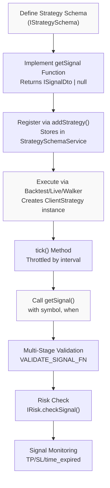
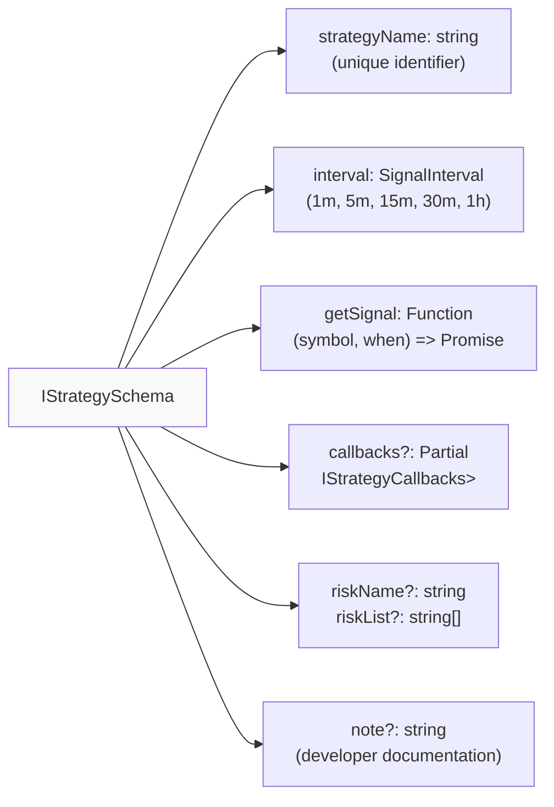
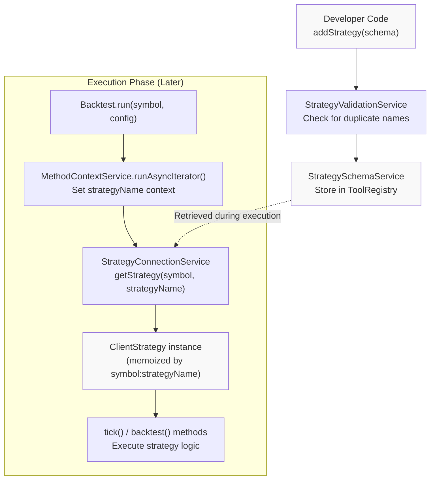
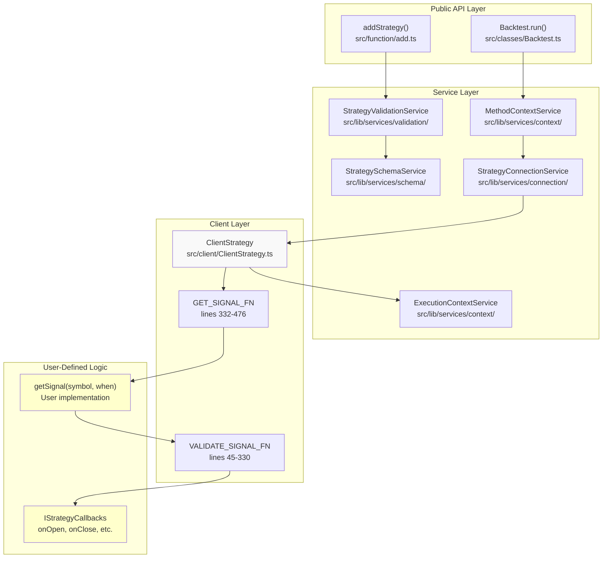
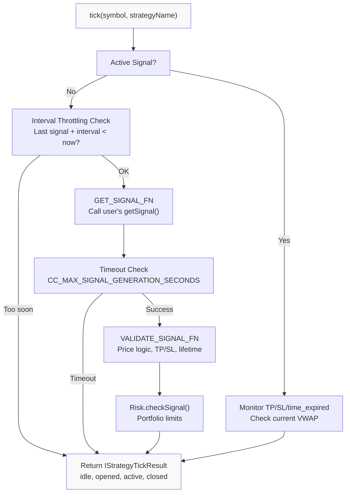
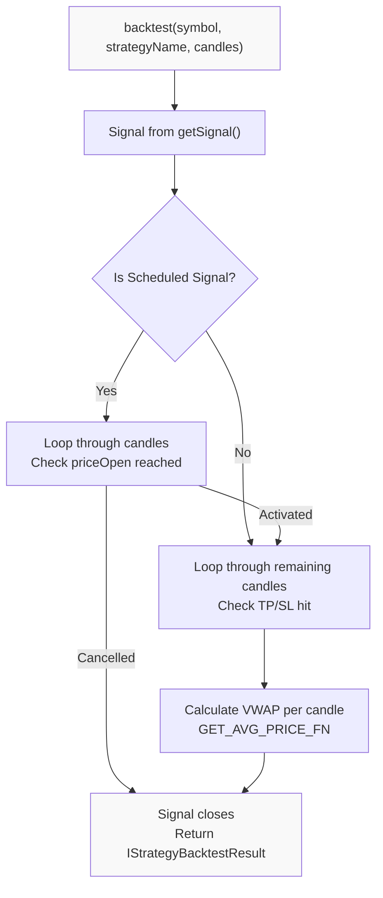
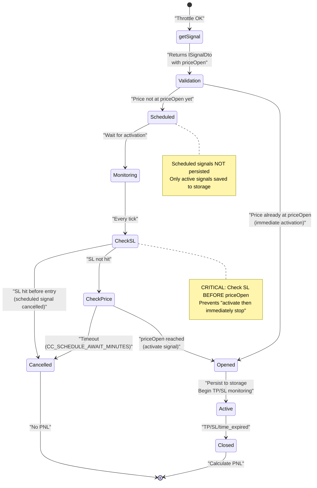

# Strategy Development

## Purpose and Scope

This page provides a complete guide to developing trading strategies in Backtest Kit. It covers the fundamentals of strategy creation, signal generation logic, lifecycle callbacks, and integration with the framework's execution engine.

For information about risk management and validation rules, see [Risk Management](./31_risk-management.md). For details on execution modes (backtest, live, walker), see [Execution Modes](./20_execution-modes.md). For information on fetching and using market data, see [Exchanges & Data Sources](./36_exchanges-data-sources.md).

## Strategy Overview

A **strategy** in Backtest Kit is a self-contained module that generates trading signals based on market data analysis. Strategies are registered via `addStrategy()` and executed through the time execution engine, which guarantees temporal consistency and prevents look-ahead bias.

### Key Characteristics

| Characteristic | Description |
|---|---|
| **Signal Generation** | Strategies return `ISignalDto` objects with entry/exit prices and timeframes |
| **Temporal Context** | All data access is scoped to the current execution timestamp via `ExecutionContextService` |
| **Interval Throttling** | Configurable minimum time between signal generation attempts |
| **Lifecycle Callbacks** | Optional hooks for signal events (onOpen, onClose, onActive, etc.) |
| **Risk Integration** | Optional risk profile binding for portfolio-level controls |
| **Mode Agnostic** | Same strategy code runs in backtest, live, and walker modes |

### Strategy Development Flow



**Sources:** [types.d.ts:726-751](), [src/interfaces/Strategy.interface.ts:128-151](), [src/client/ClientStrategy.ts:332-476]()

## Strategy Anatomy: Core Components

### IStrategySchema Interface

The `IStrategySchema` interface defines the complete configuration for a trading strategy:



**Sources:** [types.d.ts:726-751](), [src/interfaces/Strategy.interface.ts:128-151]()

### Signal Data Transfer Object (ISignalDto)

The `getSignal` function returns an `ISignalDto` with the following structure:

| Field | Type | Required | Description |
|---|---|---|---|
| `id` | string | Optional | Signal identifier (auto-generated if omitted) |
| `position` | "long" \| "short" | Required | Trade direction |
| `priceOpen` | number | Optional | Entry price (if omitted, opens at current VWAP) |
| `priceTakeProfit` | number | Required | Take profit exit price |
| `priceStopLoss` | number | Required | Stop loss exit price |
| `minuteEstimatedTime` | number | Required | Maximum signal lifetime in minutes |
| `note` | string | Optional | Human-readable signal rationale |

**Sources:** [types.d.ts:647-665](), [src/interfaces/Strategy.interface.ts:20-39]()

## Complete Working Example

Below is a minimal but complete strategy that demonstrates all core concepts:

### Basic Moving Average Crossover Strategy

```typescript
import { addStrategy, getCandles, ISignalDto } from 'backtest-kit';

addStrategy({
  strategyName: 'ma-crossover-basic',
  interval: '5m', // Check for signals every 5 minutes
  note: 'Simple MA crossover with 20/50 periods',
  
  // Core signal generation logic
  getSignal: async (symbol: string, when: Date): Promise<ISignalDto | null> => {
    // Fetch historical candles (automatically scoped to 'when' timestamp)
    const candles = await getCandles(symbol, "1h", 50);
    
    if (candles.length < 50) {
      return null; // Insufficient data
    }
    
    // Calculate moving averages
    const closes = candles.map(c => c.close);
    const ma20 = closes.slice(-20).reduce((a, b) => a + b, 0) / 20;
    const ma50 = closes.slice(-50).reduce((a, b) => a + b, 0) / 50;
    const prevMa20 = closes.slice(-21, -1).reduce((a, b) => a + b, 0) / 20;
    const prevMa50 = closes.slice(-51, -1).reduce((a, b) => a + b, 0) / 50;
    
    const currentPrice = closes[closes.length - 1];
    
    // Bullish crossover: MA20 crosses above MA50
    if (prevMa20 <= prevMa50 && ma20 > ma50) {
      return {
        position: 'long',
        priceTakeProfit: currentPrice * 1.02, // 2% profit target
        priceStopLoss: currentPrice * 0.99,   // 1% stop loss
        minuteEstimatedTime: 240,             // 4 hours max
        note: `MA20(${ma20.toFixed(2)}) > MA50(${ma50.toFixed(2)})`
      };
    }
    
    // Bearish crossover: MA20 crosses below MA50
    if (prevMa20 >= prevMa50 && ma20 < ma50) {
      return {
        position: 'short',
        priceTakeProfit: currentPrice * 0.98, // 2% profit target
        priceStopLoss: currentPrice * 1.01,   // 1% stop loss
        minuteEstimatedTime: 240,
        note: `MA20(${ma20.toFixed(2)}) < MA50(${ma50.toFixed(2)})`
      };
    }
    
    return null; // No signal conditions met
  },
  
  // Optional lifecycle callbacks
  callbacks: {
    onOpen: (symbol, signal, currentPrice, backtest) => {
      console.log(`[${backtest ? 'BT' : 'LIVE'}] Signal opened:`, signal.id, signal.position);
    },
    onClose: (symbol, signal, priceClose, backtest) => {
      console.log(`[${backtest ? 'BT' : 'LIVE'}] Signal closed:`, signal.id);
    }
  }
});
```

**Sources:** [README.md:110-143](), [types.d.ts:726-751]()

## Strategy Registration and Execution Flow

### Registration via addStrategy()



**Registration Process:**

1. **Validation** - [src/lib/services/validation/StrategyValidationService.ts]() checks for duplicate strategy names
2. **Storage** - [src/lib/services/schema/StrategySchemaService.ts]() stores schema in immutable `ToolRegistry`
3. **Memoization** - [src/lib/services/connection/StrategyConnectionService.ts:120-151]() creates cached `ClientStrategy` instances per symbol-strategy pair
4. **Execution** - [src/client/ClientStrategy.ts]() implements the `IStrategy` interface with `tick()` and `backtest()` methods

**Sources:** [src/function/add.ts](), [src/lib/services/connection/StrategyConnectionService.ts:89-151]()

### Code Entity Mapping: Strategy Execution Path



**Key Code Entities:**

| Code Entity | File Path | Role |
|---|---|---|
| `addStrategy()` | src/function/add.ts | Public API for strategy registration |
| `StrategySchemaService` | src/lib/services/schema/ | Stores strategy schemas in ToolRegistry |
| `StrategyConnectionService` | src/lib/services/connection/ | Memoizes and routes to ClientStrategy instances |
| `ClientStrategy` | src/client/ClientStrategy.ts | Core strategy execution logic |
| `GET_SIGNAL_FN` | src/client/ClientStrategy.ts:332-476 | Wrapper calling user's getSignal with throttling |
| `VALIDATE_SIGNAL_FN` | src/client/ClientStrategy.ts:45-330 | Multi-stage signal validation (TP/SL, prices, lifetime) |
| `IStrategySchema.getSignal` | User code | Developer-implemented signal generation logic |

**Sources:** [src/function/add.ts](), [src/client/ClientStrategy.ts:1-1400](), [src/lib/services/connection/StrategyConnectionService.ts:89-151]()

## Strategy Execution: tick() vs backtest()

`ClientStrategy` implements two execution methods with different performance characteristics:

### tick() Method - Live Trading & Step-by-Step Backtest



**Used by:** Live.run(), Backtest.run() (minute-by-minute iteration)

**Sources:** [src/client/ClientStrategy.ts:1001-1253]()

### backtest() Method - Fast Historical Processing



**Used by:** Backtest.run() (after signal opens, fast-forward through candles)

**Performance:** Skips timeframes during active signal monitoring, processes only until signal closes

**Sources:** [src/client/ClientStrategy.ts:1255-1400](), [src/client/ClientStrategy.ts:478-489]()

## Signal Validation: VALIDATE_SIGNAL_FN

The framework performs comprehensive validation on all signals before they activate. This prevents invalid signals from entering the system and ensures trading logic integrity.

### Validation Pipeline

| Validation Stage | Checks | Config Parameters |
|---|---|---|
| **Schema Validation** | Required fields present, correct types | N/A |
| **Price Positivity** | All prices > 0, finite, not NaN/Infinity | N/A |
| **TP/SL Logic** | LONG: TP>open>SL, SHORT: SL>open>TP | N/A |
| **Immediate Closure Prevention** | Current price not already at TP/SL | N/A |
| **TP Distance** | TP far enough to cover fees + slippage | `CC_MIN_TAKEPROFIT_DISTANCE_PERCENT` |
| **SL Distance (min)** | SL not too close (avoid instant stop-out) | `CC_MIN_STOPLOSS_DISTANCE_PERCENT` |
| **SL Distance (max)** | SL not too far (protect capital) | `CC_MAX_STOPLOSS_DISTANCE_PERCENT` |
| **Lifetime Limit** | Signal lifetime ≤ max configured minutes | `CC_MAX_SIGNAL_LIFETIME_MINUTES` |

**Default Configuration:**
- `CC_MIN_TAKEPROFIT_DISTANCE_PERCENT`: 0.2% (covers 0.1% fee + 0.1% slippage)
- `CC_MAX_SIGNAL_LIFETIME_MINUTES`: 10080 (7 days)

**Sources:** [src/client/ClientStrategy.ts:45-330](), [src/config/params.ts]()

### Validation Error Examples

```typescript
// Invalid: Take profit too close (won't cover trading costs)
{
  position: 'long',
  priceOpen: 50000,
  priceTakeProfit: 50050,  // Only 0.1% distance - REJECTED
  priceStopLoss: 49900,
  minuteEstimatedTime: 120
}
// Error: "Long: TakeProfit too close to priceOpen (0.100%). Minimum distance: 0.200%"

// Invalid: Immediate closure scenario
{
  position: 'long',
  priceOpen: 50000,
  priceTakeProfit: 51000,
  priceStopLoss: 50100,    // Current price at 50100 - REJECTED
  minuteEstimatedTime: 120
}
// Error: "Long immediate: currentPrice (50100) <= priceOpen (50000). Signal would be immediately closed"

// Invalid: Excessive lifetime
{
  position: 'long',
  priceOpen: 50000,
  priceTakeProfit: 51000,
  priceStopLoss: 49000,
  minuteEstimatedTime: 20160  // 14 days - REJECTED
}
// Error: "minuteEstimatedTime too large (20160 minutes = 14.0 days). Maximum: 10080 minutes (7 days)"
```

**Sources:** [src/client/ClientStrategy.ts:163-199]()

## Scheduled Signals: Delayed Entry

Strategies can create **scheduled signals** by specifying `priceOpen` in the returned `ISignalDto`. Scheduled signals wait for the market price to reach the entry point before activating.

### Scheduled Signal Lifecycle



**Key Differences from Immediate Signals:**

| Aspect | Immediate Signal | Scheduled Signal |
|---|---|---|
| `priceOpen` field | Omitted or = current VWAP | Explicitly set to target entry price |
| Persistence | Saved immediately on creation | NOT saved until activation |
| Cancellation | Cannot cancel (only close via TP/SL/time) | Can cancel before activation |
| Risk check timing | At creation | At activation (after priceOpen reached) |
| Timeout | `minuteEstimatedTime` starts at open | `CC_SCHEDULE_AWAIT_MINUTES` before activation |

**Sources:** [src/client/ClientStrategy.ts:389-443](), [src/client/ClientStrategy.ts:554-608]()

### Scheduled Signal Example

```typescript
addStrategy({
  strategyName: 'limit-entry-strategy',
  interval: '5m',
  
  getSignal: async (symbol: string, when: Date) => {
    const candles = await getCandles(symbol, "1h", 24);
    const currentPrice = candles[candles.length - 1].close;
    
    // Look for support level bounce
    const support = Math.min(...candles.slice(-10).map(c => c.low));
    
    if (currentPrice > support * 1.02) { // Price above support
      return {
        position: 'long',
        priceOpen: support * 1.005,  // SCHEDULED: Wait for price to drop to support
        priceTakeProfit: support * 1.03,
        priceStopLoss: support * 0.995,
        minuteEstimatedTime: 180,
        note: `Limit buy at support ${support.toFixed(2)}`
      };
    }
    
    return null;
  }
});
```

**Monitoring Logic:** [src/client/ClientStrategy.ts:610-644]() checks SL **before** priceOpen to prevent "activate-and-immediately-cancel" scenarios.

**Sources:** [types.d.ts:693-697](), [src/client/ClientStrategy.ts:681-774]()

## Best Practices

### 1. Leverage Temporal Context

The framework automatically provides temporal context via `ExecutionContextService`. The `when` parameter in `getSignal()` represents the current execution time, and `getCandles()` returns data **up to** that timestamp.

**Correct:**
```typescript
getSignal: async (symbol: string, when: Date) => {
  // getCandles automatically scoped to 'when' - no look-ahead bias possible
  const candles = await getCandles(symbol, "1h", 100);
  // candles[candles.length - 1].timestamp <= when.getTime()
}
```

**Incorrect (but prevented by framework):**
```typescript
getSignal: async (symbol: string, when: Date) => {
  // This would be dangerous in other frameworks - but here it's safe!
  // getCandles CANNOT return future data relative to 'when'
  const candles = await getCandles(symbol, "1h", 100);
  // Framework guarantees no look-ahead bias
}
```

**Sources:** [README.md:186-199](), [src/lib/services/context/ExecutionContextService.ts]()

### 2. Choose Appropriate Interval Throttling

The `interval` parameter determines minimum time between `getSignal()` calls. Choose based on strategy computation cost and market data requirements:

| Strategy Type | Recommended Interval | Reason |
|---|---|---|
| Simple indicators (MA, RSI) | 1m - 5m | Fast computation, frequent updates useful |
| Complex ML models | 15m - 1h | Expensive computation, less frequent checks acceptable |
| News/sentiment analysis | 5m - 30m | API rate limits, data freshness |
| High-frequency patterns | 1m | Need rapid signal generation |

**Sources:** [types.d.ts:642-646](), [src/client/ClientStrategy.ts:340-353]()

### 3. Handle Insufficient Data Gracefully

Always check for sufficient candle history before calculations:

```typescript
getSignal: async (symbol: string, when: Date) => {
  const candles = await getCandles(symbol, "1h", 100);
  
  if (candles.length < 100) {
    return null; // Not enough data - skip this tick
  }
  
  // Safe to proceed with calculations
}
```

**Sources:** [demo/backtest/src/strategy.mjs](), [README.md:123-127]()

### 4. Use Lifecycle Callbacks for Monitoring

Callbacks provide observability into strategy execution without cluttering signal logic:

```typescript
addStrategy({
  strategyName: 'monitored-strategy',
  interval: '5m',
  getSignal: async (symbol, when) => { /* ... */ },
  
  callbacks: {
    onOpen: (symbol, signal, currentPrice, backtest) => {
      // Log to monitoring service
      logger.info('Signal opened', { signal: signal.id, price: currentPrice });
    },
    
    onActive: (symbol, signal, currentPrice, backtest) => {
      // Track unrealized PNL
      const pnl = calculateUnrealizedPnl(signal, currentPrice);
      metrics.gauge('unrealized_pnl', pnl);
    },
    
    onClose: (symbol, signal, priceClose, backtest) => {
      // Log final outcome
      logger.info('Signal closed', { signal: signal.id, closePrice: priceClose });
    },
    
    onPartialProfit: (symbol, signal, currentPrice, revenuePercent, backtest) => {
      // Alert on milestone
      if (revenuePercent >= 10) {
        alerts.send(`Signal ${signal.id} reached ${revenuePercent}% profit`);
      }
    }
  }
});
```

Available callbacks: `onTick`, `onOpen`, `onActive`, `onIdle`, `onClose`, `onSchedule`, `onCancel`, `onPartialProfit`, `onPartialLoss`, `onWrite`

**Sources:** [types.d.ts:698-726](), [src/interfaces/Strategy.interface.ts:96-126]()

### 5. Integrate Risk Management

Bind risk profiles to strategies for portfolio-level controls:

```typescript
// Define risk profile (see Risk Management page)
addRisk({
  riskName: 'conservative',
  validations: [
    ({ activePositionCount }) => {
      if (activePositionCount >= 3) throw new Error('Max 3 concurrent positions');
    }
  ]
});

// Bind to strategy
addStrategy({
  strategyName: 'my-strategy',
  interval: '5m',
  riskName: 'conservative',  // Single risk profile
  // OR
  riskList: ['conservative', 'size-limits'],  // Multiple profiles
  getSignal: async (symbol, when) => { /* ... */ }
});
```

**Sources:** [types.d.ts:743-750](), [src/lib/services/connection/StrategyConnectionService.ts:33-67]()

### 6. Test with Walker Mode

Use Walker mode to compare multiple strategy variants before live deployment:

```typescript
// Register strategy variants
addStrategy({ strategyName: 'ma-20-50', /* ... */ });
addStrategy({ strategyName: 'ma-50-200', /* ... */ });
addStrategy({ strategyName: 'ma-10-30', /* ... */ });

// Compare them
addWalker({
  walkerName: 'ma-comparison',
  exchangeName: 'binance',
  frameName: '1-month-backtest',
  strategies: ['ma-20-50', 'ma-50-200', 'ma-10-30'],
  metric: 'sharpeRatio'
});

await Walker.run('BTCUSDT', { walkerName: 'ma-comparison' });
// Returns ranked results by Sharpe ratio
```

**Sources:** [README.md](), [Walker section in page 5.3](./20_execution-modes.md)

---

**Related Pages:**
- [Signal Lifecycle](./08_core-concepts.md) - Detailed signal state machine and transitions
- [Risk Management](./31_risk-management.md) - Portfolio limits and validation rules
- [Multi-Timeframe Analysis](./25_strategy-development.md) - Using multiple timeframes in strategies
- [getCandles API](./56_api-reference.md) - Data fetching reference