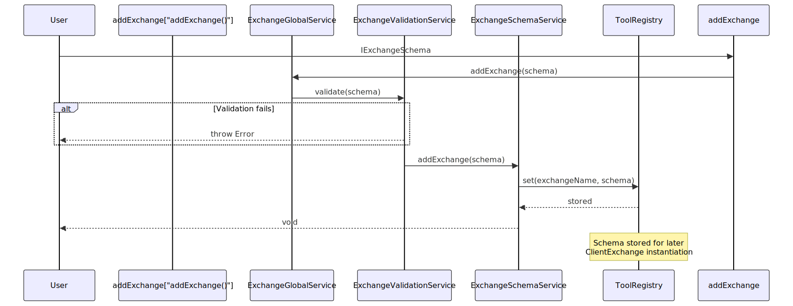
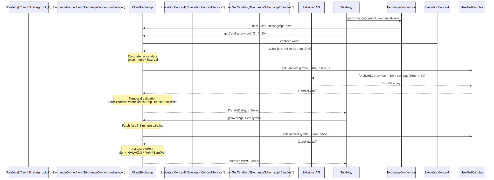

# Exchange Schemas

Exchange schemas define market data sources for backtesting and live trading. An exchange provides historical candle data (OHLCV) and formatting functions for prices and quantities. Exchanges are registered via `addExchange()` and instantiated as `ClientExchange` instances by the connection service layer.

For information about strategy schemas that consume exchange data, see [Strategy Schemas](./25_Strategy_Schemas.md). For frame schemas that define backtest time ranges, see [Frame Schemas](./27_Frame_Schemas.md).

---

## Interface Definition

The `IExchangeSchema` interface specifies the contract for all exchange implementations. It consists of three core functions and optional lifecycle callbacks.




---

## Required Fields

### exchangeName

Unique identifier for the exchange. Used throughout the system to reference this exchange configuration via dependency injection.

| Property | Type | Description |
|----------|------|-------------|
| `exchangeName` | `ExchangeName` (string) | Unique exchange identifier |
| `note` | `string?` | Optional developer documentation |

### getCandles Function

Fetches historical OHLCV candle data from the exchange data source (API, database, or custom provider).

**Signature:**
```typescript
getCandles: (
    symbol: string,        // Trading pair (e.g., "BTCUSDT")
    interval: CandleInterval,  // Candle time interval
    since: Date,           // Start date for data fetch
    limit: number          // Maximum candles to return
) => Promise<ICandleData[]>
```

**Returns:** Array of `ICandleData` objects sorted by timestamp ascending.

**Temporal Isolation:** The `since` parameter is automatically determined by `ExecutionContextService.context.when` to prevent look-ahead bias during backtesting. Strategies cannot access future data.

### formatPrice Function

Formats price values according to exchange precision rules (e.g., 2 decimal places for USDT pairs).

**Signature:**
```typescript
formatPrice: (
    symbol: string,    // Trading pair
    price: number      // Raw price value
) => Promise<string>   // Formatted price string
```

### formatQuantity Function

Formats quantity/amount values according to exchange precision rules (e.g., 8 decimal places for BTC).

**Signature:**
```typescript
formatQuantity: (
    symbol: string,     // Trading pair
    quantity: number    // Raw quantity value
) => Promise<string>    // Formatted quantity string
```


---

## Candle Data Structure

Each candle represents aggregated trading data for a specific time interval.



| Field | Type | Description |
|-------|------|-------------|
| `timestamp` | `number` | Unix timestamp in milliseconds when candle opened |
| `open` | `number` | Opening price at candle start |
| `high` | `number` | Highest price during candle period |
| `low` | `number` | Lowest price during candle period |
| `close` | `number` | Closing price at candle end |
| `volume` | `number` | Trading volume during candle period |

**VWAP Formula:** The system uses the last 5 1-minute candles to calculate Volume Weighted Average Price for realistic entry/exit pricing:

```
Typical Price = (High + Low + Close) / 3
VWAP = Σ(Typical Price × Volume) / Σ(Volume)
```


---

## Registration Flow

Exchange schemas are registered via `addExchange()` and stored in `ExchangeSchemaService` using the `ToolRegistry` pattern.




---

## Exchange Instance Lifecycle

`ExchangeConnectionService` creates and memoizes `ClientExchange` instances using a composite key strategy.



**Memoization Key:** `${symbol}:${exchangeName}:${backtest}`

This ensures separate exchange instances for:
- Different symbols (e.g., BTCUSDT vs ETHUSDT)
- Different exchanges (e.g., binance vs coinbase)
- Different execution modes (backtest vs live)


---

## Candle Data Flow

Exchange candles flow through multiple layers before reaching strategies.



**Temporal Isolation:** `ClientExchange` automatically filters candles to ensure `candle.timestamp <= ExecutionContextService.context.when`. This prevents look-ahead bias in backtesting.


---

## Callbacks

Optional lifecycle callbacks for monitoring candle data fetching.

### onCandleData

Invoked after candle data is successfully fetched from the exchange. Useful for logging, caching, or debugging.

```typescript
callbacks: {
    onCandleData: (
        symbol: string,          // Trading pair
        interval: CandleInterval, // Candle interval
        since: Date,             // Start date requested
        limit: number,           // Limit requested
        data: ICandleData[]      // Fetched candles
    ) => void
}
```


---

## Integration Example

Typical exchange schema using CCXT for Binance data:

```typescript
import ccxt from "ccxt";
import { addExchange } from "backtest-kit";

addExchange({
    exchangeName: "binance",
    note: "Binance exchange via CCXT",
    
    getCandles: async (symbol, interval, since, limit) => {
        const exchange = new ccxt.binance();
        const ohlcv = await exchange.fetchOHLCV(
            symbol, 
            interval, 
            since.getTime(), 
            limit
        );
        
        return ohlcv.map(([timestamp, open, high, low, close, volume]) => ({
            timestamp,
            open,
            high,
            low,
            close,
            volume
        }));
    },
    
    formatPrice: async (symbol, price) => {
        // USDT pairs: 2 decimals
        return price.toFixed(2);
    },
    
    formatQuantity: async (symbol, quantity) => {
        // BTC: 8 decimals
        return quantity.toFixed(8);
    },
    
    callbacks: {
        onCandleData: (symbol, interval, since, limit, data) => {
            console.log(`Fetched ${data.length} ${interval} candles for ${symbol}`);
        }
    }
});
```


---

## Validation Rules

`ExchangeValidationService` enforces the following constraints during registration:

| Rule | Description |
|------|-------------|
| **Unique Name** | `exchangeName` must be unique across all registered exchanges |
| **Required Functions** | `getCandles`, `formatPrice`, `formatQuantity` must be provided |
| **Valid Return Types** | `getCandles` must return `Promise<ICandleData[]>` |
| **Valid Intervals** | All `CandleInterval` values must be supported |


---

## ClientExchange Implementation

The `ClientExchange` class implements the `IExchange` interface and provides additional functionality:



**Additional Methods:**

### getNextCandles

Fetches future candles for backtest fast-forwarding. Only used in backtest mode.

```typescript
getNextCandles: (
    symbol: string,
    interval: CandleInterval,
    limit: number
) => Promise<ICandleData[]>
```

Calculates `since` as `context.when + (interval duration)` to fetch candles starting after the current execution time.

### getAveragePrice

Calculates VWAP from the last 5 1-minute candles. This is the price used for all signal entry/exit calculations to provide realistic execution pricing.

```typescript
getAveragePrice: (symbol: string) => Promise<number>
```

**Formula Implementation:**
```typescript
const candles = await this.getCandles(symbol, "1m", 5);
const totalValue = candles.reduce((sum, c) => {
    const typicalPrice = (c.high + c.low + c.close) / 3;
    return sum + (typicalPrice * c.volume);
}, 0);
const totalVolume = candles.reduce((sum, c) => sum + c.volume, 0);
return totalValue / totalVolume;
```


---

## Temporal Isolation

`ClientExchange` enforces temporal isolation to prevent look-ahead bias during backtesting.



**Implementation:** [src/client/ClientExchange.ts:70-120]()

This ensures that strategies only see historical data up to the current backtest timestamp, preventing look-ahead bias and ensuring realistic strategy testing.


---

## Public API Functions

Helper functions for accessing exchange functionality from user code:

### getCandles

```typescript
import { getCandles } from "backtest-kit";

const candles = await getCandles("BTCUSDT", "1m", 30);
```

Retrieves candles using the current execution context (symbol, exchange, timestamp).

### getAveragePrice

```typescript
import { getAveragePrice } from "backtest-kit";

const vwapPrice = await getAveragePrice("BTCUSDT");
```

Calculates VWAP from the last 5 1-minute candles.

### formatPrice / formatQuantity

```typescript
import { formatPrice, formatQuantity } from "backtest-kit";

const priceStr = await formatPrice("BTCUSDT", 50000.123);  // "50000.12"
const qtyStr = await formatQuantity("BTCUSDT", 0.123456789);  // "0.12345679"
```

Formats values according to exchange precision rules.

