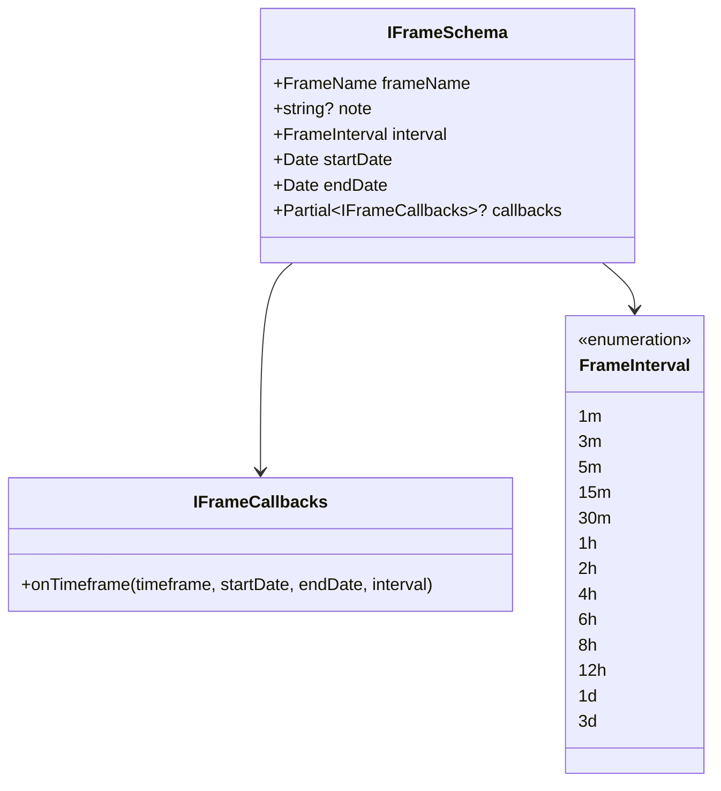
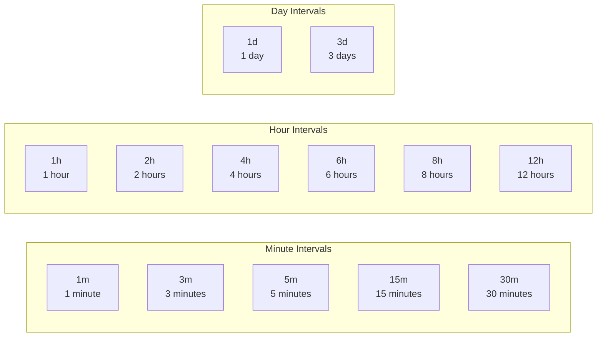
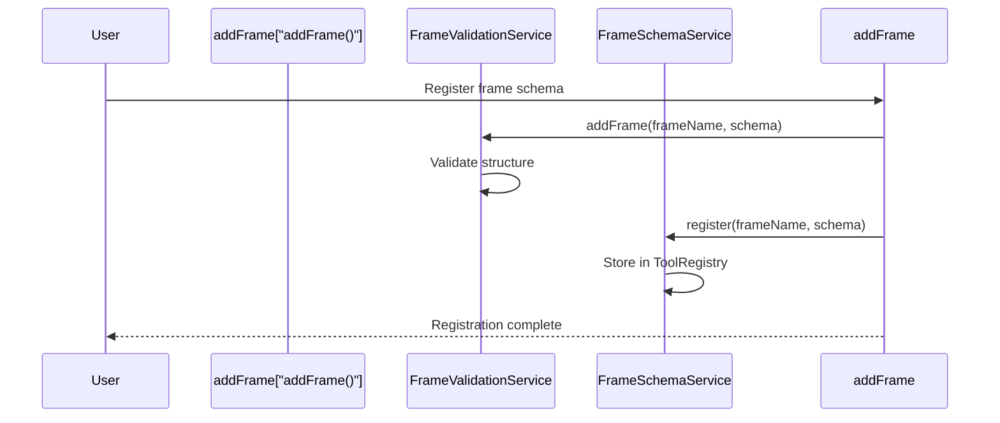
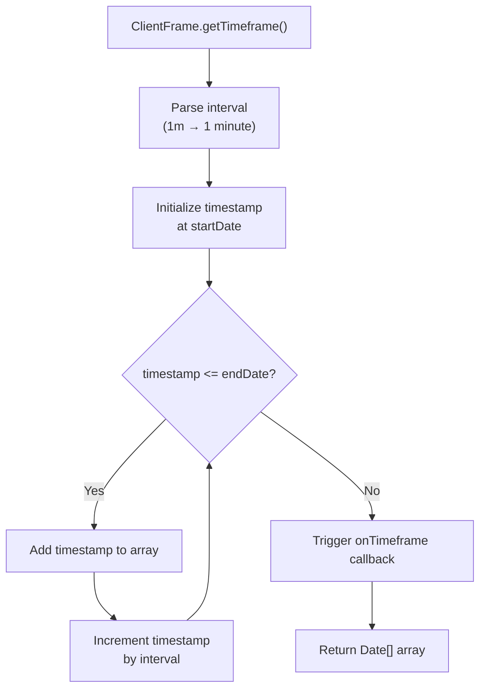
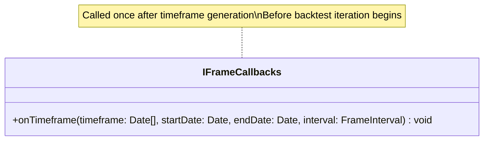
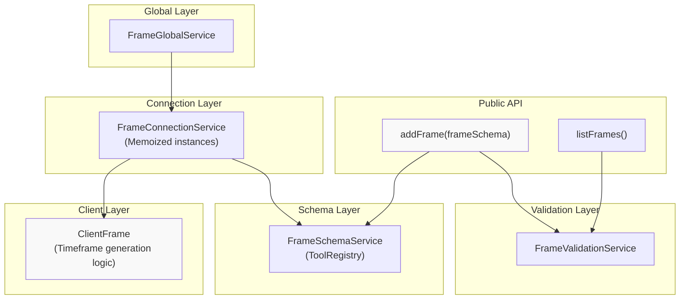
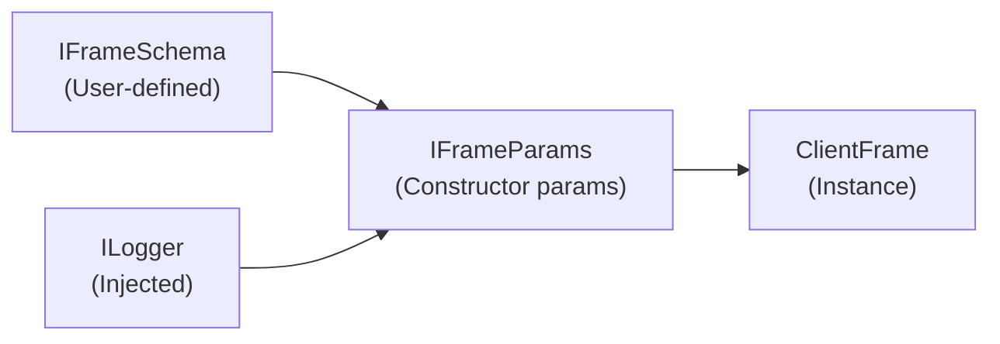
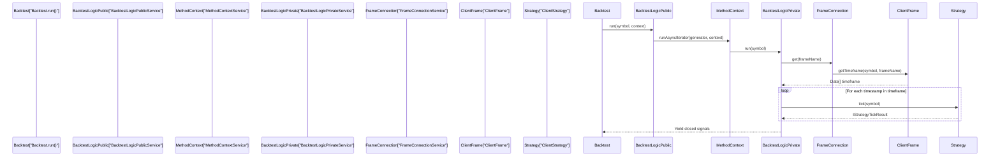

# Frame Schemas

<details>
<summary>Relevant source files</summary>

The following files were used as context for generating this wiki page:

- [src/function/add.ts](src/function/add.ts)
- [src/function/list.ts](src/function/list.ts)
- [src/index.ts](src/index.ts)
- [src/lib/core/provide.ts](src/lib/core/provide.ts)
- [src/lib/core/types.ts](src/lib/core/types.ts)
- [src/lib/index.ts](src/lib/index.ts)
- [test/index.mjs](test/index.mjs)
- [types.d.ts](types.d.ts)

</details>


Frame schemas define backtesting periods by specifying start dates, end dates, and intervals for timestamp generation. They control the temporal boundaries and granularity of historical simulation, enabling strategies to iterate through specific time windows with configurable step sizes.

For information about backtesting execution flow using frames, see [Backtest Execution Flow](#9.1). For frame timeframe generation implementation details, see [Timeframe Generation](#9.2).

---

## Schema Structure

Frame schemas are registered via the `addFrame()` function and conform to the `IFrameSchema` interface. Each schema defines a named backtesting period with temporal boundaries and iteration granularity.

**Core Schema Definition**



**Schema Fields**

| Field | Type | Required | Description |
|-------|------|----------|-------------|
| `frameName` | `FrameName` (string) | Yes | Unique identifier for frame registration and retrieval |
| `note` | `string` | No | Developer documentation for the frame's purpose |
| `interval` | `FrameInterval` | Yes | Granularity for timestamp generation (minutes, hours, days) |
| `startDate` | `Date` | Yes | Inclusive start boundary for the backtesting period |
| `endDate` | `Date` | Yes | Inclusive end boundary for the backtesting period |
| `callbacks` | `Partial<IFrameCallbacks>` | No | Optional lifecycle event handlers |

Sources: [types.d.ts:309-341]()

---

## Frame Intervals

The `FrameInterval` type defines the step size for timeframe generation. Each interval value determines the spacing between consecutive timestamps in the generated array.

**Available Intervals**



**Interval Selection Guidelines**

- **1m-5m**: High-frequency strategies, scalping, minute-level precision
- **15m-1h**: Intraday strategies, standard frequency
- **2h-12h**: Swing trading, reduced computation for long backtests
- **1d-3d**: Position trading, long-term strategy validation

Smaller intervals generate more timestamps and require more computation. A 1-day backtest with 1-minute intervals produces 1,440 timestamps, while 1-hour intervals produce only 24 timestamps.

Sources: [types.d.ts:278-285]()

---

## Registration and Usage

Frame schemas are registered via `addFrame()` and retrieved by name during backtest execution. The framework validates schema structure, stores the configuration, and provides lazy instantiation of `ClientFrame` instances.

**Registration Flow**



**Registration Example**

```typescript
import { addFrame } from "backtest-kit";

addFrame({
  frameName: "1d-backtest",
  note: "One-day backtest for rapid strategy validation",
  interval: "1m",
  startDate: new Date("2024-01-01T00:00:00Z"),
  endDate: new Date("2024-01-02T00:00:00Z"),
  callbacks: {
    onTimeframe: (timeframe, startDate, endDate, interval) => {
      console.log(`Generated ${timeframe.length} timestamps from ${startDate} to ${endDate} at ${interval} interval`);
    },
  },
});
```

**Retrieval in Backtest Context**

Frames are accessed by name when executing backtests:

```typescript
import { Backtest } from "backtest-kit";

// Frame retrieved via frameName in context
for await (const result of Backtest.run("BTCUSDT", {
  strategyName: "my-strategy",
  exchangeName: "binance",
  frameName: "1d-backtest", // References registered frame
})) {
  // result contains closed signals
}
```

Sources: [src/function/add.ts:113-149](), [types.d.ts:309-341]()

---

## Timeframe Generation

Frames generate arrays of `Date` objects representing tick timestamps. The `ClientFrame.getTimeframe()` method produces timestamps spaced according to the configured interval, bounded by `startDate` and `endDate`.

**Generation Process**



**Example Timeframe Output**

For a frame with:
- `startDate`: `2024-01-01T00:00:00Z`
- `endDate`: `2024-01-01T00:05:00Z`
- `interval`: `1m`

Generated timeframe:
```typescript
[
  new Date("2024-01-01T00:00:00Z"),
  new Date("2024-01-01T00:01:00Z"),
  new Date("2024-01-01T00:02:00Z"),
  new Date("2024-01-01T00:03:00Z"),
  new Date("2024-01-01T00:04:00Z"),
  new Date("2024-01-01T00:05:00Z"),
]
// 6 timestamps total (inclusive of boundaries)
```

Sources: [types.d.ts:343-355]()

---

## Lifecycle Callbacks

Frame schemas support an optional `onTimeframe` callback invoked after timeframe array generation. This enables logging, validation, or external integrations during backtest initialization.

**Callback Interface**



**Callback Parameters**

| Parameter | Type | Description |
|-----------|------|-------------|
| `timeframe` | `Date[]` | Complete array of generated timestamps |
| `startDate` | `Date` | Start boundary from schema |
| `endDate` | `Date` | End boundary from schema |
| `interval` | `FrameInterval` | Interval used for generation |

**Usage Example**

```typescript
addFrame({
  frameName: "1d-backtest",
  interval: "1m",
  startDate: new Date("2024-01-01T00:00:00Z"),
  endDate: new Date("2024-01-02T00:00:00Z"),
  callbacks: {
    onTimeframe: (timeframe, startDate, endDate, interval) => {
      const duration = (endDate.getTime() - startDate.getTime()) / (1000 * 60 * 60);
      console.log(`[FRAME] Timeframe generated`);
      console.log(`  Period: ${startDate.toISOString()} → ${endDate.toISOString()}`);
      console.log(`  Duration: ${duration} hours`);
      console.log(`  Interval: ${interval}`);
      console.log(`  Timestamps: ${timeframe.length}`);
    },
  },
});
```

Sources: [types.d.ts:295-308]()

---

## Implementation Architecture

Frame functionality is implemented through a layered service architecture with schema storage, validation, lazy instantiation, and client execution.

**Service Layer Mapping**



**Layer Responsibilities**

| Layer | Service | Responsibility |
|-------|---------|----------------|
| Public API | `addFrame()` | User-facing registration function |
| Public API | `listFrames()` | Returns all registered frame schemas |
| Validation | `FrameValidationService` | Schema structure validation, registry checks |
| Schema | `FrameSchemaService` | Storage via `ToolRegistry` pattern |
| Connection | `FrameConnectionService` | Memoized `ClientFrame` instance management |
| Client | `ClientFrame` | Timeframe generation business logic |
| Global | `FrameGlobalService` | API orchestration, context management |

**Key Code Entities**

| Entity | File Path | Description |
|--------|-----------|-------------|
| `IFrameSchema` | [types.d.ts:328-341]() | Schema interface definition |
| `FrameInterval` | [types.d.ts:285]() | Interval enum type |
| `IFrameCallbacks` | [types.d.ts:296-308]() | Callback interface |
| `addFrame()` | [src/function/add.ts:143-149]() | Registration function |
| `listFrames()` | [src/function/list.ts:106-109]() | List function |
| `FrameValidationService` | [src/lib/index.ts:44]() | Validation service DI binding |
| `FrameSchemaService` | [src/lib/index.ts:24]() | Schema service DI binding |
| `FrameConnectionService` | [src/lib/index.ts:7]() | Connection service DI binding |
| `ClientFrame` | N/A (internal) | Timeframe generation implementation |

Sources: [src/function/add.ts:113-149](), [src/lib/index.ts:1-170](), [src/lib/core/types.ts:1-81](), [src/lib/core/provide.ts:1-110]()

---

## Frame Parameters

When `ClientFrame` is instantiated via `FrameConnectionService`, the schema is augmented with runtime dependencies to form `IFrameParams`.

**Parameter Augmentation**



**IFrameParams Structure**

| Field | Source | Description |
|-------|--------|-------------|
| `frameName` | Schema | Unique frame identifier |
| `interval` | Schema | Timeframe interval |
| `startDate` | Schema | Period start boundary |
| `endDate` | Schema | Period end boundary |
| `callbacks` | Schema | Optional lifecycle callbacks |
| `logger` | DI | Logger service for debug output |

Sources: [types.d.ts:287-293]()

---

## Usage in Backtest Execution

Frames are consumed by `BacktestLogicPrivateService` to generate the iteration array for historical simulation. Each timestamp becomes the `ExecutionContext.when` value for a strategy tick.

**Backtest Integration Flow**



The `frameName` from `MethodContext` determines which frame to use. The generated timeframe array drives the iteration loop, with each timestamp representing a simulated "now" moment for strategy execution.

Sources: [types.d.ts:363-375]()

---

## Example: Multi-Period Frame Configuration

Frames enable testing strategies across different time periods with varying granularities. Multiple frames can be registered and selected at runtime.

**Multiple Frame Registration**

```typescript
import { addFrame } from "backtest-kit";

// High-frequency 1-hour test
addFrame({
  frameName: "1h-scalping",
  interval: "1m",
  startDate: new Date("2024-01-01T10:00:00Z"),
  endDate: new Date("2024-01-01T11:00:00Z"),
});

// Intraday 1-day test
addFrame({
  frameName: "1d-intraday",
  interval: "15m",
  startDate: new Date("2024-01-01T00:00:00Z"),
  endDate: new Date("2024-01-02T00:00:00Z"),
});

// Multi-day swing test
addFrame({
  frameName: "7d-swing",
  interval: "1h",
  startDate: new Date("2024-01-01T00:00:00Z"),
  endDate: new Date("2024-01-08T00:00:00Z"),
});

// Long-term position test
addFrame({
  frameName: "30d-position",
  interval: "1d",
  startDate: new Date("2024-01-01T00:00:00Z"),
  endDate: new Date("2024-01-31T00:00:00Z"),
});
```

**Runtime Frame Selection**

```typescript
import { Backtest } from "backtest-kit";

// Test same strategy on different timeframes
for (const frameName of ["1h-scalping", "1d-intraday", "7d-swing", "30d-position"]) {
  console.log(`\n=== Testing ${frameName} ===`);
  
  for await (const result of Backtest.run("BTCUSDT", {
    strategyName: "my-strategy",
    exchangeName: "binance",
    frameName, // Different frame each iteration
  })) {
    console.log(`Signal closed: ${result.signal.id}`);
  }
  
  const stats = await Backtest.getData("my-strategy");
  console.log(`Sharpe Ratio: ${stats.sharpeRatio}`);
}
```

Sources: [src/function/add.ts:113-149]()

---

## Validation Rules

The `FrameValidationService` enforces structural and semantic validation rules during registration.

**Validation Checks**

| Rule | Check | Error Condition |
|------|-------|-----------------|
| Unique Name | `frameName` not already registered | Duplicate registration throws error |
| Required Fields | All required fields present | Missing `frameName`, `interval`, `startDate`, `endDate` |
| Date Order | `startDate < endDate` | Start date must precede end date |
| Interval Valid | `interval` in `FrameInterval` enum | Invalid interval string |

**Validation Example**

```typescript
// Valid registration
addFrame({
  frameName: "valid-frame",
  interval: "1m",
  startDate: new Date("2024-01-01T00:00:00Z"),
  endDate: new Date("2024-01-02T00:00:00Z"),
}); // ✓ Success

// Invalid: duplicate name
addFrame({
  frameName: "valid-frame", // Same name
  interval: "1h",
  startDate: new Date("2024-01-03T00:00:00Z"),
  endDate: new Date("2024-01-04T00:00:00Z"),
}); // ✗ Throws validation error

// Invalid: end before start
addFrame({
  frameName: "invalid-dates",
  interval: "1m",
  startDate: new Date("2024-01-02T00:00:00Z"),
  endDate: new Date("2024-01-01T00:00:00Z"), // Before start
}); // ✗ Throws validation error
```

Sources: [src/function/add.ts:143-149](), [src/lib/index.ts:44]()