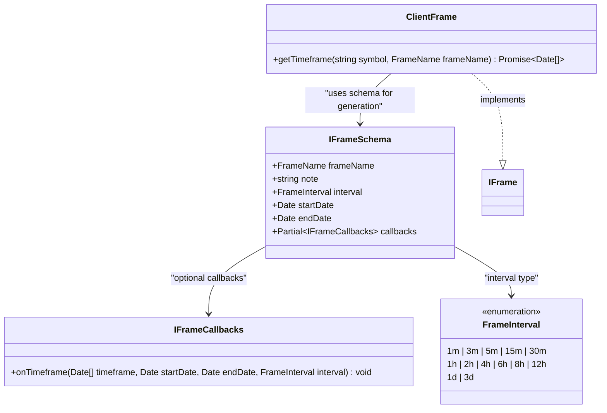
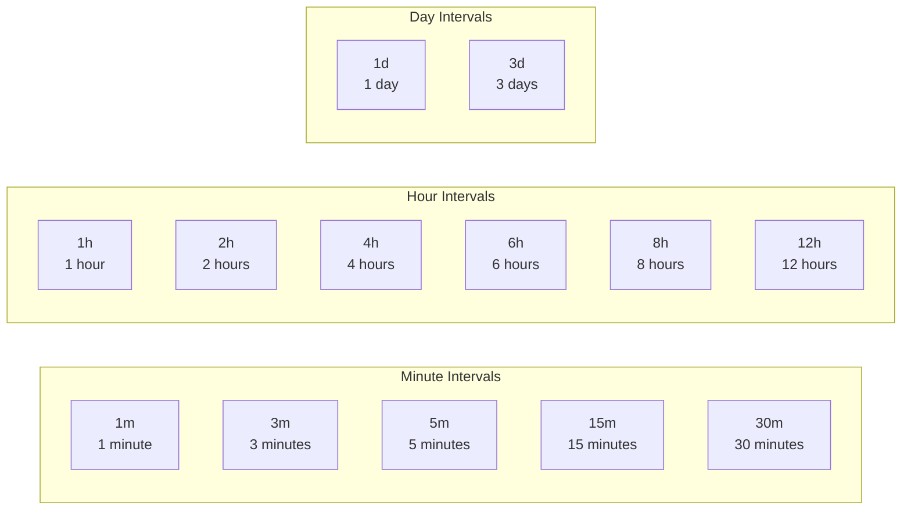
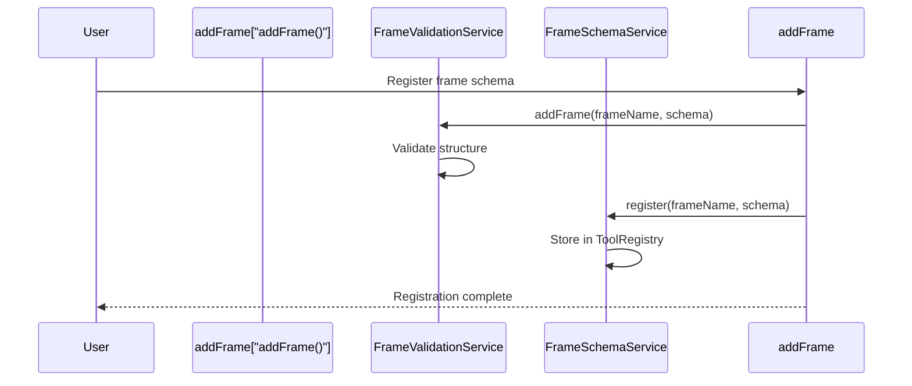
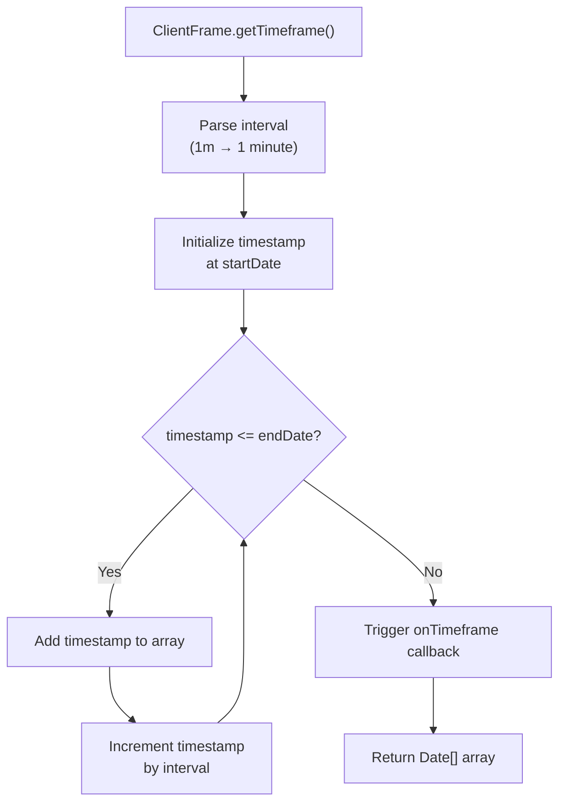
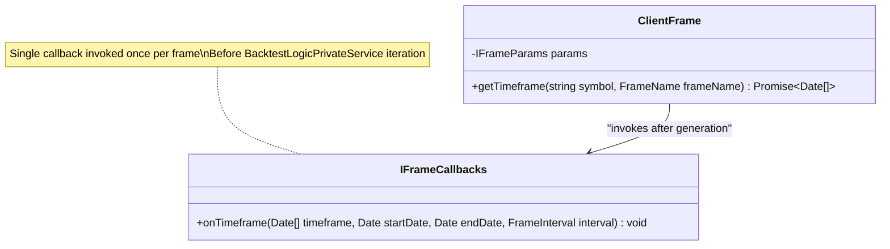
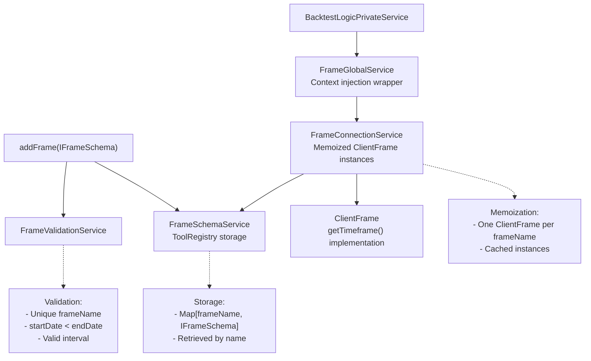
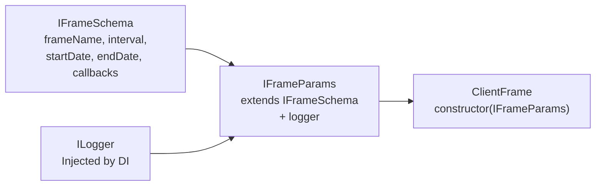
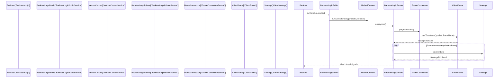

# Frame Schemas

Frame schemas define backtesting time periods for historical simulation. Registered via `addFrame()`, each schema specifies the temporal boundaries (`startDate`, `endDate`) and iteration granularity (`interval`) for generating timestamp arrays that drive backtest execution.

Related pages: [Backtest Execution Flow (9.1)](#9.1), [Timeframe Generation (9.2)](#9.2), [Component Registration (2.3)](#2.3)

---

## IFrameSchema Interface

The `IFrameSchema` interface defines the contract for frame registration. All frames must provide a unique name, temporal boundaries, and an interval for timestamp generation.

**Interface Structure**



**Field Definitions**

| Field | Type | Required | Description |
|-------|------|----------|-------------|
| `frameName` | `FrameName` (string) | Yes | Unique identifier for frame lookup in `FrameSchemaService` registry |
| `note` | `string` | No | Developer documentation for the frame's purpose |
| `interval` | `FrameInterval` | Yes | Timestamp spacing: minutes (1m-30m), hours (1h-12h), days (1d-3d) |
| `startDate` | `Date` | Yes | Inclusive start boundary for timeframe generation |
| `endDate` | `Date` | Yes | Inclusive end boundary for timeframe generation |
| `callbacks` | `Partial<IFrameCallbacks>` | No | Optional `onTimeframe` callback invoked after generation |

Sources: [types.d.ts:366-379]()
</thinking>

---

## FrameInterval Type

The `FrameInterval` type defines the supported timestamp spacing options. Smaller intervals generate more granular backtests with higher computational cost.

**Available Intervals**

| Category | Values | Use Cases |
|----------|--------|-----------|
| Minutes | `1m`, `3m`, `5m`, `15m`, `30m` | High-frequency strategies, scalping, minute-level tick simulation |
| Hours | `1h`, `2h`, `4h`, `6h`, `8h`, `12h` | Intraday and swing trading, reduced computation for multi-day backtests |
| Days | `1d`, `3d` | Position trading, long-term strategy validation, monthly/yearly backtests |

**Computational Impact**

```typescript
// Example: 24-hour backtest timestamp counts
// 1m interval: 1,440 timestamps (24 * 60)
// 15m interval: 96 timestamps (24 * 4)
// 1h interval: 24 timestamps
// 1d interval: 1 timestamp

// Total BacktestLogicPrivateService iterations = timestamp_count
```

Sources: [types.d.ts:323]()

---

## Frame Intervals

The `FrameInterval` type defines the step size for timeframe generation. Each interval value determines the spacing between consecutive timestamps in the generated array.

**Available Intervals**



**Interval Selection Guidelines**

- **1m-5m**: High-frequency strategies, scalping, minute-level precision
- **15m-1h**: Intraday strategies, standard frequency
- **2h-12h**: Swing trading, reduced computation for long backtests
- **1d-3d**: Position trading, long-term strategy validation

Smaller intervals generate more timestamps and require more computation. A 1-day backtest with 1-minute intervals produces 1,440 timestamps, while 1-hour intervals produce only 24 timestamps.

Sources: [types.d.ts:278-285]()

---

## Registration and Usage

Frame schemas are registered via `addFrame()` and retrieved by name during backtest execution. The framework validates schema structure, stores the configuration, and provides lazy instantiation of `ClientFrame` instances.

**Registration Flow**



**Registration Example**

```typescript
import { addFrame } from "backtest-kit";

addFrame({
  frameName: "1d-backtest",
  note: "One-day backtest for rapid strategy validation",
  interval: "1m",
  startDate: new Date("2024-01-01T00:00:00Z"),
  endDate: new Date("2024-01-02T00:00:00Z"),
  callbacks: {
    onTimeframe: (timeframe, startDate, endDate, interval) => {
      console.log(`Generated ${timeframe.length} timestamps from ${startDate} to ${endDate} at ${interval} interval`);
    },
  },
});
```

**Retrieval in Backtest Context**

Frames are accessed by name when executing backtests:

```typescript
import { Backtest } from "backtest-kit";

// Frame retrieved via frameName in context
for await (const result of Backtest.run("BTCUSDT", {
  strategyName: "my-strategy",
  exchangeName: "binance",
  frameName: "1d-backtest", // References registered frame
})) {
  // result contains closed signals
}
```

Sources: [src/function/add.ts:113-149](), [types.d.ts:309-341]()

---

## Timeframe Generation

Frames generate arrays of `Date` objects representing tick timestamps. The `ClientFrame.getTimeframe()` method produces timestamps spaced according to the configured interval, bounded by `startDate` and `endDate`.

**Generation Process**



**Example Timeframe Output**

For a frame with:
- `startDate`: `2024-01-01T00:00:00Z`
- `endDate`: `2024-01-01T00:05:00Z`
- `interval`: `1m`

Generated timeframe:
```typescript
[
  new Date("2024-01-01T00:00:00Z"),
  new Date("2024-01-01T00:01:00Z"),
  new Date("2024-01-01T00:02:00Z"),
  new Date("2024-01-01T00:03:00Z"),
  new Date("2024-01-01T00:04:00Z"),
  new Date("2024-01-01T00:05:00Z"),
]
// 6 timestamps total (inclusive of boundaries)
```

Sources: [types.d.ts:343-355]()

---

## Lifecycle Callbacks

Frame schemas support an optional `onTimeframe` callback invoked after timeframe array generation. This enables logging, validation, or external integrations during backtest initialization.

**IFrameCallbacks Interface**

The `onTimeframe` callback is invoked by `ClientFrame` after timestamp array generation, before backtest iteration begins. Useful for logging, validation, or external integrations.



**Callback Signature**

```typescript
type onTimeframe = (
  timeframe: Date[],    // Generated timestamp array
  startDate: Date,      // Schema start boundary
  endDate: Date,        // Schema end boundary
  interval: FrameInterval // Spacing used for generation
) => void;
```

**Implementation Example**

```typescript
import { addFrame } from "backtest-kit";

addFrame({
  frameName: "1d-backtest",
  interval: "1m",
  startDate: new Date("2024-01-01T00:00:00Z"),
  endDate: new Date("2024-01-02T00:00:00Z"),
  callbacks: {
    onTimeframe: (timeframe, startDate, endDate, interval) => {
      console.log(`Generated ${timeframe.length} timestamps`);
      console.log(`Period: ${startDate.toISOString()} → ${endDate.toISOString()}`);
      console.log(`First: ${timeframe[0].toISOString()}`);
      console.log(`Last: ${timeframe[timeframe.length - 1].toISOString()}`);
    },
  },
});
```

Sources: [types.d.ts:333-346]()

---

## Service Architecture

Frame schemas are managed through a layered service architecture following the framework's standard pattern: Schema → Validation → Connection → Global.

**Service Layer Flow**



**Key Code Entities**

| Entity | Type | File Path | Responsibility |
|--------|------|-----------|----------------|
| `IFrameSchema` | Interface | [types.d.ts:366-379]() | Schema contract definition |
| `IFrameCallbacks` | Interface | [types.d.ts:333-346]() | Callback type definitions |
| `FrameInterval` | Type | [types.d.ts:323]() | Interval enum (1m-3d) |
| `IFrameParams` | Interface | [types.d.ts:328-331]() | `ClientFrame` constructor params (schema + logger) |
| `IFrame` | Interface | [types.d.ts:384-393]() | `ClientFrame` public API contract |
| `addFrame()` | Function | [src/function/add.ts:143-149]() | Public registration API |
| `FrameValidationService` | Service | DI container | Schema validation logic |
| `FrameSchemaService` | Service | DI container | `ToolRegistry` storage wrapper |
| `FrameConnectionService` | Service | DI container | Memoized `ClientFrame` factory |
| `FrameGlobalService` | Service | DI container | Context propagation wrapper |
| `ClientFrame` | Class | Internal | Timeframe generation implementation |

Sources: [types.d.ts:323-393](), [src/function/add.ts:143-149]()

---

## IFrameParams Interface

The `IFrameParams` interface extends `IFrameSchema` with injected dependencies for `ClientFrame` instantiation. The `FrameConnectionService` constructs `ClientFrame` instances using schema data plus runtime services.

**Parameter Composition**



**Field Sources**

| Field | Source | Type | Description |
|-------|--------|------|-------------|
| `frameName` | Schema | `FrameName` | Unique identifier from registration |
| `interval` | Schema | `FrameInterval` | Timestamp spacing (1m-3d) |
| `startDate` | Schema | `Date` | Inclusive start boundary |
| `endDate` | Schema | `Date` | Inclusive end boundary |
| `callbacks` | Schema | `Partial<IFrameCallbacks>` | Optional `onTimeframe` callback |
| `note` | Schema | `string` | Optional documentation |
| `logger` | DI | `ILogger` | Logger service for debug output |

Sources: [types.d.ts:328-331]()

---

## Usage in Backtest Execution

Frames are consumed by `BacktestLogicPrivateService` to generate the iteration array for historical simulation. Each timestamp becomes the `ExecutionContext.when` value for a strategy tick.

**Backtest Integration Flow**



The `frameName` from `MethodContext` determines which frame to use. The generated timeframe array drives the iteration loop, with each timestamp representing a simulated "now" moment for strategy execution.

Sources: [types.d.ts:363-375]()

---

## Example: Multi-Period Frame Configuration

Frames enable testing strategies across different time periods with varying granularities. Multiple frames can be registered and selected at runtime.

**Multiple Frame Registration**

```typescript
import { addFrame } from "backtest-kit";

// High-frequency 1-hour test
addFrame({
  frameName: "1h-scalping",
  interval: "1m",
  startDate: new Date("2024-01-01T10:00:00Z"),
  endDate: new Date("2024-01-01T11:00:00Z"),
});

// Intraday 1-day test
addFrame({
  frameName: "1d-intraday",
  interval: "15m",
  startDate: new Date("2024-01-01T00:00:00Z"),
  endDate: new Date("2024-01-02T00:00:00Z"),
});

// Multi-day swing test
addFrame({
  frameName: "7d-swing",
  interval: "1h",
  startDate: new Date("2024-01-01T00:00:00Z"),
  endDate: new Date("2024-01-08T00:00:00Z"),
});

// Long-term position test
addFrame({
  frameName: "30d-position",
  interval: "1d",
  startDate: new Date("2024-01-01T00:00:00Z"),
  endDate: new Date("2024-01-31T00:00:00Z"),
});
```

**Runtime Frame Selection**

```typescript
import { Backtest } from "backtest-kit";

// Test same strategy on different timeframes
for (const frameName of ["1h-scalping", "1d-intraday", "7d-swing", "30d-position"]) {
  console.log(`\n=== Testing ${frameName} ===`);
  
  for await (const result of Backtest.run("BTCUSDT", {
    strategyName: "my-strategy",
    exchangeName: "binance",
    frameName, // Different frame each iteration
  })) {
    console.log(`Signal closed: ${result.signal.id}`);
  }
  
  const stats = await Backtest.getData("my-strategy");
  console.log(`Sharpe Ratio: ${stats.sharpeRatio}`);
}
```

Sources: [src/function/add.ts:113-149]()

---

## Validation Rules

The `FrameValidationService` enforces structural and semantic validation rules during registration.

**Validation Checks**

| Rule | Check | Error Condition |
|------|-------|-----------------|
| Unique Name | `frameName` not already registered | Duplicate registration throws error |
| Required Fields | All required fields present | Missing `frameName`, `interval`, `startDate`, `endDate` |
| Date Order | `startDate < endDate` | Start date must precede end date |
| Interval Valid | `interval` in `FrameInterval` enum | Invalid interval string |

**Validation Example**

```typescript
// Valid registration
addFrame({
  frameName: "valid-frame",
  interval: "1m",
  startDate: new Date("2024-01-01T00:00:00Z"),
  endDate: new Date("2024-01-02T00:00:00Z"),
}); // ✓ Success

// Invalid: duplicate name
addFrame({
  frameName: "valid-frame", // Same name
  interval: "1h",
  startDate: new Date("2024-01-03T00:00:00Z"),
  endDate: new Date("2024-01-04T00:00:00Z"),
}); // ✗ Throws validation error

// Invalid: end before start
addFrame({
  frameName: "invalid-dates",
  interval: "1m",
  startDate: new Date("2024-01-02T00:00:00Z"),
  endDate: new Date("2024-01-01T00:00:00Z"), // Before start
}); // ✗ Throws validation error
```

Sources: [src/function/add.ts:143-149](), [src/lib/index.ts:44]()