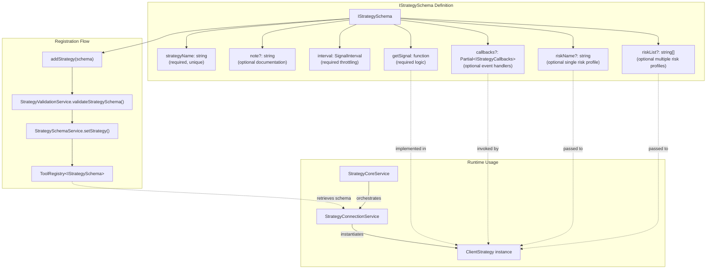
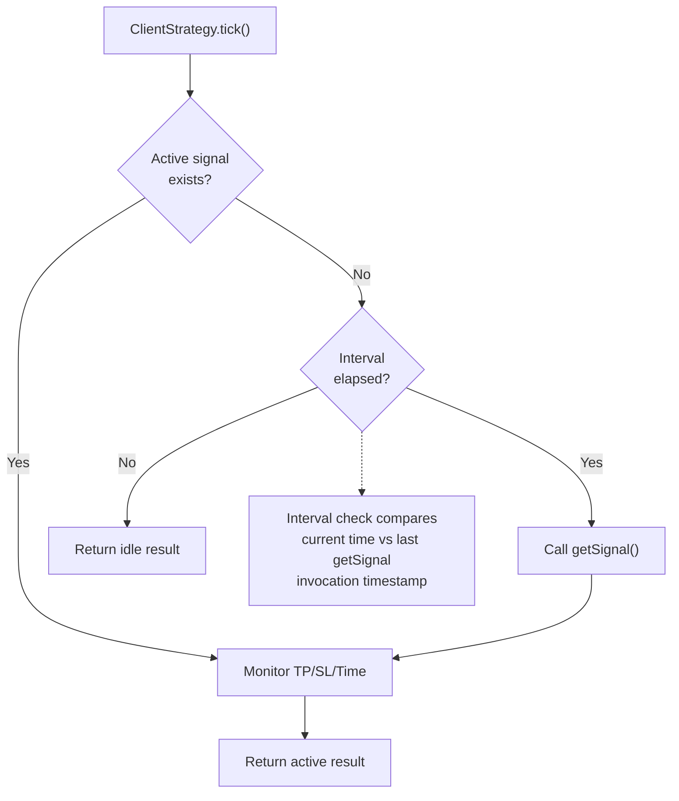
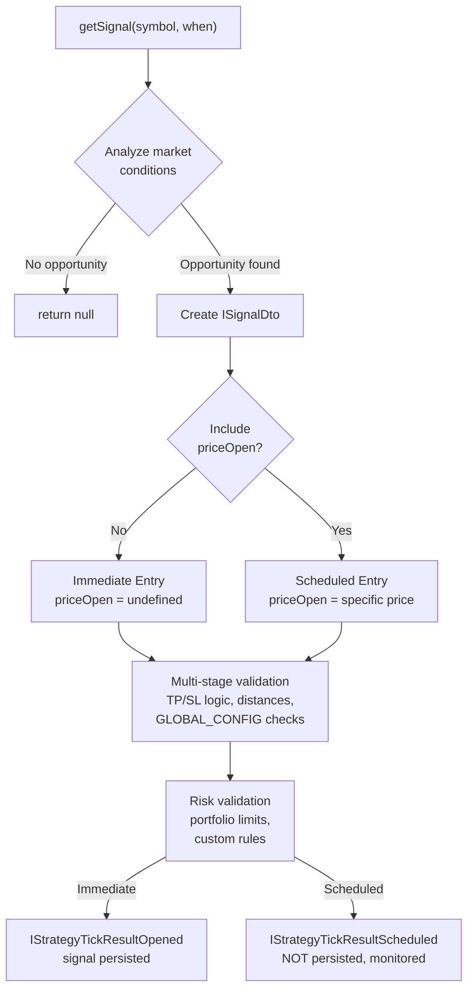
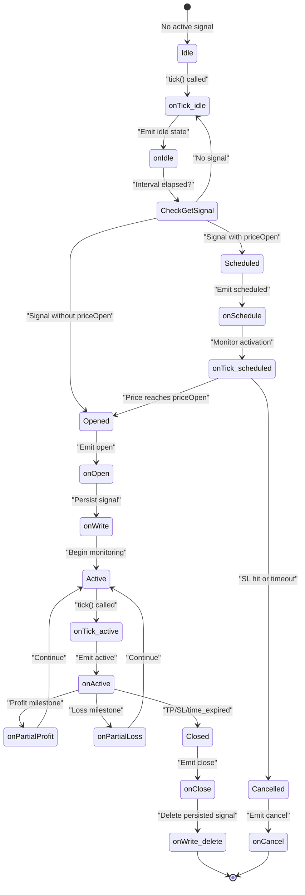
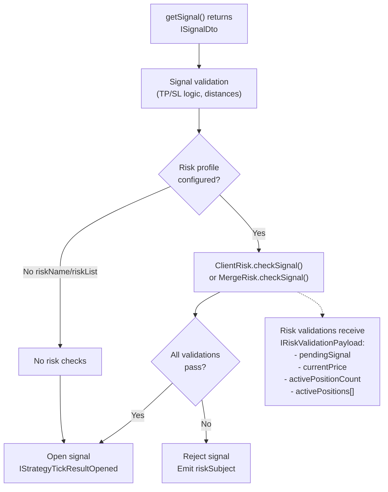
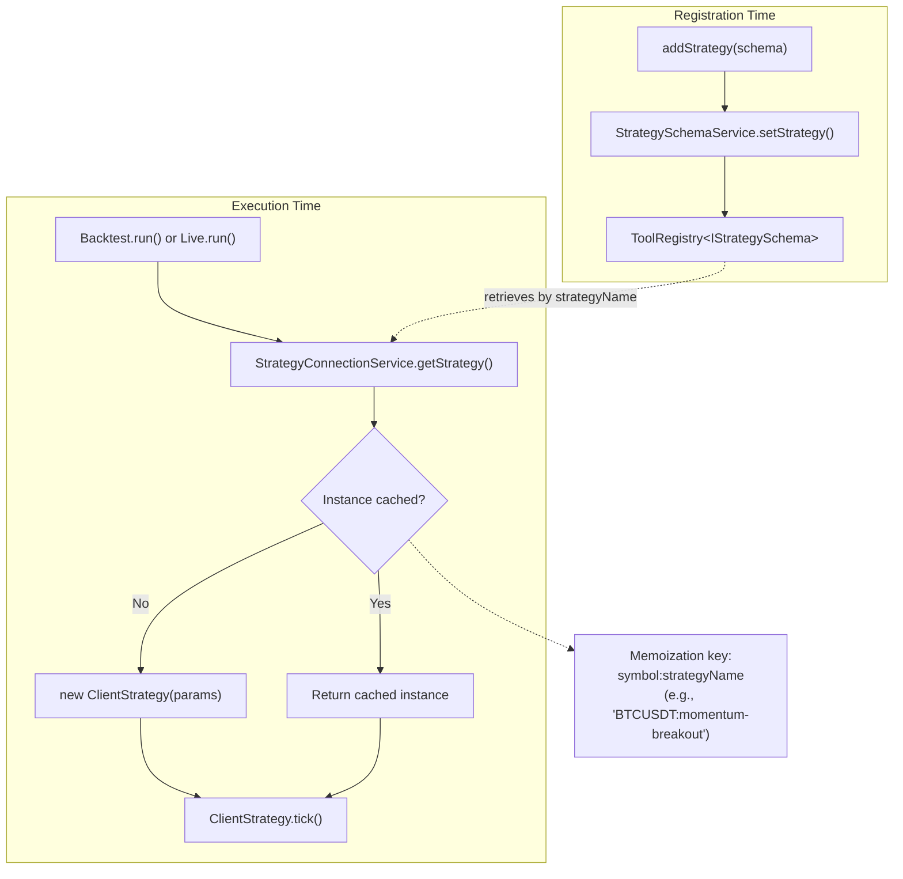

# Strategy Schema Definition

This page documents the `IStrategySchema` interface, which defines the complete configuration for a trading strategy in Backtest Kit. The schema specifies signal generation logic, execution intervals, lifecycle callbacks, and risk management integration.

For information about implementing the `getSignal` function and signal generation patterns, see [Signal Generation (getSignal)](./25_strategy-development.md). For details about callback implementations and event handling, see [Strategy Callbacks](./25_strategy-development.md). For multi-timeframe analysis patterns within strategies, see [Multi-Timeframe Analysis](./25_strategy-development.md).

---

## Overview

The `IStrategySchema` interface serves as the registration contract for trading strategies. When you call `addStrategy()`, you provide an object conforming to this schema, which is validated and stored in `StrategySchemaService`. The framework uses this schema to instantiate `ClientStrategy` objects that execute your trading logic.

**Sources:** [types.d.ts:724-747](), [src/index.ts:11-18]()

---

## Core Schema Structure

The strategy schema consists of seven primary properties:

| Property | Type | Required | Description |
|----------|------|----------|-------------|
| `strategyName` | `string` | Yes | Unique identifier for the strategy |
| `note` | `string` | No | Developer documentation/comments |
| `interval` | `SignalInterval` | Yes | Minimum time between `getSignal` calls |
| `getSignal` | `function` | Yes | Signal generation function |
| `callbacks` | `Partial<IStrategyCallbacks>` | No | Lifecycle event handlers |
| `riskName` | `string` | No | Single risk profile identifier |
| `riskList` | `string[]` | No | Multiple risk profile identifiers |

**Sources:** [types.d.ts:724-747]()

### Strategy Schema Component Relationships



**Sources:** [types.d.ts:724-747](), [src/function/add.ts:1-100](), [docs/classes/StrategyConnectionService.md:1-145]()

---

## Strategy Name and Documentation

### strategyName

The `strategyName` property is a unique string identifier for your strategy. This name is used throughout the system to reference the strategy in backtest runs, live trading, walker comparisons, and reporting.

**Type:** `string` (alias `StrategyName`)  
**Required:** Yes  
**Uniqueness:** Must be unique across all registered strategies

**Validation:** The `StrategyValidationService` checks for duplicate strategy names during registration.

**Sources:** [types.d.ts:730](), [types.d.ts:896]()

### note

The `note` property provides optional documentation for developers. This string is not used by the framework runtime but appears in generated documentation and strategy listings.

**Type:** `string`  
**Required:** No  
**Purpose:** Human-readable description, implementation notes, version tracking

**Sources:** [types.d.ts:732]()

---

## Signal Interval and Throttling

The `interval` property defines the minimum time between consecutive `getSignal` invocations. This prevents signal spam and ensures your strategy logic runs at a predictable cadence.

**Type:** `SignalInterval = "1m" | "3m" | "5m" | "15m" | "30m" | "1h"`  
**Required:** Yes  
**Purpose:** Throttling, rate limiting, execution timing

### How Throttling Works

When `ClientStrategy.tick()` is called repeatedly (in live mode), the framework tracks the timestamp of the last `getSignal` invocation. If the current time is within the interval window, `getSignal` is **not called**, and the strategy continues monitoring any active signal. Only when the interval has elapsed will `getSignal` be invoked again.

### Interval Selection Guidelines

| Interval | Use Case | Typical Strategy Type |
|----------|----------|----------------------|
| `"1m"` | High-frequency scalping | Very short-term momentum |
| `"5m"` | Active intraday trading | Short-term breakouts |
| `"15m"` | Standard intraday | Swing detection |
| `"30m"` | Longer intraday | Trend following |
| `"1h"` | Position trading | Multi-hour analysis |

**Important:** The interval does NOT affect how often the framework calls `tick()` in live mode. It only controls when `getSignal` is re-evaluated. The framework calls `tick()` approximately every `TICK_TTL` (1 minute + 1ms by default).

**Sources:** [types.d.ts:645](), [types.d.ts:734]()

### Throttling Implementation Flow



**Sources:** [types.d.ts:645](), [types.d.ts:734]()

---

## The getSignal Function

The `getSignal` function is the core of your strategy logic. It receives market context (symbol and timestamp) and returns either a signal to execute or `null` if no opportunity exists.

### Function Signature

```typescript
getSignal: (symbol: string, when: Date) => Promise<ISignalDto | null>
```

**Parameters:**
- `symbol`: Trading pair (e.g., `"BTCUSDT"`)
- `when`: Current timestamp from execution context

**Returns:**
- `ISignalDto` object: A valid signal to execute
- `null`: No signal at this time

**Sources:** [types.d.ts:740]()

### ISignalDto Structure

The returned signal must conform to `ISignalDto`:

| Property | Type | Required | Description |
|----------|------|----------|-------------|
| `id` | `string` | No | Signal ID (auto-generated if omitted) |
| `position` | `"long" \| "short"` | Yes | Trade direction |
| `note` | `string` | No | Human-readable reason |
| `priceOpen` | `number` | No | Entry price (omit for immediate entry) |
| `priceTakeProfit` | `number` | Yes | Take profit target |
| `priceStopLoss` | `number` | Yes | Stop loss exit |
| `minuteEstimatedTime` | `number` | Yes | Max lifetime in minutes |

**Sources:** [types.d.ts:647-665]()

### Signal Return Semantics

#### Immediate Entry (priceOpen omitted)

When `priceOpen` is **not provided**, the signal opens immediately at the current VWAP price. The framework:

1. Validates the signal structure and TP/SL logic
2. Runs risk checks
3. If approved, creates an `ISignalRow` with `priceOpen = currentPrice`
4. Persists the signal
5. Returns `IStrategyTickResultOpened`

#### Scheduled Entry (priceOpen provided)

When `priceOpen` **is provided**, the signal becomes scheduled. The framework:

1. Validates the signal structure and TP/SL logic
2. Checks if `priceOpen` is reachable (not already past SL)
3. Returns `IStrategyTickResultScheduled`
4. On subsequent ticks, monitors if price reaches `priceOpen` **before** SL
5. If activated: converts to pending signal, persists, returns `IStrategyTickResultOpened`
6. If SL hit first or timeout: returns `IStrategyTickResultCancelled`

**Critical:** Scheduled signals are **not persisted** until activation. If the system crashes, scheduled signals are lost. Only opened signals persist.

**Sources:** [types.d.ts:740](), [types.d.ts:647-665]()

### Signal Generation Decision Tree



**Sources:** [types.d.ts:740](), [types.d.ts:647-665]()

---

## Signal Validation Requirements

Before a signal is accepted, the framework performs multiple validation stages. Your `getSignal` function must return signals that satisfy these constraints:

### Price Validation

1. All prices must be positive, finite numbers (not NaN, not Infinity)
2. **LONG signals:**
   - `priceTakeProfit > priceOpen > priceStopLoss`
3. **SHORT signals:**
   - `priceStopLoss > priceOpen > priceTakeProfit`

### Distance Validation (GLOBAL_CONFIG)

- **Take Profit Distance:** Must be at least `CC_MIN_TAKEPROFIT_DISTANCE_PERCENT` (default 0.2%) to cover fees (0.1%) + slippage (0.1%)
- **Stop Loss Distance:** Must not exceed `CC_MAX_STOPLOSS_DISTANCE_PERCENT` (default 50%)

### Lifetime Validation

- `minuteEstimatedTime` must be ≤ `CC_MAX_SIGNAL_LIFETIME_MINUTES` (default 10080 = 1 week)

### Scheduled Signal Specific

For signals with `priceOpen`:
- `priceOpen` must be reachable (not already past SL threshold)
- Scheduled signals that don't activate within `CC_SCHEDULE_AWAIT_MINUTES` (default 120) are auto-cancelled

**Sources:** [types.d.ts:647-665]()

---

## Strategy Callbacks

The `callbacks` property allows you to register event handlers that are invoked during the signal lifecycle. All callbacks are optional.

**Type:** `Partial<IStrategyCallbacks>`  
**Required:** No

### Available Callbacks

| Callback | When Invoked | Parameters |
|----------|--------------|------------|
| `onTick` | Every tick | `symbol, result, backtest` |
| `onOpen` | Signal opens | `symbol, data, currentPrice, backtest` |
| `onActive` | Signal monitored | `symbol, data, currentPrice, backtest` |
| `onIdle` | No active signal | `symbol, currentPrice, backtest` |
| `onClose` | Signal closes | `symbol, data, priceClose, backtest` |
| `onSchedule` | Scheduled signal created | `symbol, data, currentPrice, backtest` |
| `onCancel` | Scheduled signal cancelled | `symbol, data, currentPrice, backtest` |
| `onWrite` | Signal persisted | `symbol, data, backtest` |
| `onPartialProfit` | Profit milestone hit | `symbol, data, currentPrice, revenuePercent, backtest` |
| `onPartialLoss` | Loss milestone hit | `symbol, data, currentPrice, lossPercent, backtest` |

**Sources:** [types.d.ts:699-723]()

### Callback Lifecycle Flow



**Sources:** [types.d.ts:699-723]()

### Callback Use Cases

- **onTick:** Debug logging, custom monitoring, external API updates
- **onOpen:** Notification systems, database logging, order submission (live mode)
- **onActive:** Real-time dashboards, progress tracking
- **onClose:** PNL reporting, strategy analysis, cleanup
- **onSchedule/onCancel:** Pending order tracking, limit order monitoring
- **onPartialProfit/onPartialLoss:** Risk adjustment, partial profit taking alerts

**Sources:** [types.d.ts:699-723]()

---

## Risk Management Integration

Strategies can optionally integrate with the risk management system by specifying one or more risk profiles. Risk checks are performed **before** a signal is accepted.

### Single Risk Profile (riskName)

Specify a single risk profile identifier:

```typescript
{
  strategyName: "my-strategy",
  riskName: "conservative",
  // ...
}
```

The framework instantiates `ClientRisk` with the specified profile and calls `checkSignal()` before opening positions.

**Sources:** [types.d.ts:744]()

### Multiple Risk Profiles (riskList)

Specify multiple risk profiles that must **all** approve:

```typescript
{
  strategyName: "my-strategy",
  riskList: ["portfolio-limit", "time-window", "correlation-check"],
  // ...
}
```

The framework instantiates `MergeRisk` which aggregates validations from all profiles. A signal is rejected if **any** profile rejects it.

**Sources:** [types.d.ts:746]()

### Risk Check Flow



**Sources:** [types.d.ts:744-746](), [types.d.ts:413-426]()

### Risk vs No Risk

| Aspect | With Risk Profile | Without Risk Profile |
|--------|-------------------|---------------------|
| Validation | Custom portfolio rules apply | Only GLOBAL_CONFIG checks |
| Rejection | Can be rejected by risk logic | Only rejected by invalid TP/SL |
| Position Tracking | Tracked in `RiskGlobalService` | Not tracked |
| Event Emission | Emits to `riskSubject` on rejection | No risk events |
| Use Case | Complex multi-strategy portfolios | Simple single-strategy systems |

**Sources:** [types.d.ts:744-746]()

---

## Registration and Usage

### Registration via addStrategy()

Strategies are registered using the global `addStrategy()` function:

```typescript
import { addStrategy } from "backtest-kit";

addStrategy({
  strategyName: "momentum-breakout",
  note: "Detects momentum breakouts on 5m timeframe",
  interval: "5m",
  getSignal: async (symbol, when) => {
    // Your logic here
    return null; // or ISignalDto
  },
  callbacks: {
    onOpen: (symbol, data, currentPrice, backtest) => {
      console.log(`Signal opened: ${data.id}`);
    },
  },
  riskName: "conservative",
});
```

**Sources:** [README.md:66-142](), [src/index.ts:11-18]()

### Internal Storage and Retrieval

1. `addStrategy()` delegates to `StrategySchemaService.setStrategy()`
2. Schema is stored in `ToolRegistry<IStrategySchema>` with `strategyName` as key
3. `StrategyValidationService.validateStrategySchema()` checks for duplicates
4. During execution, `StrategyConnectionService` retrieves schemas and instantiates `ClientStrategy` objects
5. `ClientStrategy` uses the schema's `getSignal` function and callbacks

**Sources:** [src/function/add.ts:1-100](), [docs/classes/StrategyConnectionService.md:1-145]()

### Runtime Instantiation



**Sources:** [docs/classes/StrategyConnectionService.md:70-80](), [src/function/add.ts:1-100]()

---

## Schema Validation Rules

When `addStrategy()` is called, the framework validates:

1. **strategyName uniqueness:** No duplicate strategy names
2. **interval validity:** Must be one of the allowed `SignalInterval` values
3. **getSignal presence:** Function must be provided
4. **riskName/riskList mutual exclusivity:** Cannot specify both simultaneously
5. **Referenced risk profiles exist:** If `riskName` or `riskList` specified, those profiles must be registered via `addRisk()`

**Sources:** [src/function/add.ts:1-100]()

---

## Complete Example

```typescript
import { addStrategy, getCandles, ISignalDto } from "backtest-kit";
import { v4 as uuid } from "uuid";

addStrategy({
  strategyName: "rsi-oversold",
  note: "Buys when RSI < 30, sells when RSI > 70",
  interval: "15m",
  
  getSignal: async (symbol, when): Promise<ISignalDto | null> => {
    // Fetch historical data
    const candles = await getCandles(symbol, "1h", 24);
    
    // Calculate RSI (simplified)
    const rsi = calculateRSI(candles);
    const currentPrice = candles[candles.length - 1].close;
    
    // Entry condition: RSI oversold
    if (rsi < 30) {
      return {
        id: uuid(),
        position: "long",
        note: `RSI oversold: ${rsi.toFixed(2)}`,
        // Immediate entry (priceOpen omitted)
        priceTakeProfit: currentPrice * 1.03, // 3% profit target
        priceStopLoss: currentPrice * 0.98,   // 2% stop loss
        minuteEstimatedTime: 1440,            // 24 hours max
      };
    }
    
    // No opportunity
    return null;
  },
  
  callbacks: {
    onOpen: (symbol, data, currentPrice, backtest) => {
      console.log(`[${symbol}] Signal opened: ${data.note}`);
    },
    onClose: (symbol, data, priceClose, backtest) => {
      console.log(`[${symbol}] Signal closed at ${priceClose}`);
    },
    onPartialProfit: (symbol, data, currentPrice, revenuePercent, backtest) => {
      console.log(`[${symbol}] Partial profit: ${revenuePercent.toFixed(2)}%`);
    },
  },
  
  riskName: "conservative",
});
```

**Sources:** [README.md:66-142](), [types.d.ts:724-747]()

---

## Summary Table

| Component | File Reference | Purpose |
|-----------|----------------|---------|
| `IStrategySchema` | [types.d.ts:724-747]() | Schema interface definition |
| `SignalInterval` | [types.d.ts:645]() | Throttling interval type |
| `ISignalDto` | [types.d.ts:647-665]() | Return type for getSignal |
| `IStrategyCallbacks` | [types.d.ts:699-723]() | Lifecycle event handlers |
| `addStrategy()` | [src/index.ts:11-18]() | Registration function |
| `StrategySchemaService` | [docs/classes/StrategySchemaService.md:1-50]() | Schema storage |
| `StrategyConnectionService` | [docs/classes/StrategyConnectionService.md:1-145]() | Instance routing |
| `ClientStrategy` | [types.d.ts:724-747]() | Strategy execution implementation |

**Sources:** [types.d.ts:724-747](), [src/index.ts:11-18](), [docs/classes/StrategyConnectionService.md:1-145]()