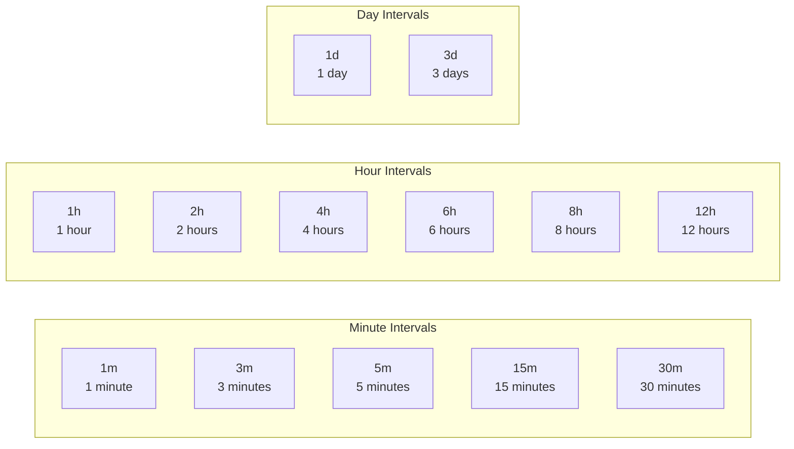
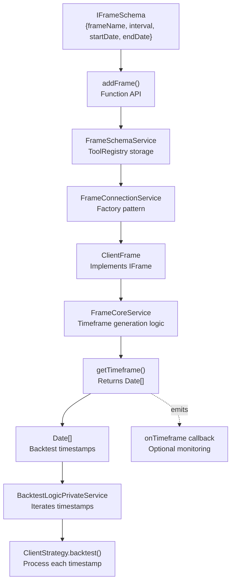
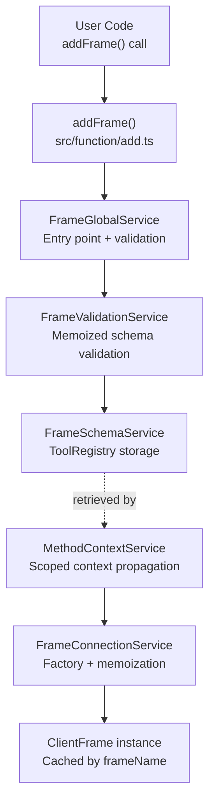
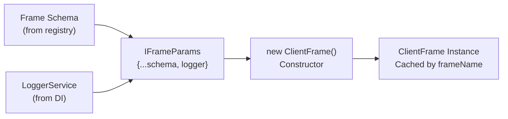
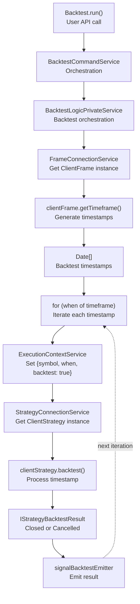

# Frame Schemas

<details>
<summary>Relevant source files</summary>

The following files were used as context for generating this wiki page:

- [demo/backtest/package-lock.json](demo/backtest/package-lock.json)
- [demo/backtest/package.json](demo/backtest/package.json)
- [demo/backtest/src/index.mjs](demo/backtest/src/index.mjs)
- [demo/live/package-lock.json](demo/live/package-lock.json)
- [demo/live/package.json](demo/live/package.json)
- [demo/live/src/index.mjs](demo/live/src/index.mjs)
- [demo/optimization/package-lock.json](demo/optimization/package-lock.json)
- [demo/optimization/package.json](demo/optimization/package.json)
- [package-lock.json](package-lock.json)
- [package.json](package.json)
- [src/config/emitters.ts](src/config/emitters.ts)
- [src/function/event.ts](src/function/event.ts)
- [src/index.ts](src/index.ts)
- [types.d.ts](types.d.ts)

</details>


## Purpose and Scope

Frame schemas define **backtest timeframe configurations** for historical strategy simulation. A frame specifies the date range (`startDate` to `endDate`) and timestamp interval (`interval`) used to generate a sequence of timestamps for backtest iteration. Each frame is registered via `addFrame()` and referenced by `frameName` when executing backtests.

For information about strategy configurations, see [Strategy Schemas](#5.1). For walker configurations that use frames, see [Walker Schemas](#5.6). For the actual backtest execution flow, see section 9.

**Sources**: [types.d.ts:212-295](), [src/index.ts:90]()

---

## Frame Schema Structure

Frame schemas are defined by the `IFrameSchema` interface, which contains all parameters needed to generate a backtest timeframe.

### IFrameSchema Properties

| Property | Type | Required | Description |
|----------|------|----------|-------------|
| `frameName` | `FrameName` (string) | Yes | Unique identifier for this frame configuration |
| `interval` | `FrameInterval` | Yes | Time interval between generated timestamps |
| `startDate` | `Date` | Yes | Start of backtest period (inclusive) |
| `endDate` | `Date` | Yes | End of backtest period (inclusive) |
| `note` | `string` | No | Optional developer note for documentation purposes |
| `callbacks` | `Partial<IFrameCallbacks>` | No | Optional lifecycle event callbacks |

### Example Frame Schema

```typescript
addFrame({
  frameName: "1d-backtest",
  interval: "1m",
  startDate: new Date("2024-01-01T00:00:00Z"),
  endDate: new Date("2024-01-02T00:00:00Z"),
  note: "24-hour backtest with 1-minute resolution",
  callbacks: {
    onTimeframe: (timeframe, startDate, endDate, interval) => {
      console.log(`Generated ${timeframe.length} timestamps`);
    }
  }
});
```

**Sources**: [types.d.ts:262-275](), [demo/backtest/src/index.mjs:84-89]()

---

## Frame Intervals

The `FrameInterval` type defines the granularity of timestamp generation. Each interval determines the time spacing between consecutive timestamps in the generated timeframe array.

### Supported Intervals



### Interval Type Definition

```typescript
type FrameInterval = 
  | "1m" | "3m" | "5m" | "15m" | "30m"     // Minutes
  | "1h" | "2h" | "4h" | "6h" | "8h" | "12h"  // Hours
  | "1d" | "3d";                           // Days
```

### Interval Selection Guidelines

| Interval | Timestamp Count (24h) | Use Case | Memory Impact |
|----------|----------------------|----------|---------------|
| `1m` | 1,440 | High-frequency strategies, intraday analysis | High |
| `5m` | 288 | Standard intraday backtesting | Medium |
| `15m` | 96 | Medium-frequency strategies | Low |
| `1h` | 24 | Low-frequency strategies, swing trading | Very Low |
| `1d` | 1 | Position trading, long-term strategies | Minimal |

**Note**: Shorter intervals generate more timestamps, increasing backtest execution time and memory usage. Choose the longest interval that still captures your strategy's signal generation frequency.

**Sources**: [types.d.ts:219](), [types.d.ts:268]()

---

## Timeframe Generation Process

Frame schemas are consumed by `ClientFrame` to generate arrays of `Date` objects representing backtest timestamps. The `FrameCoreService` orchestrates this generation.



### Generation Algorithm

1. **Parse interval**: Convert `FrameInterval` string to milliseconds
2. **Initialize cursor**: Set to `startDate` timestamp
3. **Iterate**: While cursor ≤ `endDate`:
   - Add `new Date(cursor)` to result array
   - Increment cursor by interval milliseconds
4. **Return**: Array of `Date` objects

### Example Generation Output

For frame with `interval: "1h"`, `startDate: 2024-01-01T00:00:00Z`, `endDate: 2024-01-01T03:00:00Z`:

```
[
  Date("2024-01-01T00:00:00.000Z"),
  Date("2024-01-01T01:00:00.000Z"),
  Date("2024-01-01T02:00:00.000Z"),
  Date("2024-01-01T03:00:00.000Z")
]
```

**Sources**: [types.d.ts:280-289](), High-level diagram references throughout the system

---

## IFrame Interface

The `IFrame` interface is implemented by `ClientFrame` and provides the runtime API for timeframe generation.

### Interface Definition

```typescript
interface IFrame {
  /**
   * Generates array of timestamps for backtest iteration.
   * Timestamps are spaced according to the configured interval.
   *
   * @param symbol - Trading pair symbol (unused, for API consistency)
   * @param frameName - Frame identifier to retrieve configuration
   * @returns Promise resolving to array of Date objects
   */
  getTimeframe: (symbol: string, frameName: FrameName) => Promise<Date[]>;
}
```

### Method Parameters

| Parameter | Type | Purpose |
|-----------|------|---------|
| `symbol` | `string` | Trading pair symbol (currently unused, reserved for future per-symbol frame configurations) |
| `frameName` | `FrameName` | Identifier of registered frame schema to use |

### Return Value

Returns `Promise<Date[]>` - an array of `Date` objects representing the complete backtest timeframe. Each `Date` corresponds to one tick in the backtest simulation.

**Sources**: [types.d.ts:280-289]()

---

## Lifecycle Callbacks

Frame schemas support optional lifecycle callbacks via `IFrameCallbacks` for monitoring timeframe generation.

### IFrameCallbacks Interface

```typescript
interface IFrameCallbacks {
  /**
   * Called after timeframe array generation.
   * Useful for logging or validating the generated timeframes.
   *
   * @param timeframe - Array of Date objects representing tick timestamps
   * @param startDate - Start of the backtest period
   * @param endDate - End of the backtest period
   * @param interval - Interval used for generation
   */
  onTimeframe: (
    timeframe: Date[], 
    startDate: Date, 
    endDate: Date, 
    interval: FrameInterval
  ) => void;
}
```

### Callback Usage Example

```typescript
addFrame({
  frameName: "validation-frame",
  interval: "5m",
  startDate: new Date("2024-01-01T00:00:00Z"),
  endDate: new Date("2024-01-01T23:59:59Z"),
  callbacks: {
    onTimeframe: (timeframe, startDate, endDate, interval) => {
      const duration = endDate.getTime() - startDate.getTime();
      const expectedCount = Math.floor(duration / (5 * 60 * 1000)) + 1;
      
      console.log(`Timeframe generated:`);
      console.log(`  Interval: ${interval}`);
      console.log(`  Period: ${startDate.toISOString()} to ${endDate.toISOString()}`);
      console.log(`  Timestamps: ${timeframe.length} (expected: ${expectedCount})`);
      console.log(`  First: ${timeframe[0].toISOString()}`);
      console.log(`  Last: ${timeframe[timeframe.length - 1].toISOString()}`);
      
      if (timeframe.length !== expectedCount) {
        console.warn(`Timestamp count mismatch!`);
      }
    }
  }
});
```

**Sources**: [types.d.ts:229-242](), [types.d.ts:274]()

---

## Frame Registration and Usage

Frames are registered via the `addFrame()` public API function and referenced by `frameName` in backtest execution.

### Registration Flow



### Registration Example

```typescript
import { addFrame } from "backtest-kit";

// Register multiple frames for different test periods
addFrame({
  frameName: "jan-2024",
  interval: "1m",
  startDate: new Date("2024-01-01T00:00:00Z"),
  endDate: new Date("2024-01-31T23:59:59Z"),
});

addFrame({
  frameName: "q1-2024-hourly",
  interval: "1h",
  startDate: new Date("2024-01-01T00:00:00Z"),
  endDate: new Date("2024-03-31T23:59:59Z"),
});

addFrame({
  frameName: "2024-daily",
  interval: "1d",
  startDate: new Date("2024-01-01T00:00:00Z"),
  endDate: new Date("2024-12-31T23:59:59Z"),
});
```

### Usage in Backtest Execution

```typescript
import { Backtest } from "backtest-kit";

// Reference frame by frameName
await Backtest.run("BTCUSDT", {
  strategyName: "my-strategy",
  exchangeName: "binance",
  frameName: "jan-2024"  // Uses registered frame
});
```

**Sources**: [demo/backtest/src/index.mjs:84-89](), [demo/backtest/src/index.mjs:109-113]()

---

## Frame Parameters and ClientFrame

When frame schemas are instantiated as `ClientFrame` objects, they receive additional runtime dependencies via `IFrameParams`.

### IFrameParams Interface

```typescript
interface IFrameParams extends IFrameSchema {
  /** Logger service for debug output */
  logger: ILogger;
}
```

### Dependency Injection

The `FrameConnectionService` provides dependencies when instantiating `ClientFrame`:

| Dependency | Source | Purpose |
|------------|--------|---------|
| `logger` | `LoggerService` (DI) | Internal logging for timeframe generation |
| Schema properties | `FrameSchemaService` | User-defined frame configuration |

### ClientFrame Instantiation



**Sources**: [types.d.ts:221-227]()

---

## Frame Names and Type Safety

The `FrameName` type provides a type alias for frame identifiers, enabling consistent typing across the codebase.

### Type Definition

```typescript
type FrameName = string;
```

### Usage in Type Signatures

Frame names appear in multiple interface signatures throughout the system:

| Interface | Property/Parameter | Type |
|-----------|-------------------|------|
| `IFrameSchema` | `frameName` | `FrameName` |
| `IFrame` | `getTimeframe(symbol, frameName)` | `FrameName` |
| `IWalkerSchema` | `frameName` | `FrameName` |
| `IMethodContext` | `frameName` | `FrameName` |

### Empty String Convention

In live trading mode, `frameName` is set to an empty string (`""`) since frames are only used for backtesting:

```typescript
// Live mode: no frame needed
await Live.run("BTCUSDT", {
  strategyName: "my-strategy",
  exchangeName: "binance"
  // frameName is implicitly ""
});

// Backtest mode: frame required
await Backtest.run("BTCUSDT", {
  strategyName: "my-strategy",
  exchangeName: "binance",
  frameName: "jan-2024"  // Must specify frame
});
```

**Sources**: [types.d.ts:294](), [types.d.ts:308]()

---

## Integration with Backtest Execution

Frames integrate with the backtest system through the `BacktestLogicPrivateService`, which uses generated timeframes to drive strategy simulation.



### Execution Context Propagation

For each timestamp in the generated timeframe, the `ExecutionContextService` propagates context to strategy operations:

```typescript
// Pseudo-code from BacktestLogicPrivateService
const timeframe = await clientFrame.getTimeframe(symbol, frameName);

for (const when of timeframe) {
  await ExecutionContextService.runInContext(
    async () => {
      // Strategy can now access current timestamp via context
      await clientStrategy.backtest(symbol);
    },
    {
      symbol,
      when,        // Current timestamp from frame
      backtest: true
    }
  );
}
```

**Sources**: High-level system architecture diagrams, [types.d.ts:11-18]()

---

## Summary Table: Frame Schema Components

| Component | Type | Role |
|-----------|------|------|
| `IFrameSchema` | Interface | User-facing schema for frame registration |
| `IFrameParams` | Interface | Extended schema with runtime dependencies |
| `IFrameCallbacks` | Interface | Optional lifecycle event callbacks |
| `IFrame` | Interface | Runtime API for timeframe generation |
| `FrameInterval` | Type | Timestamp spacing interval (1m, 1h, 1d, etc.) |
| `FrameName` | Type | Frame identifier (string alias) |
| `FrameSchemaService` | Service | Schema storage and retrieval |
| `FrameValidationService` | Service | Schema validation with memoization |
| `FrameConnectionService` | Service | ClientFrame factory and caching |
| `FrameCoreService` | Service | Timeframe generation algorithm |
| `ClientFrame` | Class | IFrame implementation |

**Sources**: [types.d.ts:212-295](), Service layer architecture throughout codebase