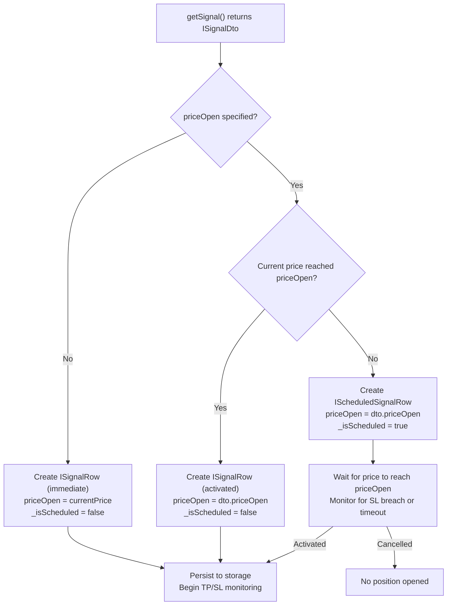
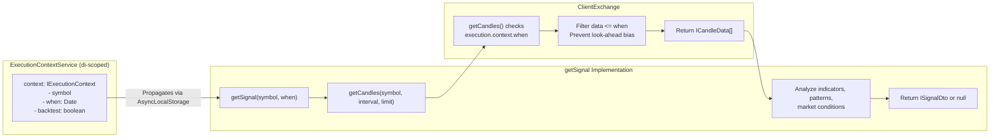
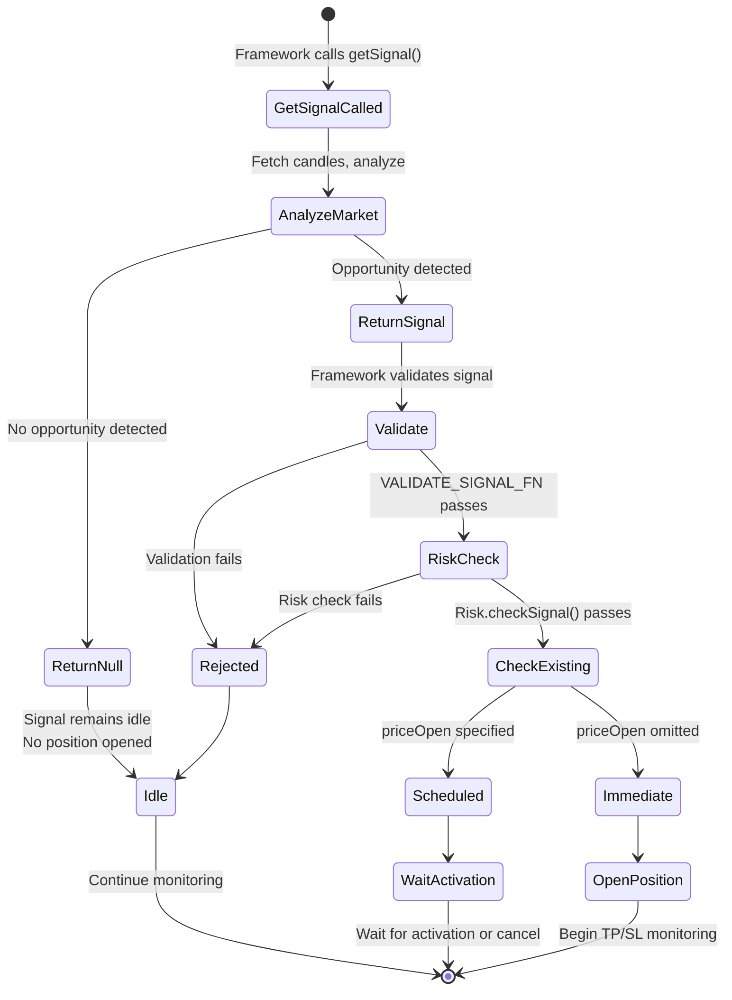
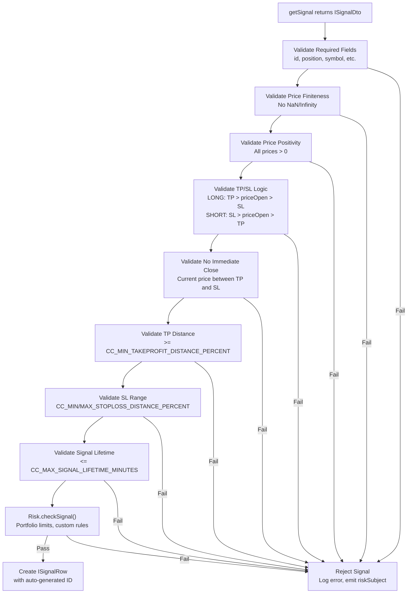
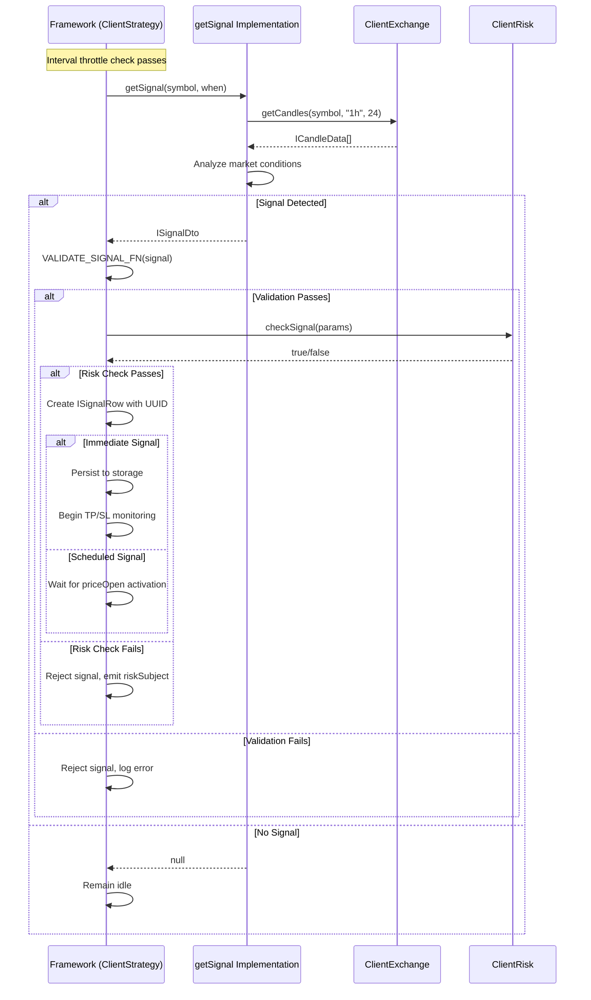

# Signal Generation (getSignal)

This document explains how to implement the `getSignal` function, which is the core signal generation logic for trading strategies in Backtest Kit. The `getSignal` function analyzes market conditions and returns trading signals or null when no opportunity exists.

For strategy schema configuration and registration, see [Strategy Schema Definition](./25_strategy-development.md). For handling signal lifecycle events, see [Strategy Callbacks](./25_strategy-development.md). For analyzing multiple timeframes within `getSignal`, see [Multi-Timeframe Analysis](./25_strategy-development.md). For throttling behavior that limits `getSignal` calls, see [Interval Throttling](./25_strategy-development.md).

---

## Function Contract

The `getSignal` function is defined in the `IStrategySchema` interface as a required property that returns a promise resolving to either an `ISignalDto` object or `null`.

```typescript
getSignal: (symbol: string, when: Date) => Promise<ISignalDto | null>
```

**Parameters:**
- `symbol` - Trading pair symbol (e.g., "BTCUSDT")
- `when` - Current execution timestamp (temporal context)

**Return Value:**
- `ISignalDto` - Signal to open a position
- `null` - No trading opportunity detected

The framework calls `getSignal` at intervals specified by the strategy's `interval` property `types.d.ts:734`. Interval throttling ensures the function is not called more frequently than configured, preventing signal spam.


---

## Signal Data Transfer Object (ISignalDto)

The `ISignalDto` interface defines the structure returned by `getSignal`. All fields except `id` are required for complete signal specification.

| Field | Type | Required | Description |
|-------|------|----------|-------------|
| `id` | `string` | Optional | Signal identifier (auto-generated if omitted) |
| `position` | `"long" \| "short"` | **Required** | Trade direction |
| `note` | `string` | Optional | Human-readable reason for signal |
| `priceOpen` | `number` | Optional | Entry price (omit for immediate market order) |
| `priceTakeProfit` | `number` | **Required** | Take profit target price |
| `priceStopLoss` | `number` | **Required** | Stop loss exit price |
| `minuteEstimatedTime` | `number` | **Required** | Expected duration before time_expired |

**Key Constraints:**
- **Long position:** `priceTakeProfit > priceOpen > priceStopLoss`
- **Short position:** `priceStopLoss > priceOpen > priceTakeProfit`
- `minuteEstimatedTime` must be positive integer

If `priceOpen` is omitted, the signal opens immediately at current VWAP. If `priceOpen` is specified, the signal becomes scheduled and waits for price to reach entry point.


---

## Immediate vs Scheduled Signals



**Immediate Signals (Market Orders):**
When `priceOpen` is omitted in the returned `ISignalDto`, the signal opens immediately at current VWAP price. The framework sets `priceOpen` equal to the current market price and persists the signal for TP/SL monitoring.

**Scheduled Signals (Limit Orders):**
When `priceOpen` is specified in the returned `ISignalDto`, the signal enters scheduled state and waits for price to reach entry point. The signal activates when:
- **Long:** `currentPrice <= priceOpen` (price drops to entry)
- **Short:** `currentPrice >= priceOpen` (price rises to entry)

Scheduled signals are cancelled if:
- Stop loss is breached before activation
- Timeout expires (`CC_SCHEDULE_AWAIT_MINUTES` configuration)

The activation check happens in `src/client/ClientStrategy.ts:389-443` within `GET_SIGNAL_FN`.


---

## Temporal Context and Look-Ahead Bias Prevention



The `when` parameter passed to `getSignal` represents the current execution timestamp. This timestamp is also stored in `ExecutionContextService.context.when` and propagates through `AsyncLocalStorage` to all downstream operations.

When `getCandles()` is called within `getSignal`, it automatically uses the temporal context from `ExecutionContextService` to fetch only historical data up to `when`. This architectural pattern makes look-ahead bias architecturally impossible:

1. `getSignal(symbol, when)` is called with current timestamp
2. `ExecutionContextService.context.when` is set to this timestamp
3. Any `getCandles()` call fetches data filtered by `when`
4. Future data beyond `when` is inaccessible

This temporal isolation works identically in both backtest and live modes, ensuring strategies behave consistently across environments.


---

## Using getCandles for Market Analysis

The `getCandles()` function is the primary way to access market data within `getSignal`. It fetches OHLCV candles from the configured exchange while respecting temporal context.

```typescript
import { getCandles } from 'backtest-kit';

async function getSignal(symbol: string, when: Date): Promise<ISignalDto | null> {
  // Fetch last 24 one-hour candles (up to 'when')
  const candles1h = await getCandles(symbol, "1h", 24);
  
  // Fetch last 48 fifteen-minute candles
  const candles15m = await getCandles(symbol, "15m", 48);
  
  // Fetch last 60 one-minute candles
  const candles1m = await getCandles(symbol, "1m", 60);
  
  // Analyze candles for patterns, indicators, etc.
  const shouldEnterLong = analyzeMarketConditions(candles1h, candles15m, candles1m);
  
  if (shouldEnterLong) {
    return {
      position: "long",
      priceTakeProfit: candles1m[candles1m.length - 1].close * 1.02,
      priceStopLoss: candles1m[candles1m.length - 1].close * 0.99,
      minuteEstimatedTime: 120,
      note: "Strong uptrend detected on 1h timeframe"
    };
  }
  
  return null; // No opportunity
}
```

**Available Intervals:**
`"1m"`, `"3m"`, `"5m"`, `"15m"`, `"30m"`, `"1h"`, `"2h"`, `"4h"`, `"6h"`, `"8h"`

For detailed multi-timeframe analysis patterns, see [Multi-Timeframe Analysis](./25_strategy-development.md).


---

## Return Value Semantics



**Returning `null`:**
When `getSignal` returns `null`, the strategy remains in idle state. The framework:
- Does not create any signal
- Does not emit any events (except `onIdle` callback)
- Continues calling `getSignal` at configured intervals

**Returning `ISignalDto`:**
When `getSignal` returns a signal object, the framework:
1. Validates the signal structure and price relationships
2. Checks risk limits via `IRisk.checkSignal()`
3. Creates `ISignalRow` with auto-generated ID
4. Persists signal (if immediate) or queues for activation (if scheduled)
5. Begins TP/SL/time monitoring

Validation failures result in the signal being rejected without opening any position. Risk check failures are logged and emitted via `riskSubject`.


---

## Signal Validation Pipeline

After `getSignal` returns an `ISignalDto`, the framework applies multi-stage validation before creating a position. All validation occurs in `VALIDATE_SIGNAL_FN` at `src/client/ClientStrategy.ts:45-330`.



### Validation Stages

**Stage 1: Required Fields**
Validates presence of mandatory fields: `id`, `position`, `symbol`, `exchangeName`, `strategyName`, `_isScheduled`.

**Stage 2: Price Finiteness**
Ensures all price values (`currentPrice`, `priceOpen`, `priceTakeProfit`, `priceStopLoss`) are finite numbers, not `NaN` or `Infinity`.

**Stage 3: Price Positivity**
Validates all prices are positive values greater than zero.

**Stage 4: TP/SL Logic**
Verifies take profit and stop loss are positioned correctly relative to entry price:
- **Long:** `priceTakeProfit > priceOpen > priceStopLoss`
- **Short:** `priceStopLoss > priceOpen > priceTakeProfit`

**Stage 5: Immediate Close Prevention**
For immediate signals (no `priceOpen`), ensures current price is between TP and SL. Prevents signals that would close instantly.

For scheduled signals, ensures `priceOpen` is between TP and SL. Prevents signals that would close immediately upon activation.

**Stage 6: Minimum TP Distance**
Enforces `CC_MIN_TAKEPROFIT_DISTANCE_PERCENT` (default 0.2%) to ensure take profit covers trading fees (0.1%) and slippage (0.1%).

**Stage 7: SL Range Limits**
Enforces:
- `CC_MIN_STOPLOSS_DISTANCE_PERCENT` - Minimum SL buffer to avoid instant stop-outs
- `CC_MAX_STOPLOSS_DISTANCE_PERCENT` - Maximum SL to limit capital exposure

**Stage 8: Signal Lifetime**
Validates `minuteEstimatedTime <= CC_MAX_SIGNAL_LIFETIME_MINUTES` to prevent eternal positions that block risk limits.

### Global Configuration Parameters

| Parameter | Default | Description |
|-----------|---------|-------------|
| `CC_MIN_TAKEPROFIT_DISTANCE_PERCENT` | 0.2% | Minimum TP distance to cover fees/slippage |
| `CC_MIN_STOPLOSS_DISTANCE_PERCENT` | 0.05% | Minimum SL buffer to prevent instant stop-out |
| `CC_MAX_STOPLOSS_DISTANCE_PERCENT` | 10% | Maximum SL to protect capital |
| `CC_MAX_SIGNAL_LIFETIME_MINUTES` | 10080 (7 days) | Maximum signal duration to prevent deadlock |

These parameters are configurable via `setConfig()`. See [GLOBAL_CONFIG Parameters](./52_configuration-reference.md) for complete configuration reference.


---

## Example: Simple Moving Average Crossover

This example demonstrates a basic signal generation strategy using moving average crossovers.

```typescript
import { addStrategy, getCandles, ISignalDto } from 'backtest-kit';

addStrategy({
  strategyName: "sma-crossover",
  interval: "5m",
  riskName: "demo",
  
  getSignal: async (symbol: string, when: Date): Promise<ISignalDto | null> => {
    // Fetch last 50 hourly candles
    const candles = await getCandles(symbol, "1h", 50);
    
    if (candles.length < 50) {
      return null; // Insufficient data
    }
    
    // Calculate 20-period and 50-period SMAs
    const sma20 = calculateSMA(candles.slice(-20));
    const sma50 = calculateSMA(candles.slice(-50));
    const sma20Prev = calculateSMA(candles.slice(-21, -1));
    const sma50Prev = calculateSMA(candles.slice(-51, -1));
    
    const currentPrice = candles[candles.length - 1].close;
    
    // Bullish crossover: SMA20 crosses above SMA50
    if (sma20 > sma50 && sma20Prev <= sma50Prev) {
      return {
        position: "long",
        priceTakeProfit: currentPrice * 1.025, // 2.5% profit target
        priceStopLoss: currentPrice * 0.985,   // 1.5% stop loss
        minuteEstimatedTime: 240,              // 4 hours
        note: `SMA20 (${sma20.toFixed(2)}) crossed above SMA50 (${sma50.toFixed(2)})`
      };
    }
    
    // Bearish crossover: SMA20 crosses below SMA50
    if (sma20 < sma50 && sma20Prev >= sma50Prev) {
      return {
        position: "short",
        priceTakeProfit: currentPrice * 0.975, // 2.5% profit target
        priceStopLoss: currentPrice * 1.015,   // 1.5% stop loss
        minuteEstimatedTime: 240,              // 4 hours
        note: `SMA20 (${sma20.toFixed(2)}) crossed below SMA50 (${sma50.toFixed(2)})`
      };
    }
    
    return null; // No crossover detected
  }
});

function calculateSMA(candles: ICandleData[]): number {
  const sum = candles.reduce((acc, c) => acc + c.close, 0);
  return sum / candles.length;
}
```


---

## Example: Scheduled Signal with Limit Order

This example shows how to create scheduled signals that wait for a specific entry price.

```typescript
import { addStrategy, getCandles, ISignalDto } from 'backtest-kit';

addStrategy({
  strategyName: "support-bounce",
  interval: "15m",
  riskName: "demo",
  
  getSignal: async (symbol: string, when: Date): Promise<ISignalDto | null> => {
    const candles = await getCandles(symbol, "1h", 100);
    
    if (candles.length < 100) {
      return null;
    }
    
    const currentPrice = candles[candles.length - 1].close;
    
    // Calculate support level (lowest low in last 50 candles)
    const supportLevel = Math.min(...candles.slice(-50).map(c => c.low));
    
    // Check if price is approaching support (within 2%)
    const distanceToSupport = ((currentPrice - supportLevel) / currentPrice) * 100;
    
    if (distanceToSupport > 0 && distanceToSupport < 2) {
      // Place limit buy order at support level
      return {
        position: "long",
        priceOpen: supportLevel,              // Wait for price to reach support
        priceTakeProfit: supportLevel * 1.03, // 3% profit target
        priceStopLoss: supportLevel * 0.97,   // 3% stop loss
        minuteEstimatedTime: 360,             // 6 hours
        note: `Limit buy at support level ${supportLevel.toFixed(2)}`
      };
    }
    
    return null;
  }
});
```

In this example:
1. Signal is created when price approaches support
2. `priceOpen` is set to support level (scheduled signal)
3. Signal waits for price to drop to `priceOpen`
4. If price reaches support, signal activates and opens position
5. If price never reaches support or SL is breached first, signal cancels


---

## Example: LLM-Powered Signal Generation

This example integrates an LLM (Ollama) for AI-driven signal generation based on multi-timeframe analysis.

```typescript
import { addStrategy, getCandles, ISignalDto } from 'backtest-kit';
import { v4 as uuid } from 'uuid';
import { generateSignalWithLLM } from './llm-helper';

addStrategy({
  strategyName: "llm-strategy",
  interval: "5m",
  riskName: "demo",
  
  getSignal: async (symbol: string, when: Date): Promise<ISignalDto | null> => {
    // Fetch multiple timeframes
    const candles1h = await getCandles(symbol, "1h", 24);
    const candles15m = await getCandles(symbol, "15m", 48);
    const candles5m = await getCandles(symbol, "5m", 60);
    const candles1m = await getCandles(symbol, "1m", 60);
    
    // Prepare market data for LLM
    const marketData = {
      symbol,
      timestamp: when,
      candles1h,
      candles15m,
      candles5m,
      candles1m,
      indicators: calculateIndicators(candles1h, candles15m)
    };
    
    // Generate signal using LLM
    const signal = await generateSignalWithLLM(marketData);
    
    if (!signal) {
      return null;
    }
    
    // Add unique ID for tracking
    return {
      ...signal,
      id: uuid()
    };
  }
});

function calculateIndicators(candles1h, candles15m) {
  // Calculate RSI, MACD, Bollinger Bands, etc.
  return {
    rsi: calculateRSI(candles1h),
    macd: calculateMACD(candles1h),
    trend: detectTrend(candles15m)
  };
}
```

The LLM analyzes market conditions and returns a structured signal object matching `ISignalDto`. For complete LLM integration examples, see the demo projects at `demo/optimization/` and `demo/backtest/`.


---

## Signal Flow Summary



