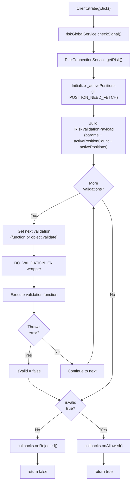
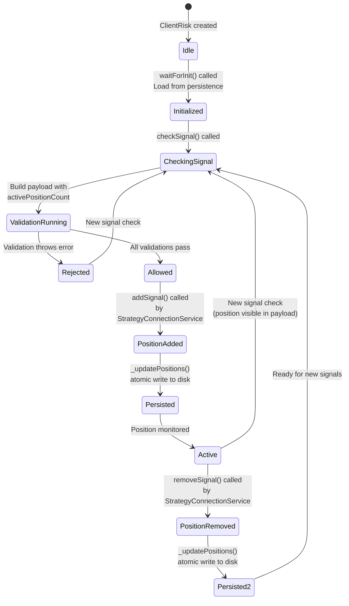
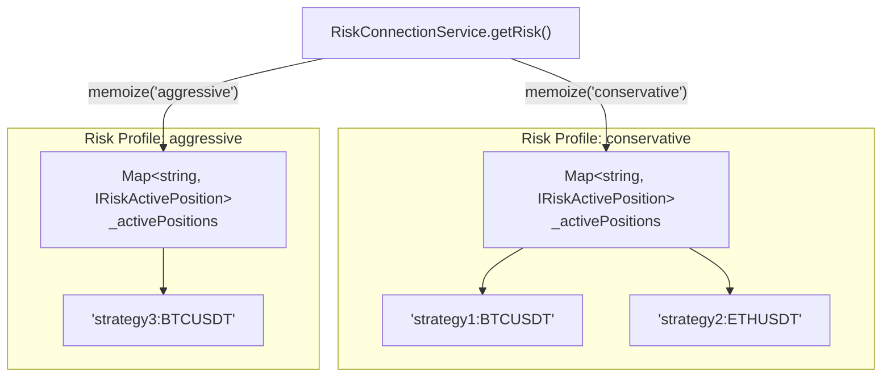
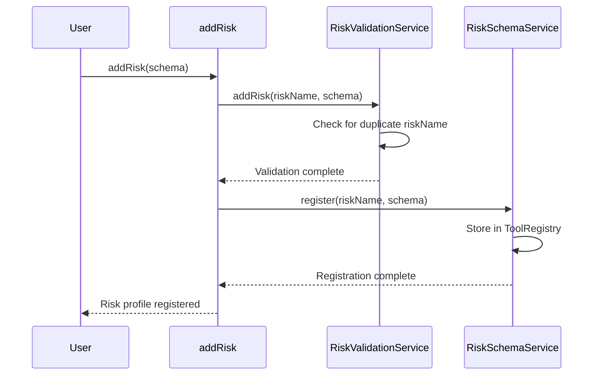
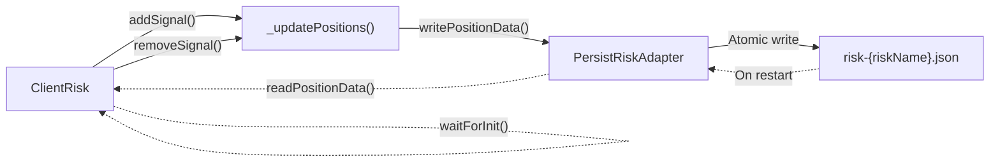
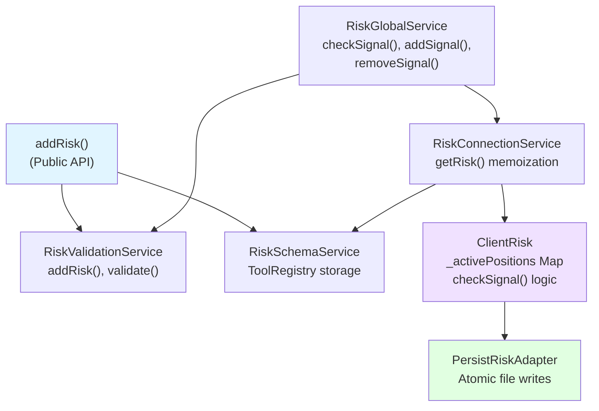

# Risk Schemas

<details>
<summary>Relevant source files</summary>

The following files were used as context for generating this wiki page:

- [demo/backtest/package-lock.json](demo/backtest/package-lock.json)
- [demo/backtest/package.json](demo/backtest/package.json)
- [demo/backtest/src/index.mjs](demo/backtest/src/index.mjs)
- [demo/live/package-lock.json](demo/live/package-lock.json)
- [demo/live/package.json](demo/live/package.json)
- [demo/live/src/index.mjs](demo/live/src/index.mjs)
- [demo/optimization/package-lock.json](demo/optimization/package-lock.json)
- [demo/optimization/package.json](demo/optimization/package.json)
- [package-lock.json](package-lock.json)
- [package.json](package.json)
- [src/config/emitters.ts](src/config/emitters.ts)
- [src/function/event.ts](src/function/event.ts)
- [src/index.ts](src/index.ts)
- [types.d.ts](types.d.ts)

</details>


This document describes the risk management schema system in backtest-kit. Risk schemas define portfolio-level risk controls that prevent signals from violating configured limits. Multiple strategies can share the same risk profile, enabling cross-strategy risk analysis.

The `IRiskSchema` interface specifies four core fields: `riskName` (unique identifier), `validations` (array of validation functions), `callbacks` (lifecycle event hooks), and optional `note` (documentation). Position limits like maximum concurrent positions are implemented as custom validation functions, not as direct schema fields.

For information about strategy schemas (which reference risk schemas), see page 5.1. For information about the `ClientRisk` implementation that executes risk logic, see page 6.4.

---

## Purpose and Scope

Risk schemas provide portfolio-level risk management by:

- **Cross-strategy position tracking**: Track active positions across all strategies sharing the same risk profile via `activePositionCount` and `activePositions` in validation payload
- **Custom validation logic**: Execute user-defined validation functions with access to portfolio state via `IRiskValidationPayload`
- **Flexible constraints**: Enforce position limits, symbol restrictions, risk-reward ratios, and other business rules through validation functions
- **Risk isolation**: Each risk profile maintains independent position tracking via memoized `ClientRisk` instances

Risk schemas are registered via `addRisk()` and referenced by strategies via the `riskName` or `riskList` fields in `IStrategySchema`. The validation functions throw errors to reject signals or return normally to allow them.

**Sources**: [src/interfaces/Risk.interface.ts:87-100](), [types.d.ts:414-426](), [src/function/add.ts:268-341]()

---

## Schema Structure

### IRiskSchema Interface

```mermaid
classDiagram
    class IRiskSchema {
        +RiskName riskName
        +string? note
        +(IRiskValidation or IRiskValidationFn)[] validations
        +Partial~IRiskCallbacks~? callbacks
    }
    
    class IRiskValidation {
        +IRiskValidationFn validate
        +string? note
    }
    
    class IRiskValidationFn {
        <<interface>>
        (payload: IRiskValidationPayload): void or Promise~void~
    }
    
    class IRiskCallbacks {
        +onRejected(symbol: string, params: IRiskCheckArgs): void
        +onAllowed(symbol: string, params: IRiskCheckArgs): void
    }
    
    class IRiskValidationPayload {
        +string symbol
        +ISignalDto pendingSignal
        +StrategyName strategyName
        +ExchangeName exchangeName
        +number currentPrice
        +number timestamp
        +number activePositionCount
        +IRiskActivePosition[] activePositions
    }
    
    class IRiskCheckArgs {
        +string symbol
        +ISignalDto pendingSignal
        +StrategyName strategyName
        +ExchangeName exchangeName
        +number currentPrice
        +number timestamp
    }
    
    class IRiskActivePosition {
        +ISignalRow signal
        +string strategyName
        +string exchangeName
        +number openTimestamp
    }
    
    IRiskSchema --> IRiskValidation
    IRiskSchema --> IRiskValidationFn
    IRiskSchema --> IRiskCallbacks
    IRiskValidation --> IRiskValidationFn
    IRiskValidationFn --> IRiskValidationPayload
    IRiskValidationPayload --|> IRiskCheckArgs
    IRiskCallbacks --> IRiskCheckArgs
    IRiskValidationPayload --> IRiskActivePosition
```

**Diagram: Risk Schema Type Hierarchy**

The `IRiskSchema` interface consists of:

| Field | Type | Required | Description |
|-------|------|----------|-------------|
| `riskName` | `RiskName` (string) | Yes | Unique identifier for the risk profile |
| `note` | `string` | No | Optional developer documentation for the risk profile |
| `validations` | `(IRiskValidation \| IRiskValidationFn)[]` | Yes | Array of validation functions (direct functions or objects with validate + note) |
| `callbacks` | `Partial<IRiskCallbacks>` | No | Optional lifecycle event hooks (`onRejected`, `onAllowed`) |

**Key Points**:
- Validations can be provided as functions directly or as objects with `validate` function and `note` documentation
- All validations receive `IRiskValidationPayload` with portfolio state (`activePositionCount`, `activePositions`)
- Throwing an error in any validation function rejects the signal
- Both callback functions receive `IRiskCheckArgs` (without portfolio state additions)

**Sources**: [src/interfaces/Risk.interface.ts:87-100](), [types.d.ts:414-426](), [types.d.ts:338-397]()

---

## Validation Functions

### Validation Types

Risk validations can be provided in two forms:

**1. Function form** (direct validation function):
```typescript
addRisk({
  riskName: "my-risk",
  validations: [
    async ({ activePositionCount }) => {
      if (activePositionCount >= 5) {
        throw new Error("Max 5 positions");
      }
    }
  ]
});
```

**2. Object form** (with documentation):
```typescript
addRisk({
  riskName: "my-risk",
  validations: [
    {
      validate: async ({ activePositionCount }) => {
        if (activePositionCount >= 5) {
          throw new Error("Max 5 positions");
        }
      },
      note: "Limit concurrent positions to 5"
    }
  ]
});
```

**Sources**: [src/interfaces/Risk.interface.ts:62-85](), [test/spec/risk.test.mjs:209-247]()

### IRiskValidationPayload

Validation functions receive a payload with all risk check context:

| Field | Type | Description |
|-------|------|-------------|
| `symbol` | `string` | Trading pair (e.g., "BTCUSDT") |
| `pendingSignal` | `ISignalDto` | Signal attempting to open (priceOpen, priceTakeProfit, priceStopLoss, position, etc.) |
| `strategyName` | `StrategyName` | Strategy requesting position |
| `exchangeName` | `ExchangeName` | Exchange name |
| `currentPrice` | `number` | Current VWAP price |
| `timestamp` | `number` | Current timestamp in milliseconds |
| `activePositionCount` | `number` | Number of active positions across all strategies using this risk profile |
| `activePositions` | `IRiskActivePosition[]` | List of all active positions with full details |

**Portfolio State Access**:
- The `activePositions` array provides access to all currently open positions across all strategies sharing this risk profile
- Each `IRiskActivePosition` entry includes the signal details, strategy name, exchange name, and open timestamp
- The `activePositionCount` is simply `activePositions.length` for convenience
- The `pendingSignal` contains the signal attempting to open, allowing price/position validation

**Sources**: [src/interfaces/Risk.interface.ts:52-60](), [types.d.ts:379-391](), [types.d.ts:338-356]()

### Validation Execution Flow



**Diagram: Risk Validation Execution Flow**

Validation execution follows this pattern:

1. **Initialization**: Load active positions from persistence if needed ([src/client/ClientRisk.ts:88-96]())
2. **Payload Construction**: Combine check args with portfolio state ([src/client/ClientRisk.ts:177-181]())
3. **Sequential Validation**: Execute each validation in order ([src/client/ClientRisk.ts:186-201]())
4. **Error Handling**: Wrapped by `DO_VALIDATION_FN` with automatic error catching ([src/client/ClientRisk.ts:31-46]())
5. **Early Exit**: Stop on first validation failure
6. **Callback Invocation**: Trigger `onRejected` or `onAllowed` based on result

**Sources**: [src/client/ClientRisk.ts:165-217](), [src/lib/services/global/RiskGlobalService.ts:51-61]()

---

## Position Tracking

### Active Position Map

ClientRisk maintains a `Map<string, IRiskActivePosition>` to track active positions across all strategies:

```typescript
// Key format: `${strategyName}:${symbol}`
// Example: "my-strategy:BTCUSDT"
_activePositions: Map<string, IRiskActivePosition>
```

The map stores position metadata without full signal details:

```typescript
interface IRiskActivePosition {
  signal: ISignalRow;        // Signal details (set to null in practice)
  strategyName: string;      // Strategy that opened position
  exchangeName: string;      // Exchange name (empty in practice)
  openTimestamp: number;     // Timestamp when position opened
}
```

**Sources**: [src/client/ClientRisk.ts:20-28](), [src/interfaces/Risk.interface.ts:23-35]()

### Position Lifecycle



**Diagram: Position Tracking Lifecycle**

Position tracking operations:

1. **addSignal()**: Called by `StrategyConnectionService` after signal opens ([src/client/ClientRisk.ts:107-128]())
   - Generates key: `GET_KEY_FN(strategyName, symbol)`
   - Adds entry to `_activePositions` Map
   - Persists updated Map to disk via `_updatePositions()`

2. **removeSignal()**: Called when signal closes ([src/client/ClientRisk.ts:134-150]())
   - Uses same key generation for lookup
   - Removes entry from Map
   - Persists updated Map to disk

3. **checkSignal()**: Exposes position count and list to validations ([src/client/ClientRisk.ts:165-217]())
   - Provides `activePositionCount = riskMap.size`
   - Provides `activePositions = Array.from(riskMap.values())`

**Sources**: [src/client/ClientRisk.ts:73-150](), [src/lib/services/connection/StrategyConnectionService.ts:1-300]()

### Risk Isolation

Each `riskName` maintains independent position tracking:



**Diagram: Risk Profile Isolation via Memoization**

Each risk profile gets its own `ClientRisk` instance via memoization in `RiskConnectionService.getRisk()`. The memoization key is the `riskName`, ensuring complete isolation between risk profiles.

**Sources**: [src/lib/services/connection/RiskConnectionService.ts:56-65](), [test/spec/risk.test.mjs:374-437]()

---

## Callbacks

### IRiskCallbacks Interface

```typescript
interface IRiskCallbacks {
  /** Called when signal rejected due to risk limits */
  onRejected: (symbol: string, params: IRiskCheckArgs) => void;
  
  /** Called when signal passes risk checks */
  onAllowed: (symbol: string, params: IRiskCheckArgs) => void;
}
```

Callbacks are invoked after all validations complete:

- **onRejected**: Called when any validation throws an error ([src/client/ClientRisk.ts:203-208]())
- **onAllowed**: Called when all validations pass ([src/client/ClientRisk.ts:212-214]())

Both callbacks receive the original `IRiskCheckArgs` (without portfolio state additions).

**Example usage**:
```typescript
addRisk({
  riskName: "monitored-risk",
  validations: [
    ({ activePositionCount }) => {
      if (activePositionCount >= 3) {
        throw new Error("Max 3 positions");
      }
    }
  ],
  callbacks: {
    onRejected: (symbol, params) => {
      console.log(`[RISK REJECTED] ${symbol} by ${params.strategyName}`);
    },
    onAllowed: (symbol, params) => {
      console.log(`[RISK ALLOWED] ${symbol} by ${params.strategyName}`);
    }
  }
});
```

**Sources**: [src/interfaces/Risk.interface.ts:39-49](), [test/spec/risk.test.mjs:41-93]()

---

## Registration and Usage

### Registration via addRisk()



**Diagram: Risk Schema Registration Flow**

The `addRisk()` function performs two operations:

1. **Validation**: Ensures no duplicate `riskName` exists ([src/function/add.ts:332-336]())
2. **Storage**: Registers schema in `RiskSchemaService` ([src/function/add.ts:337-340]())

**Example registration**:
```typescript
import { addRisk } from "backtest-kit";

addRisk({
  riskName: "conservative",
  note: "Conservative risk management with tight position limits",
  validations: [
    {
      validate: ({ activePositionCount }) => {
        if (activePositionCount >= 5) {
          throw new Error("Maximum 5 concurrent positions allowed");
        }
      },
      note: "Limit concurrent positions to 5"
    },
    ({ symbol }) => {
      if (symbol === "DOGEUSDT") {
        throw new Error("DOGE trading not allowed");
      }
    }
  ],
  callbacks: {
    onRejected: (symbol, params) => {
      console.log(`Risk rejected signal for ${symbol}`);
    },
    onAllowed: (symbol, params) => {
      console.log(`Risk allowed signal for ${symbol}`);
    }
  }
});
```

**Sources**: [src/function/add.ts:268-341](), [test/spec/risk.test.mjs:9-18]()

### Referencing from Strategies

Strategies reference risk profiles via the `riskName` field:

```typescript
import { addStrategy, addRisk } from "backtest-kit";

// Register risk profile first
addRisk({
  riskName: "my-risk",
  validations: [
    ({ activePositionCount }) => {
      if (activePositionCount >= 3) {
        throw new Error("Max 3 positions");
      }
    }
  ]
});

// Reference from strategy
addStrategy({
  strategyName: "my-strategy",
  interval: "5m",
  riskName: "my-risk",  // Reference the risk profile
  getSignal: async (symbol) => {
    // Strategy logic...
    return {
      position: "long",
      priceTakeProfit: 51000,
      priceStopLoss: 49000,
      minuteEstimatedTime: 60
    };
  }
});
```

Multiple strategies can share the same risk profile, enabling cross-strategy position limits.

**Sources**: [src/interfaces/Strategy.interface.ts:613-633](), [test/e2e/risk.test.mjs:1-500]()

---

## Persistence

### PersistRiskAdapter

Risk position data is persisted to disk in live mode to enable crash recovery:



**Diagram: Risk Position Persistence Flow**

### Persistence Operations

**Write Operation** ([src/client/ClientRisk.ts:93-101]()):
```typescript
private async _updatePositions(): Promise<void> {
  if (this._activePositions === POSITION_NEED_FETCH) {
    await this.waitForInit();
  }
  await PersistRiskAdapter.writePositionData(
    Array.from(<RiskMap>this._activePositions),  // Convert Map to Array
    this.params.riskName
  );
}
```

**Read Operation** ([src/client/ClientRisk.ts:53-59]()):
```typescript
export const WAIT_FOR_INIT_FN = async (self: ClientRisk): Promise<void> => {
  self.params.logger.debug("ClientRisk waitForInit");
  const persistedPositions = await PersistRiskAdapter.readPositionData(
    self.params.riskName
  );
  self._activePositions = new Map(persistedPositions);  // Convert Array to Map
};
```

### Data Format

Persisted data is stored as an array of tuples:
```typescript
type PersistedPositions = Array<[
  string,                    // Key: "${strategyName}:${symbol}"
  IRiskActivePosition        // Position metadata
]>
```

This format allows direct conversion to/from the internal `Map<string, IRiskActivePosition>` structure.

**Sources**: [src/client/ClientRisk.ts:53-101](), [src/classes/Persist.ts:1-400](), [test/spec/risk.test.mjs:498-841]()

---

## Service Architecture



**Diagram: Risk Management Service Architecture**

The risk system follows the standard service layer pattern:

| Layer | Class | Responsibility |
|-------|-------|----------------|
| **Public API** | `addRisk()` | Schema registration entry point |
| **Validation** | `RiskValidationService` | Duplicate checking, schema validation |
| **Schema Storage** | `RiskSchemaService` | ToolRegistry-based schema storage |
| **Global Service** | `RiskGlobalService` | Public API for risk operations |
| **Connection** | `RiskConnectionService` | Memoized ClientRisk instance management |
| **Client** | `ClientRisk` | Business logic: position tracking, validation execution |
| **Persistence** | `PersistRiskAdapter` | Crash-safe file writes for live mode |

**Sources**: [src/function/add.ts:329-341](), [src/lib/services/global/RiskGlobalService.ts:1-117](), [src/lib/services/connection/RiskConnectionService.ts:1-138](), [src/client/ClientRisk.ts:1-221]()

---

## Common Validation Patterns

### Maximum Concurrent Positions

```typescript
addRisk({
  riskName: "max-positions",
  validations: [
    ({ activePositionCount }) => {
      if (activePositionCount >= 5) {
        throw new Error("Maximum 5 concurrent positions allowed");
      }
    }
  ]
});
```

### Symbol Filtering

```typescript
addRisk({
  riskName: "symbol-filter",
  validations: [
    ({ symbol }) => {
      const blacklist = ["DOGEUSDT", "SHIBUSDT"];
      if (blacklist.includes(symbol)) {
        throw new Error(`Trading ${symbol} not allowed`);
      }
    }
  ]
});
```

### Portfolio Exposure Limits

```typescript
addRisk({
  riskName: "exposure-limits",
  validations: [
    ({ activePositions, symbol }) => {
      const symbolPositions = activePositions.filter(
        pos => pos.signal.symbol === symbol
      );
      if (symbolPositions.length >= 2) {
        throw new Error(`Max 2 positions per symbol`);
      }
    }
  ]
});
```

### Strategy-Specific Limits

```typescript
addRisk({
  riskName: "strategy-limits",
  validations: [
    ({ activePositions, strategyName }) => {
      const strategyPositions = activePositions.filter(
        pos => pos.strategyName === strategyName
      );
      if (strategyPositions.length >= 3) {
        throw new Error(`Strategy ${strategyName} has max 3 positions`);
      }
    }
  ]
});
```

**Sources**: [test/spec/risk.test.mjs:41-373](), [src/function/add.ts:268-328]()