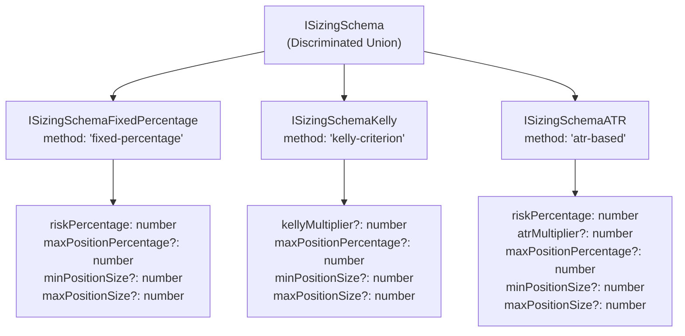
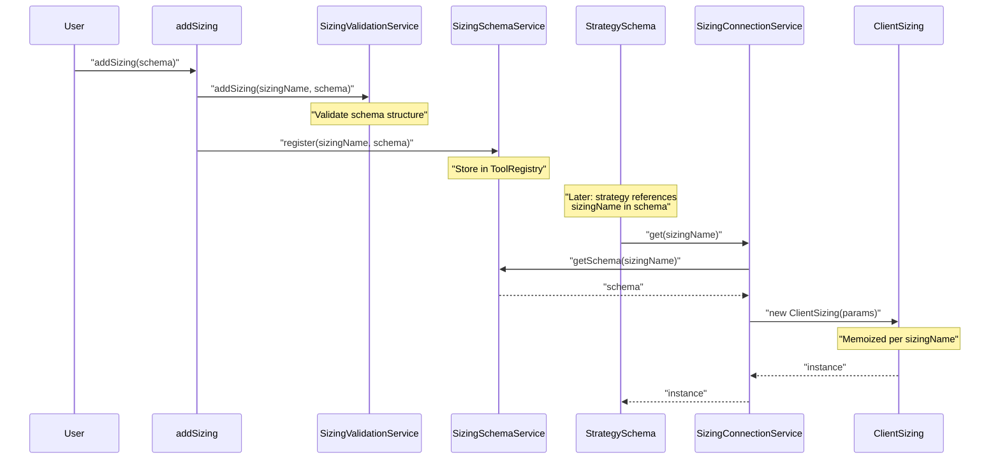
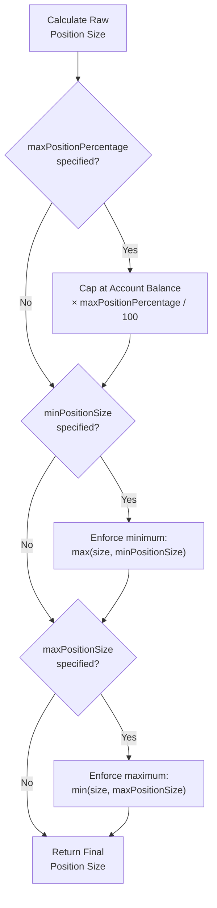
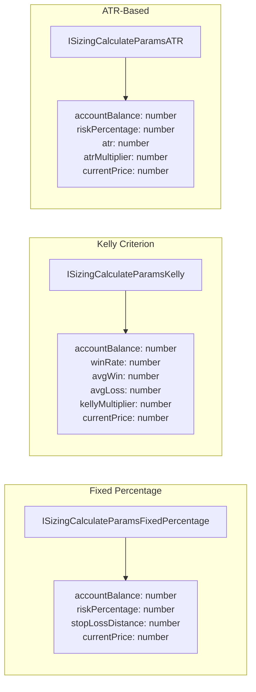
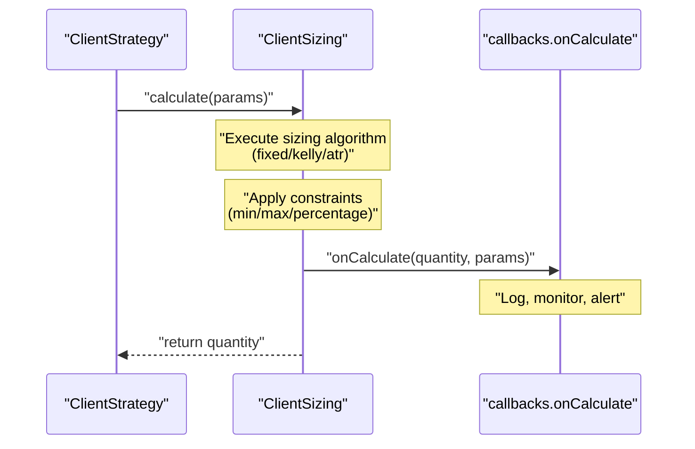
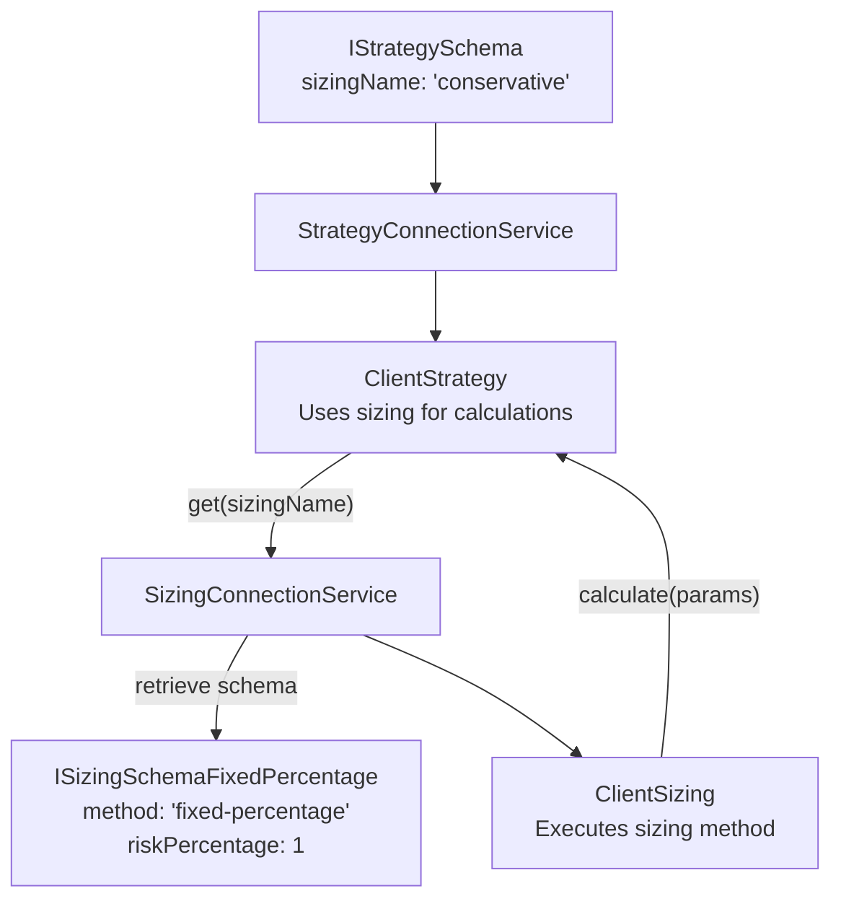
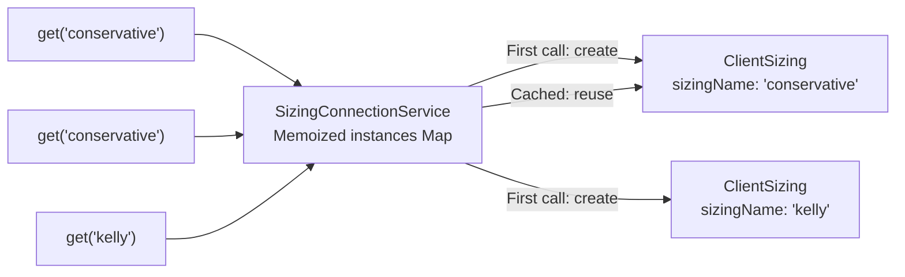

# Sizing Schemas

<details>
<summary>Relevant source files</summary>

The following files were used as context for generating this wiki page:

- [README.md](README.md)
- [src/client/ClientStrategy.ts](src/client/ClientStrategy.ts)
- [src/interfaces/Strategy.interface.ts](src/interfaces/Strategy.interface.ts)
- [src/lib/services/markdown/BacktestMarkdownService.ts](src/lib/services/markdown/BacktestMarkdownService.ts)
- [src/lib/services/markdown/LiveMarkdownService.ts](src/lib/services/markdown/LiveMarkdownService.ts)
- [src/lib/services/markdown/ScheduleMarkdownService.ts](src/lib/services/markdown/ScheduleMarkdownService.ts)
- [types.d.ts](types.d.ts)

</details>


Sizing schemas define position sizing methods for calculating trade quantities based on account balance, risk parameters, and market conditions. The framework provides three built-in sizing methods via a discriminated union: fixed-percentage, Kelly Criterion, and ATR-based. Strategies reference sizing schemas by name via the `sizingName` field in `IStrategySchema`.

For information about how strategies reference sizing, see [Strategy Schemas](#5.1). For risk management that controls whether positions are allowed, see [Risk Schemas](#5.4).

**Sources:** [types.d.ts:202-267](), [src/function/add.ts:202-266]()

---

## Discriminated Union Architecture

The `ISizingSchema` type is a discriminated union using the `method` field as the discriminator. Each method has specific required and optional parameters suited to its calculation algorithm.



**Sources:** [types.d.ts:59-70](), [src/index.ts:58-70]()

---

## Schema Registration Flow

Sizing schemas are registered via `addSizing()`, which stores them in `SizingSchemaService` and validates them through `SizingValidationService`. Strategies reference sizing configurations by name, triggering lazy instantiation of `ClientSizing` via `SizingConnectionService`.



**Sources:** [src/function/add.ts:254-266](), [src/lib/index.ts:72-77]()

---

## Fixed Percentage Sizing

Fixed percentage sizing risks a constant percentage of account balance per trade. Position size is calculated as:

```
Position Size = (Account Balance × Risk Percentage) / Distance to Stop Loss
```

### Schema Structure

| Field | Type | Required | Description |
|-------|------|----------|-------------|
| `sizingName` | `string` | Yes | Unique identifier for this sizing configuration |
| `method` | `"fixed-percentage"` | Yes | Discriminator for fixed percentage method |
| `riskPercentage` | `number` | Yes | Percentage of account balance to risk per trade |
| `maxPositionPercentage` | `number` | No | Maximum position size as percentage of account (default: no limit) |
| `minPositionSize` | `number` | No | Minimum position size (default: no limit) |
| `maxPositionSize` | `number` | No | Maximum position size (default: no limit) |
| `callbacks` | `Partial<ISizingCallbacks>` | No | Optional lifecycle callbacks |
| `note` | `string` | No | Optional developer documentation |

### Example

```typescript
addSizing({
  sizingName: "conservative",
  method: "fixed-percentage",
  riskPercentage: 1, // Risk 1% per trade
  maxPositionPercentage: 10, // Max 10% of account per position
  minPositionSize: 0.001, // Minimum 0.001 BTC
  callbacks: {
    onCalculate: (quantity, params) => {
      console.log(`Position size: ${quantity} for ${params.symbol}`);
    },
  },
});
```

**Sources:** [src/function/add.ts:223-231](), [types.d.ts:202-266]()

---

## Kelly Criterion Sizing

Kelly Criterion sizing calculates optimal position size based on win probability and win/loss ratio using the Kelly formula:

```
Kelly % = (Win Rate × Avg Win) / Avg Loss - (1 - Win Rate)
Position Size = Account Balance × Kelly % × Kelly Multiplier
```

The `kellyMultiplier` (default: 0.25) reduces the Kelly percentage to manage risk, as full Kelly can be aggressive.

### Schema Structure

| Field | Type | Required | Description |
|-------|------|----------|-------------|
| `sizingName` | `string` | Yes | Unique identifier for this sizing configuration |
| `method` | `"kelly-criterion"` | Yes | Discriminator for Kelly Criterion method |
| `kellyMultiplier` | `number` | No | Multiplier to reduce Kelly percentage (default: 0.25) |
| `maxPositionPercentage` | `number` | No | Maximum position size as percentage of account (default: no limit) |
| `minPositionSize` | `number` | No | Minimum position size (default: no limit) |
| `maxPositionSize` | `number` | No | Maximum position size (default: no limit) |
| `callbacks` | `Partial<ISizingCallbacks>` | No | Optional lifecycle callbacks |
| `note` | `string` | No | Optional developer documentation |

### Example

```typescript
addSizing({
  sizingName: "kelly-quarter",
  method: "kelly-criterion",
  kellyMultiplier: 0.25, // Use quarter Kelly (conservative)
  maxPositionPercentage: 20, // Max 20% of account
  callbacks: {
    onCalculate: (quantity, params) => {
      console.log(`Kelly size: ${quantity} (win rate: ${params.winRate})`);
    },
  },
});
```

**Sources:** [src/function/add.ts:233-238](), [types.d.ts:202-266]()

---

## ATR-Based Sizing

ATR-based sizing uses Average True Range to dynamically adjust position size based on market volatility. Position size is calculated as:

```
Position Size = (Account Balance × Risk Percentage) / (ATR × ATR Multiplier)
```

Higher ATR (more volatile markets) results in smaller position sizes to maintain consistent risk.

### Schema Structure

| Field | Type | Required | Description |
|-------|------|----------|-------------|
| `sizingName` | `string` | Yes | Unique identifier for this sizing configuration |
| `method` | `"atr-based"` | Yes | Discriminator for ATR-based method |
| `riskPercentage` | `number` | Yes | Percentage of account balance to risk per trade |
| `atrMultiplier` | `number` | No | Multiplier for ATR value (default: 2) |
| `maxPositionPercentage` | `number` | No | Maximum position size as percentage of account (default: no limit) |
| `minPositionSize` | `number` | No | Minimum position size (default: no limit) |
| `maxPositionSize` | `number` | No | Maximum position size (default: no limit) |
| `callbacks` | `Partial<ISizingCallbacks>` | No | Optional lifecycle callbacks |
| `note` | `string` | No | Optional developer documentation |

### Example

```typescript
addSizing({
  sizingName: "atr-dynamic",
  method: "atr-based",
  riskPercentage: 2, // Risk 2% per trade
  atrMultiplier: 2, // Stop loss at 2× ATR
  maxPositionPercentage: 15,
  callbacks: {
    onCalculate: (quantity, params) => {
      console.log(`ATR size: ${quantity} (ATR: ${params.atr})`);
    },
  },
});
```

**Sources:** [src/function/add.ts:240-252](), [types.d.ts:202-266]()

---

## Position Size Constraints

All sizing methods support optional position size constraints to enforce portfolio-level limits:



### Constraint Parameters

| Parameter | Type | Purpose |
|-----------|------|---------|
| `maxPositionPercentage` | `number` | Maximum position as % of account balance (prevents over-concentration) |
| `minPositionSize` | `number` | Minimum position size in base asset (prevents dust trades) |
| `maxPositionSize` | `number` | Maximum position size in base asset (absolute limit) |

**Sources:** [types.d.ts:202-266]()

---

## Calculation Parameters Flow

When calculating position size, `ClientSizing` receives method-specific parameters through the discriminated union `ISizingCalculateParams`:



**Sources:** [types.d.ts:59-70]()

---

## Sizing Callbacks

The `ISizingCallbacks` interface provides lifecycle hooks for monitoring sizing calculations:

```typescript
interface ISizingCallbacks {
  onCalculate: (
    quantity: number, 
    params: ISizingCalculateParams
  ) => void;
}
```

### Callback Invocation



**Sources:** [types.d.ts:202-266]()

---

## Integration with Strategy Schemas

Strategies reference sizing schemas via the optional `sizingName` field. If omitted, no position sizing is applied (strategy must manage quantities manually).

### Strategy Schema Reference

```typescript
addStrategy({
  strategyName: "my-strategy",
  interval: "5m",
  sizingName: "conservative", // References sizing schema
  getSignal: async (symbol) => ({
    position: "long",
    priceTakeProfit: 51000,
    priceStopLoss: 49000,
    minuteEstimatedTime: 60,
    // No quantity specified - calculated by sizing
  }),
});
```

### Service Interaction



**Sources:** [types.d.ts:616-633](), [src/lib/index.ts:1-170]()

---

## Service Layer Components

The sizing system follows the standard service layer pattern with Schema, Validation, Connection, and Client services:

| Service | File Pattern | Responsibility |
|---------|--------------|----------------|
| `SizingSchemaService` | `services/schema/SizingSchemaService` | Stores sizing schemas in `ToolRegistry` by `sizingName` |
| `SizingValidationService` | `services/validation/SizingValidationService` | Validates sizing schemas during registration |
| `SizingConnectionService` | `services/connection/SizingConnectionService` | Memoizes `ClientSizing` instances (one per `sizingName`) |
| `ClientSizing` | `classes/ClientSizing` | Executes sizing algorithms and applies constraints |

### Memoization Pattern

`SizingConnectionService` memoizes `ClientSizing` instances to ensure singleton behavior per sizing name:



**Sources:** [src/lib/index.ts:72-77](), [src/lib/core/types.ts:14-16](), [src/lib/core/provide.ts:57-58]()

---

## Listing Registered Sizing Schemas

The `listSizings()` function retrieves all registered sizing schemas for inspection or debugging:

```typescript
import { listSizings } from "backtest-kit";

const sizings = await listSizings();

sizings.forEach(schema => {
  console.log(`${schema.sizingName}: ${schema.method}`);
  
  if (schema.method === "fixed-percentage") {
    console.log(`  Risk: ${schema.riskPercentage}%`);
  } else if (schema.method === "kelly-criterion") {
    console.log(`  Multiplier: ${schema.kellyMultiplier || 0.25}`);
  } else if (schema.method === "atr-based") {
    console.log(`  Risk: ${schema.riskPercentage}%, ATR: ${schema.atrMultiplier || 2}×`);
  }
});
```

**Sources:** [src/function/list.ts:177-180]()

---

## Complete Registration Examples

### Conservative Fixed Percentage

```typescript
addSizing({
  sizingName: "conservative-fixed",
  note: "Low risk fixed percentage for stable strategies",
  method: "fixed-percentage",
  riskPercentage: 1,
  maxPositionPercentage: 10,
  minPositionSize: 0.001,
  maxPositionSize: 1,
});
```

### Aggressive Kelly Criterion

```typescript
addSizing({
  sizingName: "aggressive-kelly",
  note: "Half Kelly for high-conviction trades",
  method: "kelly-criterion",
  kellyMultiplier: 0.5, // Half Kelly (more aggressive)
  maxPositionPercentage: 25,
  callbacks: {
    onCalculate: (quantity, params) => {
      if (params.method === "kelly-criterion") {
        console.log(`Win rate: ${params.winRate}, Size: ${quantity}`);
      }
    },
  },
});
```

### Volatility-Adjusted ATR

```typescript
addSizing({
  sizingName: "volatility-adjusted",
  note: "ATR-based sizing for volatile markets",
  method: "atr-based",
  riskPercentage: 2,
  atrMultiplier: 1.5, // Tighter stop loss
  maxPositionPercentage: 15,
  minPositionSize: 0.001,
  callbacks: {
    onCalculate: (quantity, params) => {
      if (params.method === "atr-based") {
        console.log(`ATR: ${params.atr}, Size: ${quantity}`);
      }
    },
  },
});
```

**Sources:** [src/function/add.ts:202-266]()