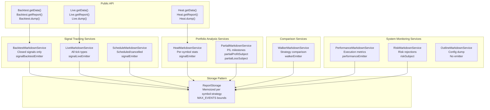
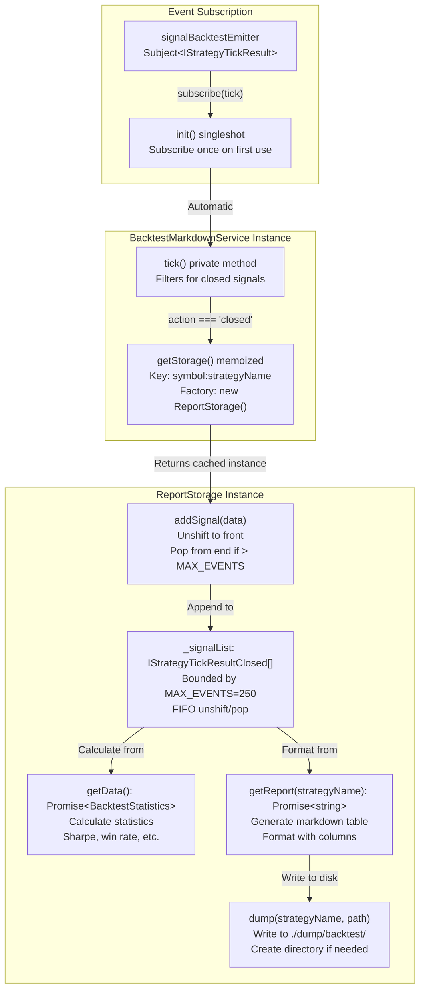
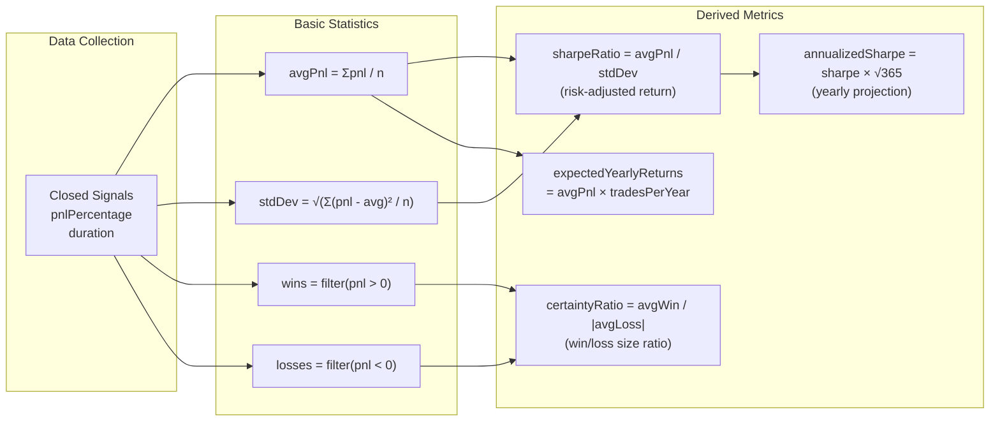
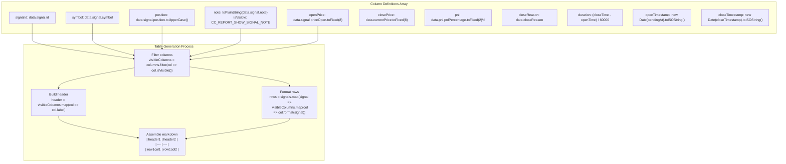
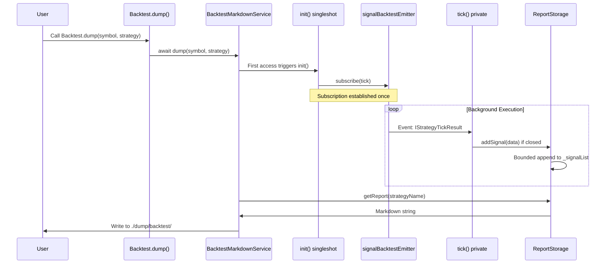
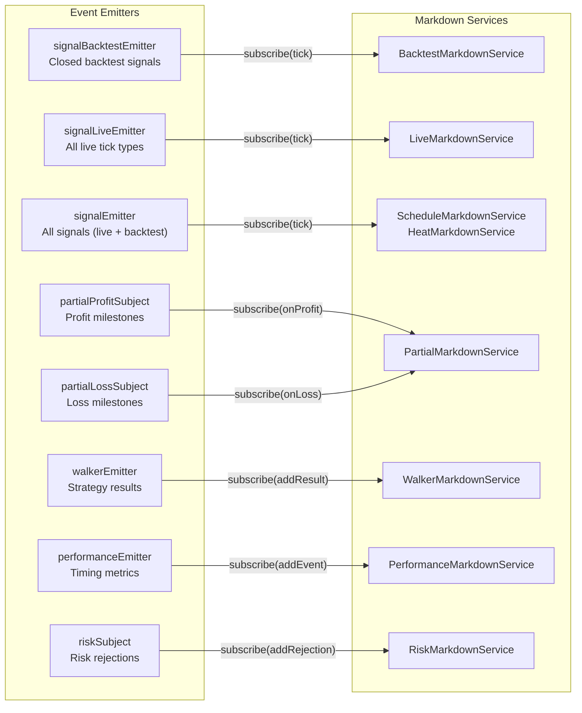
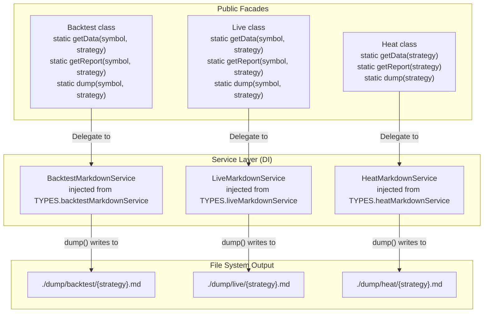
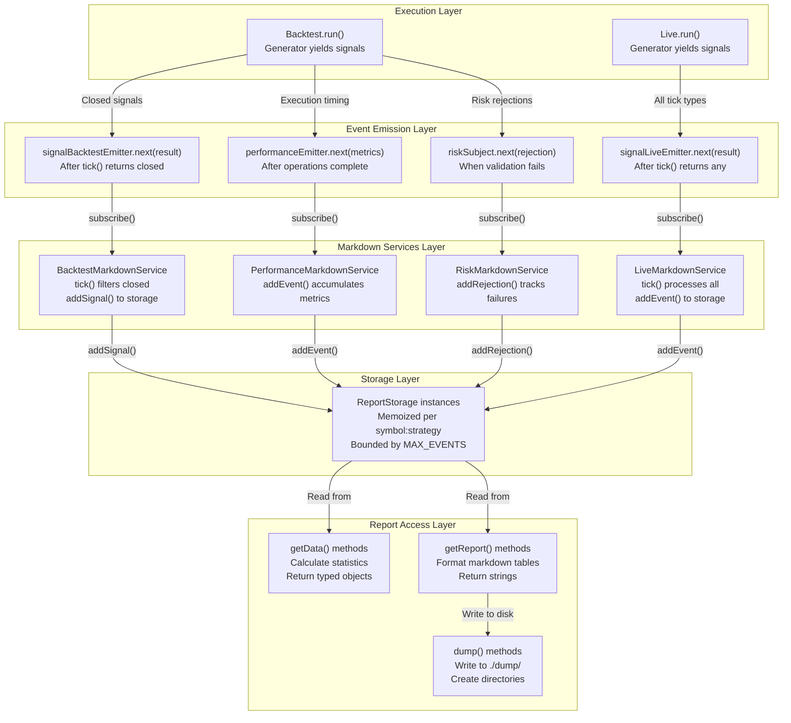

# Reporting and Analytics

# Reporting and Analytics

<details>
<summary>Relevant source files</summary>

The following files were used as context for generating this wiki page:

- [README.md](README.md)
- [src/config/emitters.ts](src/config/emitters.ts)
- [src/function/event.ts](src/function/event.ts)
- [src/index.ts](src/index.ts)
- [src/interfaces/Heatmap.interface.ts](src/interfaces/Heatmap.interface.ts)
- [src/lib/services/markdown/BacktestMarkdownService.ts](src/lib/services/markdown/BacktestMarkdownService.ts)
- [src/lib/services/markdown/HeatMarkdownService.ts](src/lib/services/markdown/HeatMarkdownService.ts)
- [src/lib/services/markdown/LiveMarkdownService.ts](src/lib/services/markdown/LiveMarkdownService.ts)
- [src/lib/services/markdown/PartialMarkdownService.ts](src/lib/services/markdown/PartialMarkdownService.ts)
- [src/lib/services/markdown/PerformanceMarkdownService.ts](src/lib/services/markdown/PerformanceMarkdownService.ts)
- [src/lib/services/markdown/ScheduleMarkdownService.ts](src/lib/services/markdown/ScheduleMarkdownService.ts)
- [src/lib/services/markdown/WalkerMarkdownService.ts](src/lib/services/markdown/WalkerMarkdownService.ts)
- [test/e2e/defend.test.mjs](test/e2e/defend.test.mjs)
- [test/e2e/risk.test.mjs](test/e2e/risk.test.mjs)
- [test/index.mjs](test/index.mjs)
- [test/mock/getMockCandles.mjs](test/mock/getMockCandles.mjs)
- [test/spec/heat.test.mjs](test/spec/heat.test.mjs)
- [test/spec/list.test.mjs](test/spec/list.test.mjs)
- [types.d.ts](types.d.ts)

</details>


The reporting and analytics subsystem provides comprehensive markdown report generation and statistical analysis for trading strategy execution. This page documents the nine markdown service implementations, their data accumulation patterns, statistics calculation methods, and report output formats.

For information about the event system that feeds these services, see [Event-Driven Architecture](./05-event-driven-architecture.md). For details on execution modes that generate reportable events, see [Execution Modes Overview](./04-execution-modes-overview.md).

---

## Overview of Markdown Services

The framework implements nine specialized markdown services, each responsible for tracking and reporting on a specific aspect of strategy execution. All services follow a consistent three-method API pattern: `getData()` for retrieving statistics objects, `getReport()` for generating markdown strings, and `dump()` for writing reports to disk.

### Service Categories



**Sources:** [src/lib/services/markdown/BacktestMarkdownService.ts:1-571](), [src/lib/services/markdown/LiveMarkdownService.ts:1-778](), [src/lib/services/markdown/ScheduleMarkdownService.ts:1-625](), [src/lib/services/markdown/WalkerMarkdownService.ts:1-569](), [src/lib/services/markdown/PerformanceMarkdownService.ts:1-467](), [src/lib/services/markdown/HeatMarkdownService.ts:1-540](), [src/lib/services/markdown/PartialMarkdownService.ts:1-399]()

### Service Summary Table

| Service | Primary Purpose | Event Source | Statistics Interface | MAX_EVENTS |
|---------|----------------|--------------|---------------------|------------|
| `BacktestMarkdownService` | Tracks closed backtest signals | `signalBacktestEmitter` | `BacktestStatistics` | 250 |
| `LiveMarkdownService` | Tracks all live tick events | `signalLiveEmitter` | `LiveStatistics` | 250 |
| `ScheduleMarkdownService` | Tracks scheduled signal lifecycle | `signalEmitter` | `ScheduleStatistics` | 250 |
| `HeatMarkdownService` | Portfolio-wide symbol statistics | `signalEmitter` | `IHeatmapStatistics` | 250 per symbol |
| `PartialMarkdownService` | Profit/loss milestone tracking | `partialProfitSubject`<br/>`partialLossSubject` | `PartialStatistics` | 250 |
| `WalkerMarkdownService` | Strategy comparison results | `walkerEmitter` | `WalkerStatistics` | Unbounded |
| `PerformanceMarkdownService` | Execution timing metrics | `performanceEmitter` | `PerformanceStatistics` | 10000 |
| `RiskMarkdownService` | Risk validation rejections | `riskSubject` | `RiskStatistics` | Unbounded |
| `OutlineMarkdownService` | System configuration dump | N/A (manual) | N/A | N/A |

**Sources:** [types.d.ts:151-157](), [src/config/emitters.ts:1-133]()

---

## ReportStorage Pattern

All markdown services use an internal `ReportStorage` class that implements a bounded queue pattern for memory-safe data accumulation. Each storage instance is memoized per `symbol:strategyName` key to maintain isolated statistics.

### Storage Architecture



**Sources:** [src/lib/services/markdown/BacktestMarkdownService.ts:199-367](), [src/lib/services/markdown/BacktestMarkdownService.ts:396-570]()

### Memoization Key Format

Services use different memoization strategies based on their data isolation requirements:

- **Per symbol-strategy**: `BacktestMarkdownService`, `LiveMarkdownService`, `ScheduleMarkdownService`, `PartialMarkdownService`, `PerformanceMarkdownService` use key `"${symbol}:${strategyName}"`
- **Per strategy**: `WalkerMarkdownService`, `RiskMarkdownService` use key `strategyName`
- **Global**: `HeatMarkdownService` uses key `strategyName` but aggregates across symbols

```typescript
// Example from BacktestMarkdownService
private getStorage = memoize<(symbol: string, strategyName: string) => ReportStorage>(
  ([symbol, strategyName]) => `${symbol}:${strategyName}`,
  () => new ReportStorage()
);
```

**Sources:** [src/lib/services/markdown/BacktestMarkdownService.ts:404-407](), [src/lib/services/markdown/LiveMarkdownService.ts:604-607]()

---

## Statistics Calculation

Each markdown service calculates domain-specific statistics from accumulated event data. All services implement null-safe calculations that return `null` for unsafe values (NaN, Infinity, division by zero).

### Common Metrics Across Services

#### Trading Performance Metrics

The following metrics appear in `BacktestStatistics`, `LiveStatistics`, and per-symbol calculations in `IHeatmapRow`:

| Metric | Formula | Interpretation |
|--------|---------|----------------|
| **Win Rate** | `(winCount / totalTrades) × 100` | Percentage of profitable trades (higher is better) |
| **Average PNL** | `Σ(pnlPercentage) / totalTrades` | Mean profit/loss per trade (higher is better) |
| **Total PNL** | `Σ(pnlPercentage)` | Cumulative profit/loss (higher is better) |
| **Standard Deviation** | `√(Σ(pnl - avgPnl)² / totalTrades)` | Volatility measure (lower is better) |
| **Sharpe Ratio** | `avgPnl / stdDev` | Risk-adjusted return (higher is better) |
| **Annualized Sharpe** | `sharpeRatio × √365` | Yearly risk-adjusted return (higher is better) |
| **Certainty Ratio** | `avgWin / |avgLoss|` | Win size vs loss size (higher is better) |
| **Expected Yearly Returns** | `avgPnl × (365 / avgDurationDays)` | Projected annual return (higher is better) |

**Sources:** [src/lib/services/markdown/BacktestMarkdownService.ts:227-295](), [src/lib/services/markdown/LiveMarkdownService.ts:409-492]()

#### Risk-Adjusted Calculations



**Sources:** [src/lib/services/markdown/BacktestMarkdownService.ts:254-279](), [src/lib/services/markdown/LiveMarkdownService.ts:440-475]()

### Specialized Service Statistics

#### ScheduleMarkdownService Metrics

Tracks scheduled signal activation and cancellation rates:

| Metric | Formula | Purpose |
|--------|---------|---------|
| **Activation Rate** | `(totalOpened / totalScheduled) × 100` | Percentage of scheduled signals that activated |
| **Cancellation Rate** | `(totalCancelled / totalScheduled) × 100` | Percentage of scheduled signals that timed out |
| **Avg Activation Time** | `Σ(pendingAt - scheduledAt) / totalOpened / 60000` | Average minutes until activation |
| **Avg Wait Time** | `Σ(closeTimestamp - scheduledAt) / totalCancelled / 60000` | Average minutes until cancellation |

**Sources:** [src/lib/services/markdown/ScheduleMarkdownService.ts:290-351]()

#### PerformanceMarkdownService Metrics

Provides execution timing analysis per metric type:

| Metric | Calculation | Interpretation |
|--------|-------------|----------------|
| **Count** | Number of events | Invocation frequency |
| **Total Duration** | `Σ(duration)` | Total time spent (ms) |
| **Avg Duration** | `Σ(duration) / count` | Mean execution time (ms) |
| **Std Dev** | `√(Σ(d - avg)² / count)` | Timing consistency |
| **Median** | 50th percentile | Typical execution time |
| **P95 / P99** | 95th / 99th percentile | Worst-case latency |
| **Avg Wait Time** | `Σ(timestamp - previousTimestamp) / count` | Time between events |

**Sources:** [src/lib/services/markdown/PerformanceMarkdownService.ts:228-309]()

#### HeatMarkdownService Portfolio Metrics

Aggregates symbol-level statistics with additional portfolio-wide calculations:

- **Max Drawdown**: Largest peak-to-trough decline calculated from cumulative PNL curve
- **Profit Factor**: `Σ(wins) / |Σ(losses)|` ratio
- **Expectancy**: `(winRate × avgWin) - (lossRate × avgLoss)`
- **Max Win/Loss Streak**: Consecutive winning/losing trades

**Sources:** [src/lib/services/markdown/HeatMarkdownService.ts:180-336]()

---

## Column Configuration System

Each markdown service defines a `Column` interface to configure table generation. Columns are filtered by visibility before rendering, allowing dynamic table layouts based on configuration.

### Column Interface Structure

```typescript
interface Column {
  key: string;           // Unique identifier
  label: string;         // Table header text
  format: (data: T) => string;  // Data formatter
  isVisible: () => boolean;     // Visibility predicate
}
```

**Sources:** [src/lib/services/markdown/BacktestMarkdownService.ts:20-29](), [src/lib/services/markdown/LiveMarkdownService.ts:142-151]()

### Example: BacktestMarkdownService Columns



**Sources:** [src/lib/services/markdown/BacktestMarkdownService.ts:108-194](), [src/lib/services/markdown/BacktestMarkdownService.ts:314-322]()

### Dynamic Visibility Control

The `CC_REPORT_SHOW_SIGNAL_NOTE` configuration parameter controls note column visibility across all services:

```typescript
{
  key: "note",
  label: "Note",
  format: (data) => toPlainString(data.note ?? "N/A"),
  isVisible: () => GLOBAL_CONFIG.CC_REPORT_SHOW_SIGNAL_NOTE,
}
```

**Sources:** [src/lib/services/markdown/BacktestMarkdownService.ts:128-132](), [types.d.ts:108-114]()

---

## Event Subscription and Data Flow

Markdown services initialize lazily using `singleshot()` to subscribe to relevant event emitters only when first accessed. This prevents unnecessary event processing for unused services.

### Initialization Pattern



**Sources:** [src/lib/services/markdown/BacktestMarkdownService.ts:564-567](), [src/lib/services/markdown/LiveMarkdownService.ts:771-774]()

### Service-to-Emitter Mapping



**Sources:** [src/lib/services/markdown/BacktestMarkdownService.ts:566](), [src/lib/services/markdown/LiveMarkdownService.ts:773](), [src/lib/services/markdown/ScheduleMarkdownService.ts:620](), [src/lib/services/markdown/HeatMarkdownService.ts:519](), [src/lib/services/markdown/PartialMarkdownService.ts:363-364](), [src/lib/services/markdown/WalkerMarkdownService.ts:530](), [src/lib/services/markdown/PerformanceMarkdownService.ts:437](), [src/config/emitters.ts:1-133]()

---

## Public API Methods

All markdown services expose three core methods. These are typically accessed through facade classes like `Backtest`, `Live`, `Heat`, etc.

### Method Signatures

#### getData()

Retrieves typed statistics object without generating markdown.

```typescript
// BacktestMarkdownService
public getData = async (
  symbol: string,
  strategyName: StrategyName
): Promise<BacktestStatistics>

// LiveMarkdownService  
public getData = async (
  symbol: string,
  strategyName: StrategyName
): Promise<LiveStatistics>

// HeatMarkdownService (strategy-wide)
public getData = async (
  strategyName: StrategyName
): Promise<IHeatmapStatistics>
```

**Sources:** [src/lib/services/markdown/BacktestMarkdownService.ts:456-462](), [src/lib/services/markdown/LiveMarkdownService.ts:663-670](), [src/lib/services/markdown/HeatMarkdownService.ts:395-403]()

#### getReport()

Generates markdown-formatted report string.

```typescript
public getReport = async (
  symbol: string,
  strategyName: StrategyName
): Promise<string>
```

**Sources:** [src/lib/services/markdown/BacktestMarkdownService.ts:480-486](), [src/lib/services/markdown/LiveMarkdownService.ts:687-694]()

#### dump()

Writes markdown report to file system with automatic directory creation.

```typescript
public dump = async (
  symbol: string,
  strategyName: StrategyName,
  path = "./dump/backtest"  // Default path varies by service
): Promise<void>
```

**Default Paths:**
- `BacktestMarkdownService`: `./dump/backtest`
- `LiveMarkdownService`: `./dump/live`
- `ScheduleMarkdownService`: `./dump/schedule`
- `HeatMarkdownService`: `./dump/heat`
- `PartialMarkdownService`: `./dump/partial`
- `WalkerMarkdownService`: `./dump/walker`
- `PerformanceMarkdownService`: `./dump/performance`
- `RiskMarkdownService`: `./dump/risk`

**Sources:** [src/lib/services/markdown/BacktestMarkdownService.ts:509-521](), [src/lib/services/markdown/LiveMarkdownService.ts:716-728]()

### Facade Access Pattern



**Sources:** [src/classes/Backtest.ts:1-200](), [src/classes/Live.ts:1-200](), [src/classes/Heat.ts:1-150]()

---

## Memory Management and Bounds

Markdown services implement bounded queues using `MAX_EVENTS` constants to prevent unbounded memory growth during long-running executions. Events are stored in FIFO order with `unshift()` for insertion and `pop()` for eviction.

### Bounded Queue Implementation

```typescript
// Example from BacktestMarkdownService ReportStorage
public addSignal(data: IStrategyTickResultClosed) {
  this._signalList.unshift(data);

  // Trim queue if exceeded MAX_EVENTS
  if (this._signalList.length > MAX_EVENTS) {
    this._signalList.pop();
  }
}
```

**Sources:** [src/lib/services/markdown/BacktestMarkdownService.ts:212-219]()

### MAX_EVENTS by Service

| Service | MAX_EVENTS | Scope | Notes |
|---------|-----------|-------|-------|
| `BacktestMarkdownService` | 250 | Per symbol:strategy | Closed signals only |
| `LiveMarkdownService` | 250 | Per symbol:strategy | All tick types (idle replaced) |
| `ScheduleMarkdownService` | 250 | Per symbol:strategy | Scheduled/opened/cancelled |
| `HeatMarkdownService` | 250 | Per symbol within strategy | Signals per symbol |
| `PartialMarkdownService` | 250 | Per symbol:strategy | Profit/loss milestones |
| `PerformanceMarkdownService` | 10000 | Per symbol:strategy | High-frequency timing events |
| `WalkerMarkdownService` | Unbounded | N/A | Complete strategy list needed |
| `RiskMarkdownService` | Unbounded | N/A | All rejections tracked |

**Sources:** [src/lib/services/markdown/BacktestMarkdownService.ts:197](), [src/lib/services/markdown/LiveMarkdownService.ts:258](), [src/lib/services/markdown/ScheduleMarkdownService.ts:187](), [src/lib/services/markdown/HeatMarkdownService.ts:141](), [src/lib/services/markdown/PartialMarkdownService.ts:141](), [src/lib/services/markdown/PerformanceMarkdownService.ts:199]()

### Special Case: LiveMarkdownService Idle Event Replacement

`LiveMarkdownService` implements intelligent idle event consolidation to prevent queue saturation from repetitive idle ticks:

```typescript
public addIdleEvent(currentPrice: number) {
  const newEvent: TickEvent = {
    timestamp: Date.now(),
    action: "idle",
    currentPrice,
  };

  // Find last idle event index
  const lastIdleIndex = this._eventList.findLastIndex(
    (event) => event.action === "idle"
  );

  // Replace last idle if no opened/active events occurred after it
  const canReplaceLastIdle = lastIdleIndex !== -1 &&
    !this._eventList
      .slice(lastIdleIndex + 1)
      .some((event) => event.action === "opened" || event.action === "active");

  if (canReplaceLastIdle) {
    this._eventList[lastIdleIndex] = newEvent;
    return;
  }
  
  // Otherwise append normally
  this._eventList.unshift(newEvent);
  if (this._eventList.length > MAX_EVENTS) {
    this._eventList.pop();
  }
}
```

**Sources:** [src/lib/services/markdown/LiveMarkdownService.ts:274-300]()

---

## Report Output Format

All markdown services generate standardized reports with:
1. Title header (`# Service Report: {strategyName}`)
2. Metadata section (symbol, exchange, frame where applicable)
3. Markdown table with filtered columns
4. Summary statistics section
5. Interpretive notes (e.g., "higher is better" annotations)

### Example: Backtest Report Structure

```markdown
# Backtest Report: my-strategy

| Signal ID | Symbol | Position | Open Price | Close Price | PNL (net) | Close Reason | Duration (min) | Open Time | Close Time |
| --- | --- | --- | --- | --- | --- | --- | --- | --- | --- |
| abc-123 | BTCUSDT | LONG | 42000.00000000 USD | 43000.00000000 USD | +2.38% | take_profit | 45 | 2024-01-01T00:00:00.000Z | 2024-01-01T00:45:00.000Z |

**Total signals:** 100
**Closed signals:** 100
**Win rate:** 65.00% (65W / 35L) (higher is better)
**Average PNL:** +1.25% (higher is better)
**Total PNL:** +125.00% (higher is better)
**Standard Deviation:** 2.345% (lower is better)
**Sharpe Ratio:** 0.533 (higher is better)
**Annualized Sharpe Ratio:** 10.181 (higher is better)
**Certainty Ratio:** 1.850 (higher is better)
**Expected Yearly Returns:** +456.25% (higher is better)
```

**Sources:** [src/lib/services/markdown/BacktestMarkdownService.ts:303-339]()

### Example: Walker Comparison Report

```markdown
# Walker Comparison Report: my-walker

**Symbol:** BTCUSDT
**Exchange:** binance
**Frame:** 1d-backtest
**Optimization Metric:** sharpeRatio
**Strategies Tested:** 5

## Best Strategy: strategy-alpha

**Best sharpeRatio:** 0.85
**Total Signals:** 120

## Strategy Comparison (Top 10)

| Rank | Strategy | sharpeRatio | Total Signals | Win Rate | Avg PNL | Total PNL | Sharpe Ratio | Std Dev |
| --- | --- | --- | --- | --- | --- | --- | --- | --- |
| 1 | strategy-alpha | 0.85 | 120 | 68.33% | +1.40% | +168.00% | 0.850 | 1.647% |
| 2 | strategy-beta | 0.72 | 115 | 63.48% | +1.20% | +138.00% | 0.720 | 1.667% |

## PNL Table (All Signals)

| Strategy | Signal ID | Symbol | Position | PNL (net) | Close Reason | Open Time | Close Time |
| --- | --- | --- | --- | --- | --- | --- | --- |
| strategy-alpha | xyz-789 | BTCUSDT | LONG | +2.50% | take_profit | 2024-01-01T00:00:00.000Z | 2024-01-01T01:00:00.000Z |
```

**Sources:** [src/lib/services/markdown/WalkerMarkdownService.ts:430-500]()

---

## Clear API for Data Reset

All markdown services provide a `clear()` method to reset accumulated data. This is primarily used in testing to ensure test isolation, but can also be used to reset statistics during live execution.

### Clear Method Signature

```typescript
public clear = async (ctx?: { 
  symbol: string; 
  strategyName: StrategyName 
}) => {
  if (ctx) {
    const key = `${ctx.symbol}:${ctx.strategyName}`;
    this.getStorage.clear(key);
  } else {
    this.getStorage.clear();
  }
}
```

**Behavior:**
- **With context**: Clears only the specified symbol:strategy pair
- **Without context**: Clears all accumulated data across all keys

**Sources:** [src/lib/services/markdown/BacktestMarkdownService.ts:541-551](), [src/lib/services/markdown/LiveMarkdownService.ts:748-758]()

---

## Integration with Execution Pipeline



**Sources:** [src/lib/services/markdown/BacktestMarkdownService.ts:428-439](), [src/lib/services/markdown/LiveMarkdownService.ts:630-646](), [src/lib/services/markdown/PerformanceMarkdownService.ts:410-419](), [src/config/emitters.ts:19-131]()