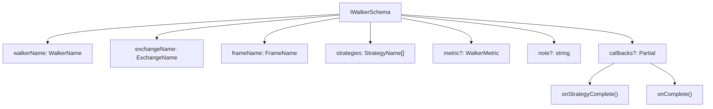
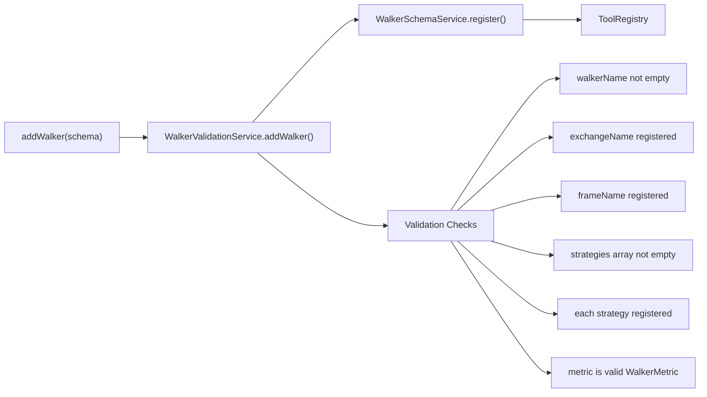
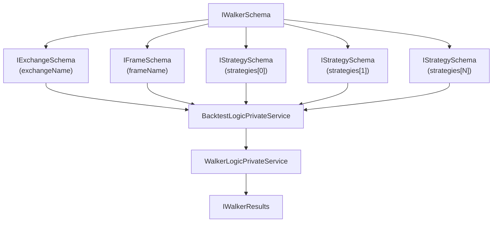
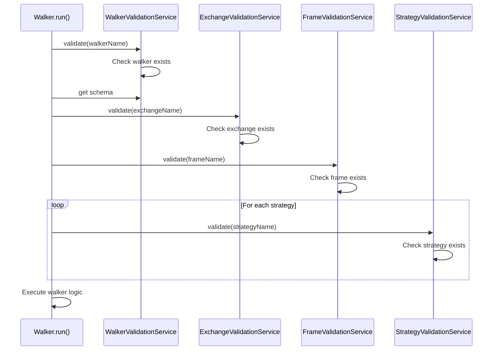
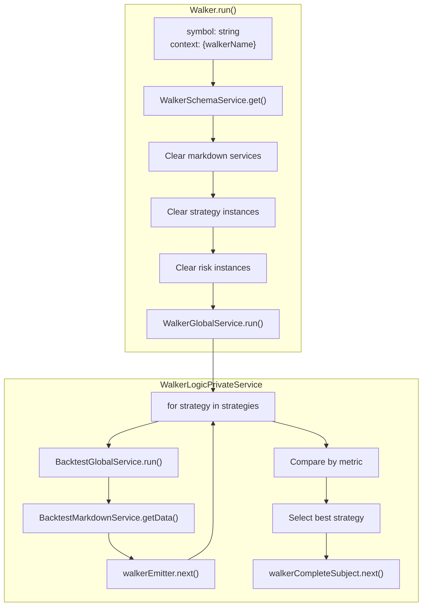
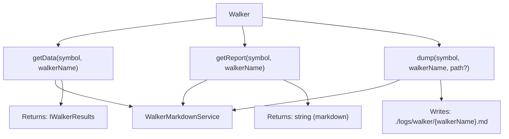
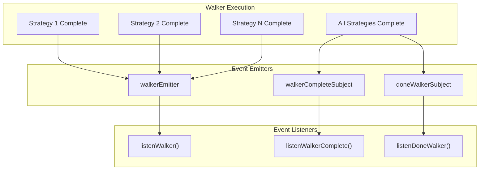

# Walker Schemas

<details>
<summary>Relevant source files</summary>

The following files were used as context for generating this wiki page:

- [src/classes/Backtest.ts](src/classes/Backtest.ts)
- [src/classes/Live.ts](src/classes/Live.ts)
- [src/classes/Walker.ts](src/classes/Walker.ts)
- [src/config/emitters.ts](src/config/emitters.ts)
- [src/function/add.ts](src/function/add.ts)
- [src/function/event.ts](src/function/event.ts)
- [src/function/list.ts](src/function/list.ts)
- [src/index.ts](src/index.ts)
- [src/lib/core/provide.ts](src/lib/core/provide.ts)
- [src/lib/core/types.ts](src/lib/core/types.ts)
- [src/lib/index.ts](src/lib/index.ts)
- [test/index.mjs](test/index.mjs)
- [types.d.ts](types.d.ts)

</details>


Walker schemas define multi-strategy comparison configurations for A/B testing and optimization workflows. A walker executes backtests for multiple strategies on the same historical data and compares their performance using a specified metric.

For information about individual strategy configuration, see [Strategy Schemas](#5.1). For information about frame (timeframe) configuration used by walkers, see [Frame Schemas](#5.3). For information about executing walkers, see [Walker API](#4.5).

## Schema Structure

Walker schemas are defined by the `IWalkerSchema` interface and registered via the `addWalker()` function.

**Schema Definition**



Sources: [types.d.ts:1014-1028]()

### Required Properties

| Property | Type | Description |
|----------|------|-------------|
| `walkerName` | `WalkerName` (string) | Unique identifier for the walker configuration |
| `exchangeName` | `ExchangeName` (string) | Exchange schema to use for all strategy backtests |
| `frameName` | `FrameName` (string) | Frame schema defining the backtest timeframe |
| `strategies` | `StrategyName[]` | Array of strategy names to compare |

### Optional Properties

| Property | Type | Default | Description |
|----------|------|---------|-------------|
| `metric` | `WalkerMetric` | `"sharpeRatio"` | Optimization metric for comparison |
| `note` | `string` | `undefined` | Developer documentation note |
| `callbacks` | `Partial<IWalkerCallbacks>` | `undefined` | Lifecycle event callbacks |

Sources: [types.d.ts:1014-1028]()

## Optimization Metrics

The `WalkerMetric` type defines which statistical measure is used to rank and select the best strategy. Higher values are always better (metrics are maximized).

```typescript
type WalkerMetric = 
  | "sharpeRatio"              // Risk-adjusted return (avgPnl / stdDev)
  | "annualizedSharpeRatio"    // Annualized Sharpe (sharpeRatio × √365)
  | "winRate"                  // Percentage of winning trades (0-100)
  | "totalPnl"                 // Cumulative PNL across all signals
  | "certaintyRatio"           // avgWin / |avgLoss|
  | "avgPnl"                   // Average PNL per signal
  | "expectedYearlyReturns"    // Projected yearly returns
```

Sources: [types.d.ts:1010-1014]()

### Metric Selection Guidelines

**Risk-Adjusted Metrics**
- `sharpeRatio` / `annualizedSharpeRatio`: Best for strategies with consistent returns and controlled drawdowns
- `certaintyRatio`: Best for strategies with asymmetric risk/reward profiles

**Return Metrics**
- `totalPnl`: Best for maximizing absolute profit without regard to risk
- `avgPnl`: Best for strategies with varying trade frequencies
- `expectedYearlyReturns`: Best for long-term performance projection

**Reliability Metrics**
- `winRate`: Best for strategies requiring high win consistency

Sources: [types.d.ts:1010-1014]()

## Registration and Validation

Walker schemas are registered through the `addWalker()` function, which performs validation and stores the configuration.

**Registration Flow**



Sources: [src/function/add.ts:188-200](), [src/lib/index.ts:88-91]()

### Example Registration

```typescript
addWalker({
  walkerName: "llm-prompt-optimizer",
  note: "Compare GPT-4 prompts for trading signal generation",
  exchangeName: "binance",
  frameName: "1month-backtest",
  strategies: [
    "gpt4-prompt-v1",
    "gpt4-prompt-v2",
    "gpt4-prompt-v3"
  ],
  metric: "sharpeRatio",
  callbacks: {
    onStrategyComplete: (strategyName, symbol, stats, metricValue) => {
      console.log(`${strategyName}: Sharpe=${metricValue}`);
    },
    onComplete: (results) => {
      console.log(`Best: ${results.bestStrategy} (${results.bestMetric})`);
    }
  }
});
```

Sources: [src/function/add.ts:151-200]()

## Lifecycle Callbacks

Walker schemas support lifecycle callbacks for monitoring comparison progress.

```mermaid
graph TB
    subgraph "Walker Execution"
        Start["Walker.run()"]
        Strategy1["Strategy 1 Backtest"]
        Callback1["onStrategyComplete()"]
        Strategy2["Strategy 2 Backtest"]
        Callback2["onStrategyComplete()"]
        Strategy3["Strategy N Backtest"]
        Callback3["onStrategyComplete()"]
        Complete["onComplete()"]
        End["Complete"]
    end
    
    Start --> Strategy1
    Strategy1 --> Callback1
    Callback1 --> Strategy2
    Strategy2 --> Callback2
    Callback2 --> Strategy3
    Strategy3 --> Callback3
    Callback3 --> Complete
    Complete --> End
```



Sources: [types.d.ts:1014-1028]()

### Callback Interfaces

**onStrategyComplete**

Called after each strategy backtest completes with its results.

```typescript
onStrategyComplete: (
  strategyName: StrategyName,
  symbol: string,
  stats: BacktestStatistics,
  metricValue: number | null
) => void
```

Parameters:
- `strategyName`: Name of the completed strategy
- `symbol`: Trading pair symbol
- `stats`: Full backtest statistics for the strategy
- `metricValue`: Computed value of the walker's metric (null if calculation unsafe)

**onComplete**

Called after all strategies complete with final comparison results.

```typescript
onComplete: (
  results: IWalkerResults
) => void
```

Parameters:
- `results`: Complete walker results including best strategy selection

Sources: [types.d.ts:1014-1028]()

## Component Integration

Walker schemas orchestrate multiple components to perform strategy comparison.

**Component Dependencies**



Sources: [src/classes/Walker.ts:31-87](), [src/lib/index.ts:1-170]()

### Validation Chain

When `Walker.run()` is called, validation occurs for all referenced components:



Sources: [src/classes/Walker.ts:50-59]()

## Walker Execution

The `Walker.run()` method executes backtests sequentially for all strategies and emits progress events.

**Execution Architecture**



Sources: [src/classes/Walker.ts:39-87](), [src/lib/services/logic/private/WalkerLogicPrivateService.ts]()

### State Management

Walker execution clears accumulated data for all strategies before starting:

1. **Markdown Services**: `backtestMarkdownService.clear()` and `scheduleMarkdownService.clear()` for each strategy
2. **Strategy Instances**: `strategyGlobalService.clear()` to reset internal state
3. **Risk Instances**: `riskGlobalService.clear()` if strategies use risk profiles

This ensures clean state for each walker run and prevents data contamination between executions.

Sources: [src/classes/Walker.ts:61-79]()

## Results and Reporting

Walker results are accumulated in `WalkerMarkdownService` and exposed through `Walker.getData()`, `Walker.getReport()`, and `Walker.dump()`.

**Results Structure**

```typescript
interface IWalkerResults {
  walkerName: WalkerName;
  symbol: string;
  metric: WalkerMetric;
  bestStrategy: StrategyName;
  bestMetric: number;
  totalStrategies: number;
  results: IWalkerStrategyResult[];
}

interface IWalkerStrategyResult {
  strategyName: StrategyName;
  metricValue: number | null;
  stats: BacktestStatistics;
}
```

Sources: [types.d.ts:1030-1050]()

### Data Retrieval Methods



Sources: [src/classes/Walker.ts:146-255]()

### Example Usage

```typescript
// Execute walker comparison
for await (const progress of Walker.run("BTCUSDT", {
  walkerName: "prompt-optimizer"
})) {
  console.log(`${progress.strategiesTested}/${progress.totalStrategies}`);
  console.log(`Best: ${progress.bestStrategy} (${progress.bestMetric})`);
}

// Retrieve results
const results = await Walker.getData("BTCUSDT", "prompt-optimizer");
console.log(`Winner: ${results.bestStrategy}`);
console.log(`Sharpe Ratio: ${results.bestMetric}`);

// Generate markdown report
const markdown = await Walker.getReport("BTCUSDT", "prompt-optimizer");
console.log(markdown);

// Save report to disk
await Walker.dump("BTCUSDT", "prompt-optimizer");
// Writes to: ./logs/walker/prompt-optimizer.md
```

Sources: [src/classes/Walker.ts:1-274]()

## Event System Integration

Walker execution emits progress and completion events through the global event system.

**Event Flow**



Sources: [src/config/emitters.ts:63-73](), [src/function/event.ts:507-623]()

### Progress Events

Progress events (`WalkerContract`) are emitted after each strategy completes:

```typescript
interface WalkerContract {
  walkerName: WalkerName;
  strategyName: StrategyName;  // Current strategy
  symbol: string;
  metric: WalkerMetric;
  metricValue: number | null;   // Current strategy's metric
  bestStrategy: StrategyName;   // Best so far
  bestMetric: number;           // Best metric so far
  strategiesTested: number;
  totalStrategies: number;
}
```

Listen to progress:

```typescript
listenWalker((event) => {
  console.log(`Progress: ${event.strategiesTested}/${event.totalStrategies}`);
  console.log(`Current: ${event.strategyName} = ${event.metricValue}`);
  console.log(`Leader: ${event.bestStrategy} = ${event.bestMetric}`);
});
```

Sources: [src/contract/Walker.contract.ts](), [src/function/event.ts:537-540]()

### Completion Events

Completion events (`IWalkerResults`) are emitted when all strategies finish:

```typescript
listenWalkerComplete((results) => {
  console.log(`Winner: ${results.bestStrategy}`);
  console.log(`Metric: ${results.bestMetric}`);
  console.log(`Tested: ${results.totalStrategies} strategies`);
  
  // Access all results
  results.results.forEach(r => {
    console.log(`${r.strategyName}: ${r.metricValue}`);
  });
});
```

Sources: [src/function/event.ts:620-623]()

## Schema Retrieval

Walker schemas can be retrieved and listed for inspection or dynamic UI generation.

### Get Specific Schema

```typescript
const walkerSchema = backtest.walkerSchemaService.get("prompt-optimizer");
console.log(walkerSchema.strategies);  // ["v1", "v2", "v3"]
console.log(walkerSchema.metric);      // "sharpeRatio"
```

Sources: [src/lib/services/schema/WalkerSchemaService.ts]()

### List All Walkers

```typescript
const allWalkers = await listWalkers();
allWalkers.forEach(walker => {
  console.log(`${walker.walkerName}: ${walker.strategies.length} strategies`);
});
```

Sources: [src/function/list.ts:137-140]()

## Common Patterns

### Multi-Prompt LLM Optimization

Walker schemas are ideal for comparing different LLM prompts for signal generation:

```typescript
// Register strategy variants with different prompts
addStrategy({
  strategyName: "gpt4-aggressive",
  interval: "5m",
  getSignal: async (symbol) => {
    const prompt = "Generate aggressive trading signals...";
    return await callGPT4(symbol, prompt);
  }
});

addStrategy({
  strategyName: "gpt4-conservative",
  interval: "5m",
  getSignal: async (symbol) => {
    const prompt = "Generate conservative trading signals...";
    return await callGPT4(symbol, prompt);
  }
});

// Compare with walker
addWalker({
  walkerName: "prompt-optimizer",
  exchangeName: "binance",
  frameName: "1month-backtest",
  strategies: ["gpt4-aggressive", "gpt4-conservative"],
  metric: "sharpeRatio"
});
```

Sources: [src/function/add.ts:151-200]()

### Parameter Grid Search

Walker can perform grid search over strategy parameters:

```typescript
// Register strategies with different parameter combinations
const periods = [10, 20, 50];
const thresholds = [0.01, 0.02, 0.03];

periods.forEach(period => {
  thresholds.forEach(threshold => {
    addStrategy({
      strategyName: `sma-${period}-${threshold}`,
      interval: "5m",
      getSignal: async (symbol) => {
        return await smaStrategy(symbol, period, threshold);
      }
    });
  });
});

// Walker tests all combinations
addWalker({
  walkerName: "sma-grid-search",
  exchangeName: "binance",
  frameName: "1year-backtest",
  strategies: [
    "sma-10-0.01", "sma-10-0.02", "sma-10-0.03",
    "sma-20-0.01", "sma-20-0.02", "sma-20-0.03",
    "sma-50-0.01", "sma-50-0.02", "sma-50-0.03"
  ],
  metric: "annualizedSharpeRatio"
});
```

Sources: [src/function/add.ts:151-200]()

### A/B Testing Production Strategies

Walker enables safe A/B testing of strategy modifications:

```typescript
addWalker({
  walkerName: "production-ab-test",
  exchangeName: "binance",
  frameName: "3month-backtest",
  strategies: [
    "production-v1",      // Current production
    "production-v2-beta"  // New candidate
  ],
  metric: "sharpeRatio",
  callbacks: {
    onComplete: (results) => {
      if (results.bestStrategy === "production-v2-beta") {
        console.log("✓ v2-beta outperforms production");
        console.log(`Improvement: ${results.bestMetric}`);
      } else {
        console.log("✗ Keep current production version");
      }
    }
  }
});
```

Sources: [src/function/add.ts:151-200]()