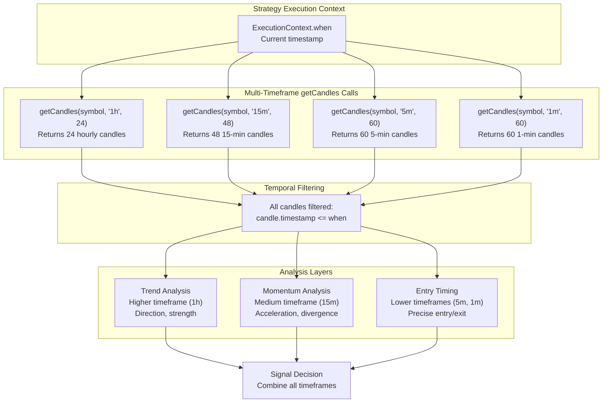
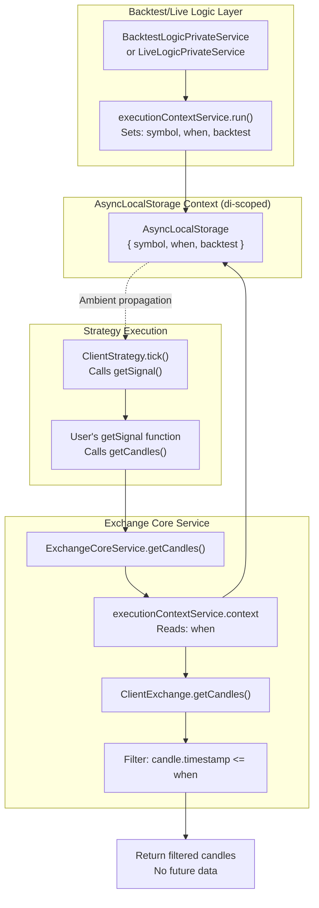
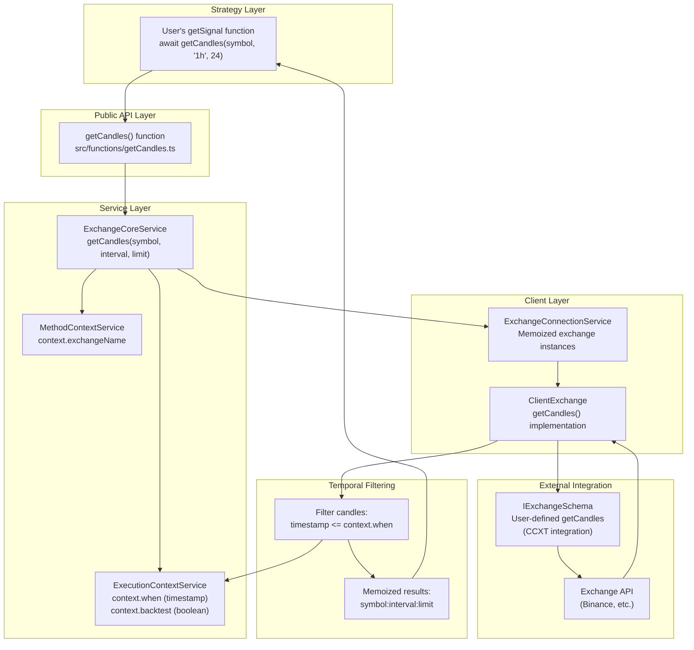

# Multi-Timeframe Analysis

## Purpose and Scope

This page explains how strategies can use `getCandles()` with different timeframe intervals to build comprehensive market analysis. Multi-timeframe analysis allows strategies to examine price action across multiple time scales (e.g., 1-minute, 15-minute, 1-hour) within a single signal generation function, enabling more robust trading decisions.

For general strategy development concepts, see [Strategy Development](./25_strategy-development.md). For the underlying temporal execution model that makes multi-timeframe analysis safe from look-ahead bias, see [Time Execution Engine](./08_core-concepts.md) and [Execution Contexts](./08_core-concepts.md). For signal generation basics, see [Signal Generation (getSignal)](./25_strategy-development.md).

---

## getCandles API Reference

The `getCandles()` function is the primary interface for fetching historical candle data within strategies. It automatically respects the current execution timestamp to prevent look-ahead bias.

### Function Signature

```typescript
getCandles(symbol: string, interval: string, limit: number): Promise<ICandleData[]>
```

### Parameters

| Parameter | Type | Description | Example Values |
|-----------|------|-------------|----------------|
| `symbol` | `string` | Trading pair identifier | `"BTCUSDT"`, `"ETHUSDT"` |
| `interval` | `string` | Candle timeframe | `"1m"`, `"5m"`, `"15m"`, `"30m"`, `"1h"`, `"4h"`, `"1d"` |
| `limit` | `number` | Maximum number of candles (most recent first) | `60`, `100`, `200` |

### Return Type

Returns `Promise<ICandleData[]>` where `ICandleData` contains:

| Field | Type | Description |
|-------|------|-------------|
| `timestamp` | `number` | Candle open time (Unix milliseconds) |
| `open` | `number` | Opening price |
| `high` | `number` | Highest price |
| `low` | `number` | Lowest price |
| `close` | `number` | Closing price |
| `volume` | `number` | Trading volume |

### Temporal Context Guarantees

**Critical**: `getCandles()` always returns candles with `timestamp <= currentExecutionTime`. This architectural constraint makes look-ahead bias **architecturally impossible**:

- ✅ Backtest mode: Returns only candles up to current iteration timestamp
- ✅ Live mode: Returns only completed candles (never in-progress candles)
- ✅ Multi-timeframe: All intervals automatically synchronized to same point in time
- ✅ Same code: Identical behavior between backtest and live trading

**Sources**: [README.md:187-199](), [src/interfaces/Strategy.interface.ts:144]()

---

## Multi-Timeframe Strategy Pattern

### Basic Example

The most common pattern is to fetch multiple timeframes in the `getSignal` function and combine their analysis:

```typescript
addStrategy({
  strategyName: 'multi-tf-strategy',
  interval: '5m',  // Signal generation throttle (separate from analysis timeframes)
  getSignal: async (symbol) => {
    // Fetch multiple timeframes
    const candles1h = await getCandles(symbol, "1h", 24);   // Last 24 hours
    const candles15m = await getCandles(symbol, "15m", 48); // Last 12 hours
    const candles5m = await getCandles(symbol, "5m", 60);   // Last 5 hours
    const candles1m = await getCandles(symbol, "1m", 60);   // Last 1 hour

    // Analyze higher timeframe for trend
    const hourlyTrend = analyzeTrend(candles1h);
    
    // Analyze medium timeframe for momentum
    const momentum = calculateMomentum(candles15m);
    
    // Use lower timeframes for entry precision
    const entrySignal = findEntry(candles5m, candles1m);
    
    // Combine analysis from all timeframes
    if (hourlyTrend === 'bullish' && momentum > 0.5 && entrySignal) {
      return {
        position: 'long',
        priceTakeProfit: entrySignal.tp,
        priceStopLoss: entrySignal.sl,
        minuteEstimatedTime: 120,
      };
    }
    
    return null; // No signal
  },
});
```

**Sources**: [README.md:112-142]()

### Timeframe Relationship Diagram



**Sources**: [README.md:189-198](), [src/interfaces/Strategy.interface.ts:144]()

---

## Execution Context and Temporal Safety

### How Temporal Context Propagates

The framework uses Node.js `AsyncLocalStorage` (via `di-scoped` library) to propagate temporal context without explicit parameter passing. This ensures `getCandles()` always knows the "current time" regardless of call depth.



**Key insight**: The `when` timestamp is set once at the start of each tick, then automatically available throughout the call stack. User code never needs to pass or track timestamps manually.

**Sources**: [README.md:189-199](), [src/lib/services/context/ExecutionContextService.ts:1-100](), [src/client/ClientStrategy.ts:354-363]()

### Temporal Filtering in Code

The temporal filtering happens at the exchange service layer. When `getCandles()` is called, the exchange service reads the current execution timestamp from context and filters results:

1. **BacktestLogicPrivateService** (backtest mode) or **LiveLogicPrivateService** (live mode) sets `executionContextService.context.when` at the start of each tick
2. User's `getSignal` function calls `getCandles(symbol, interval, limit)`
3. **ExchangeCoreService.getCandles()** reads `executionContextService.context.when`
4. **ClientExchange.getCandles()** fetches raw candles from exchange
5. Framework filters: `candles.filter(c => c.timestamp <= context.when)`
6. Returns only historical candles to user code

**Sources**: [src/lib/services/context/ExecutionContextService.ts:1-50](), [src/client/ClientExchange.ts:1-200]()

---

## Common Multi-Timeframe Patterns

### Pattern 1: Trend-Momentum-Entry Hierarchy

**Use Case**: Confirm trend on higher timeframe, validate momentum on medium timeframe, time entry on lower timeframe.

| Timeframe | Purpose | Typical Analysis |
|-----------|---------|------------------|
| `1h` or `4h` | **Trend direction** | Moving averages, trend lines, support/resistance |
| `15m` or `30m` | **Momentum confirmation** | RSI, MACD, volume patterns |
| `5m` or `1m` | **Entry timing** | Candlestick patterns, precise entry points |

```typescript
getSignal: async (symbol) => {
  const candles4h = await getCandles(symbol, "4h", 24);  // 4 days of trend
  const candles15m = await getCandles(symbol, "15m", 48); // 12 hours momentum
  const candles5m = await getCandles(symbol, "5m", 60);  // 5 hours entry
  
  // Higher TF: Is major trend bullish?
  const ema50_4h = calculateEMA(candles4h, 50);
  const trendBullish = candles4h[0].close > ema50_4h;
  
  // Medium TF: Is momentum building?
  const rsi15m = calculateRSI(candles15m, 14);
  const momentumGood = rsi15m > 50 && rsi15m < 70;
  
  // Lower TF: Is there a bullish engulfing pattern?
  const entryPattern = isBullishEngulfing(candles5m);
  
  if (trendBullish && momentumGood && entryPattern) {
    return { /* signal */ };
  }
  
  return null;
}
```

**Sources**: [README.md:112-142]()

### Pattern 2: Multi-Timeframe Support/Resistance

**Use Case**: Identify key levels across multiple timeframes for stronger support/resistance zones.

```typescript
getSignal: async (symbol) => {
  const candles1d = await getCandles(symbol, "1d", 30);  // Monthly levels
  const candles1h = await getCandles(symbol, "1h", 100); // Weekly levels
  const candles5m = await getCandles(symbol, "5m", 60);  // Intraday levels
  
  // Find support/resistance on each timeframe
  const dailyLevels = findKeyLevels(candles1d);
  const hourlyLevels = findKeyLevels(candles1h);
  const currentPrice = candles5m[0].close;
  
  // Strong level = appears on multiple timeframes
  const strongSupport = findConvergence(
    dailyLevels.support,
    hourlyLevels.support,
    currentPrice
  );
  
  if (strongSupport && isPriceNearLevel(currentPrice, strongSupport)) {
    return {
      position: 'long',
      priceStopLoss: strongSupport * 0.98, // Just below support
      priceTakeProfit: currentPrice * 1.02,
      minuteEstimatedTime: 240,
    };
  }
  
  return null;
}
```

### Pattern 3: Divergence Detection

**Use Case**: Detect momentum divergence between price and indicators across timeframes.

```typescript
getSignal: async (symbol) => {
  const candles1h = await getCandles(symbol, "1h", 50);
  const candles15m = await getCandles(symbol, "15m", 100);
  
  // Price making lower lows on 1h
  const priceLowerLows = isLowerLows(candles1h);
  
  // RSI making higher lows on 15m (bullish divergence)
  const rsi15m = calculateRSI(candles15m, 14);
  const rsiHigherLows = isHigherLows(rsi15m);
  
  // Bullish divergence: price down, indicator up
  if (priceLowerLows && rsiHigherLows) {
    return { position: 'long', /* ... */ };
  }
  
  return null;
}
```

**Sources**: [README.md:112-142]()

---

## Performance and Caching

### Candle Data Caching

The framework automatically caches candle data per execution context to avoid redundant exchange API calls:

- **Within single tick**: Multiple `getCandles()` calls with same `(symbol, interval, limit)` return cached results
- **Across ticks**: Cache is cleared between ticks to ensure fresh data
- **Memoization key**: `${symbol}:${interval}:${limit}`

### Performance Best Practices

| Practice | Rationale | Example |
|----------|-----------|---------|
| **Store candles in variables** | Avoid redundant async calls | `const candles1h = await getCandles(...); /* reuse */` |
| **Request appropriate limit** | Balance between data sufficiency and performance | Use 100 candles for SMA(50), not 1000 |
| **Use standard intervals** | Leverage exchange's native timeframes | Prefer `"1h"` over custom aggregations |
| **Avoid nested loops** | Minimize computational complexity | Pre-calculate indicators, don't recalculate per candle |

### Rate Limiting Considerations (Live Mode)

In live trading mode, `getCandles()` makes real API calls to exchanges. Be aware of:

- **Exchange rate limits**: Most exchanges limit API calls (e.g., 1200/min for Binance)
- **Strategy interval setting**: Use appropriate `interval` in strategy schema to throttle `getSignal` calls (see [Interval Throttling](./25_strategy-development.md))
- **Candle limit parameter**: Larger limits may hit rate limits faster
- **Multiple symbols**: Each symbol makes separate API calls

**Sources**: [src/client/ClientExchange.ts:1-300](), [src/client/ClientStrategy.ts:340-353]()

---

## Data Flow Architecture

### End-to-End Data Flow



**Key components**:

- **ExecutionContextService**: Provides temporal boundary (`when` timestamp)
- **MethodContextService**: Provides exchange routing (`exchangeName`)
- **ExchangeCoreService**: Orchestrates candle fetching with context
- **ClientExchange**: Implements actual data retrieval and filtering
- **Memoization**: Caches results by `symbol:interval:limit` key

**Sources**: [src/lib/services/core/ExchangeCoreService.ts:1-100](), [src/client/ClientExchange.ts:1-300](), [src/lib/services/context/ExecutionContextService.ts:1-50]()

---

## Interval Throttling vs Analysis Timeframes

**Important distinction**: The `interval` parameter in strategy schema (see [Interval Throttling](./25_strategy-development.md)) controls **how often `getSignal` is called**, while `getCandles()` timeframe parameters control **what data is analyzed**.

| Concept | Purpose | Location | Example |
|---------|---------|----------|---------|
| **Strategy interval** | Throttles signal generation frequency | `IStrategySchema.interval` | `interval: '5m'` → getSignal called every 5 minutes |
| **Analysis timeframes** | Specifies candle data granularity | `getCandles()` calls | `getCandles(symbol, "1h", 24)` → Hourly candles |

### Example Configuration

```typescript
addStrategy({
  strategyName: 'example',
  interval: '5m',  // getSignal called every 5 minutes (throttle)
  getSignal: async (symbol) => {
    // But analyze multiple timeframes when called
    const candles1h = await getCandles(symbol, "1h", 24);
    const candles15m = await getCandles(symbol, "15m", 48);
    const candles5m = await getCandles(symbol, "5m", 60);
    
    // ... analysis logic
  },
});
```

In this example:
- ✅ `getSignal` is called **at most** once every 5 minutes (strategy throttle)
- ✅ When called, it analyzes 1-hour, 15-minute, AND 5-minute candles
- ✅ All timeframes automatically synchronized to same execution timestamp

**Sources**: [src/interfaces/Strategy.interface.ts:8-18](), [src/interfaces/Strategy.interface.ts:132-151](), [src/client/ClientStrategy.ts:34-42]()

---

## Error Handling and Edge Cases

### Insufficient Historical Data

When `limit` exceeds available historical data, `getCandles()` returns fewer candles than requested:

```typescript
getSignal: async (symbol) => {
  const candles = await getCandles(symbol, "1d", 365); // Request 1 year
  
  // May return fewer if exchange doesn't have 1 year history
  if (candles.length < 100) {
    // Not enough data for analysis
    return null;
  }
  
  // Safe to proceed
  const sma100 = calculateSMA(candles, 100);
  // ...
}
```

### Incomplete Candles (Live Mode)

In live trading, the current candle is **never included** in results - only completed candles are returned:

- Current time: `2025-01-15 14:32:15`
- Fetching `getCandles(symbol, "15m", 10)`
- Returns candles ending at: `2025-01-15 14:30:00` (last completed 15-minute candle)
- **Excludes** in-progress candle from `14:30:00` to `14:45:00`

This ensures identical behavior between backtest and live modes.

### Timeframe Alignment

Different timeframes may not always align perfectly. For example:
- 1-hour candles: `12:00`, `13:00`, `14:00`
- 5-minute candles: `12:00`, `12:05`, `12:10`, ..., `12:55`, `13:00`

The framework handles this automatically - all intervals are aligned to their natural boundaries.

**Sources**: [src/client/ClientExchange.ts:100-200](), [README.md:189-199]()

---

## Testing Multi-Timeframe Strategies

### Backtest Mode Benefits

Multi-timeframe strategies are particularly well-suited for backtesting because:

1. **Deterministic**: Same execution timestamp across all `getCandles()` calls
2. **Fast iteration**: Test years of data in seconds
3. **No API limits**: Historical data loaded once, no rate limiting
4. **Reproducible**: Exact same results every run

### Example Test Pattern

```typescript
import { Backtest, addStrategy, addExchange, addFrame } from 'backtest-kit';

// Configure strategy with multiple timeframes
addStrategy({
  strategyName: 'test-multi-tf',
  interval: '5m',
  getSignal: async (symbol) => {
    const candles1h = await getCandles(symbol, "1h", 24);
    const candles5m = await getCandles(symbol, "5m", 60);
    
    // Test: candles should be aligned to same execution time
    const latest1h = candles1h[0].timestamp;
    const latest5m = candles5m[0].timestamp;
    
    // Both should be <= current execution time
    // latest5m may be more recent than latest1h (finer granularity)
    
    // ... strategy logic
  },
});

// Run backtest
for await (const event of Backtest.run('BTCUSDT', {
  strategyName: 'test-multi-tf',
  exchangeName: 'binance',
  frameName: '1d-test',
})) {
  if (event.action === 'closed') {
    console.log('Signal closed:', event.pnl.pnlPercentage);
  }
}
```

**Sources**: [README.md:145-159](), [test/e2e/other.test.mjs:1-100]()

---

## Best Practices Summary

### ✅ Do

1. **Analyze higher timeframes first**: Establish context before drilling down
2. **Use consistent intervals**: Stick to standard intervals (`1m`, `5m`, `15m`, `1h`, `4h`, `1d`)
3. **Cache results**: Store `getCandles()` results in variables, don't call repeatedly
4. **Handle insufficient data**: Check `candles.length` before calculating indicators
5. **Document timeframe choices**: Comment why each timeframe is used

### ❌ Don't

1. **Don't mix backtest/live logic**: Same `getSignal` function for both modes
2. **Don't assume candle count**: Always validate `candles.length >= requiredLength`
3. **Don't ignore temporal alignment**: Trust framework's automatic synchronization
4. **Don't make excessive API calls**: Minimize `getCandles()` calls in live mode
5. **Don't try to access future data**: Framework prevents this, but don't attempt workarounds

### Performance Checklist

- [ ] Strategy `interval` appropriately throttles signal generation
- [ ] Candle `limit` parameters are sufficient but not excessive
- [ ] Results stored in variables to avoid redundant calls
- [ ] Indicators pre-calculated outside loops
- [ ] Rate limiting considered for live trading

**Sources**: [README.md:17-29](), [README.md:178-184](), [src/client/ClientStrategy.ts:340-476]()