# Key Features

<details>
<summary>Relevant source files</summary>

The following files were used as context for generating this wiki page:

- [README.md](README.md)
- [assets/uml.svg](assets/uml.svg)
- [docs/internals.md](docs/internals.md)
- [docs/uml.puml](docs/uml.puml)
- [scripts/_convert-md-mermaid-to-svg.cjs](scripts/_convert-md-mermaid-to-svg.cjs)
- [scripts/gpt-docs.mjs](scripts/gpt-docs.mjs)
- [scripts/uml.mjs](scripts/uml.mjs)
- [src/classes/Persist.ts](src/classes/Persist.ts)
- [src/classes/Schedule.ts](src/classes/Schedule.ts)
- [src/config/params.ts](src/config/params.ts)
- [src/lib/services/global/WalkerGlobalService.ts](src/lib/services/global/WalkerGlobalService.ts)
- [src/lib/services/markdown/BacktestMarkdownService.ts](src/lib/services/markdown/BacktestMarkdownService.ts)
- [src/lib/services/markdown/LiveMarkdownService.ts](src/lib/services/markdown/LiveMarkdownService.ts)
- [src/lib/services/markdown/ScheduleMarkdownService.ts](src/lib/services/markdown/ScheduleMarkdownService.ts)
- [src/utils/writeFileAtomic.ts](src/utils/writeFileAtomic.ts)
- [test/config/setup.mjs](test/config/setup.mjs)
- [test/e2e/defend.test.mjs](test/e2e/defend.test.mjs)
- [test/e2e/sanitize.test.mjs](test/e2e/sanitize.test.mjs)
- [test/spec/scheduled.test.mjs](test/spec/scheduled.test.mjs)

</details>


## Purpose and Scope

This document details the production-ready features of the `backtest-kit` framework that enable reliable algorithmic trading strategy development and deployment. Each feature is explained with its corresponding code implementation and architectural role.

For information about the overall architecture and layer separation, see [Architecture](#2). For implementation details of specific components, see [Core Business Logic](#4) and [Service Layer](#5).

---

## Multi-Mode Execution

The framework supports two distinct execution modes with shared business logic but different orchestration patterns: backtesting for historical analysis and live trading for production deployment.

### Backtest Mode

Backtesting executes strategies against historical data using `BacktestLogicPrivateService` to orchestrate timeframe iteration:

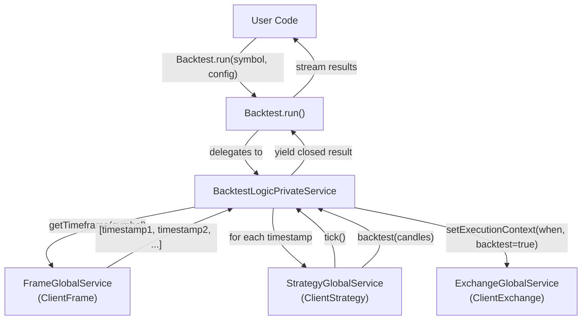
```mermaid
graph TB
    User["User Code"]
    BacktestRun["Backtest.run()"]
    LogicPrivate["BacktestLogicPrivateService"]
    Frame["FrameGlobalService<br/>(ClientFrame)"]
    Strategy["StrategyGlobalService<br/>(ClientStrategy)"]
    Exchange["ExchangeGlobalService<br/>(ClientExchange)"]
    
    User -->|"Backtest.run(symbol, config)"| BacktestRun
    BacktestRun -->|"delegates to"| LogicPrivate
    LogicPrivate -->|"getTimeframe(symbol)"| Frame
    Frame -->|"[timestamp1, timestamp2, ...]"| LogicPrivate
    
    LogicPrivate -->|"for each timestamp"| Strategy
    LogicPrivate -->|"setExecutionContext(when, backtest=true)"| Exchange
    Strategy -->|"tick()"| LogicPrivate
    Strategy -->|"backtest(candles)"| LogicPrivate
    LogicPrivate -->|"yield closed result"| BacktestRun
    BacktestRun -->|"stream results"| User
```

**Backtest Flow Characteristics:**

| Feature | Implementation |
|---------|----------------|
| **Timeframe Generation** | `ClientFrame.getTimeframe()` creates timestamp array with configured interval |
| **Context Injection** | `ExecutionContextService` sets `when` to historical timestamp, `backtest=true` |
| **Fast-Forward Simulation** | `ClientStrategy.backtest()` processes future candles without tick iteration |
| **Memory Efficiency** | Generator yields only closed signals, no accumulation |
| **Early Termination** | User can `break` from async iterator at any time |

### Live Mode

Live trading runs an infinite loop with 1-minute intervals, monitoring active signals in real-time:

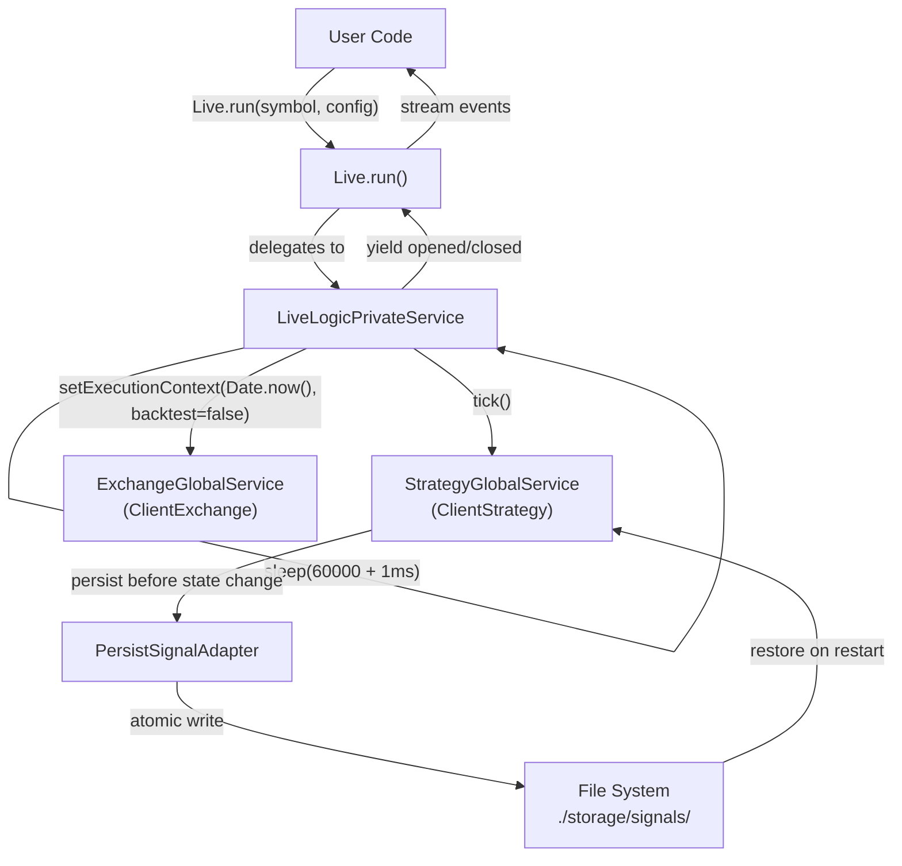
```mermaid
graph TB
    User["User Code"]
    LiveRun["Live.run()"]
    LogicPrivate["LiveLogicPrivateService"]
    Strategy["StrategyGlobalService<br/>(ClientStrategy)"]
    Exchange["ExchangeGlobalService<br/>(ClientExchange)"]
    Persist["PersistSignalAdapter"]
    Disk["File System<br/>./storage/signals/"]
    
    User -->|"Live.run(symbol, config)"| LiveRun
    LiveRun -->|"delegates to"| LogicPrivate
    
    LogicPrivate -->|"infinite loop"| LogicPrivate
    LogicPrivate -->|"setExecutionContext(Date.now(), backtest=false)"| Exchange
    LogicPrivate -->|"tick()"| Strategy
    
    Strategy -->|"persist before state change"| Persist
    Persist -->|"atomic write"| Disk
    Disk -->|"restore on restart"| Strategy
    
    LogicPrivate -->|"yield opened/closed"| LiveRun
    LiveRun -->|"stream events"| User
    LogicPrivate -->|"sleep(60000 + 1ms)"| LogicPrivate
```

**Live Trading Characteristics:**

| Feature | Implementation |
|---------|----------------|
| **Infinite Generator** | `LiveLogicPrivateService.execute()` loops with `while (true)` |
| **Real-Time Context** | `ExecutionContextService` sets `when=Date.now()`, `backtest=false` |
| **State Persistence** | `PersistSignalAdapter.writeSignalData()` before every state change |
| **Crash Recovery** | `ClientStrategy.waitForInit()` loads last known state on restart |
| **Interval Control** | `sleep(60000 + 1ms)` ensures 1-minute tick rate |
| **Filtered Output** | Only `opened` and `closed` yielded, `active` filtered |

**Sources:**
- [src/lib/services/logic/private/BacktestLogicPrivateService.ts]()
- [src/lib/services/logic/private/LiveLogicPrivateService.ts]()
- [src/client/ClientStrategy.ts:146-165]() (waitForInit)
- [src/client/ClientFrame.ts]()

---

## Crash-Safe Persistence

Live trading uses atomic file writes to persist signal state before every state transition, enabling crash recovery without signal duplication or data loss.

### Persistence Architecture

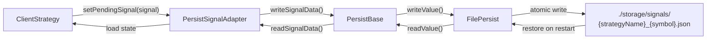
```mermaid
graph LR
    Strategy["ClientStrategy"]
    Persist["PersistSignalAdapter"]
    Base["PersistBase"]
    FileImpl["FilePersist"]
    Disk["./storage/signals/<br/>{strategyName}_{symbol}.json"]
    
    Strategy -->|"setPendingSignal(signal)"| Persist
    Persist -->|"writeSignalData()"| Base
    Base -->|"writeValue()"| FileImpl
    FileImpl -->|"atomic write"| Disk
    
    Disk -->|"restore on restart"| FileImpl
    FileImpl -->|"readValue()"| Base
    Base -->|"readSignalData()"| Persist
    Persist -->|"load state"| Strategy
```

### Atomic Write Implementation

The `PersistSignalAdapter` ensures atomicity through temporary file writes:

| Step | Operation | Purpose |
|------|-----------|---------|
| 1 | Write to `.tmp` file | Prevent corruption if crash during write |
| 2 | Sync to disk | Ensure OS flushes write buffer |
| 3 | Rename `.tmp` to final | Atomic filesystem operation (all-or-nothing) |
| 4 | Sync directory | Ensure directory entry is persisted |

**State Transitions with Persistence:**

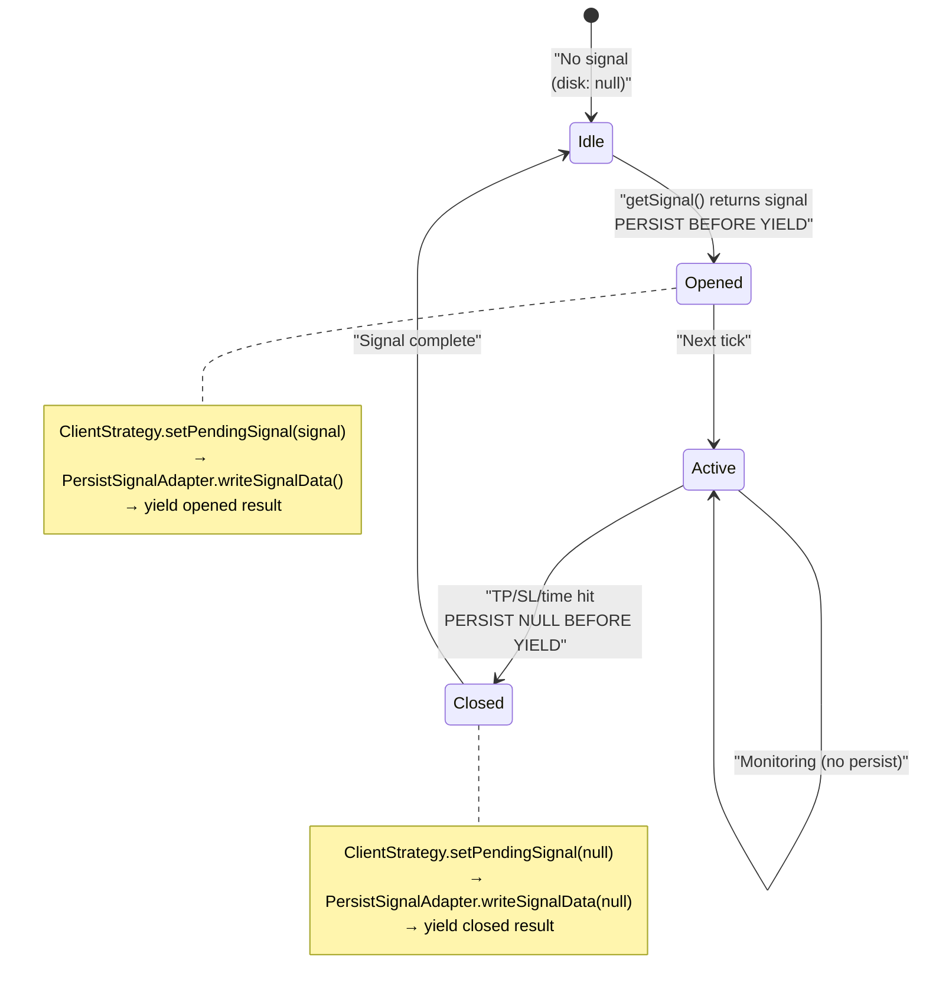
```mermaid
stateDiagram-v2
    [*] --> Idle: "No signal<br/>(disk: null)"
    
    Idle --> Opened: "getSignal() returns signal<br/>PERSIST BEFORE YIELD"
    note right of Opened
        ClientStrategy.setPendingSignal(signal)
        → PersistSignalAdapter.writeSignalData()
        → yield opened result
    end note
    
    Opened --> Active: "Next tick"
    Active --> Active: "Monitoring (no persist)"
    
    Active --> Closed: "TP/SL/time hit<br/>PERSIST NULL BEFORE YIELD"
    note right of Closed
        ClientStrategy.setPendingSignal(null)
        → PersistSignalAdapter.writeSignalData(null)
        → yield closed result
    end note
    
    Closed --> Idle: "Signal complete"
```

**Key Code Locations:**

- **Atomic Write Logic**: [src/classes/Persist.ts]() (`FilePersist.writeValue`)
- **Signal Persistence**: [src/client/ClientStrategy.ts:220-233]() (`setPendingSignal`)
- **State Recovery**: [src/client/ClientStrategy.ts:146-165]() (`waitForInit`)
- **File Naming**: `{strategyName}_{symbol}.json` convention in `PersistSignalAdapter.getEntityId()`

**Sources:**
- [src/classes/Persist.ts]()
- [src/client/ClientStrategy.ts:220-233]()
- [src/client/ClientStrategy.ts:146-165]()

---

## Comprehensive Signal Validation

Every signal generated by `getSignal()` is validated before execution to prevent invalid trades. Validation failures throw descriptive errors. The framework provides configurable validation parameters to protect against common trading mistakes.

### Validation Rules

The `VALIDATE_SIGNAL_FN` function enforces the following constraints:

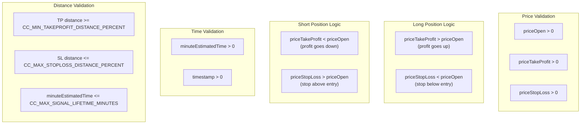
```mermaid
graph TB
    subgraph "Price Validation"
        P1["priceOpen > 0"]
        P2["priceTakeProfit > 0"]
        P3["priceStopLoss > 0"]
    end
    
    subgraph "Long Position Logic"
        L1["priceTakeProfit > priceOpen<br/>(profit goes up)"]
        L2["priceStopLoss < priceOpen<br/>(stop below entry)"]
    end
    
    subgraph "Short Position Logic"
        S1["priceTakeProfit < priceOpen<br/>(profit goes down)"]
        S2["priceStopLoss > priceOpen<br/>(stop above entry)"]
    end
    
    subgraph "Time Validation"
        T1["minuteEstimatedTime > 0"]
        T2["timestamp > 0"]
    end
    
    subgraph "Distance Validation"
        D1["TP distance >= CC_MIN_TAKEPROFIT_DISTANCE_PERCENT"]
        D2["SL distance <= CC_MAX_STOPLOSS_DISTANCE_PERCENT"]
        D3["minuteEstimatedTime <= CC_MAX_SIGNAL_LIFETIME_MINUTES"]
    end
```

### Global Validation Parameters

Configurable via `setConfig()` from [src/config/params.ts:1-35]():

| Parameter | Default | Purpose |
|-----------|---------|---------|
| `CC_MIN_TAKEPROFIT_DISTANCE_PERCENT` | 0.1% | Ensures TP covers trading fees (prevents micro-profits eaten by costs) |
| `CC_MAX_STOPLOSS_DISTANCE_PERCENT` | 20% | Prevents catastrophic losses from extreme SL values |
| `CC_MAX_SIGNAL_LIFETIME_MINUTES` | 1440 (1 day) | Prevents eternal signals blocking risk limits |
| `CC_SCHEDULE_AWAIT_MINUTES` | 120 (2 hours) | Maximum wait time for scheduled signal activation |

**Validation Error Examples:**

| Invalid Signal | Error Message |
|----------------|---------------|
| Long with TP below open | `Long: priceTakeProfit (49000) must be > priceOpen (50000)` |
| Long with SL above open | `Long: priceStopLoss (51000) must be < priceOpen (50000)` |
| Short with TP above open | `Short: priceTakeProfit (51000) must be < priceOpen (50000)` |
| Short with SL below open | `Short: priceStopLoss (49000) must be > priceOpen (50000)` |
| Negative price | `priceOpen must be positive, got -50000` |
| Zero time | `minuteEstimatedTime must be positive, got 0` |
| TP too close | `TakeProfit distance (0.05%) below minimum (0.1%)` |
| SL too far | `StopLoss distance (25%) exceeds maximum (20%)` |
| Excessive lifetime | `Signal lifetime (2000min) exceeds maximum (1440min)` |

### Validation Flow

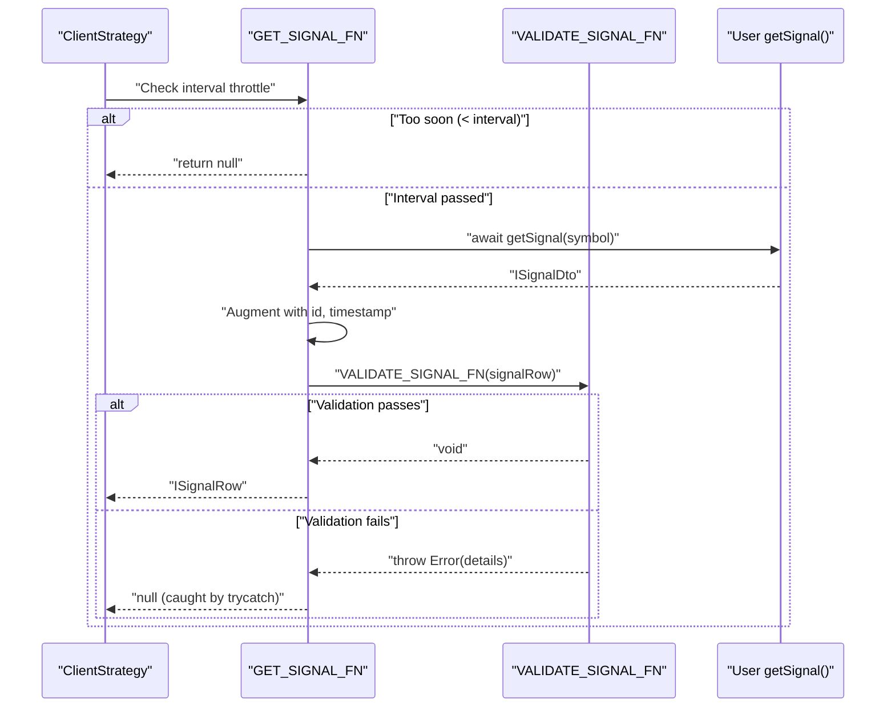
```mermaid
sequenceDiagram
    participant Strategy as "ClientStrategy"
    participant GetSignal as "GET_SIGNAL_FN"
    participant Validate as "VALIDATE_SIGNAL_FN"
    participant User as "User getSignal()"
    
    Strategy->>GetSignal: "Check interval throttle"
    alt "Too soon (< interval)"
        GetSignal-->>Strategy: "return null"
    else "Interval passed"
        GetSignal->>User: "await getSignal(symbol)"
        User-->>GetSignal: "ISignalDto"
        GetSignal->>GetSignal: "Augment with id, timestamp"
        GetSignal->>Validate: "VALIDATE_SIGNAL_FN(signalRow)"
        alt "Validation passes"
            Validate-->>GetSignal: "void"
            GetSignal-->>Strategy: "ISignalRow"
        else "Validation fails"
            Validate-->>GetSignal: "throw Error(details)"
            GetSignal-->>Strategy: "null (caught by trycatch)"
        end
    end
```

**Sources:**
- [src/client/ClientStrategy.ts:28-88]() (VALIDATE_SIGNAL_FN)
- [src/client/ClientStrategy.ts:90-131]() (GET_SIGNAL_FN)
- [src/interfaces/Strategy.interface.ts:22-37]() (ISignalDto)
- [src/config/params.ts:1-35]() (GLOBAL_CONFIG)
- [test/e2e/sanitize.test.mjs]() (validation test coverage)

---

## Memory-Efficient Async Generators

Both backtest and live execution use async generators (`AsyncIterableIterator`) to stream results without accumulating data in memory, enabling processing of arbitrarily large datasets.

### Generator Architecture

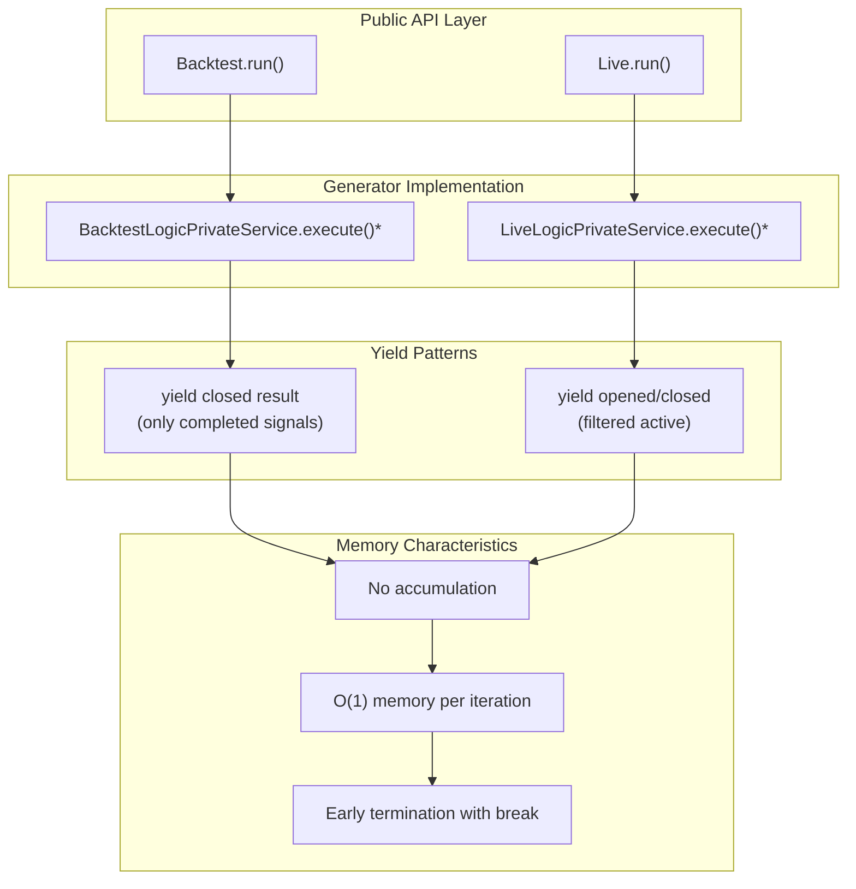
```mermaid
graph TB
    subgraph "Public API Layer"
        BacktestRun["Backtest.run()"]
        LiveRun["Live.run()"]
    end
    
    subgraph "Generator Implementation"
        BacktestGen["BacktestLogicPrivateService.execute()*"]
        LiveGen["LiveLogicPrivateService.execute()*"]
    end
    
    subgraph "Yield Patterns"
        BacktestYield["yield closed result<br/>(only completed signals)"]
        LiveYield["yield opened/closed<br/>(filtered active)"]
    end
    
    subgraph "Memory Characteristics"
        M1["No accumulation"]
        M2["O(1) memory per iteration"]
        M3["Early termination with break"]
    end
    
    BacktestRun --> BacktestGen
    LiveRun --> LiveGen
    BacktestGen --> BacktestYield
    LiveGen --> LiveYield
    BacktestYield --> M1
    LiveYield --> M1
    M1 --> M2
    M2 --> M3
```

### Generator Comparison

| Aspect | Backtest Generator | Live Generator |
|--------|-------------------|----------------|
| **Termination** | Finite (timeframe exhausted) | Infinite (`while (true)`) |
| **Yield Condition** | Only `closed` results | `opened` and `closed` (filters `active`) |
| **Context Setting** | Historical timestamp from timeframe | `Date.now()` on each iteration |
| **Sleep Interval** | None (fast iteration) | 60000ms + 1ms between ticks |
| **Fast-Forward** | Yes (`backtest()` method) | No (real-time only) |
| **Cancellation** | `break` from iterator | `cancel()` function returned by `background()` |

### Memory Optimization Techniques

1. **Prototype Methods**: All client classes use prototype functions instead of arrow functions
   - **Location**: [src/client/ClientStrategy.ts]() (all methods use `public methodName = async () => {}` pattern)
   - **Benefit**: Single function instance shared across all instances

2. **Memoization**: Connection services cache client instances
   - **Location**: [src/lib/services/connection/]()
   - **Pattern**: `memoize()` from `functools-kit` on `getStrategy()`, `getExchange()`, `getFrame()`

3. **Streaming Accumulation**: Markdown services accumulate passively
   - **Location**: [src/lib/services/markdown/]()
   - **Pattern**: Listen to events, build report only when requested via `getReport()`

4. **Lazy Initialization**: Services created only when needed
   - **Pattern**: DI container resolves dependencies on first access

**Sources:**
- [src/lib/services/logic/private/BacktestLogicPrivateService.ts]()
- [src/lib/services/logic/private/LiveLogicPrivateService.ts]()
- [src/client/ClientStrategy.ts:194-464]() (prototype methods)

---

## Signal Lifecycle State Machine

Signals follow a deterministic state machine with discriminated union types for type-safe handling. The framework supports both market orders (immediate execution) and limit orders (scheduled execution).

### Complete Signal Lifecycle

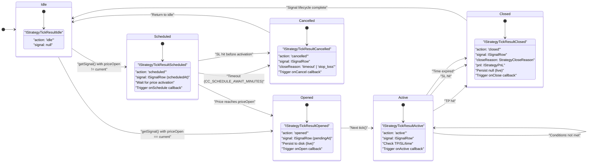
```mermaid
stateDiagram-v2
    direction LR
    
    [*] --> Idle
    
    state "Idle" as Idle {
        [*] --> NoSignal
        NoSignal: "IStrategyTickResultIdle"
        NoSignal: "action: 'idle'"
        NoSignal: "signal: null"
    }
    
    Idle --> Scheduled: "getSignal() with priceOpen != current"
    Idle --> Opened: "getSignal() with priceOpen == current"
    
    state "Scheduled" as Scheduled {
        [*] --> Pending
        Pending: "IStrategyTickResultScheduled"
        Pending: "action: 'scheduled'"
        Pending: "signal: ISignalRow (scheduledAt)"
        Pending: "Wait for price activation"
        Pending: "Trigger onSchedule callback"
    }
    
    Scheduled --> Opened: "Price reaches priceOpen"
    Scheduled --> Cancelled: "Timeout (CC_SCHEDULE_AWAIT_MINUTES)"
    Scheduled --> Cancelled: "SL hit before activation"
    
    state "Cancelled" as Cancelled {
        [*] --> NotActivated
        NotActivated: "IStrategyTickResultCancelled"
        NotActivated: "action: 'cancelled'"
        NotActivated: "signal: ISignalRow"
        NotActivated: "closeReason: 'timeout' | 'stop_loss'"
        NotActivated: "Trigger onCancel callback"
    }
    
    Cancelled --> Idle: "Return to idle"
    
    state "Opened" as Opened {
        [*] --> NewSignal
        NewSignal: "IStrategyTickResultOpened"
        NewSignal: "action: 'opened'"
        NewSignal: "signal: ISignalRow (pendingAt)"
        NewSignal: "Persist to disk (live)"
        NewSignal: "Trigger onOpen callback"
    }
    
    Opened --> Active: "Next tick()"
    
    state "Active" as Active {
        [*] --> Monitoring
        Monitoring: "IStrategyTickResultActive"
        Monitoring: "action: 'active'"
        Monitoring: "signal: ISignalRow"
        Monitoring: "Check TP/SL/time"
        Monitoring: "Trigger onActive callback"
    }
    
    Active --> Active: "Conditions not met"
    Active --> Closed: "TP hit"
    Active --> Closed: "SL hit"
    Active --> Closed: "Time expired"
    
    state "Closed" as Closed {
        [*] --> Completed
        Completed: "IStrategyTickResultClosed"
        Completed: "action: 'closed'"
        Completed: "signal: ISignalRow"
        Completed: "closeReason: StrategyCloseReason"
        Completed: "pnl: IStrategyPnL"
        Completed: "Persist null (live)"
        Completed: "Trigger onClose callback"
    }
    
    Closed --> Idle: "Signal lifecycle complete"
```

### Type-Safe State Handling

The discriminated union `IStrategyTickResult` enables type narrowing:

```typescript
// Example usage (not actual code, just illustration)
const result = await strategy.tick();

if (result.action === "idle") {
  // TypeScript knows: result.signal === null
  console.log(result.currentPrice);
}

if (result.action === "scheduled") {
  // TypeScript knows: result.signal is ISignalRow with scheduledAt
  console.log(result.signal.priceOpen);
  console.log(result.signal.scheduledAt);
}

if (result.action === "cancelled") {
  // TypeScript knows: result has closeReason, closeTimestamp
  console.log(result.closeReason); // "timeout" | "stop_loss"
  console.log(result.closeTimestamp);
}

if (result.action === "opened") {
  // TypeScript knows: result.signal is ISignalRow with pendingAt
  console.log(result.signal.priceOpen);
  console.log(result.signal.pendingAt);
}

if (result.action === "active") {
  // TypeScript knows: result.signal is ISignalRow
  // result.currentPrice is available
}

if (result.action === "closed") {
  // TypeScript knows: result has pnl, closeReason, closeTimestamp
  console.log(result.pnl.pnlPercentage);
  console.log(result.closeReason); // "take_profit" | "stop_loss" | "time_expired"
}
```

### State Transition Code Locations

| State | Entry Point | Exit Point | Notes |
|-------|-------------|------------|-------|
| **idle** | [src/client/ClientStrategy.ts:306-322]() | `getSignal()` returns non-null | No active signal |
| **scheduled** | Signal generation with future `priceOpen` | Price activation or timeout | Limit order waiting |
| **cancelled** | Timeout or SL before activation | Return to idle | Scheduled signal not filled |
| **opened** | [src/client/ClientStrategy.ts:275-291]() | Next tick iteration | Position activated |
| **active** | [src/client/ClientStrategy.ts:447-463]() | TP/SL/time condition met | Position monitoring |
| **closed** | [src/client/ClientStrategy.ts:416-435]() | `setPendingSignal(null)` | Final state with PNL |

**Sources:**
- [src/client/ClientStrategy.ts:258-464]() (tick method with all states)
- [src/interfaces/Strategy.interface.ts:128-208]() (type definitions)
- [test/e2e/defend.test.mjs]() (scheduled signal test coverage)

---

## Accurate PNL Calculation

Profit and loss calculations include realistic trading costs (fees and slippage) for accurate backtesting:

### Cost Constants

| Cost Type | Value | Application |
|-----------|-------|-------------|
| **Fee** | 0.1% (0.001) | Applied to both entry and exit |
| **Slippage** | 0.1% (0.001) | Simulates market impact |
| **Total Cost** | 0.2% per side | 0.4% round-trip (0.2% entry + 0.2% exit) |

### PNL Formulas

**Long Position:**
```
priceOpenWithCosts  = priceOpen  × (1 + slippage + fee)
priceCloseWithCosts = priceClose × (1 - slippage - fee)
pnl% = (priceCloseWithCosts - priceOpenWithCosts) / priceOpenWithCosts × 100
```

**Short Position:**
```
priceOpenWithCosts  = priceOpen  × (1 - slippage + fee)
priceCloseWithCosts = priceClose × (1 + slippage + fee)
pnl% = (priceOpenWithCosts - priceCloseWithCosts) / priceOpenWithCosts × 100
```

### PNL Calculation Implementation

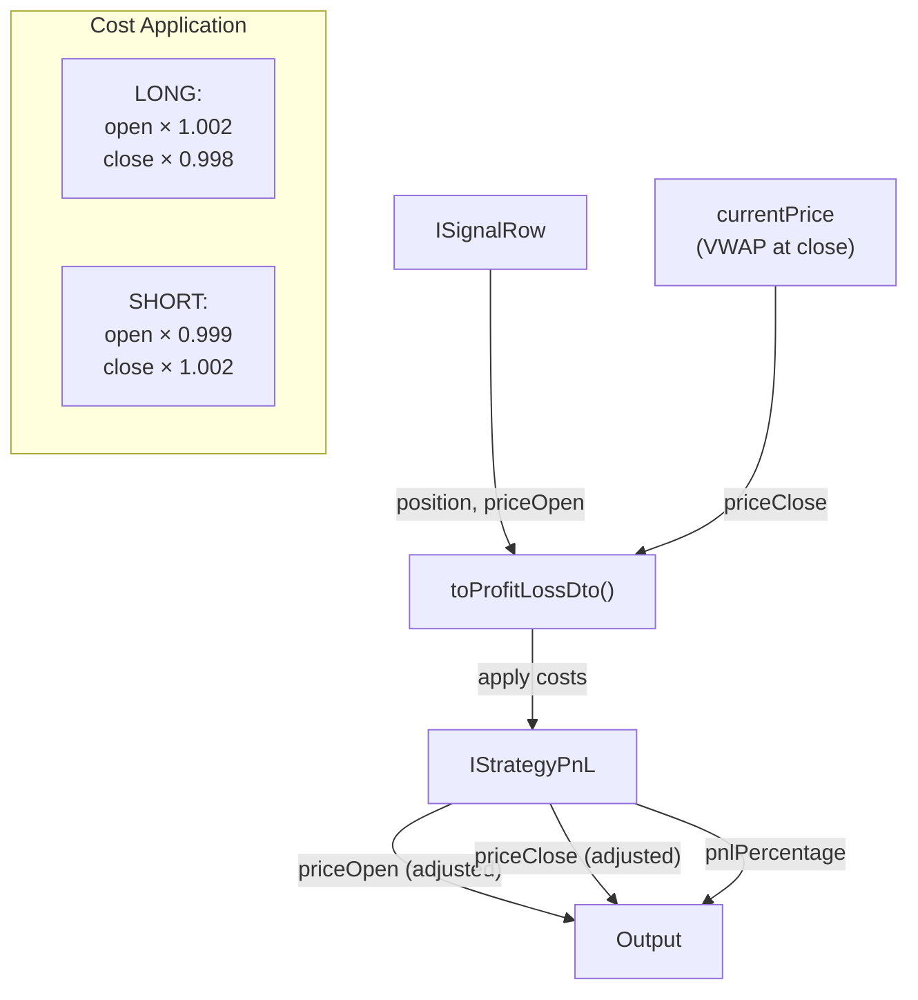
```mermaid
graph TB
    Signal["ISignalRow"]
    ClosePrice["currentPrice<br/>(VWAP at close)"]
    Helper["toProfitLossDto()"]
    Result["IStrategyPnL"]
    
    Signal -->|"position, priceOpen"| Helper
    ClosePrice -->|"priceClose"| Helper
    
    Helper -->|"apply costs"| Result
    
    Result -->|"priceOpen (adjusted)"| Output
    Result -->|"priceClose (adjusted)"| Output
    Result -->|"pnlPercentage"| Output
    
    subgraph "Cost Application"
        L["LONG:<br/>open × 1.002<br/>close × 0.998"]
        S["SHORT:<br/>open × 0.999<br/>close × 1.002"]
    end
```

**Example Calculation (Long Position):**

| Parameter | Value |
|-----------|-------|
| Entry Price | $50,000 |
| Exit Price | $51,000 |
| **Adjusted Entry** | $50,000 × 1.002 = $50,100 |
| **Adjusted Exit** | $51,000 × 0.998 = $50,898 |
| **PNL %** | ($50,898 - $50,100) / $50,100 × 100 = **+1.59%** |

Without costs, this would be +2.0%. The 0.41% difference represents realistic trading costs.

**Sources:**
- [src/helpers/toProfitLossDto.ts]() (PNL calculation logic)
- [src/client/ClientStrategy.ts:375]() (usage in tick method)
- [src/client/ClientStrategy.ts:544]() (usage in backtest method)

---

## Interval Throttling

Signal generation is throttled at the strategy level to prevent spam and ensure consistent signal spacing:

### Throttling Mechanism

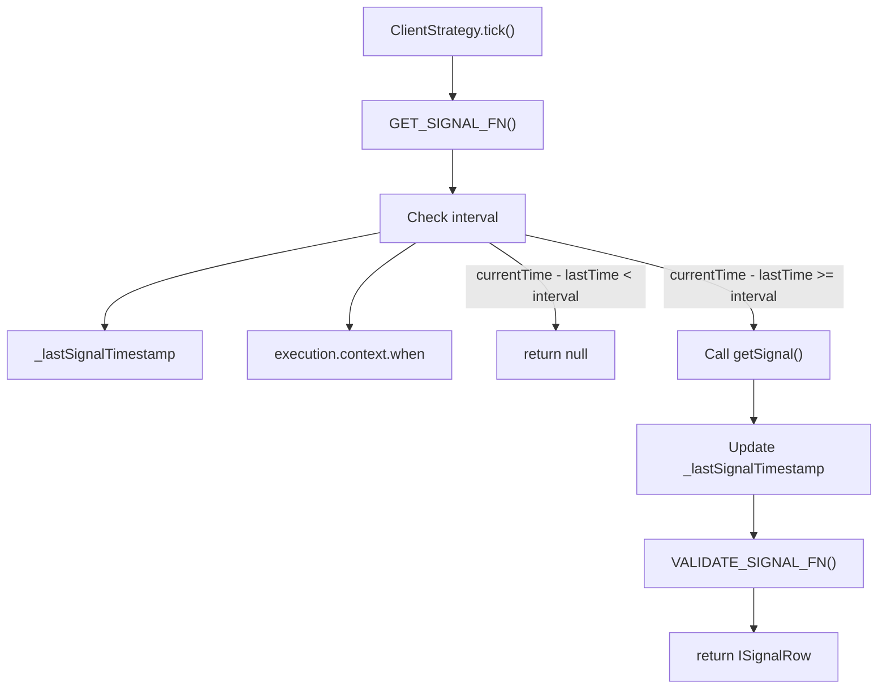
```mermaid
graph TB
    Tick["ClientStrategy.tick()"]
    GetSignal["GET_SIGNAL_FN()"]
    Check["Check interval"]
    LastTime["_lastSignalTimestamp"]
    CurrentTime["execution.context.when"]
    
    Tick --> GetSignal
    GetSignal --> Check
    Check --> LastTime
    Check --> CurrentTime
    
    Check -->|"currentTime - lastTime < interval"| Reject["return null"]
    Check -->|"currentTime - lastTime >= interval"| Allow["Call getSignal()"]
    
    Allow --> Update["Update _lastSignalTimestamp"]
    Update --> Validate["VALIDATE_SIGNAL_FN()"]
    Validate --> Return["return ISignalRow"]
```

### Supported Intervals

| Interval | Minutes | Use Case |
|----------|---------|----------|
| `"1m"` | 1 | High-frequency strategies |
| `"3m"` | 3 | Short-term signals |
| `"5m"` | 5 | Medium-frequency trading |
| `"15m"` | 15 | Moderate signals |
| `"30m"` | 30 | Low-frequency strategies |
| `"1h"` | 60 | Hourly signals |

### Throttling Logic Location

The throttling check occurs at [src/client/ClientStrategy.ts:94-106]():

```typescript
// Pseudocode representation (not actual code)
const intervalMinutes = INTERVAL_MINUTES[interval]; // e.g., "5m" → 5
const intervalMs = intervalMinutes × 60 × 1000;

if (lastSignalTimestamp !== null && 
    currentTime - lastSignalTimestamp < intervalMs) {
  return null; // Too soon, throttle
}

lastSignalTimestamp = currentTime; // Update for next check
```

**Sources:**
- [src/client/ClientStrategy.ts:19-26]() (INTERVAL_MINUTES mapping)
- [src/client/ClientStrategy.ts:90-131]() (GET_SIGNAL_FN with throttling)
- [src/interfaces/Strategy.interface.ts:10-16]() (SignalInterval type)

---

## VWAP-Based Pricing

All price monitoring uses Volume-Weighted Average Price (VWAP) calculated from the last `CC_AVG_PRICE_CANDLES_COUNT` (default: 5) one-minute candles, providing more accurate price discovery than simple close prices:

### VWAP Calculation

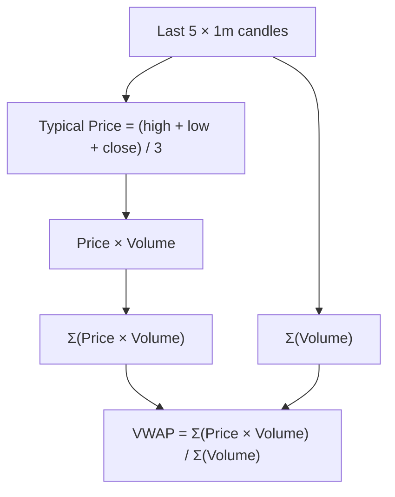
```mermaid
graph TB
    Candles["Last 5 × 1m candles"]
    TypicalPrice["Typical Price = (high + low + close) / 3"]
    PriceVolume["Price × Volume"]
    SumPV["Σ(Price × Volume)"]
    SumV["Σ(Volume)"]
    VWAP["VWAP = Σ(Price × Volume) / Σ(Volume)"]
    
    Candles --> TypicalPrice
    TypicalPrice --> PriceVolume
    PriceVolume --> SumPV
    Candles --> SumV
    SumPV --> VWAP
    SumV --> VWAP
```

### VWAP Usage Points

| Context | Method | Purpose |
|---------|--------|---------|
| **Live Tick** | `ClientStrategy.tick()` | Check TP/SL against current VWAP |
| **Live Idle** | `ClientStrategy.tick()` (no signal) | Report current market price |
| **Backtest** | `ClientStrategy.backtest()` | Check TP/SL on each candle's VWAP |
| **Public API** | `getAveragePrice(symbol)` | Expose VWAP to user strategies |

### VWAP Implementation Flow

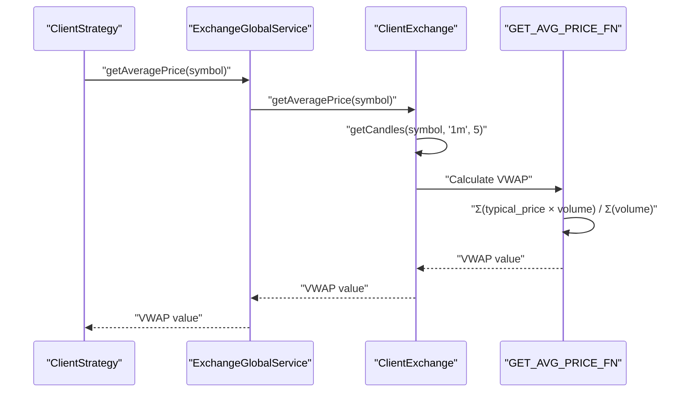
```mermaid
sequenceDiagram
    participant Strategy as "ClientStrategy"
    participant Exchange as "ExchangeGlobalService"
    participant Client as "ClientExchange"
    participant Calc as "GET_AVG_PRICE_FN"
    
    Strategy->>Exchange: "getAveragePrice(symbol)"
    Exchange->>Client: "getAveragePrice(symbol)"
    Client->>Client: "getCandles(symbol, '1m', 5)"
    Client->>Calc: "Calculate VWAP"
    Calc->>Calc: "Σ(typical_price × volume) / Σ(volume)"
    Calc-->>Client: "VWAP value"
    Client-->>Exchange: "VWAP value"
    Exchange-->>Strategy: "VWAP value"
```

**Edge Case**: If total volume is zero, fallback to simple average of close prices:
```typescript
// Pseudocode (not actual code)
if (totalVolume === 0) {
  return candles.reduce((sum, c) => sum + c.close, 0) / candles.length;
}
```

**Sources:**
- [src/client/ClientStrategy.ts:133-144]() (GET_AVG_PRICE_FN)
- [src/client/ClientExchange.ts]() (getAveragePrice implementation)
- [src/client/ClientStrategy.ts:329-331]() (usage in tick)
- [src/client/ClientStrategy.ts:514-515]() (usage in backtest)
- [src/config/params.ts:8-11]() (CC_AVG_PRICE_CANDLES_COUNT)

---

## Markdown Reporting

The framework generates detailed markdown reports with statistics for backtest, live trading, and scheduled signals:

### Report Architecture

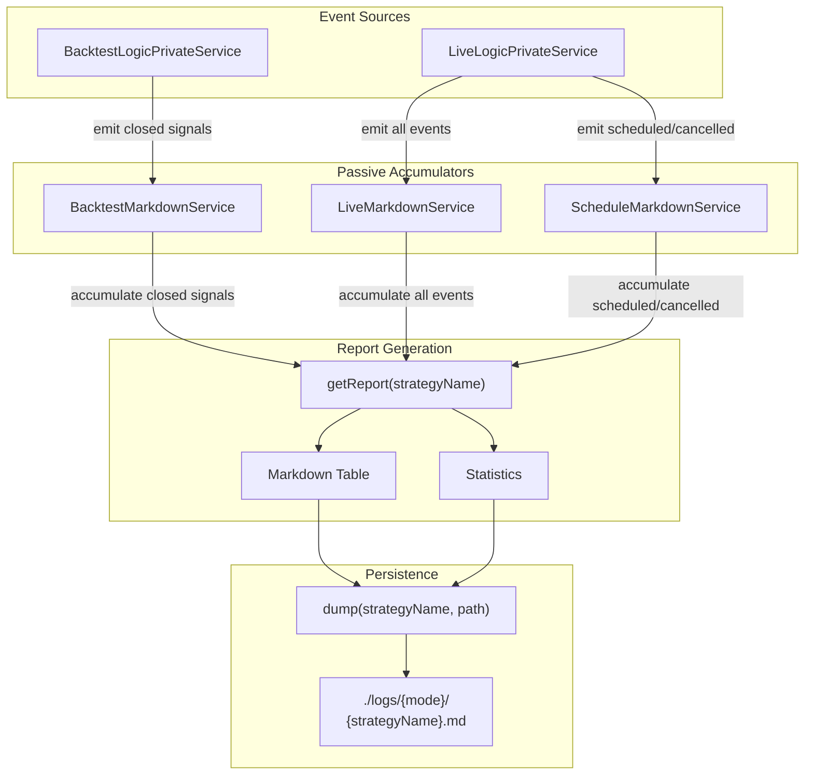
```mermaid
graph TB
    subgraph "Event Sources"
        BacktestLogic["BacktestLogicPrivateService"]
        LiveLogic["LiveLogicPrivateService"]
    end
    
    subgraph "Passive Accumulators"
        BacktestMD["BacktestMarkdownService"]
        LiveMD["LiveMarkdownService"]
        ScheduleMD["ScheduleMarkdownService"]
    end
    
    subgraph "Report Generation"
        GetReport["getReport(strategyName)"]
        Table["Markdown Table"]
        Stats["Statistics"]
    end
    
    subgraph "Persistence"
        Dump["dump(strategyName, path)"]
        File["./logs/{mode}/<br/>{strategyName}.md"]
    end
    
    BacktestLogic -->|"emit closed signals"| BacktestMD
    LiveLogic -->|"emit all events"| LiveMD
    LiveLogic -->|"emit scheduled/cancelled"| ScheduleMD
    
    BacktestMD -->|"accumulate closed signals"| GetReport
    LiveMD -->|"accumulate all events"| GetReport
    ScheduleMD -->|"accumulate scheduled/cancelled"| GetReport
    
    GetReport --> Table
    GetReport --> Stats
    
    Table --> Dump
    Stats --> Dump
    Dump --> File
```

### Report Statistics

**Backtest Report Metrics** (BacktestMarkdownService):
- Total closed signals
- Win rate, average PNL, total PNL
- Standard deviation, Sharpe ratio, annualized Sharpe ratio
- Certainty ratio (avgWin / |avgLoss|)
- Expected yearly returns
- Signal-by-signal table with prices, PNL, close reason, duration, timestamps

**Live Report Metrics** (LiveMarkdownService):
- Total events (idle, opened, active, closed)
- Closed signals count, win count, loss count
- Win rate (percentage and W/L ratio)
- Average PNL, total PNL
- Standard deviation, Sharpe ratio, annualized Sharpe ratio
- Certainty ratio, expected yearly returns
- Event table with all state transitions

**Schedule Report Metrics** (ScheduleMarkdownService):
- Total scheduled signals
- Total cancelled signals
- Cancellation rate (cancelled / scheduled × 100)
- Average wait time for cancelled signals
- Event table with scheduled and cancelled events

### Report API Methods

| Method | Backtest | Live | Schedule | Purpose |
|--------|----------|------|----------|---------|
| `getData(strategy)` | ✓ | ✓ | ✓ | Get statistics object |
| `getReport(strategy)` | ✓ | ✓ | ✓ | Generate markdown string |
| `dump(strategy, path?)` | ✓ | ✓ | ✓ | Save to disk (default: `./logs/{mode}/{strategy}.md`) |
| `clear(strategy?)` | ✓ | ✓ | ✓ | Clear accumulated data |

### Report Generation Flow

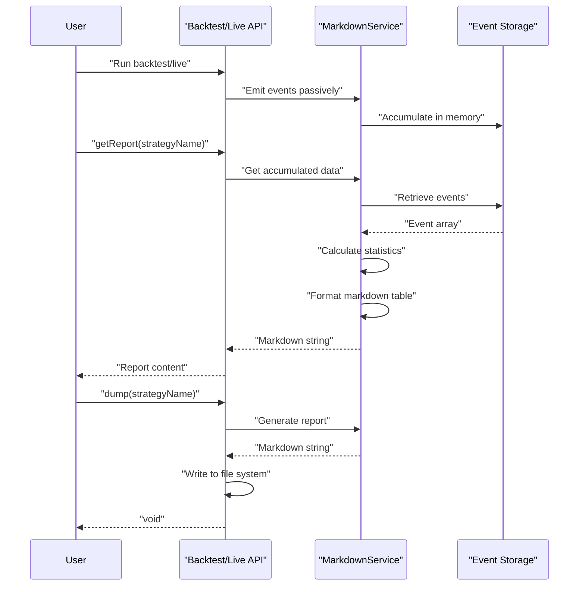
```mermaid
sequenceDiagram
    participant User
    participant API as "Backtest/Live API"
    participant Markdown as "MarkdownService"
    participant Storage as "Event Storage"
    
    User->>API: "Run backtest/live"
    API->>Markdown: "Emit events passively"
    Markdown->>Storage: "Accumulate in memory"
    
    User->>API: "getReport(strategyName)"
    API->>Markdown: "Get accumulated data"
    Markdown->>Storage: "Retrieve events"
    Storage-->>Markdown: "Event array"
    Markdown->>Markdown: "Calculate statistics"
    Markdown->>Markdown: "Format markdown table"
    Markdown-->>API: "Markdown string"
    API-->>User: "Report content"
    
    User->>API: "dump(strategyName)"
    API->>Markdown: "Generate report"
    Markdown-->>API: "Markdown string"
    API->>API: "Write to file system"
    API-->>User: "void"
```

**Sources:**
- [src/lib/services/markdown/BacktestMarkdownService.ts]() (backtest reporting)
- [src/lib/services/markdown/LiveMarkdownService.ts]() (live reporting)
- [src/lib/services/markdown/ScheduleMarkdownService.ts]() (scheduled signals reporting)
- [src/lib/services/logic/public/BacktestLogicPublicService.ts]() (getReport, dump, clear)
- [src/lib/services/logic/public/LiveLogicPublicService.ts]() (getReport, dump, clear)
- [src/classes/Schedule.ts]() (Schedule API wrapper)

---

## Flexible Plugin Architecture

The framework uses a registry pattern with dependency injection to support custom implementations of exchanges, strategies, and timeframes:

### Registration System

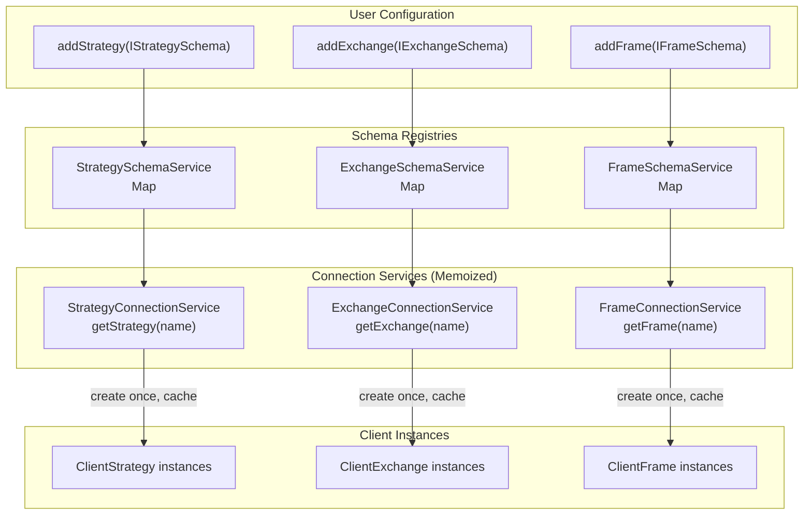
```mermaid
graph TB
    subgraph "User Configuration"
        AddStrategy["addStrategy(IStrategySchema)"]
        AddExchange["addExchange(IExchangeSchema)"]
        AddFrame["addFrame(IFrameSchema)"]
    end
    
    subgraph "Schema Registries"
        StrategyReg["StrategySchemaService<br/>Map<name, schema>"]
        ExchangeReg["ExchangeSchemaService<br/>Map<name, schema>"]
        FrameReg["FrameSchemaService<br/>Map<name, schema>"]
    end
    
    subgraph "Connection Services (Memoized)"
        StrategyConn["StrategyConnectionService<br/>getStrategy(name)"]
        ExchangeConn["ExchangeConnectionService<br/>getExchange(name)"]
        FrameConn["FrameConnectionService<br/>getFrame(name)"]
    end
    
    subgraph "Client Instances"
        CS["ClientStrategy instances"]
        CE["ClientExchange instances"]
        CF["ClientFrame instances"]
    end
    
    AddStrategy --> StrategyReg
    AddExchange --> ExchangeReg
    AddFrame --> FrameReg
    
    StrategyReg --> StrategyConn
    ExchangeReg --> ExchangeConn
    FrameReg --> FrameConn
    
    StrategyConn -->|"create once, cache"| CS
    ExchangeConn -->|"create once, cache"| CE
    FrameConn -->|"create once, cache"| CF
```

### Schema Interfaces

| Schema | Required Methods | Purpose |
|--------|------------------|---------|
| **IStrategySchema** | `getSignal(symbol)` | Define signal generation logic |
| **IExchangeSchema** | `getCandles(symbol, interval, since, limit)` | Provide market data |
| **IFrameSchema** | `startDate`, `endDate`, `interval` | Define backtest period |

### Instance Caching

Connection services use memoization to ensure single instance per schema name:

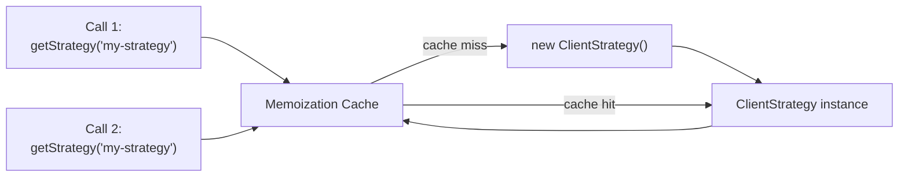
```mermaid
graph LR
    Call1["Call 1:<br/>getStrategy('my-strategy')"]
    Call2["Call 2:<br/>getStrategy('my-strategy')"]
    Memo["Memoization Cache"]
    Instance["ClientStrategy instance"]
    
    Call1 --> Memo
    Memo -->|"cache miss"| Create["new ClientStrategy()"]
    Create --> Instance
    Instance --> Memo
    
    Call2 --> Memo
    Memo -->|"cache hit"| Instance
```

### Custom Implementation Example

Users can implement custom exchanges by providing a schema:

```typescript
// Example pattern (not actual code)
addExchange({
  exchangeName: "custom-db",
  getCandles: async (symbol, interval, since, limit) => {
    // Fetch from PostgreSQL, MongoDB, etc.
    const rows = await db.query(`SELECT * FROM candles WHERE ...`);
    return rows.map(row => ({
      timestamp: row.time,
      open: row.open,
      high: row.high,
      low: row.low,
      close: row.close,
      volume: row.volume
    }));
  },
  formatPrice: async (symbol, price) => price.toFixed(8),
  formatQuantity: async (symbol, qty) => qty.toFixed(8)
});
```

**Sources:**
- [src/function/add.ts]() (addStrategy, addExchange, addFrame)
- [src/lib/services/schema/]() (registry services)
- [src/lib/services/connection/]() (memoized factories)
- [src/interfaces/Strategy.interface.ts:96-106]() (IStrategySchema)
- [src/interfaces/Exchange.interface.ts]() (IExchangeSchema)
- [src/interfaces/Frame.interface.ts:75-86]() (IFrameSchema)

---

## Feature Summary Table

| Feature | Key Components | Primary Benefit |
|---------|----------------|-----------------|
| **Multi-Mode Execution** | `BacktestLogicPrivateService`, `LiveLogicPrivateService` | Single codebase for research and production |
| **Crash-Safe Persistence** | `PersistSignalAdapter`, `FilePersist` | Zero data loss in production crashes |
| **Signal Validation** | `VALIDATE_SIGNAL_FN`, `GET_SIGNAL_FN` | Prevents invalid trades at source |
| **Async Generators** | `execute()` generator methods | Constant memory usage, early termination |
| **Signal Lifecycle** | `IStrategyTickResult` discriminated union | Type-safe state handling |
| **Accurate PNL** | `toProfitLossDto()` | Realistic performance metrics |
| **Interval Throttling** | `_lastSignalTimestamp` check | Controlled signal frequency |
| **VWAP Pricing** | `GET_AVG_PRICE_FN`, `getAveragePrice()` | Better price discovery |
| **Markdown Reports** | `BacktestMarkdownService`, `LiveMarkdownService` | Performance analysis and auditing |
| **Plugin Architecture** | Schema services, connection services | Easy integration with custom data sources |