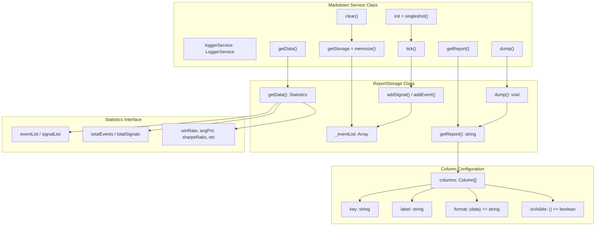
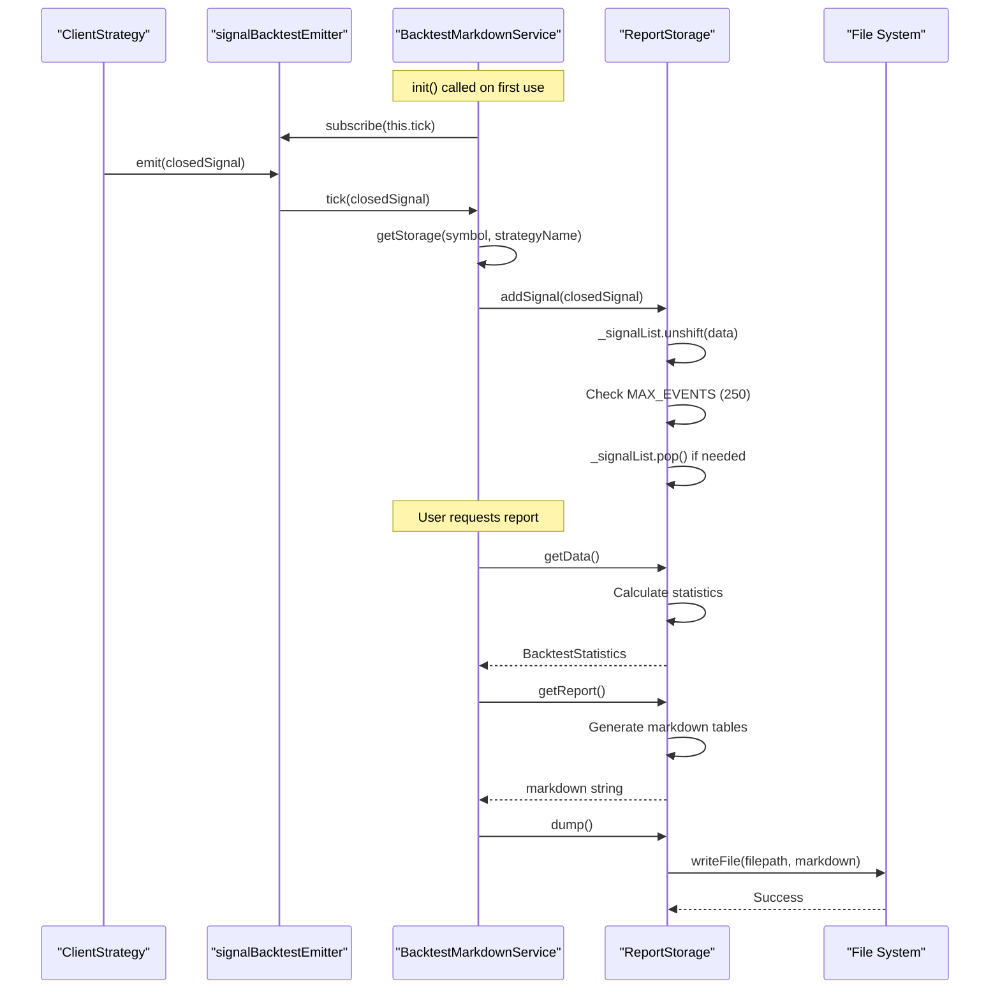
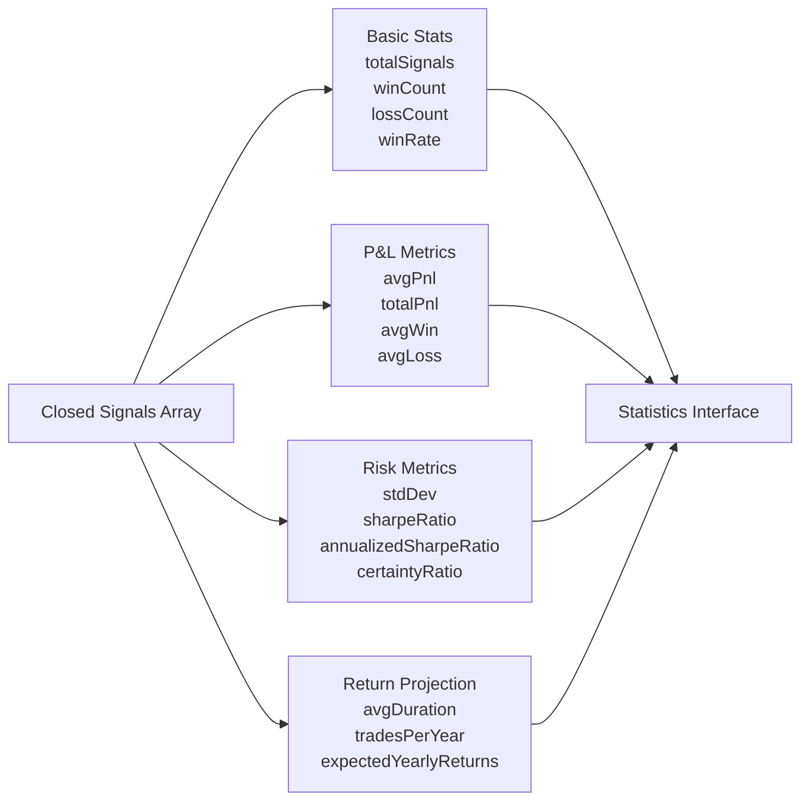
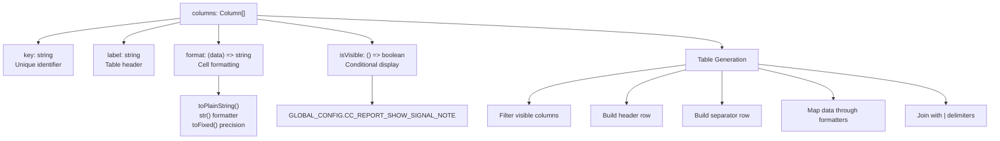
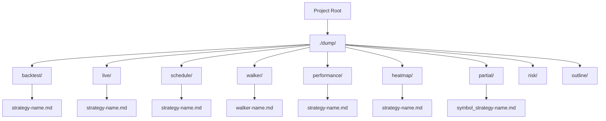
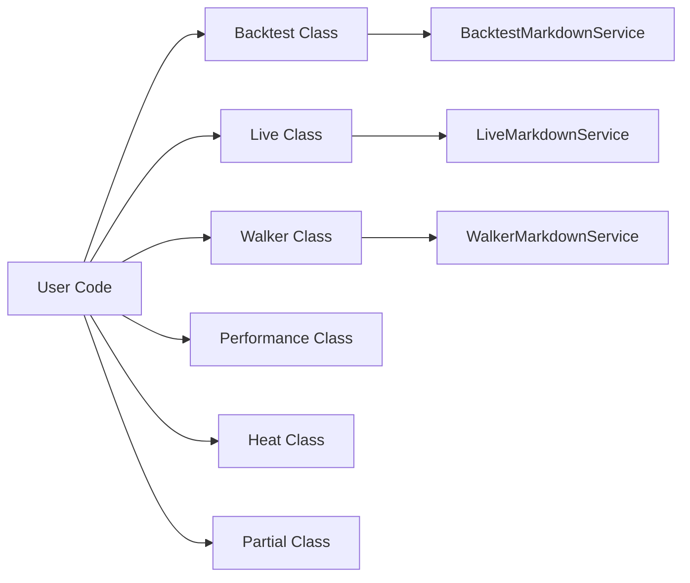
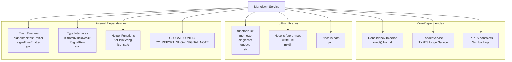

# Markdown Report System

## Purpose and Scope

The Markdown Report System provides comprehensive analytics and reporting capabilities for trading strategy execution. This system consists of 9 specialized markdown services that subscribe to event emitters, accumulate trading data, calculate statistical metrics, and generate human-readable markdown reports. Each service focuses on a specific aspect of strategy performance (backtest results, live trading, scheduled signals, strategy comparison, performance profiling, portfolio heatmaps, partial P/L tracking, risk rejections, and system configuration).

For information about the event system that feeds these reports, see [Event-Driven Architecture](./05-event-driven-architecture.md). For statistics interface types exported from these services, see [Performance Statistics](./31-performance-statistics.md).

---

## System Architecture Overview

```mermaid
graph TB
    subgraph "Event Emitters"
        SIGNAL_BACKTEST["signalBacktestEmitter"]
        SIGNAL_LIVE["signalLiveEmitter"]
        SIGNAL_ALL["signalEmitter"]
        WALKER_EMIT["walkerEmitter"]
        PERFORMANCE_EMIT["performanceEmitter"]
        PARTIAL_PROFIT["partialProfitSubject"]
        PARTIAL_LOSS["partialLossSubject"]
        RISK_SUBJECT["riskSubject"]
    end
    
    subgraph "Markdown Services"
        BACKTEST_MD["BacktestMarkdownService"]
        LIVE_MD["LiveMarkdownService"]
        SCHEDULE_MD["ScheduleMarkdownService"]
        WALKER_MD["WalkerMarkdownService"]
        PERFORMANCE_MD["PerformanceMarkdownService"]
        HEAT_MD["HeatMarkdownService"]
        PARTIAL_MD["PartialMarkdownService"]
        RISK_MD["RiskMarkdownService"]
        OUTLINE_MD["OutlineMarkdownService"]
    end
    
    subgraph "ReportStorage Pattern"
        STORAGE["ReportStorage Class"]
        MEMOIZE["Memoized getStorage()"]
        EVENTS["_eventList / _signalList"]
    end
    
    subgraph "Public API Methods"
        GET_DATA["getData()"]
        GET_REPORT["getReport()"]
        DUMP["dump()"]
        CLEAR["clear()"]
    end
    
    subgraph "Output Files"
        BACKTEST_FILE["./dump/backtest/*.md"]
        LIVE_FILE["./dump/live/*.md"]
        WALKER_FILE["./dump/walker/*.md"]
        PERFORMANCE_FILE["./dump/performance/*.md"]
        HEAT_FILE["./dump/heatmap/*.md"]
    end
    
    SIGNAL_BACKTEST --> BACKTEST_MD
    SIGNAL_LIVE --> LIVE_MD
    SIGNAL_ALL --> SCHEDULE_MD
    SIGNAL_ALL --> HEAT_MD
    WALKER_EMIT --> WALKER_MD
    PERFORMANCE_EMIT --> PERFORMANCE_MD
    PARTIAL_PROFIT --> PARTIAL_MD
    PARTIAL_LOSS --> PARTIAL_MD
    RISK_SUBJECT --> RISK_MD
    
    BACKTEST_MD --> STORAGE
    LIVE_MD --> STORAGE
    SCHEDULE_MD --> STORAGE
    WALKER_MD --> STORAGE
    PERFORMANCE_MD --> STORAGE
    HEAT_MD --> STORAGE
    PARTIAL_MD --> STORAGE
    
    STORAGE --> MEMOIZE
    STORAGE --> EVENTS
    
    BACKTEST_MD --> GET_DATA
    BACKTEST_MD --> GET_REPORT
    BACKTEST_MD --> DUMP
    BACKTEST_MD --> CLEAR
    
    DUMP --> BACKTEST_FILE
    DUMP --> LIVE_FILE
    DUMP --> WALKER_FILE
    DUMP --> PERFORMANCE_FILE
    DUMP --> HEAT_FILE
```



The system implements a consistent **ReportStorage Pattern** across all 9 markdown services. Each service subscribes to specific event emitters, accumulates data in memoized storage instances, and provides three primary methods: `getData()` for retrieving statistics objects, `getReport()` for generating markdown strings, and `dump()` for saving reports to the filesystem.

---

## Markdown Service Catalog

### Service Overview Table

| Service | Event Source | Storage Key | MAX_EVENTS | Default Path | Primary Metric |
|---------|-------------|-------------|------------|--------------|----------------|
| `BacktestMarkdownService` | `signalBacktestEmitter` | `symbol:strategyName` | 250 | `./dump/backtest` | Closed signals only |
| `LiveMarkdownService` | `signalLiveEmitter` | `symbol:strategyName` | 250 | `./dump/live` | All tick types |
| `ScheduleMarkdownService` | `signalEmitter` | `symbol:strategyName` | 250 | `./dump/schedule` | Scheduled/cancelled |
| `WalkerMarkdownService` | `walkerEmitter` | `walkerName` | Unbounded | `./dump/walker` | Strategy comparison |
| `PerformanceMarkdownService` | `performanceEmitter` | `symbol:strategyName` | 10000 | `./dump/performance` | Execution metrics |
| `HeatMarkdownService` | `signalEmitter` | `strategyName` | 250 per symbol | `./dump/heatmap` | Portfolio-wide stats |
| `PartialMarkdownService` | `partialProfitSubject` + `partialLossSubject` | `symbol:strategyName` | 250 | `./dump/partial` | Milestone events |
| `RiskMarkdownService` | `riskSubject` | `symbol:strategyName` | Unbounded | `./dump/risk` | Risk rejections |
| `OutlineMarkdownService` | N/A (direct query) | N/A | N/A | `./dump/outline` | System configuration |

---

## ReportStorage Pattern Architecture



### Pattern Components

**1. Service Initialization**

All markdown services use `singleshot` from `functools-kit` to ensure event subscription happens exactly once:

```typescript
protected init = singleshot(async () => {
  this.loggerService.log("backtestMarkdownService init");
  signalBacktestEmitter.subscribe(this.tick);
});
```

**2. Memoized Storage**

Services use `memoize` to create and cache `ReportStorage` instances per key (typically `symbol:strategyName`):

```typescript
private getStorage = memoize<(symbol: string, strategyName: string) => ReportStorage>(
  ([symbol, strategyName]) => `${symbol}:${strategyName}`,
  () => new ReportStorage()
);
```

**3. Event Accumulation**

The `ReportStorage` class maintains an internal event array with bounds checking:

```typescript
public addSignal(data: IStrategyTickResultClosed) {
  this._signalList.unshift(data);
  
  // Trim queue if exceeded MAX_EVENTS
  if (this._signalList.length > MAX_EVENTS) {
    this._signalList.pop();
  }
}
```

**4. Column-Based Table Generation**

Reports use column configurations to dynamically build markdown tables:

```typescript
interface Column {
  key: string;
  label: string;
  format: (data: IStrategyTickResultClosed) => string;
  isVisible: () => boolean;
}
```

Tables respect `CC_REPORT_SHOW_SIGNAL_NOTE` configuration for conditional column visibility.

---

## Event Flow and Data Accumulation



### Memory Management Strategy

Each markdown service implements bounded queues to prevent memory leaks:

1. **MAX_EVENTS Constant**: Defines maximum events per storage instance
2. **FIFO Queue**: New events added to front with `unshift()`, old events removed from back with `pop()`
3. **Per-Key Isolation**: Each `symbol:strategyName` combination gets its own storage instance

**Exception**: `WalkerMarkdownService` and `RiskMarkdownService` do not enforce MAX_EVENTS bounds because they aggregate across strategy runs and need complete data.

---

## Statistics Calculation

### Backtest and Live Statistics

Both `BacktestMarkdownService` and `LiveMarkdownService` calculate identical metrics:



**Key Formulas:**

| Metric | Formula | Description |
|--------|---------|-------------|
| Win Rate | `(winCount / totalSignals) * 100` | Percentage of profitable trades |
| Sharpe Ratio | `avgPnl / stdDev` | Risk-adjusted return |
| Annualized Sharpe | `sharpeRatio * √365` | Yearly scaled Sharpe ratio |
| Certainty Ratio | `avgWin / \|avgLoss\|` | Average win to average loss ratio |
| Expected Yearly Returns | `avgPnl * (365 / avgDurationDays)` | Projected annual return |

**Safe Math**: All statistics apply `isUnsafe()` checks to return `null` for `NaN`, `Infinity`, or invalid numeric values.

---

## Report-Specific Implementations

### BacktestMarkdownService

**Purpose**: Track closed signals from backtest execution, calculate performance statistics.

**Event Source**: `signalBacktestEmitter` (filtered to `action === "closed"`)

**Storage Key**: `symbol:strategyName`

**Output Example**:
```markdown
# Backtest Report: my-strategy

| Signal ID | Symbol | Position | Open Price | Close Price | PNL (net) | Close Reason | Duration (min) |
|-----------|--------|----------|------------|-------------|-----------|--------------|----------------|
| abc-123   | BTCUSDT| LONG     | 50000 USD  | 52000 USD   | +3.60%    | take_profit  | 120            |

**Total signals:** 45
**Win rate:** 62.22% (28W / 17L) (higher is better)
**Average PNL:** +1.25% (higher is better)
**Sharpe Ratio:** 1.523 (higher is better)
```

---

### LiveMarkdownService

**Purpose**: Track all tick events (idle, opened, active, closed) from live trading execution.

**Event Source**: `signalLiveEmitter` (all action types)

**Storage Key**: `symbol:strategyName`

**Unique Features**:
- Tracks idle events (replaces last idle if no opened/active events follow)
- Tracks active events (replaces last active for same signalId)
- Provides comprehensive live monitoring view

**Output Example**:
```markdown
# Live Trading Report: my-strategy

| Timestamp | Action | Symbol | Signal ID | Position | Current Price | % to TP | % to SL |
|-----------|--------|--------|-----------|----------|---------------|---------|---------|
| 2024-... | ACTIVE | BTCUSDT| abc-123   | LONG     | 51500 USD     | +45.5%  | -12.3%  |
| 2024-... | OPENED | BTCUSDT| abc-123   | LONG     | 50000 USD     | N/A     | N/A     |
| 2024-... | IDLE   | BTCUSDT| N/A       | N/A      | 49800 USD     | N/A     | N/A     |

**Total events:** 123
**Closed signals:** 12
**Win rate:** 58.33%
```

---

### ScheduleMarkdownService

**Purpose**: Track scheduled signals and their activation/cancellation status.

**Event Source**: `signalEmitter` (filtered to `scheduled`, `opened`, `cancelled`)

**Storage Key**: `symbol:strategyName`

**Unique Logic**: Only tracks opened signals that were previously scheduled (checks `scheduledAt !== pendingAt`)

**Statistics Computed**:
- `activationRate`: Percentage of scheduled signals that opened
- `cancellationRate`: Percentage of scheduled signals that cancelled
- `avgActivationTime`: Average wait time for successful activations
- `avgWaitTime`: Average wait time for cancelled signals

---

### WalkerMarkdownService

**Purpose**: Aggregate backtest results across multiple strategies for comparison.

**Event Source**: `walkerEmitter` (progress events from `WalkerLogicPrivateService`)

**Storage Key**: `walkerName` (not per-symbol, aggregates all strategies)

**Unique Features**:
- Unbounded storage (no MAX_EVENTS limit)
- Tracks best strategy by metric value
- Generates comparison table sorted by metric
- Includes PNL table with all signals from all strategies

**Output Structure**:
```markdown
# Walker Comparison Report: my-walker

**Best Strategy:** strategy-A
**Best sharpeRatio:** 2.15

## Top Strategies Comparison

| Rank | Strategy | sharpeRatio | Total Signals | Win Rate | Avg PNL |
|------|----------|-------------|---------------|----------|---------|
| 1    | strategy-A | 2.15      | 45            | 62.22%   | +1.25%  |
| 2    | strategy-B | 1.89      | 38            | 57.89%   | +0.98%  |

## All Signals (PNL Table)

| Strategy | Signal ID | Symbol | Position | PNL (net) | Close Reason |
|----------|-----------|--------|----------|-----------|--------------|
| ...      | ...       | ...    | ...      | ...       | ...          |
```

---

### PerformanceMarkdownService

**Purpose**: Profile execution performance with metrics like duration, percentiles, and wait times.

**Event Source**: `performanceEmitter`

**Storage Key**: `symbol:strategyName`

**MAX_EVENTS**: 10000 (higher than other services to capture statistical significance)

**Unique Features**:
- Groups events by `metricType` (e.g., "getCandles", "tick", "backtest")
- Calculates percentiles (P95, P99) for latency analysis
- Tracks wait times between consecutive events of same type
- Sorts metrics by `totalDuration` to highlight bottlenecks

**Statistics Computed**:

| Metric | Description |
|--------|-------------|
| `count` | Number of samples |
| `totalDuration` | Sum of all durations (ms) |
| `avgDuration` | Mean duration (ms) |
| `minDuration` | Minimum duration (ms) |
| `maxDuration` | Maximum duration (ms) |
| `stdDev` | Standard deviation (ms) |
| `median` | 50th percentile (ms) |
| `p95` | 95th percentile (ms) |
| `p99` | 99th percentile (ms) |
| `avgWaitTime` | Average interval between events (ms) |

---

### HeatMarkdownService

**Purpose**: Generate portfolio-wide heatmap showing per-symbol statistics and aggregated portfolio metrics.

**Event Source**: `signalEmitter` (filtered to `action === "closed"`)

**Storage Key**: `strategyName` (aggregates across all symbols)

**Unique Features**:
- Groups closed signals by symbol
- Calculates per-symbol statistics
- Computes portfolio-wide metrics weighted by trade count
- Sorts symbols by Sharpe ratio (best performers first)

**Per-Symbol Statistics**:
- Total PNL, Sharpe Ratio, Max Drawdown
- Profit Factor (sum wins / sum losses)
- Expectancy (weighted average of avg win/loss by win rate)
- Win/Loss Streaks

**Portfolio Statistics**:
- `portfolioTotalPnl`: Sum of all symbols' total PNL
- `portfolioSharpeRatio`: Trade-count weighted average of Sharpe ratios
- `portfolioTotalTrades`: Total trades across all symbols

---

### PartialMarkdownService

**Purpose**: Track profit/loss milestone events (10%, 20%, 30%, etc) for active signals.

**Event Sources**: `partialProfitSubject`, `partialLossSubject`

**Storage Key**: `symbol:strategyName`

**Event Data**:
- `action`: "profit" or "loss"
- `level`: PartialLevel (10, 20, 30, 40, 50, 60, 70, 80, 90, 100)
- `symbol`, `strategyName`, `signalId`, `position`
- `currentPrice`, `timestamp`, `backtest` flag

**Statistics Computed**:
- `totalEvents`: Total milestone events
- `totalProfit`: Count of profit milestone events
- `totalLoss`: Count of loss milestone events

---

## Column Configuration System



### Column Interface

```typescript
interface Column {
  key: string;           // Unique identifier
  label: string;         // Display header
  format: (data) => string;  // Cell formatter
  isVisible: () => boolean;  // Conditional visibility
}
```

### Example Column Definitions

**BacktestMarkdownService** includes columns for signal details:

```typescript
{
  key: "pnl",
  label: "PNL (net)",
  format: (data) => {
    const pnlPercentage = data.pnl.pnlPercentage;
    return `${pnlPercentage > 0 ? "+" : ""}${pnlPercentage.toFixed(2)}%`;
  },
  isVisible: () => true,
}
```

**Note column** respects global configuration:

```typescript
{
  key: "note",
  label: "Note",
  format: (data) => toPlainString(data.note ?? "N/A"),
  isVisible: () => GLOBAL_CONFIG.CC_REPORT_SHOW_SIGNAL_NOTE,
}
```

---

## File Output Structure



### File Creation Process

All markdown services use Node.js filesystem APIs with atomic writes:

1. **Create Directory**: `mkdir(dir, { recursive: true })` ensures parent directories exist
2. **Generate Filename**: Pattern varies by service (e.g., `{strategyName}.md`, `{symbol}_{strategyName}.md`)
3. **Write File**: `writeFile(filepath, markdown, "utf-8")` writes markdown string
4. **Log Success**: Console log confirms file path

**Default Paths**:

| Service | Default Path | Filename Pattern |
|---------|-------------|------------------|
| BacktestMarkdownService | `./dump/backtest` | `{strategyName}.md` |
| LiveMarkdownService | `./dump/live` | `{strategyName}.md` |
| ScheduleMarkdownService | `./dump/schedule` | `{strategyName}.md` |
| WalkerMarkdownService | `./dump/walker` | `{walkerName}.md` |
| PerformanceMarkdownService | `./dump/performance` | `{strategyName}.md` |
| HeatMarkdownService | `./dump/heatmap` | `{strategyName}.md` |
| PartialMarkdownService | `./dump/partial` | `{symbol}_{strategyName}.md` |

---

## Public API Usage

### Class-Based API

Markdown services are accessed through public static methods on report classes:



### Method Signatures

**Backtest, Live, Schedule, Partial** (symbol + strategyName scope):
```typescript
// Get statistics object
await Backtest.getData(symbol: string, strategyName: string): Promise<BacktestStatistics>

// Generate markdown string
await Backtest.getReport(symbol: string, strategyName: string): Promise<string>

// Save to filesystem
await Backtest.dump(symbol: string, strategyName: string, path?: string): Promise<void>

// Clear accumulated data
await Backtest.clear(ctx?: { symbol: string; strategyName: string }): Promise<void>
```

**Walker** (walkerName scope):
```typescript
await Walker.getData(
  walkerName: string,
  symbol: string,
  metric: WalkerMetric,
  context: { exchangeName: string; frameName: string }
): Promise<WalkerStatistics>

await Walker.getReport(...): Promise<string>
await Walker.dump(...): Promise<void>
```

**Performance** (symbol + strategyName scope):
```typescript
await Performance.getData(symbol: string, strategyName: string): Promise<PerformanceStatistics>
await Performance.getReport(symbol: string, strategyName: string): Promise<string>
await Performance.dump(symbol: string, strategyName: string, path?: string): Promise<void>
```

**Heat** (strategyName scope):
```typescript
await Heat.getData(strategyName: string): Promise<IHeatmapStatistics>
await Heat.getReport(strategyName: string): Promise<string>
await Heat.dump(strategyName: string, path?: string): Promise<void>
await Heat.clear(strategyName?: string): Promise<void>
```

---

## Usage Examples

### Example 1: Backtest Report Generation

```typescript
import { Backtest, listenDoneBacktest } from "backtest-kit";

// Wait for backtest to complete
listenDoneBacktest(async (event) => {
  const { symbol, strategyName } = event;
  
  // Get statistics object
  const stats = await Backtest.getData(symbol, strategyName);
  console.log(`Win Rate: ${stats.winRate}%`);
  console.log(`Sharpe Ratio: ${stats.sharpeRatio}`);
  
  // Generate and save markdown report
  await Backtest.dump(symbol, strategyName);
  // Saves to: ./dump/backtest/{strategyName}.md
});
```

---

### Example 2: Live Trading Report with Custom Path

```typescript
import { Live } from "backtest-kit";

// During live trading execution
setInterval(async () => {
  const stats = await Live.getData("BTCUSDT", "my-strategy");
  
  if (stats.totalClosed > 10) {
    // Save to custom directory
    await Live.dump("BTCUSDT", "my-strategy", "./reports/live");
    // Saves to: ./reports/live/my-strategy.md
  }
}, 60000); // Every minute
```

---

### Example 3: Walker Comparison Report

```typescript
import { Walker, listenWalkerComplete } from "backtest-kit";

listenWalkerComplete(async (results) => {
  const { walkerName, symbol, metric, bestStrategy } = results;
  
  console.log(`Best strategy: ${bestStrategy}`);
  
  // Get detailed results
  const stats = await Walker.getData(
    walkerName,
    symbol,
    metric,
    { exchangeName: "binance", frameName: "1d" }
  );
  
  // Save comparison report
  await Walker.dump(walkerName, symbol, metric, { exchangeName: "binance", frameName: "1d" });
  // Saves to: ./dump/walker/{walkerName}.md
});
```

---

### Example 4: Performance Profiling

```typescript
import { Performance, listenPerformance } from "backtest-kit";

// Monitor performance in real-time
listenPerformance((event) => {
  console.log(`${event.metricType}: ${event.duration.toFixed(2)}ms`);
});

// After execution
const stats = await Performance.getData("BTCUSDT", "my-strategy");

// Find bottlenecks
const sortedMetrics = Object.values(stats.metricStats)
  .sort((a, b) => b.totalDuration - a.totalDuration);

console.log("Slowest operations:");
sortedMetrics.slice(0, 3).forEach(m => {
  console.log(`${m.metricType}: ${m.totalDuration.toFixed(2)}ms total`);
});

await Performance.dump("BTCUSDT", "my-strategy");
```

---

### Example 5: Portfolio Heatmap

```typescript
import { Heat } from "backtest-kit";

// Get portfolio-wide statistics
const heatmap = await Heat.getData("my-strategy");

console.log(`Total symbols: ${heatmap.totalSymbols}`);
console.log(`Portfolio PNL: ${heatmap.portfolioTotalPnl}%`);
console.log(`Portfolio Sharpe: ${heatmap.portfolioSharpeRatio}`);

// Inspect per-symbol breakdown
heatmap.symbols.forEach(row => {
  console.log(`${row.symbol}: ${row.totalPnl}% PNL, ${row.sharpeRatio} Sharpe`);
});

await Heat.dump("my-strategy");
// Saves to: ./dump/heatmap/my-strategy.md
```

---

## Service Dependencies



### Dependency Details

**functools-kit Integration**:
- `memoize`: Cache storage instances by key
- `singleshot`: Ensure init() runs once
- `queued`: Used in event listeners (not directly in services)
- `str`: Format numbers with patterns (used in HeatMarkdownService)

**LoggerService**:
All markdown services inject `LoggerService` for structured logging:
```typescript
private readonly loggerService = inject<LoggerService>(TYPES.loggerService);
```

**Event Emitters**:
Services subscribe to specific emitters based on their domain:
- BacktestMarkdownService → `signalBacktestEmitter`
- LiveMarkdownService → `signalLiveEmitter`
- ScheduleMarkdownService → `signalEmitter`
- WalkerMarkdownService → `walkerEmitter`
- PerformanceMarkdownService → `performanceEmitter`
- HeatMarkdownService → `signalEmitter`
- PartialMarkdownService → `partialProfitSubject` + `partialLossSubject`
- RiskMarkdownService → `riskSubject`

---

## Error Handling and Edge Cases

### Safe Math Implementation

All statistics calculations use `isUnsafe()` checks to prevent invalid values:

```typescript
function isUnsafe(value: number | null): boolean {
  if (typeof value !== "number") return true;
  if (isNaN(value)) return true;
  if (!isFinite(value)) return true;
  return false;
}

// Usage in statistics calculation
winRate: isUnsafe(winRate) ? null : winRate,
sharpeRatio: isUnsafe(sharpeRatio) ? null : sharpeRatio,
```

This ensures reports display `"N/A"` for undefined/invalid metrics rather than displaying `NaN` or `Infinity`.

---

### Empty Data Handling

All `getData()` methods return valid statistics interfaces even when no data exists:

```typescript
if (this._signalList.length === 0) {
  return {
    signalList: [],
    totalSignals: 0,
    winCount: 0,
    lossCount: 0,
    winRate: null,
    avgPnl: null,
    totalPnl: null,
    stdDev: null,
    sharpeRatio: null,
    // ... all other metrics as null
  };
}
```

Reports display informative messages when no data is available:

```markdown
# Backtest Report: my-strategy

No signals closed yet.
```

---

### Memory Bounds Enforcement

Services protect against memory leaks by enforcing MAX_EVENTS limits:

```typescript
const MAX_EVENTS = 250;

public addSignal(data: IStrategyTickResultClosed) {
  this._signalList.unshift(data);
  
  if (this._signalList.length > MAX_EVENTS) {
    this._signalList.pop();  // Remove oldest event
  }
}
```

**Trade-off**: Older data is discarded when limit is reached. For complete historical analysis, use custom event listeners to store data externally.

**Exceptions**: WalkerMarkdownService and RiskMarkdownService do not enforce bounds because they need complete aggregation.

---

### File System Error Handling

All `dump()` methods wrap filesystem operations in try-catch blocks:

```typescript
public async dump(strategyName: string, path = "./dump/backtest"): Promise<void> {
  const markdown = await this.getReport(strategyName);
  
  try {
    const dir = join(process.cwd(), path);
    await mkdir(dir, { recursive: true });
    
    const filename = `${strategyName}.md`;
    const filepath = join(dir, filename);
    
    await writeFile(filepath, markdown, "utf-8");
    console.log(`Backtest report saved: ${filepath}`);
  } catch (error) {
    console.error(`Failed to save markdown report:`, error);
  }
}
```

Errors are logged but do not crash the application.

---

## Performance Considerations

### Memoization Benefits

Using `memoize` for `getStorage()` provides:
1. **Instance Reuse**: Same storage instance returned for same key
2. **Memory Efficiency**: Only one storage per `symbol:strategyName` pair
3. **O(1) Lookup**: Hash-based key lookup

### Singleshot Initialization

Using `singleshot` for `init()` ensures:
1. **Event subscription happens once**: Prevents duplicate subscriptions
2. **Lazy initialization**: Init only runs when first method is called
3. **Thread-safe**: functools-kit guarantees single execution

### Data Structure Choices

**Array with unshift/pop**:
- Fast insertion at front: O(1) amortized
- Fast removal from back: O(1)
- Trade-off: Array shifting may be slower than linked list for very large MAX_EVENTS

**Alternative considered**: Circular buffer for better performance at high volumes.

---

## Testing Considerations

### Mocking Strategies

To test markdown services in isolation:

1. **Mock Event Emitters**: Create test Subject instances
2. **Inject Test Data**: Call `addSignal()` directly on storage
3. **Assert Statistics**: Validate getData() output
4. **Mock Filesystem**: Use in-memory filesystem or mock writeFile

### Example Test Pattern

```typescript
// Create service instance
const service = new BacktestMarkdownService();

// Get storage instance
const storage = service['getStorage']("BTCUSDT", "test-strategy");

// Inject test data
storage.addSignal({
  action: "closed",
  signal: { id: "test-1", symbol: "BTCUSDT", strategyName: "test-strategy", /* ... */ },
  pnl: { pnlPercentage: 5.0 },
  closeReason: "take_profit",
  /* ... */
});

// Assert statistics
const stats = await service.getData("BTCUSDT", "test-strategy");
expect(stats.totalSignals).toBe(1);
expect(stats.winCount).toBe(1);
```

### Clear Method for Test Cleanup

All services provide `clear()` method for test isolation:

```typescript
await service.clear({ symbol: "BTCUSDT", strategyName: "test-strategy" });
```

