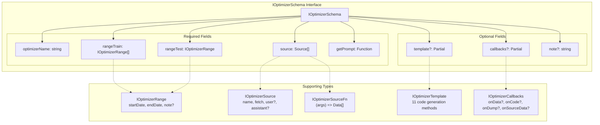
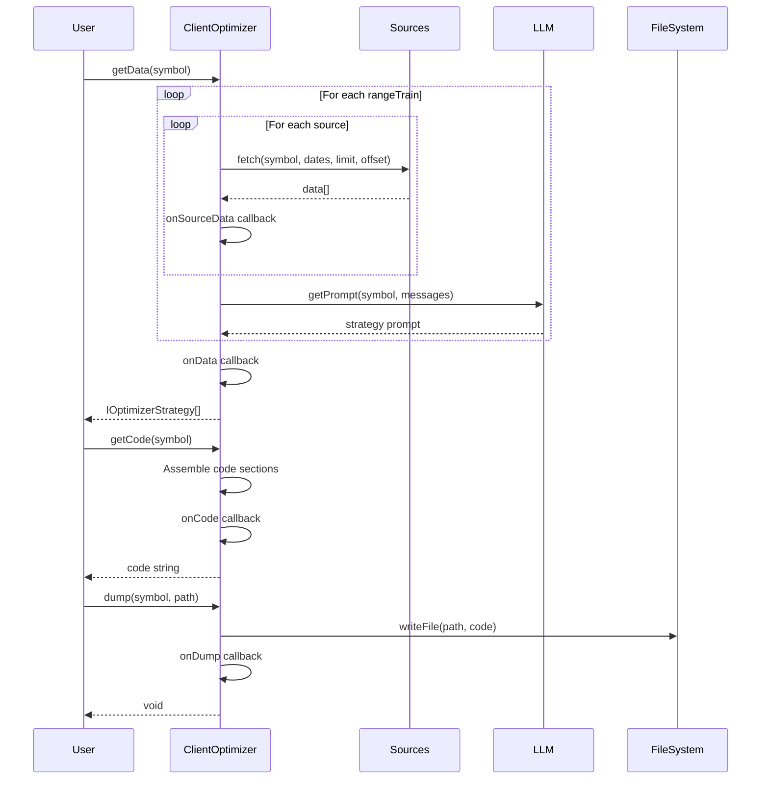
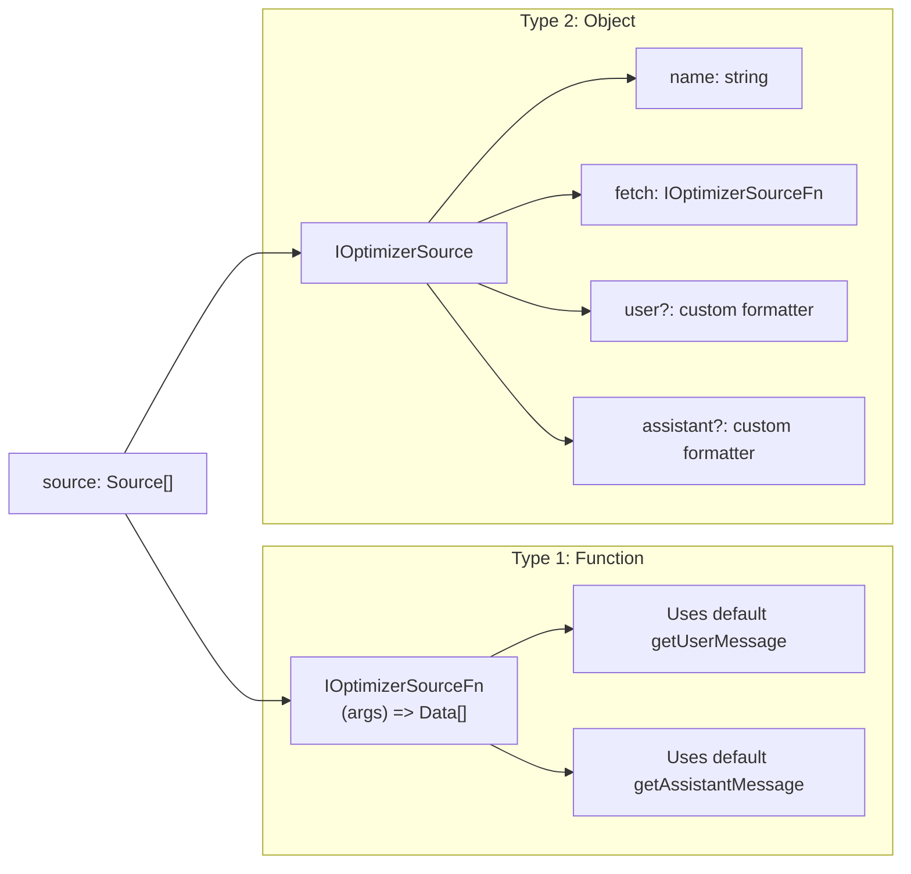
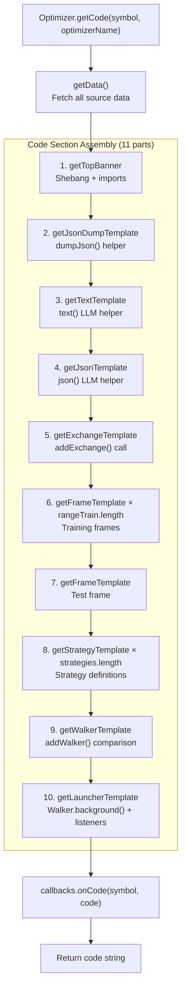
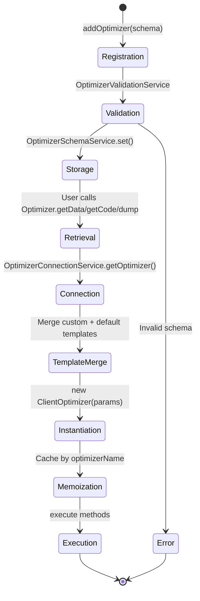

# Optimizer Schemas

## Purpose and Scope

This page documents the `IOptimizerSchema` interface that defines the contract for registering AI-powered strategy optimizers via `addOptimizer()`. Optimizer schemas configure data collection pipelines, LLM-driven strategy generation, and code export functionality. 

For implementation details of the optimizer system, see [AI-Powered Strategy Optimization](#16.5). For other component registration interfaces, see [Strategy Schemas](#5.1), [Exchange Schemas](#5.2), and [Walker Schemas](#5.6).

Sources: [src/interfaces/Optimizer.interface.ts:380-433]()

---

## Schema Structure Overview



**Diagram: Optimizer Schema Interface Structure**

The schema separates required configuration (training/test ranges, data sources, prompt generation) from optional customization (template overrides, lifecycle hooks). All fields are validated during registration.

Sources: [src/interfaces/Optimizer.interface.ts:380-433](), [src/lib/services/connection/OptimizerConnectionService.ts:59-113]()

---

## Required Fields

### optimizerName

**Type:** `OptimizerName` (string)

**Purpose:** Unique identifier for retrieving the optimizer instance from the registry.

```typescript
optimizerName: "my-optimizer"
```

The optimizer name is used as the memoization key in `OptimizerConnectionService.getOptimizer()` and becomes part of generated file names (`{optimizerName}_{symbol}.mjs`). Names should be filesystem-safe and descriptive.

Sources: [src/interfaces/Optimizer.interface.ts:390](), [src/client/ClientOptimizer.ts:371]()

---

### rangeTrain

**Type:** `IOptimizerRange[]`

**Purpose:** Array of training time ranges. Each range generates a separate strategy variant by collecting data from all sources within that period.

```typescript
interface IOptimizerRange {
  note?: string;        // Optional description
  startDate: Date;      // Range start (inclusive)
  endDate: Date;        // Range end (inclusive)
}
```

**Example Configuration:**

```typescript
rangeTrain: [
  {
    note: "Bull market period",
    startDate: new Date("2024-01-01T00:00:00Z"),
    endDate: new Date("2024-01-07T23:59:59Z"),
  },
  {
    note: "Bear market period", 
    startDate: new Date("2024-02-01T00:00:00Z"),
    endDate: new Date("2024-02-07T23:59:59Z"),
  }
]
```

Each range produces one strategy by:
1. Iterating through all configured sources
2. Fetching data for the range from each source
3. Building LLM conversation history
4. Calling `getPrompt()` to generate strategy logic

The generated strategies are later compared via Walker on the test range.

Sources: [src/interfaces/Optimizer.interface.ts:16-32](), [src/interfaces/Optimizer.interface.ts:396](), [src/client/ClientOptimizer.ts:104-198]()

---

### rangeTest

**Type:** `IOptimizerRange`

**Purpose:** Single testing time range for strategy validation. Generated strategies are backtested on this range via Walker to identify the best performer.

```typescript
rangeTest: {
  note: "Validation period",
  startDate: new Date("2024-03-01T00:00:00Z"),
  endDate: new Date("2024-03-07T23:59:59Z"),
}
```

The test range should be chronologically after training ranges to prevent look-ahead bias. The generated code creates a Frame for this range and uses it in Walker configuration.

Sources: [src/interfaces/Optimizer.interface.ts:402](), [src/client/ClientOptimizer.ts:286-296]()

---

### source

**Type:** `Source[]` (union of `IOptimizerSourceFn | IOptimizerSource`)

**Purpose:** Array of data sources for LLM context building. Sources can be simple fetch functions or full configuration objects with custom message formatters.

#### Simple Source (Function)

```typescript
source: [
  async ({ symbol, startDate, endDate, limit, offset }) => {
    // Fetch and return data with pagination
    const response = await fetchApi(`/api/data?symbol=${symbol}&limit=${limit}&offset=${offset}`);
    return response.data; // Must have { id: string | number }
  }
]
```

#### Full Source Configuration

```typescript
source: [
  {
    name: "long-term-range",
    fetch: async ({ symbol, startDate, endDate, limit, offset }) => {
      const url = new URL(`${process.env.CCXT_DUMPER_URL}/view/long-term-range`);
      url.searchParams.set("symbol", symbol);
      url.searchParams.set("startDate", startDate.getTime());
      url.searchParams.set("endDate", endDate.getTime());
      url.searchParams.set("limit", limit || 1000);
      url.searchParams.set("offset", offset || 0);
      const { data, error } = await fetchApi(url);
      if (error) throw new Error(error);
      return data.rows;
    },
    user: (symbol, data, name) => {
      // Format data as markdown table for LLM
      return `# 1-Hour Candles for ${symbol}\n\n${arrayToMarkdownTable(data)}`;
    },
    assistant: () => "Historical data processed"
  }
]
```

**Data Requirements:**

All data returned from sources must implement `IOptimizerData`:

```typescript
interface IOptimizerData {
  id: string | number;  // Required for deduplication
  // ... additional fields
}
```

**Pagination Handling:**

Sources are automatically paginated using `iterateDocuments()` with a limit of 25 records per request. The `fetch` function receives `limit` and `offset` parameters and should return an array. Empty arrays signal end of pagination.

Sources: [src/interfaces/Optimizer.interface.ts:129-186](), [src/interfaces/Optimizer.interface.ts:408](), [src/client/ClientOptimizer.ts:70-88](), [src/client/ClientOptimizer.ts:104-198](), [demo/optimization/src/index.mjs:66-127]()

---

### getPrompt

**Type:** `(symbol: string, messages: MessageModel[]) => string | Promise<string>`

**Purpose:** Generates strategy logic description from accumulated LLM conversation history. Called once per training range after all sources are processed.

```typescript
getPrompt: async (symbol, messages) => {
  const ollama = new Ollama({
    host: "https://ollama.com",
    headers: {
      Authorization: `Bearer ${process.env.OLLAMA_API_KEY}`,
    },
  });

  const response = await ollama.chat({
    model: "deepseek-v3.1:671b",
    messages: [
      {
        role: "system",
        content: "Generate a trading strategy based on the provided market data."
      },
      ...messages,
      {
        role: "user",
        content: `What are the optimal entry/exit conditions for ${symbol}?`
      }
    ]
  });

  return response.message.content.trim();
}
```

**Message Structure:**

The `messages` array contains all user/assistant message pairs from source processing:

```typescript
interface MessageModel {
  role: "user" | "assistant" | "system";
  content: string;
}
```

For each source, two messages are added:
1. User message with formatted data (from `source.user()` or `getUserMessage()`)
2. Assistant acknowledgment (from `source.assistant()` or `getAssistantMessage()`)

The returned strategy prompt is embedded into generated code via `getStrategyTemplate()` and used by the strategy's runtime LLM calls for signal generation.

Sources: [src/interfaces/Optimizer.interface.ts:418-421](), [src/model/Message.model.ts:1-5](), [src/client/ClientOptimizer.ts:196](), [src/lib/services/template/OptimizerTemplateService.ts:166-298]()

---

## Optional Fields

### template

**Type:** `Partial<IOptimizerTemplate>`

**Purpose:** Override default code generation templates from `OptimizerTemplateService`. All 11 template methods are optional; unspecified methods use framework defaults.

```typescript
interface IOptimizerTemplate {
  getTopBanner(symbol: string): string | Promise<string>;
  getUserMessage<Data>(symbol: string, data: Data[], name: string): string | Promise<string>;
  getAssistantMessage<Data>(symbol: string, data: Data[], name: string): string | Promise<string>;
  getWalkerTemplate(walkerName: string, exchangeName: string, frameName: string, strategies: string[]): string | Promise<string>;
  getExchangeTemplate(symbol: string, exchangeName: string): string | Promise<string>;
  getFrameTemplate(symbol: string, frameName: string, interval: CandleInterval, startDate: Date, endDate: Date): string | Promise<string>;
  getStrategyTemplate(strategyName: string, interval: string, prompt: string): string | Promise<string>;
  getLauncherTemplate(symbol: string, walkerName: string): string | Promise<string>;
  getTextTemplate(symbol: string): string | Promise<string>;
  getJsonTemplate(symbol: string): string | Promise<string>;
  getJsonDumpTemplate(symbol: string): string | Promise<string>;
}
```

#### Template Method Roles

| Method | Purpose | Generated Code |
|--------|---------|----------------|
| `getTopBanner` | Shebang and imports | `#!/usr/bin/env node`, Ollama, backtest-kit imports |
| `getUserMessage` | Default data → user prompt | Markdown table with indicators |
| `getAssistantMessage` | Default acknowledgment | "ОК" or custom response |
| `getWalkerTemplate` | Walker configuration | `addWalker({ ... })` |
| `getExchangeTemplate` | Exchange integration | `addExchange({ getCandles, ... })` |
| `getFrameTemplate` | Timeframe bounds | `addFrame({ startDate, endDate, ... })` |
| `getStrategyTemplate` | Strategy with LLM | `addStrategy({ getSignal: async () => { /* LLM call */ } })` |
| `getLauncherTemplate` | Execution + listeners | `Walker.background()`, event subscriptions |
| `getTextTemplate` | LLM text helper | `async function text(messages)` |
| `getJsonTemplate` | LLM JSON helper | `async function json(messages)` with schema |
| `getJsonDumpTemplate` | Debug output helper | `async function dumpJson(resultId, history, result)` |

**Customization Example:**

```typescript
template: {
  getStrategyTemplate: async (strategyName, interval, prompt) => {
    return `
addStrategy({
  strategyName: "${strategyName}",
  interval: "${interval}",
  getSignal: async (symbol) => {
    // Custom signal logic instead of LLM
    const candles = await getCandles(symbol, "5m", 20);
    const lastClose = candles[candles.length - 1].close;
    
    if (lastClose > 50000) {
      return { position: "long", priceOpen: lastClose, ... };
    }
    return { position: "wait" };
  }
});`;
  }
}
```

Template merging happens in `OptimizerConnectionService.getOptimizer()` where custom methods override defaults while preserving unspecified methods.

Sources: [src/interfaces/Optimizer.interface.ts:242-374](), [src/interfaces/Optimizer.interface.ts:427](), [src/lib/services/template/OptimizerTemplateService.ts:26-710](), [src/lib/services/connection/OptimizerConnectionService.ts:70-97]()

---

### callbacks

**Type:** `Partial<IOptimizerCallbacks>`

**Purpose:** Lifecycle hooks for monitoring optimizer execution. All callbacks are optional and receive relevant context data.

```typescript
interface IOptimizerCallbacks {
  onData?: (symbol: string, strategyData: IOptimizerStrategy[]) => void | Promise<void>;
  onCode?: (symbol: string, code: string) => void | Promise<void>;
  onDump?: (symbol: string, filepath: string) => void | Promise<void>;
  onSourceData?: <Data extends IOptimizerData = any>(
    symbol: string,
    sourceName: string,
    data: Data[],
    startDate: Date,
    endDate: Date
  ) => void | Promise<void>;
}
```

#### Callback Invocation Points



**Diagram: Callback Invocation Sequence**

**Usage Example:**

```typescript
callbacks: {
  onSourceData: async (symbol, sourceName, data, startDate, endDate) => {
    console.log(`Fetched ${data.length} records from ${sourceName}`);
    console.log(`Date range: ${startDate.toISOString()} to ${endDate.toISOString()}`);
  },
  
  onData: async (symbol, strategyData) => {
    console.log(`Generated ${strategyData.length} strategies for ${symbol}`);
    await fs.writeFile(
      `./logs/${symbol}_strategies.json`,
      JSON.stringify(strategyData, null, 2)
    );
  },
  
  onCode: async (symbol, code) => {
    const lines = code.split('\n').length;
    console.log(`Generated ${lines} lines of code for ${symbol}`);
  },
  
  onDump: async (symbol, filepath) => {
    console.log(`Saved optimizer output to ${filepath}`);
    // Could trigger CI/CD pipeline here
  }
}
```

Callbacks execute sequentially and block further processing if they return promises. They cannot modify data but can perform side effects like logging, metrics collection, or validation.

Sources: [src/interfaces/Optimizer.interface.ts:191-236](), [src/interfaces/Optimizer.interface.ts:432](), [src/client/ClientOptimizer.ts:122-130](), [src/client/ClientOptimizer.ts:161-168](), [src/client/ClientOptimizer.ts:210-212](), [src/client/ClientOptimizer.ts:345-347](), [src/client/ClientOptimizer.ts:377-379]()

---

## Data Source Configuration Details

### Source Type Union

The `source` array accepts two types of entries:



**Diagram: Source Type Variants**

### Fetch Function Contract

```typescript
interface IOptimizerFetchArgs {
  symbol: string;      // Trading pair (e.g., "BTCUSDT")
  startDate: Date;     // Range start
  endDate: Date;       // Range end
  limit: number;       // Records per request (25)
  offset: number;      // Skip count for pagination
}

interface IOptimizerSourceFn<Data extends IOptimizerData> {
  (args: IOptimizerFetchArgs): Data[] | Promise<Data[]>;
}
```

**Implementation Requirements:**

1. **Pagination Support:** Return empty array when no more data
2. **ID Field:** All returned objects must have unique `id` property
3. **Date Filtering:** Respect `startDate` and `endDate` boundaries
4. **Limit/Offset:** Honor pagination parameters for large datasets

**Pagination Flow:**

```typescript
// Internal pagination logic (iterateDocuments)
let offset = 0;
const limit = 25;
const allData = [];

while (true) {
  const batch = await fetch({ symbol, startDate, endDate, limit, offset });
  if (batch.length === 0) break;  // End of data
  
  allData.push(...batch);
  offset += limit;
}

// Deduplication by id field
const uniqueData = distinctDocuments(allData, (data) => data.id);
```

Sources: [src/interfaces/Optimizer.interface.ts:71-94](), [src/interfaces/Optimizer.interface.ts:129-177](), [src/client/ClientOptimizer.ts:70-88](), [demo/optimization/src/index.mjs:69-84]()

---

## Registration and Usage

### Registration with addOptimizer

```typescript
import { addOptimizer } from "backtest-kit";

addOptimizer({
  optimizerName: "trend-analyzer",
  
  rangeTrain: [
    {
      note: "Week 1",
      startDate: new Date("2024-01-01T00:00:00Z"),
      endDate: new Date("2024-01-07T23:59:59Z"),
    },
    {
      note: "Week 2",
      startDate: new Date("2024-01-08T00:00:00Z"),
      endDate: new Date("2024-01-14T23:59:59Z"),
    },
  ],
  
  rangeTest: {
    note: "Week 3 validation",
    startDate: new Date("2024-01-15T00:00:00Z"),
    endDate: new Date("2024-01-21T23:59:59Z"),
  },
  
  source: [
    {
      name: "hourly-candles",
      fetch: async ({ symbol, startDate, endDate, limit, offset }) => {
        const response = await fetch(
          `https://api.exchange.com/candles?symbol=${symbol}&interval=1h&limit=${limit}&offset=${offset}`
        );
        return response.json();
      },
      user: (symbol, data) => {
        return `Analyze ${data.length} hourly candles for ${symbol}`;
      },
      assistant: () => "Hourly data processed"
    }
  ],
  
  getPrompt: async (symbol, messages) => {
    const ollama = new Ollama({
      host: "https://ollama.com",
      headers: { Authorization: `Bearer ${process.env.OLLAMA_API_KEY}` },
    });
    
    const response = await ollama.chat({
      model: "deepseek-v3.1:671b",
      messages: [
        { role: "system", content: "Generate trading strategy from data" },
        ...messages,
        { 
          role: "user",
          content: `Create strategy for ${symbol} with clear entry/exit rules`
        }
      ]
    });
    
    return response.message.content.trim();
  },
  
  callbacks: {
    onData: (symbol, strategies) => {
      console.log(`Generated ${strategies.length} strategies for ${symbol}`);
    },
    onDump: (symbol, filepath) => {
      console.log(`Saved to ${filepath}`);
    }
  }
});
```

Sources: [demo/optimization/src/index.mjs:1-320]()

---

### Execution Methods

After registration, the optimizer exposes three methods via the `Optimizer` utility:

```typescript
import { Optimizer, listenOptimizerProgress } from "backtest-kit";

// 1. getData(): Fetch data and generate strategies
const strategies = await Optimizer.getData("BTCUSDT", "trend-analyzer");
console.log(strategies);
// [
//   {
//     symbol: "BTCUSDT",
//     name: "hourly-candles",
//     messages: [...],
//     strategy: "Buy when RSI < 30, sell when RSI > 70..."
//   },
//   ...
// ]

// 2. getCode(): Generate executable code
const code = await Optimizer.getCode("BTCUSDT", "trend-analyzer");
console.log(code);
// "#!/usr/bin/env node\n\nimport { Ollama } from 'ollama';\n..."

// 3. dump(): Save code to file
await Optimizer.dump("BTCUSDT", "trend-analyzer", "./output");
// Creates: ./output/trend-analyzer_BTCUSDT.mjs

// Listen to progress events
listenOptimizerProgress((event) => {
  console.log(`Progress: ${(event.progress * 100).toFixed(2)}%`);
  console.log(`Processed: ${event.processedSources} / ${event.totalSources}`);
});
```

#### Code Assembly Pipeline



**Diagram: Code Generation Pipeline**

The generated file is a standalone Node.js module that can be executed directly:

```bash
# Execute generated strategy comparison
chmod +x ./output/trend-analyzer_BTCUSDT.mjs
./output/trend-analyzer_BTCUSDT.mjs
```

Sources: [src/client/ClientOptimizer.ts:225-350](), [src/lib/services/connection/OptimizerConnectionService.ts:122-171]()

---

## Schema Validation

Optimizer schemas are validated during registration by `OptimizerValidationService` and stored in `OptimizerSchemaService`. Key validation rules:

| Field | Validation |
|-------|-----------|
| `optimizerName` | Must be non-empty string, no duplicate names |
| `rangeTrain` | Must be non-empty array, valid Date objects |
| `rangeTest` | Must have valid Date objects, should be after train ranges |
| `source` | Must be non-empty array, all entries must have `fetch` function |
| `getPrompt` | Must be a function returning string or Promise<string> |
| `template` | If provided, all overrides must be functions |
| `callbacks` | If provided, all hooks must be functions |

Validation failures throw descriptive errors at registration time, preventing runtime failures.

Sources: [src/lib/services/validation/OptimizerValidationService.ts]() (not shown but inferred from pattern), [src/lib/services/schema/OptimizerSchemaService.ts]() (not shown but inferred from pattern)

---

## Schema Lifecycle



**Diagram: Schema Registration and Lifecycle**

1. **Registration:** User calls `addOptimizer()` with schema
2. **Validation:** Schema structure and types verified
3. **Storage:** Valid schema stored in registry by `optimizerName`
4. **Retrieval:** User executes `Optimizer.*` methods
5. **Connection:** Service retrieves schema and creates client
6. **Template Merge:** Custom templates override defaults
7. **Instantiation:** `ClientOptimizer` created with merged config
8. **Memoization:** Instance cached for repeated calls
9. **Execution:** Methods execute with injected dependencies

Sources: [src/lib/services/connection/OptimizerConnectionService.ts:59-113]()

---

## Complete Example

Below is a full working example integrating all schema components:

```typescript
import { addOptimizer, Optimizer, listenOptimizerProgress } from "backtest-kit";
import { Ollama } from "ollama";
import { fetchApi } from "functools-kit";

// Register optimizer with all features
addOptimizer({
  optimizerName: "multi-timeframe-optimizer",
  
  // Train on 3 different weeks
  rangeTrain: [
    {
      note: "Bullish week",
      startDate: new Date("2024-01-01T00:00:00Z"),
      endDate: new Date("2024-01-07T23:59:59Z"),
    },
    {
      note: "Bearish week",
      startDate: new Date("2024-01-08T00:00:00Z"),
      endDate: new Date("2024-01-14T23:59:59Z"),
    },
    {
      note: "Sideways week",
      startDate: new Date("2024-01-15T00:00:00Z"),
      endDate: new Date("2024-01-21T23:59:59Z"),
    },
  ],
  
  // Test on week 4
  rangeTest: {
    note: "Validation week",
    startDate: new Date("2024-01-22T00:00:00Z"),
    endDate: new Date("2024-01-28T23:59:59Z"),
  },
  
  // Multiple data sources
  source: [
    {
      name: "1h-candles",
      fetch: async ({ symbol, startDate, endDate, limit, offset }) => {
        const url = new URL(`${process.env.API_URL}/candles-1h`);
        url.searchParams.set("symbol", symbol);
        url.searchParams.set("start", startDate.getTime().toString());
        url.searchParams.set("end", endDate.getTime().toString());
        url.searchParams.set("limit", limit.toString());
        url.searchParams.set("offset", offset.toString());
        
        const { data } = await fetchApi(url);
        return data.map((candle) => ({
          id: candle.timestamp,
          timestamp: candle.timestamp,
          open: candle.open,
          high: candle.high,
          low: candle.low,
          close: candle.close,
          volume: candle.volume,
          rsi: candle.indicators.rsi,
          macd: candle.indicators.macd,
        }));
      },
      user: (symbol, data) => {
        return [
          `# 1-Hour Analysis for ${symbol}`,
          ``,
          `Candles: ${data.length}`,
          `Latest RSI: ${data[data.length - 1].rsi}`,
          `Latest MACD: ${data[data.length - 1].macd}`,
        ].join('\n');
      },
      assistant: () => "1h timeframe analyzed"
    },
    {
      name: "15m-candles",
      fetch: async ({ symbol, startDate, endDate, limit, offset }) => {
        const url = new URL(`${process.env.API_URL}/candles-15m`);
        url.searchParams.set("symbol", symbol);
        url.searchParams.set("start", startDate.getTime().toString());
        url.searchParams.set("end", endDate.getTime().toString());
        url.searchParams.set("limit", limit.toString());
        url.searchParams.set("offset", offset.toString());
        
        const { data } = await fetchApi(url);
        return data.map((candle) => ({
          id: `${candle.timestamp}-15m`,
          timestamp: candle.timestamp,
          close: candle.close,
          stochK: candle.indicators.stochK,
          stochD: candle.indicators.stochD,
        }));
      },
      user: (symbol, data) => {
        return `15-minute data: ${data.length} candles, latest Stoch: ${data[data.length - 1].stochK}`;
      },
      assistant: () => "15m timeframe analyzed"
    }
  ],
  
  // Generate strategy from LLM
  getPrompt: async (symbol, messages) => {
    const ollama = new Ollama({
      host: "https://ollama.com",
      headers: {
        Authorization: `Bearer ${process.env.OLLAMA_API_KEY}`,
      },
    });
    
    const response = await ollama.chat({
      model: "deepseek-v3.1:671b",
      messages: [
        {
          role: "system",
          content: [
            "You are a quantitative trading strategist.",
            "Analyze the provided multi-timeframe data and create entry/exit rules.",
            "Focus on clear conditions using technical indicators."
          ].join('\n')
        },
        ...messages,
        {
          role: "user",
          content: [
            `Create a trading strategy for ${symbol} based on the analyzed data.`,
            "Include specific entry conditions, exit conditions, and risk parameters.",
            "Format: Entry when [conditions]. Exit when [conditions]. Stop loss at [level]."
          ].join('\n')
        }
      ]
    });
    
    return response.message.content.trim();
  },
  
  // Optional: Customize code generation
  template: {
    getStrategyTemplate: async (strategyName, interval, prompt) => {
      // Custom strategy template with additional logging
      return `
addStrategy({
  strategyName: "${strategyName}",
  interval: "${interval}",
  getSignal: async (symbol) => {
    console.log("[${strategyName}] Analyzing ${symbol}...");
    
    const messages = [];
    const candles1h = await getCandles(symbol, "1h", 24);
    const candles15m = await getCandles(symbol, "15m", 48);
    
    messages.push(
      { role: "user", content: formatCandles(candles1h, "1h") },
      { role: "assistant", content: "1h analyzed" },
      { role: "user", content: formatCandles(candles15m, "15m") },
      { role: "assistant", content: "15m analyzed" },
      { 
        role: "user",
        content: [
          "Strategy rules:",
          \`${prompt}\`,
          "",
          "Generate signal based on current market conditions"
        ].join("\\n")
      }
    );
    
    const signal = await json(messages);
    console.log("[${strategyName}] Signal:", signal.position);
    
    return signal;
  }
});`;
    }
  },
  
  // Optional: Lifecycle callbacks
  callbacks: {
    onSourceData: async (symbol, sourceName, data, startDate, endDate) => {
      console.log(`[${sourceName}] Fetched ${data.length} records for ${symbol}`);
      console.log(`  Date range: ${startDate.toISOString()} to ${endDate.toISOString()}`);
    },
    
    onData: async (symbol, strategies) => {
      console.log(`Generated ${strategies.length} strategy variants for ${symbol}`);
      for (const strategy of strategies) {
        console.log(`  - ${strategy.name}: ${strategy.messages.length} messages`);
      }
    },
    
    onCode: async (symbol, code) => {
      const lines = code.split('\n').length;
      const sizeKB = Buffer.byteLength(code, 'utf8') / 1024;
      console.log(`Generated code: ${lines} lines, ${sizeKB.toFixed(2)} KB`);
    },
    
    onDump: async (symbol, filepath) => {
      console.log(`Strategy saved to: ${filepath}`);
    }
  }
});

// Execute optimizer
listenOptimizerProgress((event) => {
  const pct = (event.progress * 100).toFixed(1);
  console.log(`Progress: ${pct}% (${event.processedSources}/${event.totalSources})`);
});

// Generate and save strategies
await Optimizer.dump("BTCUSDT", "multi-timeframe-optimizer", "./output");

// Generated file can be executed:
// ./output/multi-timeframe-optimizer_BTCUSDT.mjs
```

Sources: [demo/optimization/src/index.mjs:1-320]()