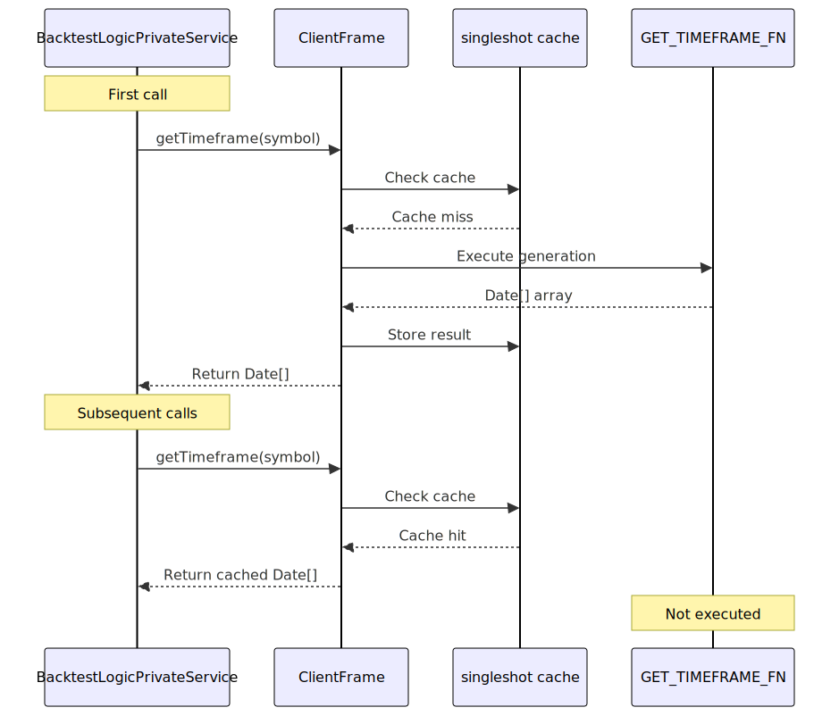
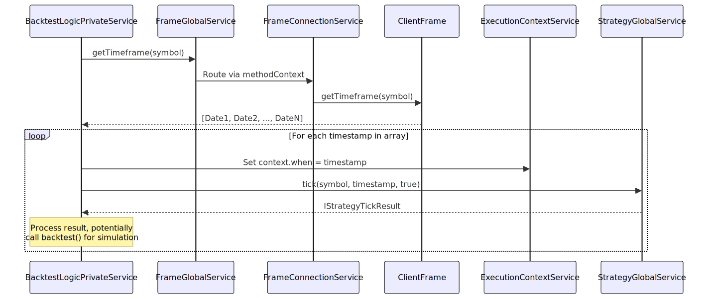

# Timeframe Generation

This document explains how `ClientFrame` generates timestamp arrays for backtest iteration. The timeframe generation system produces evenly-spaced `Date` objects representing execution points throughout a historical period, configured by interval, start date, and end date.

For information about how these timestamps are used during backtest execution, see [Backtest Execution Flow](29_Backtest_Execution_Flow.md). For details on fast-forward simulation that occurs after signals open, see [Fast-Forward Simulation](31_Fast-Forward_Simulation.md).

---

## Purpose and Scope

`ClientFrame` is responsible for generating the temporal backbone of backtesting—an array of timestamps that determines when the strategy's `tick()` method is evaluated. This generation happens once per backtest run and is cached for performance.


---

## ClientFrame Architecture

`ClientFrame` implements the `IFrame` interface and resides in the Business Logic Layer. It is instantiated by `FrameConnectionService` based on the schema registered via `addFrame()`.

### Component Interaction


---

## Frame Interval Configuration

The `INTERVAL_MINUTES` constant maps `FrameInterval` enum values to their minute durations. These intervals determine the spacing between generated timestamps.

| Interval | Minutes | Use Case |
|----------|---------|----------|
| `"1m"` | 1 | High-frequency strategies, minute-level signals |
| `"3m"` | 3 | Short-term patterns |
| `"5m"` | 5 | Common intraday interval |
| `"15m"` | 15 | Medium-term intraday |
| `"30m"` | 30 | Half-hour cycles |
| `"1h"` | 60 | Hourly strategies |
| `"2h"`, `"4h"`, `"6h"`, `"8h"` | 120, 240, 360, 480 | Multi-hour cycles |
| `"12h"` | 720 | Twice-daily evaluation |
| `"1d"` | 1440 | Daily strategies |
| `"3d"` | 4320 | Multi-day patterns |


---

## Timestamp Generation Algorithm

The `GET_TIMEFRAME_FN` function implements a simple iterative algorithm to produce the timestamp array.

### Algorithm Flow




### Implementation Details

The core loop creates `Date` objects with millisecond precision:

- **Start**: Initialize `currentDate` to `startDate` from params
- **Iterate**: While `currentDate <= endDate`:
  - Clone `currentDate` and push to `timeframes` array
  - Increment `currentDate` by `intervalMinutes * 60 * 1000` milliseconds
- **Callback**: Optionally invoke `callbacks.onTimeframe` for validation/logging
- **Return**: Final `Date[]` array

The algorithm ensures inclusive boundaries—both `startDate` and `endDate` are included in the result if they align with interval boundaries.


---

## Singleshot Caching

The `getTimeframe` method is wrapped with the `singleshot` decorator from `functools-kit`, ensuring the timestamp array is generated only once per `ClientFrame` instance.

### Caching Behavior



This optimization prevents redundant timestamp generation when multiple components or iterations request the same timeframe. The cache is scoped to the `ClientFrame` instance, which is itself memoized per `frameName` by `FrameConnectionService`.


---

## Integration with Backtest Execution

The generated timestamp array drives the backtest loop. `BacktestLogicPrivateService` retrieves the timeframe and iterates through each timestamp, setting it as the execution context.

### Execution Flow



The timestamp array length directly determines backtest duration. For example:
- 30 days at 1-minute intervals: ~43,200 timestamps
- 365 days at 1-hour intervals: ~8,760 timestamps

Memory efficiency is maintained because only one timestamp is active in execution context at a time.


---

## Configuration via IFrameSchema

Users configure timeframe generation through the `IFrameSchema` interface passed to `addFrame()`. The schema defines:

| Property | Type | Description |
|----------|------|-------------|
| `frameName` | `string` | Unique identifier for frame configuration |
| `interval` | `FrameInterval` | Spacing between timestamps (`"1m"` to `"3d"`) |
| `startDate` | `Date` | Beginning of backtest period (inclusive) |
| `endDate` | `Date` | End of backtest period (inclusive) |
| `callbacks` | `Partial<IFrameCallbacks>` | Optional `onTimeframe` hook |

### Registration Example

```typescript
import { addFrame } from "backtest-kit";

addFrame({
  frameName: "2024-Q1-daily",
  interval: "1d",
  startDate: new Date("2024-01-01T00:00:00Z"),
  endDate: new Date("2024-03-31T23:59:59Z"),
  callbacks: {
    onTimeframe: (timeframes, start, end, interval) => {
      console.log(`Generated ${timeframes.length} timestamps`);
      console.log(`Range: ${start} to ${end}`);
      console.log(`Interval: ${interval}`);
    }
  }
});
```

The `callbacks.onTimeframe` hook receives the generated array and configuration parameters, enabling validation, logging, or custom processing.


---

## Error Handling

`ClientFrame` throws an error if an invalid interval is provided:

```typescript
if (!intervalMinutes) {
  throw new Error(`ClientFrame unknown interval: ${interval}`);
}
```

This validation occurs during the first `getTimeframe()` call. Since the method is wrapped with `singleshot`, the error is thrown only once and propagates through the call stack to the backtest orchestrator.


---

## Implementation Pattern: Prototype Functions

The `GET_TIMEFRAME_FN` is defined as a standalone function accepting `self: ClientFrame` as a parameter. This pattern is used for memory efficiency:

```typescript
const GET_TIMEFRAME_FN = async (symbol: string, self: ClientFrame) => {
  self.params.logger.debug("ClientFrame getTimeframe", { symbol });
  const { interval, startDate, endDate } = self.params;
  // ... implementation
};

export class ClientFrame implements IFrame {
  public getTimeframe = singleshot(
    async (symbol: string): Promise<Date[]> =>
      await GET_TIMEFRAME_FN(symbol, this)
  );
}
```

This approach avoids creating new function closures for each `ClientFrame` instance, reducing memory overhead when multiple frames are registered.


---

## Relationship to Exchange Intervals

While `ClientFrame` uses `FrameInterval` for timestamp generation, `ClientExchange` uses `CandleInterval` for fetching historical data. These two interval systems are separate:

- **`FrameInterval`**: Determines when strategy `tick()` is called
- **`CandleInterval`**: Determines granularity of OHLCV data fetched

The frame interval can be larger than the candle interval. For example, a strategy might evaluate every 1 hour (`frame.interval = "1h"`) while analyzing 100 1-minute candles (`getCandles("BTCUSDT", "1m", 100)`).

