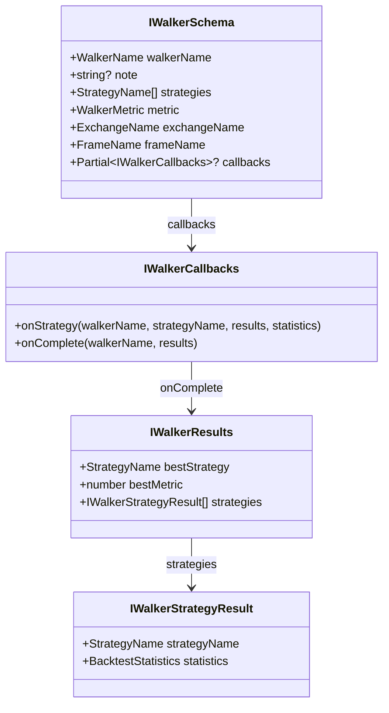
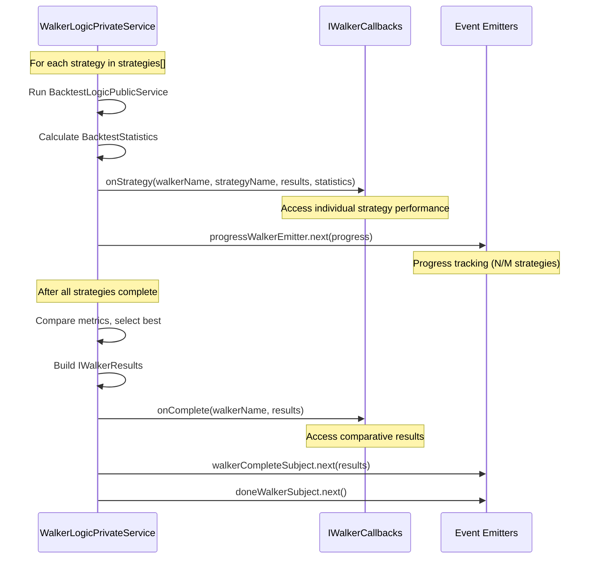
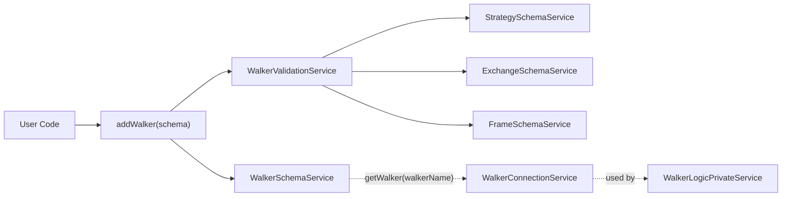
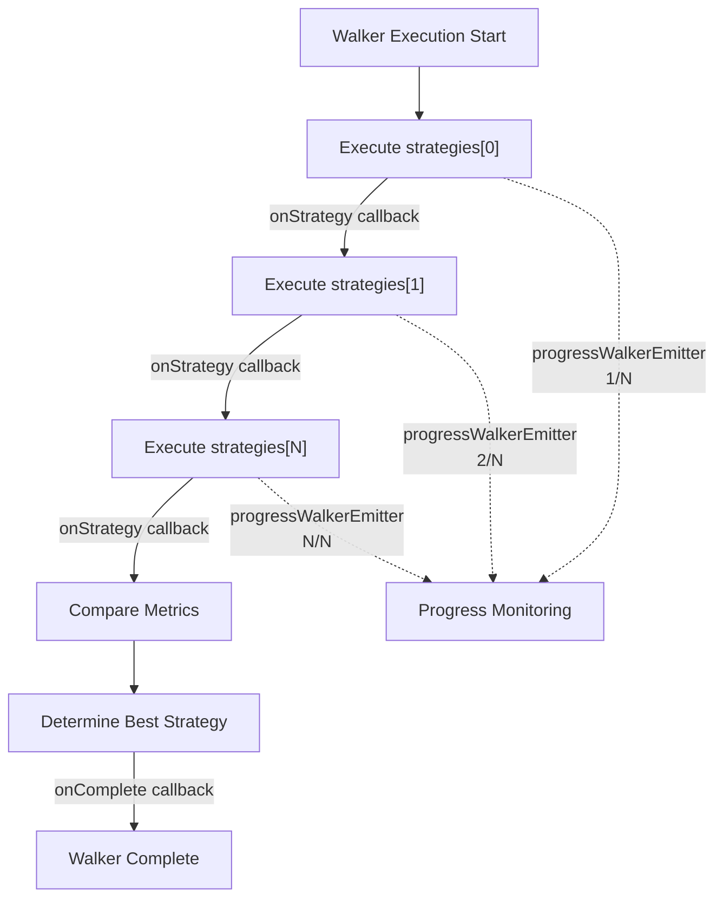
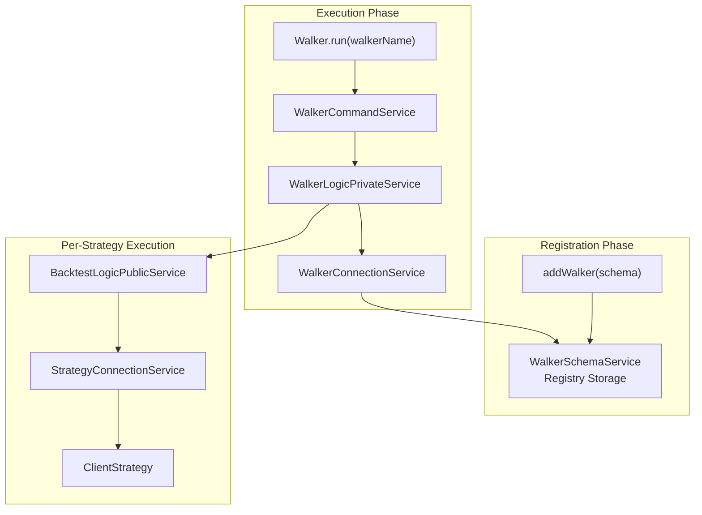

# Walker Schemas

<details>
<summary>Relevant source files</summary>

The following files were used as context for generating this wiki page:

- [src/classes/Backtest.ts](src/classes/Backtest.ts)
- [src/classes/Live.ts](src/classes/Live.ts)
- [src/classes/Walker.ts](src/classes/Walker.ts)
- [src/config/emitters.ts](src/config/emitters.ts)
- [src/function/event.ts](src/function/event.ts)
- [src/index.ts](src/index.ts)
- [src/lib/services/connection/StrategyConnectionService.ts](src/lib/services/connection/StrategyConnectionService.ts)
- [types.d.ts](types.d.ts)

</details>


This document defines the `IWalkerSchema` interface for registering Walker components via `addWalker()`. Walker schemas configure strategy comparison operations that run multiple strategies sequentially and rank them by a chosen performance metric.

For information about executing Walker operations, see [Walker API](#4.5). For details about Walker execution flow and implementation, see [Walker Mode](#11).

## Schema Interface

Walker schemas are registered using the `IWalkerSchema` interface, which specifies a collection of strategies to compare, a metric for ranking, and the execution environment.



**Sources:** [types.d.ts:1486-1530]()

## Required Fields

### walkerName

Unique identifier for the Walker configuration. Used to retrieve Walker instances via dependency injection and for logging/reporting.

```typescript
walkerName: WalkerName; // string type alias
```

**Example:**
```typescript
walkerName: "btc-strategy-comparison"
```

### strategies

Array of strategy names to compare. Each strategy must be registered via `addStrategy()` before Walker execution. Strategies are executed sequentially in array order.

```typescript
strategies: StrategyName[]; // StrategyName[] = string[]
```

**Example:**
```typescript
strategies: [
  "rsi-strategy",
  "macd-strategy",
  "bollinger-strategy"
]
```

Walker executes each strategy using the same `exchangeName` and `frameName`, ensuring fair comparison under identical market conditions.

**Sources:** [types.d.ts:1493-1495]()

### metric

Performance metric used to rank strategies and determine the best performer. The metric value is extracted from `BacktestStatistics` after each strategy completes.

```typescript
metric: WalkerMetric;

type WalkerMetric = 
  | "sharpeRatio"
  | "annualizedSharpeRatio"
  | "winRate"
  | "avgPnl"
  | "totalPnl"
  | "certaintyRatio"
  | "expectedYearlyReturns";
```

**Sources:** [types.d.ts:1496](), [types.d.ts:1509-1517]()

### exchangeName

Exchange configuration to use for all strategy backtests. Must be registered via `addExchange()` before Walker execution. All strategies in the comparison use this same exchange.

```typescript
exchangeName: ExchangeName; // string type alias
```

**Example:**
```typescript
exchangeName: "binance"
```

### frameName

Frame (timeframe) configuration to use for all strategy backtests. Must be registered via `addFrame()` before Walker execution. All strategies are tested against this same historical period.

```typescript
frameName: FrameName; // string type alias
```

**Example:**
```typescript
frameName: "2024-q1"
```

**Sources:** [types.d.ts:1497-1499]()

## Metric Selection

The `metric` field determines how strategies are ranked. Higher metric values indicate better performance (except for negative PnL scenarios).

| Metric | Description | Formula / Source | Typical Range |
|--------|-------------|------------------|---------------|
| `sharpeRatio` | Risk-adjusted returns (daily) | `avgPnl / stdDevPnl` | -∞ to +∞ (>1 is good) |
| `annualizedSharpeRatio` | Sharpe ratio scaled to annual basis | `sharpeRatio * sqrt(252)` | -∞ to +∞ (>2 is excellent) |
| `winRate` | Percentage of profitable trades | `(winCount / totalSignals) * 100` | 0% to 100% |
| `avgPnl` | Average profit/loss per trade | `totalPnl / totalSignals` | -∞ to +∞ |
| `totalPnl` | Cumulative profit/loss (all trades) | `sum(pnlPercentage)` | -∞ to +∞ |
| `certaintyRatio` | Consistency of returns | `(avgPnl * winRate) / stdDevPnl` | -∞ to +∞ |
| `expectedYearlyReturns` | Annualized expected return | `avgPnl * tradesPerYear` | -∞ to +∞ |

**Default metric:** `sharpeRatio` is commonly used as the default metric for strategy comparison because it accounts for both returns and risk.

**Metric selection guidance:**
- Use `sharpeRatio` or `annualizedSharpeRatio` for risk-adjusted comparison
- Use `winRate` if consistency is more important than magnitude
- Use `totalPnl` or `avgPnl` for absolute return comparison
- Use `certaintyRatio` for strategies with varying volatility
- Use `expectedYearlyReturns` for long-term performance projection

**Sources:** [types.d.ts:1509-1517]()

## Optional Fields

### note

Human-readable description for documentation purposes. Not used by the system, but helpful for understanding Walker configuration intent.

```typescript
note?: string;
```

**Example:**
```typescript
note: "Compare momentum strategies during Q1 2024 bull market"
```

### callbacks

Lifecycle event callbacks triggered during Walker execution. Provides hooks for monitoring progress and results.

```typescript
callbacks?: Partial<IWalkerCallbacks>;
```

**Sources:** [types.d.ts:1492](), [types.d.ts:1500]()

## Callback Lifecycle

Walker execution emits events at key lifecycle points via the `IWalkerCallbacks` interface.



### onStrategy Callback

Invoked after each strategy completes its backtest. Receives full backtest results and statistics for the strategy.

```typescript
onStrategy: (
  walkerName: WalkerName,
  strategyName: StrategyName,
  results: IStrategyBacktestResult[],
  statistics: BacktestStatistics
) => void;
```

**Parameters:**
- `walkerName`: Identifier of the Walker configuration
- `strategyName`: Name of the strategy that just completed
- `results`: Array of all closed signals from the backtest
- `statistics`: Calculated performance metrics (`BacktestStatistics`)

**Use cases:**
- Log intermediate progress
- Store per-strategy results to database
- Emit custom events for monitoring dashboards

### onComplete Callback

Invoked after all strategies complete and comparative ranking is determined. Receives aggregated results with best strategy identification.

```typescript
onComplete: (
  walkerName: WalkerName,
  results: IWalkerResults
) => void;
```

**Parameters:**
- `walkerName`: Identifier of the Walker configuration
- `results`: Complete Walker results including ranking

**Use cases:**
- Generate comparison reports
- Trigger downstream automation (e.g., deploy best strategy)
- Archive results for historical tracking

**Sources:** [types.d.ts:1502-1507]()

## Walker Results Structure

Walker execution produces `IWalkerResults` containing the best strategy, its metric value, and full statistics for all strategies.

```typescript
interface IWalkerResults {
  /** Name of the highest-performing strategy */
  bestStrategy: StrategyName;
  
  /** Metric value of the best strategy */
  bestMetric: number;
  
  /** Complete results for all strategies (ordered by execution) */
  strategies: IWalkerStrategyResult[];
}

interface IWalkerStrategyResult {
  /** Strategy identifier */
  strategyName: StrategyName;
  
  /** Full performance statistics from backtest */
  statistics: BacktestStatistics;
}
```

**Best strategy selection:** The strategy with the highest value for the specified `metric` is chosen. All metrics are maximization targets (higher is better).

**Result ordering:** The `strategies` array maintains the execution order (same as input `strategies` array), not sorted by performance. To find ranking, compare `statistics[metric]` values.

**Accessing results:**
```typescript
// Via Walker.getData()
const results = await Walker.getData("btc-strategy-comparison");
console.log(`Best: ${results.bestStrategy} (${results.bestMetric})`);

// Via listenWalkerComplete()
listenWalkerComplete((walkerName, results) => {
  const winner = results.strategies.find(
    s => s.strategyName === results.bestStrategy
  );
  console.log(winner.statistics);
});
```

**Sources:** [types.d.ts:1519-1530]()

## Registration

Walker schemas are registered using the `addWalker()` function, which validates the configuration and stores it in the `WalkerSchemaService` registry.



**Basic registration:**
```typescript
import { addWalker } from 'backtest-kit';

await addWalker({
  walkerName: "momentum-comparison",
  strategies: ["rsi-strategy", "macd-strategy"],
  metric: "sharpeRatio",
  exchangeName: "binance",
  frameName: "2024-q1"
});
```

**With callbacks:**
```typescript
await addWalker({
  walkerName: "momentum-comparison",
  note: "Compare RSI vs MACD during bull market",
  strategies: ["rsi-strategy", "macd-strategy"],
  metric: "annualizedSharpeRatio",
  exchangeName: "binance",
  frameName: "2024-q1",
  callbacks: {
    onStrategy: (walkerName, strategyName, results, stats) => {
      console.log(`${strategyName}: Sharpe = ${stats.sharpeRatio}`);
    },
    onComplete: (walkerName, results) => {
      console.log(`Winner: ${results.bestStrategy}`);
    }
  }
});
```

**Sources:** [src/lib/add.ts]() (addWalker implementation)

## Validation Rules

Walker schemas undergo validation before registration to ensure configuration integrity.

| Validation | Rule | Error Example |
|------------|------|---------------|
| **walkerName uniqueness** | Must not already be registered | `Walker "test" already exists` |
| **walkerName presence** | Must be non-empty string | `walkerName is required` |
| **strategies presence** | Array must not be empty | `strategies array cannot be empty` |
| **strategies existence** | All strategies must be registered | `Strategy "unknown" not found` |
| **metric validity** | Must be valid WalkerMetric value | `Invalid metric "invalid"` |
| **exchangeName existence** | Exchange must be registered | `Exchange "unknown" not found` |
| **frameName existence** | Frame must be registered | `Frame "unknown" not found` |

**Validation timing:** All validation occurs synchronously during `addWalker()` call, before the schema is stored. Registration either succeeds completely or throws an error.

**Validation implementation:** [src/lib/services/validation/WalkerValidationService.ts]()

**Sources:** [src/lib/services/validation/WalkerValidationService.ts]()

## Strategy Order Considerations

The `strategies` array order determines execution sequence, which affects:

1. **Progress reporting:** `progressWalkerEmitter` emits after each strategy completes, showing index-based progress
2. **Callback ordering:** `onStrategy` fires in array order
3. **Early termination:** If Walker execution is cancelled, earlier strategies complete while later ones are skipped

**Execution diagram:**



**Best practice:** Place high-priority or baseline strategies first in the array for earlier feedback during long-running comparisons.

**Sources:** [src/lib/services/logic/WalkerLogicPrivateService.ts]()

## Integration with Walker Execution

Walker schemas are consumed by the Walker execution pipeline during `Walker.run()` or `Walker.background()` operations.



**Execution flow:**
1. User calls `Walker.run(walkerName)`
2. `WalkerCommandService` validates Walker exists
3. `WalkerLogicPrivateService` retrieves schema from `WalkerSchemaService`
4. For each strategy in schema:
   - Run full backtest via `BacktestLogicPublicService`
   - Extract metric value from `BacktestStatistics`
   - Emit progress and fire `onStrategy` callback
5. Compare all metric values, identify best strategy
6. Build `IWalkerResults` and fire `onComplete` callback
7. Return results via `Walker.getData()`

**Sources:** [src/lib/services/logic/WalkerLogicPrivateService.ts](), [src/lib/services/command/WalkerCommandService.ts]()

## Complete Example

```typescript
import { addStrategy, addExchange, addFrame, addWalker } from 'backtest-kit';

// Register dependencies
await addExchange({
  exchangeName: "binance",
  getCandles: async (symbol, interval, since, limit) => {
    // CCXT implementation
  },
  formatPrice: async (symbol, price) => price.toFixed(2),
  formatQuantity: async (symbol, qty) => qty.toFixed(8)
});

await addFrame({
  frameName: "2024-q1",
  interval: "1h",
  startDate: new Date("2024-01-01"),
  endDate: new Date("2024-03-31")
});

await addStrategy({
  strategyName: "rsi-oversold",
  interval: "1h",
  getSignal: async (symbol, when) => {
    // RSI calculation and signal logic
    return { position: "long", priceTakeProfit: 50000, priceStopLoss: 48000, minuteEstimatedTime: 1440 };
  }
});

await addStrategy({
  strategyName: "macd-crossover",
  interval: "1h",
  getSignal: async (symbol, when) => {
    // MACD calculation and signal logic
    return { position: "long", priceTakeProfit: 51000, priceStopLoss: 47000, minuteEstimatedTime: 2880 };
  }
});

// Register Walker
await addWalker({
  walkerName: "momentum-strategies",
  note: "Compare RSI vs MACD momentum strategies in Q1 2024",
  strategies: [
    "rsi-oversold",
    "macd-crossover"
  ],
  metric: "annualizedSharpeRatio",
  exchangeName: "binance",
  frameName: "2024-q1",
  callbacks: {
    onStrategy: (walkerName, strategyName, results, statistics) => {
      console.log(`Completed ${strategyName}:`);
      console.log(`  Signals: ${statistics.totalSignals}`);
      console.log(`  Win Rate: ${statistics.winRate}%`);
      console.log(`  Sharpe: ${statistics.sharpeRatio}`);
    },
    onComplete: (walkerName, results) => {
      console.log(`\nBest strategy: ${results.bestStrategy}`);
      console.log(`Best metric: ${results.bestMetric.toFixed(2)}`);
      
      // Generate comparison table
      results.strategies.forEach(s => {
        console.log(`${s.strategyName}: ${s.statistics.annualizedSharpeRatio}`);
      });
    }
  }
});

// Execute Walker
import { Walker } from 'backtest-kit';

for await (const progress of Walker.run("BTCUSDT", {
  walkerName: "momentum-strategies"
})) {
  console.log(`Progress: ${progress.completed}/${progress.total}`);
}

// Access results
const results = await Walker.getData("momentum-strategies");
console.log(`Winner: ${results.bestStrategy}`);
```

**Sources:** [types.d.ts:1486-1530](), [src/lib/add.ts]()