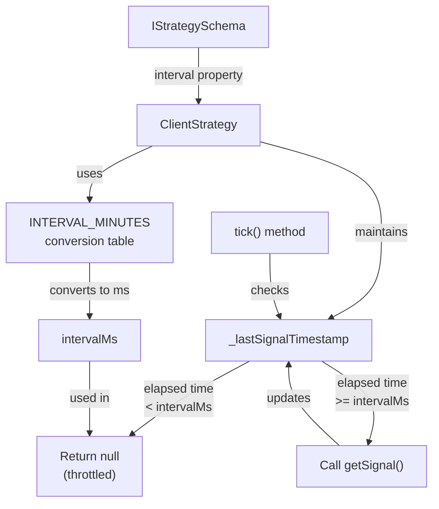
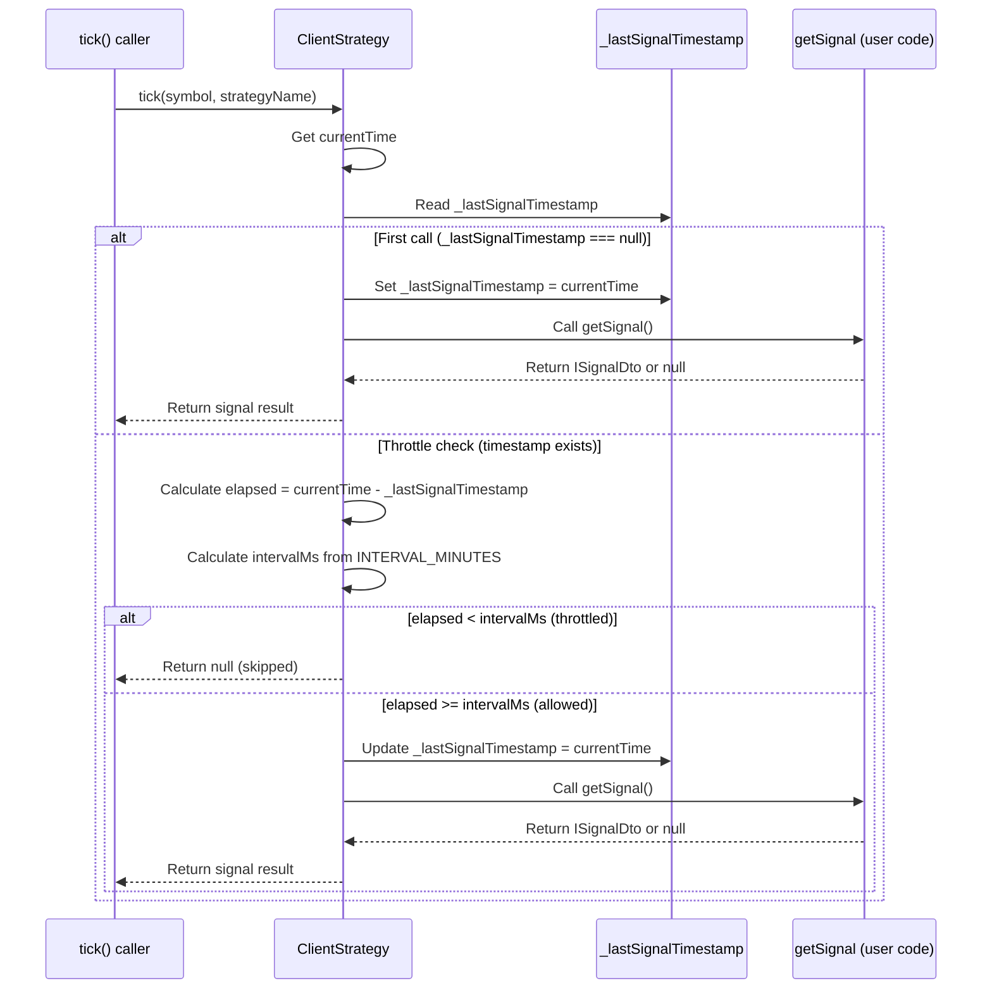
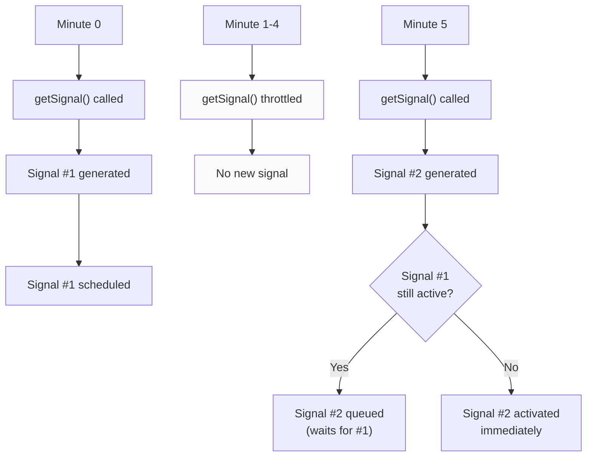
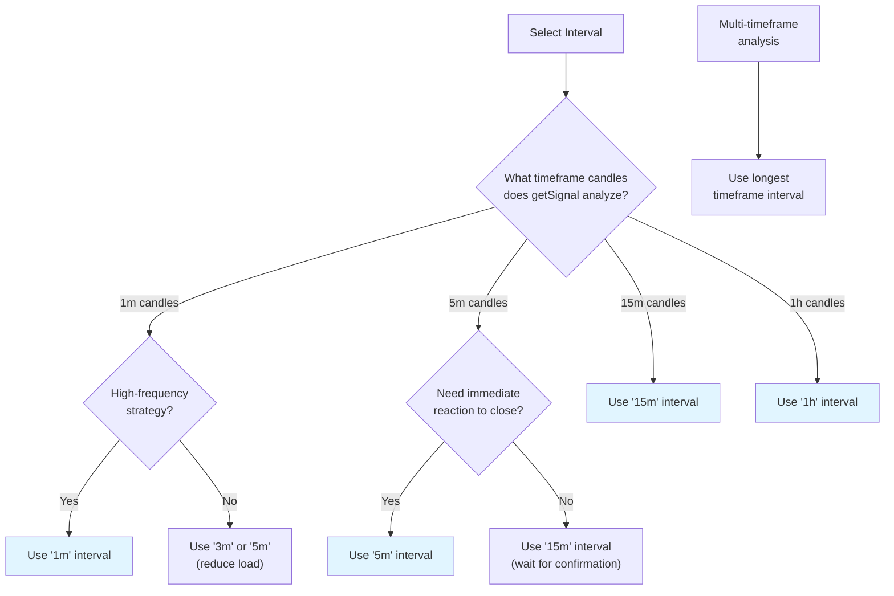
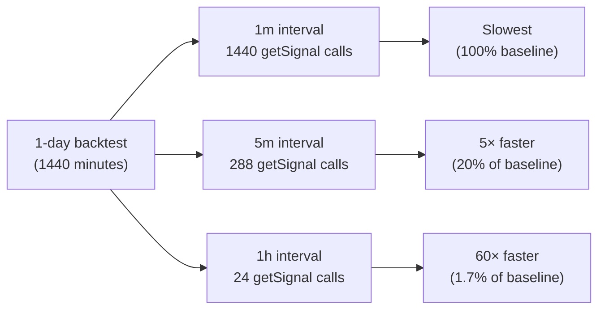
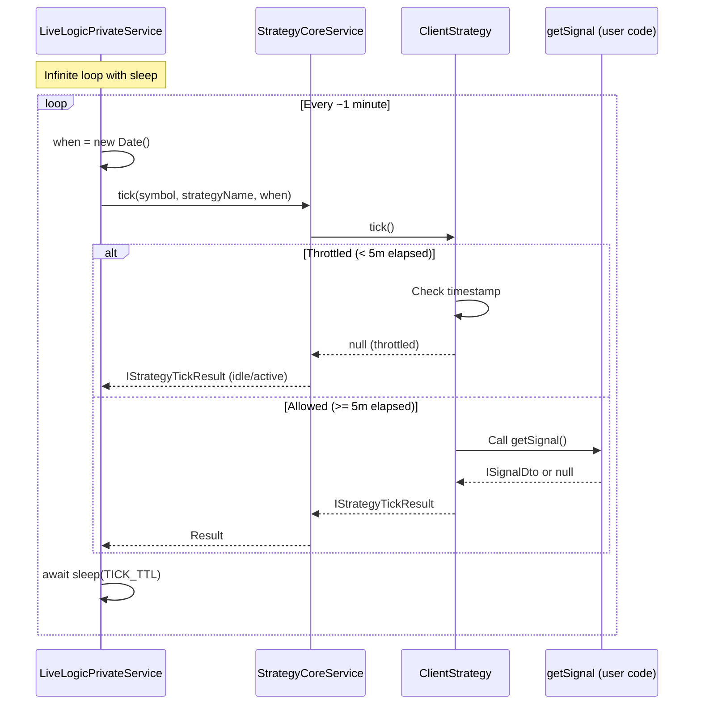
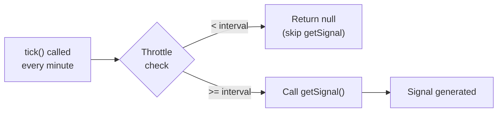
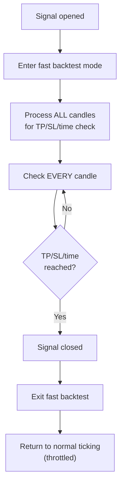

# Interval Throttling

This document explains the signal generation throttling mechanism that controls how frequently strategies can call `getSignal`. Throttling prevents signal spam, reduces computational load, and aligns with realistic trading frequencies.

For information about signal lifecycle and state transitions, see [Signals & Signal Lifecycle](./08_core-concepts.md). For details on strategy configuration, see [Strategy Schema Definition](./25_strategy-development.md). For multi-timeframe analysis patterns, see [Multi-Timeframe Analysis](./25_strategy-development.md).

## Purpose and Scope

Interval throttling is a core mechanism that enforces minimum time between `getSignal` invocations. This document covers:

- Available `SignalInterval` types and their durations
- Implementation details in `ClientStrategy`
- How throttling differs from signal queue processing
- Best practices for interval selection
- Performance implications and debugging strategies

## SignalInterval Types

The framework provides six standard intervals for throttling signal generation:

| Interval | Minutes | Milliseconds | Typical Use Case |
|----------|---------|--------------|------------------|
| `"1m"` | 1 | 60,000 | High-frequency strategies, scalping |
| `"3m"` | 3 | 180,000 | Short-term momentum trading |
| `"5m"` | 5 | 300,000 | Intraday trading strategies |
| `"15m"` | 15 | 900,000 | Swing trading setups |
| `"30m"` | 30 | 1,800,000 | Position trading entries |
| `"1h"` | 60 | 3,600,000 | Long-term trend following |

These intervals are defined as a union type in the type system:

```typescript
type SignalInterval = "1m" | "3m" | "5m" | "15m" | "30m" | "1h";
```

**Sources**: [types.d.ts:12-18](), [src/interfaces/Strategy.interface.ts:12-18]()

## Throttling Architecture

### Component Overview



**Sources**: [src/client/ClientStrategy.ts:34-41](), [src/client/ClientStrategy.ts:332-476]()

### State Management

Each `ClientStrategy` instance maintains a private timestamp field to track when `getSignal` was last invoked:

```typescript
// Internal state (not exposed in interface)
private _lastSignalTimestamp: number | null = null;
```

This timestamp is checked on every `tick()` call before invoking the user-defined `getSignal` function.

**Sources**: [src/client/ClientStrategy.ts]()

## Implementation Details

### Interval Conversion Table

The framework maintains a constant mapping from string intervals to numeric minutes:

```typescript
const INTERVAL_MINUTES: Record<SignalInterval, number> = {
  "1m": 1,
  "3m": 3,
  "5m": 5,
  "15m": 15,
  "30m": 30,
  "1h": 60,
};
```

This table is used to convert the user-specified interval into milliseconds for timestamp comparison.

**Sources**: [src/client/ClientStrategy.ts:34-41]()

### Throttling Logic Flow



**Sources**: [src/client/ClientStrategy.ts:332-353]()

### Actual Implementation Code

The throttling check occurs in the `GET_SIGNAL_FN` function before calling the user's `getSignal`:

```typescript
const currentTime = self.params.execution.context.when.getTime();
{
  const intervalMinutes = INTERVAL_MINUTES[self.params.interval];
  const intervalMs = intervalMinutes * 60 * 1000;

  // Check if enough time has passed since last getSignal
  if (
    self._lastSignalTimestamp !== null &&
    currentTime - self._lastSignalTimestamp < intervalMs
  ) {
    return null; // Throttled - skip this tick
  }

  self._lastSignalTimestamp = currentTime;
}
```

**Key Behaviors**:
1. First call is never throttled (`_lastSignalTimestamp === null`)
2. Timestamp is updated **before** calling `getSignal`, not after
3. Throttled ticks return `null` immediately without executing strategy logic
4. Error in `getSignal` doesn't prevent timestamp update (prevents retry storms)

**Sources**: [src/client/ClientStrategy.ts:340-353]()

## Throttling vs Signal Queue

Interval throttling and signal queue processing are distinct mechanisms with different purposes:

| Aspect | Interval Throttling | Signal Queue Processing |
|--------|---------------------|------------------------|
| **Purpose** | Control `getSignal` invocation frequency | Ensure sequential signal execution |
| **Scope** | Controls when strategy logic runs | Controls signal activation order |
| **State** | `_lastSignalTimestamp` | `_pendingSignal` / `_scheduledSignal` |
| **User Control** | Configured via `interval` property | Automatic (not configurable) |
| **Applies To** | Signal generation phase | Signal execution phase |
| **Bypass Possible** | No | No |

### Example Scenario



Even with throttling allowing a new `getSignal` call, the new signal waits if a previous signal is still active. Both mechanisms work together to ensure controlled, sequential signal processing.

**Sources**: [src/client/ClientStrategy.ts:332-476](), test examples in [test/README.md:1-674]()

## Configuration in Strategy Schema

### Required Property

The `interval` is a required field in `IStrategySchema`:

```typescript
interface IStrategySchema {
  strategyName: StrategyName;
  interval: SignalInterval; // Required - no default value
  getSignal: (symbol: string, when: Date) => Promise<ISignalDto | null>;
  callbacks?: Partial<IStrategyCallbacks>;
  // ... other properties
}
```

**Sources**: [types.d.ts:728-747](), [src/interfaces/Strategy.interface.ts:132-151]()

### Basic Example

```typescript
import { addStrategy } from "backtest-kit";

addStrategy({
  strategyName: "momentum-5m",
  interval: "5m", // getSignal called max once per 5 minutes
  getSignal: async (symbol, when) => {
    const candles = await getCandles(symbol, "5m", 20);
    
    // Strategy logic using 5-minute candles
    const momentum = calculateMomentum(candles);
    
    if (momentum > THRESHOLD) {
      return {
        position: "long",
        priceTakeProfit: candles[0].close * 1.02,
        priceStopLoss: candles[0].close * 0.98,
        minuteEstimatedTime: 60,
      };
    }
    
    return null;
  }
});
```

**Sources**: [src/function/add.ts]() (addStrategy function)

## Choosing the Right Interval

### Decision Tree



**Sources**: Pattern analysis from [src/client/ClientStrategy.ts:34-41]()

### Selection Guidelines

| Strategy Type | Recommended Interval | Reasoning |
|--------------|---------------------|-----------|
| **Scalping** | `"1m"` | Requires immediate reaction to price movements |
| **Short-term Momentum** | `"3m"` - `"5m"` | Balances responsiveness with noise filtering |
| **Intraday Swing** | `"5m"` - `"15m"` | Reduces computational load, prevents over-trading |
| **Daily Swing** | `"15m"` - `"30m"` | Longer-term confirmation, fewer signals |
| **Position Trading** | `"1h"` | Infrequent entries, long holding periods |

**Rule of Thumb**: Match your throttling interval to your analysis timeframe. If you analyze 15-minute candles, use a `"15m"` interval.

**Sources**: Best practices derived from system design

### Common Anti-Patterns

**❌ Anti-Pattern: Mismatched Intervals**

```typescript
// BAD: Analyzing 15m candles but checking every 1m
addStrategy({
  interval: "1m", // Too frequent!
  getSignal: async (symbol, when) => {
    const candles = await getCandles(symbol, "15m", 50);
    // Same 15m candles fetched 15 times unnecessarily
    return analyzeCandles(candles);
  }
});
```

**Issues**:
- Wastes API calls (same data fetched 15 times)
- Unnecessary CPU usage (same analysis repeated)
- No benefit (15m candles don't change every minute)

**✅ Correct Pattern: Matched Intervals**

```typescript
// GOOD: Match interval to analysis timeframe
addStrategy({
  interval: "15m", // Matches candle interval
  getSignal: async (symbol, when) => {
    const candles = await getCandles(symbol, "15m", 50);
    // Fresh candles fetched once per 15 minutes
    return analyzeCandles(candles);
  }
});
```

**Sources**: [src/function/exchange.ts]() (getCandles implementation)

**❌ Anti-Pattern: Over-Throttling**

```typescript
// BAD: 1h interval for scalping strategy
addStrategy({
  interval: "1h", // Too slow!
  getSignal: async (symbol, when) => {
    const candles = await getCandles(symbol, "1m", 10);
    // Scalping logic needs immediate reaction
    return findScalpEntry(candles);
  }
});
```

**Issues**:
- Misses short-term opportunities (checked once per hour)
- Doesn't match strategy's time horizon
- Likely to enter after optimal moment

**Sources**: System design patterns

## Performance Implications

### Computational Cost Table

The throttling interval directly controls the number of `getSignal` invocations:

| Interval | Calls per Hour | Calls per Day | Calls per Week | Relative Load |
|----------|----------------|---------------|----------------|---------------|
| `"1m"` | 60 | 1,440 | 10,080 | 100% |
| `"3m"` | 20 | 480 | 3,360 | 33% |
| `"5m"` | 12 | 288 | 2,016 | 20% |
| `"15m"` | 4 | 96 | 672 | 6.7% |
| `"30m"` | 2 | 48 | 336 | 3.3% |
| `"1h"` | 1 | 24 | 168 | 1.7% |

**Example Portfolio Analysis**:
- **10 strategies with `"5m"` interval**: 10 × 288 = 2,880 calls/day
- **Same portfolio with `"15m"`**: 10 × 96 = 960 calls/day (**66% reduction**)
- **Same portfolio with `"1h"`**: 10 × 24 = 240 calls/day (**92% reduction**)

**Sources**: Calculated from [src/client/ClientStrategy.ts:34-41]()

### Backtest Performance

In backtest mode, throttling still applies and significantly affects execution time:



For a 30-day backtest analyzing 20 symbols:
- `"1m"` interval: 30 × 1,440 × 20 = 864,000 calls
- `"5m"` interval: 30 × 288 × 20 = 172,800 calls
- `"15m"` interval: 30 × 96 × 20 = 57,600 calls

**Sources**: [src/lib/services/logic/private/BacktestLogicPrivateService.ts]()

### Network and API Impact

When using external data sources (e.g., CCXT exchange APIs), throttling reduces API call frequency:

| Interval | Potential API Calls (if getCandles in every getSignal) |
|----------|--------------------------------------------------------|
| `"1m"` | 1,440 per day per symbol |
| `"5m"` | 288 per day per symbol |
| `"1h"` | 24 per day per symbol |

Most exchanges have rate limits (e.g., Binance: 1,200 requests/minute). Proper throttling prevents hitting these limits.

**Sources**: Integration patterns from [src/interfaces/Exchange.interface.ts:122-155]()

## Live Trading Behavior

### Real-Time Throttling Loop

In live mode, the execution loop calls `tick()` approximately every minute, but throttling controls `getSignal` invocation:



**Example Timeline** (5-minute interval):
- 10:00:00 → `tick()` called → `getSignal()` executed
- 10:01:00 → `tick()` called → Throttled (skipped)
- 10:02:00 → `tick()` called → Throttled (skipped)
- 10:03:00 → `tick()` called → Throttled (skipped)
- 10:04:00 → `tick()` called → Throttled (skipped)
- 10:05:00 → `tick()` called → `getSignal()` executed

**Sources**: [src/lib/services/logic/private/LiveLogicPrivateService.ts]()

### Error Handling and Throttling

If `getSignal` throws an error, the timestamp is **still updated** to prevent error cascade loops:

```typescript
const GET_SIGNAL_FN = trycatch(
  async (self: ClientStrategy) => {
    // Update timestamp BEFORE calling getSignal
    self._lastSignalTimestamp = currentTime;
    
    const signal = await self.params.getSignal(/* ... */);
    // If this throws, next tick is still throttled
    // (prevents rapid error retry loop)
  },
  {
    defaultValue: null,
    fallback: (error) => {
      errorEmitter.next(error); // Log error
    }
  }
);
```

**Behavior**:
- Failed `getSignal` call counts toward throttle interval
- Prevents infinite error retry loops
- Strategy gets another chance after interval expires
- Errors are logged via `errorEmitter` for monitoring

**Sources**: [src/client/ClientStrategy.ts:332-476]()

## Interaction with Fast Backtest

### Throttling During Signal Generation

During normal ticking (signal generation phase), throttling applies:



### No Throttling During Signal Monitoring

Once a signal is active, the "fast backtest" mode processes candles **without throttling**:



**Key Point**: Throttling only applies to **signal generation**, not signal monitoring. Once a signal is active, every candle is checked for TP/SL/time_expired conditions.

**Sources**: [src/client/ClientStrategy.ts:1204-1447]() (backtest method)

## Advanced Patterns

### Conditional Signal Generation

While you cannot dynamically change the `interval` at runtime, you can implement conditional logic inside `getSignal` to achieve similar effects:

```typescript
addStrategy({
  strategyName: "adaptive-volatility",
  interval: "1m", // Minimum check frequency
  getSignal: async (symbol, when) => {
    const candles = await getCandles(symbol, "1m", 20);
    const volatility = calculateVolatility(candles);
    
    // Effective throttling via application logic
    if (volatility < LOW_VOLATILITY_THRESHOLD) {
      return null; // Skip during calm markets
    }
    
    // Only generate signals during high volatility
    return analyzeTrend(candles);
  }
});
```

**Benefits**:
- Uses `"1m"` for quick reaction when needed
- Skips computation during unfavorable conditions
- Effectively creates dynamic throttling via `return null`

**Sources**: Pattern derived from [src/interfaces/Strategy.interface.ts:144]()

### Multi-Timeframe Interval Selection

For strategies analyzing multiple timeframes, use the **longest** timeframe as the interval:

```typescript
addStrategy({
  strategyName: "multi-timeframe-trend",
  interval: "15m", // Matches longest analyzed timeframe
  getSignal: async (symbol, when) => {
    // Fetch multiple timeframes
    const candles1m = await getCandles(symbol, "1m", 100);
    const candles5m = await getCandles(symbol, "5m", 50);
    const candles15m = await getCandles(symbol, "15m", 20);
    
    // Analyze all timeframes (called once per 15 minutes)
    const shortTrend = analyzeTrend(candles1m);
    const mediumTrend = analyzeTrend(candles5m);
    const longTrend = analyzeTrend(candles15m);
    
    // Generate signal only if all timeframes align
    if (shortTrend === "up" && mediumTrend === "up" && longTrend === "up") {
      return { /* ... */ };
    }
    
    return null;
  }
});
```

**Reasoning**:
- 15-minute candles only change every 15 minutes
- Calling `getSignal` more frequently (e.g., every 1m) wastes resources
- Lower timeframes (1m, 5m) are fetched fresh each time
- Prevents redundant analysis of unchanged 15m data

**Sources**: [src/function/exchange.ts]() (getCandles implementation)

## Debugging Throttling Issues

### Common Symptoms and Solutions

| Symptom | Likely Cause | Solution |
|---------|-------------|----------|
| Signal never appears | Interval too long OR previous signal active | Check `_lastSignalTimestamp` and `_pendingSignal` |
| Too many API calls | Interval too short for strategy type | Increase interval to match analysis timeframe |
| Delayed entries | Interval too long for market conditions | Decrease interval OR adjust strategy logic |
| Backtest too slow | `"1m"` interval on long timeframe | Increase interval (e.g., `"5m"` or `"15m"`) |

**Sources**: Analysis of common patterns

### Diagnostic Logging

Add logging to observe throttling behavior:

```typescript
addStrategy({
  strategyName: "debug-throttle",
  interval: "5m",
  getSignal: async (symbol, when) => {
    console.log(`[${when.toISOString()}] getSignal CALLED`);
    // Strategy logic...
  },
  callbacks: {
    onTick: (symbol, result, backtest) => {
      console.log(`[${new Date().toISOString()}] tick: ${result.action}`);
    }
  }
});
```

**Expected Output** (5-minute interval):
```
[2024-01-01T10:00:00Z] tick: idle
[2024-01-01T10:00:00Z] getSignal CALLED
[2024-01-01T10:01:00Z] tick: idle
[2024-01-01T10:02:00Z] tick: idle
[2024-01-01T10:03:00Z] tick: idle
[2024-01-01T10:04:00Z] tick: idle
[2024-01-01T10:05:00Z] tick: idle
[2024-01-01T10:05:00Z] getSignal CALLED
```

Notice `onTick` is called every minute, but `getSignal` is only called every 5 minutes.

**Sources**: [types.d.ts:700-723]() (IStrategyCallbacks interface)

## Best Practices Summary

### Core Principles

1. **Match Interval to Analysis Timeframe**: If your strategy analyzes 15-minute candles, use `"15m"` interval
2. **Start Conservative**: Begin with longer intervals (e.g., `"15m"`), optimize downward only if needed
3. **Consider Computational Cost**: Each interval reduction multiplies load (1m → 5m = 5× load increase)
4. **Use `"1m"` Sparingly**: Reserve for truly high-frequency strategies that need immediate reaction
5. **Document Rationale**: Add comments explaining your interval choice for future maintainers

### Checklist for Interval Selection

- [ ] Identified longest timeframe analyzed in `getSignal`
- [ ] Set `interval` to match or exceed that timeframe
- [ ] Verified strategy logic doesn't assume every-minute execution
- [ ] Tested performance with chosen interval in backtest
- [ ] Considered API rate limits if using external data sources
- [ ] Added logging to verify throttling behavior
- [ ] Documented interval choice in strategy `note` field

**Sources**: System design analysis from [src/client/ClientStrategy.ts:34-41](), [types.d.ts:12-18]()