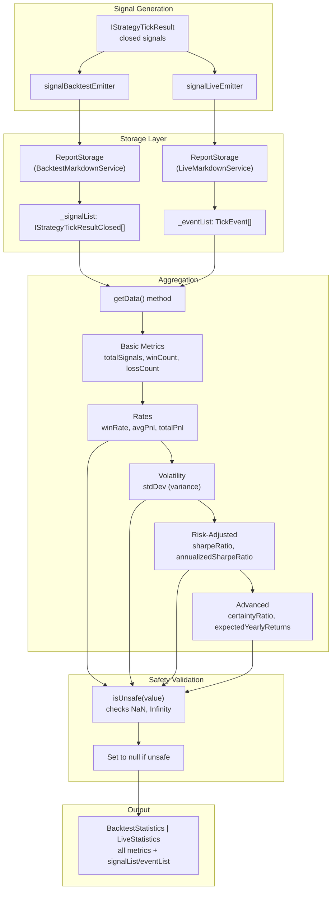
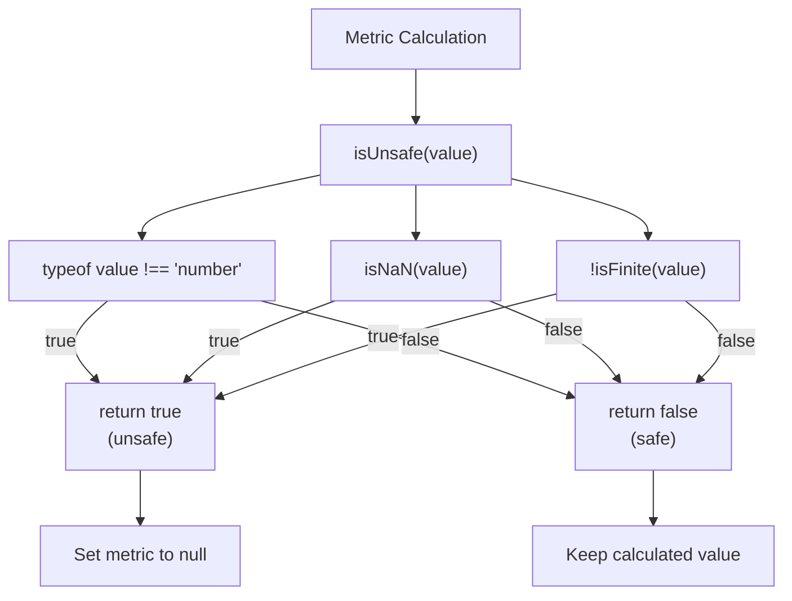
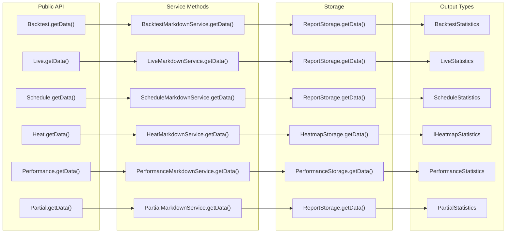

# Performance Statistics

# Performance Statistics

<details>
<summary>Relevant source files</summary>

The following files were used as context for generating this wiki page:

- [README.md](README.md)
- [src/config/emitters.ts](src/config/emitters.ts)
- [src/function/event.ts](src/function/event.ts)
- [src/index.ts](src/index.ts)
- [src/interfaces/Heatmap.interface.ts](src/interfaces/Heatmap.interface.ts)
- [src/lib/services/markdown/BacktestMarkdownService.ts](src/lib/services/markdown/BacktestMarkdownService.ts)
- [src/lib/services/markdown/HeatMarkdownService.ts](src/lib/services/markdown/HeatMarkdownService.ts)
- [src/lib/services/markdown/LiveMarkdownService.ts](src/lib/services/markdown/LiveMarkdownService.ts)
- [src/lib/services/markdown/PartialMarkdownService.ts](src/lib/services/markdown/PartialMarkdownService.ts)
- [src/lib/services/markdown/PerformanceMarkdownService.ts](src/lib/services/markdown/PerformanceMarkdownService.ts)
- [src/lib/services/markdown/ScheduleMarkdownService.ts](src/lib/services/markdown/ScheduleMarkdownService.ts)
- [src/lib/services/markdown/WalkerMarkdownService.ts](src/lib/services/markdown/WalkerMarkdownService.ts)
- [test/e2e/defend.test.mjs](test/e2e/defend.test.mjs)
- [test/e2e/risk.test.mjs](test/e2e/risk.test.mjs)
- [test/index.mjs](test/index.mjs)
- [test/mock/getMockCandles.mjs](test/mock/getMockCandles.mjs)
- [test/spec/heat.test.mjs](test/spec/heat.test.mjs)
- [test/spec/list.test.mjs](test/spec/list.test.mjs)
- [types.d.ts](types.d.ts)

</details>


This page documents the statistical metrics calculated from trading results. The framework computes comprehensive performance analytics including win rates, Sharpe ratios, drawdowns, and risk-adjusted returns for both backtest and live trading modes.

For information about the markdown report system and how statistics are stored and generated, see [Markdown Report System](./30-markdown-report-system.md). For portfolio-wide heatmap statistics aggregated across symbols, see [Portfolio Heatmaps](./32-portfolio-heatmaps.md).

---

## Statistics Interfaces Overview

The framework provides multiple statistics interfaces, each tailored to a specific execution mode or analysis type. All statistics calculations follow a consistent pattern: they aggregate signal data and compute derived metrics with safety checks for invalid values (NaN, Infinity).

| Interface | Purpose | Location | Key Metrics |
|-----------|---------|----------|-------------|
| `BacktestStatistics` | Historical simulation results | [src/lib/services/markdown/BacktestMarkdownService.ts:70-106]() | Win rate, Sharpe ratio, PNL, drawdown |
| `LiveStatistics` | Real-time trading results | [src/lib/services/markdown/LiveMarkdownService.ts:97-136]() | Same as backtest + event tracking |
| `ScheduleStatistics` | Scheduled signal tracking | [src/lib/services/markdown/ScheduleMarkdownService.ts:72-99]() | Cancellation rate, activation rate |
| `WalkerStatistics` | Strategy comparison | [src/lib/services/markdown/WalkerMarkdownService.ts:23-26]() | Best strategy, metric values |
| `PerformanceStatistics` | Execution metrics | [src/lib/services/markdown/PerformanceMarkdownService.ts:60-75]() | Duration, percentiles, wait times |
| `PartialStatistics` | Profit/loss milestones | [src/lib/services/markdown/PartialMarkdownService.ts:53-65]() | Event counts by type |

**Sources:** [src/lib/services/markdown/BacktestMarkdownService.ts:70-106](), [src/lib/services/markdown/LiveMarkdownService.ts:97-136](), [src/lib/services/markdown/ScheduleMarkdownService.ts:72-99](), [src/lib/services/markdown/WalkerMarkdownService.ts:23-26](), [src/lib/services/markdown/PerformanceMarkdownService.ts:60-75](), [src/lib/services/markdown/PartialMarkdownService.ts:53-65]()

---

## Statistics Calculation Flow

The following diagram shows how raw signal data flows through the system to produce aggregated statistics:



**Sources:** [src/lib/services/markdown/BacktestMarkdownService.ts:227-295](), [src/lib/services/markdown/LiveMarkdownService.ts:409-492](), [src/lib/services/markdown/BacktestMarkdownService.ts:36-48]()

---

## Core Performance Metrics

### Win Rate

The win rate represents the percentage of closed signals that resulted in profit (PNL > 0). This is a fundamental metric for evaluating strategy effectiveness.

**Formula:**
```
winRate = (winCount / totalSignals) × 100
where:
  winCount = signals with pnl.pnlPercentage > 0
  totalSignals = all closed signals
```

**Interpretation:** Higher values indicate better strategy performance. A win rate above 50% means more winning trades than losing trades, but this must be considered alongside average win/loss sizes (see Certainty Ratio).

**Calculation Code:**

[src/lib/services/markdown/BacktestMarkdownService.ts:245-252]()
```typescript
const totalSignals = this._signalList.length;
const winCount = this._signalList.filter((s) => s.pnl.pnlPercentage > 0).length;
const lossCount = this._signalList.filter((s) => s.pnl.pnlPercentage < 0).length;

// Calculate basic statistics
const avgPnl = this._signalList.reduce((sum, s) => sum + s.pnl.pnlPercentage, 0) / totalSignals;
const totalPnl = this._signalList.reduce((sum, s) => sum + s.pnl.pnlPercentage, 0);
const winRate = (winCount / totalSignals) * 100;
```

**Output Format:** Returned as percentage (0-100) or `null` if unsafe. Display includes win/loss counts: `"52.35% (10W / 9L)"`.

**Sources:** [src/lib/services/markdown/BacktestMarkdownService.ts:245-252](), [src/lib/services/markdown/LiveMarkdownService.ts:438-439](), [src/lib/services/markdown/BacktestMarkdownService.ts:331]()

---

### Average PNL

Average profit/loss per closed signal, expressed as a percentage. This metric shows the expected return per trade.

**Formula:**
```
avgPnl = Σ(pnl.pnlPercentage) / totalSignals
```

**Interpretation:** Higher values are better. Positive values indicate profitable strategy, negative values indicate losses. Should be significantly larger than total costs (slippage + fees) to be economically viable.

**Calculation Code:**

[src/lib/services/markdown/BacktestMarkdownService.ts:250]()
```typescript
const avgPnl = this._signalList.reduce((sum, s) => sum + s.pnl.pnlPercentage, 0) / totalSignals;
```

[src/lib/services/markdown/LiveMarkdownService.ts:434-436]()
```typescript
const avgPnl = totalClosed > 0
  ? closedEvents.reduce((sum, e) => sum + (e.pnl || 0), 0) / totalClosed
  : 0;
```

**Safety:** Returns `null` if value is NaN, Infinity, or not a number (checked via `isUnsafe()`).

**Sources:** [src/lib/services/markdown/BacktestMarkdownService.ts:250](), [src/lib/services/markdown/LiveMarkdownService.ts:434-436](), [src/lib/services/markdown/BacktestMarkdownService.ts:287]()

---

### Total PNL

Cumulative profit/loss across all closed signals, expressed as a percentage. This represents the total return if all trades were executed with equal capital allocation.

**Formula:**
```
totalPnl = Σ(pnl.pnlPercentage)
```

**Interpretation:** Higher values are better. This metric shows absolute performance but doesn't account for risk or number of trades.

**Calculation Code:**

[src/lib/services/markdown/BacktestMarkdownService.ts:251]()
```typescript
const totalPnl = this._signalList.reduce((sum, s) => sum + s.pnl.pnlPercentage, 0);
```

**Display Example:** `"+12.45%"` or `"-5.23%"` in reports.

**Sources:** [src/lib/services/markdown/BacktestMarkdownService.ts:251](), [src/lib/services/markdown/LiveMarkdownService.ts:437](), [src/lib/services/markdown/BacktestMarkdownService.ts:333]()

---

### Standard Deviation (Volatility)

Standard deviation of returns measures the volatility or dispersion of trade results. This is a key component in risk-adjusted metrics.

**Formula:**
```
variance = Σ((pnl - avgPnl)²) / totalSignals
stdDev = √variance
```

**Interpretation:** Lower values are better, indicating more consistent returns with less volatility. High standard deviation means returns are spread out over a wide range, indicating higher risk.

**Calculation Code:**

[src/lib/services/markdown/BacktestMarkdownService.ts:254-257]()
```typescript
// Calculate Sharpe Ratio (risk-free rate = 0)
const returns = this._signalList.map((s) => s.pnl.pnlPercentage);
const variance = returns.reduce((sum, r) => sum + Math.pow(r - avgPnl, 2), 0) / totalSignals;
const stdDev = Math.sqrt(variance);
```

[src/lib/services/markdown/LiveMarkdownService.ts:443-448]()
```typescript
// Calculate Sharpe Ratio (risk-free rate = 0)
let sharpeRatio = 0;
let stdDev = 0;
if (totalClosed > 0) {
  const returns = closedEvents.map((e) => e.pnl || 0);
  const variance = returns.reduce((sum, r) => sum + Math.pow(r - avgPnl, 2), 0) / totalClosed;
  stdDev = Math.sqrt(variance);
  sharpeRatio = stdDev > 0 ? avgPnl / stdDev : 0;
}
```

**Note:** The calculation assumes risk-free rate = 0 for simplicity. In practice, you might subtract risk-free rate from returns before calculating Sharpe ratio.

**Sources:** [src/lib/services/markdown/BacktestMarkdownService.ts:254-257](), [src/lib/services/markdown/LiveMarkdownService.ts:443-448](), [src/lib/services/markdown/BacktestMarkdownService.ts:334]()

---

### Sharpe Ratio

The Sharpe ratio measures risk-adjusted return by dividing average return by volatility (standard deviation). This is one of the most important metrics for evaluating strategy quality.

**Formula:**
```
sharpeRatio = avgPnl / stdDev
(assuming risk-free rate = 0)
```

**Interpretation:** Higher values are better. A Sharpe ratio above 1.0 is considered good, above 2.0 is very good, above 3.0 is excellent. Negative values indicate average losses exceed volatility, which is undesirable.

**Calculation Code:**

[src/lib/services/markdown/BacktestMarkdownService.ts:258]()
```typescript
const sharpeRatio = stdDev > 0 ? avgPnl / stdDev : 0;
```

**Typical Values:**
- `< 0`: Losing strategy
- `0.0 - 1.0`: Acceptable risk-adjusted returns
- `1.0 - 2.0`: Good risk-adjusted returns
- `> 2.0`: Excellent risk-adjusted returns

**Sources:** [src/lib/services/markdown/BacktestMarkdownService.ts:258](), [src/lib/services/markdown/LiveMarkdownService.ts:447](), [src/lib/services/markdown/BacktestMarkdownService.ts:335]()

---

### Annualized Sharpe Ratio

The annualized Sharpe ratio scales the daily/per-trade Sharpe ratio to yearly terms for easier comparison with other investments.

**Formula:**
```
annualizedSharpeRatio = sharpeRatio × √365
```

**Interpretation:** This assumes 365 trading days per year. The square root scaling is based on the assumption that returns are independent and identically distributed (IID). Higher values are better, with same thresholds as regular Sharpe ratio.

**Calculation Code:**

[src/lib/services/markdown/BacktestMarkdownService.ts:259]()
```typescript
const annualizedSharpeRatio = sharpeRatio * Math.sqrt(365);
```

**Note:** The multiplier `√365` assumes daily trading frequency. For different frequencies, adjust accordingly (e.g., `√52` for weekly).

**Sources:** [src/lib/services/markdown/BacktestMarkdownService.ts:259](), [src/lib/services/markdown/LiveMarkdownService.ts:449](), [src/lib/services/markdown/BacktestMarkdownService.ts:336]()

---

### Certainty Ratio

The certainty ratio (also called risk/reward ratio) measures the relationship between average winning trades and average losing trades.

**Formula:**
```
certaintyRatio = avgWin / |avgLoss|
where:
  avgWin = average profit on winning trades
  avgLoss = average loss on losing trades (negative value)
```

**Interpretation:** Higher values are better. A ratio above 1.0 means average wins are larger than average losses. A ratio of 2.0 means average wins are twice the size of average losses, which is generally considered good risk management.

**Calculation Code:**

[src/lib/services/markdown/BacktestMarkdownService.ts:262-270]()
```typescript
// Calculate Certainty Ratio
const wins = this._signalList.filter((s) => s.pnl.pnlPercentage > 0);
const losses = this._signalList.filter((s) => s.pnl.pnlPercentage < 0);
const avgWin = wins.length > 0
  ? wins.reduce((sum, s) => sum + s.pnl.pnlPercentage, 0) / wins.length
  : 0;
const avgLoss = losses.length > 0
  ? losses.reduce((sum, s) => sum + s.pnl.pnlPercentage, 0) / losses.length
  : 0;
const certaintyRatio = avgLoss < 0 ? avgWin / Math.abs(avgLoss) : 0;
```

**Example:** If `avgWin = 3.0%` and `avgLoss = -1.5%`, then `certaintyRatio = 3.0 / 1.5 = 2.0`.

**Sources:** [src/lib/services/markdown/BacktestMarkdownService.ts:262-270](), [src/lib/services/markdown/LiveMarkdownService.ts:452-463](), [src/lib/services/markdown/BacktestMarkdownService.ts:337]()

---

### Expected Yearly Returns

Expected yearly returns project the strategy's performance over a full year based on average trade duration and average PNL.

**Formula:**
```
avgDurationDays = avgDurationMs / (1000 × 60 × 60 × 24)
tradesPerYear = 365 / avgDurationDays
expectedYearlyReturns = avgPnl × tradesPerYear
```

**Interpretation:** Higher values are better. This metric assumes: (1) constant capital allocation per trade, (2) trades can be executed consecutively without gaps, (3) future performance matches historical average. It provides a rough estimate of annualized returns.

**Calculation Code:**

[src/lib/services/markdown/BacktestMarkdownService.ts:272-279]()
```typescript
// Calculate Expected Yearly Returns
const avgDurationMs = this._signalList.reduce(
  (sum, s) => sum + (s.closeTimestamp - s.signal.pendingAt),
  0
) / totalSignals;
const avgDurationDays = avgDurationMs / (1000 * 60 * 60 * 24);
const tradesPerYear = avgDurationDays > 0 ? 365 / avgDurationDays : 0;
const expectedYearlyReturns = avgPnl * tradesPerYear;
```

**Example:** If `avgPnl = 2.5%` and average trade duration is 5 days, then `tradesPerYear = 73` and `expectedYearlyReturns = 2.5% × 73 = 182.5%`.

**Sources:** [src/lib/services/markdown/BacktestMarkdownService.ts:272-279](), [src/lib/services/markdown/LiveMarkdownService.ts:466-475](), [src/lib/services/markdown/BacktestMarkdownService.ts:338]()

---

## Advanced Portfolio Metrics

These metrics are calculated by `HeatMarkdownService` for portfolio-wide analysis across multiple symbols.

### Profit Factor

Profit factor compares the sum of all winning trades to the sum of all losing trades.

**Formula:**
```
profitFactor = Σ(winning trades) / |Σ(losing trades)|
```

**Interpretation:** Higher values are better. A profit factor above 1.0 means total profits exceed total losses. Values above 1.5 are considered good, above 2.0 are excellent.

**Calculation Code:**

[src/lib/services/markdown/HeatMarkdownService.ts:235-244]()
```typescript
// Calculate Profit Factor
let profitFactor: number | null = null;
const totalWins = wins.reduce((sum, s) => sum + s.pnl.pnlPercentage, 0);
const totalLosses = losses.reduce((sum, s) => sum + s.pnl.pnlPercentage, 0);
if (totalLosses < 0) {
  profitFactor = totalWins / Math.abs(totalLosses);
} else if (totalWins > 0 && totalLosses === 0) {
  profitFactor = Infinity; // All wins, no losses
}
```

**Sources:** [src/lib/services/markdown/HeatMarkdownService.ts:235-244](), [src/interfaces/Heatmap.interface.ts:26-27]()

---

### Maximum Drawdown

Maximum drawdown measures the largest peak-to-trough decline in cumulative PNL. This is a critical risk metric.

**Formula:**
```
For each point i in cumulative PNL:
  peak = max cumulative PNL up to point i
  drawdown[i] = (cumulative[i] - peak) / peak × 100
maxDrawdown = min(drawdown)
```

**Interpretation:** Lower absolute values are better (less risk). A drawdown of -20% means the portfolio declined 20% from its peak before recovering. Large drawdowns indicate higher risk and potential for significant losses.

**Calculation Code:**

[src/lib/services/markdown/HeatMarkdownService.ts:246-257]()
```typescript
// Calculate Maximum Drawdown
let maxDrawdown: number | null = null;
let peak = 0;
let maxDD = 0;
let cumulative = 0;
for (const signal of signals) {
  cumulative += signal.pnl.pnlPercentage;
  if (cumulative > peak) peak = cumulative;
  const drawdown = cumulative - peak;
  if (drawdown < maxDD) maxDD = drawdown;
}
maxDrawdown = maxDD;
```

**Example:** If cumulative PNL reaches +30%, then drops to +10%, the drawdown is -20%.

**Sources:** [src/lib/services/markdown/HeatMarkdownService.ts:246-257](), [src/interfaces/Heatmap.interface.ts:13]()

---

### Expectancy

Expectancy represents the average expected profit per trade, weighted by win rate.

**Formula:**
```
expectancy = (winRate × avgWin) - ((1 - winRate) × |avgLoss|)
```

**Interpretation:** Positive values indicate a profitable strategy in the long run. This metric combines win rate, average win, and average loss into a single measure of expected profitability per trade.

**Calculation Code:**

[src/lib/services/markdown/HeatMarkdownService.ts:259-265]()
```typescript
// Calculate Expectancy
let expectancy: number | null = null;
if (totalTrades > 0 && winRate !== null && avgWin !== null && avgLoss !== null) {
  const lossRate = 1 - winRate / 100;
  expectancy = (winRate / 100) * avgWin + lossRate * avgLoss;
}
```

**Example:** If `winRate = 60%`, `avgWin = 5%`, `avgLoss = -3%`, then:
```
expectancy = (0.60 × 5%) + (0.40 × -3%) = 3.0% - 1.2% = 1.8%
```

**Sources:** [src/lib/services/markdown/HeatMarkdownService.ts:259-265](), [src/interfaces/Heatmap.interface.ts:37]()

---

## Safety and Validation

All numeric statistics use the `isUnsafe()` function to validate values before returning them. Invalid values are replaced with `null` to prevent displaying misleading data.



**Implementation:**

[src/lib/services/markdown/BacktestMarkdownService.ts:37-48]()
```typescript
function isUnsafe(value: number | null): boolean {
  if (typeof value !== "number") {
    return true;
  }
  if (isNaN(value)) {
    return true;
  }
  if (!isFinite(value)) {
    return true;
  }
  return false;
}
```

**Usage in Statistics:**

[src/lib/services/markdown/BacktestMarkdownService.ts:286-293]()
```typescript
return {
  signalList: this._signalList,
  totalSignals,
  winCount,
  lossCount,
  winRate: isUnsafe(winRate) ? null : winRate,
  avgPnl: isUnsafe(avgPnl) ? null : avgPnl,
  totalPnl: isUnsafe(totalPnl) ? null : totalPnl,
  stdDev: isUnsafe(stdDev) ? null : stdDev,
  sharpeRatio: isUnsafe(sharpeRatio) ? null : sharpeRatio,
  annualizedSharpeRatio: isUnsafe(annualizedSharpeRatio) ? null : annualizedSharpeRatio,
  certaintyRatio: isUnsafe(certaintyRatio) ? null : certaintyRatio,
  expectedYearlyReturns: isUnsafe(expectedYearlyReturns) ? null : expectedYearlyReturns,
};
```

**Safety Guarantees:**
- Division by zero returns 0 (not NaN)
- Empty datasets return `null` for all metrics
- Infinity values (e.g., profit factor with no losses) are caught and nullified
- Type checking prevents non-numeric values

**Sources:** [src/lib/services/markdown/BacktestMarkdownService.ts:37-48](), [src/lib/services/markdown/BacktestMarkdownService.ts:286-293](), [src/lib/services/markdown/LiveMarkdownService.ts:24-35]()

---

## Accessing Statistics

Each markdown service provides a `getData()` method to retrieve statistics programmatically. These methods return the full statistics interface with all calculated metrics.



**Backtest Statistics Example:**

```typescript
import { Backtest } from "backtest-kit";

// After running a backtest
const stats = await Backtest.getData("BTCUSDT", "my-strategy");

console.log(`Total signals: ${stats.totalSignals}`);
console.log(`Win rate: ${stats.winRate?.toFixed(2)}%`);
console.log(`Sharpe ratio: ${stats.sharpeRatio?.toFixed(3)}`);
console.log(`Total PNL: ${stats.totalPnl?.toFixed(2)}%`);

// Access raw signal data
for (const signal of stats.signalList) {
  console.log(`Signal ${signal.signal.id}: ${signal.pnl.pnlPercentage}%`);
}
```

**Live Statistics Example:**

```typescript
import { Live } from "backtest-kit";

// After running live trading
const stats = await Live.getData("BTCUSDT", "my-strategy");

console.log(`Total events: ${stats.totalEvents}`);
console.log(`Closed signals: ${stats.totalClosed}`);
console.log(`Expected yearly returns: ${stats.expectedYearlyReturns?.toFixed(2)}%`);

// Access all events (idle, opened, active, closed)
for (const event of stats.eventList) {
  if (event.action === "closed") {
    console.log(`Closed: ${event.pnl}%`);
  }
}
```

**Heatmap Statistics Example:**

```typescript
import { Heat } from "backtest-kit";

// Get portfolio-wide statistics
const heatmap = await Heat.getData("my-strategy");

console.log(`Total symbols: ${heatmap.totalSymbols}`);
console.log(`Portfolio PNL: ${heatmap.portfolioTotalPnl?.toFixed(2)}%`);
console.log(`Portfolio Sharpe: ${heatmap.portfolioSharpeRatio?.toFixed(3)}`);

// Analyze each symbol
for (const row of heatmap.symbols) {
  console.log(`${row.symbol}:`);
  console.log(`  Total PNL: ${row.totalPnl?.toFixed(2)}%`);
  console.log(`  Max Drawdown: ${row.maxDrawdown?.toFixed(2)}%`);
  console.log(`  Profit Factor: ${row.profitFactor?.toFixed(2)}`);
}
```

**Sources:** [src/classes/Backtest.ts](), [src/classes/Live.ts](), [src/classes/Heat.ts](), [src/lib/services/markdown/BacktestMarkdownService.ts:456-463](), [src/lib/services/markdown/LiveMarkdownService.ts:663-670](), [src/lib/services/markdown/HeatMarkdownService.ts:320-326]()

---

## Statistics by Service

The following table maps which metrics are available in each statistics interface:

| Metric | Backtest | Live | Schedule | Walker | Performance | Heat |
|--------|----------|------|----------|--------|-------------|------|
| **signalList / eventList** | ✓ | ✓ | ✓ | ✓ | ✓ | ✓ |
| **totalSignals / totalEvents** | ✓ | ✓ | ✓ | ✓ | ✓ | ✓ |
| **winCount** | ✓ | ✓ | - | - | - | ✓ |
| **lossCount** | ✓ | ✓ | - | - | - | ✓ |
| **winRate** | ✓ | ✓ | - | - | - | ✓ |
| **avgPnl** | ✓ | ✓ | - | - | - | ✓ |
| **totalPnl** | ✓ | ✓ | - | - | - | ✓ |
| **stdDev** | ✓ | ✓ | - | - | ✓ | ✓ |
| **sharpeRatio** | ✓ | ✓ | - | - | - | ✓ |
| **annualizedSharpeRatio** | ✓ | ✓ | - | - | - | - |
| **certaintyRatio** | ✓ | ✓ | - | - | - | - |
| **expectedYearlyReturns** | ✓ | ✓ | - | - | - | - |
| **profitFactor** | - | - | - | - | - | ✓ |
| **maxDrawdown** | - | - | - | - | - | ✓ |
| **expectancy** | - | - | - | - | - | ✓ |
| **cancellationRate** | - | - | ✓ | - | - | - |
| **activationRate** | - | - | ✓ | - | - | - |
| **avgDuration** | - | - | - | - | ✓ | - |
| **median / p95 / p99** | - | - | - | - | ✓ | - |
| **bestStrategy / bestMetric** | - | - | - | ✓ | - | - |

**Notes:**
- `BacktestStatistics` and `LiveStatistics` have identical metrics
- `ScheduleStatistics` focuses on scheduled signal lifecycle (activation/cancellation)
- `PerformanceStatistics` measures execution timing (durations, percentiles, wait times)
- `HeatMarkdownService` includes advanced portfolio metrics (profit factor, max drawdown, expectancy)
- `WalkerStatistics` compares multiple strategies and identifies the best performer

**Sources:** [src/lib/services/markdown/BacktestMarkdownService.ts:70-106](), [src/lib/services/markdown/LiveMarkdownService.ts:97-136](), [src/lib/services/markdown/ScheduleMarkdownService.ts:72-99](), [src/lib/services/markdown/WalkerMarkdownService.ts:23-26](), [src/lib/services/markdown/PerformanceMarkdownService.ts:60-75](), [src/lib/services/markdown/HeatMarkdownService.ts:1-56]()

---

## Null Value Handling

All calculated metrics can be `null` if:
1. No data available (empty signal list)
2. Division by zero (e.g., Sharpe ratio when stdDev = 0)
3. Invalid calculation result (NaN, Infinity)
4. Insufficient data for calculation

**Display Pattern in Reports:**

[src/lib/services/markdown/BacktestMarkdownService.ts:331-338]()
```typescript
`**Win rate:** ${stats.winRate === null ? "N/A" : `${stats.winRate.toFixed(2)}% (${stats.winCount}W / ${stats.lossCount}L) (higher is better)`}`,
`**Average PNL:** ${stats.avgPnl === null ? "N/A" : `${stats.avgPnl > 0 ? "+" : ""}${stats.avgPnl.toFixed(2)}% (higher is better)`}`,
`**Total PNL:** ${stats.totalPnl === null ? "N/A" : `${stats.totalPnl > 0 ? "+" : ""}${stats.totalPnl.toFixed(2)}% (higher is better)`}`,
`**Standard Deviation:** ${stats.stdDev === null ? "N/A" : `${stats.stdDev.toFixed(3)}% (lower is better)`}`,
`**Sharpe Ratio:** ${stats.sharpeRatio === null ? "N/A" : `${stats.sharpeRatio.toFixed(3)} (higher is better)`}`,
`**Annualized Sharpe Ratio:** ${stats.annualizedSharpeRatio === null ? "N/A" : `${stats.annualizedSharpeRatio.toFixed(3)} (higher is better)`}`,
`**Certainty Ratio:** ${stats.certaintyRatio === null ? "N/A" : `${stats.certaintyRatio.toFixed(3)} (higher is better)`}`,
`**Expected Yearly Returns:** ${stats.expectedYearlyReturns === null ? "N/A" : `${stats.expectedYearlyReturns > 0 ? "+" : ""}${stats.expectedYearlyReturns.toFixed(2)}% (higher is better)`}`,
```

This pattern ensures reports always display meaningful information, even when calculations fail or data is insufficient.

**Sources:** [src/lib/services/markdown/BacktestMarkdownService.ts:331-338](), [src/lib/services/markdown/LiveMarkdownService.ts:528-536]()