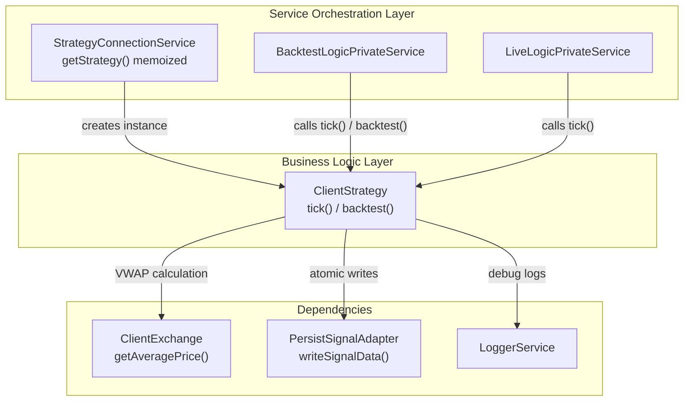
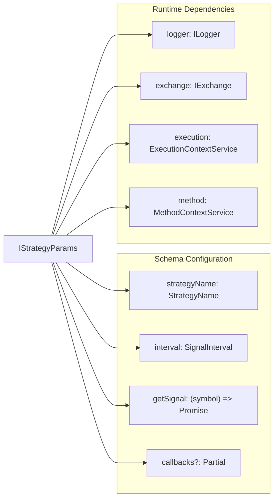
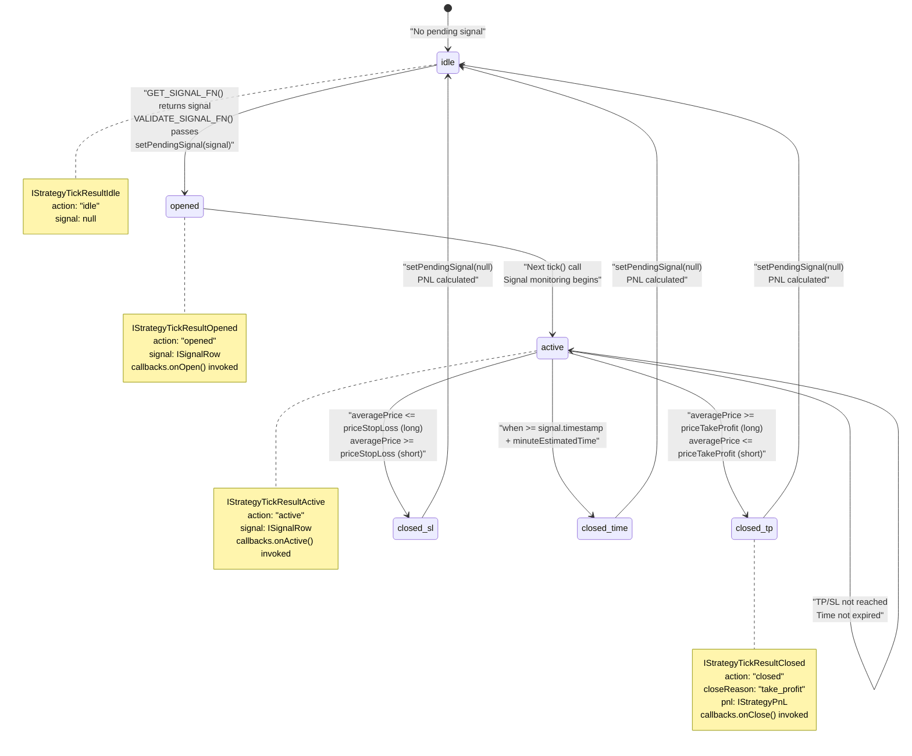
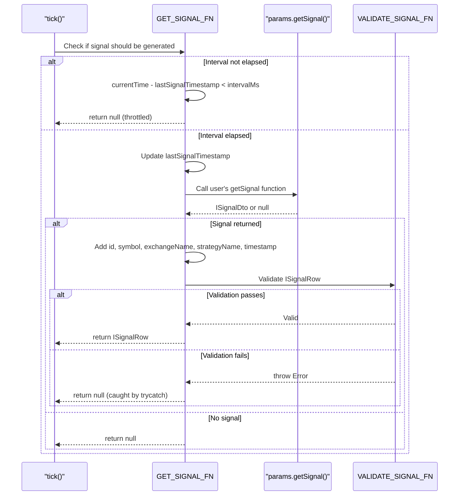
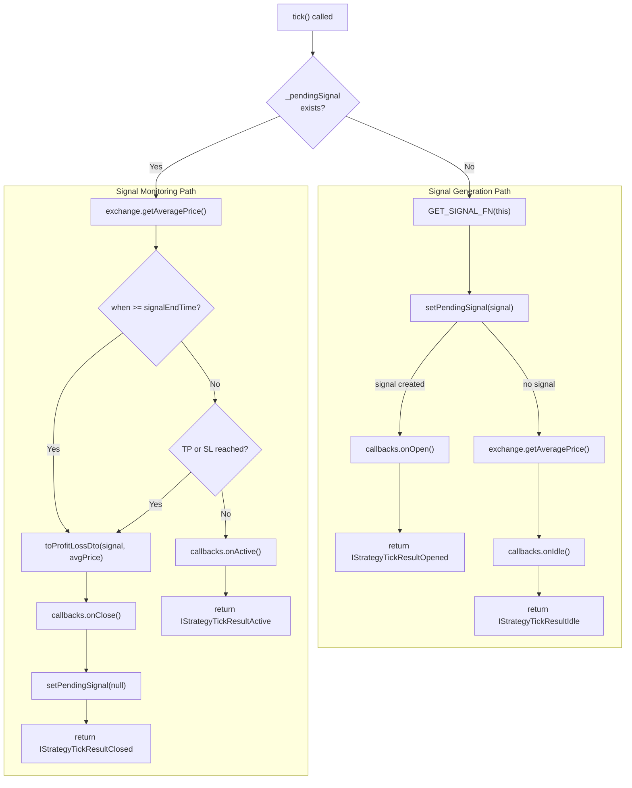
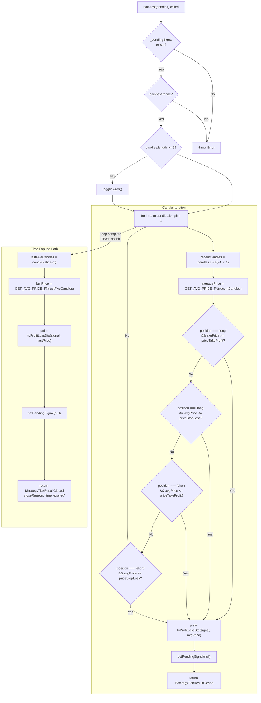
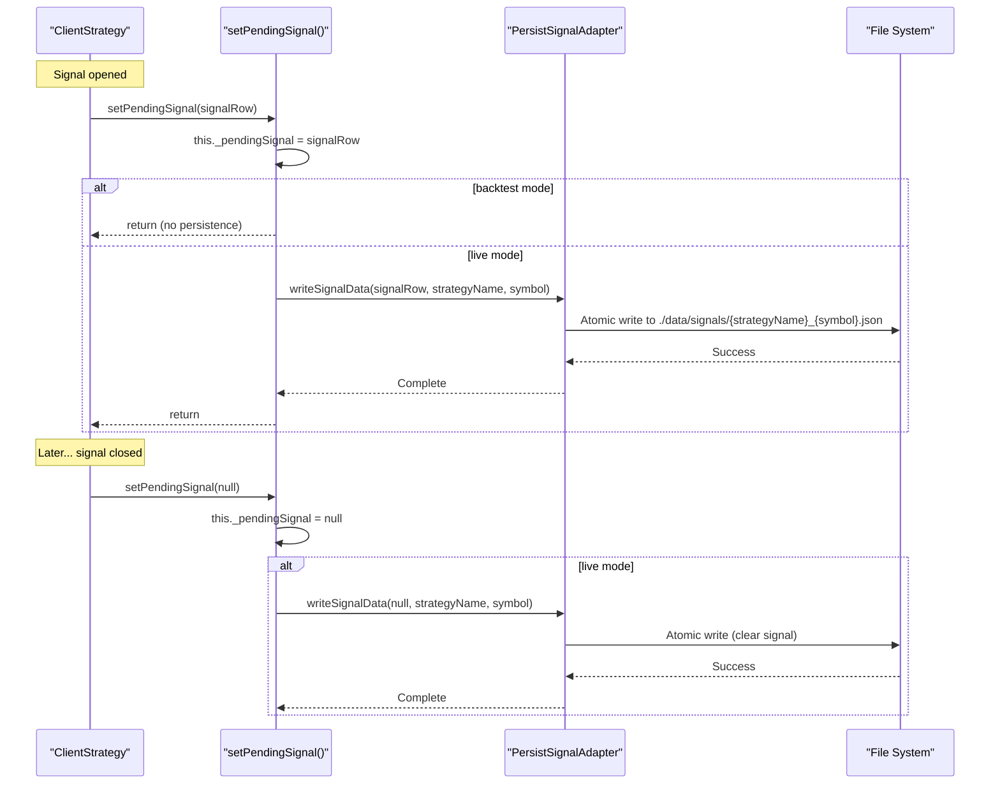
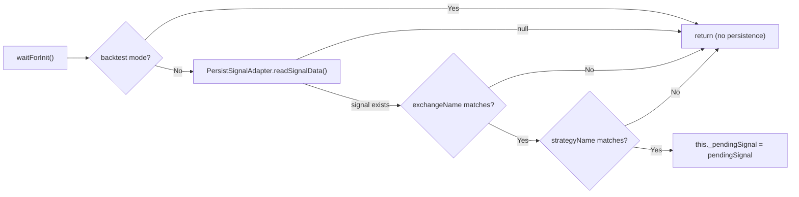
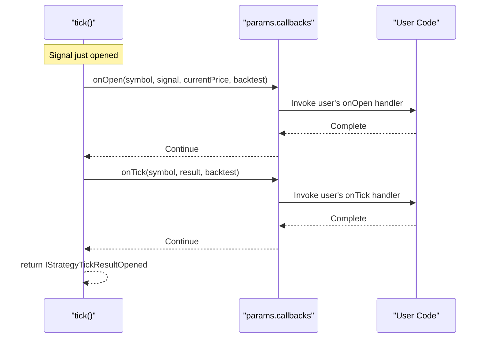
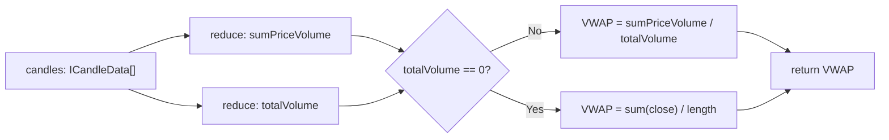

# ClientStrategy

<details>
<summary>Relevant source files</summary>

The following files were used as context for generating this wiki page:

- [src/client/ClientStrategy.ts](src/client/ClientStrategy.ts)
- [src/index.ts](src/index.ts)
- [src/interfaces/Strategy.interface.ts](src/interfaces/Strategy.interface.ts)
- [src/lib/services/connection/StrategyConnectionService.ts](src/lib/services/connection/StrategyConnectionService.ts)
- [test/index.mjs](test/index.mjs)
- [types.d.ts](types.d.ts)

</details>


## Purpose and Scope

`ClientStrategy` is the core business logic component responsible for managing the complete lifecycle of trading signals. It implements signal generation, validation, state transitions, TP/SL monitoring, crash-safe persistence, and PNL calculation. This class operates in both backtest and live trading modes without dependency injection, making it a pure, testable implementation.

For information about how `ClientStrategy` is orchestrated within the execution flow, see [Backtest Execution Flow](#7.1) and [Live Execution Flow](#8.1). For details on the persistence mechanism, see [Signal Persistence](#6.3). For PNL calculation specifics, see [PnL Calculation](#6.4).

**Sources:** [src/client/ClientStrategy.ts:167-193]()

---

## Role in System Architecture

`ClientStrategy` sits in the Business Logic Layer and is the highest-importance component in the codebase (importance score 54.04). It is instantiated and managed by `StrategyConnectionService` and invoked by `BacktestLogicPrivateService` and `LiveLogicPrivateService`.

### System Integration Diagram



**Sources:** [src/client/ClientStrategy.ts:1-660](), High-Level Diagram 1

---

## Class Structure and Constructor

The `ClientStrategy` class implements the `IStrategy` interface and manages two primary pieces of internal state:

| Field | Type | Purpose |
|-------|------|---------|
| `_pendingSignal` | `ISignalRow \| null` | Currently active signal being monitored |
| `_lastSignalTimestamp` | `number \| null` | Last time `getSignal()` was called (for throttling) |
| `params` | `IStrategyParams` | Injected dependencies and configuration |

### Constructor Parameters



**Sources:** [src/client/ClientStrategy.ts:194-198](), [src/interfaces/Strategy.interface.ts:59-69]()

---

## Signal Lifecycle State Machine

`ClientStrategy` manages signals through four distinct states, represented by discriminated union types `IStrategyTickResult`.



**Sources:** [src/client/ClientStrategy.ts:258-464](), [src/interfaces/Strategy.interface.ts:130-208]()

---

## Signal Generation and Validation

### Throttling with Interval

Signal generation is throttled at the strategy level to prevent spam. The `GET_SIGNAL_FN` helper enforces minimum intervals between `getSignal()` calls:



**Interval Constants:**

| Interval | Minutes | Milliseconds |
|----------|---------|--------------|
| `"1m"` | 1 | 60,000 |
| `"3m"` | 3 | 180,000 |
| `"5m"` | 5 | 300,000 |
| `"15m"` | 15 | 900,000 |
| `"30m"` | 30 | 1,800,000 |
| `"1h"` | 60 | 3,600,000 |

**Sources:** [src/client/ClientStrategy.ts:19-26](), [src/client/ClientStrategy.ts:90-131]()

### Validation Rules

The `VALIDATE_SIGNAL_FN` helper performs comprehensive validation before a signal is accepted:

#### Price Validation
- `priceOpen > 0`
- `priceTakeProfit > 0`
- `priceStopLoss > 0`

#### Long Position Logic
- `priceTakeProfit > priceOpen` (profit is up)
- `priceStopLoss < priceOpen` (loss is down)

#### Short Position Logic
- `priceTakeProfit < priceOpen` (profit is down)
- `priceStopLoss > priceOpen` (loss is up)

#### Time Validation
- `minuteEstimatedTime > 0`
- `timestamp > 0`

**Error Format:**
```
Invalid signal for long position:
Long: priceTakeProfit (49000) must be > priceOpen (50000)
Long: priceStopLoss (51000) must be < priceOpen (50000)
```

**Sources:** [src/client/ClientStrategy.ts:28-88]()

---

## Live Trading: tick() Method

The `tick()` method performs a single iteration of strategy execution. It is called repeatedly by `LiveLogicPrivateService` (every 1 minute + 1ms) or `BacktestLogicPrivateService` (for each timestamp in the timeframe).

### tick() Execution Flow



### TP/SL Check Logic

The method checks TP/SL conditions based on position type:

**Long Position:**
```typescript
// Take profit: price goes up
if (averagePrice >= signal.priceTakeProfit) {
  closeReason = "take_profit";
}
// Stop loss: price goes down
else if (averagePrice <= signal.priceStopLoss) {
  closeReason = "stop_loss";
}
```

**Short Position:**
```typescript
// Take profit: price goes down
if (averagePrice <= signal.priceTakeProfit) {
  closeReason = "take_profit";
}
// Stop loss: price goes up
else if (averagePrice >= signal.priceStopLoss) {
  closeReason = "stop_loss";
}
```

**Sources:** [src/client/ClientStrategy.ts:236-464](), [src/client/ClientStrategy.ts:343-371]()

---

## Backtesting: backtest() Method

The `backtest()` method performs fast-forward simulation using an array of future candles. Instead of iterating timestamp-by-timestamp, it processes candles directly to find when TP/SL is hit.

### backtest() Execution Flow



### VWAP Calculation with 5-Candle Window

The method uses a sliding 5-candle window to calculate VWAP at each step. Starting from index 4 ensures sufficient candles for accurate VWAP:

```typescript
// Iterate starting from 5th candle (index 4)
for (let i = 4; i < candles.length; i++) {
  // Get last 5 candles: [i-4, i-3, i-2, i-1, i]
  const recentCandles = candles.slice(i - 4, i + 1);
  const averagePrice = GET_AVG_PRICE_FN(recentCandles);
  // Check TP/SL...
}
```

**Why 5 candles?** This matches the live trading behavior where `ClientExchange.getAveragePrice()` uses the last 5 1-minute candles for VWAP calculation, ensuring consistency between backtest and live modes.

**Sources:** [src/client/ClientStrategy.ts:467-656](), [src/client/ClientStrategy.ts:510-598]()

---

## Persistence Integration

`ClientStrategy` uses `PersistSignalAdapter` for crash-safe state management. All signal state changes are persisted atomically before yielding results.

### Persistence Flow



### Initialization with State Recovery

The `waitForInit()` method loads persisted state on startup:



**Key Features:**
- Uses `singleshot` pattern to ensure initialization happens exactly once
- Validates that persisted signal matches current exchange/strategy context
- Skips persistence entirely in backtest mode for performance

**Sources:** [src/client/ClientStrategy.ts:146-165](), [src/client/ClientStrategy.ts:209-233]()

---

## Callback System

`ClientStrategy` supports five optional lifecycle callbacks for observability and custom logic injection:

| Callback | Trigger | Parameters | Use Case |
|----------|---------|------------|----------|
| `onTick` | Every tick result | `(symbol, result, backtest)` | Universal event tracking |
| `onOpen` | Signal opened | `(symbol, signal, currentPrice, backtest)` | Notification on new signal |
| `onActive` | Signal monitored | `(symbol, signal, currentPrice, backtest)` | Real-time position tracking |
| `onIdle` | No signal | `(symbol, currentPrice, backtest)` | Market monitoring when idle |
| `onClose` | Signal closed | `(symbol, signal, priceClose, backtest)` | PNL recording, alerts |

### Callback Invocation Pattern

All callbacks are invoked synchronously within the tick execution:



**Important:** All callbacks are invoked even if they return promises, but the execution does not await them. This ensures callbacks don't block the main execution flow.

**Sources:** [src/client/ClientStrategy.ts:266-290](), [src/client/ClientStrategy.ts:405-433](), [src/interfaces/Strategy.interface.ts:72-91]()

---

## VWAP Calculation

The `GET_AVG_PRICE_FN` helper calculates Volume-Weighted Average Price using the typical price `(high + low + close) / 3`:

### VWAP Formula

```
typicalPrice = (high + low + close) / 3
sumPriceVolume = Σ(typicalPrice × volume) for all candles
totalVolume = Σ(volume) for all candles

VWAP = sumPriceVolume / totalVolume

If totalVolume == 0:
  VWAP = average close price
```

### Implementation



This calculation is used in:
1. `backtest()` method - calculates VWAP from 5-candle sliding window
2. Indirectly via `ClientExchange.getAveragePrice()` during `tick()` method

**Sources:** [src/client/ClientStrategy.ts:133-144]()

---

## Performance Considerations

`ClientStrategy` implements several optimizations for memory efficiency and execution speed:

### Memory Optimization Techniques

| Technique | Implementation | Benefit |
|-----------|----------------|---------|
| **Prototype Methods** | All methods defined on prototype | Shared across instances, not duplicated |
| **Memoized Initialization** | `waitForInit = singleshot(async () => ...)` | Init happens exactly once per instance |
| **Minimal State** | Only `_pendingSignal` and `_lastSignalTimestamp` | ~100 bytes per instance |
| **Streaming Architecture** | Results yielded immediately | No result accumulation in memory |
| **Instance Reuse** | `StrategyConnectionService` memoizes instances | One instance per `strategyName` |

### Backtest Performance

The `backtest()` method achieves fast simulation through:

1. **Direct Candle Processing:** Iterates through candle array instead of calling `tick()` repeatedly
2. **Early Termination:** Stops at first TP/SL hit, doesn't process remaining candles
3. **No Network Calls:** Uses pre-fetched candle data, no API requests per candle
4. **VWAP Caching:** Calculates VWAP only when needed, not stored

**Example:** Backtesting a 60-minute signal requires:
- `tick()` approach: 60 calls to `tick()`, 60 VWAP calculations, 60 persistence writes
- `backtest()` approach: 1 call to `backtest()`, ~5-60 VWAP calculations (stops early), 1 persistence write

**Sources:** [src/client/ClientStrategy.ts:194-198](), [src/client/ClientStrategy.ts:209](), [src/client/ClientStrategy.ts:485-656]()

---

## Code Entity Reference

### Primary Classes and Functions

| Entity | Type | Location | Purpose |
|--------|------|----------|---------|
| `ClientStrategy` | class | [src/client/ClientStrategy.ts:194]() | Main strategy implementation |
| `tick()` | method | [src/client/ClientStrategy.ts:258]() | Single iteration of strategy execution |
| `backtest()` | method | [src/client/ClientStrategy.ts:485]() | Fast-forward signal simulation |
| `waitForInit()` | method | [src/client/ClientStrategy.ts:209]() | Load persisted state on startup |
| `setPendingSignal()` | method | [src/client/ClientStrategy.ts:220]() | Update and persist signal state |
| `GET_SIGNAL_FN` | function | [src/client/ClientStrategy.ts:90]() | Throttled signal generation wrapper |
| `VALIDATE_SIGNAL_FN` | function | [src/client/ClientStrategy.ts:28]() | Signal validation with error messages |
| `GET_AVG_PRICE_FN` | function | [src/client/ClientStrategy.ts:133]() | VWAP calculation from candles |
| `WAIT_FOR_INIT_FN` | function | [src/client/ClientStrategy.ts:146]() | State recovery logic |
| `INTERVAL_MINUTES` | constant | [src/client/ClientStrategy.ts:19]() | Interval to minutes mapping |

### Key Interfaces

| Interface | Location | Purpose |
|-----------|----------|---------|
| `IStrategy` | [src/interfaces/Strategy.interface.ts:219]() | Strategy contract with `tick()` and `backtest()` |
| `IStrategyParams` | [src/interfaces/Strategy.interface.ts:60]() | Constructor parameters |
| `ISignalRow` | [src/interfaces/Strategy.interface.ts:43]() | Complete signal with auto-generated ID |
| `ISignalDto` | [src/interfaces/Strategy.interface.ts:22]() | User-provided signal data |
| `IStrategyTickResult` | [src/interfaces/Strategy.interface.ts:204]() | Discriminated union of tick results |
| `IStrategyTickResultClosed` | [src/interfaces/Strategy.interface.ts:181]() | Closed signal with PNL |
| `IStrategyCallbacks` | [src/interfaces/Strategy.interface.ts:75]() | Lifecycle event handlers |

**Sources:** [src/client/ClientStrategy.ts:1-660](), [src/interfaces/Strategy.interface.ts:1-243]()