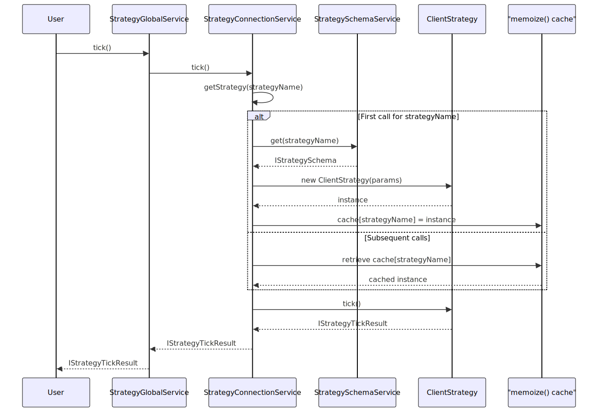

# Core Business Logic

## Purpose and Scope

This document describes the Client classes layer, which implements core business logic for signal management, market data, risk validation, and timeframe generation. Client classes are pure TypeScript classes without dependency injection, designed for memory efficiency and testability. They represent the innermost layer of the framework's architecture, containing algorithmic logic isolated from infrastructure concerns.

For information about the service layer that wraps these client classes, see [Service Layer](./38_Service_Layer.md). For details on dependency injection and context propagation, see [Architecture](./09_Architecture.md).

## Client Layer Architecture

Client classes form Layer 4 in the framework's six-layer architecture. They implement business rules and algorithms without any dependency on the DI container, making them independently testable and memory-efficient through prototype methods.



**Sources:** [src/client/ClientStrategy.ts:1-1300](), [src/lib/services/connection/StrategyConnectionService.ts:76-94](), [docs/internals.md:28-39]()

## Client Classes Overview

The framework provides five client classes, each responsible for a specific domain of business logic:

| Client Class | File Location | Primary Responsibility | Key Methods |
|-------------|---------------|----------------------|-------------|
| `ClientStrategy` | [src/client/ClientStrategy.ts]() | Signal lifecycle management, TP/SL monitoring, backtest fast-forward | `tick()`, `backtest()`, `waitForInit()`, `stop()` |
| `ClientExchange` | [src/client/ClientExchange.ts]() | Market data fetching, VWAP calculation, price/quantity formatting | `getCandles()`, `getAveragePrice()`, `formatPrice()`, `formatQuantity()` |
| `ClientRisk` | [src/client/ClientRisk.ts]() | Portfolio position tracking, custom risk validations, concurrent limits | `checkSignal()`, `addSignal()`, `removeSignal()` |
| `ClientFrame` | [src/client/ClientFrame.ts]() | Timeframe generation for backtesting, interval-based timestamp arrays | `getTimeframe()` |
| `ClientSizing` | [src/client/ClientSizing.ts]() | Position size calculation using fixed, Kelly, or ATR methods | `calculateSize()` |

**Sources:** [src/client/ClientStrategy.ts:1-1300](), [docs/internals.md:30-31]()

## Design Principles

### No Dependency Injection

Client classes receive all dependencies through constructor parameters, avoiding framework-level dependency injection:



This design allows client classes to be instantiated and tested independently without the DI container. Constructor parameters are plain objects conforming to interfaces like `IStrategyParams`.

**Sources:** [src/interfaces/Strategy.interface.ts:74-89](), [src/lib/services/connection/StrategyConnectionService.ts:76-94]()

### Prototype Methods for Memory Efficiency

Client classes use prototype methods instead of arrow functions to avoid creating new function instances for each object:

```typescript
// Prototype method (efficient - shared across instances)
class ClientStrategy {
  public tick = async (): Promise<IStrategyTickResult> => {
    // Method implementation
  }
}

// Arrow function property (inefficient - new function per instance)
class ClientStrategy {
  public tick = async (): Promise<IStrategyTickResult> => {
    // Method implementation
  }
}
```

All Client classes follow the prototype method pattern, ensuring that multiple instances share the same method implementations in memory.

**Sources:** [docs/internals.md:94-95](), [src/client/ClientStrategy.ts:1-50]()

### Private Helper Functions

Client classes extensively use module-level private functions prefixed with uppercase names (e.g., `GET_SIGNAL_FN`, `VALIDATE_SIGNAL_FN`) instead of class methods. This pattern:

1. Keeps the class interface clean with only public methods
2. Prevents accidental access to internal implementation details
3. Allows helper functions to be unit tested independently
4. Reduces memory overhead by sharing functions across all instances



**Example private function pattern:**

[src/client/ClientStrategy.ts:40-185]() defines `VALIDATE_SIGNAL_FN` as a module-level constant function that validates signal prices, TP/SL relationships, and time parameters. This function is called by `GET_SIGNAL_FN` at [src/client/ClientStrategy.ts:251]() and [src/client/ClientStrategy.ts:269]().

**Sources:** [src/client/ClientStrategy.ts:40-896]()

## Connection Service Instantiation

Connection Services act as factories that create and memoize Client class instances. The memoization pattern ensures one client instance per schema name:



The memoization key is the schema name string (e.g., `strategyName`, `exchangeName`), ensuring that multiple calls with the same name reuse the same client instance.

**Sources:** [src/lib/services/connection/StrategyConnectionService.ts:76-94](), [docs/internals.md:94]()

## Instance Lifecycle Management

Client instances persist for the duration of the application process and maintain internal state across multiple operations:

| Lifecycle Phase | Description | Relevant Methods |
|-----------------|-------------|------------------|
| **Instantiation** | Connection Service creates instance via `new ClientClass(params)` with schema configuration | Constructor |
| **Initialization** | One-time setup operations (e.g., loading persisted state) | `waitForInit()` for ClientStrategy |
| **Active Use** | Repeated method calls for core operations (tick, backtest, checkSignal) | `tick()`, `backtest()`, `checkSignal()`, etc. |
| **State Management** | Internal state tracked across calls (e.g., `_pendingSignal`, `_activePositions`) | Private instance variables |
| **Cleanup** | Graceful shutdown and resource release | `stop()` for ClientStrategy, `clear()` for Connection Services |

**Example state tracking in ClientStrategy:**

[src/client/ClientStrategy.ts:1247-1255]() shows the class constructor initializing state variables:
- `_pendingSignal`: Currently active signal being monitored
- `_scheduledSignal`: Signal waiting for price activation
- `_lastSignalTimestamp`: Interval throttling timestamp
- `_isStopped`: Graceful shutdown flag

**Sources:** [src/client/ClientStrategy.ts:1247-1300](), [src/lib/services/connection/StrategyConnectionService.ts:177-182]()

## Client Dependencies and Collaboration

Client classes collaborate through dependency references passed in constructor parameters, forming a dependency graph:



**Key collaboration patterns:**

1. **ClientStrategy → ClientExchange**: Fetches VWAP prices via `getAveragePrice()` and historical candles via `getCandles()` at [src/client/ClientStrategy.ts:209-211]()

2. **ClientStrategy → ClientRisk**: Validates signals via `checkSignal()` at [src/client/ClientStrategy.ts:214-224](), adds positions via `addSignal()` at [src/client/ClientStrategy.ts:519-523](), removes positions via `removeSignal()` at [src/client/ClientStrategy.ts:761-764]()

3. **Context Services**: All clients access `execution.context.symbol`, `execution.context.when`, `execution.context.backtest`, and `method.context.strategyName` to determine runtime behavior

**Sources:** [src/interfaces/Strategy.interface.ts:74-89](), [src/client/ClientStrategy.ts:209-224](), [src/client/ClientStrategy.ts:519-523]()

## Summary

Client classes form the core algorithmic layer of the framework, implementing business logic without dependency injection for testability and memory efficiency. The five client classes (Strategy, Exchange, Risk, Frame, Sizing) are instantiated and memoized by Connection Services, maintaining state across operations while collaborating through interface references. This architectural separation enables the framework to keep business rules isolated from infrastructure concerns.

For detailed implementation documentation of individual client classes, see:
- [ClientStrategy](./47_Signal_States.md) - Signal lifecycle and monitoring
- [ClientExchange](./33_ClientExchange.md) - Market data and formatting
- [ClientFrame](./34_ClientFrame.md) - Timeframe generation
- [ClientRisk](./35_ClientRisk.md) - Portfolio risk management
- [ClientSizing](./36_ClientSizing.md) - Position sizing algorithms

**Sources:** [docs/internals.md:28-39](), [src/client/ClientStrategy.ts:1-1300](), [src/lib/services/connection/StrategyConnectionService.ts:1-186]()