# Fast-Forward Simulation

This document describes the fast-forward simulation mechanism in the backtest-kit framework, which allows signals to be evaluated using historical candle data without iterating through every individual timestamp. This approach significantly reduces backtesting time while maintaining accuracy in profit/loss calculations.

For information about the overall backtest execution flow, see [Backtest Execution Flow](29_Backtest_Execution_Flow.md). For details on generating the timeframe array that drives backtests, see [Timeframe Generation](30_Timeframe_Generation.md). For information on signal lifecycle states, see [Signal Lifecycle](23_Signal_Lifecycle.md).

---

## Purpose and Scope

Fast-forward simulation provides an optimized backtesting strategy by processing an entire signal's lifecycle using a pre-fetched array of candle data. Instead of calling `tick()` at every timestamp in the backtest period, the system:

1. Calls `tick()` to detect when a signal opens
2. Fetches future candles covering the signal's `minuteEstimatedTime`
3. Calls `backtest(candles)` to simulate the signal's outcome in a single operation
4. Returns a closed result with PNL and close reason

This approach is implemented in the `ClientStrategy.backtest()` method and orchestrated by `BacktestLogicPrivateService`.


---

## Fast-Forward vs Real-Time Execution

The framework supports two distinct execution modes for signals:

| Aspect | Real-Time (tick) | Fast-Forward (backtest) |
|--------|------------------|-------------------------|
| **Entry point** | `ClientStrategy.tick()` | `ClientStrategy.backtest()` |
| **Price source** | `exchange.getAveragePrice()` | Pre-fetched candle array |
| **Iteration** | One timestamp at a time | All candles in one pass |
| **Use case** | Live trading, detailed backtests | Fast backtests |
| **Result state** | Can be idle, opened, active, or closed | Always closed |
| **Performance** | Slow (API calls per timestamp) | Fast (single array iteration) |


**Diagram: Execution Mode Comparison**


---

## Method Signature and Validation

The `backtest()` method is defined in `ClientStrategy` and implements the `IStrategy` interface:

```typescript
public async backtest(
  candles: ICandleData[]
): Promise<IStrategyBacktestResult>
```

**Type Aliases:**
- `IStrategyBacktestResult` is an alias for `IStrategyTickResultClosed`
- Always returns a closed signal with PNL calculation

**Pre-conditions validated at method entry:**
1. A pending signal must exist (`this._pendingSignal !== null`)
2. Execution context must be in backtest mode (`context.backtest === true`)
3. Candles array should contain at least 5 elements for VWAP calculation


---

## VWAP Calculation from Candle Windows

The fast-forward simulation uses Volume-Weighted Average Price (VWAP) to determine the effective market price at each timestamp. VWAP is calculated using a sliding 5-candle window.

### VWAP Formula

The `GET_AVG_PRICE_FN` helper function implements the calculation:

```
For each candle:
  typicalPrice = (high + low + close) / 3
  
weightedSum = Σ(typicalPrice * volume)
totalVolume = Σ(volume)

VWAP = weightedSum / totalVolume
```

**Fallback:** If `totalVolume === 0`, falls back to simple average of close prices.



**Diagram: VWAP Calculation from 5-Candle Window**


---

## Candle-by-Candle Iteration Logic

The `backtest()` method iterates through the candle array, checking TP/SL conditions on each timestamp.

### Iteration Start Index

The loop **starts at index 4** (the 5th candle) to ensure at least 5 candles are available for VWAP calculation:

```typescript
for (let i = 4; i < candles.length; i++) {
  const recentCandles = candles.slice(i - 4, i + 1); // Last 5 candles
  const averagePrice = GET_AVG_PRICE_FN(recentCandles);
  // ... check TP/SL
}
```

**Warning logged if candles.length < 5:** The system warns but continues execution with available data.

---

## Position-Specific TP/SL Logic

The fast-forward simulation checks different conditions based on signal position type.

### Long Position

```
Take Profit:  averagePrice >= signal.priceTakeProfit
Stop Loss:    averagePrice <= signal.priceStopLoss
```

**Example:**
- `priceOpen = 50000`
- `priceTakeProfit = 51000` (higher is profit)
- `priceStopLoss = 49000` (lower is loss)

### Short Position

```
Take Profit:  averagePrice <= signal.priceTakeProfit
Stop Loss:    averagePrice >= signal.priceStopLoss
```

**Example:**
- `priceOpen = 50000`
- `priceTakeProfit = 49000` (lower is profit for short)
- `priceStopLoss = 51000` (higher is loss for short)



**Diagram: Position-Specific TP/SL Decision Tree**


---

## Time Expiration Handling

If the loop completes without hitting TP or SL, the signal closes due to `time_expired`.

### Time Expiration Logic

When all candles have been processed without triggering TP/SL:

1. Extract the last 5 candles: `candles.slice(-5)`
2. Calculate final VWAP from those 5 candles
3. Use the timestamp of the last candle as `closeTimestamp`
4. Calculate PNL using the final VWAP
5. Return closed result with `closeReason: "time_expired"`

**Warning:** If PNL is negative on time expiration, a warning is logged.



**Diagram: Time Expiration Flow**


---

## PnL Calculation and Result Generation

When a signal closes (via TP, SL, or time expiration), the system calculates profit/loss and generates a result.

### PnL Calculation

The `toProfitLossDto` helper applies fees and slippage:

```
PERCENT_SLIPPAGE = 0.1% (0.001)
PERCENT_FEE = 0.1% (0.001)

Long:
  priceOpen = priceOpen × (1 + slippage + fee)
  priceClose = priceClose × (1 - slippage - fee)
  pnl% = ((priceClose - priceOpen) / priceOpen) × 100

Short:
  priceOpen = priceOpen × (1 - slippage + fee)
  priceClose = priceClose × (1 + slippage + fee)
  pnl% = ((priceOpen - priceClose) / priceOpen) × 100
```

### Result Structure

The `IStrategyTickResultClosed` object includes:

| Field | Type | Description |
|-------|------|-------------|
| `action` | `"closed"` | Discriminator for type safety |
| `signal` | `ISignalRow` | Original signal with all parameters |
| `currentPrice` | `number` | Final VWAP at close |
| `closeReason` | `StrategyCloseReason` | `"take_profit"`, `"stop_loss"`, or `"time_expired"` |
| `closeTimestamp` | `number` | Unix timestamp in milliseconds |
| `pnl` | `IStrategyPnL` | PNL with adjusted prices and percentage |
| `strategyName` | `string` | Strategy identifier |
| `exchangeName` | `string` | Exchange identifier |


---

## Integration with Backtest Orchestration

The `backtest()` method is called by `BacktestLogicPrivateService` as part of the overall backtest execution flow.

### Orchestration Sequence


**Diagram: Fast-Forward Simulation in Backtest Context**

### Method Call Chain

```
BacktestLogicPrivateService.execute()
  ↓
  for (timestamp of timeframe):
    ↓
    strategy.tick()  // Detect signal open
    ↓
    if (signal opened):
      ↓
      exchange.getNextCandles(minuteEstimatedTime)
      ↓
      strategy.backtest(candles)  // Fast-forward simulation
      ↓
      yield closed result
```

**Key optimization:** After `backtest()` returns a closed result, the loop continues to the next timeframe timestamp. This avoids iterating through the signal's duration tick-by-tick.


---

## Callbacks and Lifecycle Events

The `backtest()` method triggers lifecycle callbacks during execution:

### Callback Invocation Points

1. **Before closing signal:**
   - `callbacks.onClose(symbol, signal, averagePrice, backtest=true)`

2. **After generating result:**
   - `callbacks.onTick(symbol, result, backtest=true)`

### State Persistence

After closing the signal:
```typescript
await this.setPendingSignal(null);
```

This clears the pending signal in memory. In backtest mode, disk persistence is skipped (no file I/O).


---

## Performance Characteristics

### Time Complexity

Given:
- `N` = number of candles in array
- `W` = VWAP window size (always 5)

**Per-candle cost:** O(W) = O(5) = O(1) for VWAP calculation

**Total cost:** O(N × W) = O(N × 5) = O(N)

### Memory Efficiency

- **Input:** Array of `N` candles (pre-allocated by caller)
- **Working set:** Sliding window of 5 candles (reused via `slice`)
- **Output:** Single `IStrategyTickResultClosed` object

**No memory accumulation** - the method processes candles in a single pass without building intermediate structures.

### Comparison with Real-Time Tick

| Metric | Real-Time (tick) | Fast-Forward (backtest) |
|--------|------------------|-------------------------|
| **API calls** | 1 per timestamp | 0 (pre-fetched) |
| **Iterations** | M timestamps | N candles (N ≈ M) |
| **Disk I/O** | 1 write per state change | 0 (backtest mode) |
| **Results yielded** | Multiple (idle, opened, active, closed) | 1 (closed) |

**Typical speedup:** 10-100x faster depending on API latency and timestamp granularity.


---

## Error Handling and Edge Cases

### Missing Pending Signal

```typescript
if (!signal) {
  throw new Error("ClientStrategy backtest: no pending signal");
}
```

**Cause:** `backtest()` called when no signal is active.

**Resolution:** Ensure `tick()` returns `opened` result before calling `backtest()`.

### Live Context Detection

```typescript
if (!this.params.execution.context.backtest) {
  throw new Error("ClientStrategy backtest: running in live context");
}
```

**Cause:** `backtest()` called in live trading mode.

**Resolution:** Fast-forward simulation is only valid in backtest mode. Use `tick()` for live trading.

### Insufficient Candles

```typescript
if (candles.length < 5) {
  this.params.logger.warn(
    `ClientStrategy backtest: Expected at least 5 candles for VWAP, got ${candles.length}`
  );
}
```

**Behavior:** Continues execution with available candles, but VWAP accuracy may be reduced.

### Negative PNL Warnings

When a signal closes at a loss, warnings are logged:

```typescript
if (closeReason === "stop_loss") {
  this.params.logger.warn(
    `ClientStrategy backtest: Signal closed with loss (stop_loss), PNL: ${pnl.pnlPercentage.toFixed(2)}%`
  );
}

if (closeReason === "time_expired" && pnl.pnlPercentage < 0) {
  this.params.logger.warn(
    `ClientStrategy backtest: Signal closed with loss (time_expired), PNL: ${pnl.pnlPercentage.toFixed(2)}%`
  );
}
```


---

## Code Entity Summary

This section maps natural language concepts to specific code entities for easy reference.

| Concept | Code Entity | Location |
|---------|-------------|----------|
| Fast-forward simulation method | `ClientStrategy.backtest()` | [src/client/ClientStrategy.ts:485-656]() |
| VWAP calculation | `GET_AVG_PRICE_FN` | [src/client/ClientStrategy.ts:133-144]() |
| Result type | `IStrategyBacktestResult` | [src/interfaces/Strategy.interface.ts:213]() |
| Closed result type | `IStrategyTickResultClosed` | [src/interfaces/Strategy.interface.ts:181-198]() |
| PNL calculation | `toProfitLossDto()` | [src/helpers/toProfitLossDto.ts]() |
| Signal validation | `VALIDATE_SIGNAL_FN` | [src/client/ClientStrategy.ts:28-88]() |
| State persistence | `ClientStrategy.setPendingSignal()` | [src/client/ClientStrategy.ts:220-233]() |
| Backtest orchestration | `BacktestLogicPrivateService.execute()` | [src/lib/services/logic/private/BacktestLogicPrivateService.ts]() |
| Candle data type | `ICandleData` | [src/interfaces/Exchange.interface.ts]() |
| Signal row type | `ISignalRow` | [src/interfaces/Strategy.interface.ts:43-54]() |

