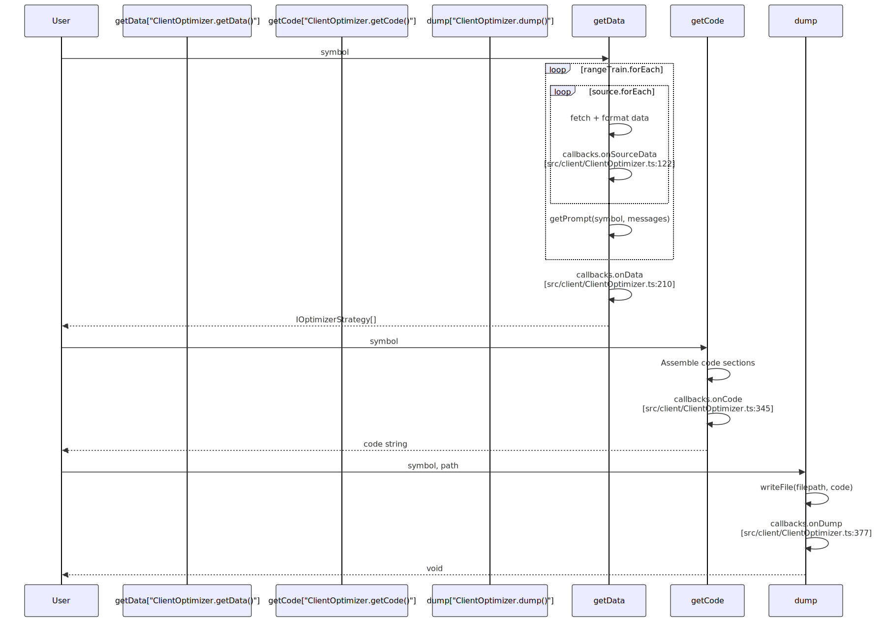
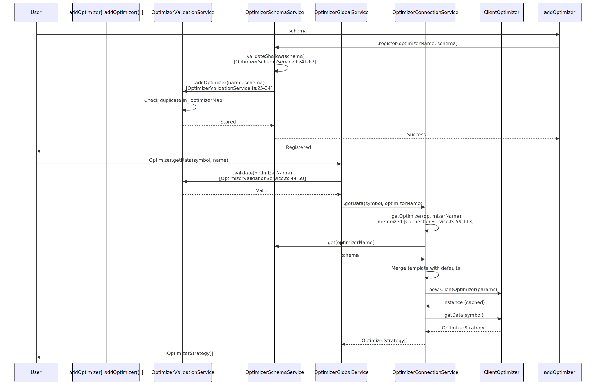

# Optimizer Schemas

## Purpose and Scope

This page documents the `IOptimizerSchema` interface used with `addOptimizer()` to register AI-powered strategy optimizers. The schema configures:

- **Data collection**: Paginated fetching from multiple sources via `IOptimizerSource`
- **LLM integration**: Conversation history building with `MessageModel[]` and prompt generation via `getPrompt()`
- **Code generation**: Template-based strategy code export through `IOptimizerTemplate`

For optimizer execution and lifecycle, see [AI-Powered Strategy Optimization](./90_AI-Powered_Strategy_Optimization.md). For other registration schemas, see [Strategy Schemas](./25_Strategy_Schemas.md), [Exchange Schemas](./26_Exchange_Schemas.md), [Walker Schemas](./30_Walker_Schemas.md).

Sources: [src/interfaces/Optimizer.interface.ts:380-433](), [src/function/add.ts]() (addOptimizer function)

---

## Schema Structure Overview



**Diagram: IOptimizerSchema Structure and Registration Flow**

The schema defines required configuration (training/test ranges, data sources, prompt generation) and optional customization (template overrides, lifecycle hooks). Registration flows through `OptimizerSchemaService` and `OptimizerValidationService`, with runtime access via `OptimizerConnectionService`.

Sources: [src/interfaces/Optimizer.interface.ts:380-433](), [src/lib/services/schema/OptimizerSchemaService.ts:28-32](), [src/lib/services/validation/OptimizerValidationService.ts:25-34](), [src/lib/services/connection/OptimizerConnectionService.ts:59-113]()

---

## Required Fields

### optimizerName

**Type:** `OptimizerName` (string alias)

**Purpose:** Unique identifier for registry lookup and memoization.

```typescript
optimizerName: "my-optimizer"
```

Used as:
- Memoization key in `OptimizerConnectionService.getOptimizer()` [src/lib/services/connection/OptimizerConnectionService.ts:60]()
- Filename prefix in generated code: `{optimizerName}_{symbol}.mjs` [src/client/ClientOptimizer.ts:371]()
- Validation map key in `OptimizerValidationService._optimizerMap` [src/lib/services/validation/OptimizerValidationService.ts:15]()

Must be filesystem-safe and unique across all registered optimizers.

Sources: [src/interfaces/Optimizer.interface.ts:390](), [src/client/ClientOptimizer.ts:371](), [src/lib/services/connection/OptimizerConnectionService.ts:60]()

---

### rangeTrain

**Type:** `IOptimizerRange[]`

**Purpose:** Training time ranges. Each range generates one strategy variant via data collection and LLM prompt generation.

```typescript
interface IOptimizerRange {
  note?: string;
  startDate: Date;    // Inclusive
  endDate: Date;      // Inclusive
}

// Example: Generate strategies from 2 different market conditions
rangeTrain: [
  {
    note: "Bull market period",
    startDate: new Date("2024-01-01T00:00:00Z"),
    endDate: new Date("2024-01-07T23:59:59Z"),
  },
  {
    note: "Bear market period", 
    startDate: new Date("2024-02-01T00:00:00Z"),
    endDate: new Date("2024-02-07T23:59:59Z"),
  }
]
```

**Processing in `ClientOptimizer.GET_STRATEGY_DATA_FN()`:**

For each training range:
1. Iterate through `source[]` array
2. Call `fetch({ symbol, startDate, endDate, limit, offset })` with pagination
3. Format data into `MessageModel[]` using `user()` and `assistant()` formatters
4. Append to conversation history
5. Call `getPrompt(symbol, messages)` to generate strategy prompt

Generated strategies are compared on `rangeTest` via Walker to identify best performer.

Sources: [src/interfaces/Optimizer.interface.ts:16-32](), [src/interfaces/Optimizer.interface.ts:396](), [src/client/ClientOptimizer.ts:104-198]()

---

### rangeTest

**Type:** `IOptimizerRange`

**Purpose:** Testing time range for strategy comparison. Used in generated Walker configuration to evaluate all training variants on unseen data.

```typescript
rangeTest: {
  note: "Validation period",
  startDate: new Date("2024-03-01T00:00:00Z"),
  endDate: new Date("2024-03-07T23:59:59Z"),
}
```

**Generated Code Usage:**

In `ClientOptimizer.GET_STRATEGY_CODE_FN()`, the test range becomes:
1. A Frame definition via `template.getFrameTemplate(symbol, testFrameName, "1m", startDate, endDate)` [src/client/ClientOptimizer.ts:286-296]()
2. Walker configuration parameter: `addWalker({ frameName: testFrameName, ... })` [src/client/ClientOptimizer.ts:318-332]()

Should be chronologically after `rangeTrain[]` to prevent look-ahead bias.

Sources: [src/interfaces/Optimizer.interface.ts:402](), [src/client/ClientOptimizer.ts:286-296](), [src/client/ClientOptimizer.ts:318-332]()

---

### source

**Type:** `Source[]` - union type `IOptimizerSourceFn | IOptimizerSource`

**Purpose:** Data sources for building LLM conversation history. Two variants supported:

#### Variant 1: Function-only (uses default formatters)

```typescript
type IOptimizerSourceFn<Data extends IOptimizerData> = 
  (args: IOptimizerFetchArgs) => Data[] | Promise<Data[]>;

// Example
source: [
  async ({ symbol, startDate, endDate, limit, offset }) => {
    const response = await fetch(`/api/data?symbol=${symbol}&limit=${limit}&offset=${offset}`);
    return response.json(); // Must return { id: string | number }[]
  }
]
```

Uses default formatters from `OptimizerTemplateService`:
- User message: `template.getUserMessage(symbol, data, name)` [src/lib/services/template/OptimizerTemplateService.ts:77-88]()
- Assistant message: `template.getAssistantMessage(symbol, data, name)` [src/lib/services/template/OptimizerTemplateService.ts:99-110]()

#### Variant 2: Full configuration (custom formatters)

```typescript
interface IOptimizerSource<Data extends IOptimizerData> {
  name: string;
  fetch: IOptimizerSourceFn<Data>;
  user?: (symbol: string, data: Data[], name: string) => string | Promise<string>;
  assistant?: (symbol: string, data: Data[], name: string) => string | Promise<string>;
}

// Example
source: [
  {
    name: "1h-candles",
    fetch: async ({ symbol, startDate, endDate, limit, offset }) => {
      const url = `${API_URL}/candles?symbol=${symbol}&limit=${limit}&offset=${offset}`;
      return await fetchApi(url);
    },
    user: (symbol, data, name) => `# Analysis\n${JSON.stringify(data)}`,
    assistant: () => "Data processed"
  }
]
```

**Processing in `ClientOptimizer`:**

```typescript
// Pagination via iterateDocuments (src/client/ClientOptimizer.ts:74-86)
const RESOLVE_PAGINATION_FN = async (fetch, filterData) => {
  const iterator = iterateDocuments({
    limit: ITERATION_LIMIT,  // 25
    async createRequest({ limit, offset }) {
      return await fetch({ symbol, startDate, endDate, limit, offset });
    }
  });
  const distinct = distinctDocuments(iterator, (data) => data.id);
  return await resolveDocuments(distinct);
};
```

All returned data must have `id` field for deduplication. Empty array signals end of pagination.

Sources: [src/interfaces/Optimizer.interface.ts:92-186](), [src/client/ClientOptimizer.ts:70-88](), [src/client/ClientOptimizer.ts:106-187]()

---

### getPrompt

**Type:** `(symbol: string, messages: MessageModel[]) => string | Promise<string>`

**Purpose:** Generates strategy prompt from accumulated conversation history. Called once per `rangeTrain` element after all sources processed.

```typescript
interface MessageModel {
  role: "assistant" | "system" | "user";
  content: string;
}

// Example implementation
getPrompt: async (symbol, messages) => {
  const ollama = new Ollama({
    host: "https://ollama.com",
    headers: { Authorization: `Bearer ${process.env.OLLAMA_API_KEY}` }
  });

  const response = await ollama.chat({
    model: "deepseek-v3.1:671b",
    messages: [
      { role: "system", content: "Generate trading strategy from market data" },
      ...messages,  // All source data formatted as user/assistant pairs
      { role: "user", content: `Create entry/exit rules for ${symbol}` }
    ]
  });

  return response.message.content.trim();
}
```

**Message Array Construction:**

For each source in `rangeTrain` range:
```typescript
// ClientOptimizer.GET_STRATEGY_DATA_FN (src/client/ClientOptimizer.ts:104-198)
messageList.push(
  { role: "user", content: userContent },      // From source.user() or default
  { role: "assistant", content: assistantContent }  // From source.assistant() or default
);
```

**Output Usage:**

Returned prompt embedded in generated strategy via `template.getStrategyTemplate(strategyName, interval, prompt)` [src/lib/services/template/OptimizerTemplateService.ts:166-303](), where it guides runtime LLM signal generation.

Sources: [src/interfaces/Optimizer.interface.ts:418-421](), [src/model/Message.model.ts:1-25](), [src/client/ClientOptimizer.ts:196](), [src/lib/services/template/OptimizerTemplateService.ts:166-303]()

---

## Optional Fields

### template

**Type:** `Partial<IOptimizerTemplate>`

**Purpose:** Override default code generation templates. Unspecified methods use `OptimizerTemplateService` defaults.

**Template Methods (11 total):**

| Method | Generates | Default Implementation |
|--------|-----------|----------------------|
| `getTopBanner` | Shebang + imports | [OptimizerTemplateService.ts:36-66]() |
| `getUserMessage` | Data → LLM user prompt | [OptimizerTemplateService.ts:77-88]() |
| `getAssistantMessage` | LLM acknowledgment | [OptimizerTemplateService.ts:99-110]() |
| `getExchangeTemplate` | `addExchange()` call | [OptimizerTemplateService.ts:314-342]() |
| `getFrameTemplate` | `addFrame()` call | [OptimizerTemplateService.ts:354-384]() |
| `getStrategyTemplate` | `addStrategy()` with LLM | [OptimizerTemplateService.ts:166-303]() |
| `getWalkerTemplate` | `addWalker()` call | [OptimizerTemplateService.ts:122-157]() |
| `getLauncherTemplate` | `Walker.background()` + listeners | [OptimizerTemplateService.ts:395-443]() |
| `getTextTemplate` | `async function text()` | [OptimizerTemplateService.ts:555-612]() |
| `getJsonTemplate` | `async function json()` | [OptimizerTemplateService.ts:629-712]() |
| `getJsonDumpTemplate` | `async function dumpJson()` | [OptimizerTemplateService.ts:452-546]() |

**Template Merging:**

In `OptimizerConnectionService.getOptimizer()` [src/lib/services/connection/OptimizerConnectionService.ts:70-97]():

```typescript
const {
  getAssistantMessage = this.optimizerTemplateService.getAssistantMessage,
  getExchangeTemplate = this.optimizerTemplateService.getExchangeTemplate,
  // ... other methods with fallbacks
} = rawTemplate;

const template: IOptimizerTemplate = {
  getAssistantMessage,
  getExchangeTemplate,
  // ... complete merged template
};
```

Custom methods override defaults while preserving unspecified methods.

**Customization Example:**

```typescript
template: {
  // Override strategy generation to use custom logic
  getStrategyTemplate: async (strategyName, interval, prompt) => {
    return `
addStrategy({
  strategyName: "${strategyName}",
  interval: "${interval}",
  getSignal: async (symbol) => {
    const candles = await getCandles(symbol, "1h", 24);
    const rsi = calculateRSI(candles);
    if (rsi < 30) return { position: "long", ... };
    return { position: "wait" };
  }
});`;
  }
}
```

Sources: [src/interfaces/Optimizer.interface.ts:242-374](), [src/lib/services/template/OptimizerTemplateService.ts:27-713](), [src/lib/services/connection/OptimizerConnectionService.ts:70-97]()

---

### callbacks

**Type:** `Partial<IOptimizerCallbacks>`

**Purpose:** Lifecycle hooks for monitoring optimizer execution. All optional.

```typescript
interface IOptimizerCallbacks {
  onSourceData?: (symbol, sourceName, data, startDate, endDate) => void | Promise<void>;
  onData?: (symbol, strategyData: IOptimizerStrategy[]) => void | Promise<void>;
  onCode?: (symbol, code: string) => void | Promise<void>;
  onDump?: (symbol, filepath: string) => void | Promise<void>;
}
```

**Callback Invocation in `ClientOptimizer`:**



**Diagram: Callback Invocation Points in ClientOptimizer**

**Usage Example:**

```typescript
callbacks: {
  onSourceData: (symbol, sourceName, data, startDate, endDate) => {
    console.log(`[${sourceName}] ${data.length} records for ${symbol}`);
  },
  onData: (symbol, strategies) => {
    console.log(`Generated ${strategies.length} strategies`);
  },
  onCode: (symbol, code) => {
    console.log(`Code: ${code.split('\n').length} lines`);
  },
  onDump: (symbol, filepath) => {
    console.log(`Saved to ${filepath}`);
  }
}
```

Callbacks are synchronous or async. If they return promises, execution blocks until resolution. Cannot modify data but can perform logging, metrics, validation.

Sources: [src/interfaces/Optimizer.interface.ts:191-236](), [src/client/ClientOptimizer.ts:122-130](), [src/client/ClientOptimizer.ts:161-168](), [src/client/ClientOptimizer.ts:210-212](), [src/client/ClientOptimizer.ts:345-347](), [src/client/ClientOptimizer.ts:377-379]()

---

## Data Source Processing

### Pagination Implementation

**Fetch Function Signature:**

```typescript
interface IOptimizerFetchArgs {
  symbol: string;
  startDate: Date;
  endDate: Date;
  limit: number;    // Default: 25 (ITERATION_LIMIT)
  offset: number;   // Pagination offset
}

interface IOptimizerData {
  id: string | number;  // Required for deduplication
  // ... other fields
}

type IOptimizerSourceFn<Data extends IOptimizerData> = 
  (args: IOptimizerFetchArgs) => Data[] | Promise<Data[]>;
```

**Pagination in `RESOLVE_PAGINATION_FN()`:**

```typescript
// src/client/ClientOptimizer.ts:70-88
const RESOLVE_PAGINATION_FN = async (fetch, filterData) => {
  const iterator = iterateDocuments({
    limit: ITERATION_LIMIT,  // 25
    async createRequest({ limit, offset }) {
      return await fetch({
        symbol: filterData.symbol,
        startDate: filterData.startDate,
        endDate: filterData.endDate,
        limit,
        offset,
      });
    },
  });
  
  // Deduplication by id field
  const distinct = distinctDocuments(iterator, (data) => data.id);
  return await resolveDocuments(distinct);
};
```

**Requirements:**

1. Return empty array `[]` when no more data (signals pagination end)
2. All objects must have unique `id: string | number` for deduplication
3. Honor `limit` and `offset` parameters
4. Filter by `startDate` and `endDate`

Sources: [src/interfaces/Optimizer.interface.ts:48-94](), [src/client/ClientOptimizer.ts:19-88]()

---

## Registration and Usage

### Registration with addOptimizer

```typescript
import { addOptimizer } from "backtest-kit";

addOptimizer({
  optimizerName: "trend-analyzer",
  
  rangeTrain: [
    {
      note: "Week 1",
      startDate: new Date("2024-01-01T00:00:00Z"),
      endDate: new Date("2024-01-07T23:59:59Z"),
    },
    {
      note: "Week 2",
      startDate: new Date("2024-01-08T00:00:00Z"),
      endDate: new Date("2024-01-14T23:59:59Z"),
    },
  ],
  
  rangeTest: {
    note: "Week 3 validation",
    startDate: new Date("2024-01-15T00:00:00Z"),
    endDate: new Date("2024-01-21T23:59:59Z"),
  },
  
  source: [
    {
      name: "hourly-candles",
      fetch: async ({ symbol, startDate, endDate, limit, offset }) => {
        const response = await fetch(
          `https://api.exchange.com/candles?symbol=${symbol}&interval=1h&limit=${limit}&offset=${offset}`
        );
        return response.json();
      },
      user: (symbol, data) => {
        return `Analyze ${data.length} hourly candles for ${symbol}`;
      },
      assistant: () => "Hourly data processed"
    }
  ],
  
  getPrompt: async (symbol, messages) => {
    const ollama = new Ollama({
      host: "https://ollama.com",
      headers: { Authorization: `Bearer ${process.env.OLLAMA_API_KEY}` },
    });
    
    const response = await ollama.chat({
      model: "deepseek-v3.1:671b",
      messages: [
        { role: "system", content: "Generate trading strategy from data" },
        ...messages,
        { 
          role: "user",
          content: `Create strategy for ${symbol} with clear entry/exit rules`
        }
      ]
    });
    
    return response.message.content.trim();
  },
  
  callbacks: {
    onData: (symbol, strategies) => {
      console.log(`Generated ${strategies.length} strategies for ${symbol}`);
    },
    onDump: (symbol, filepath) => {
      console.log(`Saved to ${filepath}`);
    }
  }
});
```

Sources: [demo/optimization/src/index.mjs:1-320]()

---

### Execution Methods

After registration, the optimizer exposes three methods via the `Optimizer` utility:

```typescript
import { Optimizer, listenOptimizerProgress } from "backtest-kit";

// 1. getData(): Fetch data and generate strategies
const strategies = await Optimizer.getData("BTCUSDT", "trend-analyzer");
console.log(strategies);
// [
//   {
//     symbol: "BTCUSDT",
//     name: "hourly-candles",
//     messages: [...],
//     strategy: "Buy when RSI < 30, sell when RSI > 70..."
//   },
//   ...
// ]

// 2. getCode(): Generate executable code
const code = await Optimizer.getCode("BTCUSDT", "trend-analyzer");
console.log(code);
// "#!/usr/bin/env node\n\nimport { Ollama } from 'ollama';\n..."

// 3. dump(): Save code to file
await Optimizer.dump("BTCUSDT", "trend-analyzer", "./output");
// Creates: ./output/trend-analyzer_BTCUSDT.mjs

// Listen to progress events
listenOptimizerProgress((event) => {
  console.log(`Progress: ${(event.progress * 100).toFixed(2)}%`);
  console.log(`Processed: ${event.processedSources} / ${event.totalSources}`);
});
```

#### Code Assembly Pipeline



**Diagram: Code Generation Pipeline**

The generated file is a standalone Node.js module that can be executed directly:

```bash
# Execute generated strategy comparison
chmod +x ./output/trend-analyzer_BTCUSDT.mjs
./output/trend-analyzer_BTCUSDT.mjs
```

Sources: [src/client/ClientOptimizer.ts:225-350](), [src/lib/services/connection/OptimizerConnectionService.ts:122-171]()

---

## Schema Validation

### Validation in `OptimizerSchemaService.validateShallow()`

**Required Field Checks:**

```typescript
// src/lib/services/schema/OptimizerSchemaService.ts:41-67
private validateShallow = (optimizerSchema: IOptimizerSchema) => {
  // 1. optimizerName must be string
  if (typeof optimizerSchema.optimizerName !== "string") {
    throw new Error(`optimizer template validation failed: missing optimizerName`);
  }

  // 2. rangeTrain must be non-empty array
  if (!Array.isArray(optimizerSchema.rangeTrain) || optimizerSchema.rangeTrain.length === 0) {
    throw new Error(
      `optimizer template validation failed: rangeTrain must be a non-empty array for optimizerName=${optimizerSchema.optimizerName}`
    );
  }

  // 3. source must be non-empty array
  if (!Array.isArray(optimizerSchema.source) || optimizerSchema.source.length === 0) {
    throw new Error(
      `optimizer template validation failed: source must be a non-empty array for optimizerName=${optimizerSchema.optimizerName}`
    );
  }

  // 4. getPrompt must be function
  if (typeof optimizerSchema.getPrompt !== "function") {
    throw new Error(
      `optimizer template validation failed: getPrompt must be a function for optimizerName=${optimizerSchema.optimizerName}`
    );
  }
};
```

### Duplicate Detection in `OptimizerValidationService`

```typescript
// src/lib/services/validation/OptimizerValidationService.ts:25-34
public addOptimizer = (optimizerName: OptimizerName, optimizerSchema: IOptimizerSchema) => {
  if (this._optimizerMap.has(optimizerName)) {
    throw new Error(`optimizer ${optimizerName} already exist`);
  }
  this._optimizerMap.set(optimizerName, optimizerSchema);
};
```

**Validation Summary:**

| Field | Rule | Error if Invalid |
|-------|------|------------------|
| `optimizerName` | String, unique | Registration/retrieval time |
| `rangeTrain` | Non-empty array | Registration time |
| `source` | Non-empty array | Registration time |
| `getPrompt` | Function | Registration time |
| `template` | If present, all methods must be functions | Runtime (TypeScript checks) |
| `callbacks` | If present, all hooks must be functions | Runtime (TypeScript checks) |

Validation occurs in `OptimizerSchemaService.register()` [src/lib/services/schema/OptimizerSchemaService.ts:28-32](), throwing descriptive errors before storage.

Sources: [src/lib/services/schema/OptimizerSchemaService.ts:28-67](), [src/lib/services/validation/OptimizerValidationService.ts:25-34]()

---

## Schema Lifecycle



**Diagram: Schema Registration and Retrieval Flow**

**Key Services:**

1. **OptimizerSchemaService**: Validates and stores schemas using `ToolRegistry` [src/lib/services/schema/OptimizerSchemaService.ts:13-97]()
2. **OptimizerValidationService**: Prevents duplicates, maintains `_optimizerMap` [src/lib/services/validation/OptimizerValidationService.ts:13-70]()
3. **OptimizerConnectionService**: Creates memoized `ClientOptimizer` instances [src/lib/services/connection/OptimizerConnectionService.ts:41-173]()
4. **OptimizerGlobalService**: Public API entry point with validation [src/lib/services/global/OptimizerGlobalService.ts:21-104]()

Sources: [src/lib/services/schema/OptimizerSchemaService.ts:28-97](), [src/lib/services/validation/OptimizerValidationService.ts:25-59](), [src/lib/services/connection/OptimizerConnectionService.ts:59-113](), [src/lib/services/global/OptimizerGlobalService.ts:28-102]()

---

## Complete Example

Below is a full working example integrating all schema components:

```typescript
import { addOptimizer, Optimizer, listenOptimizerProgress } from "backtest-kit";
import { Ollama } from "ollama";
import { fetchApi } from "functools-kit";

// Register optimizer with all features
addOptimizer({
  optimizerName: "multi-timeframe-optimizer",
  
  // Train on 3 different weeks
  rangeTrain: [
    {
      note: "Bullish week",
      startDate: new Date("2024-01-01T00:00:00Z"),
      endDate: new Date("2024-01-07T23:59:59Z"),
    },
    {
      note: "Bearish week",
      startDate: new Date("2024-01-08T00:00:00Z"),
      endDate: new Date("2024-01-14T23:59:59Z"),
    },
    {
      note: "Sideways week",
      startDate: new Date("2024-01-15T00:00:00Z"),
      endDate: new Date("2024-01-21T23:59:59Z"),
    },
  ],
  
  // Test on week 4
  rangeTest: {
    note: "Validation week",
    startDate: new Date("2024-01-22T00:00:00Z"),
    endDate: new Date("2024-01-28T23:59:59Z"),
  },
  
  // Multiple data sources
  source: [
    {
      name: "1h-candles",
      fetch: async ({ symbol, startDate, endDate, limit, offset }) => {
        const url = new URL(`${process.env.API_URL}/candles-1h`);
        url.searchParams.set("symbol", symbol);
        url.searchParams.set("start", startDate.getTime().toString());
        url.searchParams.set("end", endDate.getTime().toString());
        url.searchParams.set("limit", limit.toString());
        url.searchParams.set("offset", offset.toString());
        
        const { data } = await fetchApi(url);
        return data.map((candle) => ({
          id: candle.timestamp,
          timestamp: candle.timestamp,
          open: candle.open,
          high: candle.high,
          low: candle.low,
          close: candle.close,
          volume: candle.volume,
          rsi: candle.indicators.rsi,
          macd: candle.indicators.macd,
        }));
      },
      user: (symbol, data) => {
        return [
          `# 1-Hour Analysis for ${symbol}`,
          ``,
          `Candles: ${data.length}`,
          `Latest RSI: ${data[data.length - 1].rsi}`,
          `Latest MACD: ${data[data.length - 1].macd}`,
        ].join('\n');
      },
      assistant: () => "1h timeframe analyzed"
    },
    {
      name: "15m-candles",
      fetch: async ({ symbol, startDate, endDate, limit, offset }) => {
        const url = new URL(`${process.env.API_URL}/candles-15m`);
        url.searchParams.set("symbol", symbol);
        url.searchParams.set("start", startDate.getTime().toString());
        url.searchParams.set("end", endDate.getTime().toString());
        url.searchParams.set("limit", limit.toString());
        url.searchParams.set("offset", offset.toString());
        
        const { data } = await fetchApi(url);
        return data.map((candle) => ({
          id: `${candle.timestamp}-15m`,
          timestamp: candle.timestamp,
          close: candle.close,
          stochK: candle.indicators.stochK,
          stochD: candle.indicators.stochD,
        }));
      },
      user: (symbol, data) => {
        return `15-minute data: ${data.length} candles, latest Stoch: ${data[data.length - 1].stochK}`;
      },
      assistant: () => "15m timeframe analyzed"
    }
  ],
  
  // Generate strategy from LLM
  getPrompt: async (symbol, messages) => {
    const ollama = new Ollama({
      host: "https://ollama.com",
      headers: {
        Authorization: `Bearer ${process.env.OLLAMA_API_KEY}`,
      },
    });
    
    const response = await ollama.chat({
      model: "deepseek-v3.1:671b",
      messages: [
        {
          role: "system",
          content: [
            "You are a quantitative trading strategist.",
            "Analyze the provided multi-timeframe data and create entry/exit rules.",
            "Focus on clear conditions using technical indicators."
          ].join('\n')
        },
        ...messages,
        {
          role: "user",
          content: [
            `Create a trading strategy for ${symbol} based on the analyzed data.`,
            "Include specific entry conditions, exit conditions, and risk parameters.",
            "Format: Entry when [conditions]. Exit when [conditions]. Stop loss at [level]."
          ].join('\n')
        }
      ]
    });
    
    return response.message.content.trim();
  },
  
  // Optional: Customize code generation
  template: {
    getStrategyTemplate: async (strategyName, interval, prompt) => {
      // Custom strategy template with additional logging
      return `
addStrategy({
  strategyName: "${strategyName}",
  interval: "${interval}",
  getSignal: async (symbol) => {
    console.log("[${strategyName}] Analyzing ${symbol}...");
    
    const messages = [];
    const candles1h = await getCandles(symbol, "1h", 24);
    const candles15m = await getCandles(symbol, "15m", 48);
    
    messages.push(
      { role: "user", content: formatCandles(candles1h, "1h") },
      { role: "assistant", content: "1h analyzed" },
      { role: "user", content: formatCandles(candles15m, "15m") },
      { role: "assistant", content: "15m analyzed" },
      { 
        role: "user",
        content: [
          "Strategy rules:",
          \`${prompt}\`,
          "",
          "Generate signal based on current market conditions"
        ].join("\\n")
      }
    );
    
    const signal = await json(messages);
    console.log("[${strategyName}] Signal:", signal.position);
    
    return signal;
  }
});`;
    }
  },
  
  // Optional: Lifecycle callbacks
  callbacks: {
    onSourceData: async (symbol, sourceName, data, startDate, endDate) => {
      console.log(`[${sourceName}] Fetched ${data.length} records for ${symbol}`);
      console.log(`  Date range: ${startDate.toISOString()} to ${endDate.toISOString()}`);
    },
    
    onData: async (symbol, strategies) => {
      console.log(`Generated ${strategies.length} strategy variants for ${symbol}`);
      for (const strategy of strategies) {
        console.log(`  - ${strategy.name}: ${strategy.messages.length} messages`);
      }
    },
    
    onCode: async (symbol, code) => {
      const lines = code.split('\n').length;
      const sizeKB = Buffer.byteLength(code, 'utf8') / 1024;
      console.log(`Generated code: ${lines} lines, ${sizeKB.toFixed(2)} KB`);
    },
    
    onDump: async (symbol, filepath) => {
      console.log(`Strategy saved to: ${filepath}`);
    }
  }
});

// Execute optimizer
listenOptimizerProgress((event) => {
  const pct = (event.progress * 100).toFixed(1);
  console.log(`Progress: ${pct}% (${event.processedSources}/${event.totalSources})`);
});

// Generate and save strategies
await Optimizer.dump("BTCUSDT", "multi-timeframe-optimizer", "./output");

// Generated file can be executed:
// ./output/multi-timeframe-optimizer_BTCUSDT.mjs
```

Sources: [demo/optimization/src/index.mjs:1-320]()