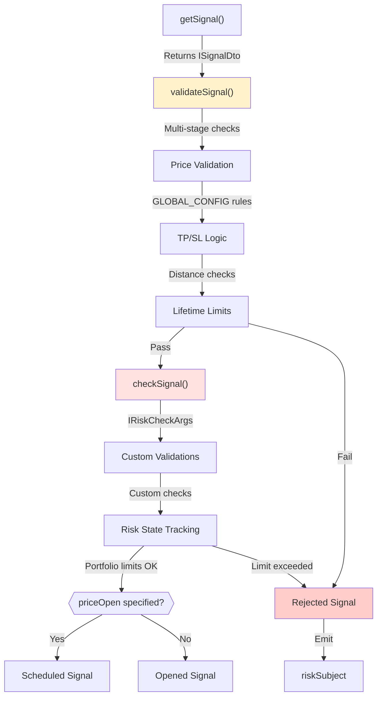
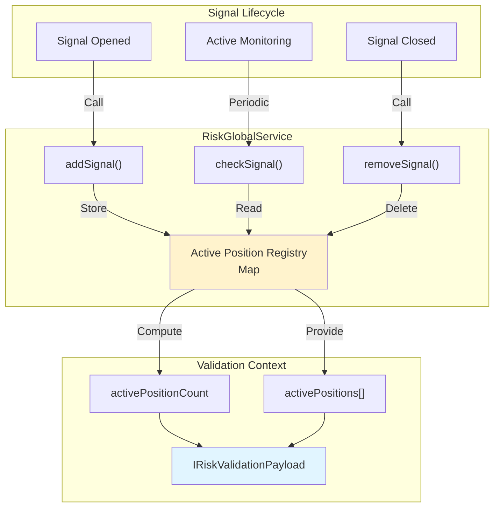
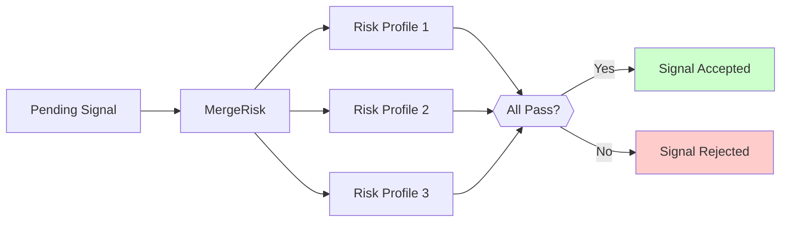
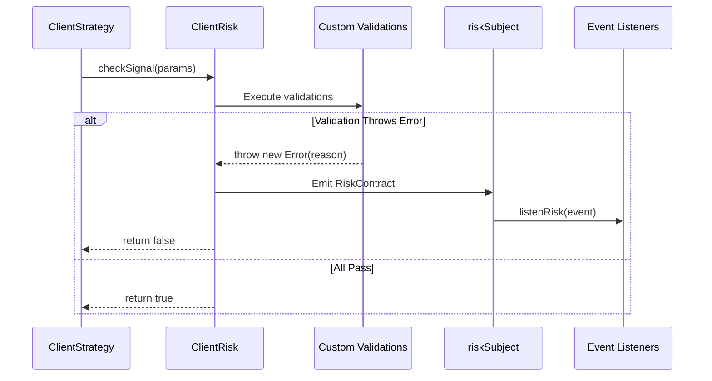
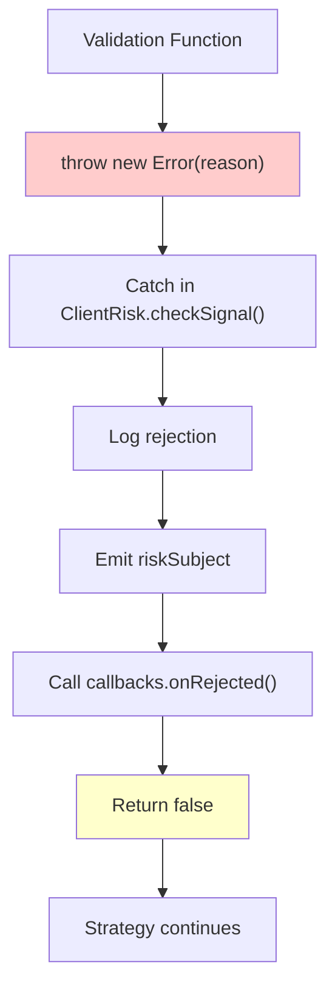

# Risk Management

## Purpose and Scope

This document describes the risk management system in Backtest Kit, which validates trading signals before execution and enforces portfolio-wide limits. The risk system operates at two levels: **signal-level validation** (price logic, TP/SL distances, lifetime limits) and **portfolio-level validation** (concurrent position limits, exposure constraints).

For strategy development patterns, see [Strategy Development](./25_strategy-development.md). For signal lifecycle details, see [Signals & Signal Lifecycle](./08_core-concepts.md). For position sizing calculations, see [Position Sizing](./31_risk-management.md).

## Risk Management Architecture

The risk system integrates into the signal lifecycle as a **pre-execution validation gate**. All signals pass through validation before being scheduled or opened, ensuring that only compliant signals reach the market.



**Sources:** [types.d.ts:342-479](), [src/config/params.ts:1-122](), [src/config/emitters.ts:131]()

---

## Risk Schema Definition

Risk profiles are defined using `IRiskSchema` and registered via `addRisk()`. Each profile contains custom validation logic executed before signals are scheduled or opened.

### IRiskSchema Interface

```typescript
interface IRiskSchema {
  riskName: RiskName;                               // Unique identifier
  note?: string;                                    // Documentation
  callbacks?: Partial<IRiskCallbacks>;              // Event handlers
  validations: (IRiskValidation | IRiskValidationFn)[]; // Validation rules
}
```

### IRiskValidation Structure

```typescript
interface IRiskValidation {
  validate: IRiskValidationFn;  // Validation function
  note?: string;                 // Reason for rejection (logged)
}

interface IRiskValidationFn {
  (payload: IRiskValidationPayload): void | Promise<void>;
  // Throws error to reject signal
}
```

### IRiskValidationPayload

The validation payload provides complete context for risk decisions:

| Field | Type | Description |
|-------|------|-------------|
| `symbol` | `string` | Trading pair (e.g., "BTCUSDT") |
| `pendingSignal` | `ISignalDto` | Signal awaiting validation |
| `strategyName` | `StrategyName` | Source strategy identifier |
| `exchangeName` | `ExchangeName` | Target exchange |
| `currentPrice` | `number` | Current VWAP price |
| `timestamp` | `number` | Validation timestamp (ms) |
| `activePositionCount` | `number` | Total active signals across all strategies |
| `activePositions` | `IRiskActivePosition[]` | Details of active positions |

**Sources:** [types.d.ts:382-390](), [types.d.ts:359-369]()

---

## Multi-Stage Signal Validation Pipeline

Before risk profile validation, signals pass through a **7-stage validation pipeline** enforced by `GLOBAL_CONFIG` parameters. This pipeline catches common errors and ensures signals meet minimum quality thresholds.

```mermaid
graph LR
    START["ISignalDto from getSignal()"]
    V1["1. Price Positivity"]
    V2["2. TP/SL Logic"]
    V3["3. TP Distance"]
    V4["4. SL Min Distance"]
    V5["5. SL Max Distance"]
    V6["6. Lifetime Limit"]
    V7["7. Candle Anomaly"]
    RISK["8. Custom Risk Validations"]
    PASS["Signal Accepted"]
    FAIL["Signal Rejected"]
    
    START --> V1
    V1 -->|"Prices > 0, finite, not NaN"| V2
    V1 -.->|"Fail"| FAIL
    
    V2 -->|"LONG: TP>open>SL<br/>SHORT: SL>open>TP"| V3
    V2 -.->|"Fail"| FAIL
    
    V3 -->|"TP distance >= CC_MIN_TAKEPROFIT_DISTANCE_PERCENT"| V4
    V3 -.->|"Fail"| FAIL
    
    V4 -->|"SL distance >= CC_MIN_STOPLOSS_DISTANCE_PERCENT"| V5
    V4 -.->|"Fail"| FAIL
    
    V5 -->|"SL distance <= CC_MAX_STOPLOSS_DISTANCE_PERCENT"| V6
    V5 -.->|"Fail"| FAIL
    
    V6 -->|"minuteEstimatedTime <= CC_MAX_SIGNAL_LIFETIME_MINUTES"| V7
    V6 -.->|"Fail"| FAIL
    
    V7 -->|"No anomalous candle prices"| RISK
    V7 -.->|"Fail"| FAIL
    
    RISK -->|"All validations pass"| PASS
    RISK -.->|"Any throws"| FAIL
    
    style FAIL fill:#ffcccc
    style PASS fill:#ccffcc
```



**Sources:** [src/config/params.ts:26-55](), [test/e2e/sanitize.test.mjs:1-500]()

### Validation Stage Details

#### 1. Price Positivity Check
Ensures all prices are positive, finite numbers:
```typescript
priceOpen > 0 && isFinite(priceOpen)
priceTakeProfit > 0 && isFinite(priceTakeProfit)
priceStopLoss > 0 && isFinite(priceStopLoss)
```

#### 2. TP/SL Logic Validation
Enforces correct price ordering for LONG and SHORT positions:

| Position | Required Logic | Rationale |
|----------|----------------|-----------|
| LONG | `priceTakeProfit > priceOpen > priceStopLoss` | Buy low, sell higher (TP), cut losses (SL) |
| SHORT | `priceStopLoss > priceOpen > priceTakeProfit` | Sell high, buy lower (TP), cut losses (SL) |

#### 3. Minimum TP Distance (`CC_MIN_TAKEPROFIT_DISTANCE_PERCENT`)
Default: **0.5%**

Ensures TP is far enough from `priceOpen` to cover transaction costs:
- Slippage: ~0.2% (0.1% entry + 0.1% exit)
- Fees: 0.2% (0.1% entry + 0.1% exit)
- Minimum profit buffer: 0.1%
- **Total required: 0.5%**

**Example rejection:**
```typescript
// priceOpen = 42000, priceTakeProfit = 42010
// Distance = 0.024% < 0.5% → REJECTED
// After fees/slippage, this would be a loss!
```

**Sources:** [src/config/params.ts:26-36](), [test/e2e/sanitize.test.mjs:27-122]()

#### 4. Minimum SL Distance (`CC_MIN_STOPLOSS_DISTANCE_PERCENT`)
Default: **0.5%**

Prevents signals from being immediately stopped out by normal price volatility. SL must be at least 0.5% away from `priceOpen`.

#### 5. Maximum SL Distance (`CC_MAX_STOPLOSS_DISTANCE_PERCENT`)
Default: **20%**

Caps catastrophic losses from extreme SL values. A single signal cannot risk more than 20% of the position.

**Example rejection:**
```typescript
// priceOpen = 42000, priceStopLoss = 20000 (LONG)
// Distance = -52.4% < -20% → REJECTED
// One signal could lose half the portfolio!
```

**Sources:** [src/config/params.ts:42-49](), [test/e2e/sanitize.test.mjs:134-229]()

#### 6. Lifetime Limit (`CC_MAX_SIGNAL_LIFETIME_MINUTES`)
Default: **1440 minutes (1 day)**

Prevents "eternal signals" that block risk limits indefinitely:
```typescript
// minuteEstimatedTime = 50000 minutes (34 days)
// Exceeds 1440 minute limit → REJECTED
```

**Sources:** [src/config/params.ts:51-55](), [test/e2e/sanitize.test.mjs:241-329]()

#### 7. Candle Data Anomaly Detection
Validates that historical candle data contains no anomalous prices (e.g., incomplete candles with near-zero prices from API glitches). Uses `CC_GET_CANDLES_PRICE_ANOMALY_THRESHOLD_FACTOR` (default: 1000) to detect outliers.

**Sources:** [src/config/params.ts:76-104]()

---

## Custom Risk Validations

After passing `GLOBAL_CONFIG` checks, signals proceed to **custom risk validations** defined in `IRiskSchema`. These validations enforce strategy-specific or portfolio-wide constraints.

### Basic Risk Profile Example

```typescript
import { addRisk } from 'backtest-kit';

addRisk({
  riskName: 'conservative',
  validations: [
    // Minimum 1% TP distance
    ({ pendingSignal, currentPrice }) => {
      const { priceOpen = currentPrice, priceTakeProfit, position } = pendingSignal;
      const tpDistance = position === 'long' 
        ? ((priceTakeProfit - priceOpen) / priceOpen) * 100
        : ((priceOpen - priceTakeProfit) / priceOpen) * 100;
      
      if (tpDistance < 1.0) {
        throw new Error(`TP too close: ${tpDistance.toFixed(2)}%`);
      }
    },
    
    // Minimum 2:1 reward/risk ratio
    {
      validate: ({ pendingSignal, currentPrice }) => {
        const { priceOpen = currentPrice, priceTakeProfit, priceStopLoss, position } = pendingSignal;
        const reward = position === 'long'
          ? priceTakeProfit - priceOpen
          : priceOpen - priceTakeProfit;
        const risk = position === 'long'
          ? priceOpen - priceStopLoss
          : priceStopLoss - priceOpen;
        
        if (reward / risk < 2.0) {
          throw new Error('Poor R/R ratio');
        }
      },
      note: 'Reward/Risk must be at least 2:1',
    },
  ],
});
```

### Attaching Risk Profiles to Strategies

Risk profiles are attached to strategies via `riskName` or `riskList`:

```typescript
addStrategy({
  strategyName: 'my-strategy',
  interval: '5m',
  getSignal: async (symbol, when) => { /* ... */ },
  riskName: 'conservative',  // Single risk profile
});

addStrategy({
  strategyName: 'multi-risk-strategy',
  interval: '5m',
  getSignal: async (symbol, when) => { /* ... */ },
  riskList: ['conservative', 'max-drawdown', 'time-window'],  // Multiple profiles
});
```

**Sources:** [types.d.ts:728-747](), [README.md:82-100]()

### Portfolio-Wide Validation Example

```typescript
addRisk({
  riskName: 'portfolio-limit',
  validations: [
    // Maximum 3 concurrent positions
    ({ activePositionCount }) => {
      if (activePositionCount >= 3) {
        throw new Error(`Max positions reached: ${activePositionCount}/3`);
      }
    },
    
    // No new LONG if active SHORT exists on same symbol
    ({ symbol, pendingSignal, activePositions }) => {
      const hasOppositePosition = activePositions.some(
        pos => pos.signal.symbol === symbol && 
               pos.signal.position !== pendingSignal.position
      );
      
      if (hasOppositePosition) {
        throw new Error('Cannot open opposite position on same symbol');
      }
    },
  ],
});
```

**Sources:** [types.d.ts:382-390]()

---

## Portfolio-Wide Risk Tracking

`RiskGlobalService` maintains a global registry of active positions across all strategies, enabling portfolio-wide risk constraints.

### RiskGlobalService Architecture



**Sources:** [types.d.ts:359-369](), [types.d.ts:451-479]()

### IRiskActivePosition Structure

```typescript
interface IRiskActivePosition {
  signal: ISignalRow;          // Complete signal details
  strategyName: string;        // Owning strategy
  exchangeName: string;        // Target exchange
  openTimestamp: number;       // When position opened (ms)
}
```

### Integration with ClientRisk

The `ClientRisk` class implements risk validation and position tracking:

```typescript
interface IRisk {
  checkSignal(params: IRiskCheckArgs): Promise<boolean>;
  addSignal(symbol: string, context: { strategyName: string; riskName: string }): Promise<void>;
  removeSignal(symbol: string, context: { strategyName: string; riskName: string }): Promise<void>;
}
```

| Method | When Called | Purpose |
|--------|-------------|---------|
| `checkSignal()` | Before scheduling/opening signal | Validates against risk rules |
| `addSignal()` | When signal opens (priceOpen reached) | Registers active position |
| `removeSignal()` | When signal closes (TP/SL/time) | Removes active position |

**Sources:** [types.d.ts:451-479]()

---

## MergeRisk for Multiple Risk Profiles

When a strategy specifies `riskList` instead of `riskName`, the system uses `MergeRisk` to combine multiple risk profiles. All validations from all profiles must pass for the signal to be accepted.



**Example:**
```typescript
addStrategy({
  strategyName: 'multi-risk',
  interval: '5m',
  getSignal: async (symbol, when) => { /* ... */ },
  riskList: ['conservative', 'portfolio-limit', 'trading-hours'],
});
```

All three profiles (`conservative`, `portfolio-limit`, `trading-hours`) will be validated sequentially. If any validation throws an error, the signal is rejected.

**Sources:** [types.d.ts:728-747]()

---

## Risk Event Monitoring

The risk system emits events via `riskSubject` when signals are rejected. This enables real-time monitoring, alerting, and debugging.

### RiskContract Structure

```typescript
interface RiskContract {
  symbol: string;
  params: IRiskCheckArgs;           // Full validation context
  activePositionCount: number;      // Portfolio state at rejection
  comment: string;                  // Rejection reason (from validation note or "N/A")
  timestamp: number;                // Rejection time (ms)
}
```

### Listening to Risk Rejections

```typescript
import { listenRisk } from 'backtest-kit';

listenRisk((event) => {
  console.error(`Signal rejected on ${event.symbol}`);
  console.error(`Reason: ${event.comment}`);
  console.error(`Active positions: ${event.activePositionCount}`);
  console.error(`Pending signal:`, event.params.pendingSignal);
});
```

### Risk Event Flow



**Sources:** [src/config/emitters.ts:126-131](), [types.d.ts:431-445](), [src/function/event.ts:338-356]()

---

## GLOBAL_CONFIG Risk Parameters Reference

### Price Validation

| Parameter | Default | Description |
|-----------|---------|-------------|
| `CC_MIN_TAKEPROFIT_DISTANCE_PERCENT` | 0.5% | Minimum TP distance from `priceOpen` (covers fees/slippage) |
| `CC_MIN_STOPLOSS_DISTANCE_PERCENT` | 0.5% | Minimum SL distance from `priceOpen` (volatility buffer) |
| `CC_MAX_STOPLOSS_DISTANCE_PERCENT` | 20% | Maximum SL distance (caps catastrophic losses) |
| `CC_MAX_SIGNAL_LIFETIME_MINUTES` | 1440 | Maximum signal duration (prevents eternal signals) |

### Transaction Costs

| Parameter | Default | Description |
|-----------|---------|-------------|
| `CC_PERCENT_FEE` | 0.1% | Fee per transaction (applied 2× for entry+exit) |
| `CC_PERCENT_SLIPPAGE` | 0.1% | Slippage per transaction (applied 2× for entry+exit) |

### Anomaly Detection

| Parameter | Default | Description |
|-----------|---------|-------------|
| `CC_GET_CANDLES_PRICE_ANOMALY_THRESHOLD_FACTOR` | 1000 | Price deviation factor for anomaly detection |
| `CC_GET_CANDLES_MIN_CANDLES_FOR_MEDIAN` | 5 | Minimum candles for median calculation |

### Scheduled Signal Timeouts

| Parameter | Default | Description |
|-----------|---------|-------------|
| `CC_SCHEDULE_AWAIT_MINUTES` | 120 | Maximum time to wait for scheduled signal activation |

**Sources:** [src/config/params.ts:1-122]()

---

## Risk Validation Error Handling

When a validation function throws an error, the signal is **immediately rejected** and the system:

1. **Logs the rejection** via `LoggerService`
2. **Emits `riskSubject` event** with rejection details
3. **Calls `onRejected` callback** (if defined in `IRiskCallbacks`)
4. **Returns control to strategy** (no signal is scheduled or opened)
5. **Continues execution** (non-fatal, strategy keeps running)

### Error Propagation



**Important:** Risk validation errors are **non-fatal**. The system continues executing and will attempt to generate new signals on the next tick (subject to `interval` throttling).

**Sources:** [types.d.ts:395-412](), [types.d.ts:372-377]()

---

## Best Practices

### 1. Layered Risk Approach
Use multiple risk profiles for defense in depth:
```typescript
riskList: ['signal-quality', 'portfolio-limit', 'market-conditions']
```

### 2. Document Validation Logic
Always include `note` field for rejection transparency:
```typescript
{
  validate: (payload) => { /* ... */ },
  note: 'Maximum 5 concurrent positions allowed',
}
```

### 3. Test Edge Cases
Validate risk logic with extreme inputs:
- Zero/negative prices → should be caught by stage 1
- TP distance = 0.4% → should be caught by stage 3
- SL distance = 25% → should be caught by stage 5
- Concurrent position limit → test with multiple strategies

### 4. Monitor Risk Rejections
Always attach `listenRisk()` in production to track why signals are rejected:
```typescript
listenRisk((event) => {
  logToMonitoring('risk_rejection', {
    symbol: event.symbol,
    reason: event.comment,
    strategy: event.params.strategyName,
  });
});
```

### 5. Use Appropriate GLOBAL_CONFIG Values
Adjust validation thresholds based on asset class:
- **Crypto**: Default values (0.5% TP/SL distances)
- **Forex**: Tighter distances (0.2% might be sufficient)
- **Stocks**: May need looser SL max (30% instead of 20%)

**Sources:** [src/config/params.ts:1-122](), [README.md:82-100]()

---

## Related Documentation

- **[Strategy Development](./25_strategy-development.md)**: How to implement `getSignal()` and configure `riskName`
- **[Position Sizing](./31_risk-management.md)**: `ISizingSchema` for calculating position quantities
- **[Signals & Signal Lifecycle](./08_core-concepts.md)**: Full signal state machine including rejection flows
- **[Configuration Reference](./52_configuration-reference.md)**: Complete `GLOBAL_CONFIG` parameter documentation