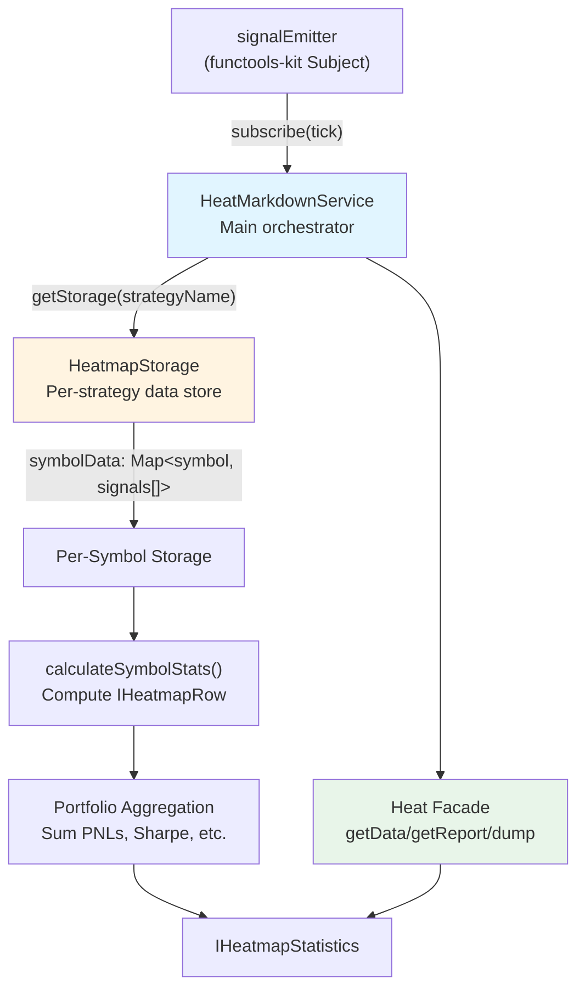
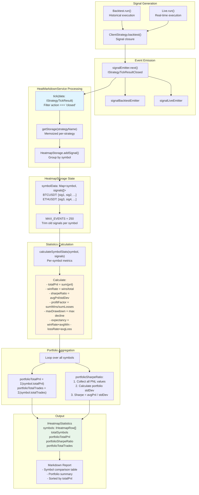
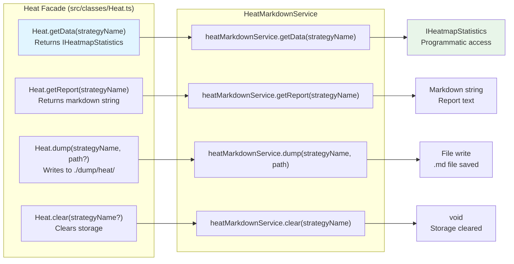
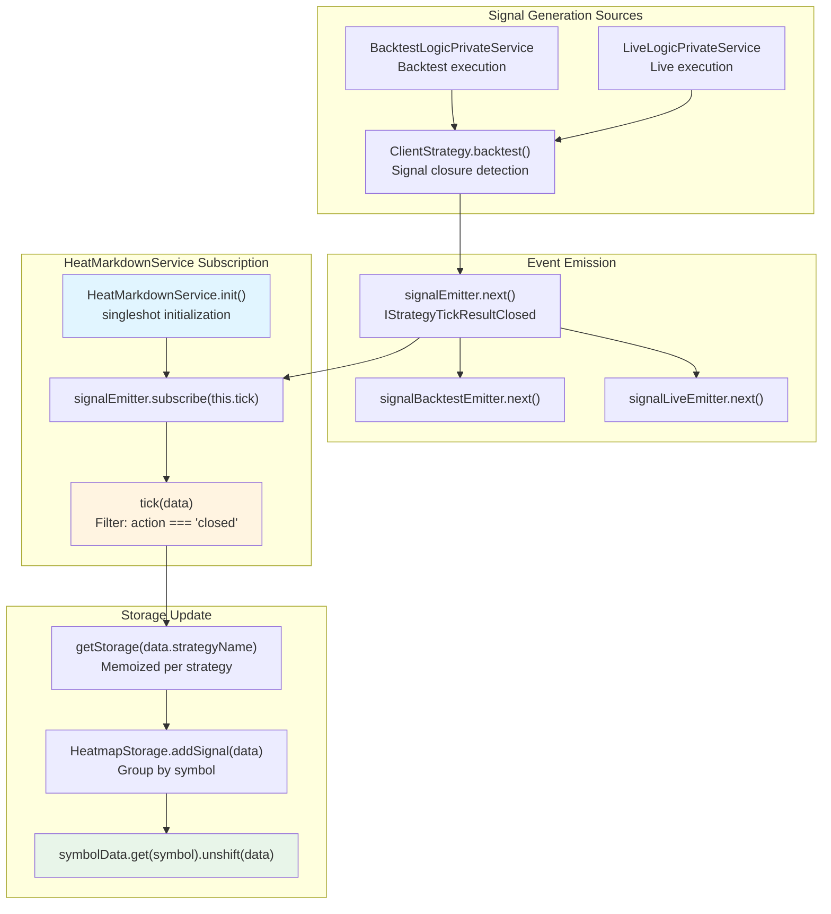

# Portfolio Heatmaps

Portfolio heatmaps provide symbol-level performance analysis across all trading strategies. This system aggregates closed signals by trading pair (symbol) and calculates comprehensive statistics for each symbol, enabling portfolio-wide comparison and risk assessment. Unlike per-strategy reports (see [Performance Statistics](./31-performance-statistics.md)), heatmaps focus on symbol-level aggregation, answering questions like "Which symbols perform best across all strategies?" and "What is the portfolio's total exposure per symbol?".

For individual strategy performance metrics, see [Performance Statistics](./31-performance-statistics.md). For live trading reports, see [Reporting and Analytics](./29-reporting-and-analytics.md).

---

## Heatmap Data Structure

The heatmap system uses two primary interfaces: `IHeatmapRow` for per-symbol statistics and `IHeatmapStatistics` for portfolio-wide aggregation.

### Per-Symbol Statistics (IHeatmapRow)

Each symbol in the portfolio is represented by an `IHeatmapRow` containing 17 metrics:

| Metric | Type | Description | Interpretation |
|--------|------|-------------|----------------|
| `symbol` | `string` | Trading pair identifier (e.g., "BTCUSDT") | Primary key for grouping |
| `totalPnl` | `number \| null` | Cumulative profit/loss percentage | Higher is better |
| `sharpeRatio` | `number \| null` | Risk-adjusted return (avgPnl / stdDev) | Higher is better |
| `maxDrawdown` | `number \| null` | Largest peak-to-trough decline | Lower is better |
| `totalTrades` | `number` | Number of closed trades | Volume indicator |
| `winCount` | `number` | Number of winning trades | Win frequency |
| `lossCount` | `number` | Number of losing trades | Loss frequency |
| `winRate` | `number \| null` | Percentage of winning trades (0-100) | Higher is better |
| `avgPnl` | `number \| null` | Average profit/loss per trade | Higher is better |
| `stdDev` | `number \| null` | Standard deviation of returns | Volatility measure |
| `profitFactor` | `number \| null` | Sum of wins / sum of losses | >1 is profitable |
| `avgWin` | `number \| null` | Average profit on winning trades | Upside magnitude |
| `avgLoss` | `number \| null` | Average loss on losing trades | Downside magnitude |
| `maxWinStreak` | `number` | Maximum consecutive wins | Best streak |
| `maxLossStreak` | `number` | Maximum consecutive losses | Worst streak |
| `expectancy` | `number \| null` | (winRate × avgWin) - (lossRate × avgLoss) | Expected return per trade |

All percentage-based metrics can be `null` if calculation is unsafe (division by zero, NaN, Infinity).

### Portfolio-Wide Statistics (IHeatmapStatistics)

Portfolio aggregation combines all symbols into summary metrics:

```typescript
interface IHeatmapStatistics {
  symbols: IHeatmapRow[];           // Array of all symbol statistics
  totalSymbols: number;             // Count of unique symbols
  portfolioTotalPnl: number | null; // Sum of all symbol PNLs
  portfolioSharpeRatio: number | null; // Portfolio-wide Sharpe ratio
  portfolioTotalTrades: number;     // Total trades across all symbols
}
```

---

## HeatMarkdownService Architecture

The `HeatMarkdownService` class implements the heatmap generation pipeline using the ReportStorage pattern.

### Component Overview



### Key Classes and Methods

#### HeatMarkdownService

Located at [src/lib/services/markdown/HeatMarkdownService.ts:442-596](), this service:

- **Subscribes to events**: `signalEmitter.subscribe(this.tick)` at [line 582]()
- **Memoizes storage**: `getStorage = memoize<(strategyName: string) => HeatmapStorage>` at [line 460]()
- **Filters closed signals**: Only processes `action === "closed"` at [line 475]()
- **Provides public API**: `getData()`, `getReport()`, `dump()`, `clear()` methods

#### HeatmapStorage

Located at [src/lib/services/markdown/HeatMarkdownService.ts:147-442](), this class:

- **Stores signals per symbol**: `symbolData: Map<string, IStrategyTickResultClosed[]>` at [line 149]()
- **Enforces MAX_EVENTS**: Limits to 250 signals per symbol at [line 141, 165-170]()
- **Calculates symbol stats**: `calculateSymbolStats()` at [line 180-296]()
- **Aggregates portfolio**: `getData()` at [line 305-442]()

---

## Data Flow: Signal to Heatmap

The following diagram shows how closed signals are processed into portfolio heatmap statistics:



---

## Metric Calculation Details

### Per-Symbol Metrics

The `calculateSymbolStats()` method at [src/lib/services/markdown/HeatMarkdownService.ts:180-296]() computes all 17 metrics for a single symbol:

#### Basic Counts
```
totalTrades = signals.length
winCount = signals.filter(s => s.pnl.pnlPercentage > 0).length
lossCount = signals.filter(s => s.pnl.pnlPercentage < 0).length
```

#### Win Rate and PNL
```
winRate = (winCount / totalTrades) × 100
totalPnl = sum(signals.map(s => s.pnl.pnlPercentage))
avgPnl = totalPnl / totalTrades
```

#### Risk Metrics
```
variance = sum((pnl - avgPnl)²) / totalTrades
stdDev = sqrt(variance)
sharpeRatio = avgPnl / stdDev  (if stdDev > 0)
```

#### Profit Factor
```
sumWins = sum(winning trades PNL)
sumLosses = sum(losing trades PNL)  // Negative value
profitFactor = sumWins / abs(sumLosses)  (if sumLosses < 0)
```

#### Drawdown Calculation

Maximum drawdown tracks the largest peak-to-trough decline:

```
peakEquity = 0
currentEquity = 0
maxDrawdown = 0

for each signal in chronological order:
  currentEquity += signal.pnl.pnlPercentage
  if currentEquity > peakEquity:
    peakEquity = currentEquity
  drawdown = peakEquity - currentEquity
  if drawdown > maxDrawdown:
    maxDrawdown = drawdown
```

Implemented at [src/lib/services/markdown/HeatMarkdownService.ts:248-262]().

#### Win/Loss Streaks

Consecutive win/loss tracking:

```
currentWinStreak = 0
currentLossStreak = 0
maxWinStreak = 0
maxLossStreak = 0

for each signal:
  if signal.pnl > 0:
    currentWinStreak++
    currentLossStreak = 0
    maxWinStreak = max(maxWinStreak, currentWinStreak)
  else if signal.pnl < 0:
    currentLossStreak++
    currentWinStreak = 0
    maxLossStreak = max(maxLossStreak, currentLossStreak)
```

Implemented at [src/lib/services/markdown/HeatMarkdownService.ts:264-281]().

#### Expectancy

Expected return per trade:

```
lossRate = 100 - winRate
expectancy = (winRate / 100) × avgWin - (lossRate / 100) × abs(avgLoss)
```

Implemented at [src/lib/services/markdown/HeatMarkdownService.ts:283-291]().

### Portfolio-Wide Metrics

The `getData()` method at [src/lib/services/markdown/HeatMarkdownService.ts:305-442]() aggregates symbol statistics into portfolio metrics:

#### Portfolio Total PNL

Sum of all symbol PNLs:

```
portfolioTotalPnl = symbols.reduce((sum, row) => 
  sum + (row.totalPnl ?? 0), 0
)
```

Implemented at [src/lib/services/markdown/HeatMarkdownService.ts:373-379]().

#### Portfolio Sharpe Ratio

Portfolio-level risk-adjusted return:

```
// Collect all individual trade PNLs across all symbols
allPnls = []
for each symbol:
  for each signal in symbol:
    allPnls.push(signal.pnl.pnlPercentage)

// Calculate portfolio-level statistics
portfolioAvgPnl = sum(allPnls) / allPnls.length
portfolioVariance = sum((pnl - portfolioAvgPnl)²) / allPnls.length
portfolioStdDev = sqrt(portfolioVariance)
portfolioSharpeRatio = portfolioAvgPnl / portfolioStdDev
```

Implemented at [src/lib/services/markdown/HeatMarkdownService.ts:381-407]().

#### Portfolio Total Trades

Count of all closed trades:

```
portfolioTotalTrades = symbols.reduce((sum, row) => 
  sum + row.totalTrades, 0
)
```

Implemented at [src/lib/services/markdown/HeatMarkdownService.ts:410-411]().

---

## Heat Facade API

The `Heat` class at [src/classes/Heat.ts]() provides a simplified public API for accessing heatmap data. All methods delegate to `HeatMarkdownService` via dependency injection.

### API Methods



### Method Details

#### getData(strategyName: string): Promise\<IHeatmapStatistics\>

Returns raw heatmap statistics for programmatic access. Useful for custom analysis or visualization.

```typescript
const stats = await Heat.getData("my-strategy");

console.log(`Portfolio total PNL: ${stats.portfolioTotalPnl}%`);
console.log(`Portfolio Sharpe: ${stats.portfolioSharpeRatio}`);
console.log(`Symbols tracked: ${stats.totalSymbols}`);

// Find best performing symbol
const bestSymbol = stats.symbols.reduce((best, current) => 
  (current.totalPnl ?? -Infinity) > (best.totalPnl ?? -Infinity) ? current : best
);
console.log(`Best symbol: ${bestSymbol.symbol} (${bestSymbol.totalPnl}%)`);
```

Implemented at [src/lib/services/markdown/HeatMarkdownService.ts:505-531]().

#### getReport(strategyName: string): Promise\<string\>

Generates a markdown-formatted report with two tables:
1. **Symbol Comparison Table**: All symbols sorted by totalPnl (descending)
2. **Portfolio Summary**: Aggregated metrics

```typescript
const markdown = await Heat.getReport("my-strategy");
console.log(markdown);
```

Report format at [src/lib/services/markdown/HeatMarkdownService.ts:345-442]():
- Header with strategy name
- Symbol comparison table with 12 columns
- Portfolio summary section
- Bottom notes explaining metrics

#### dump(strategyName: string, path?: string): Promise\<void\>

Saves the markdown report to disk. Default path: `./dump/heat/{strategyName}.md`.

```typescript
// Save to default location
await Heat.dump("my-strategy");
// Saved to: ./dump/heat/my-strategy.md

// Save to custom location
await Heat.dump("my-strategy", "./reports/portfolio");
// Saved to: ./reports/portfolio/my-strategy.md
```

Implemented at [src/lib/services/markdown/HeatMarkdownService.ts:543-569]().

#### clear(strategyName?: string): Promise\<void\>

Clears accumulated data from memory. If `strategyName` provided, clears only that strategy's data. Otherwise, clears all strategies.

```typescript
// Clear specific strategy
await Heat.clear("my-strategy");

// Clear all strategies
await Heat.clear();
```

Implemented at [src/lib/services/markdown/HeatMarkdownService.ts:571-578]().

---

## Report Format

The markdown report generated by `getReport()` includes a symbol comparison table and portfolio summary.

### Symbol Comparison Table

Columns (12 total):

| Column | Label | Format | Source |
|--------|-------|--------|--------|
| Symbol | "Symbol" | `symbol` | [line 59-62]() |
| Total PNL | "Total PNL" | `+X.XX%` or `N/A` | [line 64-68]() |
| Sharpe | "Sharpe" | `X.XX` or `N/A` | [line 70-75]() |
| PF | "PF" | `X.XX` or `N/A` | [line 77-82]() |
| Expect | "Expect" | `+X.XX%` or `N/A` | [line 84-89]() |
| WR | "WR" | `XX.X%` or `N/A` | [line 91-96]() |
| Avg Win | "Avg Win" | `+X.XX%` or `N/A` | [line 98-103]() |
| Avg Loss | "Avg Loss" | `-X.XX%` or `N/A` | [line 105-110]() |
| Max DD | "Max DD" | `XX.XX%` or `N/A` | [line 112-117]() |
| W Streak | "W Streak" | `N` | [line 119-124]() |
| L Streak | "L Streak" | `N` | [line 126-131]() |
| Trades | "Trades" | `N` | [line 133-138]() |

Sorting: Symbols are sorted by `totalPnl` in descending order (best first) at [line 423]().

### Portfolio Summary Section

Appears after the table at [line 432-436]():

```
**Total Symbols:** 5
**Portfolio Total PNL:** +42.50%
**Portfolio Sharpe Ratio:** 1.85
**Portfolio Total Trades:** 127
```

---

## Usage Examples

### Basic Backtest Heatmap

Run multiple backtests on different symbols, then view portfolio heatmap:

```typescript
import { addStrategy, addExchange, addFrame, Backtest, Heat } from "backtest-kit";

// Register strategy, exchange, frame (omitted for brevity)
// ...

// Run backtests on multiple symbols
for await (const _ of Backtest.run("BTCUSDT", {
  strategyName: "trend-follow",
  exchangeName: "binance",
  frameName: "30d-test"
})) {}

for await (const _ of Backtest.run("ETHUSDT", {
  strategyName: "trend-follow",
  exchangeName: "binance",
  frameName: "30d-test"
})) {}

// Get heatmap data
const stats = await Heat.getData("trend-follow");

console.log(`Portfolio: ${stats.portfolioTotalPnl}% PNL`);
console.log(`Best symbol: ${stats.symbols[0].symbol}`);

// Save report
await Heat.dump("trend-follow");
```

### Multi-Symbol Portfolio Analysis

Analyze portfolio distribution and risk:

```typescript
const stats = await Heat.getData("my-portfolio-strategy");

// Find high-risk symbols (high std dev, low Sharpe)
const riskySymbols = stats.symbols.filter(row => 
  (row.sharpeRatio ?? 0) < 1.0 && 
  (row.stdDev ?? 0) > 5.0
);

console.log("High-risk symbols:", riskySymbols.map(s => s.symbol));

// Find symbols with large drawdowns
const highDrawdown = stats.symbols.filter(row =>
  (row.maxDrawdown ?? 0) > 10.0
);

console.log("Symbols with >10% drawdown:", 
  highDrawdown.map(s => `${s.symbol}: ${s.maxDrawdown}%`)
);

// Calculate portfolio concentration
stats.symbols.forEach(row => {
  const concentration = (row.totalTrades / stats.portfolioTotalTrades) * 100;
  console.log(`${row.symbol}: ${concentration.toFixed(1)}% of trades`);
});
```

### Live Trading Portfolio Monitoring

Track portfolio performance in real-time:

```typescript
import { Live, Heat, listenDoneLive } from "backtest-kit";

// Start live trading on multiple symbols
Live.background("BTCUSDT", {
  strategyName: "live-strategy",
  exchangeName: "binance"
});

Live.background("ETHUSDT", {
  strategyName: "live-strategy",
  exchangeName: "binance"
});

// Periodically check portfolio health
setInterval(async () => {
  const stats = await Heat.getData("live-strategy");
  
  if ((stats.portfolioSharpeRatio ?? 0) < 0.5) {
    console.warn("Portfolio Sharpe ratio degraded!");
  }
  
  // Save snapshot
  await Heat.dump("live-strategy", "./live-reports");
}, 60000); // Every minute
```

### Comparing Strategies by Symbol Performance

Use heatmaps to compare which strategy performs best per symbol:

```typescript
const strategy1 = await Heat.getData("momentum-strategy");
const strategy2 = await Heat.getData("mean-reversion-strategy");

// Compare BTCUSDT performance
const btc1 = strategy1.symbols.find(s => s.symbol === "BTCUSDT");
const btc2 = strategy2.symbols.find(s => s.symbol === "BTCUSDT");

console.log(`BTCUSDT Momentum: ${btc1?.totalPnl}% PNL, ${btc1?.sharpeRatio} Sharpe`);
console.log(`BTCUSDT Mean-Rev: ${btc2?.totalPnl}% PNL, ${btc2?.sharpeRatio} Sharpe`);

// Find symbols where strategy1 outperforms
const strategy1Wins = strategy1.symbols.filter(row1 => {
  const row2 = strategy2.symbols.find(r => r.symbol === row1.symbol);
  return (row1.totalPnl ?? 0) > (row2?.totalPnl ?? 0);
});

console.log(`Strategy 1 wins on: ${strategy1Wins.map(s => s.symbol)}`);
```

---

## Integration with Event System

The heatmap service subscribes to the global `signalEmitter` at initialization, capturing all closed signals from both backtest and live modes.

### Event Subscription Flow



### Initialization

The service uses the `singleshot` pattern to ensure subscription happens only once:

```typescript
protected init = singleshot(async () => {
  this.loggerService.log("heatMarkdownService init");
  signalEmitter.subscribe(this.tick);
});
```

At [src/lib/services/markdown/HeatMarkdownService.ts:580-584]().

This `init()` method is automatically called on first access to any public method (getData, getReport, dump) via the service pattern.

### Tick Processing

The `tick()` method filters for closed signals only:

```typescript
private tick = async (data: IStrategyTickResult) => {
  this.loggerService.log("heatMarkdownService tick", { data });
  
  if (data.action !== "closed") {
    return; // Ignore idle, opened, active, scheduled, cancelled
  }
  
  const storage = this.getStorage(data.strategyName);
  storage.addSignal(data);
};
```

At [src/lib/services/markdown/HeatMarkdownService.ts:470-494]().

---

## Memory Management

The heatmap service implements bounded storage to prevent memory leaks in long-running processes.

### MAX_EVENTS Limit

Each symbol is limited to 250 closed signals:

```typescript
const MAX_EVENTS = 250; // At line 141

public addSignal(data: IStrategyTickResultClosed) {
  const { symbol } = data;
  
  if (!this.symbolData.has(symbol)) {
    this.symbolData.set(symbol, []);
  }
  
  const signals = this.symbolData.get(symbol)!;
  signals.unshift(data); // Add to front
  
  // Trim queue if exceeded MAX_EVENTS per symbol
  if (signals.length > MAX_EVENTS) {
    signals.pop(); // Remove oldest
  }
}
```

At [src/lib/services/markdown/HeatMarkdownService.ts:155-170]().

### Storage Clearing

The `clear()` method allows manual memory management:

```typescript
// Clear specific strategy
const key = `${strategyName}`;
this.getStorage.clear(key); // Removes memoized instance

// Clear all strategies
this.getStorage.clear(); // Removes all memoized instances
```

At [src/lib/services/markdown/HeatMarkdownService.ts:571-578]().

### Memoization Key

The `getStorage` function uses strategy name as the memoization key:

```typescript
private getStorage = memoize<(strategyName: string) => HeatmapStorage>(
  (strategyName) => strategyName, // Key function
  (strategyName) => new HeatmapStorage() // Factory function
);
```

At [src/lib/services/markdown/HeatMarkdownService.ts:460-463]().

This ensures each strategy gets its own isolated `HeatmapStorage` instance, preventing cross-contamination of data.

