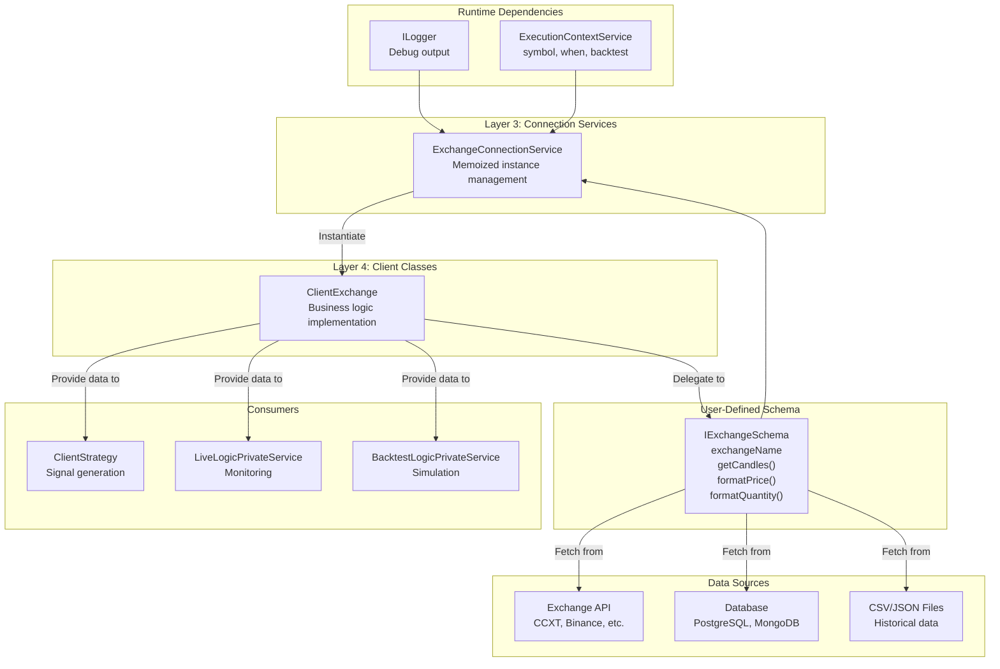
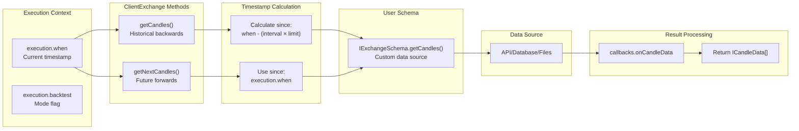
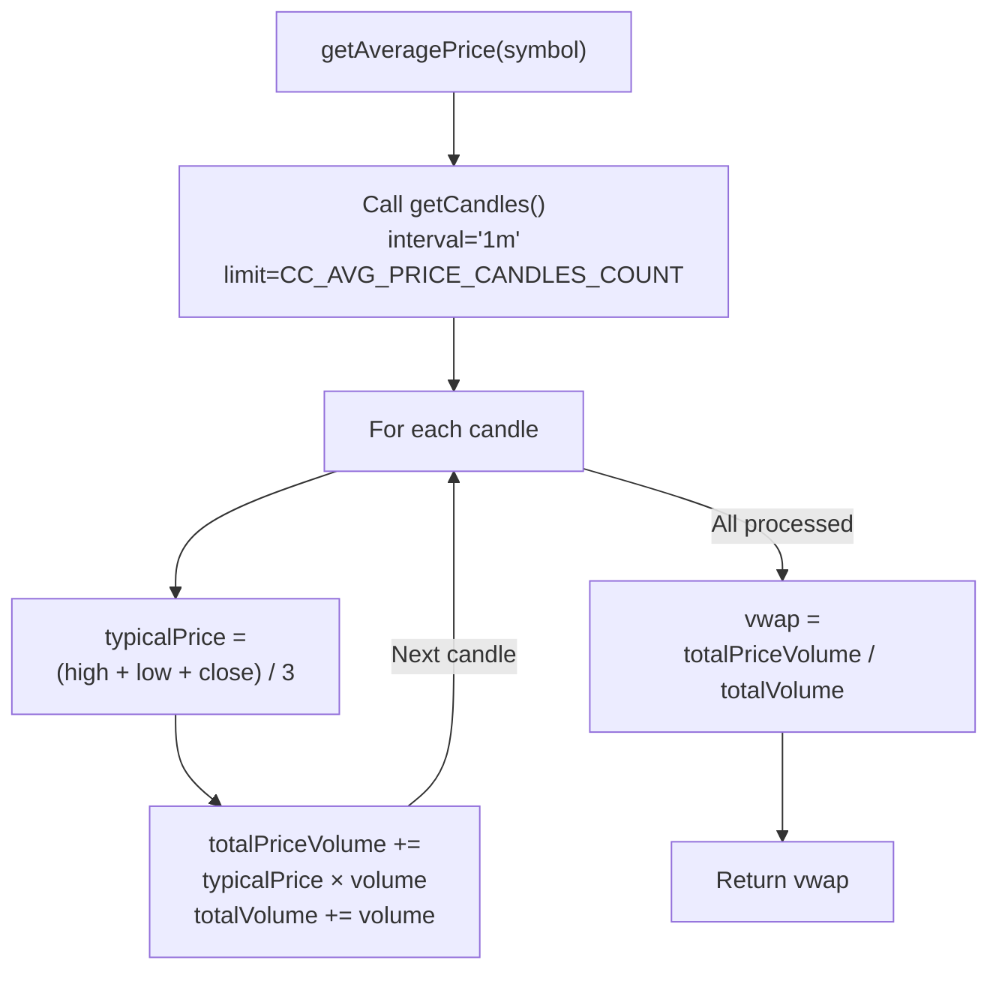
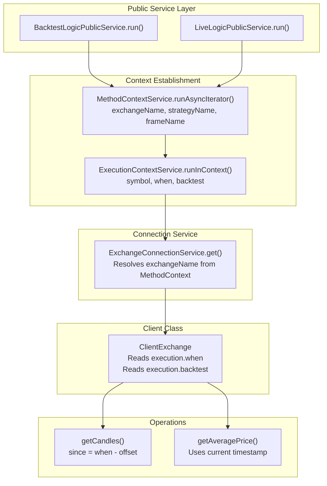
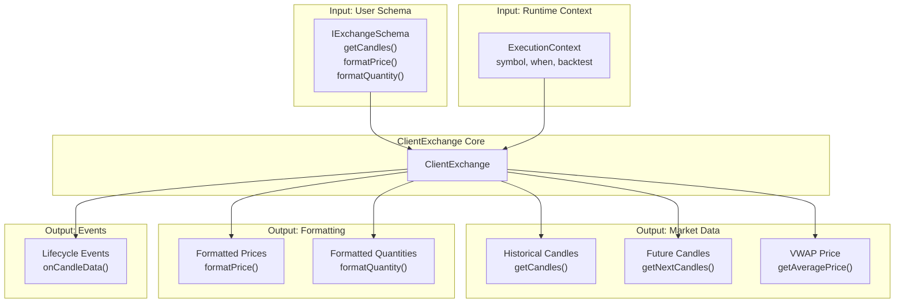

# ClientExchange

<details>
<summary>Relevant source files</summary>

The following files were used as context for generating this wiki page:

- [docs/classes/BacktestUtils.md](docs/classes/BacktestUtils.md)
- [docs/classes/LiveUtils.md](docs/classes/LiveUtils.md)
- [docs/index.md](docs/index.md)
- [src/index.ts](src/index.ts)
- [test/index.mjs](test/index.mjs)
- [types.d.ts](types.d.ts)

</details>


`ClientExchange` is a client class that implements market data fetching, VWAP calculation, and price/quantity formatting logic for exchange operations. It provides context-aware access to historical and real-time candle data, abstracting the underlying data source (API, database, etc.) defined in `IExchangeSchema`.

For strategy-level market data access, see [Exchange Functions](#4.7). For schema registration, see [Exchange Schemas](#5.2). For the connection service that instantiates ClientExchange, see [Connection Services](#7.2).

---

## Overview

`ClientExchange` serves as the business logic layer for exchange operations, bridging the gap between user-defined data sources (`IExchangeSchema.getCandles`) and framework requirements (VWAP calculation, timestamp-aware fetching, precision formatting). It implements the `IExchange` interface and operates without direct dependency injection, receiving all dependencies through its constructor parameters.

**Key Responsibilities:**

| Responsibility | Methods | Description |
|---|---|---|
| Historical data fetching | `getCandles()` | Fetch candles backwards from execution context time |
| Future data fetching | `getNextCandles()` | Fetch candles forward from execution context time (backtest only) |
| VWAP calculation | `getAveragePrice()` | Calculate volume-weighted average price from recent candles |
| Price formatting | `formatPrice()` | Apply exchange-specific price precision rules |
| Quantity formatting | `formatQuantity()` | Apply exchange-specific quantity precision rules |
| Lifecycle events | Callbacks | Trigger `onCandleData` when data is fetched |

Sources: [types.d.ts:168-271]()

---

## Constructor and Parameters

`ClientExchange` is instantiated by `ExchangeConnectionService` with parameters combining the user-defined schema and runtime dependencies.

### IExchangeParams Structure

```typescript
interface IExchangeParams extends IExchangeSchema {
    logger: ILogger;
    execution: TExecutionContextService;
}
```

**Parameter Details:**

| Field | Type | Source | Purpose |
|---|---|---|---|
| `exchangeName` | `ExchangeName` | Schema | Unique exchange identifier |
| `getCandles` | Function | Schema | User-defined candle fetching logic |
| `formatPrice` | Function | Schema | User-defined price formatting logic |
| `formatQuantity` | Function | Schema | User-defined quantity formatting logic |
| `callbacks` | Optional | Schema | Lifecycle event handlers |
| `logger` | `ILogger` | Injected | Debug logging service |
| `execution` | `TExecutionContextService` | Injected | Execution context (symbol, when, backtest flag) |

The `execution` parameter provides implicit context propagation using `di-scoped`, allowing `ClientExchange` to access the current timestamp (`when`) and backtest flag without explicit parameters.

Sources: [types.d.ts:168-176](), [types.d.ts:185-221]()

---

## Architecture Diagram



**Diagram: ClientExchange Position in Architecture**

Sources: [types.d.ts:168-271]()

---

## Market Data Fetching

### getCandles() - Historical Data

Fetches historical candle data **backwards** from the execution context timestamp. The `since` parameter is automatically calculated based on `execution.when` and the requested limit.

**Signature:**
```typescript
getCandles(symbol: string, interval: CandleInterval, limit: number): Promise<ICandleData[]>
```

**Behavior:**

1. Retrieves `execution.when` from injected context
2. Calculates `since` timestamp: `when - (interval × limit)`
3. Calls user-defined `IExchangeSchema.getCandles(symbol, interval, since, limit)`
4. Triggers `callbacks.onCandleData` if defined
5. Returns array of `ICandleData` objects sorted chronologically

**Timestamp Calculation Example:**

| Execution Time | Interval | Limit | Since Timestamp |
|---|---|---|---|
| 2024-01-15 12:00:00 | 1m | 100 | 2024-01-15 10:20:00 |
| 2024-01-15 12:00:00 | 1h | 24 | 2024-01-14 12:00:00 |
| 2024-01-15 12:00:00 | 1d | 30 | 2023-12-16 12:00:00 |

Sources: [types.d.ts:234-235](), [types.d.ts:196-202]()

### getNextCandles() - Future Data (Backtest Only)

Fetches candle data **forwards** from the execution context timestamp. Used exclusively in backtest mode for fast-forward simulation.

**Signature:**
```typescript
getNextCandles(symbol: string, interval: CandleInterval, limit: number): Promise<ICandleData[]>
```

**Behavior:**

1. Retrieves `execution.when` from injected context
2. Uses `when` as `since` timestamp (start from current time)
3. Calls user-defined `IExchangeSchema.getCandles(symbol, interval, since, limit)`
4. Returns future candles for TP/SL detection
5. Only used by `ClientStrategy.backtest()` method

**Usage Context:**

- **Backtest mode**: Fetches future candles to simulate position monitoring
- **Live mode**: Never called (live trading uses real-time progression)

Sources: [types.d.ts:237-244]()

---

## Market Data Flow Diagram



**Diagram: Market Data Fetching Flow**

Sources: [types.d.ts:196-202](), [types.d.ts:234-244]()

---

## VWAP Calculation

`getAveragePrice()` calculates the Volume-Weighted Average Price (VWAP) using the last N 1-minute candles, where N is defined by `CC_AVG_PRICE_CANDLES_COUNT` (default: 5).

### VWAP Formula

**VWAP = Σ(Typical Price × Volume) / Σ(Volume)**

Where **Typical Price = (High + Low + Close) / 3**

### Implementation Flow



**Diagram: VWAP Calculation Algorithm**

### Usage Context

| Context | Purpose | Frequency |
|---|---|---|
| **Signal Generation** | Current price for signal validation | Every `tick()` call |
| **TP/SL Monitoring** | Current price for take profit / stop loss checks | Every `tick()` call |
| **Live Trading** | Real-time price updates | Continuous during active positions |
| **Backtesting** | Historical price at each timestamp | Per timeframe iteration |

### Configuration

The number of candles used for VWAP is configurable via global configuration:

```typescript
setConfig({
    CC_AVG_PRICE_CANDLES_COUNT: 5  // Default: 5 candles (5 minutes)
});
```

Sources: [types.d.ts:262-270](), [types.d.ts:12-15]()

---

## Price and Quantity Formatting

`ClientExchange` delegates to user-defined formatting functions to ensure values comply with exchange-specific precision rules.

### formatPrice()

**Signature:**
```typescript
formatPrice(symbol: string, price: number): Promise<string>
```

**Behavior:**
1. Receives raw price value (e.g., `45123.456789`)
2. Calls `IExchangeSchema.formatPrice(symbol, price)`
3. Returns formatted string matching exchange precision (e.g., `"45123.45"`)

**Common Precision Rules:**

| Exchange Type | Example Input | Example Output | Precision |
|---|---|---|---|
| Crypto (USDT pairs) | 45123.456789 | "45123.45" | 2 decimals |
| Crypto (BTC pairs) | 0.0012345678 | "0.00123456" | 8 decimals |
| Forex | 1.23456789 | "1.23456" | 5 decimals |
| Stocks | 123.456789 | "123.46" | 2 decimals |

Sources: [types.d.ts:252-260](), [types.d.ts:211-218]()

### formatQuantity()

**Signature:**
```typescript
formatQuantity(symbol: string, quantity: number): Promise<string>
```

**Behavior:**
1. Receives raw quantity value (e.g., `0.123456789`)
2. Calls `IExchangeSchema.formatQuantity(symbol, quantity)`
3. Returns formatted string matching exchange lot size (e.g., `"0.123"`)

**Common Lot Size Rules:**

| Exchange Type | Example Input | Example Output | Lot Size |
|---|---|---|---|
| Crypto (BTC) | 0.123456789 | "0.123456" | 0.000001 BTC |
| Crypto (ETH) | 1.23456789 | "1.2345" | 0.0001 ETH |
| Stocks | 123.456 | "123" | 1 share |
| Forex | 1000.567 | "1000" | 1 unit |

Sources: [types.d.ts:246-251](), [types.d.ts:204-210]()

---

## Context-Aware Behavior

`ClientExchange` uses `ExecutionContextService` to provide timestamp-aware and mode-aware operations without requiring explicit context parameters.

### Context Propagation Pattern



**Diagram: Context Propagation to ClientExchange**

### Context Fields

| Field | Type | Source | Usage in ClientExchange |
|---|---|---|---|
| `symbol` | `string` | ExecutionContext | Passed to all exchange methods |
| `when` | `Date` | ExecutionContext | Used to calculate `since` timestamp for `getCandles()` |
| `backtest` | `boolean` | ExecutionContext | Determines if `getNextCandles()` is available |

### Backtest vs Live Mode

**Backtest Mode (`backtest: true`):**
- `execution.when` iterates through historical timestamps (e.g., 2024-01-01 00:00, 00:01, 00:02...)
- `getCandles()` fetches historical data before each timestamp
- `getNextCandles()` fetches future candles for fast-forward simulation
- VWAP calculation uses historical candles at specific timestamp

**Live Mode (`backtest: false`):**
- `execution.when` always equals `Date.now()` (current time)
- `getCandles()` fetches recent historical data (last N candles)
- `getNextCandles()` never called (live progression uses real-time monitoring)
- VWAP calculation uses most recent candles from exchange

Sources: [types.d.ts:105-112](), [types.d.ts:132-138]()

---

## Callbacks and Events

`IExchangeCallbacks` defines optional lifecycle event handlers triggered during exchange operations.

### Available Callbacks

**onCandleData**

Triggered after successful candle data fetch via `getCandles()` or `getNextCandles()`.

**Signature:**
```typescript
onCandleData: (
    symbol: string, 
    interval: CandleInterval, 
    since: Date, 
    limit: number, 
    data: ICandleData[]
) => void
```

**Parameters:**

| Parameter | Type | Description |
|---|---|---|
| `symbol` | `string` | Trading pair that was fetched |
| `interval` | `CandleInterval` | Candle interval used (1m, 1h, etc.) |
| `since` | `Date` | Start timestamp for fetched range |
| `limit` | `number` | Number of candles requested |
| `data` | `ICandleData[]` | Array of fetched candles |

**Use Cases:**
- Logging candle fetches for debugging
- Caching candle data to reduce API calls
- Monitoring data source health (check if candles are missing)
- Analytics on data fetch patterns

### Example Usage

```typescript
addExchange({
    exchangeName: "binance",
    getCandles: async (symbol, interval, since, limit) => {
        // Fetch from Binance API
    },
    callbacks: {
        onCandleData: (symbol, interval, since, limit, data) => {
            console.log(`Fetched ${data.length} candles for ${symbol}`);
            console.log(`Range: ${since} to ${data[data.length - 1].timestamp}`);
        }
    }
});
```

Sources: [types.d.ts:179-183]()

---

## Integration with Other Components

### Connection Service Integration

`ExchangeConnectionService` manages `ClientExchange` lifecycle and provides memoized instances.

**Memoization Pattern:**
- One `ClientExchange` instance per `exchangeName`
- Instance created on first use
- Subsequent calls return cached instance
- Parameters injected: `logger`, `execution` (scoped)

**Instantiation Flow:**

1. `ExchangeConnectionService.get()` called with `exchangeName` from `MethodContext`
2. Check memoization cache for existing instance
3. If not found:
   - Retrieve schema from `ExchangeSchemaService`
   - Resolve `logger` from DI container
   - Resolve `execution` from scoped DI container
   - Instantiate `new ClientExchange(params)`
   - Cache instance by `exchangeName`
4. Return instance

Sources: Related to architecture described in high-level diagrams

### Strategy Integration

`ClientStrategy` consumes `ClientExchange` methods for market data access during signal lifecycle.

**Integration Points:**

| ClientStrategy Method | Calls ClientExchange Method | Purpose |
|---|---|---|
| `tick()` | `getAveragePrice()` | Get current VWAP for signal generation and TP/SL checks |
| `tick()` | `getCandles()` (via strategy schema) | Fetch historical data for indicator calculations |
| `backtest()` | `getNextCandles()` | Fetch future candles for fast-forward simulation |
| `formatSignal()` | `formatPrice()` | Format signal prices for display |
| `formatSignal()` | `formatQuantity()` | Format position sizes for display |

### Logic Service Integration

Both `BacktestLogicPrivateService` and `LiveLogicPrivateService` establish execution context before delegating to `ClientExchange`.

**Backtest Flow:**
1. `BacktestLogicPrivateService.run()` iterates through timeframe
2. For each timestamp, calls `ExecutionContextService.runInContext()` with `when: timestamp`
3. Inside context, `ClientStrategy.tick()` calls `ClientExchange.getAveragePrice()`
4. `ClientExchange` uses `execution.when` to calculate historical VWAP

**Live Flow:**
1. `LiveLogicPrivateService.run()` loops indefinitely
2. Each iteration calls `ExecutionContextService.runInContext()` with `when: Date.now()`
3. Inside context, `ClientStrategy.tick()` calls `ClientExchange.getAveragePrice()`
4. `ClientExchange` uses `execution.when` (current time) to calculate real-time VWAP

Sources: Related to architecture described in high-level diagrams

---

## ICandleData Structure

Candle data returned by `getCandles()` and `getNextCandles()` follows the OHLCV format.

**Interface:**
```typescript
interface ICandleData {
    timestamp: number;   // Unix milliseconds
    open: number;        // Opening price
    high: number;        // Highest price
    low: number;         // Lowest price
    close: number;       // Closing price
    volume: number;      // Trading volume
}
```

**Field Details:**

| Field | Type | Unit | Description |
|---|---|---|---|
| `timestamp` | `number` | Milliseconds (Unix epoch) | Candle opening time |
| `open` | `number` | Quote currency | Price at candle start |
| `high` | `number` | Quote currency | Maximum price during period |
| `low` | `number` | Quote currency | Minimum price during period |
| `close` | `number` | Quote currency | Price at candle end |
| `volume` | `number` | Base currency | Total trading volume |

**Chronological Ordering:**
- Arrays returned by `getCandles()` are sorted by `timestamp` ascending (oldest first)
- Arrays returned by `getNextCandles()` are sorted by `timestamp` ascending (earliest future first)

Sources: [types.d.ts:150-166]()

---

## CandleInterval Types

`ClientExchange` supports multiple candle intervals for data fetching.

**Supported Intervals:**

| Interval | Description | Milliseconds | Common Use Case |
|---|---|---|---|
| `"1m"` | 1 minute | 60,000 | VWAP calculation, high-frequency strategies |
| `"3m"` | 3 minutes | 180,000 | Short-term signals |
| `"5m"` | 5 minutes | 300,000 | Scalping strategies |
| `"15m"` | 15 minutes | 900,000 | Intraday strategies |
| `"30m"` | 30 minutes | 1,800,000 | Swing trading |
| `"1h"` | 1 hour | 3,600,000 | Standard timeframe analysis |
| `"2h"` | 2 hours | 7,200,000 | Medium-term strategies |
| `"4h"` | 4 hours | 14,400,000 | Position trading |
| `"6h"` | 6 hours | 21,600,000 | Long-term analysis |
| `"8h"` | 8 hours | 28,800,000 | Daily monitoring |

**Conversion Utility:**

The framework includes interval-to-milliseconds conversion logic internally for timestamp calculations. User-defined `getCandles()` implementations must support these intervals or throw errors for unsupported ones.

Sources: [types.d.ts:148]()

---

## Summary: ClientExchange Responsibilities



**Diagram: ClientExchange Inputs and Outputs**

**Key Design Patterns:**

1. **Abstraction:** Decouples framework from data sources (API vs database agnostic)
2. **Context-Aware:** Uses `ExecutionContext` for timestamp-based operations
3. **Delegation:** Forwards formatting and data fetching to user-defined functions
4. **Memoization:** Single instance per exchange name via connection service
5. **Pure Business Logic:** No DI dependencies, all via constructor injection

**Related Components:**
- [ClientStrategy](#6.1): Consumes exchange data for signal generation
- [ExchangeConnectionService](#7.2): Instantiates and manages ClientExchange instances
- [Exchange Functions](#4.7): Public API wrappers for exchange operations
- [Exchange Schemas](#5.2): Schema registration and validation

Sources: [types.d.ts:168-271]()