# Client Implementations

## Purpose and Scope

This document describes the **client implementation classes** that form the core business logic layer of backtest-kit. Client implementations are concrete classes that execute trading operations: signal generation, market data fetching, risk validation, position sizing, partial profit tracking, and strategy optimization.

For schema definitions that configure these clients, see [Component Schemas](./24_Component_Schemas.md). For the service layer that routes operations to client instances, see [Service Layer](./40_Service_Layer.md). For the signal lifecycle state machine, see [Signal Lifecycle](./48_Signal_Lifecycle.md).

---

## Client Architecture Overview

Client implementations sit between the **connection service layer** and the **trading domain logic**. They are instantiated by connection services and cached using memoization patterns to ensure singleton behavior per trading context.

### System Layer Hierarchy



---

## ClientStrategy

`ClientStrategy` implements the `IStrategy` interface and is the most complex client class. It manages the complete signal lifecycle from generation through validation, monitoring, and closure.

### Core Responsibilities

| Responsibility | Methods | Description |
|---------------|---------|-------------|
| **Signal Generation** | `GET_SIGNAL_FN` | Calls user's `getSignal()` with throttling and timeout |
| **Validation** | `VALIDATE_SIGNAL_FN` | Multi-layer validation: types, prices, logic, distance, time |
| **State Machine** | `tick()`, `backtest()` | Manages transitions between idle → scheduled → pending → active → closed |
| **Persistence** | `setPendingSignal()`, `setScheduledSignal()` | Atomic writes for crash recovery |
| **Lifecycle Callbacks** | `onOpen`, `onActive`, `onClose`, `onSchedule`, `onCancel` | User event notifications |

### Instance Creation and Memoization



### Signal Validation Pipeline

`ClientStrategy` performs extensive validation using `VALIDATE_SIGNAL_FN` before allowing signal creation. This function prevents logically impossible or financially dangerous signals.

| Validation Category | Checks Performed | Example Rejection |
|---------------------|------------------|-------------------|
| **Required Fields** | `id`, `symbol`, `position`, `_isScheduled` must exist | `id === undefined` |
| **NaN/Infinity Protection** | All prices and `currentPrice` must be finite numbers | `priceOpen === NaN` |
| **Positive Prices** | `priceOpen`, `priceTakeProfit`, `priceStopLoss` > 0 | `priceStopLoss === 0` |
| **Long Position Logic** | `priceTakeProfit > priceOpen > priceStopLoss` | TP=40000, Open=42000 |
| **Short Position Logic** | `priceStopLoss > priceOpen > priceTakeProfit` | SL=40000, Open=42000 |
| **Instant Closure Protection** | Current price not already beyond TP/SL | Long with `currentPrice >= TP` |
| **Minimum TP Distance** | `CC_MIN_TAKEPROFIT_DISTANCE_PERCENT` enforced | TP only 0.05% from open |
| **Minimum SL Distance** | `CC_MIN_STOPLOSS_DISTANCE_PERCENT` enforced | SL only 0.01% from open |
| **Maximum SL Distance** | `CC_MAX_STOPLOSS_DISTANCE_PERCENT` enforced | SL 50% away from open |
| **Time Validation** | `minuteEstimatedTime` must be positive integer | `minuteEstimatedTime === 0` |
| **Maximum Lifetime** | `CC_MAX_SIGNAL_LIFETIME_MINUTES` enforced | `minuteEstimatedTime > 10080` (7 days) |


### Signal Generation with Throttling

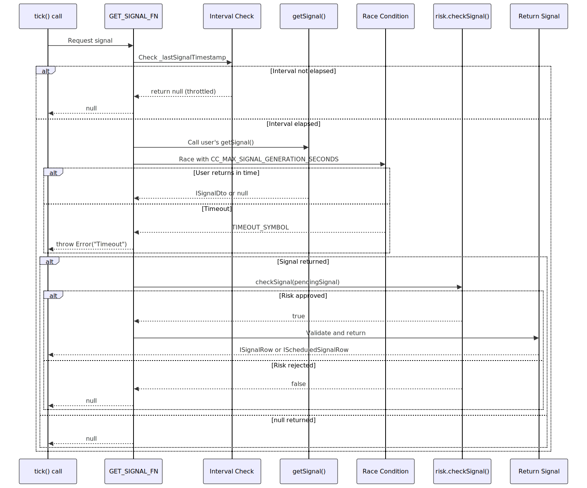


### Scheduled Signal Activation Logic

Scheduled signals (limit orders) require special handling for activation and cancellation. The logic checks both price conditions and stop loss violations.



### Method Reference

| Method | Signature | Purpose |
|--------|-----------|---------|
| `tick()` | `(symbol, strategyName) => Promise<IStrategyTickResult>` | Single execution cycle for live trading |
| `backtest()` | `(symbol, strategyName, candles) => Promise<IStrategyBacktestResult>` | Fast-forward through historical candles |
| `waitForInit()` | `() => Promise<void>` | Load persisted state from disk (live mode only) |
| `getPendingSignal()` | `(symbol, strategyName) => Promise<ISignalRow \| null>` | Retrieve active pending signal |
| `stop()` | `(symbol, strategyName, backtest) => Promise<void>` | Prevent new signal generation |
| `setPendingSignal()` | `(signal) => Promise<void>` | Persist pending signal atomically |
| `setScheduledSignal()` | `(signal) => Promise<void>` | Persist scheduled signal atomically |


---

## ClientExchange

`ClientExchange` implements the `IExchange` interface and provides market data with temporal isolation guarantees.

### Core Responsibilities

| Responsibility | Methods | Description |
|---------------|---------|-------------|
| **Candle Fetching** | `getCandles()` | Retrieves historical OHLCV data with temporal bounds |
| **VWAP Calculation** | `getAveragePrice()` | Volume-weighted average of last N candles |
| **Price Formatting** | `formatPrice()`, `formatQuantity()` | Display formatting for UI |
| **Temporal Isolation** | Context awareness | Prevents look-ahead bias via `ExecutionContextService` |

### VWAP Pricing Implementation

The system uses **Volume Weighted Average Price (VWAP)** instead of simple close prices for realistic execution simulation. VWAP is calculated from the last `CC_AVG_PRICE_CANDLES_COUNT` (default: 5) one-minute candles.


**Formula (from [src/client/ClientStrategy.ts:478-489]()):
```
typicalPrice = (high + low + close) / 3
sumPriceVolume = Σ(typicalPrice × volume)
totalVolume = Σ(volume)
VWAP = sumPriceVolume / totalVolume
```

If `totalVolume === 0`, fallback to simple average: `Σ(close) / candles.length`


### Temporal Isolation

`ClientExchange.getCandles()` uses `ExecutionContextService` to enforce temporal bounds. In backtest mode, it **never returns data from the future**, preventing look-ahead bias.


---

## ClientRisk

`ClientRisk` implements the `IRisk` interface and enforces portfolio-level constraints through validation chains.

### Core Responsibilities

| Responsibility | Methods | Description |
|---------------|---------|-------------|
| **Signal Validation** | `checkSignal()` | Runs validation chain against pending signal |
| **Position Tracking** | `addSignal()`, `removeSignal()` | Tracks active positions per strategy |
| **Persistence** | Via `PersistRiskAdapter` | Atomic state saves for crash recovery |
| **Validation Callbacks** | `onAllowed`, `onRejected` | User notifications for validation results |

### Validation Chain Execution

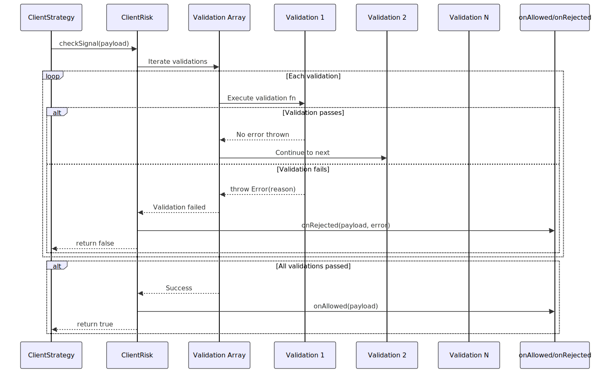

### Position Tracking with Persistence

`ClientRisk` maintains `_activePositionsMap` to track concurrent positions per strategy. This enables `maxConcurrentPositions` enforcement and portfolio-level risk management.

**Data Structure:**
```typescript
_activePositionsMap = Map<symbol, Set<strategyIdentifier>>
// Example: Map { "BTCUSDT" => Set { "strategy1:riskA", "strategy2:riskA" } }
```

**Persistence:** State saved to `./dump/data/risk/{riskName}.json` via `PersistRiskAdapter` after every `addSignal()` or `removeSignal()` call.


---

## ClientSizing

`ClientSizing` implements the `ISizing` interface and calculates position sizes based on account balance and risk parameters.

### Sizing Methods

| Method | Formula | Use Case |
|--------|---------|----------|
| **Fixed Percentage** | `position = balance × fixedPercent / 100` | Conservative, predictable sizing |
| **Kelly Criterion** | `f* = (p × b - q) / b`<br/>where p=winRate, b=avgWin/avgLoss | Optimal growth, requires historical data |
| **ATR-Based** | `position = (balance × riskPercent) / (ATR × atrMultiplier)` | Volatility-adjusted sizing |

### Position Constraints

All methods respect constraints from `ISizingSchema`:
- `minPositionSize`: Minimum position value
- `maxPositionSize`: Maximum position value
- `maxPositionPercent`: Maximum % of account balance


---

## ClientPartial

`ClientPartial` implements the `IPartial` interface and tracks profit/loss milestones for active signals.

### Milestone Levels

| Event Type | Levels | Trigger |
|------------|--------|---------|
| **Partial Profit** | `TP_LEVEL1`, `TP_LEVEL2`, `TP_LEVEL3` | 33%, 66%, 100% toward TP |
| **Partial Loss** | `SL_LEVEL1`, `SL_LEVEL2` | 50%, 100% toward SL |

### Monitoring Flow


**State Persistence:** `./dump/data/partial/{strategy}/{symbol}.json` stores already-emitted milestones to prevent duplicate events after crash recovery.


---

## ClientFrame

`ClientFrame` implements the `IFrame` interface and generates timeframes for backtesting.

### Timeframe Generation


**Example:**
- `startDate`: 2025-01-01 00:00:00
- `endDate`: 2025-01-02 00:00:00
- `interval`: 1h
- **Output:** 24 Date objects, one per hour


---

## ClientOptimizer

`ClientOptimizer` implements the `IOptimizer` interface and generates executable strategy code using LLMs.

### Architecture


### Data Source Pattern

`IOptimizerSource` can be a function or an object:

**Function-based:**
```typescript
{
  fetch: (params) => Promise<any[]>
}
```

**Object-based:**
```typescript
{
  fetch: (params) => Promise<any[]>,
  user: (doc) => string,      // Format as user message
  assistant: (doc) => string   // Format as assistant message
}
```

**Pagination:** Uses `iterateDocuments()` for paginated fetching and `distinctDocuments()` for deduplication by ID.


---

## Common Patterns Across Clients

### Memoization for Instance Caching

All connection services use `memoize()` from functools-kit to cache client instances:

```typescript
private getStrategy = memoize(
  ([symbol, strategyName, backtest]) => `${symbol}:${strategyName}:${backtest}`,
  (symbol, strategyName, backtest) => new ClientStrategy({...})
)
```

**Cache keys include:**
- `symbol`: Trading pair
- `strategyName` or component name
- `backtest`: Boolean flag (separate instances for backtest vs live)

**Benefits:**
- Singleton behavior per context
- Preserved state across calls
- Memory efficiency


### Persistence Adapters

Client implementations that require crash recovery use persistence adapters:

| Adapter | File Path | Purpose |
|---------|-----------|---------|
| `PersistSignalAdapter` | `./dump/data/signal/{strategy}/{symbol}.json` | Active pending signals |
| `PersistRiskAdapter` | `./dump/data/risk/{riskName}.json` | Portfolio position counts |
| `PersistScheduleAdapter` | `./dump/data/schedule/{strategy}/{symbol}.json` | Scheduled signals (limit orders) |
| `PersistPartialAdapter` | `./dump/data/partial/{strategy}/{symbol}.json` | Emitted milestone levels |

**Atomic Write Pattern:**
1. Write to temporary file: `data.json.tmp`
2. Call `fsync()` to ensure disk write
3. Rename `data.json.tmp` → `data.json` (atomic operation)


### Context Dependency Injection

All clients receive `ExecutionContextService` and `MethodContextService` in their constructor parameters:

```typescript
interface IStrategyParams {
  execution: TExecutionContextService;  // Runtime context (symbol, when, backtest)
  method: TMethodContextService;        // Schema context (strategyName, exchangeName)
  // ... other dependencies
}
```

**ExecutionContextService provides:**
- `context.symbol`: Current trading pair
- `context.when`: Current timestamp (Date object)
- `context.backtest`: Boolean flag for mode

**MethodContextService provides:**
- `context.strategyName`: Active strategy identifier
- `context.exchangeName`: Active exchange identifier
- `context.frameName`: Active frame identifier (backtest only)

These contexts use `AsyncLocalStorage` for implicit propagation without manual parameter threading.


### Event Emission

Client implementations emit events through RxJS Subjects after state changes:

```typescript
// ClientStrategy emits signals
await signalEmitter.next(tickResult);
await signalBacktestEmitter.next(tickResult);
await signalLiveEmitter.next(tickResult);
```

**Emitters used by clients:**
- `signalEmitter`: All signals (backtest + live)
- `signalBacktestEmitter`: Backtest-only signals
- `signalLiveEmitter`: Live-only signals
- `errorEmitter`: Exception propagation
- `partialProfitSubject`: TP milestone events
- `partialLossSubject`: SL milestone events


---

## Client Lifecycle Management

### Initialization Sequence

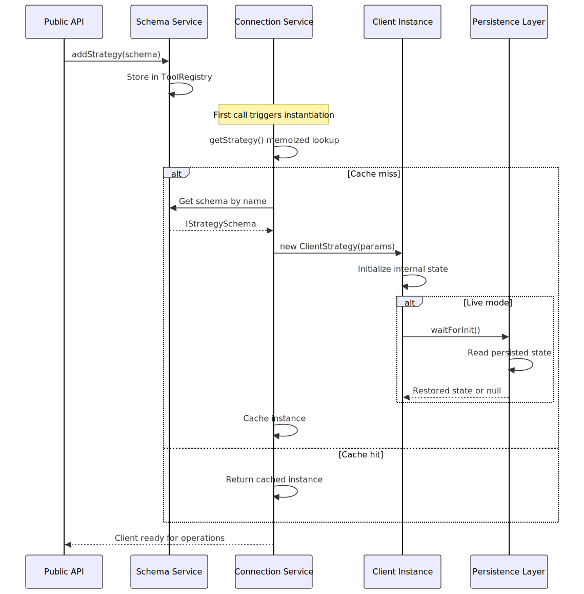

### Cleanup and Disposal


