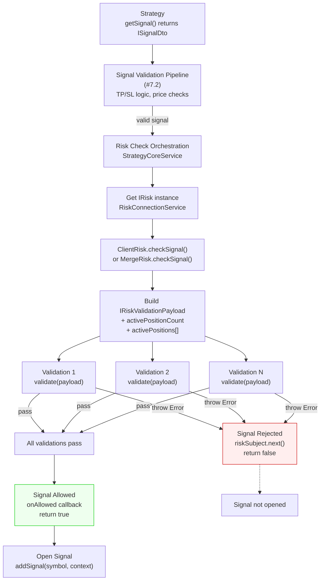
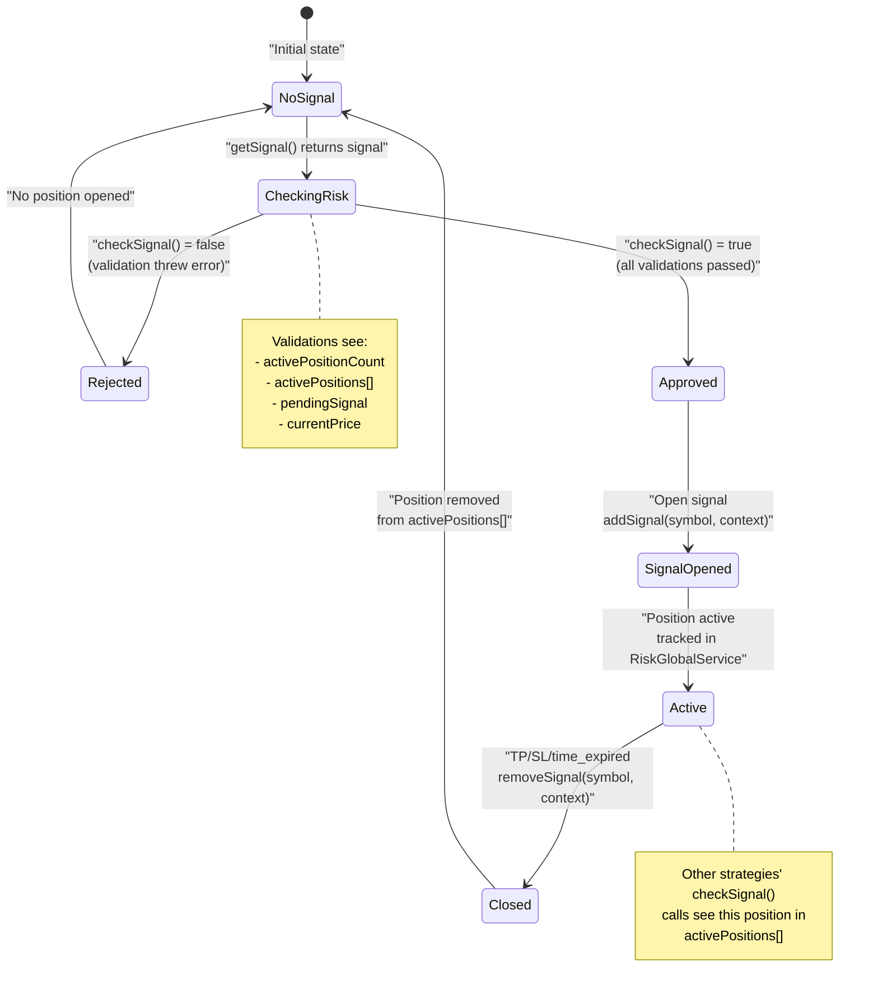
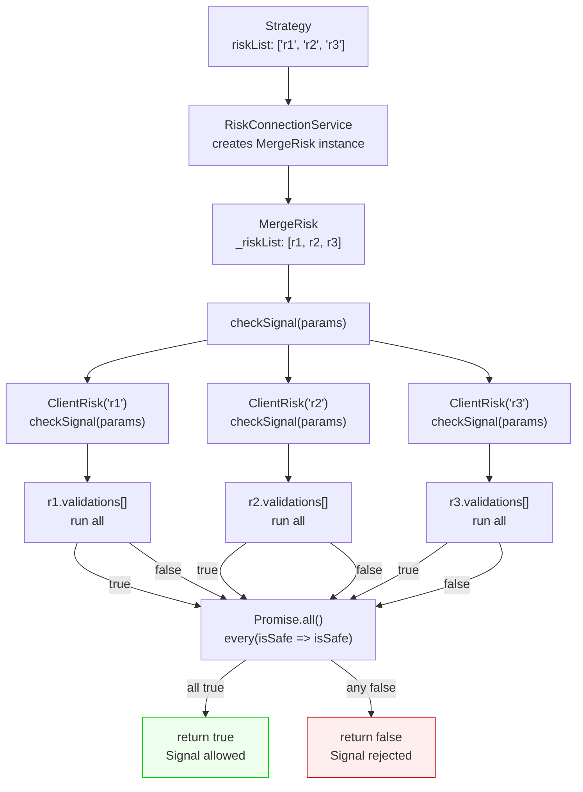
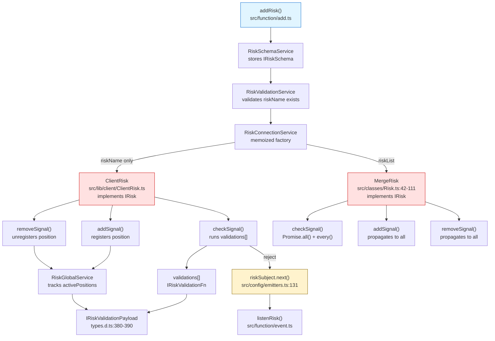

# Risk Profiles & Validation

This page covers the **risk profile system** in Backtest Kit: defining custom validation rules via `IRiskSchema`, combining multiple risk profiles with `MergeRisk`, and the lifecycle methods (`checkSignal`, `addSignal`, `removeSignal`) that track portfolio-wide risk state.

**Scope:** This page focuses on user-defined risk profiles registered via `addRisk()`. For built-in signal validation (TP/SL logic, price checks, GLOBAL_CONFIG enforcement), see [Signal Validation Pipeline](./31_risk-management.md). For position sizing calculations, see [Position Sizing](./31_risk-management.md). For portfolio-wide tracking via `RiskGlobalService`, see [Portfolio-Wide Limits](./31_risk-management.md).

---

## Overview

Risk profiles enable **portfolio-level risk management** beyond per-signal validation. While the signal validation pipeline ([#7.2](./31_risk-management.md)) enforces basic constraints like TP/SL logic and price bounds, risk profiles add:

- **Concurrent position limits** (e.g., max 3 open positions)
- **Exposure limits** (e.g., max 20% portfolio allocation)
- **Time-based rules** (e.g., no trading during news events)
- **Correlation constraints** (e.g., max 2 correlated positions)
- **Custom business logic** (any validation that accesses portfolio state)

Risk profiles are **registered once** via `addRisk()` and then **referenced** by strategies using `riskName` or `riskList` fields in `IStrategySchema`.

**Sources:** [types.d.ts:414-426](), [README.md:82-100]()

---

## Core Interfaces

### IRiskSchema

The schema registered via `addRisk()`:

```typescript
interface IRiskSchema {
  riskName: RiskName;                           // Unique identifier
  note?: string;                                 // Optional description
  callbacks?: Partial<IRiskCallbacks>;           // onRejected, onAllowed
  validations: (IRiskValidation | IRiskValidationFn)[]; // Validation rules
}
```

**Fields:**
- **`riskName`**: Unique identifier for this risk profile
- **`validations`**: Array of validation rules (functions or objects with `validate` + `note`)
- **`callbacks`**: Optional lifecycle hooks for rejected/allowed signals
- **`note`**: Developer comment for documentation

**Sources:** [types.d.ts:414-426]()

---

### IRiskValidation vs IRiskValidationFn

Validations can be defined in **two forms**:

#### 1. Function Form (IRiskValidationFn)

```typescript
type IRiskValidationFn = (payload: IRiskValidationPayload) => void | Promise<void>;
```

A function that **throws an error** to reject the signal:

```typescript
addRisk({
  riskName: 'max-positions',
  validations: [
    ({ activePositionCount }) => {
      if (activePositionCount >= 3) {
        throw new Error('Max 3 positions exceeded');
      }
    }
  ]
});
```

#### 2. Object Form (IRiskValidation)

```typescript
interface IRiskValidation {
  validate: IRiskValidationFn;  // Validation function
  note?: string;                 // Description (used in rejection message)
}
```

Adds a `note` field for better error messages:

```typescript
addRisk({
  riskName: 'max-positions',
  validations: [
    {
      validate: ({ activePositionCount }) => {
        if (activePositionCount >= 3) {
          throw new Error('Exceeded limit');
        }
      },
      note: 'Max 3 concurrent positions'  // Included in RiskContract events
    }
  ]
});
```

**Sources:** [types.d.ts:392-412](), [README.md:82-100]()

---

### IRiskValidationPayload

The payload passed to **all validation functions**:

```typescript
interface IRiskValidationPayload extends IRiskCheckArgs {
  pendingSignal: ISignalDto;                // Signal to validate
  activePositionCount: number;              // Current open positions
  activePositions: IRiskActivePosition[];   // List of open positions
}

interface IRiskCheckArgs {
  symbol: string;
  pendingSignal: ISignalDto;
  strategyName: StrategyName;
  exchangeName: ExchangeName;
  currentPrice: number;
  timestamp: number;
}

interface IRiskActivePosition {
  signal: ISignalRow;
  strategyName: string;
  exchangeName: string;
  openTimestamp: number;
}
```

**Available Data:**
- **`pendingSignal`**: The signal being validated (TP, SL, position, etc.)
- **`currentPrice`**: Current VWAP price
- **`activePositionCount`**: Number of currently open positions (all strategies)
- **`activePositions`**: Full list of open positions with details
- **`symbol`**, **`strategyName`**, **`exchangeName`**: Context information
- **`timestamp`**: Current time (milliseconds)

**Sources:** [types.d.ts:339-390]()

---

## Diagram: Risk Validation Data Flow



**Sources:** [types.d.ts:448-479](), [src/lib/services/core/StrategyCoreService.ts]()

---

## The IRisk Interface

All risk implementations (both `ClientRisk` and `MergeRisk`) conform to `IRisk`:

```typescript
interface IRisk {
  checkSignal(params: IRiskCheckArgs): Promise<boolean>;
  addSignal(symbol: string, context: { strategyName: string; riskName: string }): Promise<void>;
  removeSignal(symbol: string, context: { strategyName: string; riskName: string }): Promise<void>;
}
```

### Method: checkSignal

**Purpose:** Determine if a new signal should be allowed based on current portfolio state.

**Behavior:**
- Runs **all validations** in sequence
- If **any validation throws**, the signal is **rejected** (returns `false`)
- If **all validations pass**, the signal is **allowed** (returns `true`)
- Triggers `onRejected` or `onAllowed` callbacks

**When Called:** Before opening a new position (after signal validation pipeline passes)

**Sources:** [types.d.ts:452-458]()

---

### Method: addSignal

**Purpose:** Register a newly opened position with the risk system.

**Behavior:**
- Called **after** signal opens successfully
- Updates `activePositionCount` and `activePositions[]` in `RiskGlobalService`
- Enables future `checkSignal` calls to see this position

**When Called:** Immediately after opening a signal (when action = "opened")

**Sources:** [types.d.ts:460-468]()

---

### Method: removeSignal

**Purpose:** Unregister a closed position from the risk system.

**Behavior:**
- Called **after** signal closes (TP/SL/time_expired)
- Decrements `activePositionCount` and removes from `activePositions[]`
- Frees up capacity for new positions

**When Called:** Immediately after closing a signal (when action = "closed")

**Sources:** [types.d.ts:470-478]()

---

## Diagram: Risk Lifecycle State Machine



**Sources:** [types.d.ts:448-479]()

---

## Creating Custom Risk Profiles

### Basic Example: Max Positions

```typescript
import { addRisk } from 'backtest-kit';

addRisk({
  riskName: 'max-3-positions',
  validations: [
    ({ activePositionCount }) => {
      if (activePositionCount >= 3) {
        throw new Error('Max 3 positions exceeded');
      }
    }
  ]
});
```

### Example: Risk/Reward Ratio

```typescript
addRisk({
  riskName: 'min-rr-2to1',
  validations: [
    ({ pendingSignal, currentPrice }) => {
      const { priceOpen = currentPrice, priceTakeProfit, priceStopLoss, position } = pendingSignal;
      
      const reward = position === 'long' 
        ? priceTakeProfit - priceOpen 
        : priceOpen - priceTakeProfit;
      
      const risk = position === 'long' 
        ? priceOpen - priceStopLoss 
        : priceStopLoss - priceOpen;
      
      if (reward / risk < 2) {
        throw new Error(`Poor R/R: ${(reward/risk).toFixed(2)}:1`);
      }
    }
  ]
});
```

### Example: Time-Based Rules

```typescript
addRisk({
  riskName: 'no-trading-weekends',
  validations: [
    ({ timestamp }) => {
      const day = new Date(timestamp).getDay();
      if (day === 0 || day === 6) {
        throw new Error('No trading on weekends');
      }
    }
  ]
});
```

### Example: Correlation Limits

```typescript
addRisk({
  riskName: 'max-correlated',
  validations: [
    ({ symbol, activePositions, pendingSignal }) => {
      const sameDirection = activePositions.filter(pos => 
        pos.signal.position === pendingSignal.position
      );
      
      if (sameDirection.length >= 2) {
        throw new Error('Max 2 positions in same direction');
      }
    }
  ]
});
```

**Sources:** [README.md:82-100]()

---

## Risk Callbacks

The `IRiskCallbacks` interface provides hooks for rejected and allowed signals:

```typescript
interface IRiskCallbacks {
  onRejected: (symbol: string, params: IRiskCheckArgs) => void;
  onAllowed: (symbol: string, params: IRiskCheckArgs) => void;
}
```

### Example: Logging Rejections

```typescript
addRisk({
  riskName: 'max-positions',
  validations: [
    ({ activePositionCount }) => {
      if (activePositionCount >= 3) throw new Error('Max 3 exceeded');
    }
  ],
  callbacks: {
    onRejected: (symbol, params) => {
      console.warn(`Signal rejected for ${symbol}`);
      console.warn(`Active positions: ${params.activePositionCount}`);
    },
    onAllowed: (symbol, params) => {
      console.log(`Signal allowed for ${symbol}`);
    }
  }
});
```

**Note:** These are **schema-level callbacks** (defined in `IRiskSchema`). They differ from the **service-level `onRejected` callback** in `IRiskParams`, which is used internally to emit events to `riskSubject`.

**Sources:** [types.d.ts:371-378](), [types.d.ts:428-446]()

---

## Combining Multiple Risks: MergeRisk

### The Composite Pattern

`MergeRisk` combines multiple `IRisk` instances into a single risk checker using the **Composite pattern**:

```typescript
class MergeRisk implements IRisk {
  constructor(readonly _riskList: IRisk[]) {}
  
  async checkSignal(params: IRiskCheckArgs): Promise<boolean> {
    const riskCheck = await Promise.all(
      this._riskList.map(async (risk) => await risk.checkSignal(params))
    );
    return riskCheck.every((isSafe) => isSafe);  // Logical AND
  }
  
  async addSignal(symbol: string, context: { strategyName: string; riskName: string }) {
    await Promise.all(
      this._riskList.map(async (risk) => await risk.addSignal(symbol, context))
    );
  }
  
  async removeSignal(symbol: string, context: { strategyName: string; riskName: string }) {
    await Promise.all(
      this._riskList.map(async (risk) => await risk.removeSignal(symbol, context))
    );
  }
}
```

**Behavior:**
- **`checkSignal`**: Signal is allowed **only if ALL** child risks approve (logical AND)
- **`addSignal`**: Propagates to **all** child risks in parallel
- **`removeSignal`**: Propagates to **all** child risks in parallel

**Sources:** [src/classes/Risk.ts:42-111]()

---

### Using riskList in Strategies

Strategies can reference **multiple risk profiles** using `riskList`:

```typescript
// Define multiple risk profiles
addRisk({ riskName: 'max-positions', validations: [...] });
addRisk({ riskName: 'min-rr-ratio', validations: [...] });
addRisk({ riskName: 'time-limits', validations: [...] });

// Combine them in a strategy
addStrategy({
  strategyName: 'my-strategy',
  riskList: ['max-positions', 'min-rr-ratio', 'time-limits'],  // Logical AND
  getSignal: async (symbol) => { /* ... */ }
});
```

**Internally**, the framework creates a `MergeRisk` instance when `riskList` is used:

```typescript
// Pseudo-code representation
const risks = riskList.map(riskName => getRiskInstance(riskName));
const mergedRisk = new MergeRisk(risks);
const canTrade = await mergedRisk.checkSignal(params);  // All must pass
```

**Sources:** [types.d.ts:728-747](), [src/classes/Risk.ts:42-111]()

---

## Diagram: MergeRisk Composite Pattern



**Sources:** [src/classes/Risk.ts:42-111]()

---

## Risk Event Emission

### riskSubject Emitter

When a signal is **rejected** by risk validation, the framework emits a `RiskContract` event:

```typescript
export const riskSubject = new Subject<RiskContract>();
```

**Event Payload (RiskContract):**

```typescript
interface RiskContract {
  symbol: string;
  strategyName: string;
  exchangeName: string;
  activePositionCount: number;
  comment: string;        // Rejection reason (from validation.note or "N/A")
  timestamp: number;      // Event time (milliseconds)
  backtest: boolean;
}
```

**Listening for Risk Events:**

```typescript
import { listenRisk } from 'backtest-kit';

listenRisk((event) => {
  console.warn(`Signal rejected for ${event.symbol}`);
  console.warn(`Reason: ${event.comment}`);
  console.warn(`Active positions: ${event.activePositionCount}`);
});
```

**Sources:** [src/config/emitters.ts:126-131](), [src/function/event.ts:332-366]()

---

### When Are Risk Events Emitted?

Risk events are emitted **only when signals are rejected**, not when allowed. This prevents spam:

```typescript
// Inside ClientRisk.checkSignal()
try {
  // Run all validations
  for (const validation of validations) {
    await validation.validate(payload);
  }
  // All passed - call onAllowed but DO NOT emit event
  await this.callbacks?.onAllowed?.(params.symbol, params);
  return true;
} catch (error) {
  // Validation threw - call onRejected AND emit riskSubject event
  await this.callbacks?.onRejected?.(params.symbol, params);
  await this.onRejected(params.symbol, params, activePositionCount, comment, timestamp);
  return false;
}
```

**Sources:** [types.d.ts:428-446]()

---

## Integration with Strategies

### Using riskName (Single Risk)

```typescript
addRisk({
  riskName: 'my-risk',
  validations: [/* ... */]
});

addStrategy({
  strategyName: 'my-strategy',
  riskName: 'my-risk',  // Reference single risk profile
  getSignal: async (symbol) => { /* ... */ }
});
```

### Using riskList (Multiple Risks)

```typescript
addRisk({ riskName: 'risk-a', validations: [/* ... */] });
addRisk({ riskName: 'risk-b', validations: [/* ... */] });
addRisk({ riskName: 'risk-c', validations: [/* ... */] });

addStrategy({
  strategyName: 'my-strategy',
  riskList: ['risk-a', 'risk-b', 'risk-c'],  // ALL must pass
  getSignal: async (symbol) => { /* ... */ }
});
```

**Note:** You **cannot use both** `riskName` and `riskList` in the same strategy. Use `riskList` for multiple risks.

**Sources:** [types.d.ts:728-747]()

---

## Diagram: Code Entity Map



**Sources:** [src/function/add.ts](), [src/lib/client/ClientRisk.ts](), [src/classes/Risk.ts:42-111](), [src/config/emitters.ts:126-131](), [types.d.ts:339-479]()

---

## Key Implementation Details

### Validation Execution Order

Validations are executed **sequentially** (not in parallel):

```typescript
for (const validation of validations) {
  const validateFn = typeof validation === 'function' 
    ? validation 
    : validation.validate;
  await validateFn(payload);  // Await each validation
}
```

This ensures **deterministic behavior** and allows early exit on first failure.

---

### Error Handling

Risk validations use **exception-based control flow**:

- **Throw error** → Signal rejected (`checkSignal` returns `false`)
- **Return normally** → Validation passed (continue to next validation)
- **Async functions** → Fully supported (validations can be async)

---

### Performance Considerations

- **Memoization**: `RiskConnectionService` caches `ClientRisk` and `MergeRisk` instances by key
- **Parallel execution**: `MergeRisk` runs child risk checks in parallel via `Promise.all()`
- **Early exit**: Sequential validation stops at first failure

**Sources:** [src/lib/client/ClientRisk.ts](), [src/lib/services/connection/RiskConnectionService.ts]()

---

## Comparison Table: Risk Features

| Feature | riskName (Single) | riskList (Multiple) |
|---------|-------------------|---------------------|
| **Implementation** | `ClientRisk` | `MergeRisk` wrapping multiple `ClientRisk` |
| **Logic** | Run validations sequentially | Run all child risks in parallel, then AND results |
| **Behavior** | Reject if any validation throws | Reject if any child risk rejects |
| **Use Case** | Simple risk profile | Complex multi-dimensional risk |
| **Performance** | Direct execution | Small overhead from composite pattern |
| **Callbacks** | Per-risk callbacks fire | Each child risk's callbacks fire independently |

**Sources:** [src/classes/Risk.ts:42-111](), [src/lib/client/ClientRisk.ts]()

---

## Summary

- **Risk profiles** enable portfolio-level validation beyond per-signal checks
- **`IRiskSchema`** defines validations via `addRisk()`, referenced by strategies via `riskName` or `riskList`
- **Validations** receive `IRiskValidationPayload` with portfolio state (`activePositions`, `activePositionCount`)
- **Exception-based**: Throw error to reject, return normally to pass
- **`MergeRisk`** combines multiple risks with logical AND (all must pass)
- **Lifecycle**: `checkSignal()` → `addSignal()` → `removeSignal()`
- **Events**: Rejected signals emit to `riskSubject` (listen via `listenRisk()`)

**Sources:** [types.d.ts:339-479](), [src/classes/Risk.ts:42-111](), [src/lib/client/ClientRisk.ts](), [README.md:82-100]()