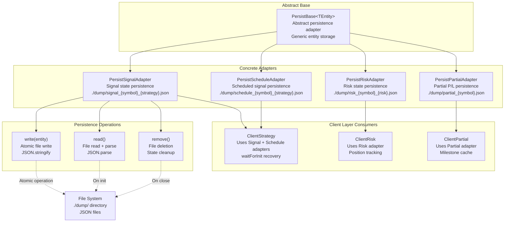
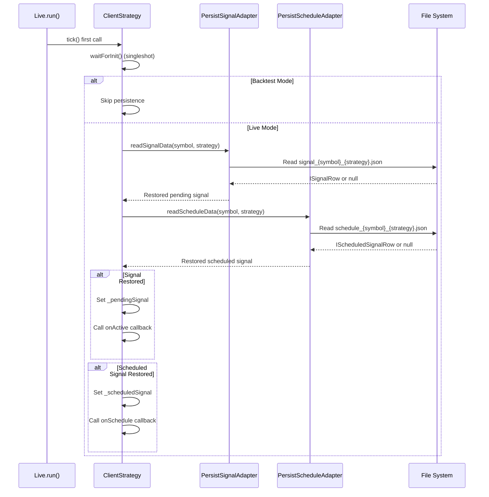
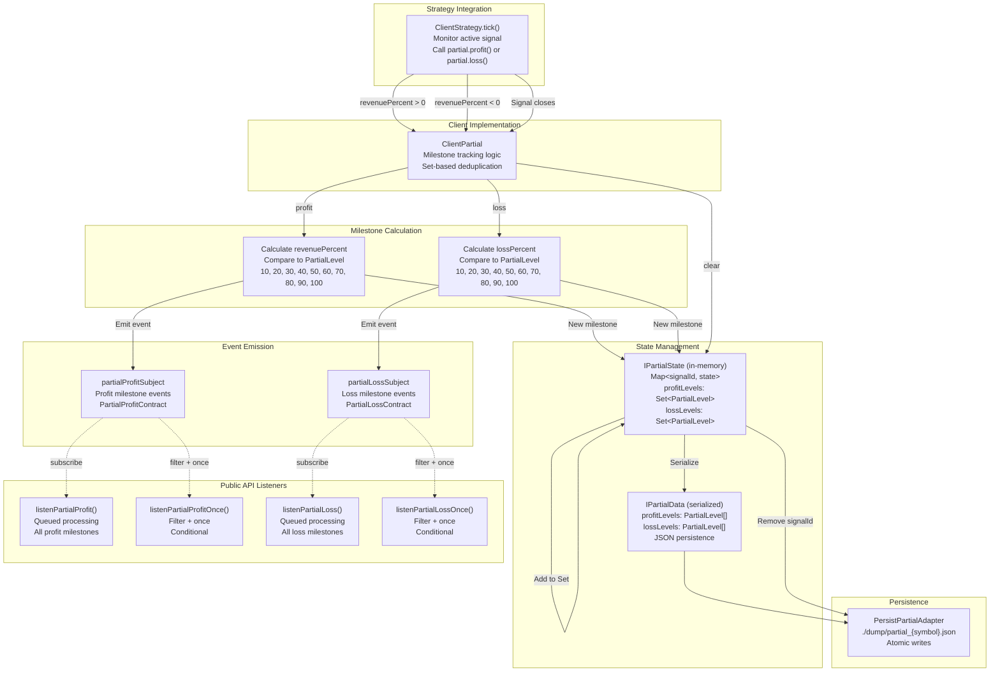
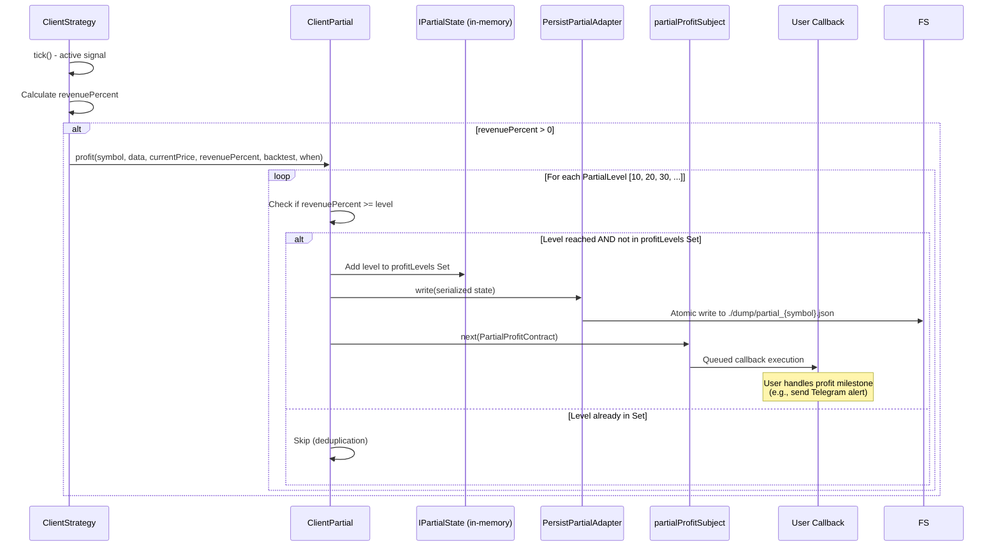

# Advanced Features

# Advanced Features

<details>
<summary>Relevant source files</summary>

The following files were used as context for generating this wiki page:

- [assets/uml.svg](assets/uml.svg)
- [docs/classes/WalkerCommandService.md](docs/classes/WalkerCommandService.md)
- [docs/interfaces/BacktestStatistics.md](docs/interfaces/BacktestStatistics.md)
- [docs/interfaces/IStrategyCallbacks.md](docs/interfaces/IStrategyCallbacks.md)
- [docs/interfaces/LiveStatistics.md](docs/interfaces/LiveStatistics.md)
- [docs/internals.md](docs/internals.md)
- [docs/types/IStrategyTickResult.md](docs/types/IStrategyTickResult.md)
- [docs/uml.puml](docs/uml.puml)
- [scripts/uml.mjs](scripts/uml.mjs)
- [src/client/ClientStrategy.ts](src/client/ClientStrategy.ts)
- [src/config/emitters.ts](src/config/emitters.ts)
- [src/function/event.ts](src/function/event.ts)
- [src/index.ts](src/index.ts)
- [src/interfaces/Strategy.interface.ts](src/interfaces/Strategy.interface.ts)
- [src/lib/services/connection/StrategyConnectionService.ts](src/lib/services/connection/StrategyConnectionService.ts)
- [types.d.ts](types.d.ts)

</details>


This document covers advanced capabilities of the backtest-kit framework that extend beyond basic strategy execution. These features enable production-ready live trading, comprehensive monitoring, and sophisticated profit/loss tracking. For basic strategy definition, see [Strategy System](./11-strategy-system.md). For execution modes, see [Execution Modes (Detailed)](./16-execution-modes-detailed.md).

The three advanced features covered are:
1. **Crash Recovery and Persistence**: Atomic state storage with automatic recovery for live trading resilience
2. **Event Listeners and Monitoring**: Comprehensive pub/sub event system for real-time tracking and alerting
3. **Partial Profit and Loss**: Milestone-based tracking of unrealized profits and losses during active trades

---

## Crash Recovery and Persistence Architecture

The framework implements a crash-safe persistence system that enables live trading processes to recover from unexpected termination. All critical state is written atomically to JSON files, allowing processes to resume exactly where they left off.

### Persistence Layer Overview



**Sources**: [types.d.ts:163-176](), [src/client/ClientStrategy.ts:491-552](), Diagram 1 (Overall System Architecture)

### PersistBase Abstract Class

`PersistBase<TEntity>` provides the foundation for all persistence adapters with generic type-safe operations. Adapters extend this class and implement entity-specific file path logic.

**Key Methods**:
- `write(entity: TEntity | null)`: Atomic write to JSON file
- `read(): Promise<TEntity | null>`: Read and parse JSON file
- `remove()`: Delete persisted state

**File Naming Pattern**: `./dump/{type}_{identifier}.json`

**Sources**: [types.d.ts:163-176]()

### Signal and Schedule Persistence

`ClientStrategy` uses two persistence adapters to maintain state across restarts:

| Adapter | Purpose | File Pattern | Data Type |
|---------|---------|--------------|-----------|
| `PersistSignalAdapter` | Active pending signals | `signal_{symbol}_{strategy}.json` | `ISignalRow` |
| `PersistScheduleAdapter` | Scheduled signals awaiting activation | `schedule_{symbol}_{strategy}.json` | `IScheduledSignalRow` |

**Recovery Flow**:



**Sources**: [src/client/ClientStrategy.ts:491-552](), [types.d.ts:163-176]()

### Atomic Write Pattern

All persistence adapters implement atomic writes to prevent data corruption during crashes:

1. **Serialize**: Convert entity to JSON string
2. **Write Atomic**: Write to file system with atomic guarantees
3. **Validate**: Ensure write succeeded before continuing

This ensures that persisted state is always either the complete previous version or the complete new version—never a partial write.

**Key Implementation**: Each `ClientStrategy` method that modifies signal state calls `setPendingSignal()` or `setScheduledSignal()`, which internally triggers `PersistSignalAdapter.write()` or `PersistScheduleAdapter.write()`.

**Sources**: [src/client/ClientStrategy.ts:491-552]()

### Singleshot Initialization Pattern

`ClientStrategy.waitForInit()` uses the `singleshot` pattern from `functools-kit` to ensure persistence recovery happens exactly once per strategy instance:

```typescript
// First call: executes recovery logic and caches promise
await strategy.waitForInit();

// Subsequent calls: return cached promise (no-op)
await strategy.waitForInit();
```

This prevents duplicate recovery attempts and ensures consistent initialization across multiple ticks.

**Sources**: [src/client/ClientStrategy.ts:491-552](), [docs/internals.md:49]()

### Risk State Persistence

`ClientRisk` uses `PersistRiskAdapter` to track active positions across process restarts. This is critical for portfolio-level risk management that must survive crashes.

**Persisted Data**:
- Active position count
- List of active positions with signal details
- Risk validation state

**File Pattern**: `./dump/risk_{symbol}_{riskName}.json`

**Sources**: [types.d.ts:163-176](), Diagram 1 (Overall System Architecture)

### Partial State Persistence

`ClientPartial` uses `PersistPartialAdapter` to maintain partial profit/loss milestone tracking across restarts. This ensures milestone events aren't duplicated after recovery.

**Persisted Data**:
- Signal ID to partial state mapping
- Reached profit levels (Set serialized as array)
- Reached loss levels (Set serialized as array)

**File Pattern**: `./dump/partial_{symbol}.json`

**Sources**: [types.d.ts:707-724](), [types.d.ts:163-176]()

---

## Event Listeners and Monitoring System

The framework provides a comprehensive pub/sub event system for monitoring strategy execution, handling errors, and tracking progress. All events use `functools-kit` Subject for type-safe event emission and subscription.

### Event Emitter Architecture

```mermaid
graph TB
    subgraph "Event Producers"
        CS["ClientStrategy<br/>tick(), backtest()<br/>Signal lifecycle"]
        CE["ClientExchange<br/>getCandles()<br/>Data fetching"]
        CR["ClientRisk<br/>checkSignal()<br/>Risk rejections"]
        CP["ClientPartial<br/>profit(), loss()<br/>Milestone tracking"]
        Logic["Logic Services<br/>Progress, completion<br/>Performance metrics"]
    end
    
    subgraph "Core Emitters - functools-kit Subject"
        SE["signalEmitter<br/>All signals<br/>IStrategyTickResult"]
        SLE["signalLiveEmitter<br/>Live only<br/>IStrategyTickResult"]
        SBE["signalBacktestEmitter<br/>Backtest only<br/>IStrategyTickResult"]
        EE["errorEmitter<br/>Recoverable errors<br/>Error"]
        ExE["exitEmitter<br/>Fatal errors<br/>Error"]
        DLS["doneLiveSubject<br/>Live completion<br/>DoneContract"]
        DBS["doneBacktestSubject<br/>Backtest completion<br/>DoneContract"]
        DWS["doneWalkerSubject<br/>Walker completion<br/>DoneContract"]
        PBE["progressBacktestEmitter<br/>Backtest progress<br/>ProgressBacktestContract"]
        PWE["progressWalkerEmitter<br/>Walker progress<br/>ProgressWalkerContract"]
        POE["progressOptimizerEmitter<br/>Optimizer progress<br/>ProgressOptimizerContract"]
        PE["performanceEmitter<br/>Performance metrics<br/>PerformanceContract"]
        WE["walkerEmitter<br/>Strategy results<br/>WalkerContract"]
        WCS["walkerCompleteSubject<br/>Final results<br/>IWalkerResults"]
        WSS["walkerStopSubject<br/>Stop signals<br/>WalkerStopContract"]
        VS["validationSubject<br/>Validation errors<br/>Error"]
        PPS["partialProfitSubject<br/>Profit milestones<br/>PartialProfitContract"]
        PLS["partialLossSubject<br/>Loss milestones<br/>PartialLossContract"]
        RS["riskSubject<br/>Risk rejections<br/>RiskContract"]
    end
    
    subgraph "Public Listeners - Queued Processing"
        LS["listenSignal()<br/>queued async<br/>All signals"]
        LSO["listenSignalOnce()<br/>filter + once<br/>Conditional"]
        LSLV["listenSignalLive()<br/>queued async<br/>Live only"]
        LSLVO["listenSignalLiveOnce()<br/>filter + once<br/>Conditional"]
        LSBT["listenSignalBacktest()<br/>queued async<br/>Backtest only"]
        LSBTO["listenSignalBacktestOnce()<br/>filter + once<br/>Conditional"]
        LE["listenError()<br/>queued async<br/>Error handling"]
        LEx["listenExit()<br/>queued async<br/>Fatal errors"]
        LDL["listenDoneLive()<br/>queued async<br/>Live completion"]
        LDLO["listenDoneLiveOnce()<br/>filter + once<br/>Conditional"]
        LDB["listenDoneBacktest()<br/>queued async<br/>Backtest completion"]
        LDBO["listenDoneBacktestOnce()<br/>filter + once<br/>Conditional"]
        LDW["listenDoneWalker()<br/>queued async<br/>Walker completion"]
        LDWO["listenDoneWalkerOnce()<br/>filter + once<br/>Conditional"]
        LBP["listenBacktestProgress()<br/>queued async<br/>Progress updates"]
        LWP["listenWalkerProgress()<br/>queued async<br/>Progress updates"]
        LOP["listenOptimizerProgress()<br/>queued async<br/>Progress updates"]
        LP["listenPerformance()<br/>queued async<br/>Metrics tracking"]
        LW["listenWalker()<br/>queued async<br/>Strategy results"]
        LWO["listenWalkerOnce()<br/>filter + once<br/>Conditional"]
        LWC["listenWalkerComplete()<br/>queued async<br/>Final results"]
        LV["listenValidation()<br/>queued async<br/>Validation errors"]
        LPP["listenPartialProfit()<br/>queued async<br/>Profit milestones"]
        LPPO["listenPartialProfitOnce()<br/>filter + once<br/>Conditional"]
        LPL["listenPartialLoss()<br/>queued async<br/>Loss milestones"]
        LPLO["listenPartialLossOnce()<br/>filter + once<br/>Conditional"]
        LR["listenRisk()<br/>queued async<br/>Risk rejections"]
        LRO["listenRiskOnce()<br/>filter + once<br/>Conditional"]
    end
    
    CS --> SE
    CS --> SLE
    CS --> SBE
    CR --> RS
    CP --> PPS
    CP --> PLS
    Logic --> PBE
    Logic --> PWE
    Logic --> POE
    Logic --> DLS
    Logic --> DBS
    Logic --> DWS
    Logic --> PE
    Logic --> WE
    Logic --> WCS
    Logic --> EE
    Logic --> ExE
    
    SE -.->|subscribe| LS
    SE -.->|filter + once| LSO
    SLE -.->|subscribe| LSLV
    SLE -.->|filter + once| LSLVO
    SBE -.->|subscribe| LSBT
    SBE -.->|filter + once| LSBTO
    EE -.->|subscribe| LE
    ExE -.->|subscribe| LEx
    DLS -.->|subscribe| LDL
    DLS -.->|filter + once| LDLO
    DBS -.->|subscribe| LDB
    DBS -.->|filter + once| LDBO
    DWS -.->|subscribe| LDW
    DWS -.->|filter + once| LDWO
    PBE -.->|subscribe| LBP
    PWE -.->|subscribe| LWP
    POE -.->|subscribe| LOP
    PE -.->|subscribe| LP
    WE -.->|subscribe| LW
    WE -.->|filter + once| LWO
    WCS -.->|subscribe| LWC
    VS -.->|subscribe| LV
    PPS -.->|subscribe| LPP
    PPS -.->|filter + once| LPPO
    PLS -.->|subscribe| LPL
    PLS -.->|filter + once| LPLO
    RS -.->|subscribe| LR
    RS -.->|filter + once| LRO
```



**Sources**: [src/config/emitters.ts:1-133](), [src/function/event.ts:1-564](), Diagram 4 (Event System and Communication Flow)

### Signal Event Listeners

Signal events track the complete lifecycle of trading signals from generation through closure:

| Function | Mode | Processing | Description |
|----------|------|------------|-------------|
| `listenSignal()` | All | Queued | All signal events (idle, opened, active, closed) |
| `listenSignalOnce()` | All | Queued + Filter | Single filtered event, auto-unsubscribe |
| `listenSignalLive()` | Live | Queued | Live-only signal events |
| `listenSignalLiveOnce()` | Live | Queued + Filter | Single filtered live event |
| `listenSignalBacktest()` | Backtest | Queued | Backtest-only signal events |
| `listenSignalBacktestOnce()` | Backtest | Queued + Filter | Single filtered backtest event |

**Event Payload**: `IStrategyTickResult` (discriminated union with `action` field)

**Action Types**:
- `"idle"`: No active signal
- `"scheduled"`: Scheduled signal created, awaiting activation
- `"opened"`: New signal opened after validation
- `"active"`: Signal being monitored (TP/SL checks)
- `"closed"`: Signal completed (TP/SL/time_expired)
- `"cancelled"`: Scheduled signal cancelled without activation

**Sources**: [src/function/event.ts:70-221](), [types.d.ts:854-953]()

### Queued Processing Pattern

All listener functions wrap callbacks with `queued()` from `functools-kit` to ensure sequential processing:

```typescript
export function listenSignal(fn: (event: IStrategyTickResult) => void) {
  return signalEmitter.subscribe(queued(async (event) => fn(event)));
}
```

**Benefits**:
- Events processed in order received
- Async callbacks don't cause race conditions
- Prevents concurrent execution conflicts

Even if callback contains `await`, next event waits for current callback to complete.

**Sources**: [src/function/event.ts:70-73](), [docs/internals.md:52]()

### Filter Predicates with Once Variants

"Once" listener variants accept a filter predicate for conditional triggering:

```typescript
listenSignalOnce(
  (event) => event.action === "closed" && event.closeReason === "take_profit",
  (event) => {
    console.log("Take profit hit:", event.pnl.pnlPercentage);
  }
);
```

After first matching event:
1. Filter predicate evaluated
2. If true, callback executed
3. Subscription automatically cancelled

**Use Case**: Wait for specific condition during backtest/live execution without manual unsubscribe.

**Sources**: [src/function/event.ts:107-113](), [src/function/event.ts:161-167]()

### Completion Event Listeners

Completion events signal the end of background execution:

| Function | Mode | Emitter | Contract |
|----------|------|---------|----------|
| `listenDoneLive()` | Live | `doneLiveSubject` | `DoneContract` |
| `listenDoneLiveOnce()` | Live | `doneLiveSubject` | `DoneContract` |
| `listenDoneBacktest()` | Backtest | `doneBacktestSubject` | `DoneContract` |
| `listenDoneBacktestOnce()` | Backtest | `doneBacktestSubject` | `DoneContract` |
| `listenDoneWalker()` | Walker | `doneWalkerSubject` | `DoneContract` |
| `listenDoneWalkerOnce()` | Walker | `doneWalkerSubject` | `DoneContract` |

**DoneContract Payload**:
```typescript
{
  backtest: boolean;      // Execution mode
  symbol: string;         // Trading pair
  strategyName: string;   // Strategy identifier
  exchangeName: string;   // Exchange identifier
  frameName?: string;     // Frame identifier (backtest only)
}
```

**Sources**: [src/function/event.ts:308-413](), [src/config/emitters.ts:50-62]()

### Progress Event Listeners

Progress events track execution advancement during long-running operations:

| Function | Emitter | Contract | Tracks |
|----------|---------|----------|--------|
| `listenBacktestProgress()` | `progressBacktestEmitter` | `ProgressBacktestContract` | Timeframe iteration |
| `listenWalkerProgress()` | `progressWalkerEmitter` | `ProgressWalkerContract` | Strategy completion |
| `listenOptimizerProgress()` | `progressOptimizerEmitter` | `ProgressOptimizerContract` | Data source fetching |

**Progress Contracts** include:
- Current index/count
- Total count
- Percentage completion
- Context information (symbol, strategy, etc.)

**Sources**: [src/function/event.ts:464-532](), [src/config/emitters.ts:68-80]()

### Error Event Listeners

Error events distinguish between recoverable and fatal errors:

| Function | Emitter | Severity | Behavior |
|----------|---------|----------|----------|
| `listenError()` | `errorEmitter` | Recoverable | Execution continues |
| `listenExit()` | `exitEmitter` | Fatal | Execution terminates |

**Error Types**:
- **Recoverable**: API failures, validation errors, retry-able operations
- **Fatal**: Unrecoverable failures requiring process restart

**Sources**: [src/function/event.ts:247-279](), [src/config/emitters.ts:37-44]()

### Walker Event Listeners

Walker events track multi-strategy comparison progress and results:

| Function | Emitter | Contract | Purpose |
|----------|---------|----------|---------|
| `listenWalker()` | `walkerEmitter` | `WalkerContract` | Each strategy completion |
| `listenWalkerOnce()` | `walkerEmitter` | `WalkerContract` | Filtered strategy result |
| `listenWalkerComplete()` | `walkerCompleteSubject` | `IWalkerResults` | Final comparison results |
| `listenWalkerProgress()` | `progressWalkerEmitter` | `ProgressWalkerContract` | Strategy iteration progress |

**Sources**: [src/function/event.ts:415-462](), [src/config/emitters.ts:92-106]()

### Validation and Risk Event Listeners

Specialized listeners for risk management and validation errors:

| Function | Emitter | Contract | Tracks |
|----------|---------|----------|--------|
| `listenValidation()` | `validationSubject` | `Error` | Schema/config validation errors |
| `listenRisk()` | `riskSubject` | `RiskContract` | Risk check rejections only |
| `listenRiskOnce()` | `riskSubject` | `RiskContract` | Filtered risk rejection |

**Important**: `riskSubject` emits only when signals are **rejected** by risk checks. Allowed signals do not emit events (prevents spam).

**Sources**: [src/function/event.ts:534-564](), [src/config/emitters.ts:112-131]()

### Performance Event Listener

`listenPerformance()` tracks execution timing for bottleneck identification:

**PerformanceContract** includes:
- Metric type (enum)
- Duration in milliseconds
- Context information
- Timestamp

**Metric Types**:
- Strategy execution time
- Exchange data fetch time
- Risk validation time
- Persistence write time

**Sources**: [src/function/event.ts:464-476](), [src/config/emitters.ts:86]()

---

## Partial Profit and Loss Tracking

The framework tracks unrealized profit and loss milestones during active trades, emitting events when positions reach 10%, 20%, 30%, etc. profit or loss thresholds. This enables real-time monitoring and alert systems without closing positions.

### Partial Tracking Architecture



**Sources**: [types.d.ts:705-847](), Diagram 4 (Event System and Communication Flow)

### PartialLevel Type

Profit and loss milestones are defined as discrete percentage thresholds:

```typescript
type PartialLevel = 10 | 20 | 30 | 40 | 50 | 60 | 70 | 80 | 90 | 100;
```

Each `PartialLevel` represents a percentage point milestone. When a signal reaches 10% profit, the `10` level is emitted. When it reaches 25% profit, levels `10` and `20` have been reached, but only `20` is emitted (deduplication via Set).

**Sources**: [types.d.ts:705]()

### IPartial Interface

`ClientPartial` implements the `IPartial` interface with three core methods:

| Method | Purpose | Called When |
|--------|---------|-------------|
| `profit(symbol, data, currentPrice, revenuePercent, backtest, when)` | Track profit milestones | `revenuePercent > 0` in active signal |
| `loss(symbol, data, currentPrice, lossPercent, backtest, when)` | Track loss milestones | `revenuePercent < 0` in active signal |
| `clear(symbol, data, priceClose, backtest)` | Clear tracking state | Signal closes (TP/SL/time_expired) |

**Sources**: [types.d.ts:756-847]()

### Set-Based Deduplication

Each signal's partial state maintains two Sets for deduplication:

```typescript
interface IPartialState {
  profitLevels: Set<PartialLevel>;  // In-memory
  lossLevels: Set<PartialLevel>;    // In-memory
}
```

**Deduplication Logic**:
1. Calculate which levels have been reached
2. Check if level already in Set
3. If new, add to Set and emit event
4. If already in Set, skip (no duplicate event)

This ensures each milestone emits exactly once per signal, even across process restarts (state persisted).

**Sources**: [types.d.ts:707-724]()

### Profit Tracking Flow



**Sources**: [types.d.ts:765-789](), [src/client/ClientStrategy.ts:900-950]()

### Loss Tracking Flow

Loss tracking follows the same pattern as profit tracking, but uses negative percentage values:

**Key Differences**:
- Input: `lossPercent` (negative value, e.g., -15.5)
- Comparison: `Math.abs(lossPercent) >= level`
- Storage: `lossLevels` Set
- Emission: `partialLossSubject`

**Sources**: [types.d.ts:792-823]()

### Clear Operation

When a signal closes, `ClientPartial.clear()` removes the tracking state:

1. Delete `signalId` from in-memory Map
2. Serialize remaining state (other active signals)
3. Write updated state to disk (atomic)
4. Memoized `ClientPartial` instance cleared from `PartialConnectionService`

**Important**: Clear operation does NOT emit events—it only cleans up state.

**Sources**: [types.d.ts:826-846]()

### Partial Event Listeners

Four listener functions provide access to partial profit/loss events:

| Function | Emitter | Processing | Purpose |
|----------|---------|------------|---------|
| `listenPartialProfit()` | `partialProfitSubject` | Queued | All profit milestones |
| `listenPartialProfitOnce()` | `partialProfitSubject` | Queued + Filter | Single filtered profit event |
| `listenPartialLoss()` | `partialLossSubject` | Queued | All loss milestones |
| `listenPartialLossOnce()` | `partialLossSubject` | Queued + Filter | Single filtered loss event |

**PartialProfitContract Payload**:
```typescript
{
  symbol: string;
  data: ISignalRow;
  currentPrice: number;
  level: PartialLevel;        // 10, 20, 30, etc.
  revenuePercent: number;     // Actual profit percentage
  backtest: boolean;
  timestamp: number;
}
```

**PartialLossContract Payload**: Same structure, but with `lossPercent` instead of `revenuePercent`.

**Sources**: [src/function/event.ts:534-564](), [src/config/emitters.ts:118-124]()

### Strategy Callback Integration

`IStrategySchema` includes two callbacks for partial profit/loss:

```typescript
callbacks: {
  onPartialProfit: (symbol, data, currentPrice, revenuePercent, backtest) => void;
  onPartialLoss: (symbol, data, currentPrice, lossPercent, backtest) => void;
}
```

These callbacks fire on **every tick** while signal is in profit or loss, NOT just at milestones. For milestone-specific logic, use event listeners instead.

**Use Case**: Strategy callbacks for real-time UI updates; event listeners for discrete alerts.

**Sources**: [types.d.ts:910-931](), [docs/interfaces/IStrategyCallbacks.md:78-92]()

### Persistence Across Restarts

`PersistPartialAdapter` ensures milestone state survives process crashes:

**Serialization**:
```typescript
// In-memory (Sets)
{ profitLevels: Set(10, 20), lossLevels: Set(10) }

// Persisted (Arrays)
{ profitLevels: [10, 20], lossLevels: [10] }
```

**On Recovery**:
1. Load JSON file
2. Convert arrays back to Sets
3. Restore state in `ClientPartial`
4. Continue tracking from saved milestone state

This prevents duplicate milestone events after crashes.

**Sources**: [types.d.ts:707-724](), [types.d.ts:163-176]()

---

## Summary

The three advanced features work together to create a production-ready trading system:

1. **Crash Recovery**: Atomic persistence enables process restarts without state loss
2. **Event Monitoring**: Comprehensive pub/sub system tracks all execution aspects
3. **Partial Tracking**: Milestone-based monitoring provides real-time unrealized P/L insights

These features are optional—strategies can run without custom event listeners or partial tracking—but they're essential for professional live trading deployments.

**Sources**: [docs/internals.md:1-132](), All sections above