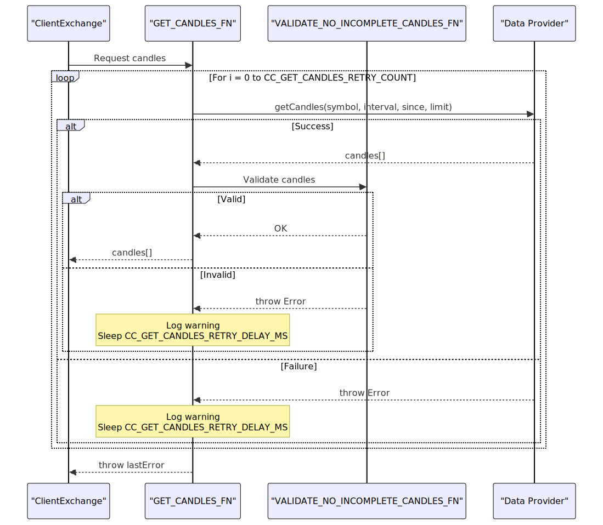

# ClientExchange

## Purpose and Scope

`ClientExchange` is the core data access class that provides market data to trading strategies through a unified interface. It wraps external exchange data providers (CCXT libraries, custom APIs, or database sources) and handles candle fetching, price formatting, and VWAP calculation. The class implements time-aware data fetching by using `ExecutionContextService` to determine the temporal boundary for historical vs. future data requests.

This document covers the implementation details of `ClientExchange` including its constructor parameters, core methods, retry logic, and integration with the execution context system. For exchange schema registration, see [Exchange Schemas](./25_Exchange_Schemas.md). For how `ClientExchange` instances are managed and memoized, see [Connection Services](./54_Timeframe_Generation.md).


---

## Architecture Overview

`ClientExchange` sits in the Data & Integration Layer and serves as the boundary between the framework's execution logic and external data sources. The class is instantiated by `ExchangeConnectionService`, wrapped by `ExchangeGlobalService` for context injection, and invoked by `ClientStrategy` during signal generation and by backtest logic during fast-forward simulation.

### Integration in System Architecture




---

## Constructor and Configuration

`ClientExchange` is instantiated with an `IExchangeParams` object that defines the exchange name, data provider functions, formatting functions, execution context reference, and logger.

### IExchangeParams Structure

| Field | Type | Description |
|-------|------|-------------|
| `exchangeName` | `string` | Unique identifier for the exchange (e.g., "binance", "bybit") |
| `getCandles` | `(symbol, interval, since, limit) => Promise<ICandleData[]>` | Function to fetch candles from data source starting at `since` |
| `formatPrice` | `(symbol, price) => Promise<number>` | Function to format price to exchange precision |
| `formatQuantity` | `(symbol, quantity) => Promise<number>` | Function to format quantity to exchange precision |
| `execution` | `ExecutionContextService` | Reference to execution context for time-aware fetching |
| `logger` | `LoggerService` | Logger instance for debug/warn/error messages |
| `callbacks?.onCandleData` | `(symbol, interval, since, limit, data) => void` | Optional callback invoked after fetching candles |


### Constructor Invocation

```typescript
const exchange = new ClientExchange({
  exchangeName: "binance",
  getCandles: async (symbol, interval, since, limit) => {
    // CCXT implementation or custom data source
    return await ccxt.fetchOHLCV(symbol, interval, since.getTime(), limit);
  },
  formatPrice: async (symbol, price) => price.toFixed(2),
  formatQuantity: async (symbol, quantity) => quantity.toFixed(8),
  execution: executionContextService,
  logger: loggerService,
  callbacks: {
    onCandleData: (symbol, interval, since, limit, data) => {
      console.log(`Fetched ${data.length} candles for ${symbol}`);
    }
  }
});
```


---

## Core Methods

### getCandles: Historical Data Fetching

The `getCandles` method fetches historical candles **backwards** from the execution context time (`ExecutionContextService.context.when`). This method is used by strategies during signal generation to analyze past market data.

#### Method Signature

```typescript
async getCandles(
  symbol: string,
  interval: CandleInterval,
  limit: number
): Promise<ICandleData[]>
```

#### Time Calculation Logic


**Implementation Details:**

1. **Time Adjustment Calculation** [src/client/ClientExchange.ts:201-212]()
   - Converts interval to minutes using `INTERVAL_MINUTES` mapping [src/client/ClientExchange.ts:10-21]()
   - Calculates `adjust = step * limit - step`
   - Computes `since = when - (adjust * 60 * 1000)`

2. **Retry Logic** [src/client/ClientExchange.ts:214]()
   - Delegates to `GET_CANDLES_FN` which retries `CC_GET_CANDLES_RETRY_COUNT` times
   - Sleeps `CC_GET_CANDLES_RETRY_DELAY_MS` between attempts [src/client/ClientExchange.ts:114-151]()

3. **Range Filtering** [src/client/ClientExchange.ts:217-229]()
   - Filters candles to match `[since, when]` timestamp range
   - Warns if fewer candles returned than requested

4. **Callback Invocation** [src/client/ClientExchange.ts:231-239]()
   - Calls `params.callbacks.onCandleData` if provided


---

### getNextCandles: Future Data Fetching

The `getNextCandles` method fetches candles **forwards** from the execution context time. This method is only used in backtest mode to retrieve candles for signal duration simulation. It returns an empty array if the requested time range extends beyond `Date.now()`.

#### Method Signature

```typescript
async getNextCandles(
  symbol: string,
  interval: CandleInterval,
  limit: number
): Promise<ICandleData[]>
```

#### Backtest vs Live Behavior



**Implementation Details:**

1. **Time Range Validation** [src/client/ClientExchange.ts:265-275]()
   - Calculates `endTime = since + (limit * interval_minutes * 60 * 1000)`
   - Returns empty array if `endTime > Date.now()`
   - Prevents fetching non-existent future data in live mode

2. **Data Fetching** [src/client/ClientExchange.ts:277]()
   - Uses same `GET_CANDLES_FN` retry logic as `getCandles`
   - Starts from `when` timestamp instead of adjusted historical time

3. **Usage in Backtest** [src/lib/services/logic/private/BacktestLogicPrivateService.ts:127-155]()
   - Called when scheduled signal is detected
   - Fetches `CC_SCHEDULE_AWAIT_MINUTES + minuteEstimatedTime + 1` candles
   - Used to simulate scheduled signal activation and closure


---

### getAveragePrice: VWAP Calculation

The `getAveragePrice` method computes the Volume Weighted Average Price (VWAP) from the last N 1-minute candles, where N is configurable via `GLOBAL_CONFIG.CC_AVG_PRICE_CANDLES_COUNT` (default: 5).

#### Method Signature

```typescript
async getAveragePrice(symbol: string): Promise<number>
```

#### VWAP Calculation Algorithm



**Implementation Details:**

1. **Typical Price Formula** [src/client/ClientExchange.ts:340]()
   - `typicalPrice = (high + low + close) / 3`
   - Uses the average of high, low, and close prices

2. **VWAP Formula** [src/client/ClientExchange.ts:339-352]()
   - `VWAP = sum(typicalPrice * volume) / sum(volume)`
   - Weights each candle's typical price by its trading volume

3. **Zero Volume Fallback** [src/client/ClientExchange.ts:346-349]()
   - Returns simple average of close prices if total volume is zero
   - Ensures method always returns a valid price

4. **Usage Context**
   - Called by `ClientStrategy.backtest()` during signal closure simulation
   - Used to determine realistic fill prices in backtesting


---

### formatPrice and formatQuantity

These methods delegate to user-provided formatting functions to ensure prices and quantities conform to exchange-specific precision requirements.

#### Method Signatures

```typescript
async formatPrice(symbol: string, price: number): Promise<number>
async formatQuantity(symbol: string, quantity: number): Promise<number>
```

**Implementation:** Direct delegation to `params.formatPrice` and `params.formatQuantity` with logging [src/client/ClientExchange.ts:357-371]()

**Typical Use Cases:**
- `formatPrice`: Rounds price to exchange's tick size (e.g., 0.01 for BTCUSDT)
- `formatQuantity`: Rounds quantity to exchange's lot size (e.g., 0.00001 BTC)


---

## Validation and Retry Logic

`ClientExchange` implements robust validation and retry mechanisms to handle data quality issues and transient failures from external data sources.

### Incomplete Candle Detection

The `VALIDATE_NO_INCOMPLETE_CANDLES_FN` function detects anomalous candles that result from incomplete API responses, such as prices that are orders of magnitude too low or zero volumes.

#### Validation Algorithm



**Validation Checks:** [src/client/ClientExchange.ts:31-105]()

1. **Reference Price Calculation** [src/client/ClientExchange.ts:39-56]()
   - Uses median for datasets >= `CC_GET_CANDLES_MIN_CANDLES_FOR_MEDIAN`
   - Uses average for smaller datasets (more stable)

2. **Numeric Validity** [src/client/ClientExchange.ts:65-76]()
   - Ensures all OHLCV values are finite (not NaN or Infinity)

3. **Positivity Check** [src/client/ClientExchange.ts:79-89]()
   - All OHLC prices must be positive
   - Volume must be non-negative

4. **Anomaly Detection** [src/client/ClientExchange.ts:92-104]()
   - Flags prices below `referencePrice / CC_GET_CANDLES_PRICE_ANOMALY_THRESHOLD_FACTOR`
   - Default factor: 10 (prices 10x lower than median are rejected)


---

### Retry Logic

The `GET_CANDLES_FN` helper implements automatic retry with exponential backoff for transient failures.

#### Retry Flow



**Configuration Parameters:**
- `CC_GET_CANDLES_RETRY_COUNT`: Number of retry attempts (default: 3) [src/config/params.ts:15]()
- `CC_GET_CANDLES_RETRY_DELAY_MS`: Delay between retries in milliseconds (default: 1000) [src/config/params.ts:16]()


---

## Context Integration

`ClientExchange` depends on `ExecutionContextService` to determine the current temporal position, which controls the boundary between historical and future data requests.

### ExecutionContext Usage


**Key Context Dependencies:**

1. **Backtest Mode** [src/client/ClientExchange.ts:265-275]()
   - `getNextCandles` checks if `endTime > Date.now()`
   - Returns empty array in live mode (prevents future data access)
   - Returns historical data in backtest mode

2. **Time Boundaries** [src/client/ClientExchange.ts:211-212](), [src/client/ClientExchange.ts:217-223]()
   - All candle fetches use `execution.context.when` as reference
   - Ensures consistent temporal perspective across all data requests

3. **Symbol Context** [src/interfaces/Exchange.interface.ts:18-35]()
   - Exchange methods receive symbol from strategy invocation
   - No implicit symbol storage in `ClientExchange`


---

## Usage Patterns

### Strategy Signal Generation

```typescript
// Inside ClientStrategy.tick()
const exchange = exchangeGlobalService.getExchange(symbol, exchangeName);
const candles = await exchange.getCandles("BTCUSDT", "1h", 24);

// Analyze candles and generate signal
const signal = strategy.getSignal(symbol, candles);
```


---

### Backtest Fast-Forward Simulation

```typescript
// Inside BacktestLogicPrivateService.run()
if (result.action === "opened") {
  const candles = await exchangeGlobalService.getNextCandles(
    symbol,
    "1m",
    signal.minuteEstimatedTime,
    when,
    true
  );
  const backtestResult = await strategyGlobalService.backtest(symbol, candles, when, true);
}
```


---

### VWAP Price Calculation for Signal Closure

```typescript
// Inside ClientStrategy.backtest()
const vwap = await this.params.exchange.getAveragePrice(symbol);
const pnl = this.calculatePnL(signal, vwap);
```


---

### Custom Exchange Integration

```typescript
import { addExchange } from "backtest-kit";

addExchange({
  exchangeName: "custom-database",
  getCandles: async (symbol, interval, since, limit) => {
    const query = `
      SELECT timestamp, open, high, low, close, volume
      FROM candles
      WHERE symbol = ? AND interval = ? AND timestamp >= ?
      ORDER BY timestamp ASC
      LIMIT ?
    `;
    const rows = await db.query(query, [symbol, interval, since.getTime(), limit]);
    return rows.map(row => ({
      timestamp: row.timestamp,
      open: row.open,
      high: row.high,
      low: row.low,
      close: row.close,
      volume: row.volume
    }));
  },
  formatPrice: async (symbol, price) => {
    const precision = await db.getPricePrecision(symbol);
    return Number(price.toFixed(precision));
  },
  formatQuantity: async (symbol, quantity) => {
    const precision = await db.getQuantityPrecision(symbol);
    return Number(quantity.toFixed(precision));
  }
});
```

