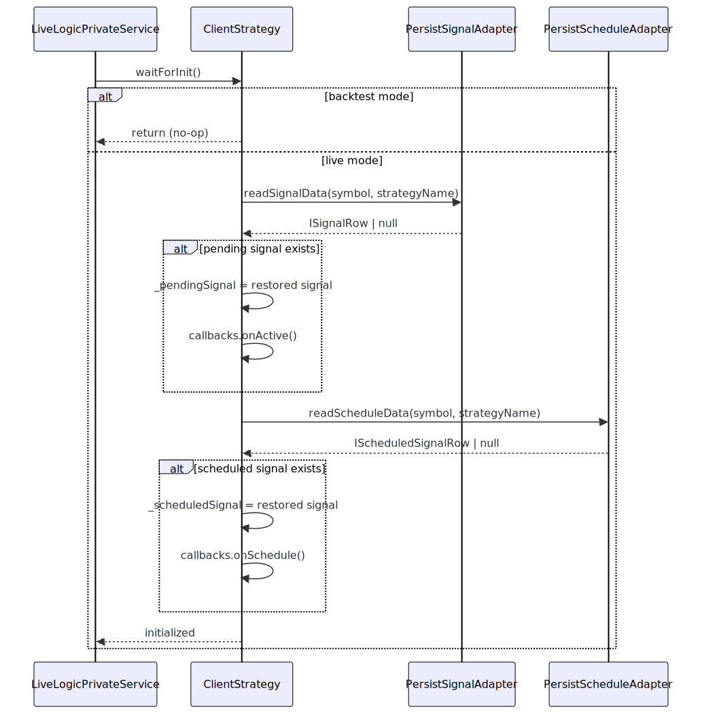

# ClientStrategy

## Purpose and Scope

`ClientStrategy` implements the `IStrategy` interface defined in [src/interfaces/Strategy.interface.ts:318-388]() and serves as the core execution engine for trading signal lifecycle management. The class is instantiated by `StrategyConnectionService` with memoization per `symbol:strategyName:backtest` combination.

**Core Responsibilities:**
- **Signal Generation**: Calls user-defined `getSignal()` function with interval throttling via `GET_SIGNAL_FN`
- **Validation**: Enforces 30+ validation rules through `VALIDATE_SIGNAL_FN` before signal activation
- **State Management**: Maintains `_pendingSignal` (active positions) and `_scheduledSignal` (limit orders) with atomic persistence
- **Monitoring**: Continuously checks VWAP prices against `priceTakeProfit`, `priceStopLoss`, and `minuteEstimatedTime` in `tick()` method
- **Execution Modes**: Supports both real-time `tick()` iteration (live mode) and fast-forward `backtest()` simulation (backtest mode)

**State Machine Implementation:**
The class manages six discriminated union states: `IStrategyTickResultIdle`, `IStrategyTickResultScheduled`, `IStrategyTickResultOpened`, `IStrategyTickResultActive`, `IStrategyTickResultClosed`, `IStrategyTickResultCancelled`.

For strategy schema definitions, see [Strategy Schemas](./25_Strategy_Schemas.md). For signal state transitions, see [Signal Lifecycle](./48_Signal_Lifecycle.md). For persistence adapters, see [Signal Persistence](./52_Signal_Persistence.md).


---

## Class Architecture

`ClientStrategy` is instantiated by `StrategyConnectionService` with memoization per symbol-strategy pair. The class maintains internal state for pending and scheduled signals while delegating to injected dependencies for exchange data, risk validation, and persistence.



**State Variables:**
- `_isStopped`: Flag set by `stop()` to prevent new signal generation
- `_pendingSignal`: Currently active signal being monitored for TP/SL
- `_scheduledSignal`: Signal waiting for price to reach `priceOpen` for activation
- `_lastSignalTimestamp`: Timestamp of last `getSignal()` call for interval throttling


---

## Signal State Machine

The strategy manages signals through a state machine with two parallel tracks: scheduled signals (delayed entry via `_scheduledSignal`) and pending signals (active positions via `_pendingSignal`). Each state corresponds to a discriminated union type from [src/interfaces/Strategy.interface.ts:174-307]().

### State-to-Code Mapping



### State Variables and Types

| State | Type | Variable | Persistence Adapter | Line Reference |
|-------|------|----------|---------------------|----------------|
| Idle | `IStrategyTickResultIdle` | `_pendingSignal=null` `_scheduledSignal=null` | - | [src/client/ClientStrategy.ts:1516-1519]() |
| Scheduled | `IStrategyTickResultScheduled` | `_scheduledSignal: IScheduledSignalRow` | `PersistScheduleAdapter` | [src/client/ClientStrategy.ts:1519]() |
| Opened | `IStrategyTickResultOpened` | `_pendingSignal: ISignalRow` (just set) | `PersistSignalAdapter` | [src/client/ClientStrategy.ts:1516]() |
| Active | `IStrategyTickResultActive` | `_pendingSignal: ISignalRow` | `PersistSignalAdapter` | [src/client/ClientStrategy.ts:1516]() |
| Closed | `IStrategyTickResultClosed` | `_pendingSignal=null` (after cleanup) | - | [src/client/ClientStrategy.ts:1000]() |
| Cancelled | `IStrategyTickResultCancelled` | `_scheduledSignal=null` (after cleanup) | - | [src/client/ClientStrategy.ts:578]() |


---

## Signal Intervals and Throttling

`ClientStrategy` enforces minimum time between `getSignal()` calls using the `interval` parameter. This prevents excessive signal generation and API rate limiting.

| Interval | Minutes | Milliseconds | Use Case |
|----------|---------|--------------|----------|
| `1m` | 1 | 60,000 | High-frequency scalping |
| `3m` | 3 | 180,000 | Fast momentum strategies |
| `5m` | 5 | 300,000 | Short-term swing trading |
| `15m` | 15 | 900,000 | Medium-term position trading |
| `30m` | 30 | 1,800,000 | Longer-term strategies |
| `1h` | 60 | 3,600,000 | Daily trading strategies |

**Throttling Implementation:**




---

## Method: waitForInit()

Initializes strategy state by loading persisted signals from disk (live mode only). Uses `singleshot` pattern to ensure execution exactly once per instance.

```typescript
// Usage in LiveLogicPrivateService
const strategy = await strategyConnection.getStrategy(symbol, strategyName);
await strategy.waitForInit();
```

**Behavior:**
1. **Backtest mode**: Returns immediately (no persistence)
2. **Live mode**: 
   - Reads `_pendingSignal` from `PersistSignalAdapter`
   - Reads `_scheduledSignal` from `PersistScheduleAdapter`
   - Validates exchangeName/strategyName match
   - Triggers `onActive` or `onSchedule` callbacks for restored signals

**State Restoration Flow:**




---

## Method: tick()

Performs a single iteration of strategy execution, handling signal generation, validation, monitoring, and closure.

### Execution Flow (Live Mode)


**Key Decision Points:**
1. **Stopped check**: Early return if `stop()` was called
2. **Scheduled signal monitoring**: Check timeout and price activation
3. **Signal generation**: Call `getSignal()` with throttling if no active signal
4. **Pending signal monitoring**: Check VWAP against TP/SL and time expiration


---

## Method: backtest()

Fast-forwards through historical candle data to simulate signal lifecycle without real-time waiting. Processes entire signal duration in one call.

### Backtest Flow


**Scheduled Signal Processing Logic:**

For scheduled signals, the backtest must first determine if/when activation occurs:


**VWAP Calculation Window:**

Uses last N candles (default 5) for VWAP calculation, configurable via `CC_AVG_PRICE_CANDLES_COUNT`:

```
Candle Index:  0    1    2    3    4    5    6    7
               [----][----][----][----][====][====][====][====]
                                        ^              ^
                                        |              |
                                   Start here     Current position
                                   (i=4)          Uses candles 3-7
```


---

## Method: stop()

Gracefully stops new signal generation while allowing active positions to close naturally.

**Behavior:**
- Sets `_isStopped = true` to prevent `getSignal()` calls
- Clears `_scheduledSignal` if exists (not yet activated)
- Does **NOT** force-close `_pendingSignal` (continues monitoring)




---

## Signal Generation Pipeline

The `GET_SIGNAL_FN` helper orchestrates multi-stage validation before creating signals.


**Validation Stages:**

| Stage | Check | Action |
|-------|-------|--------|
| 1. Stopped | `_isStopped === true` | Return null |
| 2. Throttling | `currentTime - _lastSignalTimestamp < intervalMs` | Return null |
| 3. Risk Gate | `risk.checkSignal()` returns false | Return null |
| 4. Signal Generation | `getSignal()` returns null | Return null |
| 5. Signal Validation | `VALIDATE_SIGNAL_FN()` throws | Error logged, return null |


---

## Signal Validation Rules

`VALIDATE_SIGNAL_FN` enforces 30+ validation rules to prevent invalid trades. All validations occur **before** signal activation.

### Required Field Checks

```typescript
// Validation failures throw Error with detailed message
const errors: string[] = [];

// Field presence validation
if (signal.id === undefined || signal.id === null || signal.id === '') {
  errors.push('id is required and must be a non-empty string');
}
if (signal.position === undefined || signal.position === null) {
  errors.push('position is required and must be "long" or "short"');
}
```

### Price Validation Rules



### Configuration Parameters

| Parameter | Default | Purpose |
|-----------|---------|---------|
| `CC_MIN_TAKEPROFIT_DISTANCE_PERCENT` | 0.3% | Minimum TP distance to cover fees (2×0.1%) + profit |
| `CC_MAX_STOPLOSS_DISTANCE_PERCENT` | 20% | Maximum SL distance to prevent catastrophic losses |
| `CC_MAX_SIGNAL_LIFETIME_MINUTES` | 1440 (1 day) | Maximum signal duration to prevent eternal positions |
| `CC_AVG_PRICE_CANDLES_COUNT` | 5 | Number of candles for VWAP calculation |
| `CC_SCHEDULE_AWAIT_MINUTES` | 120 (2 hours) | Maximum wait time for scheduled signal activation |

**Edge Case Protection:**

For immediate (non-scheduled) signals:
- **LONG**: `currentPrice < priceStopLoss` → Error (would immediately trigger SL)
- **LONG**: `currentPrice > priceTakeProfit` → Error (profit opportunity already passed)
- **SHORT**: `currentPrice > priceStopLoss` → Error (would immediately trigger SL)
- **SHORT**: `currentPrice < priceTakeProfit` → Error (profit opportunity already passed)


---

## Scheduled Signal Lifecycle

Scheduled signals implement delayed entry at specific price points with pre-activation cancellation logic.

### Activation Decision Tree



### Cancellation Priority Logic

**Critical**: For scheduled signals, StopLoss cancellation has **priority over activation** when both conditions occur on the same candle.

**LONG Position:**
```typescript
if (candle.low <= priceStopLoss) {
  // Cancel FIRST - even if candle.low also <= priceOpen
  shouldCancel = true;
} else if (candle.low <= priceOpen) {
  // Only activate if SL NOT hit
  shouldActivate = true;
}
```

**SHORT Position:**
```typescript
if (candle.high >= priceStopLoss) {
  // Cancel FIRST - even if candle.high also >= priceOpen
  shouldCancel = true;
} else if (candle.high >= priceOpen) {
  // Only activate if SL NOT hit
  shouldActivate = true;
}
```

**Rationale**: If price moves past StopLoss before or simultaneously with reaching priceOpen, the market conditions have invalidated the trade setup. Signal should be cancelled rather than opening a position that will immediately hit StopLoss.


---

## Pending Signal Monitoring

Once activated, pending signals are continuously monitored for Take Profit, Stop Loss, or time expiration.

### TP/SL Check Logic



### Closure Cleanup Sequence

When a signal closes, multiple cleanup operations execute:




---

## Persistence Integration

`ClientStrategy` uses atomic file writes for crash-safe state persistence in live mode.

### Persistence Adapters



### Write Operations

| Method | Trigger | Persistence Call | Backtest Behavior |
|--------|---------|------------------|-------------------|
| `setPendingSignal()` | Signal opened/closed | `PersistSignalAdapter.writeSignalData()` | Calls `onWrite` callback only |
| `setScheduledSignal()` | Scheduled signal created/cancelled | `PersistScheduleAdapter.writeScheduleData()` | Skipped |

**File Paths** (default implementation):
- Pending signal: `./persist/signal-{symbol}-{strategyName}.json`
- Scheduled signal: `./persist/schedule-{symbol}-{strategyName}.json`

### State Restoration Guarantees

**Atomic Write**: All persistence operations use atomic file writes (write-temp-rename pattern) to prevent corruption during crashes.

**Validation on Load**: 
```typescript
// waitForInit() validates restored signals
if (pendingSignal.exchangeName !== self.params.method.context.exchangeName) {
  return; // Ignore mismatched exchange
}
if (pendingSignal.strategyName !== self.params.method.context.strategyName) {
  return; // Ignore mismatched strategy
}
```

**Callback Invocation**: Restored signals trigger lifecycle callbacks:
- `onActive` for restored `_pendingSignal`
- `onSchedule` for restored `_scheduledSignal`


---

## Live Mode vs Backtest Mode Differences

`ClientStrategy` behavior diverges based on the `execution.context.backtest` flag.

| Feature | Live Mode (`backtest=false`) | Backtest Mode (`backtest=true`) |
|---------|----------------------------|----------------------------------|
| **Time Source** | `new Date()` at each `tick()` | `when` from `ExecutionContextService` |
| **Candle Processing** | VWAP from `getAveragePrice()` | Array processing in `backtest()` |
| **Persistence** | All state changes persisted | No persistence (in-memory only) |
| **State Restoration** | `waitForInit()` loads from disk | `waitForInit()` no-op |
| **Scheduled Activation** | Real-time price checks on each `tick()` | Candle-by-candle in `backtest()` |
| **Partial Callbacks** | Called on each `tick()` | Called on each candle iteration |
| **Time Progression** | 61-second sleep between ticks | Instant (skip-ahead optimization) |

### Live Mode Tick Flow

```typescript
// LiveLogicPrivateService
while (true) {
  const result = await strategy.tick(symbol, strategyName);
  
  if (result.action === "opened" || result.action === "closed") {
    yield result; // Stream to listener
  }
  
  await sleep(TICK_TTL); // 61 seconds
}
```

### Backtest Mode Flow

```typescript
// BacktestLogicPrivateService
for (const when of timeframes) {
  const result = await strategy.tick(symbol, strategyName);
  
  if (result.action === "scheduled" || result.action === "opened") {
    // Fetch future candles
    const candles = await exchange.getNextCandles(symbol, "1m", signal.minuteEstimatedTime);
    const finalResult = await strategy.backtest(symbol, strategyName, candles);
    yield finalResult;
    
    // Skip ahead to after signal closure
    skipToTimestamp = finalResult.closeTimestamp;
  }
}
```


---

## Internal Helper Functions

`ClientStrategy` delegates complex logic to 19 stateless helper functions defined at module scope in [src/client/ClientStrategy.ts:41-1486](). This architecture improves testability and reduces cyclomatic complexity of public methods.

### Helper Function Architecture

**Method-to-Helper Mapping:**



### Function Reference Table

| Function | Line Range | Called By | Returns |
|----------|-----------|-----------|---------|
| `VALIDATE_SIGNAL_FN` | [src/client/ClientStrategy.ts:45-330]() | `GET_SIGNAL_FN` | `void` (throws on error) |
| `GET_SIGNAL_FN` | [src/client/ClientStrategy.ts:332-476]() | `tick()` | `ISignalRow \| IScheduledSignalRow \| null` |
| `GET_AVG_PRICE_FN` | [src/client/ClientStrategy.ts:478-489]() | `backtest()` | `number` |
| `WAIT_FOR_INIT_FN` | [src/client/ClientStrategy.ts:491-552]() | `waitForInit()` | `Promise<void>` |
| `CHECK_SCHEDULED_SIGNAL_TIMEOUT_FN` | [src/client/ClientStrategy.ts:554-608]() | `tick()` | `Promise<IStrategyTickResultCancelled \| null>` |
| `CHECK_SCHEDULED_SIGNAL_PRICE_ACTIVATION_FN` | [src/client/ClientStrategy.ts:610-644]() | `tick()` | `{ shouldActivate, shouldCancel }` |
| `CANCEL_SCHEDULED_SIGNAL_BY_STOPLOSS_FN` | [src/client/ClientStrategy.ts:646-679]() | `tick()` | `Promise<IStrategyTickResultIdle>` |
| `ACTIVATE_SCHEDULED_SIGNAL_FN` | [src/client/ClientStrategy.ts:681-774]() | `tick()` | `Promise<IStrategyTickResultOpened \| null>` |
| `RETURN_SCHEDULED_SIGNAL_ACTIVE_FN` | [src/client/ClientStrategy.ts:776-801]() | `tick()` | `Promise<IStrategyTickResultActive>` |
| `OPEN_NEW_SCHEDULED_SIGNAL_FN` | [src/client/ClientStrategy.ts:803-846]() | `tick()` | `Promise<IStrategyTickResultScheduled>` |
| `OPEN_NEW_PENDING_SIGNAL_FN` | [src/client/ClientStrategy.ts:848-899]() | `tick()` | `Promise<IStrategyTickResultOpened \| null>` |
| `CHECK_PENDING_SIGNAL_COMPLETION_FN` | [src/client/ClientStrategy.ts:901-960]() | `tick()` | `Promise<IStrategyTickResultClosed \| null>` |
| `CLOSE_PENDING_SIGNAL_FN` | [src/client/ClientStrategy.ts:962-1023]() | `CHECK_PENDING_SIGNAL_COMPLETION_FN` | `Promise<IStrategyTickResultClosed>` |
| `RETURN_PENDING_SIGNAL_ACTIVE_FN` | [src/client/ClientStrategy.ts:1025-1062]() | `tick()` | `Promise<IStrategyTickResultActive>` |
| `RETURN_IDLE_FN` | [src/client/ClientStrategy.ts:1064-1077]() | `tick()` | `Promise<IStrategyTickResultIdle>` |
| `CANCEL_SCHEDULED_SIGNAL_IN_BACKTEST_FN` | [src/client/ClientStrategy.ts:1079-1114]() | `PROCESS_SCHEDULED_SIGNAL_CANDLES_FN` | `Promise<IStrategyTickResultCancelled>` |
| `ACTIVATE_SCHEDULED_SIGNAL_IN_BACKTEST_FN` | [src/client/ClientStrategy.ts:1116-1186]() | `PROCESS_SCHEDULED_SIGNAL_CANDLES_FN` | `Promise<boolean>` |
| `CLOSE_PENDING_SIGNAL_IN_BACKTEST_FN` | [src/client/ClientStrategy.ts:1188-1261]() | `PROCESS_PENDING_SIGNAL_CANDLES_FN` | `Promise<IStrategyTickResultClosed>` |
| `PROCESS_SCHEDULED_SIGNAL_CANDLES_FN` | [src/client/ClientStrategy.ts:1263-1357]() | `backtest()` | `Promise<{ activated, cancelled, activationIndex, result }>` |
| `PROCESS_PENDING_SIGNAL_CANDLES_FN` | [src/client/ClientStrategy.ts:1359-1486]() | `backtest()` | `Promise<IStrategyTickResultClosed \| null>` |

**Function Naming Convention**: All helper functions use `SCREAMING_SNAKE_CASE_FN` suffix for visual distinction and grep-ability.


---

## Error Handling and Logging

`ClientStrategy` uses `trycatch` wrapper for signal generation errors with automatic fallback.

```typescript
const GET_SIGNAL_FN = trycatch(
  async (self: ClientStrategy): Promise<ISignalRow | IScheduledSignalRow | null> => {
    // ... signal generation logic
  },
  {
    defaultValue: null,
    fallback: (error) => {
      backtest.loggerService.warn("ClientStrategy exception thrown", {
        error: errorData(error),
        message: getErrorMessage(error),
      });
      errorEmitter.next(error);
    },
  }
);
```

**Error Recovery Strategy:**
- **Signal generation errors**: Return `null`, log warning, emit to `errorEmitter`
- **Validation errors**: Caught by `trycatch`, logged, return `null`
- **Persistence errors**: Propagate to caller (fatal in live mode)
- **Exchange errors**: Propagate with retry logic in `ClientExchange`

**Logging Levels:**

| Level | Use Case | Example |
|-------|----------|---------|
| `debug` | State transitions | `"ClientStrategy tick"` |
| `info` | Signal lifecycle events | `"ClientStrategy signal take_profit"` |
| `warn` | Recoverable errors | `"ClientStrategy exception thrown"` |


---

## Performance Considerations

### Memory Efficiency

**Memoization**: `StrategyConnectionService` memoizes `ClientStrategy` instances per symbol-strategy pair:
```typescript
// Only one instance per (symbol, strategyName) combination
const strategy = await strategyConnection.getStrategy(symbol, strategyName);
```

**State Cleanup**: Signals are automatically removed from memory after closure:
- `_pendingSignal = null`
- `_scheduledSignal = null`
- `ClientPartial` state cleared
- `ClientRisk` active position removed

### Backtest Optimization

**Skip-Ahead**: After signal opens, backtest skips directly to closure without iterating unused timeframes:
```typescript
// BacktestLogicPrivateService
if (result.action === "opened") {
  const finalResult = await strategy.backtest(...);
  skipToTimestamp = finalResult.closeTimestamp; // Skip ahead
}
```

**VWAP Sliding Window**: Only last N candles used for average price calculation (default 5), not full history.

**Single File Load**: `waitForInit()` uses `singleshot` pattern to prevent duplicate reads:
```typescript
public waitForInit = singleshot(async () => await WAIT_FOR_INIT_FN(this));
```


---

## Usage Examples

### Basic Strategy Registration

```typescript
import { addStrategy } from "backtest-kit";

await addStrategy({
  strategyName: "momentum-scalper",
  interval: "5m",
  getSignal: async (symbol, when) => {
    // Custom signal logic
    const price = await getCurrentPrice(symbol);
    const momentum = calculateMomentum(symbol, when);
    
    if (momentum > threshold) {
      return {
        position: "long",
        priceTakeProfit: price * 1.02,
        priceStopLoss: price * 0.98,
        minuteEstimatedTime: 120,
        note: `Momentum: ${momentum.toFixed(2)}`
      };
    }
    
    return null;
  },
  callbacks: {
    onOpen: (symbol, signal, price, backtest) => {
      console.log(`Signal opened: ${signal.id} at ${price}`);
    },
    onClose: (symbol, signal, price, backtest) => {
      console.log(`Signal closed: ${signal.id} at ${price}`);
    }
  }
});
```

### Scheduled Signal (Limit Order)

```typescript
await addStrategy({
  strategyName: "limit-order-strategy",
  interval: "15m",
  getSignal: async (symbol, when) => {
    const currentPrice = await getCurrentPrice(symbol);
    const supportLevel = findSupportLevel(symbol);
    
    // Wait for price to drop to support before entering
    if (currentPrice > supportLevel * 1.05) {
      return {
        position: "long",
        priceOpen: supportLevel, // Will wait for this price
        priceTakeProfit: supportLevel * 1.03,
        priceStopLoss: supportLevel * 0.97,
        minuteEstimatedTime: 240,
        note: "Support bounce entry"
      };
    }
    
    return null;
  }
});
```

### Live Trading with Crash Recovery

```typescript
import { Live, listenSignalLive } from "backtest-kit";

// Listen for signal events
listenSignalLive((result) => {
  if (result.action === "opened") {
    console.log("Position opened:", result.signal.id);
  } else if (result.action === "closed") {
    console.log("Position closed:", result.pnl.pnlPercentage);
  }
});

// Start live trading (will restore state if crashed)
for await (const result of Live.run("BTCUSDT", {
  strategyName: "momentum-scalper",
  exchangeName: "binance",
})) {
  console.log(`Action: ${result.action}`);
}
```


---

## Integration with Other Components



**Component Interaction Pattern:**
1. **Schema Registration**: `addStrategy()` → `StrategySchemaService.addSchema()`
2. **Instance Creation**: `StrategyConnectionService.getStrategy()` → `new ClientStrategy(params)`
3. **Context Injection**: `StrategyGlobalService` wraps calls with `ExecutionContextService` and `MethodContextService`
4. **Execution**: Logic services call `tick()` or `backtest()` through global service wrapper
5. **Event Emission**: Strategy emits to `signalEmitter` / `signalBacktestEmitter` / `signalLiveEmitter`
6. **Persistence**: Automatic state writes to disk adapters in live mode

