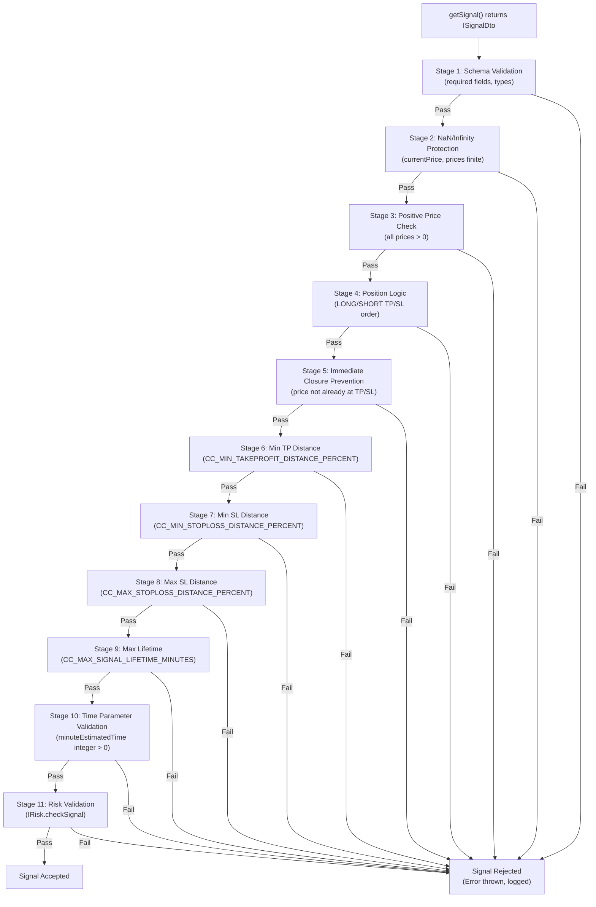
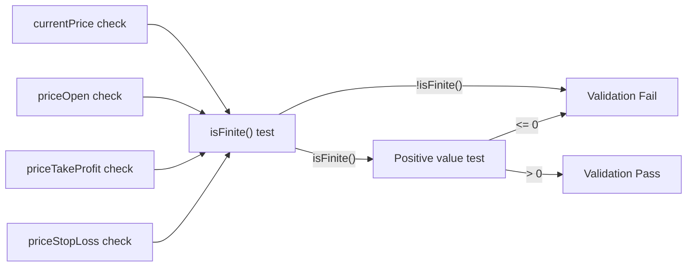
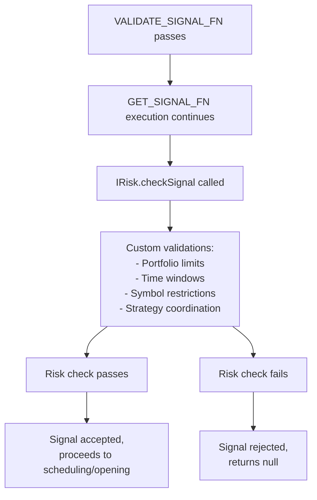
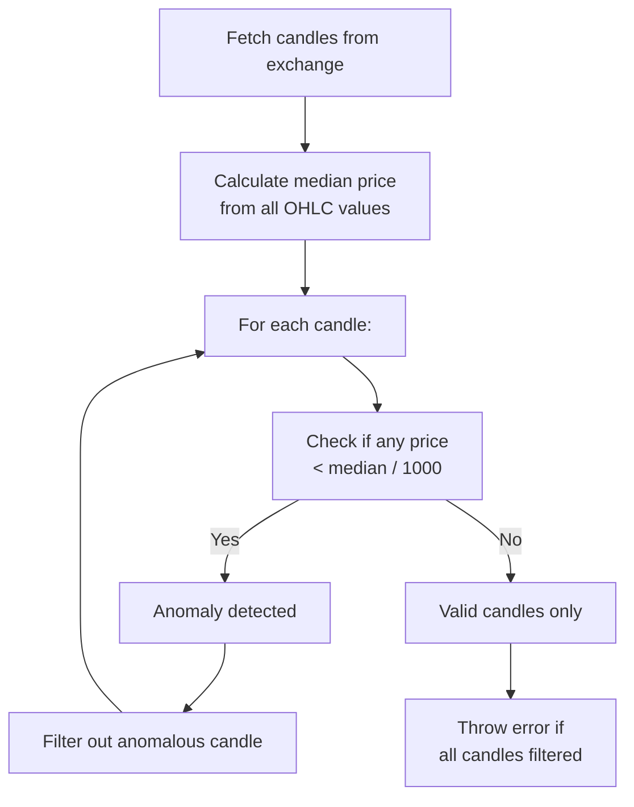
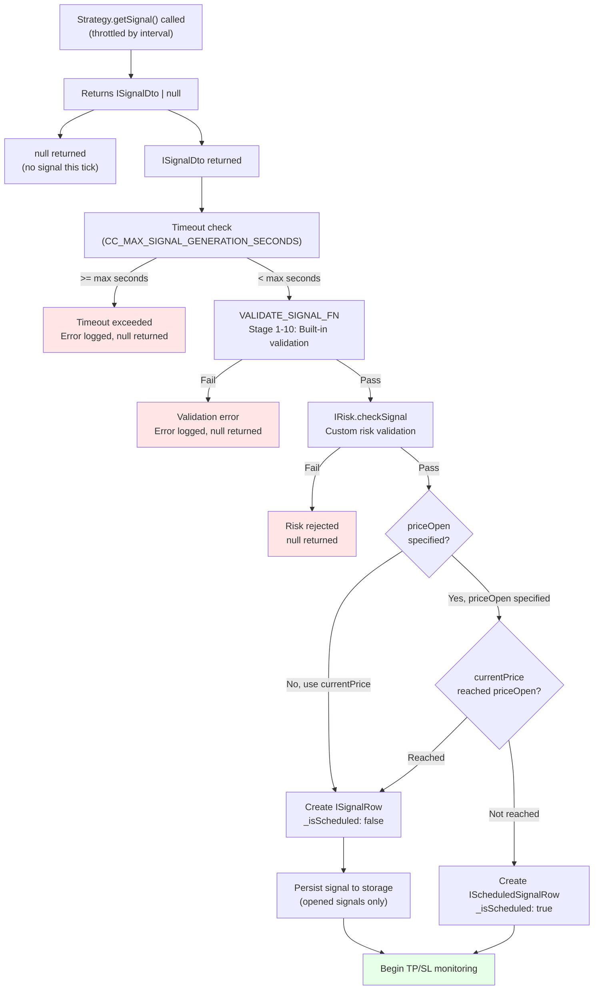

# Signal Validation Pipeline

## Purpose and Scope

This page documents the multi-stage validation pipeline that every trading signal passes through before execution. The validation system ensures signals meet structural, logical, and risk requirements to prevent catastrophic losses from malformed signals, protect capital from extreme risk exposure, and enforce profitability constraints that account for trading costs.

For information about defining custom risk validation rules beyond the built-in checks, see [Risk Profiles & Validation](./31_risk-management.md). For portfolio-wide position limits and concurrent signal management, see [Portfolio-Wide Limits](./31_risk-management.md).

**Sources:** [src/client/ClientStrategy.ts:45-330](), [src/config/params.ts:1-122](), [README.md:17-29]()

---

## Validation Pipeline Overview



**Validation Pipeline Stages**

The validation occurs in `VALIDATE_SIGNAL_FN` within `ClientStrategy`, called from `GET_SIGNAL_FN` before signal creation. Each stage checks specific constraints and accumulates error messages. If any validation fails, an error with all violation descriptions is thrown, preventing signal execution.

**Sources:** [src/client/ClientStrategy.ts:45-330](), [src/client/ClientStrategy.ts:332-476]()

---

## Schema and Type Validation

### Required Fields

The first validation stage ensures all required `ISignalRow` fields are present and non-empty:

| Field | Requirement | Error if Invalid |
|-------|-------------|------------------|
| `id` | Non-empty string | "id is required and must be a non-empty string" |
| `exchangeName` | Non-empty string | "exchangeName is required" |
| `strategyName` | Non-empty string | "strategyName is required" |
| `symbol` | Non-empty string | "symbol is required and must be a non-empty string" |
| `_isScheduled` | Boolean (not null/undefined) | "_isScheduled is required" |
| `position` | "long" or "short" | 'position must be "long" or "short"' |

**Sources:** [src/client/ClientStrategy.ts:49-68]()

---

## Price Validation

### NaN and Infinity Protection

**Critical**: All prices must be finite numbers. Incomplete candle data from exchanges can contain `NaN`, `Infinity`, or near-zero prices that would corrupt PNL calculations.



**Checks performed:**

1. **Finite Number Check**: `isFinite(price)` must be true
   - Rejects `NaN`: "must be a finite number, got NaN"
   - Rejects `Infinity`: "must be a finite number, got Infinity"

2. **Positive Price Check**: `price > 0` must be true
   - Rejects zero: "must be positive, got 0"
   - Rejects negative: "must be positive, got -1234"

**Sources:** [src/client/ClientStrategy.ts:71-109]()

---

## Position Logic Validation

### LONG Position Requirements

For `position: "long"` signals, the price order must be: **priceStopLoss < priceOpen < priceTakeProfit**

```typescript
// LONG validation checks
if (priceTakeProfit <= priceOpen) {
  errors.push("Long: priceTakeProfit must be > priceOpen");
}
if (priceStopLoss >= priceOpen) {
  errors.push("Long: priceStopLoss must be < priceOpen");
}
```

**Rationale**: For long positions, profit is made when price rises above entry, losses occur when price falls below entry.

**Sources:** [src/client/ClientStrategy.ts:112-122]()

### SHORT Position Requirements

For `position: "short"` signals, the price order must be: **priceTakeProfit < priceOpen < priceStopLoss**

```typescript
// SHORT validation checks
if (priceTakeProfit >= priceOpen) {
  errors.push("Short: priceTakeProfit must be < priceOpen");
}
if (priceStopLoss <= priceOpen) {
  errors.push("Short: priceStopLoss must be > priceOpen");
}
```

**Rationale**: For short positions, profit is made when price falls below entry, losses occur when price rises above entry.

**Sources:** [src/client/ClientStrategy.ts:203-213]()

---

## Immediate Closure Prevention

### For Immediate (Market) Signals

When `priceOpen` equals `currentPrice` (or is omitted), the signal opens immediately. The system prevents "open-and-immediately-close" scenarios:

**LONG Immediate Signal Checks:**
```typescript
if (currentPrice <= priceStopLoss) {
  errors.push("Long immediate: currentPrice <= priceStopLoss. " +
    "Signal would be immediately closed by stop loss.");
}
if (currentPrice >= priceTakeProfit) {
  errors.push("Long immediate: currentPrice >= priceTakeProfit. " +
    "The profit opportunity has already passed.");
}
```

**Valid state for LONG**: `priceStopLoss < currentPrice < priceTakeProfit`

**Sources:** [src/client/ClientStrategy.ts:125-141]()

**SHORT Immediate Signal Checks:**
```typescript
if (currentPrice >= priceStopLoss) {
  errors.push("Short immediate: currentPrice >= priceStopLoss. " +
    "Signal would be immediately closed by stop loss.");
}
if (currentPrice <= priceTakeProfit) {
  errors.push("Short immediate: currentPrice <= priceTakeProfit. " +
    "The profit opportunity has already passed.");
}
```

**Valid state for SHORT**: `priceTakeProfit < currentPrice < priceStopLoss`

**Sources:** [src/client/ClientStrategy.ts:216-232]()

### For Scheduled (Limit) Signals

When `priceOpen` differs from `currentPrice`, the signal enters scheduled state. The system validates that `priceOpen` itself won't trigger immediate closure upon activation:

**LONG Scheduled Signal Checks:**
```typescript
if (priceOpen <= priceStopLoss) {
  errors.push("Long scheduled: priceOpen <= priceStopLoss. " +
    "Signal would be immediately cancelled on activation.");
}
if (priceOpen >= priceTakeProfit) {
  errors.push("Long scheduled: priceOpen >= priceTakeProfit. " +
    "This is logically impossible for LONG position.");
}
```

**Sources:** [src/client/ClientStrategy.ts:144-160]()

**SHORT Scheduled Signal Checks:**
```typescript
if (priceOpen >= priceStopLoss) {
  errors.push("Short scheduled: priceOpen >= priceStopLoss. " +
    "Signal would be immediately cancelled on activation.");
}
if (priceOpen <= priceTakeProfit) {
  errors.push("Short scheduled: priceOpen <= priceTakeProfit. " +
    "This is logically impossible for SHORT position.");
}
```

**Sources:** [src/client/ClientStrategy.ts:235-251]()

---

## Distance Requirements

### Minimum TakeProfit Distance

**Purpose**: Ensures profit target is far enough to cover trading costs (fees + slippage).

**Configuration**: `GLOBAL_CONFIG.CC_MIN_TAKEPROFIT_DISTANCE_PERCENT` (default: 0.5%)

**Trading Cost Breakdown:**
- Entry fee: 0.1%
- Exit fee: 0.1%
- Entry slippage: ~0.1%
- Exit slippage: ~0.1%
- **Total overhead**: ~0.4%

The default 0.5% minimum ensures at least 0.1% net profit margin after costs.

**LONG TP Distance Calculation:**
```typescript
const tpDistancePercent = ((priceTakeProfit - priceOpen) / priceOpen) * 100;
if (tpDistancePercent < CC_MIN_TAKEPROFIT_DISTANCE_PERCENT) {
  errors.push(`Long: TakeProfit too close to priceOpen (${tpDistancePercent.toFixed(3)}%). ` +
    `Minimum distance: ${CC_MIN_TAKEPROFIT_DISTANCE_PERCENT}% to cover trading fees.`);
}
```

**SHORT TP Distance Calculation:**
```typescript
const tpDistancePercent = ((priceOpen - priceTakeProfit) / priceOpen) * 100;
if (tpDistancePercent < CC_MIN_TAKEPROFIT_DISTANCE_PERCENT) {
  errors.push(`Short: TakeProfit too close to priceOpen (${tpDistancePercent.toFixed(3)}%). ` +
    `Minimum distance: ${CC_MIN_TAKEPROFIT_DISTANCE_PERCENT}% to cover trading fees.`);
}
```

**Sources:** [src/client/ClientStrategy.ts:163-173](), [src/client/ClientStrategy.ts:254-264](), [src/config/params.ts:26-37]()

### Minimum StopLoss Distance

**Purpose**: Prevents instant stop-out from normal market volatility.

**Configuration**: `GLOBAL_CONFIG.CC_MIN_STOPLOSS_DISTANCE_PERCENT` (default: 0.5%)

**LONG SL Distance Calculation:**
```typescript
const slDistancePercent = ((priceOpen - priceStopLoss) / priceOpen) * 100;
if (slDistancePercent < CC_MIN_STOPLOSS_DISTANCE_PERCENT) {
  errors.push(`Long: StopLoss too close to priceOpen (${slDistancePercent.toFixed(3)}%). ` +
    `Minimum distance: ${CC_MIN_STOPLOSS_DISTANCE_PERCENT}% to avoid instant stop out.`);
}
```

**SHORT SL Distance Calculation:**
```typescript
const slDistancePercent = ((priceStopLoss - priceOpen) / priceOpen) * 100;
if (slDistancePercent < CC_MIN_STOPLOSS_DISTANCE_PERCENT) {
  errors.push(`Short: StopLoss too close to priceOpen (${slDistancePercent.toFixed(3)}%). ` +
    `Minimum distance: ${CC_MIN_STOPLOSS_DISTANCE_PERCENT}% to avoid instant stop out.`);
}
```

**Sources:** [src/client/ClientStrategy.ts:176-186](), [src/client/ClientStrategy.ts:267-277](), [src/config/params.ts:38-43]()

### Maximum StopLoss Distance

**Purpose**: Caps maximum loss per signal to protect capital from catastrophic single-trade losses.

**Configuration**: `GLOBAL_CONFIG.CC_MAX_STOPLOSS_DISTANCE_PERCENT` (default: 20%)

**Example**: With 20% limit, a single signal cannot lose more than 20% of position size, even if price drops 50%.

**LONG Max SL Check:**
```typescript
const slDistancePercent = ((priceOpen - priceStopLoss) / priceOpen) * 100;
if (slDistancePercent > CC_MAX_STOPLOSS_DISTANCE_PERCENT) {
  errors.push(`Long: StopLoss too far from priceOpen (${slDistancePercent.toFixed(3)}%). ` +
    `Maximum distance: ${CC_MAX_STOPLOSS_DISTANCE_PERCENT}% to protect capital.`);
}
```

**SHORT Max SL Check:**
```typescript
const slDistancePercent = ((priceStopLoss - priceOpen) / priceOpen) * 100;
if (slDistancePercent > CC_MAX_STOPLOSS_DISTANCE_PERCENT) {
  errors.push(`Short: StopLoss too far from priceOpen (${slDistancePercent.toFixed(3)}%). ` +
    `Maximum distance: ${CC_MAX_STOPLOSS_DISTANCE_PERCENT}% to protect capital.`);
}
```

**Sources:** [src/client/ClientStrategy.ts:189-199](), [src/client/ClientStrategy.ts:280-290](), [src/config/params.ts:44-49]()

---

## Lifetime Limits

### Maximum Signal Lifetime

**Purpose**: Prevents "eternal signals" that block risk limits indefinitely, causing strategy deadlock.

**Configuration**: `GLOBAL_CONFIG.CC_MAX_SIGNAL_LIFETIME_MINUTES` (default: 1,440 minutes = 1 day)

**Problem Scenario**: A signal with `minuteEstimatedTime: 50000` (34 days) occupies risk limits for over a month, preventing new signals from executing even when opportunities arise.

**Validation:**
```typescript
if (minuteEstimatedTime > CC_MAX_SIGNAL_LIFETIME_MINUTES) {
  const days = (minuteEstimatedTime / 60 / 24).toFixed(1);
  const maxDays = (CC_MAX_SIGNAL_LIFETIME_MINUTES / 60 / 24).toFixed(0);
  errors.push(
    `minuteEstimatedTime too large (${minuteEstimatedTime} minutes = ${days} days). ` +
    `Maximum: ${CC_MAX_SIGNAL_LIFETIME_MINUTES} minutes (${maxDays} days) to prevent strategy deadlock. ` +
    `Eternal signals block risk limits and prevent new trades.`
  );
}
```

**Sources:** [src/client/ClientStrategy.ts:306-315](), [src/config/params.ts:50-55]()

### Time Parameter Validation

**minuteEstimatedTime Requirements:**
- Must be positive: `minuteEstimatedTime > 0`
- Must be integer: `Number.isInteger(minuteEstimatedTime)`

**scheduledAt and pendingAt Requirements:**
- Must be positive timestamps: `> 0`

**Sources:** [src/client/ClientStrategy.ts:294-322]()

---

## GLOBAL_CONFIG Parameters

### Validation Threshold Reference

| Parameter | Default | Purpose | Impact if Violated |
|-----------|---------|---------|-------------------|
| `CC_MIN_TAKEPROFIT_DISTANCE_PERCENT` | 0.5% | Cover trading costs | Signal rejected (TP too close) |
| `CC_MIN_STOPLOSS_DISTANCE_PERCENT` | 0.5% | Avoid instant stop-out | Signal rejected (SL too close) |
| `CC_MAX_STOPLOSS_DISTANCE_PERCENT` | 20% | Cap maximum loss | Signal rejected (SL too far) |
| `CC_MAX_SIGNAL_LIFETIME_MINUTES` | 1,440 | Prevent eternal signals | Signal rejected (lifetime too long) |
| `CC_PERCENT_FEE` | 0.1% | Fee per transaction | Used in TP distance calc |
| `CC_PERCENT_SLIPPAGE` | 0.1% | Slippage per transaction | Used in TP distance calc |

**Setting Custom Thresholds:**
```typescript
import { setConfig } from 'backtest-kit';

setConfig({
  CC_MIN_TAKEPROFIT_DISTANCE_PERCENT: 1.0,  // Require 1% min TP
  CC_MAX_STOPLOSS_DISTANCE_PERCENT: 10,     // Limit SL to 10%
  CC_MAX_SIGNAL_LIFETIME_MINUTES: 720,      // Max 12 hours per signal
});
```

**Sources:** [src/config/params.ts:1-122]()

---

## Risk Validation Integration

### IRisk.checkSignal Execution

After passing all built-in validation stages, signals undergo custom risk validation via `IRisk.checkSignal()`:



**Risk Check Parameters:**
```typescript
interface RiskCheckParams {
  pendingSignal: ISignalDto;
  symbol: string;
  strategyName: string;
  exchangeName: string;
  currentPrice: number;
  timestamp: number;
}
```

**Integration Point in GET_SIGNAL_FN:**
```typescript
// After VALIDATE_SIGNAL_FN passes
if (await not(
  self.params.risk.checkSignal({
    pendingSignal: signal,
    symbol: self.params.execution.context.symbol,
    strategyName: self.params.method.context.strategyName,
    exchangeName: self.params.method.context.exchangeName,
    currentPrice,
    timestamp: currentTime,
  })
)) {
  return null;  // Risk check failed
}
```

For details on implementing custom risk validation logic, see [Risk Profiles & Validation](./31_risk-management.md).

**Sources:** [src/client/ClientStrategy.ts:374-387](), [src/interfaces/Risk.interface.ts]()

---

## Candle Data Validation

### Price Anomaly Detection

**Purpose**: Detect and reject incomplete/corrupt candle data from exchanges that would corrupt VWAP calculations and signal execution.

**Common Exchange Issues:**
- Incomplete candles with prices near $0 (e.g., $0.01-$1.00 for BTC)
- Missing volume data
- Duplicate timestamps
- Out-of-order candles

### Anomaly Detection Algorithm



**Parameters:**
- `CC_GET_CANDLES_PRICE_ANOMALY_THRESHOLD_FACTOR`: Default 1,000
- `CC_GET_CANDLES_MIN_CANDLES_FOR_MEDIAN`: Default 5 candles

**Example Detection:**
```typescript
// Normal BTC candles: $50,000 median
// Threshold: $50,000 / 1,000 = $50
// Any candle with price < $50 is rejected as anomalous

// Incomplete candle: { low: 0.01, high: 0.02 } → REJECTED
// Valid candle: { low: 49,900, high: 50,100 } → ACCEPTED
```

**Implementation Location:** `ExchangeCoreService.getCandles()` performs anomaly detection before returning candles to strategies.

**Sources:** [src/config/params.ts:76-104](), [src/lib/services/core/ExchangeCoreService.ts]()

---

## Complete Validation Flow

### From Signal Generation to Acceptance



**Key Validation Points:**

1. **Timeout Guard**: `CC_MAX_SIGNAL_GENERATION_SECONDS` (default: 180s) prevents hung signal generation
2. **Schema Validation**: `VALIDATE_SIGNAL_FN` enforces 10 stages of built-in checks
3. **Risk Validation**: `IRisk.checkSignal` applies custom portfolio/strategy rules
4. **Persistence**: Only opened signals persist; scheduled signals remain ephemeral until activation

**Sources:** [src/client/ClientStrategy.ts:332-476](), [src/config/params.ts:56-64]()

---

## Validation Error Handling

### Error Accumulation Pattern

```typescript
const errors: string[] = [];

// Collect all violations
if (signal.id === '') {
  errors.push('id is required and must be a non-empty string');
}
if (!isFinite(currentPrice)) {
  errors.push(`currentPrice must be a finite number, got ${currentPrice}`);
}
if (signal.position === "long" && signal.priceTakeProfit <= signal.priceOpen) {
  errors.push(`Long: priceTakeProfit (${signal.priceTakeProfit}) must be > priceOpen (${signal.priceOpen})`);
}

// Throw comprehensive error if any violations found
if (errors.length > 0) {
  throw new Error(
    `Invalid signal for ${signal.position} position:\n${errors.join("\n")}`
  );
}
```

**Error Format:**
```
Invalid signal for long position:
Long: priceTakeProfit (42010) must be > priceOpen (42000)
Long: TakeProfit too close to priceOpen (0.024%). Minimum distance: 0.5% to cover trading fees.
minuteEstimatedTime too large (50000 minutes = 34.7 days). Maximum: 1440 minutes (1 days) to prevent strategy deadlock.
```

**Handling**: Errors are caught in `GET_SIGNAL_FN`, logged via `errorEmitter`, and signal is rejected (returns `null`).

**Sources:** [src/client/ClientStrategy.ts:324-330](), [src/client/ClientStrategy.ts:463-476]()

---

## Test Coverage

### Validation Test Suites

The validation pipeline has extensive test coverage ensuring correctness:

| Test Category | Test File | Purpose |
|---------------|-----------|---------|
| Micro-profit rejection | `test/e2e/sanitize.test.mjs:27-122` | TP too close to cover fees |
| Extreme SL rejection | `test/e2e/sanitize.test.mjs:134-229` | SL exceeds max distance |
| Eternal signal rejection | `test/e2e/sanitize.test.mjs:241-340` | Lifetime exceeds limit |
| Immediate closure prevention | `test/e2e/edge.test.mjs` | Prevents open-and-close scenarios |
| Price anomaly detection | `test/spec/validation.test.mjs` | Corrupt candle data handling |

**Example Test: Micro-Profit Rejection:**
```typescript
// Signal: priceOpen=42000, TP=42010 (0.024% profit)
// After fees (0.2%) and slippage (0.2%), net PNL would be NEGATIVE
// Expected: Signal rejected by VALIDATE_SIGNAL_FN

setConfig({
  CC_MIN_TAKEPROFIT_DISTANCE_PERCENT: 0.3,
}, true);

// Signal should be rejected, scheduledCount and openedCount remain 0
```

**Sources:** [test/e2e/sanitize.test.mjs:1-340](), [test/e2e/edge.test.mjs](), [test/spec/validation.test.mjs]()