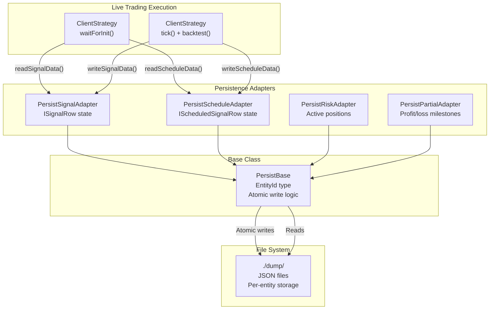
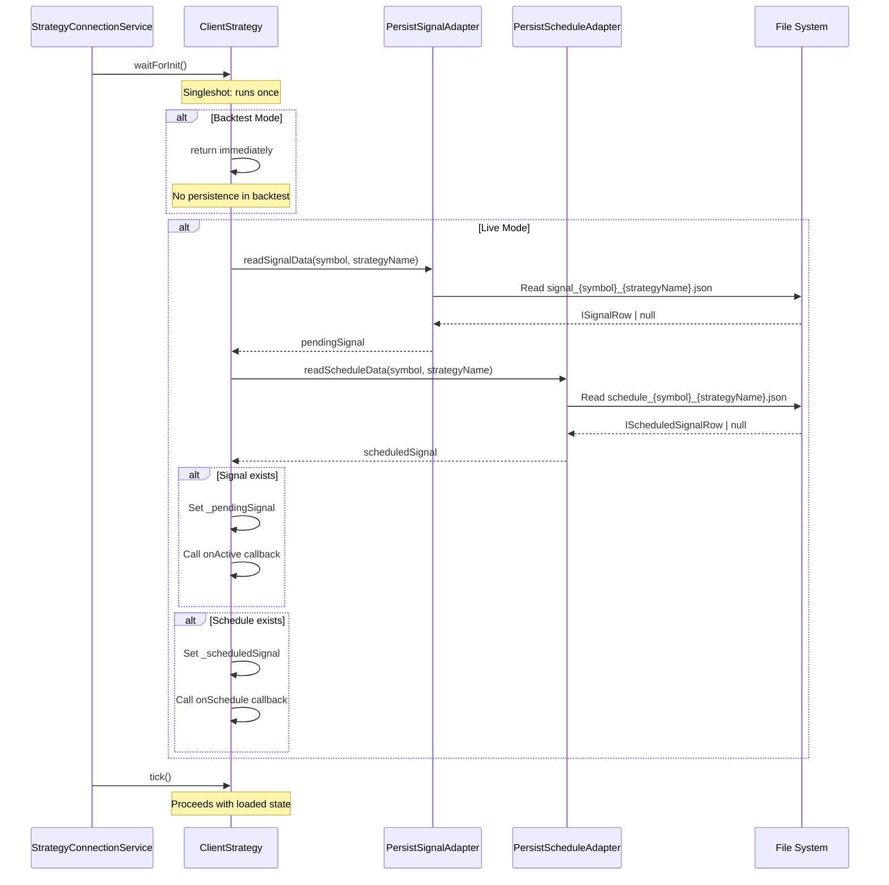
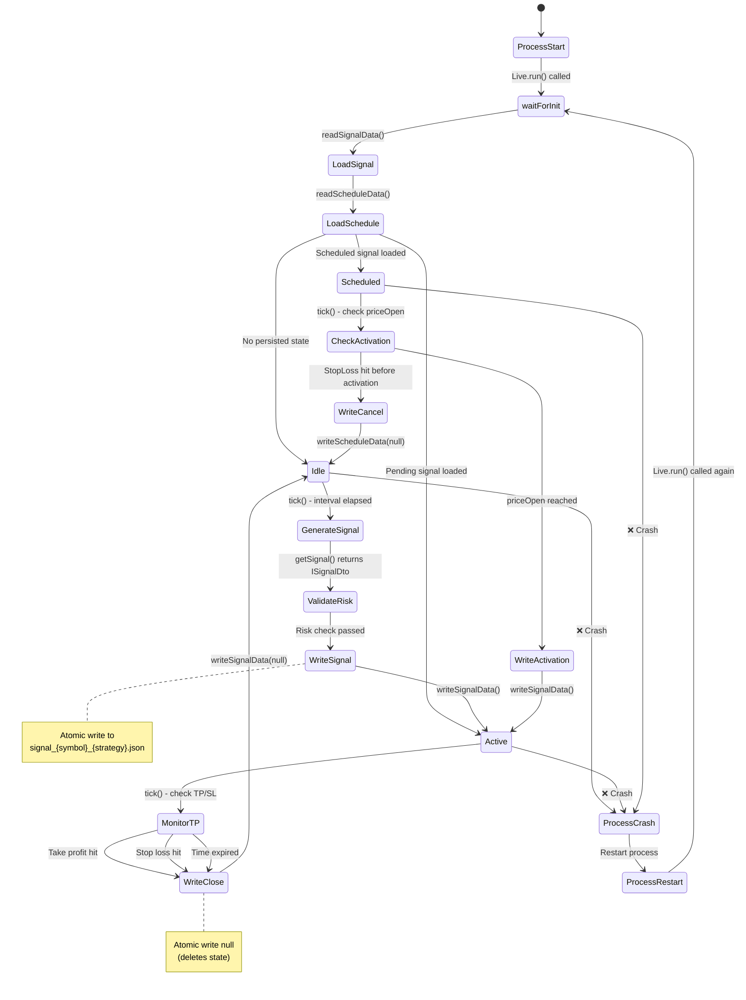
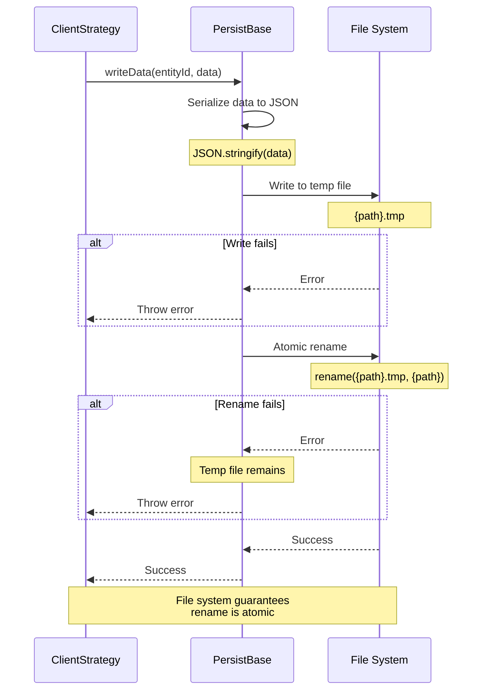
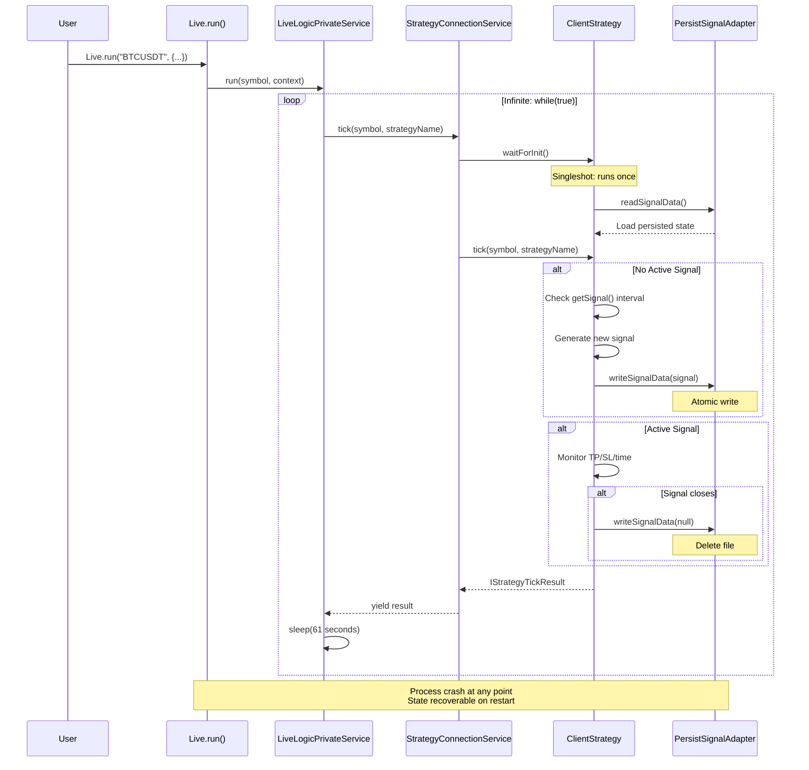
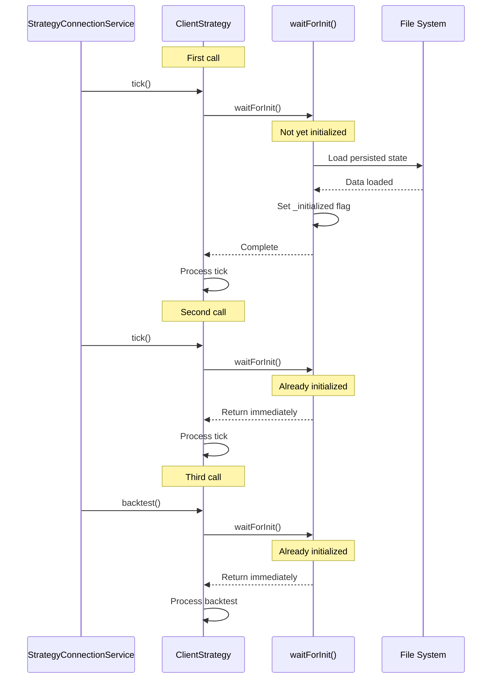

# Crash Recovery and Persistence

# Crash Recovery and Persistence

<details>
<summary>Relevant source files</summary>

The following files were used as context for generating this wiki page:

- [assets/uml.svg](assets/uml.svg)
- [docs/classes/WalkerCommandService.md](docs/classes/WalkerCommandService.md)
- [docs/interfaces/BacktestStatistics.md](docs/interfaces/BacktestStatistics.md)
- [docs/interfaces/IStrategyCallbacks.md](docs/interfaces/IStrategyCallbacks.md)
- [docs/interfaces/LiveStatistics.md](docs/interfaces/LiveStatistics.md)
- [docs/internals.md](docs/internals.md)
- [docs/types/IStrategyTickResult.md](docs/types/IStrategyTickResult.md)
- [docs/uml.puml](docs/uml.puml)
- [scripts/uml.mjs](scripts/uml.mjs)
- [src/client/ClientStrategy.ts](src/client/ClientStrategy.ts)
- [src/config/emitters.ts](src/config/emitters.ts)
- [src/function/event.ts](src/function/event.ts)
- [src/index.ts](src/index.ts)
- [src/interfaces/Strategy.interface.ts](src/interfaces/Strategy.interface.ts)
- [src/lib/services/connection/StrategyConnectionService.ts](src/lib/services/connection/StrategyConnectionService.ts)
- [types.d.ts](types.d.ts)

</details>


## Purpose and Scope

This document describes the crash recovery and persistence system that enables crash-safe live trading in backtest-kit. The persistence layer ensures that active trading signals, scheduled signals, risk state, and partial profit/loss tracking survive process crashes and restarts. For information about live trading execution modes, see [5.2 Live Trading Mode](./18-live-trading-mode.md). For details on risk management state, see [4.3 Risk Management](./14-risk-management.md).

The persistence system uses atomic file writes to guarantee data consistency and a `waitForInit()` pattern for state recovery on startup. All persistence adapters extend `PersistBase` and can be replaced with custom implementations for alternative storage backends (Redis, MongoDB, etc.).

---

## Crash Recovery Architecture

The crash recovery system follows a **persist-and-restart** architecture where the process is stateless and all critical state is written to disk immediately after each state change. This ensures that if the process crashes at any moment, the state can be fully recovered on restart.

**Key Design Principles:**

| Principle | Implementation | Benefit |
|-----------|---------------|---------|
| **Stateless Process** | All state written to disk immediately | Process can crash and restart without data loss |
| **Atomic Writes** | Write to temp file, then rename | File system guarantees consistency |
| **Singleshot Init** | `waitForInit()` runs exactly once per strategy | State loaded once, cached in memory |
| **JSON Serialization** | Human-readable files in `./dump/` | Easy debugging and manual recovery |
| **Per-Symbol-Strategy Isolation** | Separate files per symbol:strategy pair | Independent recovery per trading pair |

**Sources:** [docs/internals.md:26](), [docs/internals.md:38](), [docs/internals.md:50]()

---

## Persistence Layer Architecture



**Persistence Flow:**
1. **On Startup:** `ClientStrategy.waitForInit()` calls `readSignalData()` and `readScheduleData()` to load persisted state
2. **On State Change:** `setPendingSignal()` and `setScheduledSignal()` call `writeSignalData()` and `writeScheduleData()`
3. **Atomic Write:** `PersistBase` writes to temp file, then atomically renames to final filename
4. **Recovery:** On restart, `waitForInit()` loads last known state from disk

**Sources:** [src/client/ClientStrategy.ts:28](), [src/client/ClientStrategy.ts:491-552](), [types.d.ts:163-176]()

---

## Persistence Adapters

The framework includes four persistence adapters for different state types:

| Adapter | Entity Type | Purpose | File Pattern |
|---------|-------------|---------|--------------|
| **PersistSignalAdapter** | `SignalData` (ISignalRow) | Active pending signal per symbol:strategy | `signal_{symbol}_{strategyName}.json` |
| **PersistScheduleAdapter** | `ScheduleData` (IScheduledSignalRow) | Scheduled signal awaiting activation | `schedule_{symbol}_{strategyName}.json` |
| **PersistRiskAdapter** | `RiskData` (active positions) | Risk state for position tracking | `risk_{symbol}_{riskName}.json` |
| **PersistPartialAdapter** | `PartialData` (profit/loss levels) | Partial milestone tracking per signal | `partial_{symbol}.json` |

**Key Characteristics:**
- All adapters extend `PersistBase<TEntityId, TData>`
- Use `EntityId` helper type for type-safe identifiers
- Store data as JSON for human-readable debugging
- Support `null` data to represent "no active state"

**Sources:** [types.d.ts:163-176](), [src/index.ts:162-176]()

---

## PersistBase Base Class

All persistence adapters extend `PersistBase`, which provides the core atomic write functionality and file system abstraction.

**Generic Type Parameters:**
- `TEntityId`: Type for entity identifier (e.g., `{ symbol: string, strategyName: string }`)
- `TData`: Type for persisted data structure (e.g., `ISignalRow | null`)

**Core Methods:**

| Method | Purpose | Behavior |
|--------|---------|----------|
| `readData(entityId)` | Load persisted state | Returns `null` if file doesn't exist |
| `writeData(entityId, data)` | Save state atomically | Writes to temp file, then renames |
| `getFilePath(entityId)` | Generate file path | Abstract method for subclass implementation |

**Atomic Write Implementation:**
1. Serialize data to JSON string
2. Write JSON to temporary file (`path.tmp`)
3. Atomically rename temp file to final path
4. File system guarantees rename is atomic (crash-safe)

**Sources:** [types.d.ts:166-167](), [src/index.ts:165-167]()

---

## State Recovery with waitForInit

The `waitForInit()` method is called once per `ClientStrategy` instance before any tick operations. It uses the **singleshot pattern** from `functools-kit` to ensure initialization happens exactly once, even if called multiple times.

### waitForInit Implementation



**Key Implementation Details:**

[src/client/ClientStrategy.ts:491-552]()

```typescript
const WAIT_FOR_INIT_FN = async (self: ClientStrategy) => {
  self.params.logger.debug("ClientStrategy waitForInit");
  if (self.params.execution.context.backtest) {
    return;  // No persistence in backtest mode
  }

  // Restore pending signal
  const pendingSignal = await PersistSignalAdapter.readSignalData(
    self.params.execution.context.symbol,
    self.params.strategyName,
  );
  if (pendingSignal) {
    // Validate schema names match
    if (pendingSignal.exchangeName !== self.params.method.context.exchangeName) {
      return;
    }
    if (pendingSignal.strategyName !== self.params.method.context.strategyName) {
      return;
    }
    self._pendingSignal = pendingSignal;

    // Call onActive callback for restored signal
    if (self.params.callbacks?.onActive) {
      const currentPrice = await self.params.exchange.getAveragePrice(
        self.params.execution.context.symbol
      );
      self.params.callbacks.onActive(
        self.params.execution.context.symbol,
        pendingSignal,
        currentPrice,
        self.params.execution.context.backtest
      );
    }
  }

  // Restore scheduled signal
  const scheduledSignal = await PersistScheduleAdapter.readScheduleData(
    self.params.execution.context.symbol,
    self.params.strategyName,
  );
  // Similar validation and restoration logic...
};
```

**Validation Checks:**
- `exchangeName` must match current strategy configuration
- `strategyName` must match current strategy configuration
- Prevents loading state from different strategy configurations

**Sources:** [src/client/ClientStrategy.ts:491-552](), [src/lib/services/connection/StrategyConnectionService.ts:216](), [src/lib/services/connection/StrategyConnectionService.ts:252]()

---

## Signal State Persistence Flow



**Persistence Triggers:**

| Event | Method Call | Persisted State | File Operation |
|-------|-------------|-----------------|----------------|
| **Signal opened** | `setPendingSignal(signal)` | `ISignalRow` | Write `signal_*.json` |
| **Signal closed** | `setPendingSignal(null)` | `null` | Delete file |
| **Scheduled created** | `setScheduledSignal(signal)` | `IScheduledSignalRow` | Write `schedule_*.json` |
| **Scheduled activated** | `setScheduledSignal(null)` | `null` | Delete file |
| **Scheduled cancelled** | `setScheduledSignal(null)` | `null` | Delete file |

**Sources:** [src/client/ClientStrategy.ts:28](), [src/client/ClientStrategy.ts:498-552]()

---

## File System Structure

Persistence files are stored in the `./dump/` directory relative to the process working directory. Each file is named using a pattern that uniquely identifies the entity.

### File Naming Patterns

| Adapter | File Pattern | Example |
|---------|--------------|---------|
| **PersistSignalAdapter** | `signal_{symbol}_{strategyName}.json` | `signal_BTCUSDT_my-strategy.json` |
| **PersistScheduleAdapter** | `schedule_{symbol}_{strategyName}.json` | `schedule_BTCUSDT_my-strategy.json` |
| **PersistRiskAdapter** | `risk_{symbol}_{riskName}.json` | `risk_BTCUSDT_max-3-positions.json` |
| **PersistPartialAdapter** | `partial_{symbol}.json` | `partial_BTCUSDT.json` |

### Directory Structure Example

```
./dump/
├── signal_BTCUSDT_ma-crossover.json
├── signal_ETHUSDT_ma-crossover.json
├── schedule_BTCUSDT_limit-entry.json
├── risk_BTCUSDT_portfolio-risk.json
├── partial_BTCUSDT.json
└── partial_ETHUSDT.json
```

### Signal File Format

**Active Signal Example:**
```json
{
  "id": "a1b2c3d4-e5f6-7890-abcd-ef1234567890",
  "symbol": "BTCUSDT",
  "strategyName": "ma-crossover",
  "exchangeName": "binance",
  "position": "long",
  "priceOpen": 50000.00,
  "priceTakeProfit": 52000.00,
  "priceStopLoss": 49000.00,
  "minuteEstimatedTime": 1440,
  "scheduledAt": 1704067200000,
  "pendingAt": 1704067200000,
  "_isScheduled": false,
  "note": "MA crossover detected"
}
```

**Null State (No Active Signal):**
- File is deleted when signal closes
- `readSignalData()` returns `null` if file doesn't exist

**Sources:** [src/client/ClientStrategy.ts:498-552]()

---

## Atomic Write Pattern

The atomic write pattern ensures that persistence files are never corrupted, even if the process crashes during a write operation.

### Atomic Write Sequence



**Why Atomic Renames Are Crash-Safe:**

| Scenario | File System Behavior | Result |
|----------|---------------------|--------|
| **Crash during JSON write** | Temp file incomplete | Original file untouched, old state preserved |
| **Crash during rename** | Rename completes or fails atomically | Either old or new state, never corrupted |
| **Crash after rename** | Rename already completed | New state persisted successfully |

**File System Guarantees:**
- POSIX `rename()` is atomic on the same file system
- Either the old filename or new filename exists, never both
- No partial writes visible to readers
- Crash at any point leaves file system in consistent state

**Sources:** [docs/internals.md:38](), [docs/internals.md:50]()

---

## Integration with Live Mode

The persistence system is tightly integrated with Live mode execution to ensure crash-safe trading.

### Live Mode Execution with Persistence



**Crash Recovery Scenarios:**

| Crash Point | Persisted State | Recovery Behavior |
|-------------|-----------------|-------------------|
| **Before signal open** | No active signal | Starts idle, waits for next signal |
| **After signal open** | `ISignalRow` persisted | Loads active signal, continues monitoring |
| **During TP/SL check** | Active signal preserved | Resumes monitoring from last tick |
| **After signal close** | `null` (file deleted) | Starts idle, ready for new signal |
| **Scheduled signal waiting** | `IScheduledSignalRow` persisted | Continues waiting for activation |

**Sleep Interval and Persistence:**
- Live mode sleeps 61 seconds between ticks (`TICK_TTL`)
- Persistence happens **before** sleep, ensuring state is saved
- If crash occurs during sleep, state already persisted
- On restart, `waitForInit()` loads last known state

**Sources:** [src/client/ClientStrategy.ts:491-552](), [src/lib/services/connection/StrategyConnectionService.ts:216](), [docs/internals.md:68-81]()

---

## Extending with Custom Storage Backends

The persistence system is designed to be extensible. All adapters extend `PersistBase`, which can be subclassed for custom storage implementations.

### Custom Adapter Implementation

To implement a custom persistence backend (e.g., Redis, MongoDB, PostgreSQL):

1. **Extend PersistBase:**
   - Implement `getFilePath()` for entity identification
   - Override `readData()` and `writeData()` for custom storage logic

2. **Example: Redis Adapter**

```typescript
// Custom Redis-based persistence adapter
class PersistSignalRedisAdapter extends PersistBase<
  { symbol: string; strategyName: string },
  SignalData
> {
  private redis: Redis;
  
  constructor(redis: Redis) {
    super();
    this.redis = redis;
  }
  
  // Generate Redis key instead of file path
  protected getFilePath(entityId: { symbol: string; strategyName: string }): string {
    return `signal:${entityId.symbol}:${entityId.strategyName}`;
  }
  
  // Override to use Redis GET
  async readData(entityId: { symbol: string; strategyName: string }): Promise<SignalData | null> {
    const key = this.getFilePath(entityId);
    const json = await this.redis.get(key);
    if (!json) return null;
    return JSON.parse(json);
  }
  
  // Override to use Redis SET
  async writeData(
    entityId: { symbol: string; strategyName: string },
    data: SignalData | null
  ): Promise<void> {
    const key = this.getFilePath(entityId);
    if (data === null) {
      await this.redis.del(key);
    } else {
      await this.redis.set(key, JSON.stringify(data));
    }
  }
}
```

3. **Replace Default Adapter:**
   - Import custom adapter in strategy configuration
   - Use custom adapter methods instead of default `PersistSignalAdapter`

**Custom Backend Considerations:**

| Backend | Atomicity | Durability | Latency | Use Case |
|---------|-----------|------------|---------|----------|
| **File System** | ✅ Atomic rename | ✅ Disk-backed | Low | Default, simple setup |
| **Redis** | ✅ Single-op atomic | ⚠️ Optional persistence | Very low | High-frequency trading |
| **MongoDB** | ✅ Single-doc atomic | ✅ Replicated | Medium | Multi-region deployments |
| **PostgreSQL** | ✅ ACID transactions | ✅ ACID | Medium | Complex queries, auditing |

**Sources:** [types.d.ts:166-167](), [src/index.ts:165-167]()

---

## Singleshot Initialization Pattern

The `waitForInit()` method uses the **singleshot pattern** from `functools-kit` to ensure initialization runs exactly once per instance, even if called multiple times.

### Singleshot Behavior



**Implementation Pattern:**
- `waitForInit()` wrapped with `singleshot()` from `functools-kit`
- First call executes full initialization
- Subsequent calls return cached result immediately
- No race conditions even with concurrent calls
- Memory efficient: state loaded once, reused

**Benefits:**

| Benefit | Description |
|---------|-------------|
| **Performance** | Avoid repeated file I/O operations |
| **Consistency** | State loaded once, immutable across execution |
| **Thread Safety** | `singleshot()` handles concurrent calls safely |
| **Memory Efficiency** | Single copy of state in memory |

**Sources:** [src/client/ClientStrategy.ts:491-552](), [docs/internals.md:49]()

---

## Best Practices

### Persistence Best Practices

1. **Always Use Atomic Writes:**
   - Never write directly to final file path
   - Always write to temp file, then rename
   - Prevents corrupted state on crash

2. **Validate Loaded State:**
   - Check `exchangeName` and `strategyName` match current config
   - Ignore state from different strategies
   - Prevents loading incompatible state

3. **Handle Null State:**
   - `null` means "no active state"
   - Don't throw errors on missing files
   - Treat missing file as `null` state

4. **Monitor Disk Space:**
   - Each symbol:strategy pair creates files
   - Clean up old files periodically
   - Implement file rotation for long-running systems

5. **Test Crash Scenarios:**
   - Simulate crashes at different execution points
   - Verify state recovers correctly
   - Test with concurrent symbol:strategy pairs

### Recovery Best Practices

1. **Graceful Shutdown:**
   - Use `Live.background()` with cancellation
   - Wait for `doneLiveSubject` event
   - Ensures final state persisted before exit

2. **Monitor Recovery:**
   - Log `waitForInit()` results
   - Track which signals are recovered
   - Alert on unexpected state changes

3. **Version State Format:**
   - Include version field in persisted data
   - Handle migration on format changes
   - Maintain backward compatibility

**Sources:** [src/client/ClientStrategy.ts:491-552](), [docs/internals.md:26]()