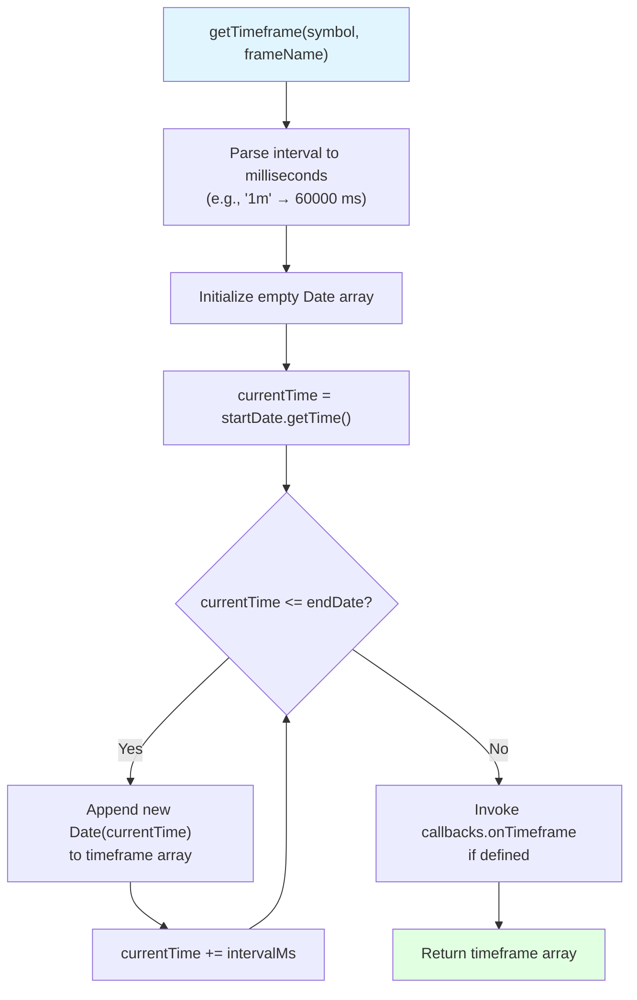
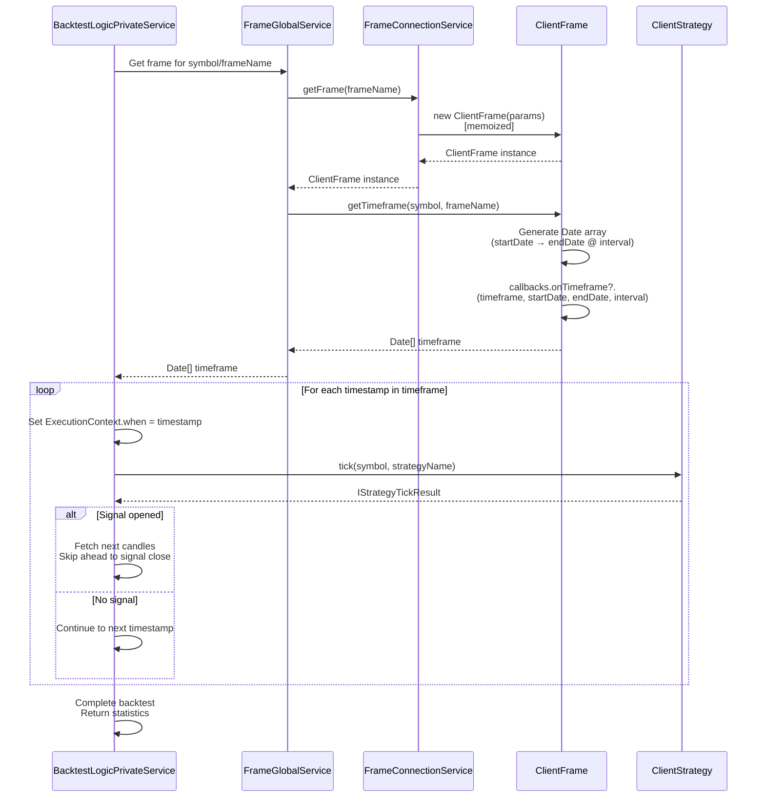
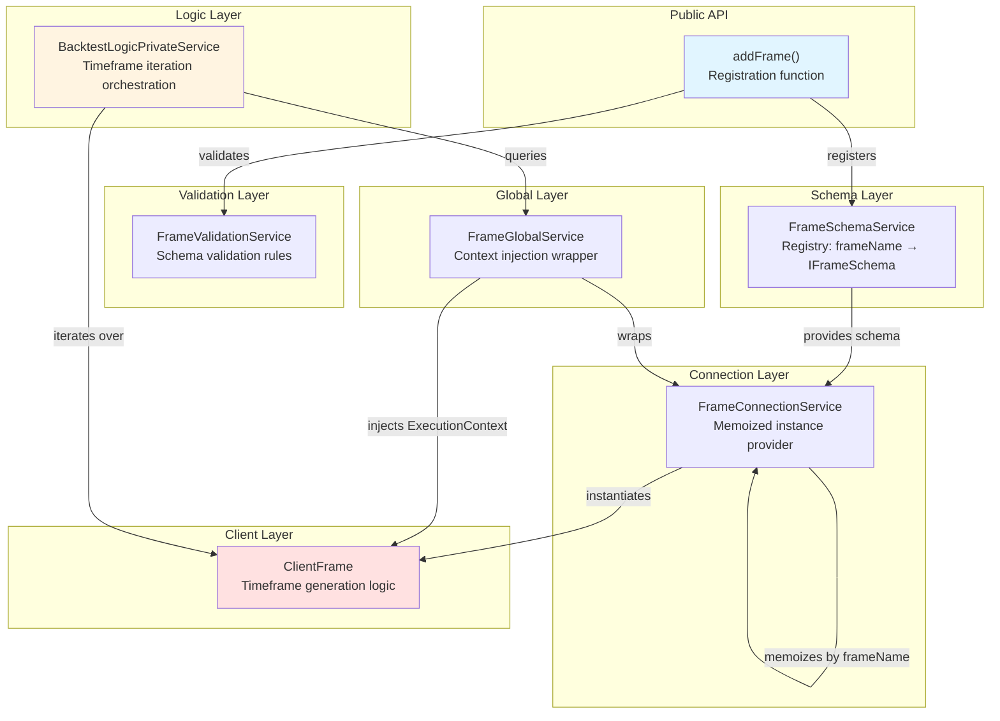

# ClientFrame

## Purpose and Scope

This document describes `ClientFrame`, the timeframe generator component responsible for creating arrays of `Date` objects for backtest execution. ClientFrame converts a date range (`startDate`, `endDate`) and a time interval (e.g., `"1m"`, `"1h"`) into a chronologically ordered sequence of timestamps that the backtest engine uses to simulate historical trading.

For configuration schemas and registration patterns, see [Frame Schemas](#5.3). For how the generated timeframes are consumed during backtest execution, see [Backtesting](#9).

**Sources:** [types.d.ts:323-398]()

---

## Component Overview

ClientFrame implements the `IFrame` interface and provides a single primary method: `getTimeframe()`. This method performs date arithmetic to generate a complete array of tick timestamps spanning the configured period at the specified interval granularity.

The component is instantiated by `FrameConnectionService` with memoization, ensuring that each unique `frameName` receives a single reusable instance. The `FrameGlobalService` orchestrates context injection and provides the bridge between the backtest orchestration layer and the frame instances.

**Key Responsibilities:**
- Parse `startDate` and `endDate` boundaries
- Calculate millisecond offsets for each `FrameInterval` type
- Generate chronologically ordered `Date` array
- Invoke `onTimeframe` callback with generated timestamps
- Validate configuration parameters (interval, date range)

**Sources:** [types.d.ts:366-398]()

---

## Frame Configuration

### IFrameSchema

The frame schema defines the complete configuration for timeframe generation:

| Field | Type | Required | Description |
|-------|------|----------|-------------|
| `frameName` | `FrameName` | Yes | Unique identifier for this frame configuration |
| `interval` | `FrameInterval` | Yes | Time interval between consecutive timestamps |
| `startDate` | `Date` | Yes | Start of backtest period (inclusive) |
| `endDate` | `Date` | Yes | End of backtest period (inclusive) |
| `note` | `string` | No | Optional documentation string |
| `callbacks` | `Partial<IFrameCallbacks>` | No | Optional lifecycle event handlers |

**Sources:** [types.d.ts:366-379]()

### FrameInterval Types

ClientFrame supports the following interval granularities:

```
Minutes: "1m", "3m", "5m", "15m", "30m"
Hours:   "1h", "2h", "4h", "6h", "8h", "12h"
Days:    "1d", "3d"
```

Each interval string is internally converted to milliseconds for date arithmetic. For example:
- `"1m"` → 60,000 ms
- `"1h"` → 3,600,000 ms
- `"1d"` → 86,400,000 ms

**Sources:** [types.d.ts:323]()

### IFrameParams

The runtime parameters passed to ClientFrame constructor extend the schema with dependency injection:

```typescript
interface IFrameParams extends IFrameSchema {
  logger: ILogger;
}
```

The `logger` instance is provided by the dependency injection container and used for debugging timeframe generation operations.

**Sources:** [types.d.ts:328-331]()

---

## Timeframe Generation Process

### getTimeframe Method



**Algorithm Steps:**

1. **Interval Conversion:** Convert `FrameInterval` string to milliseconds using a lookup table
2. **Boundary Extraction:** Extract Unix timestamps from `startDate` and `endDate`
3. **Iteration:** Starting from `startDate`, increment by `intervalMs` until exceeding `endDate`
4. **Date Construction:** Create new `Date` object for each timestamp and append to result array
5. **Callback Invocation:** If `callbacks.onTimeframe` is defined, invoke it with the complete array
6. **Return:** Return the chronologically ordered `Date[]` array

**Edge Cases Handled:**
- Empty range (startDate ≥ endDate): Returns empty array
- Non-standard intervals: Logs warning and uses default interval
- Invalid dates: Throws validation error during schema registration

**Sources:** [types.d.ts:384-393]()

---

## Integration with Backtest Engine

### Backtest Orchestration Flow



**Key Integration Points:**

1. **FrameGlobalService:** Wraps ClientFrame with ExecutionContext injection (symbol, when, backtest=true)
2. **Memoization:** FrameConnectionService caches ClientFrame instances by `frameName` to avoid redundant instantiation
3. **Sequential Iteration:** BacktestLogicPrivateService iterates through the timeframe array, setting `ExecutionContext.when` for each timestamp
4. **Skip-Ahead Optimization:** When a signal opens, the backtest engine skips intermediate timeframes until signal closure, then resumes iteration

**Sources:** [types.d.ts:384-393]()

---

## Callbacks

### onTimeframe Callback

The `IFrameCallbacks` interface defines a single optional callback invoked after timeframe generation:

```typescript
interface IFrameCallbacks {
  onTimeframe: (
    timeframe: Date[],
    startDate: Date,
    endDate: Date,
    interval: FrameInterval
  ) => void;
}
```

**Use Cases:**
- Logging the number of generated timestamps for debugging
- Validating that the generated timeframe matches expectations
- Storing timeframe metadata for reporting purposes
- Monitoring timeframe generation performance

**Invocation Timing:**
- Called synchronously after the `Date[]` array is fully constructed
- Invoked before `getTimeframe()` returns to the caller
- Not called if timeframe generation fails with an error

**Example:**

```typescript
addFrame({
  frameName: "2024-jan-1m",
  interval: "1m",
  startDate: new Date("2024-01-01T00:00:00Z"),
  endDate: new Date("2024-01-02T00:00:00Z"),
  callbacks: {
    onTimeframe: (timeframe, startDate, endDate, interval) => {
      console.log(`Generated ${timeframe.length} timestamps`);
      console.log(`First: ${timeframe[0].toISOString()}`);
      console.log(`Last: ${timeframe[timeframe.length - 1].toISOString()}`);
    }
  }
});
```

**Sources:** [types.d.ts:335-346]()

---

## Service Architecture Context

### Frame Service Hierarchy



**Layer Descriptions:**

- **FrameSchemaService:** Maintains the registry mapping `frameName → IFrameSchema`
- **FrameValidationService:** Validates schema fields (dates, interval, frameName uniqueness)
- **FrameConnectionService:** Creates and memoizes ClientFrame instances, keyed by `frameName`
- **FrameGlobalService:** Provides ExecutionContext-aware access to frame instances
- **ClientFrame:** Implements the actual timeframe generation algorithm
- **BacktestLogicPrivateService:** Consumes generated timeframes for backtest orchestration

**Sources:** [types.d.ts:323-398]()

---

## Configuration Examples

### Minute-Level Backtest

```typescript
addFrame({
  frameName: "btc-day-1m",
  interval: "1m",
  startDate: new Date("2024-01-01T00:00:00Z"),
  endDate: new Date("2024-01-01T23:59:00Z"),
  note: "Full day of 1-minute candles for BTC",
  callbacks: {
    onTimeframe: (timeframe) => {
      // Expected: 1440 timestamps (24h * 60m)
      console.log(`Generated ${timeframe.length} 1m timestamps`);
    }
  }
});
```

**Expected Output:** 1440 timestamps (24 hours × 60 minutes)

**Sources:** [types.d.ts:366-379]()

### Multi-Week Hourly Backtest

```typescript
addFrame({
  frameName: "btc-month-1h",
  interval: "1h",
  startDate: new Date("2024-01-01T00:00:00Z"),
  endDate: new Date("2024-01-31T23:00:00Z"),
  note: "January 2024 hourly timeframes"
});
```

**Expected Output:** 744 timestamps (31 days × 24 hours)

**Sources:** [types.d.ts:366-379]()

### Daily Aggregation

```typescript
addFrame({
  frameName: "btc-year-1d",
  interval: "1d",
  startDate: new Date("2023-01-01T00:00:00Z"),
  endDate: new Date("2023-12-31T00:00:00Z"),
  note: "Full year of daily candles"
});
```

**Expected Output:** 365 timestamps (1 per day)

**Sources:** [types.d.ts:366-379]()

---

## Relationship to Other Components

### ClientStrategy Integration

ClientFrame does **not** directly interact with ClientStrategy. The integration is mediated by BacktestLogicPrivateService:

1. BacktestLogicPrivateService retrieves timeframe from ClientFrame via FrameGlobalService
2. BacktestLogicPrivateService iterates through timeframe timestamps
3. For each timestamp, BacktestLogicPrivateService sets `ExecutionContext.when`
4. BacktestLogicPrivateService calls `ClientStrategy.tick()` with the current timestamp

This separation ensures that ClientFrame remains a pure timeframe generator without strategy execution concerns.

**Sources:** [types.d.ts:384-393]()

### ClientExchange Integration

ClientFrame generates the timestamps that ClientExchange uses to fetch historical candles:

- When `ClientStrategy.tick()` is called at timestamp `T`, `ClientExchange.getCandles()` fetches candles **backward** from `T`
- When a signal opens, `ClientExchange.getNextCandles()` fetches candles **forward** from `T` for backtesting
- The interval used by ClientExchange (`CandleInterval`) is independent of the frame interval (`FrameInterval`)

For example:
- Frame interval: `"1h"` (tick every hour)
- Candle interval: `"1m"` (fetch 1-minute candles for VWAP calculation)

**Sources:** [types.d.ts:323](), [types.d.ts:186]()

---

## Type Definitions

### FrameName

```typescript
type FrameName = string;
```

Unique identifier for a registered frame schema. Used as the key in FrameSchemaService registry and for memoization in FrameConnectionService.

**Sources:** [types.d.ts:398]()

### IFrame Interface

```typescript
interface IFrame {
  getTimeframe: (symbol: string, frameName: FrameName) => Promise<Date[]>;
}
```

The core interface implemented by ClientFrame. The `symbol` parameter is included for API consistency but typically unused in timeframe generation (timeframes are symbol-agnostic).

**Sources:** [types.d.ts:384-393]()

---

## Summary

ClientFrame is a focused utility component that converts date ranges and time intervals into ordered arrays of timestamps for backtest execution. Its design emphasizes:

- **Simplicity:** Single-purpose component with minimal dependencies
- **Reusability:** Memoized instances shared across backtest runs
- **Composability:** Clean integration with FrameGlobalService and BacktestLogicPrivateService
- **Testability:** Pure function behavior (same inputs → same outputs)

The generated timeframes form the temporal backbone of the backtest engine, enabling precise historical simulation at configurable granularities from 1-minute to 3-day intervals.

**Sources:** [types.d.ts:323-398]()