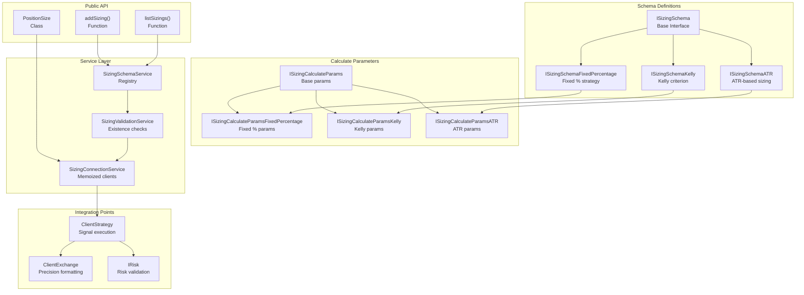
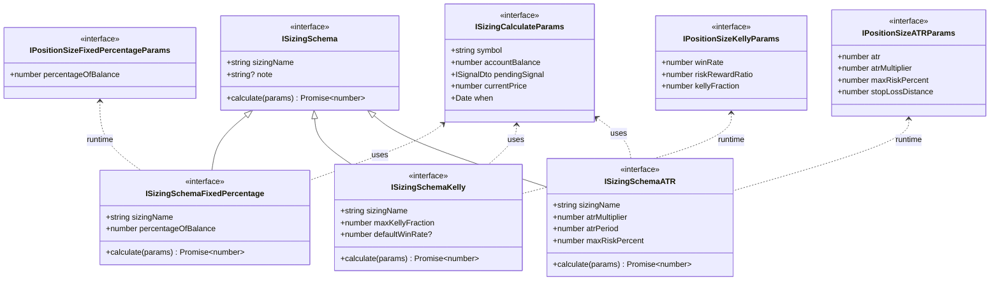
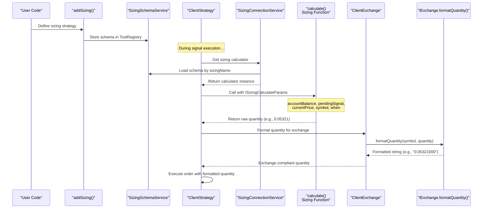
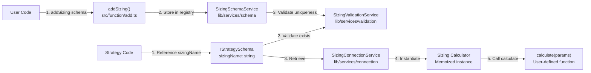

# Position Sizing

## Purpose and Scope

This page documents the position sizing system in Backtest Kit, which calculates the quantity of assets to trade based on account balance, risk parameters, and market conditions. Position sizing strategies include fixed percentage allocation, Kelly criterion, and ATR-based volatility adjustment. For portfolio-level risk constraints and signal validation, see [Risk Management](./31_risk-management.md). For signal generation and lifecycle, see [Signals & Signal Lifecycle](./08_core-concepts.md).

---

## Overview

The position sizing system provides pluggable strategies for determining trade quantities. Each strategy implements a calculation function that takes account balance, risk parameters, signal data, and market conditions as input, then outputs a formatted quantity suitable for order execution.

**Key capabilities:**
- Multiple built-in strategies (FixedPercentage, Kelly, ATR)
- Custom strategy registration via `addSizing()`
- Integration with exchange precision formatting
- Position size analytics and reporting via `PositionSize` class

Sources: [src/index.ts:96-104](), [types.d.ts:1-200]()

---

## Architecture Overview

### Core Components



**Component Responsibilities:**

| Component | Purpose |
|-----------|---------|
| `ISizingSchema` | Base interface defining `sizingName`, `calculate` function, and strategy-specific parameters |
| Strategy schemas | Type-safe definitions for FixedPercentage, Kelly, and ATR strategies |
| Calculate params | Runtime parameters passed to sizing functions (balance, signal, prices, etc.) |
| `SizingSchemaService` | Registry for storing sizing schemas via `ToolRegistry` pattern |
| `SizingValidationService` | Memoized existence checks for sizing schema names |
| `SizingConnectionService` | Memoized factory for creating sizing calculator instances |
| `PositionSize` class | Public API for running calculations and generating reports |

Sources: [src/index.ts:93-104](), [src/index.ts:187](), [types.d.ts:93-104]()

---

## Sizing Strategy Types

### Interface Hierarchy



Sources: [types.d.ts:93-104]()

---

## Strategy Implementations

### Fixed Percentage Strategy

Allocates a fixed percentage of account balance to each trade. The simplest and most common approach.

**Configuration:**

| Parameter | Type | Description |
|-----------|------|-------------|
| `sizingName` | `string` | Unique identifier for this sizing strategy |
| `percentageOfBalance` | `number` | Percentage of account to risk per trade (e.g., 2.0 for 2%) |
| `calculate` | `function` | Function that computes position quantity |

**Calculate Parameters (`ISizingCalculateParamsFixedPercentage`):**

| Parameter | Type | Description |
|-----------|------|-------------|
| `symbol` | `string` | Trading pair (e.g., "BTCUSDT") |
| `accountBalance` | `number` | Current account balance in quote currency |
| `pendingSignal` | `ISignalDto` | Signal with TP/SL prices |
| `currentPrice` | `number` | Current market price (VWAP) |
| `when` | `Date` | Current timestamp |

**Example:**
```typescript
import { addSizing } from 'backtest-kit';

addSizing({
  sizingName: 'fixed-2-percent',
  percentageOfBalance: 2.0,
  calculate: async (params) => {
    const { accountBalance, pendingSignal, currentPrice } = params;
    const { priceOpen = currentPrice, priceStopLoss, position } = pendingSignal;
    
    // Calculate stop loss distance
    const slDistance = position === 'long' 
      ? Math.abs(priceOpen - priceStopLoss) / priceOpen
      : Math.abs(priceStopLoss - priceOpen) / priceOpen;
    
    // Risk amount = balance * percentage / 100
    const riskAmount = accountBalance * (params.percentageOfBalance / 100);
    
    // Quantity = riskAmount / (slDistance * priceOpen)
    const quantity = riskAmount / (slDistance * priceOpen);
    
    return quantity;
  }
});
```

**Calculation Logic:**
1. Determine risk amount: `accountBalance * (percentageOfBalance / 100)`
2. Calculate stop loss distance as percentage: `|priceOpen - priceStopLoss| / priceOpen`
3. Compute quantity: `riskAmount / (slDistance * priceOpen)`

Sources: [types.d.ts:93-104](), [src/index.ts:96-104]()

---

### Kelly Criterion Strategy

Risk-adjusted sizing based on win rate and risk/reward ratio. Maximizes long-term growth rate while accounting for statistical edge.

**Configuration:**

| Parameter | Type | Description |
|-----------|------|-------------|
| `sizingName` | `string` | Unique identifier |
| `maxKellyFraction` | `number` | Cap on Kelly fraction (e.g., 0.25 for quarter-Kelly) |
| `defaultWinRate` | `number?` | Fallback win rate if no historical data available |
| `calculate` | `function` | Kelly calculation function |

**Calculate Parameters (`ISizingCalculateParamsKelly`):**

| Parameter | Type | Description |
|-----------|------|-------------|
| Base params | `ISizingCalculateParams` | Standard sizing params |
| `winRate` | `number` | Historical win rate (0-1) |
| `riskRewardRatio` | `number` | Average reward/risk ratio |
| `kellyFraction` | `number` | Fraction of Kelly to use |

**Kelly Formula:**
```
Kelly % = (winRate * (riskRewardRatio + 1) - 1) / riskRewardRatio
Position Size = accountBalance * min(Kelly %, maxKellyFraction)
```

**Example:**
```typescript
import { addSizing } from 'backtest-kit';

addSizing({
  sizingName: 'kelly-quarter',
  maxKellyFraction: 0.25, // Quarter-Kelly for safety
  defaultWinRate: 0.5,
  calculate: async (params) => {
    const { accountBalance, pendingSignal, currentPrice } = params;
    const { priceOpen = currentPrice, priceTakeProfit, priceStopLoss, position } = pendingSignal;
    
    // Calculate risk/reward ratio
    const reward = position === 'long'
      ? (priceTakeProfit - priceOpen) / priceOpen
      : (priceOpen - priceTakeProfit) / priceOpen;
    const risk = position === 'long'
      ? (priceOpen - priceStopLoss) / priceOpen
      : (priceStopLoss - priceOpen) / priceOpen;
    const rrRatio = reward / risk;
    
    // Kelly calculation
    const winRate = params.winRate || params.defaultWinRate || 0.5;
    const kellyPercent = (winRate * (rrRatio + 1) - 1) / rrRatio;
    const cappedKelly = Math.max(0, Math.min(kellyPercent, params.maxKellyFraction));
    
    // Position size
    const positionValue = accountBalance * cappedKelly;
    const quantity = positionValue / priceOpen;
    
    return quantity;
  }
});
```

**Safety Considerations:**
- Full Kelly is aggressive; use fractional Kelly (0.25-0.5) for reduced volatility
- Cap at `maxKellyFraction` to prevent over-leveraging
- Negative Kelly (no edge) returns 0 position size

Sources: [types.d.ts:93-104]()

---

### ATR-Based Volatility Strategy

Adjusts position size based on Average True Range (ATR), scaling down during high volatility and up during low volatility.

**Configuration:**

| Parameter | Type | Description |
|-----------|------|-------------|
| `sizingName` | `string` | Unique identifier |
| `atrMultiplier` | `number` | Multiplier for ATR stop distance (e.g., 2.0) |
| `atrPeriod` | `number` | Lookback period for ATR calculation (e.g., 14) |
| `maxRiskPercent` | `number` | Maximum % of balance to risk per trade |
| `calculate` | `function` | ATR-based calculation |

**Calculate Parameters (`ISizingCalculateParamsATR`):**

| Parameter | Type | Description |
|-----------|------|-------------|
| Base params | `ISizingCalculateParams` | Standard sizing params |
| `atr` | `number` | Current ATR value |
| `atrMultiplier` | `number` | Stop loss distance = ATR * multiplier |
| `maxRiskPercent` | `number` | Risk cap as percentage |
| `stopLossDistance` | `number` | Calculated stop loss distance |

**Example:**
```typescript
import { addSizing, getCandles } from 'backtest-kit';

addSizing({
  sizingName: 'atr-2x',
  atrMultiplier: 2.0,
  atrPeriod: 14,
  maxRiskPercent: 3.0,
  calculate: async (params) => {
    const { symbol, accountBalance, pendingSignal, currentPrice } = params;
    const { priceOpen = currentPrice, position } = pendingSignal;
    
    // Fetch candles for ATR calculation
    const candles = await getCandles(symbol, '1h', params.atrPeriod + 1);
    
    // Calculate ATR
    let atr = 0;
    for (let i = 1; i < candles.length; i++) {
      const tr = Math.max(
        candles[i].high - candles[i].low,
        Math.abs(candles[i].high - candles[i-1].close),
        Math.abs(candles[i].low - candles[i-1].close)
      );
      atr += tr;
    }
    atr /= params.atrPeriod;
    
    // Stop loss distance based on ATR
    const slDistance = (atr * params.atrMultiplier) / priceOpen;
    
    // Risk amount
    const maxRisk = accountBalance * (params.maxRiskPercent / 100);
    
    // Quantity
    const quantity = maxRisk / (slDistance * priceOpen);
    
    return quantity;
  }
});
```

**Calculation Flow:**
1. Calculate ATR from recent candles
2. Determine stop loss distance: `ATR * atrMultiplier / currentPrice`
3. Calculate max risk: `accountBalance * (maxRiskPercent / 100)`
4. Compute quantity: `maxRisk / (slDistance * priceOpen)`

**Benefits:**
- Automatically reduces position size during volatile markets
- Increases position size during stable markets
- Maintains consistent risk across varying market conditions

Sources: [types.d.ts:93-104](), [src/function/exchange.ts:59]()

---

## Integration with Strategy Execution

### Position Sizing in Signal Lifecycle



**Integration Points:**

1. **Strategy Registration (`addSizing`):**
   - User defines sizing strategy with `sizingName` and `calculate` function
   - `SizingSchemaService` stores schema in `ToolRegistry`

2. **Signal Execution (`ClientStrategy.tick`):**
   - When new signal created, retrieve sizing calculator via `SizingConnectionService`
   - Call `calculate()` with current market conditions
   - Pass raw quantity to `ClientExchange.formatQuantity()`

3. **Exchange Formatting:**
   - Exchange-specific precision rules applied
   - Output complies with exchange lot size requirements

4. **Risk Validation:**
   - Calculated quantity validated against portfolio-level risk limits
   - See [Portfolio-Wide Limits](./31_risk-management.md) for risk integration

Sources: [src/index.ts:17](), [src/function/exchange.ts:63-65]()

---

## Public API Usage

### Registering a Sizing Strategy



**Method: `addSizing(schema: ISizingSchema)`**

Registers a position sizing strategy for use in trading strategies.

**Parameters:**

| Parameter | Type | Required | Description |
|-----------|------|----------|-------------|
| `schema.sizingName` | `string` | Yes | Unique identifier for this sizing strategy |
| `schema.note` | `string` | No | Optional documentation/description |
| `schema.calculate` | `function` | Yes | Position size calculation function |
| Strategy params | varies | Yes | Strategy-specific parameters (e.g., `percentageOfBalance`) |

**Example:**
```typescript
import { addSizing } from 'backtest-kit';

// Register fixed percentage strategy
addSizing({
  sizingName: 'conservative-1pct',
  note: 'Conservative 1% risk per trade',
  percentageOfBalance: 1.0,
  calculate: async (params) => {
    // Implementation...
    return quantity;
  }
});
```

Sources: [src/function/add.ts:17](), [src/index.ts:96-104]()

---

### Using Sizing in Strategies

Strategies reference sizing by `sizingName` in their schema definition:

```typescript
import { addStrategy, addSizing } from 'backtest-kit';

// 1. Define sizing strategy
addSizing({
  sizingName: 'kelly-conservative',
  maxKellyFraction: 0.25,
  defaultWinRate: 0.55,
  calculate: async (params) => {
    // Kelly calculation...
    return quantity;
  }
});

// 2. Reference in strategy schema
addStrategy({
  strategyName: 'my-strategy',
  interval: '5m',
  sizingName: 'kelly-conservative', // Link to sizing strategy
  getSignal: async (symbol, when) => {
    // Signal generation...
    return signal;
  }
});
```

**Execution Flow:**
1. Strategy schema includes `sizingName` reference
2. During signal execution, `ClientStrategy` validates sizing exists
3. `SizingConnectionService` retrieves calculator instance (memoized)
4. `calculate()` called with current market context
5. Returned quantity formatted and used for order execution

Sources: [src/index.ts:11-17](), [types.d.ts:728-747]()

---

### Listing Available Strategies

**Method: `listSizings(): string[]`**

Returns array of all registered sizing strategy names.

```typescript
import { addSizing, listSizings } from 'backtest-kit';

addSizing({
  sizingName: 'fixed-2pct',
  percentageOfBalance: 2.0,
  calculate: async (params) => { /* ... */ }
});

addSizing({
  sizingName: 'kelly-quarter',
  maxKellyFraction: 0.25,
  calculate: async (params) => { /* ... */ }
});

const sizings = listSizings();
console.log(sizings); // ['fixed-2pct', 'kelly-quarter']
```

Sources: [src/function/list.ts:23-25]()

---

## PositionSize Class - Reporting & Analytics

The `PositionSize` class provides methods for calculating position sizes across multiple scenarios and generating reports.

**Class: `PositionSize`**

```typescript
class PositionSize {
  static run(symbol: string, options: {...}): AsyncIterableIterator<...>
  static background(symbol: string, options: {...}): void
  static getData(symbol: string, sizingName: string): Promise<...>
  static getReport(symbol: string, sizingName: string, columns?: ...): string
  static dump(symbol: string, sizingName: string, filePath?: string): Promise<void>
  static stop(symbol: string, sizingName: string): void
}
```

### Running Position Size Calculations

**Method: `PositionSize.run(symbol, options)`**

Runs position size calculations for a range of scenarios (account balances, signal prices, etc.).

```typescript
import { PositionSize } from 'backtest-kit';

for await (const result of PositionSize.run('BTCUSDT', {
  sizingName: 'kelly-quarter',
  exchangeName: 'binance',
  accountBalances: [10000, 50000, 100000], // Test different balances
  currentPrices: [30000, 35000, 40000],    // Test different prices
})) {
  console.log(`Balance: $${result.accountBalance}`);
  console.log(`Price: $${result.currentPrice}`);
  console.log(`Quantity: ${result.quantity}`);
  console.log(`Position Value: $${result.positionValue}`);
}
```

**Method: `PositionSize.background(symbol, options)`**

Runs calculations in the background, emitting events for monitoring.

```typescript
import { PositionSize, listenPerformance } from 'backtest-kit';

listenPerformance((event) => {
  console.log(`Calculation took ${event.duration}ms`);
});

PositionSize.background('BTCUSDT', {
  sizingName: 'atr-2x',
  exchangeName: 'binance',
  accountBalances: [10000, 25000, 50000],
});
```

Sources: [src/classes/PositionSize:1-100]()

---

### Generating Reports

**Method: `PositionSize.getData(symbol, sizingName)`**

Returns structured data for position size calculations.

```typescript
const data = await PositionSize.getData('BTCUSDT', 'kelly-quarter');

console.log(data.summary);
// {
//   averageQuantity: 0.1234,
//   medianQuantity: 0.1150,
//   minQuantity: 0.0500,
//   maxQuantity: 0.2000,
//   totalScenarios: 27
// }

console.log(data.scenarios);
// [
//   { accountBalance: 10000, currentPrice: 30000, quantity: 0.1000, ... },
//   { accountBalance: 10000, currentPrice: 35000, quantity: 0.0857, ... },
//   ...
// ]
```

**Method: `PositionSize.getReport(symbol, sizingName, columns?)`**

Generates formatted markdown report.

```typescript
const report = PositionSize.getReport('BTCUSDT', 'kelly-quarter');

console.log(report);
```

**Sample Output:**
```markdown
# Position Size Report: kelly-quarter

Symbol: BTCUSDT
Strategy: kelly-quarter
Generated: 2024-01-15 10:30:00

## Summary Statistics

| Metric | Value |
|--------|-------|
| Average Quantity | 0.1234 BTC |
| Median Quantity | 0.1150 BTC |
| Min Quantity | 0.0500 BTC |
| Max Quantity | 0.2000 BTC |
| Total Scenarios | 27 |

## Scenarios

| Balance | Price | Quantity | Position Value | Risk % |
|---------|-------|----------|----------------|--------|
| $10,000 | $30,000 | 0.1000 | $3,000 | 2.5% |
| $10,000 | $35,000 | 0.0857 | $3,000 | 2.5% |
...
```

**Method: `PositionSize.dump(symbol, sizingName, filePath?)`**

Saves report to file system.

```typescript
await PositionSize.dump('BTCUSDT', 'kelly-quarter', './reports/position-size.md');
// Saves to ./reports/position-size.md
```

Default path: `./dump/position-size/{symbol}_{sizingName}.md`

Sources: [src/classes/PositionSize:1-200]()

---

## Best Practices

### Choosing a Sizing Strategy

| Strategy | Use When | Pros | Cons |
|----------|----------|------|------|
| **Fixed Percentage** | Consistent risk tolerance, simple execution | Easy to understand, predictable | Doesn't adapt to market conditions |
| **Kelly Criterion** | Optimizing long-term growth, statistical edge available | Mathematically optimal, adjusts to edge | Requires accurate win rate/RR, can be aggressive |
| **ATR-Based** | Volatility-sensitive positioning, trend following | Adapts to volatility, reduces risk in wild markets | Requires ATR calculation, more complex |

### Risk Management Integration

Position sizing works with risk validation:

```typescript
import { addRisk, addSizing } from 'backtest-kit';

// 1. Define position sizing
addSizing({
  sizingName: 'fixed-2pct',
  percentageOfBalance: 2.0,
  calculate: async (params) => { /* ... */ }
});

// 2. Define risk limits that validate position sizes
addRisk({
  riskName: 'portfolio-limits',
  validations: [
    // Max 3 concurrent positions
    ({ activePositionCount }) => {
      if (activePositionCount >= 3) {
        throw new Error('Max 3 positions');
      }
    },
    // Max 6% total portfolio risk
    ({ pendingSignal, currentPrice, activePositions }) => {
      const positionRisk = /* calculate from pendingSignal */;
      const totalRisk = activePositions.reduce((sum, pos) => {
        return sum + /* position risk */;
      }, 0) + positionRisk;
      
      if (totalRisk > 6.0) {
        throw new Error('Total portfolio risk exceeds 6%');
      }
    }
  ]
});

// 3. Use both in strategy
addStrategy({
  strategyName: 'my-strategy',
  sizingName: 'fixed-2pct',
  riskName: 'portfolio-limits',
  getSignal: async (symbol, when) => { /* ... */ }
});
```

**Validation Order:**
1. Signal generated by `getSignal()`
2. Position quantity calculated by sizing strategy
3. Risk validations run with calculated quantity
4. If risk validation fails, signal rejected (see [Signal Validation Pipeline](./31_risk-management.md))

Sources: [types.d.ts:413-426](), [types.d.ts:728-747]()

---

### Testing Sizing Strategies

Use `PositionSize.run()` to test strategies across scenarios:

```typescript
import { PositionSize, addSizing } from 'backtest-kit';

// Define strategy
addSizing({
  sizingName: 'test-strategy',
  calculate: async (params) => {
    // Your calculation...
    return quantity;
  }
});

// Test across scenarios
for await (const result of PositionSize.run('BTCUSDT', {
  sizingName: 'test-strategy',
  exchangeName: 'binance',
  accountBalances: [5000, 10000, 20000, 50000],
  currentPrices: [25000, 30000, 35000, 40000, 45000],
  signalConfigs: [
    { position: 'long', priceOpen: 30000, priceTakeProfit: 33000, priceStopLoss: 29000 },
    { position: 'short', priceOpen: 30000, priceTakeProfit: 27000, priceStopLoss: 31000 },
  ]
})) {
  // Validate results
  console.assert(result.quantity > 0, 'Quantity should be positive');
  console.assert(result.positionValue <= result.accountBalance, 'Position value should not exceed balance');
  
  const riskPercent = (result.quantity * result.stopLossDistance * result.currentPrice) / result.accountBalance * 100;
  console.assert(riskPercent <= 5.0, 'Risk should not exceed 5%');
}
```

Sources: [src/classes/PositionSize:1-100]()

---

## Advanced Topics

### Custom Sizing Strategies

Implement custom strategies by providing a `calculate` function:

```typescript
import { addSizing, getCandles } from 'backtest-kit';

// Volatility-adjusted with Bollinger Bands
addSizing({
  sizingName: 'bollinger-adaptive',
  period: 20,
  stdDevMultiplier: 2.0,
  baseRiskPercent: 2.0,
  calculate: async (params) => {
    const { symbol, accountBalance, pendingSignal, currentPrice, when } = params;
    const { priceOpen = currentPrice, priceStopLoss, position } = pendingSignal;
    
    // Fetch candles
    const candles = await getCandles(symbol, '1h', params.period);
    
    // Calculate Bollinger Bands
    const closes = candles.map(c => c.close);
    const sma = closes.reduce((a, b) => a + b, 0) / closes.length;
    const variance = closes.reduce((sum, c) => sum + Math.pow(c - sma, 2), 0) / closes.length;
    const stdDev = Math.sqrt(variance);
    const upperBand = sma + stdDev * params.stdDevMultiplier;
    const lowerBand = sma - stdDev * params.stdDevMultiplier;
    const bandWidth = (upperBand - lowerBand) / sma;
    
    // Adjust risk based on band width
    // Narrow bands (low volatility) = increase position size
    // Wide bands (high volatility) = decrease position size
    const volatilityFactor = 1 / (1 + bandWidth * 10);
    const adjustedRisk = params.baseRiskPercent * volatilityFactor;
    
    // Calculate position size
    const slDistance = position === 'long'
      ? Math.abs(priceOpen - priceStopLoss) / priceOpen
      : Math.abs(priceStopLoss - priceOpen) / priceOpen;
    
    const riskAmount = accountBalance * (adjustedRisk / 100);
    const quantity = riskAmount / (slDistance * priceOpen);
    
    return quantity;
  }
});
```

**Custom Strategy Considerations:**
- Use `getCandles()` for historical data access
- Respect temporal context (no look-ahead bias)
- Handle edge cases (division by zero, negative values)
- Return 0 for "no position" scenarios
- Consider exchange precision limits

Sources: [src/function/exchange.ts:59-65]()

---

### Multi-Strategy Portfolio Sizing

Coordinate sizing across multiple strategies:

```typescript
import { addRisk, addSizing } from 'backtest-kit';

// Global position sizing coordinator
const portfolioState = {
  allocatedCapital: 0,
  reservedCapital: 0
};

addRisk({
  riskName: 'portfolio-coordinator',
  validations: [
    ({ pendingSignal, currentPrice, activePositions, strategyName }) => {
      // Calculate total allocated capital
      const activeCapital = activePositions.reduce((sum, pos) => {
        return sum + pos.signal.priceOpen * /* position quantity */;
      }, 0);
      
      // Calculate pending position capital
      const pendingCapital = (pendingSignal.priceOpen || currentPrice) * /* calculated quantity */;
      
      // Check total allocation doesn't exceed limit
      const totalAllocation = activeCapital + pendingCapital;
      const accountBalance = 100000; // Get from config
      
      if (totalAllocation > accountBalance * 0.8) {
        throw new Error('Portfolio allocation exceeds 80% limit');
      }
      
      // Reserve capital for this position
      portfolioState.allocatedCapital = totalAllocation;
    }
  ]
});
```

Sources: [types.d.ts:380-396](), [types.d.ts:413-446]()

---

## Summary

The position sizing system provides:

1. **Multiple Strategies** - FixedPercentage, Kelly, ATR-based, and custom implementations
2. **Type-Safe Interfaces** - Separate schemas for each strategy type with compile-time validation
3. **Integration** - Seamless connection to signal execution, risk management, and exchange formatting
4. **Testing & Reporting** - `PositionSize` class for scenario analysis and documentation
5. **Flexibility** - Plugin architecture for custom sizing algorithms

**Related Documentation:**
- [Risk Management](./31_risk-management.md) - Portfolio limits and signal validation
- [Risk Validation Pipeline](./31_risk-management.md) - How sizing interacts with risk checks
- [Signals & Signal Lifecycle](./08_core-concepts.md) - Signal execution flow
- [Exchange Configuration](./36_exchanges-data-sources.md) - Quantity formatting and precision

Sources: [src/index.ts:93-104](), [src/index.ts:187](), [src/function/add.ts:17]()