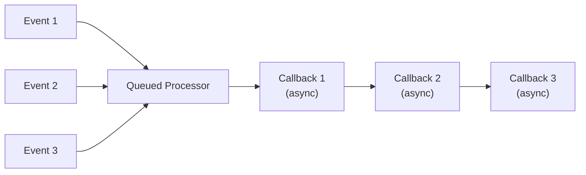
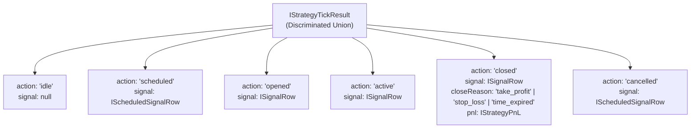

# Event Listeners and Monitoring

This document covers the event listener system for monitoring strategy execution, progress tracking, error handling, and performance metrics. The framework provides 18 event emitters and corresponding listener functions for real-time observation of backtest and live trading operations.

For information about event-driven architecture principles, see [Event-Driven Architecture](./05-event-driven-architecture.md). For crash recovery and persistence, see [Crash Recovery and Persistence](./34-crash-recovery-and-persistence.md).

---

## Event System Architecture

The event system implements a publish-subscribe pattern using `functools-kit` Subject for decoupled communication between components.

### Event Flow Diagram

```mermaid
graph TB
    subgraph Producers["Event Producers"]
        CS["ClientStrategy<br/>(signal lifecycle)"]
        CR["ClientRisk<br/>(rejections)"]
        CP["ClientPartial<br/>(P/L milestones)"]
        LOGIC["Logic Services<br/>(progress/completion)"]
    end
    
    subgraph Emitters["Core Emitters<br/>(src/config/emitters.ts)"]
        SIGNAL["signalEmitter"]
        SIGNAL_LIVE["signalLiveEmitter"]
        SIGNAL_BT["signalBacktestEmitter"]
        ERROR["errorEmitter"]
        EXIT["exitEmitter"]
        DONE["doneLiveSubject<br/>doneBacktestSubject<br/>doneWalkerSubject"]
        PROGRESS["progressBacktestEmitter<br/>progressWalkerEmitter<br/>progressOptimizerEmitter"]
        WALKER["walkerEmitter<br/>walkerCompleteSubject"]
        PARTIAL["partialProfitSubject<br/>partialLossSubject"]
        RISK["riskSubject"]
        PERF["performanceEmitter"]
        VALID["validationSubject"]
    end
    
    subgraph Listeners["Public Listeners<br/>(src/function/event.ts)"]
        L_SIGNAL["listenSignal<br/>listenSignalOnce"]
        L_SIGNAL_LIVE["listenSignalLive<br/>listenSignalLiveOnce"]
        L_SIGNAL_BT["listenSignalBacktest<br/>listenSignalBacktestOnce"]
        L_ERROR["listenError"]
        L_EXIT["listenExit"]
        L_DONE["listenDoneLive<br/>listenDoneBacktest<br/>listenDoneWalker<br/>(+ Once variants)"]
        L_PROGRESS["listenBacktestProgress<br/>listenWalkerProgress<br/>listenOptimizerProgress"]
        L_WALKER["listenWalker<br/>listenWalkerOnce<br/>listenWalkerComplete"]
        L_PARTIAL["listenPartialProfit<br/>listenPartialLoss<br/>(+ Once variants)"]
        L_RISK["listenRisk<br/>listenRiskOnce"]
        L_PERF["listenPerformance"]
        L_VALID["listenValidation"]
    end
    
    subgraph Consumers["Internal Consumers"]
        MD["Markdown Services<br/>(bounded queues)"]
    end
    
    CS --> SIGNAL
    CS --> SIGNAL_LIVE
    CS --> SIGNAL_BT
    CR --> RISK
    CP --> PARTIAL
    LOGIC --> DONE
    LOGIC --> PROGRESS
    LOGIC --> WALKER
    LOGIC --> ERROR
    LOGIC --> EXIT
    LOGIC --> PERF
    
    SIGNAL --> L_SIGNAL
    SIGNAL_LIVE --> L_SIGNAL_LIVE
    SIGNAL_BT --> L_SIGNAL_BT
    ERROR --> L_ERROR
    EXIT --> L_EXIT
    DONE --> L_DONE
    PROGRESS --> L_PROGRESS
    WALKER --> L_WALKER
    PARTIAL --> L_PARTIAL
    RISK --> L_RISK
    PERF --> L_PERF
    VALID --> L_VALID
    
    SIGNAL --> MD
    SIGNAL_BT --> MD
    SIGNAL_LIVE --> MD
    WALKER --> MD
    PARTIAL --> MD
    RISK --> MD
    PERF --> MD
```



---

## Core Event Emitters

The framework defines 18 event emitters organized by domain:

### Signal Emitters

| Emitter | Purpose | Filters |
|---------|---------|---------|
| `signalEmitter` | All signals (live + backtest) | None |
| `signalLiveEmitter` | Live signals only | Backtest excluded |
| `signalBacktestEmitter` | Backtest signals only | Live excluded |

### Completion Emitters

| Emitter | Purpose | Execution Mode |
|---------|---------|----------------|
| `doneLiveSubject` | Live background completion | Live.background() |
| `doneBacktestSubject` | Backtest background completion | Backtest.background() |
| `doneWalkerSubject` | Walker background completion | Walker.background() |

### Progress Emitters

| Emitter | Purpose | Payload |
|---------|---------|---------|
| `progressBacktestEmitter` | Backtest timeframe progress | `ProgressBacktestContract` |
| `progressWalkerEmitter` | Walker strategy progress | `ProgressWalkerContract` |
| `progressOptimizerEmitter` | Optimizer source progress | `ProgressOptimizerContract` |

### Error and Validation Emitters

| Emitter | Purpose | Severity |
|---------|---------|----------|
| `errorEmitter` | Recoverable errors | Warning |
| `exitEmitter` | Fatal errors | Critical |
| `validationSubject` | Risk validation errors | Warning |

### Domain-Specific Emitters

| Emitter | Purpose | Event Type |
|---------|---------|------------|
| `walkerEmitter` | Strategy comparison progress | Intermediate results |
| `walkerCompleteSubject` | Walker final results | Best strategy |
| `partialProfitSubject` | Profit milestones (10%, 20%...) | Milestone events |
| `partialLossSubject` | Loss milestones (10%, 20%...) | Milestone events |
| `riskSubject` | Risk rejections | Validation failures |
| `performanceEmitter` | Execution metrics | Performance data |

---

## Queued Processing Pattern

All listener functions use the `queued` wrapper from `functools-kit` to ensure **sequential async execution**. This prevents race conditions when callbacks perform asynchronous operations.



### Implementation Pattern

```typescript
// All listeners follow this pattern:
export function listenSignal(fn: (event: IStrategyTickResult) => void) {
  backtest.loggerService.log(LISTEN_SIGNAL_METHOD_NAME);
  return signalEmitter.subscribe(queued(async (event) => fn(event)));
}
```

The `queued` wrapper ensures that even if `fn()` is async, events are processed one-by-one in order received.

, [functools-kit documentation]

---

## Signal Listeners

Signal listeners monitor trading signal state changes throughout the signal lifecycle.

### Listener Functions

| Function | Filter | Use Case |
|----------|--------|----------|
| `listenSignal()` | All signals | Complete monitoring |
| `listenSignalLive()` | Live only | Live trading alerts |
| `listenSignalBacktest()` | Backtest only | Backtest analysis |
| `listenSignalOnce()` | Custom filter, once | Await specific signal |
| `listenSignalLiveOnce()` | Live filter, once | Await live condition |
| `listenSignalBacktestOnce()` | Backtest filter, once | Await backtest condition |

### Event Payload Structure



### Usage Examples

#### Monitor All Signals

```typescript
const unsubscribe = listenSignal((event) => {
  if (event.action === "opened") {
    console.log(`Signal opened: ${event.signal.id}`);
  } else if (event.action === "closed") {
    console.log(`Signal closed: ${event.pnl.pnlPercentage.toFixed(2)}%`);
  }
});
```

#### Await Specific Condition

```typescript
// Wait for first take profit hit
listenSignalOnce(
  (event) => event.action === "closed" && event.closeReason === "take_profit",
  (event) => {
    console.log(`Take profit hit! PNL: ${event.pnl.pnlPercentage}%`);
  }
);
```

#### Live Trading Alerts

```typescript
listenSignalLive((event) => {
  if (event.action === "opened") {
    sendTelegramAlert(`New position: ${event.signal.position}`);
  } else if (event.action === "closed" && event.pnl.pnlPercentage < -2) {
    sendTelegramAlert(`Loss detected: ${event.pnl.pnlPercentage}%`);
  }
});
```

---

## Completion Listeners

Completion listeners track when background execution finishes.

### Listener Functions

| Function | Execution Mode | Payload |
|----------|----------------|---------|
| `listenDoneLive()` | Live.background() | `DoneContract` |
| `listenDoneBacktest()` | Backtest.background() | `DoneContract` |
| `listenDoneWalker()` | Walker.background() | `DoneContract` |
| `listenDoneLiveOnce()` | Live (filtered, once) | `DoneContract` |
| `listenDoneBacktestOnce()` | Backtest (filtered, once) | `DoneContract` |
| `listenDoneWalkerOnce()` | Walker (filtered, once) | `DoneContract` |

### DoneContract Structure

```typescript
interface DoneContract {
  symbol: string;
  strategyName: string;
  exchangeName: string;
  backtest: boolean; // true for Backtest, false for Live
}
```

### Usage Examples

#### Generate Report After Backtest

```typescript
listenDoneBacktest(async (event) => {
  console.log(`Backtest completed: ${event.symbol} - ${event.strategyName}`);
  await Backtest.dump(event.symbol, event.strategyName);
});

Backtest.background("BTCUSDT", {
  strategyName: "my-strategy",
  exchangeName: "binance",
  frameName: "1d-backtest"
});
```

#### Await Specific Symbol Completion

```typescript
listenDoneBacktestOnce(
  (event) => event.symbol === "ETHUSDT",
  (event) => {
    console.log("ETHUSDT backtest completed");
  }
);
```

---

## Progress Listeners

Progress listeners provide real-time updates during long-running operations.

### Listener Functions

| Function | Operation | Update Frequency |
|----------|-----------|------------------|
| `listenBacktestProgress()` | Backtest execution | Per timeframe |
| `listenWalkerProgress()` | Walker comparison | Per strategy |
| `listenOptimizerProgress()` | Optimizer execution | Per data source |

### Progress Contract Structures

#### ProgressBacktestContract

```typescript
interface ProgressBacktestContract {
  symbol: string;
  strategyName: string;
  exchangeName: string;
  frameName: string;
  processedFrames: number;
  totalFrames: number;
  progress: number; // 0.0 to 1.0
}
```

#### ProgressWalkerContract

```typescript
interface ProgressWalkerContract {
  symbol: string;
  walkerName: string;
  processedStrategies: number;
  totalStrategies: number;
  progress: number; // 0.0 to 1.0
}
```

### Usage Examples

#### Display Backtest Progress

```typescript
listenBacktestProgress((event) => {
  const percent = (event.progress * 100).toFixed(2);
  console.log(`Progress: ${percent}% (${event.processedFrames}/${event.totalFrames} frames)`);
});
```

#### Walker Progress Tracking

```typescript
listenWalkerProgress((event) => {
  console.log(`Testing strategy ${event.processedStrategies}/${event.totalStrategies}`);
});
```

---

## Error and Validation Listeners

Error listeners handle recoverable and fatal errors, plus validation failures.

### Listener Functions

| Function | Error Type | Behavior |
|----------|------------|----------|
| `listenError()` | Recoverable | Execution continues |
| `listenExit()` | Fatal | Execution terminates |
| `listenValidation()` | Risk validation | Signal rejected |

### Usage Examples

#### Error Logging

```typescript
listenError((error) => {
  console.error("Recoverable error:", error.message);
  // Log to monitoring service, send alerts, etc.
});
```

#### Fatal Error Handling

```typescript
listenExit((error) => {
  console.error("FATAL ERROR:", error.message);
  // Emergency shutdown procedures
  sendCriticalAlert(error);
  process.exit(1);
});
```

#### Validation Error Tracking

```typescript
listenValidation((error) => {
  console.warn("Validation failed:", error.message);
  // Track validation failures for strategy improvement
});
```

---

## Risk and Partial Listeners

Specialized listeners for risk management and profit/loss milestone tracking.

### Risk Listeners

| Function | Purpose | When Emitted |
|----------|---------|--------------|
| `listenRisk()` | Risk rejections | Signal rejected by risk validation |
| `listenRiskOnce()` | Risk rejection (filtered, once) | First matching rejection |

#### RiskContract Structure

```typescript
interface RiskContract {
  symbol: string;
  strategyName: string;
  exchangeName: string;
  activePositionCount: number;
  comment: string; // Rejection reason
  timestamp: number;
}
```

### Partial P/L Listeners

| Function | Purpose | Milestones |
|----------|---------|------------|
| `listenPartialProfit()` | Profit milestones | 10%, 20%, 30%... 100% |
| `listenPartialLoss()` | Loss milestones | -10%, -20%, -30%... -100% |
| `listenPartialProfitOnce()` | Profit (filtered, once) | Single milestone |
| `listenPartialLossOnce()` | Loss (filtered, once) | Single milestone |

#### Partial Contract Structures

```typescript
interface PartialProfitContract {
  symbol: string;
  signal: ISignalRow;
  currentPrice: number;
  level: PartialLevel; // 10 | 20 | 30 | ... | 100
  backtest: boolean;
  timestamp: number;
}

interface PartialLossContract {
  symbol: string;
  signal: ISignalRow;
  currentPrice: number;
  level: PartialLevel; // 10 | 20 | 30 | ... | 100
  backtest: boolean;
  timestamp: number;
}
```

### Usage Examples

#### Risk Rejection Alerts

```typescript
listenRisk((event) => {
  console.warn(`Signal rejected: ${event.comment}`);
  console.log(`Active positions: ${event.activePositionCount}`);
});
```

#### Partial Profit Notifications

```typescript
listenPartialProfit((event) => {
  console.log(`Signal ${event.signal.id} reached ${event.level}% profit at $${event.currentPrice}`);
  
  // Take partial profit at 50% milestone
  if (event.level === 50) {
    executeTakeProfit(event.signal.id, 0.5); // Close 50% of position
  }
});
```

#### Stop Loss Trailing

```typescript
listenPartialLoss((event) => {
  console.warn(`Signal ${event.signal.id} reached ${event.level}% loss`);
  
  // Implement trailing stop loss
  if (event.level >= 20) {
    updateStopLoss(event.signal.id, event.currentPrice * 0.95);
  }
});
```

---

## Once Variants and Filter Predicates

Once variants automatically unsubscribe after first execution. Filter predicates determine which events trigger callbacks.

### Filter Predicate Pattern

```typescript
type FilterFn<T> = (event: T) => boolean;
```

### Common Filter Examples

#### Symbol-Based Filtering

```typescript
listenSignalOnce(
  (event) => event.signal?.symbol === "BTCUSDT" && event.action === "closed",
  (event) => console.log("BTCUSDT signal closed")
);
```

#### Close Reason Filtering

```typescript
listenSignalBacktestOnce(
  (event) => event.action === "closed" && event.closeReason === "stop_loss",
  (event) => console.log("First stop loss hit:", event.pnl.pnlPercentage)
);
```

#### Multi-Condition Filtering

```typescript
listenWalkerOnce(
  (event) => event.strategiesTested >= 10 && event.bestMetric > 1.5,
  (event) => console.log("Found promising strategy:", event.bestStrategy)
);
```

#### Threshold-Based Filtering

```typescript
listenPartialProfitOnce(
  (event) => event.level >= 50 && event.signal.position === "long",
  (event) => console.log("Long position reached 50% profit")
);
```

---

## Performance Listeners

Performance listeners track execution timing metrics for profiling and optimization.

### Listener Function

```typescript
listenPerformance(fn: (event: PerformanceContract) => void)
```

### PerformanceContract Structure

```typescript
interface PerformanceContract {
  metricType: PerformanceMetricType;
  duration: number; // milliseconds
  strategyName?: string;
  exchangeName?: string;
  symbol?: string;
}

type PerformanceMetricType =
  | "getSignal"
  | "tick"
  | "backtest"
  | "getCandles"
  | "getAveragePrice";
```

### Usage Example

```typescript
listenPerformance((event) => {
  console.log(`${event.metricType}: ${event.duration.toFixed(2)}ms`);
  
  // Alert on slow operations
  if (event.duration > 100) {
    console.warn(`Slow operation detected: ${event.metricType}`);
  }
  
  // Track performance metrics
  metrics.record(event.metricType, event.duration);
});
```

---

## Walker Listeners

Walker listeners track strategy comparison progress and results.

### Listener Functions

| Function | Purpose | When Emitted |
|----------|---------|--------------|
| `listenWalker()` | Strategy completion | After each strategy test |
| `listenWalkerOnce()` | Strategy completion (filtered, once) | First matching result |
| `listenWalkerComplete()` | Final results | After all strategies tested |

### WalkerContract Structure

```typescript
interface WalkerContract {
  symbol: string;
  walkerName: string;
  strategyName: string; // Current strategy
  metricValue: number; // Current strategy's metric
  bestStrategy: string; // Best so far
  bestMetric: number; // Best metric so far
  strategiesTested: number;
  totalStrategies: number;
}
```

### Usage Examples

#### Track Best Strategy

```typescript
listenWalker((event) => {
  console.log(`Tested: ${event.strategyName} (${event.metricValue.toFixed(2)})`);
  console.log(`Best: ${event.bestStrategy} (${event.bestMetric.toFixed(2)})`);
  console.log(`Progress: ${event.strategiesTested}/${event.totalStrategies}`);
});
```

#### Final Results

```typescript
listenWalkerComplete((results) => {
  console.log("Walker completed!");
  console.log(`Best strategy: ${results.bestStrategy}`);
  console.log(`Metric value: ${results.bestMetricValue}`);
  
  // Export results
  await Walker.dump(results.symbol, results.walkerName);
});
```

---

## Unsubscribing from Events

All listener functions return an unsubscribe function for cleanup.

### Unsubscribe Pattern

```typescript
// Subscribe and get unsubscribe function
const unsubscribe = listenSignal((event) => {
  console.log(event);
});

// Later: stop listening
unsubscribe();
```

### Automatic Cleanup with Once Variants

Once variants automatically unsubscribe after execution:

```typescript
// No manual cleanup needed - auto-unsubscribes after first match
listenSignalOnce(
  (event) => event.action === "closed",
  (event) => console.log("First signal closed")
);
```

### Conditional Unsubscribe

```typescript
let count = 0;
const unsubscribe = listenSignal((event) => {
  if (event.action === "closed") {
    count++;
    if (count >= 10) {
      unsubscribe(); // Stop after 10 closed signals
    }
  }
});
```

---

## Practical Usage Patterns

### Pattern 1: Telegram Bot Integration

```typescript
import { listenSignalLive, listenError, listenPartialProfit } from "backtest-kit";

// Signal notifications
listenSignalLive(async (event) => {
  if (event.action === "opened") {
    await sendTelegram(`📈 Opened ${event.signal.position} position on ${event.symbol}`);
  } else if (event.action === "closed") {
    const emoji = event.pnl.pnlPercentage > 0 ? "✅" : "❌";
    await sendTelegram(`${emoji} Closed: ${event.pnl.pnlPercentage.toFixed(2)}%`);
  }
});

// Milestone alerts
listenPartialProfit((event) => {
  if (event.level % 20 === 0) { // Alert at 20%, 40%, 60%, 80%, 100%
    sendTelegram(`🎯 ${event.signal.symbol}: ${event.level}% profit reached`);
  }
});

// Error alerts
listenError((error) => {
  sendTelegram(`⚠️ Error: ${error.message}`);
});
```

### Pattern 2: Real-Time Dashboard

```typescript
import { 
  listenSignalLive, 
  listenBacktestProgress, 
  listenPerformance 
} from "backtest-kit";

// Live signal feed
listenSignalLive((event) => {
  dashboard.updateSignalFeed(event);
  
  if (event.action === "active") {
    dashboard.updateActivePositions(event.signal);
  } else if (event.action === "closed") {
    dashboard.updatePnLChart(event.pnl.pnlPercentage);
  }
});

// Progress bar
listenBacktestProgress((event) => {
  dashboard.updateProgressBar(event.progress, event.strategyName);
});

// Performance metrics
listenPerformance((event) => {
  dashboard.updatePerformanceChart(event.metricType, event.duration);
});
```

### Pattern 3: Strategy Comparison Workflow

```typescript
import { 
  listenWalker, 
  listenWalkerComplete, 
  Walker 
} from "backtest-kit";

// Track progress
const results = [];
listenWalker((event) => {
  results.push({
    strategy: event.strategyName,
    metric: event.metricValue
  });
  console.log(`Progress: ${event.strategiesTested}/${event.totalStrategies}`);
});

// Generate report when complete
listenWalkerComplete(async (finalResults) => {
  console.log("Comparison complete!");
  
  // Export results
  await Walker.dump(finalResults.symbol, finalResults.walkerName);
  
  // Deploy best strategy
  if (finalResults.bestMetricValue > threshold) {
    deployStrategy(finalResults.bestStrategy);
  }
});

// Start comparison
Walker.background("BTCUSDT", { walkerName: "compare-ma-strategies" });
```

### Pattern 4: Risk Monitoring

```typescript
import { listenRisk, listenValidation, Risk } from "backtest-kit";

// Track risk rejections
const rejections = new Map();
listenRisk((event) => {
  const key = event.strategyName;
  rejections.set(key, (rejections.get(key) || 0) + 1);
  
  console.warn(`Risk rejection: ${event.comment}`);
  console.log(`Active positions: ${event.activePositionCount}`);
  
  // Alert if too many rejections
  if (rejections.get(key) > 10) {
    sendAlert(`Strategy ${key} has excessive rejections`);
  }
});

// Track validation errors
listenValidation((error) => {
  logValidationError(error);
});

// Generate risk report
setInterval(async () => {
  const report = await Risk.getReport("my-risk-profile");
  console.log(report);
}, 60000);
```

---

## Event Payload Reference Table

| Listener | Payload Type | Key Fields |
|----------|--------------|------------|
| `listenSignal*` | `IStrategyTickResult` | `action`, `signal`, `pnl?`, `closeReason?` |
| `listenDone*` | `DoneContract` | `symbol`, `strategyName`, `exchangeName`, `backtest` |
| `listenBacktestProgress` | `ProgressBacktestContract` | `processedFrames`, `totalFrames`, `progress` |
| `listenWalkerProgress` | `ProgressWalkerContract` | `processedStrategies`, `totalStrategies`, `progress` |
| `listenOptimizerProgress` | `ProgressOptimizerContract` | `processedSources`, `totalSources`, `progress` |
| `listenWalker` | `WalkerContract` | `strategyName`, `metricValue`, `bestStrategy` |
| `listenWalkerComplete` | `IWalkerResults` | `bestStrategy`, `bestMetricValue`, `results[]` |
| `listenPartialProfit` | `PartialProfitContract` | `signal`, `level`, `currentPrice` |
| `listenPartialLoss` | `PartialLossContract` | `signal`, `level`, `currentPrice` |
| `listenRisk` | `RiskContract` | `activePositionCount`, `comment`, `timestamp` |
| `listenPerformance` | `PerformanceContract` | `metricType`, `duration` |
| `listenError` | `Error` | `message`, `stack` |
| `listenValidation` | `Error` | `message`, `stack` |

---

## Summary

The event listener system provides comprehensive monitoring capabilities for strategy execution:

- **18 event emitters** organized by domain (signals, completion, progress, errors, risk, partial P/L)
- **Queued processing** ensures sequential async execution preventing race conditions
- **Once variants** with filter predicates for conditional, one-time event handling
- **Type-safe payloads** via discriminated unions and contract interfaces
- **Unsubscribe functions** for cleanup and resource management
- **Production-ready patterns** for Telegram bots, dashboards, risk monitoring

All listeners use the same pattern: subscribe to emitter, receive events via queued callback, unsubscribe when done. This consistency makes the API easy to learn and maintain.

