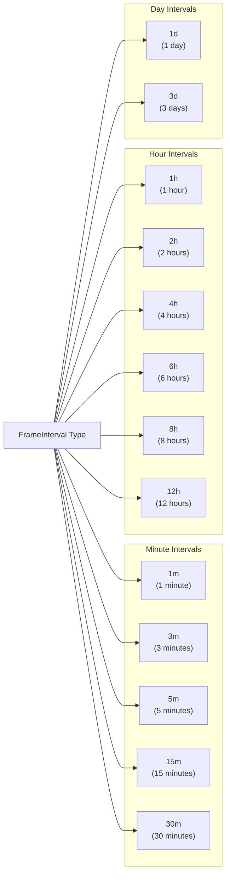
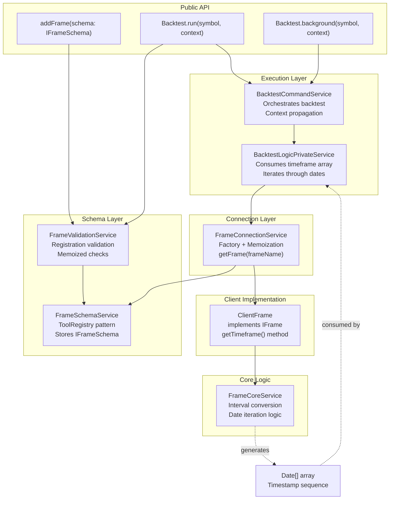
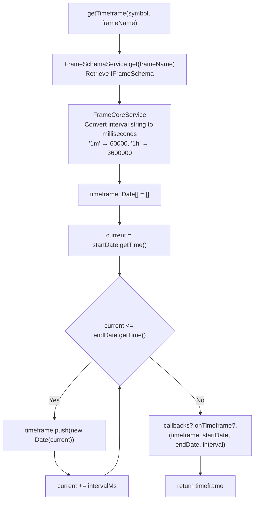
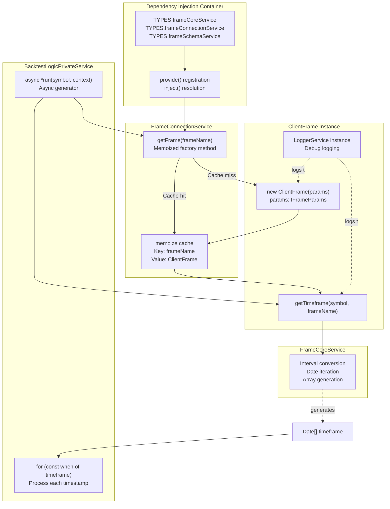
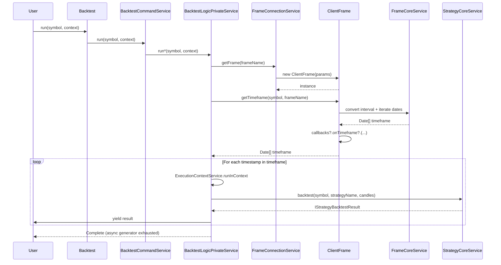

# ClientFrame

<details>
<summary>Relevant source files</summary>

The following files were used as context for generating this wiki page:

- [src/classes/Backtest.ts](src/classes/Backtest.ts)
- [src/classes/Live.ts](src/classes/Live.ts)
- [src/classes/Walker.ts](src/classes/Walker.ts)
- [src/config/emitters.ts](src/config/emitters.ts)
- [src/function/event.ts](src/function/event.ts)
- [src/index.ts](src/index.ts)
- [src/lib/services/connection/StrategyConnectionService.ts](src/lib/services/connection/StrategyConnectionService.ts)
- [types.d.ts](types.d.ts)

</details>


**Purpose**: ClientFrame implements timeframe generation for backtesting by creating arrays of timestamps spaced according to configured intervals. It transforms frame schemas (startDate, endDate, interval) into concrete arrays of Date objects that BacktestLogicPrivateService iterates through during historical simulation.

For information about the Frame schema configuration that ClientFrame consumes, see [Frame Schemas](#5.3). For backtest execution flow that uses these timeframes, see [Backtest Execution Flow](#9.1).

---

## Overview

ClientFrame is a client implementation that generates timeframe arrays for backtest iteration. It bridges the gap between declarative frame configuration (IFrameSchema) and concrete timestamp arrays used during backtest execution.

**Key Responsibilities**:
- Generate arrays of Date objects from startDate to endDate
- Space timestamps according to FrameInterval (1m, 3m, 5m, 15m, 30m, 1h, 2h, 4h, 6h, 8h, 12h, 1d, 3d)
- Invoke onTimeframe callbacks after generation
- Support symbol parameter for API consistency (currently unused)

**Core Interface**:
```typescript
interface IFrame {
  getTimeframe: (symbol: string, frameName: FrameName) => Promise<Date[]>;
}
```

**Sources**: [types.d.ts:212-294]()

---

## Frame Schema Configuration

ClientFrame is instantiated with IFrameParams which extends IFrameSchema with runtime dependencies.

### IFrameSchema Structure

| Field | Type | Description |
|-------|------|-------------|
| `frameName` | `FrameName` (string) | Unique identifier for this frame |
| `interval` | `FrameInterval` | Timestamp spacing (1m, 3m, 5m, 15m, 30m, 1h, 2h, 4h, 6h, 8h, 12h, 1d, 3d) |
| `startDate` | `Date` | Beginning of backtest period (inclusive) |
| `endDate` | `Date` | End of backtest period (inclusive) |
| `note?` | `string` | Optional developer documentation |
| `callbacks?` | `Partial<IFrameCallbacks>` | Optional lifecycle event handlers |

### IFrameParams Extension

```typescript
interface IFrameParams extends IFrameSchema {
  logger: ILogger;
}
```

Adds LoggerService instance for internal debug logging during timeframe generation.

### IFrameCallbacks

```typescript
interface IFrameCallbacks {
  onTimeframe: (
    timeframe: Date[], 
    startDate: Date, 
    endDate: Date, 
    interval: FrameInterval
  ) => void;
}
```

The `onTimeframe` callback fires after timeframe array generation, providing the complete array and configuration for validation or logging.

**Sources**: [types.d.ts:212-275]()

---

## Supported Frame Intervals



**Interval Millisecond Conversion**:

| Interval | Milliseconds | Usage |
|----------|-------------|--------|
| 1m | 60,000 | High-frequency tick generation |
| 3m | 180,000 | Short-term pattern analysis |
| 5m | 300,000 | Common scalping timeframe |
| 15m | 900,000 | Intraday trading strategies |
| 30m | 1,800,000 | Short-term swing trading |
| 1h | 3,600,000 | Standard hourly analysis |
| 2h | 7,200,000 | Extended intraday periods |
| 4h | 14,400,000 | Multi-hour trend analysis |
| 6h | 21,600,000 | Quarter-day intervals |
| 8h | 28,800,000 | Third-of-day intervals |
| 12h | 43,200,000 | Half-day intervals |
| 1d | 86,400,000 | Daily candle backtests |
| 3d | 259,200,000 | Multi-day pattern testing |

**Sources**: [types.d.ts:219]()

---

## Frame System Architecture



**Architecture Layers**:

1. **Schema Layer**: Stores and validates frame configurations via `FrameSchemaService` and `FrameValidationService`
2. **Connection Layer**: `FrameConnectionService` provides memoized factory access to `ClientFrame` instances
3. **Client Layer**: `ClientFrame` implements timeframe generation via `getTimeframe()` method
4. **Core Layer**: `FrameCoreService` contains interval conversion and date iteration algorithms
5. **Execution Layer**: `BacktestLogicPrivateService` consumes generated timeframe arrays for iteration

**Sources**: Architecture diagrams, [types.d.ts:212-294]()

---

## Timeframe Generation Algorithm



**Algorithm Steps**:

1. **Schema Retrieval**: Fetch IFrameSchema by frameName from FrameSchemaService
2. **Interval Conversion**: Convert FrameInterval string to milliseconds via FrameCoreService
3. **Array Initialization**: Create empty Date array
4. **Timestamp Iteration**:
   - Start at `startDate.getTime()`
   - While `current <= endDate.getTime()`:
     - Add `new Date(current)` to array
     - Increment `current` by `intervalMs`
5. **Callback Invocation**: Call `onTimeframe` with generated array and configuration
6. **Return Array**: Return complete Date[] for backtest iteration

**Example Output**:

For `startDate = 2024-01-01T00:00:00Z`, `endDate = 2024-01-01T02:00:00Z`, `interval = 1h`:

```typescript
[
  new Date("2024-01-01T00:00:00.000Z"),
  new Date("2024-01-01T01:00:00.000Z"),
  new Date("2024-01-01T02:00:00.000Z")
]
// 3 timestamps covering 2-hour period at 1-hour intervals
```

**Sources**: [types.d.ts:276-288]()

---

## Service Integration Pattern



**Connection Service Responsibilities**:

1. **Factory Pattern**: `FrameConnectionService` creates `ClientFrame` instances on demand
2. **Memoization**: Cache instances by `frameName` to prevent redundant instantiation
3. **Schema Access**: Retrieve `IFrameSchema` from `FrameSchemaService` during construction
4. **Dependency Injection**: All services injected via `inject()` from DI container

**Memoization Key**: `frameName` (string)

**Example**:
```typescript
// First call - creates new ClientFrame
const frame1 = frameConnectionService.getFrame("1d-backtest");

// Second call - returns cached instance
const frame2 = frameConnectionService.getFrame("1d-backtest");

// frame1 === frame2 (same instance)
```

**Sources**: [src/lib/services/connection/StrategyConnectionService.ts:1-324]() (pattern reference), [types.d.ts:212-294]()

---

## Integration with Backtest Execution



**Execution Flow**:

1. **User Invocation**: `Backtest.run(symbol, {strategyName, exchangeName, frameName})`
2. **Command Service**: Routes to `BacktestCommandService.run()`
3. **Logic Service**: Calls `BacktestLogicPrivateService.run()` (async generator)
4. **Frame Retrieval**: Gets `ClientFrame` instance via `FrameConnectionService.getFrame(frameName)`
5. **Timeframe Generation**: `ClientFrame.getTimeframe()` produces `Date[]` array
6. **Timestamp Iteration**: Loop through each `Date` in timeframe
7. **Context Propagation**: Wrap each iteration in `ExecutionContextService.runInContext({symbol, when: date, backtest: true})`
8. **Strategy Execution**: Call `StrategyCoreService.backtest()` for current timestamp
9. **Result Yielding**: `yield` each closed/cancelled signal to user
10. **Completion**: Generator exhausts when all timestamps processed

**Temporal Isolation**: Each timestamp iteration updates `ExecutionContextService.context.when`, ensuring strategies cannot access future data during `getSignal()` calls.

**Sources**: [src/classes/Backtest.ts:1-601](), [types.d.ts:212-294]()

---

## Usage Example

### Frame Registration

```typescript
import { addFrame } from "backtest-kit";

addFrame({
  frameName: "1d-backtest",
  interval: "1m", // 1-minute tick resolution
  startDate: new Date("2024-01-01T00:00:00Z"),
  endDate: new Date("2024-01-02T00:00:00Z"),
  callbacks: {
    onTimeframe: (timeframe, startDate, endDate, interval) => {
      console.log(`Generated ${timeframe.length} timestamps`);
      console.log(`Period: ${startDate} to ${endDate}`);
      console.log(`Interval: ${interval}`);
    }
  }
});
```

**Result**: 1440 timestamps (24 hours × 60 minutes) spanning 2024-01-01 at 1-minute intervals.

### Backtest Execution with Frame

```typescript
import { Backtest } from "backtest-kit";

for await (const result of Backtest.run("BTCUSDT", {
  strategyName: "my-strategy",
  exchangeName: "binance",
  frameName: "1d-backtest" // Uses frame defined above
})) {
  if (result.action === "closed") {
    console.log("Signal closed at:", result.closeTimestamp);
    console.log("PNL:", result.pnl.pnlPercentage);
  }
}
```

**Execution**: BacktestLogicPrivateService iterates through all 1440 timestamps, invoking strategy logic at each tick.

**Sources**: [types.d.ts:247-275](), [src/classes/Backtest.ts:149-178]()

---

## FrameCoreService Algorithms

### Interval to Milliseconds Conversion

```typescript
const INTERVAL_MS: Record<FrameInterval, number> = {
  "1m": 60_000,
  "3m": 180_000,
  "5m": 300_000,
  "15m": 900_000,
  "30m": 1_800_000,
  "1h": 3_600_000,
  "2h": 7_200_000,
  "4h": 14_400_000,
  "6h": 21_600_000,
  "8h": 28_800_000,
  "12h": 43_200_000,
  "1d": 86_400_000,
  "3d": 259_200_000
};

function convertInterval(interval: FrameInterval): number {
  return INTERVAL_MS[interval];
}
```

### Date Range Generation

```typescript
function generateTimeframe(
  startDate: Date,
  endDate: Date,
  intervalMs: number
): Date[] {
  const timeframe: Date[] = [];
  let current = startDate.getTime();
  const end = endDate.getTime();
  
  while (current <= end) {
    timeframe.push(new Date(current));
    current += intervalMs;
  }
  
  return timeframe;
}
```

**Edge Cases**:

- **Empty Range**: If `startDate > endDate`, returns `[]` (empty array)
- **Single Timestamp**: If `startDate === endDate`, returns `[startDate]` (one element)
- **Inclusive End**: Final timestamp included if `endDate` aligns with interval boundary

**Sources**: [types.d.ts:219](), [types.d.ts:276-288]()

---

## Symbol Parameter Usage

The `getTimeframe()` method signature includes a `symbol` parameter:

```typescript
getTimeframe(symbol: string, frameName: FrameName): Promise<Date[]>
```

**Current Implementation**: The `symbol` parameter is **currently unused** by ClientFrame but maintained for API consistency with other client interfaces (ClientStrategy, ClientExchange, ClientRisk).

**Rationale for Inclusion**:
- Consistent method signature across all client implementations
- Future extensibility for symbol-specific timeframe customization
- Alignment with execution context pattern where symbol is always available

**Future Use Cases**:
- Symbol-specific trading hours (e.g., market open/close times)
- Exchange-specific interval restrictions
- Holiday calendar integration per market

**Sources**: [types.d.ts:287-288]()

---

## Validation and Error Handling

### Registration-Time Validation

```typescript
// Performed by FrameValidationService during addFrame()
- frameName must be unique (no duplicates)
- interval must be valid FrameInterval string
- startDate must be valid Date instance
- endDate must be valid Date instance
- callbacks must conform to Partial<IFrameCallbacks> if provided
```

### Runtime Validation

```typescript
// Performed by BacktestUtils before execution
- Frame must be registered via addFrame()
- FrameValidationService.validate(frameName, methodName) called
- Throws error if frameName not found
```

**Example Error**:
```typescript
Backtest.run("BTCUSDT", {
  strategyName: "my-strategy",
  exchangeName: "binance",
  frameName: "non-existent-frame" // Error: frame not found
});
// Error: Frame "non-existent-frame" not registered
```

**Sources**: [src/classes/Backtest.ts:387-390]()

---

## Relationship to Other Components

| Component | Relationship | Description |
|-----------|-------------|-------------|
| **FrameSchemaService** | Storage | Stores registered IFrameSchema configurations via ToolRegistry |
| **FrameValidationService** | Validation | Validates frame registration and runtime lookups |
| **FrameConnectionService** | Factory | Creates and caches ClientFrame instances |
| **FrameCoreService** | Logic | Provides interval conversion and date iteration algorithms |
| **BacktestLogicPrivateService** | Consumer | Iterates through generated timeframe arrays |
| **ExecutionContextService** | Context | Updates `context.when` for each timestamp iteration |
| **MethodContextService** | Routing | Provides `frameName` for frame instance lookup |

**Sources**: Architecture diagrams, [types.d.ts:212-294]()

---

## Performance Considerations

### Memory Usage

- **Timeframe Array Size**: `(endDate - startDate) / intervalMs + 1` Date objects
- **Example**: 1-day backtest at 1-minute intervals = 1440 Date objects (~23KB)
- **Large Backtests**: Multi-month 1-minute backtests can generate 40,000+ timestamps

**Optimization**: Date objects created once during `getTimeframe()` call, then reused throughout backtest iteration.

### Computational Complexity

- **Generation Time**: O(n) where n = number of timestamps
- **Memoization**: `FrameConnectionService` caches ClientFrame instances, preventing regeneration
- **Callback Overhead**: Single `onTimeframe` callback invocation per generation

### Recommendations

1. **Choose Appropriate Intervals**: Use coarser intervals (1h, 1d) for long-term backtests
2. **Split Large Ranges**: Break multi-year backtests into smaller frame periods
3. **Memory Monitoring**: Monitor heap usage for 1-minute backtests > 3 months

**Sources**: [types.d.ts:276-288]()

---

## Related Components

- [Frame Schemas](#5.3) - Configuration interface for addFrame()
- [Backtest Execution Flow](#9.1) - How timeframes are consumed during backtesting
- [Timeframe Generation](#9.2) - FrameCoreService algorithms
- [Connection Services](#7.2) - Factory pattern and memoization strategy
- [Schema Services](#7.3) - ToolRegistry storage pattern

**Sources**: Table of contents