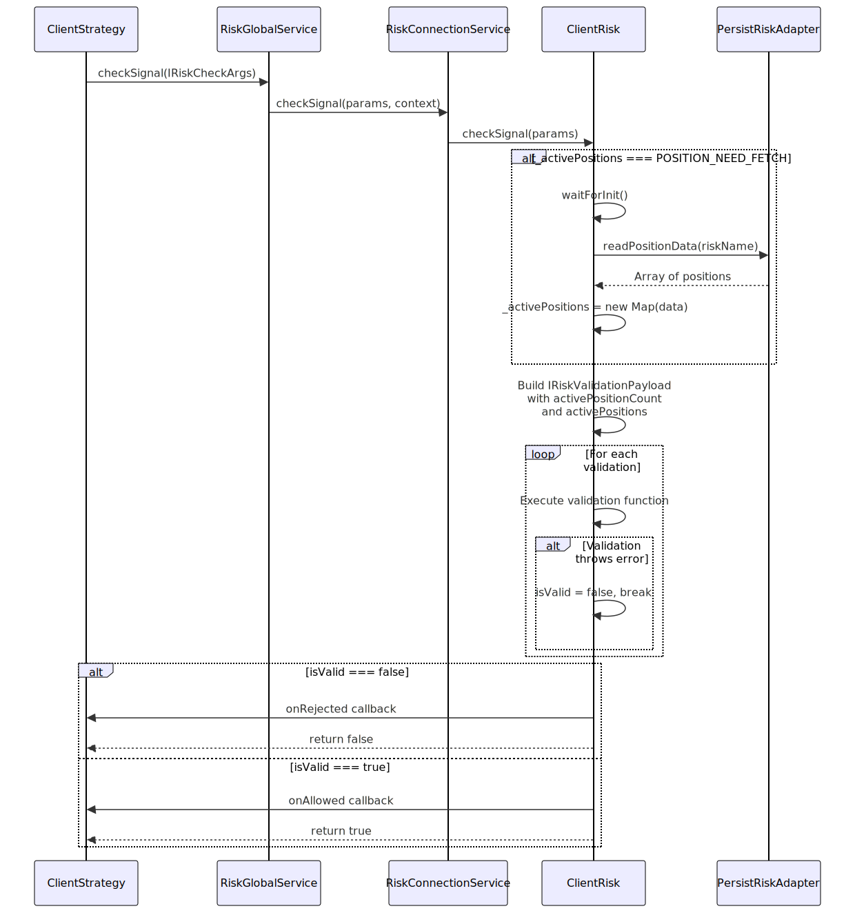
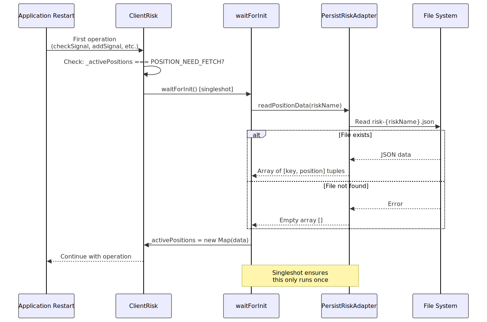

# ClientRisk

This page documents the `ClientRisk` class, which implements portfolio-level risk management by tracking active positions across strategies and executing custom validation logic. For information about the risk schema registration and validation services, see [Risk Schemas](./27_Risk_Schemas.md) and [Risk Management](./65_Risk_Management.md). For information about risk validation services in the service layer, see [Validation Services](./42_Validation_Services.md).

## Purpose and Scope

`ClientRisk` is a client class that provides portfolio-level risk management without dependency injection. It tracks active positions across multiple strategies sharing the same risk profile, executes custom validation functions, and provides crash-safe persistence of position state. The class is instantiated once per `riskName` and used by multiple `ClientStrategy` instances to ensure consistent risk limits across the portfolio.


## Core Responsibilities

`ClientRisk` implements the `IRisk` interface and provides three primary operations:

| Method | Purpose | Called By |
|--------|---------|-----------|
| `checkSignal(params)` | Validates if a new position should be allowed based on custom validations | `ClientStrategy` before signal creation |
| `addSignal(symbol, context)` | Registers a newly opened position | `StrategyConnectionService` after signal opens |
| `removeSignal(symbol, context)` | Removes a closed position | `StrategyConnectionService` after signal closes |

All operations are asynchronous and support persistence for crash recovery in live trading mode.


## Architecture Overview



**Key Integration Points:**

- `RiskConnectionService` creates and memoizes `ClientRisk` instances (one per `riskName`)
- `ClientStrategy` calls risk checks before generating new signals
- `PersistRiskAdapter` provides crash-safe persistence for live mode
- Multiple strategies can share the same `ClientRisk` instance for cross-strategy limits


## Position Tracking Mechanism

### Active Position Storage

`ClientRisk` maintains a `Map` of active positions with a composite key pattern:

```typescript
// Key pattern: strategyName:symbol
const GET_KEY_FN = (strategyName: string, symbol: string) => `${strategyName}:${symbol}`;
```

Each entry stores:

```typescript
interface IRiskActivePosition {
  signal: ISignalRow;        // Signal details (null for tracking-only)
  strategyName: string;       // Strategy owning the position
  exchangeName: string;       // Exchange name
  openTimestamp: number;      // When position was opened
}
```


### Lazy Initialization Pattern

The `_activePositions` field uses a special initialization pattern:



**Implementation Details:**

| State | Type | Meaning |
|-------|------|---------|
| `POSITION_NEED_FETCH` | `Symbol` | Initial state, positions not yet loaded |
| `Map<string, IRiskActivePosition>` | `Map` | Initialized state with position data |

The `waitForInit` method uses `singleshot` pattern to ensure initialization happens exactly once:

```typescript
private waitForInit = singleshot(async () => await WAIT_FOR_INIT_FN(this));
```


## Risk Validation Flow

### Signal Check Process




### Validation Execution

Custom validations receive `IRiskValidationPayload` with complete portfolio state:

| Field | Source | Purpose |
|-------|--------|---------|
| `symbol` | `IRiskCheckArgs` | Trading pair being validated |
| `strategyName` | `IRiskCheckArgs` | Strategy requesting position |
| `exchangeName` | `IRiskCheckArgs` | Exchange for position |
| `currentPrice` | `IRiskCheckArgs` | Current VWAP price |
| `timestamp` | `IRiskCheckArgs` | Current timestamp |
| `activePositionCount` | `ClientRisk` | Number of active positions |
| `activePositions` | `ClientRisk` | Full list of active positions |

**Validation Function Wrapper:**

The `DO_VALIDATION_FN` wrapper provides error handling:

```typescript
const DO_VALIDATION_FN = trycatch(
  async (validation: IRiskValidationFn, params: IRiskValidationPayload) => {
    await validation(params);
    return true;  // Validation passed
  },
  {
    defaultValue: false,  // Validation failed
    fallback: (error) => {
      // Log error and emit to validationSubject
    }
  }
);
```


## Position Management

### Adding Positions



**Key Pattern Ensures Uniqueness:**

- Each strategy can have one position per symbol
- Different strategies can have positions in the same symbol
- Example: `"strategy1:BTCUSDT"` and `"strategy2:BTCUSDT"` are separate positions


### Removing Positions




## Persistence and Crash Recovery

### Persistence Architecture



**Data Format:**

Positions are converted between `Map` and `Array` for serialization:

```typescript
// Writing: Map -> Array
await PersistRiskAdapter.writePositionData(
  Array.from(<RiskMap>this._activePositions),
  this.params.riskName
);

// Reading: Array -> Map
const persistedPositions = await PersistRiskAdapter.readPositionData(riskName);
this._activePositions = new Map(persistedPositions);
```


### Crash Recovery Process



**Isolation by Risk Name:**

Each `riskName` has isolated persistence:

| Risk Name | File Path | Isolated State |
|-----------|-----------|----------------|
| `"conservative"` | `risk-conservative.json` | Separate Map |
| `"aggressive"` | `risk-aggressive.json` | Separate Map |
| `"moderate"` | `risk-moderate.json` | Separate Map |


## Data Flow Diagram



**Payload Construction:**

The `checkSignal` method constructs the validation payload by combining:

1. **Passthrough arguments** from `IRiskCheckArgs` (symbol, strategyName, exchangeName, currentPrice, timestamp)
2. **Portfolio state** from `_activePositions` Map (activePositionCount, activePositions array)


## Key Implementation Details

### Memoization in RiskConnectionService

`ClientRisk` instances are created once per `riskName` and cached:

```typescript
public getRisk = memoize(
  ([riskName]) => `${riskName}`,
  (riskName: RiskName) => {
    const schema = this.riskSchemaService.get(riskName);
    return new ClientRisk({
      ...schema,
      logger: this.loggerService,
    });
  }
);
```

**Implications:**

- Multiple strategies sharing a `riskName` use the same `ClientRisk` instance
- Position tracking is shared across all strategies with the same risk profile
- Validation state is consistent for all strategies in the risk group


### Validation Function Types

Two validation formats are supported:

**Object Format:**

```typescript
{
  validate: (payload: IRiskValidationPayload) => {
    if (payload.activePositionCount >= 5) {
      throw new Error("Max 5 positions");
    }
  },
  note: "Limit to 5 concurrent positions"
}
```

**Function Format:**

```typescript
(payload: IRiskValidationPayload) => {
  if (payload.activePositionCount >= 5) {
    throw new Error("Max 5 positions");
  }
}
```

Both are normalized during execution:

```typescript
for (const validation of this.params.validations) {
  await DO_VALIDATION_FN(
    typeof validation === "function" 
      ? validation 
      : validation.validate,
    payload
  );
}
```


### Error Handling Strategy

**Validation Errors:**

- Validation functions throw errors to reject signals
- `DO_VALIDATION_FN` wrapper catches errors and returns `false`
- Errors are logged and emitted to `validationSubject`
- First validation failure short-circuits remaining validations

**Persistence Errors:**

- Read failures during initialization return empty array (no crash)
- Write failures propagate to caller (operation fails, state remains consistent)


### Position Key Uniqueness

The composite key pattern ensures:

| Component | Purpose |
|-----------|---------|
| `strategyName` | Allows multiple strategies to track the same symbol |
| `:` separator | Delimiter between components |
| `symbol` | Trading pair identifier |

**Example Keys:**

```
"momentum-1m:BTCUSDT"
"mean-reversion:BTCUSDT"
"momentum-1m:ETHUSDT"
```

This allows:
- `momentum-1m` and `mean-reversion` to both hold `BTCUSDT` positions
- Each strategy-symbol combination counted separately
- Risk limits applied to total across all keys

