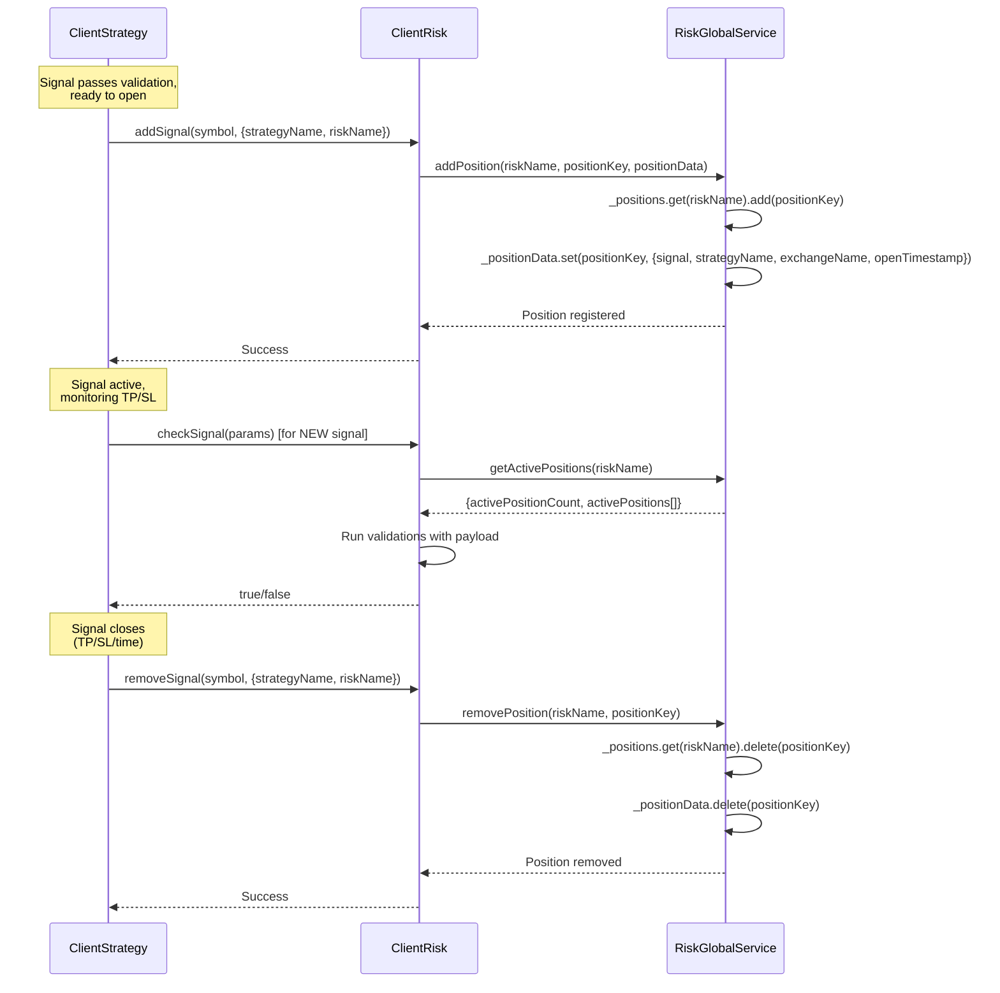
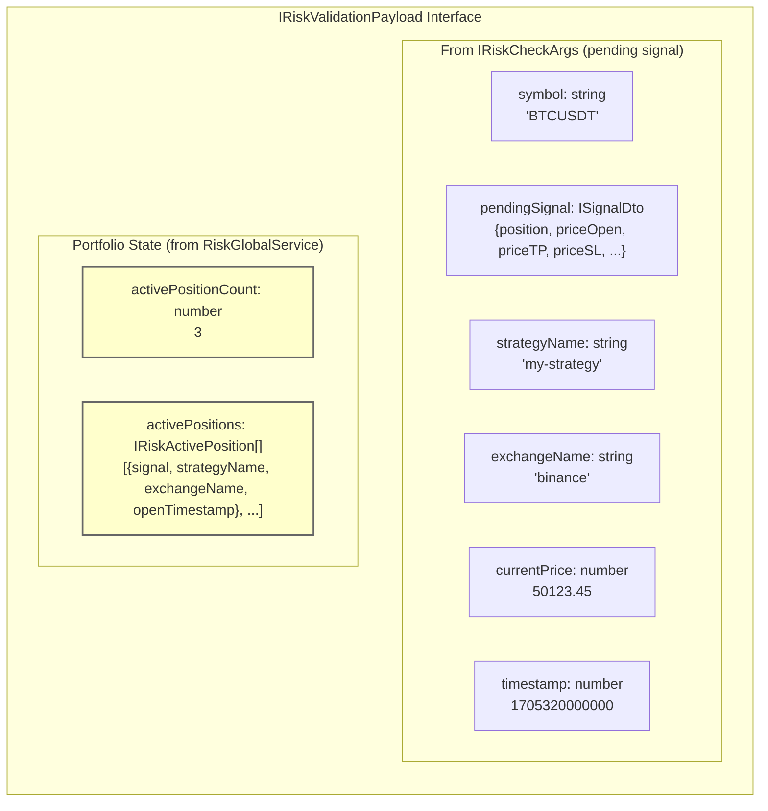
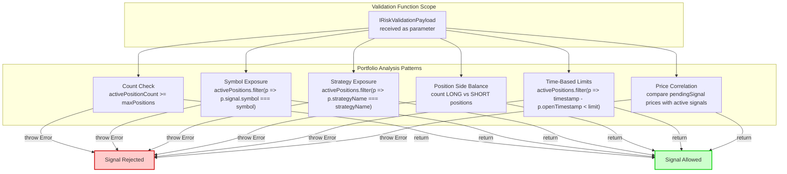
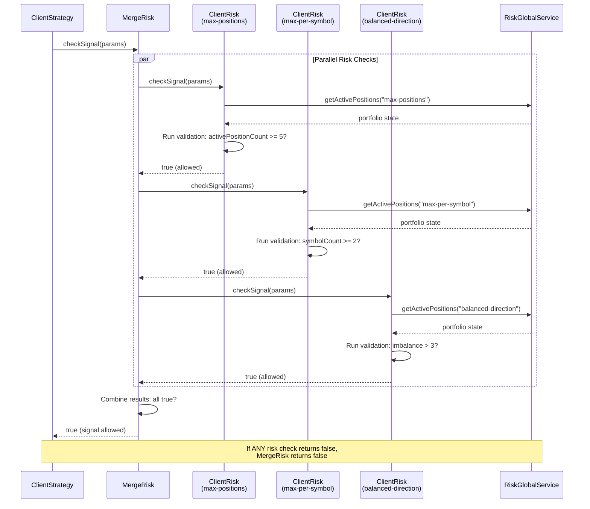
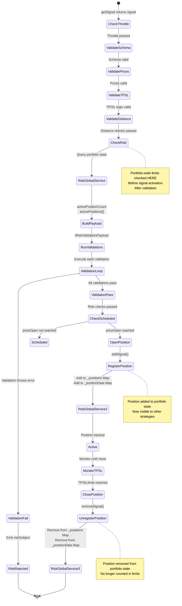

# Portfolio-Wide Limits

## Purpose and Scope

This document covers portfolio-wide risk management in Backtest Kit, focusing on how the system tracks and enforces limits across multiple strategies and symbols simultaneously. Portfolio-wide limits enable cross-strategy risk analysis by maintaining a global view of all active positions.

For individual signal validation rules (price checks, TP/SL logic), see [Signal Validation Pipeline](./31_risk-management.md). For position sizing calculations, see [Position Sizing](./31_risk-management.md). For defining basic risk profiles, see [Risk Profiles & Validation](./31_risk-management.md).

The core mechanism is **RiskGlobalService**, which maintains a centralized registry of active positions and makes this data available to all risk validation functions through the `IRiskValidationPayload` interface.

---

## System Architecture

The portfolio-wide risk system consists of three main components that work together to enforce limits across strategies:

```mermaid
graph TB
    subgraph "Strategy Execution Layer"
        CS1["ClientStrategy<br/>(Symbol: BTCUSDT, Strategy: strat-a)"]
        CS2["ClientStrategy<br/>(Symbol: ETHUSDT, Strategy: strat-a)"]
        CS3["ClientStrategy<br/>(Symbol: BTCUSDT, Strategy: strat-b)"]
    end
    
    subgraph "Connection Layer - Memoization"
        RC["RiskConnectionService<br/>getOrCreateRisk(riskName)"]
    end
    
    subgraph "Client Layer - Shared Instances"
        CR["ClientRisk<br/>(riskName: 'portfolio-limit')<br/>checkSignal()<br/>addSignal()<br/>removeSignal()"]
    end
    
    subgraph "Global State Layer"
        RGS["RiskGlobalService<br/>_positions: Map&lt;riskName, Set&lt;positionKey&gt;&gt;<br/>_positionData: Map&lt;positionKey, IRiskActivePosition&gt;"]
    end
    
    subgraph "Schema Layer"
        RSS["RiskSchemaService<br/>get(riskName): IRiskSchema"]
        Schema["IRiskSchema<br/>- validations: IRiskValidation[]<br/>- callbacks"]
    end
    
    CS1 -->|"uses"| RC
    CS2 -->|"uses"| RC
    CS3 -->|"uses"| RC
    
    RC -->|"memoized by riskName"| CR
    
    CR -->|"reads schema"| RSS
    RSS -->|"returns"| Schema
    
    CR -->|"addSignal(symbol, context)"| RGS
    CR -->|"removeSignal(symbol, context)"| RGS
    CR -->|"checkSignal(params)"<br/>"queries active positions"| RGS
    
    RGS -->|"builds IRiskValidationPayload<br/>with activePositionCount<br/>and activePositions array"| CR
    
    style RGS fill:#f9f9f9,stroke:#333,stroke-width:2px
    style CR fill:#e8f4f8,stroke:#333,stroke-width:2px
    style RC fill:#fff9e6,stroke:#333,stroke-width:2px
```

**Key Architecture Points:**

1. **Shared Instance Pattern**: Multiple `ClientStrategy` instances that use the same `riskName` share a single `ClientRisk` instance (memoized by `RiskConnectionService`)

2. **Centralized State**: `RiskGlobalService` maintains two Maps:
   - `_positions`: Tracks which position keys belong to each risk profile
   - `_positionData`: Stores detailed `IRiskActivePosition` data for each position

3. **Lifecycle Integration**: When a signal opens, `ClientRisk.addSignal()` registers it with `RiskGlobalService`. When closed, `ClientRisk.removeSignal()` unregisters it

4. **Validation Context**: During `checkSignal()`, `RiskGlobalService` provides the current portfolio state through `IRiskValidationPayload`


---

## Active Position Tracking

The system tracks active positions using a unique key per symbol-strategy pair and stores comprehensive position metadata:

### Position Key Format

```typescript
// Position key format: "symbol:strategyName"
// Example: "BTCUSDT:my-strategy"
const positionKey = `${symbol}:${strategyName}`;
```

### IRiskActivePosition Structure

| Field | Type | Description |
|-------|------|-------------|
| `signal` | `ISignalRow` | Complete signal data including id, position, prices, timestamps |
| `strategyName` | `string` | Name of the strategy that opened this position |
| `exchangeName` | `string` | Name of the exchange being used |
| `openTimestamp` | `number` | Unix timestamp (milliseconds) when position opened |

### Tracking Lifecycle



**Important:** Only **opened** signals are tracked. Scheduled signals (waiting for `priceOpen`) are NOT added to the position registry until they activate.


---

## Validation Payload Structure

During `checkSignal()`, custom validation functions receive an `IRiskValidationPayload` object containing both the pending signal's data and the current portfolio state:



### Field Reference Table

| Category | Field | Type | Description |
|----------|-------|------|-------------|
| **Pending Signal** | `symbol` | `string` | Trading pair for the new signal |
| | `pendingSignal` | `ISignalDto` | Signal details (position, prices, time) |
| | `strategyName` | `string` | Strategy attempting to open |
| | `exchangeName` | `string` | Exchange being used |
| | `currentPrice` | `number` | Current VWAP price |
| | `timestamp` | `number` | Unix timestamp of check (ms) |
| **Portfolio State** | `activePositionCount` | `number` | Total open positions for this risk profile |
| | `activePositions` | `IRiskActivePosition[]` | Array of all active position details |

### IRiskActivePosition Contents

Each element in the `activePositions` array contains:

```typescript
interface IRiskActivePosition {
  signal: ISignalRow;           // Full signal data (id, position, priceOpen, etc.)
  strategyName: string;          // Which strategy owns this position
  exchangeName: string;          // Which exchange is being used
  openTimestamp: number;         // When position opened (ms)
}
```


---

## Writing Portfolio-Wide Validations

Custom validation functions access portfolio state through the `IRiskValidationPayload` parameter. Validations throw errors to reject signals or return successfully to allow them.

### Basic Pattern

```typescript
import { addRisk } from "backtest-kit";

addRisk({
  riskName: "portfolio-limits",
  validations: [
    // Validation function signature
    async (payload: IRiskValidationPayload) => {
      // Access pending signal
      const { symbol, pendingSignal, strategyName } = payload;
      
      // Access portfolio state
      const { activePositionCount, activePositions } = payload;
      
      // Validation logic
      if (activePositionCount >= 5) {
        throw new Error("Maximum 5 concurrent positions allowed");
      }
      
      // If no error thrown, signal is allowed
    }
  ]
});
```

### Accessing Active Positions




---

## Common Portfolio Limit Patterns

### Pattern 1: Maximum Concurrent Positions

Enforce a hard limit on total open positions across all strategies and symbols:

```typescript
addRisk({
  riskName: "max-5-positions",
  validations: [
    (payload) => {
      if (payload.activePositionCount >= 5) {
        throw new Error(`Portfolio limit: ${payload.activePositionCount}/5 positions active`);
      }
    }
  ]
});
```

### Pattern 2: Per-Symbol Exposure Limit

Limit concurrent positions on the same symbol:

```typescript
addRisk({
  riskName: "max-2-per-symbol",
  validations: [
    (payload) => {
      const { symbol, activePositions } = payload;
      
      // Count positions on this symbol
      const symbolPositions = activePositions.filter(
        p => p.signal.symbol === symbol
      );
      
      if (symbolPositions.length >= 2) {
        throw new Error(
          `Symbol limit: ${symbolPositions.length}/2 positions on ${symbol}`
        );
      }
    }
  ]
});
```

### Pattern 3: Per-Strategy Position Limit

Limit how many positions a single strategy can open:

```typescript
addRisk({
  riskName: "max-3-per-strategy",
  validations: [
    (payload) => {
      const { strategyName, activePositions } = payload;
      
      // Count positions from this strategy
      const strategyPositions = activePositions.filter(
        p => p.strategyName === strategyName
      );
      
      if (strategyPositions.length >= 3) {
        throw new Error(
          `Strategy limit: ${strategyName} has ${strategyPositions.length}/3 positions`
        );
      }
    }
  ]
});
```

### Pattern 4: Directional Balance Check

Maintain balance between LONG and SHORT positions:

```typescript
addRisk({
  riskName: "balanced-portfolio",
  validations: [
    (payload) => {
      const { pendingSignal, activePositions } = payload;
      
      const longCount = activePositions.filter(
        p => p.signal.position === "long"
      ).length;
      
      const shortCount = activePositions.filter(
        p => p.signal.position === "short"
      ).length;
      
      // If opening LONG and already have 3 more LONGs than SHORTs
      if (pendingSignal.position === "long" && longCount - shortCount >= 3) {
        throw new Error(
          `Imbalanced portfolio: ${longCount} LONG vs ${shortCount} SHORT`
        );
      }
      
      // If opening SHORT and already have 3 more SHORTs than LONGs
      if (pendingSignal.position === "short" && shortCount - longCount >= 3) {
        throw new Error(
          `Imbalanced portfolio: ${shortCount} SHORT vs ${longCount} LONG`
        );
      }
    }
  ]
});
```

### Pattern 5: Time-Based Rate Limiting

Prevent opening too many positions within a time window:

```typescript
addRisk({
  riskName: "rate-limiter",
  validations: [
    (payload) => {
      const { timestamp, activePositions } = payload;
      const oneHourMs = 60 * 60 * 1000;
      
      // Count positions opened in last hour
      const recentPositions = activePositions.filter(
        p => timestamp - p.openTimestamp < oneHourMs
      );
      
      if (recentPositions.length >= 10) {
        throw new Error(
          `Rate limit: ${recentPositions.length} positions opened in last hour`
        );
      }
    }
  ]
});
```

### Pattern 6: Cross-Symbol Correlation Check

Prevent opening correlated positions (requires external data):

```typescript
addRisk({
  riskName: "correlation-limit",
  validations: [
    async (payload) => {
      const { symbol, activePositions } = payload;
      
      // Get list of active symbols
      const activeSymbols = [...new Set(
        activePositions.map(p => p.signal.symbol)
      )];
      
      // Check correlation with each active symbol (external API/calculation)
      for (const activeSymbol of activeSymbols) {
        const correlation = await getCorrelation(symbol, activeSymbol);
        
        if (Math.abs(correlation) > 0.8) {
          throw new Error(
            `High correlation: ${symbol} and ${activeSymbol} (${correlation.toFixed(2)})`
          );
        }
      }
    }
  ]
});
```


---

## Multiple Risk Profiles with MergeRisk

When a strategy specifies both `riskName` and `riskList`, the system uses `MergeRisk` to combine multiple risk profiles. A signal must pass **ALL** risk checks to be allowed:

```typescript
import { addStrategy, addRisk } from "backtest-kit";

// Define individual risk profiles
addRisk({
  riskName: "max-positions",
  validations: [
    (payload) => {
      if (payload.activePositionCount >= 5) {
        throw new Error("Max 5 positions");
      }
    }
  ]
});

addRisk({
  riskName: "max-per-symbol",
  validations: [
    (payload) => {
      const symbolCount = payload.activePositions.filter(
        p => p.signal.symbol === payload.symbol
      ).length;
      if (symbolCount >= 2) {
        throw new Error("Max 2 per symbol");
      }
    }
  ]
});

addRisk({
  riskName: "balanced-direction",
  validations: [
    (payload) => {
      const longCount = payload.activePositions.filter(
        p => p.signal.position === "long"
      ).length;
      const shortCount = payload.activePositions.filter(
        p => p.signal.position === "short"
      ).length;
      
      if (Math.abs(longCount - shortCount) > 3) {
        throw new Error("Portfolio too imbalanced");
      }
    }
  ]
});

// Strategy with combined risk checks
addStrategy({
  strategyName: "multi-risk-strategy",
  interval: "5m",
  riskList: ["max-positions", "max-per-symbol", "balanced-direction"],
  getSignal: async (symbol, when) => {
    // Signal generation logic
    return {
      position: "long",
      priceTakeProfit: 51000,
      priceStopLoss: 49000,
      minuteEstimatedTime: 60
    };
  }
});
```

### MergeRisk Flow Diagram



**Key Point:** All risk checks execute in parallel via `Promise.all()`, and the signal is only allowed if all checks pass (logical AND operation).


---

## Integration with Strategy Execution

Portfolio-wide limits integrate seamlessly into the signal lifecycle through `ClientStrategy`:



### Execution Flow Code Mapping

| Stage | Code Location | Description |
|-------|---------------|-------------|
| **Risk Check** | `src/lib/client/ClientStrategy.ts` `tick()` method | Calls `risk.checkSignal(params)` |
| **Build Payload** | `src/lib/client/ClientRisk.ts` `checkSignal()` | Queries `RiskGlobalService` for portfolio state |
| **Run Validations** | `src/lib/client/ClientRisk.ts` `checkSignal()` | Iterates through `validations` array |
| **Register Position** | `src/lib/client/ClientRisk.ts` `addSignal()` | Calls `RiskGlobalService.addPosition()` |
| **Unregister Position** | `src/lib/client/ClientRisk.ts` `removeSignal()` | Calls `RiskGlobalService.removePosition()` |


---

## Monitoring Portfolio State

### Risk Rejection Events

When a signal is rejected by portfolio limits, the system emits a `RiskContract` event through `riskSubject`:

```typescript
import { listenRisk } from "backtest-kit";

listenRisk((event) => {
  console.log(`[RISK] Signal rejected for ${event.symbol}`);
  console.log(`  Strategy: ${event.strategyName}`);
  console.log(`  Position: ${event.position}`);
  console.log(`  Price: ${event.currentPrice}`);
  console.log(`  Active Positions: ${event.activePositionCount}`);
  console.log(`  Reason: ${event.comment}`);
  console.log(`  Timestamp: ${new Date(event.timestamp).toISOString()}`);
});
```

### Generating Risk Reports

The `Risk` utility class provides methods to analyze rejection patterns:

```typescript
import { Risk } from "backtest-kit";

// Get statistical data
const stats = await Risk.getData("BTCUSDT", "my-strategy");

console.log(`Total rejections: ${stats.totalRejections}`);
console.log(`Rejections by symbol:`, stats.bySymbol);
console.log(`Rejections by strategy:`, stats.byStrategy);

// Generate markdown report
const markdown = await Risk.getReport("BTCUSDT", "my-strategy");

// Save to file
await Risk.dump("BTCUSDT", "my-strategy", "./reports");
```

### RiskStatisticsModel Structure

| Field | Type | Description |
|-------|------|-------------|
| `totalRejections` | `number` | Total signals rejected |
| `bySymbol` | `Record<string, number>` | Rejection count per symbol |
| `byStrategy` | `Record<string, number>` | Rejection count per strategy |
| `eventList` | `RiskContract[]` | All rejection events (max 250) |


---

## Performance Considerations

### Memoization Optimization

`RiskConnectionService` memoizes `ClientRisk` instances by `riskName`, ensuring that multiple strategies sharing the same risk profile use the same instance. This is critical for portfolio-wide state consistency:

```typescript
// Internal implementation (conceptual)
class RiskConnectionService {
  private _riskCache = new Map<string, ClientRisk>();
  
  getOrCreateRisk(riskName: string): ClientRisk {
    if (!this._riskCache.has(riskName)) {
      const schema = riskSchemaService.get(riskName);
      const risk = new ClientRisk(schema);
      this._riskCache.set(riskName, risk);
    }
    return this._riskCache.get(riskName);
  }
}
```

**Result:** All strategies using `riskName: "portfolio-limits"` share the exact same `ClientRisk` instance, which queries the same `RiskGlobalService` state.

### Position Key Efficiency

Position keys are simple strings (`"symbol:strategyName"`), making lookups in `RiskGlobalService` Maps extremely fast (O(1) average case).

### Parallel Validation with MergeRisk

When using `riskList`, `MergeRisk` executes all risk checks in parallel via `Promise.all()`, minimizing validation latency:

```typescript
// From MergeRisk.checkSignal() implementation
const riskCheck = await Promise.all(
  this._riskList.map(async (risk) => await risk.checkSignal(params))
);
return riskCheck.every((isSafe) => isSafe);
```


---

## Complete Example: Multi-Level Portfolio Risk

This example demonstrates a comprehensive portfolio risk system with multiple layers of protection:

```typescript
import { addRisk, addStrategy, Backtest, listenRisk } from "backtest-kit";

// Layer 1: Hard position limit
addRisk({
  riskName: "hard-limit",
  validations: [
    (payload) => {
      const MAX = 8;
      if (payload.activePositionCount >= MAX) {
        throw new Error(`Hard limit: ${payload.activePositionCount}/${MAX} positions`);
      }
    }
  ]
});

// Layer 2: Symbol exposure management
addRisk({
  riskName: "symbol-exposure",
  validations: [
    (payload) => {
      const { symbol, activePositions } = payload;
      const MAX_PER_SYMBOL = 2;
      
      const symbolPositions = activePositions.filter(
        p => p.signal.symbol === symbol
      );
      
      if (symbolPositions.length >= MAX_PER_SYMBOL) {
        throw new Error(
          `Symbol limit: ${symbol} has ${symbolPositions.length}/${MAX_PER_SYMBOL}`
        );
      }
    }
  ]
});

// Layer 3: Strategy-level limits
addRisk({
  riskName: "strategy-limit",
  validations: [
    (payload) => {
      const { strategyName, activePositions } = payload;
      const MAX_PER_STRATEGY = 3;
      
      const strategyPositions = activePositions.filter(
        p => p.strategyName === strategyName
      );
      
      if (strategyPositions.length >= MAX_PER_STRATEGY) {
        throw new Error(
          `Strategy limit: ${strategyName} at ${strategyPositions.length}/${MAX_PER_STRATEGY}`
        );
      }
    }
  ]
});

// Layer 4: Time-based rate limiting
addRisk({
  riskName: "rate-limit",
  validations: [
    (payload) => {
      const { timestamp, activePositions } = payload;
      const WINDOW_MS = 30 * 60 * 1000; // 30 minutes
      const MAX_IN_WINDOW = 5;
      
      const recentPositions = activePositions.filter(
        p => timestamp - p.openTimestamp < WINDOW_MS
      );
      
      if (recentPositions.length >= MAX_IN_WINDOW) {
        throw new Error(
          `Rate limit: ${recentPositions.length} positions in last 30min`
        );
      }
    }
  ]
});

// Layer 5: Directional balance
addRisk({
  riskName: "directional-balance",
  validations: [
    (payload) => {
      const { pendingSignal, activePositions } = payload;
      const MAX_IMBALANCE = 4;
      
      const longs = activePositions.filter(p => p.signal.position === "long").length;
      const shorts = activePositions.filter(p => p.signal.position === "short").length;
      
      const newLongs = longs + (pendingSignal.position === "long" ? 1 : 0);
      const newShorts = shorts + (pendingSignal.position === "short" ? 1 : 0);
      
      if (Math.abs(newLongs - newShorts) > MAX_IMBALANCE) {
        throw new Error(
          `Imbalance: ${newLongs} LONG vs ${newShorts} SHORT (max diff: ${MAX_IMBALANCE})`
        );
      }
    }
  ]
});

// Strategy using all risk layers
addStrategy({
  strategyName: "multi-layer-strategy",
  interval: "5m",
  riskList: [
    "hard-limit",
    "symbol-exposure",
    "strategy-limit",
    "rate-limit",
    "directional-balance"
  ],
  getSignal: async (symbol, when) => {
    // Signal generation logic
    return {
      position: Math.random() > 0.5 ? "long" : "short",
      priceTakeProfit: 51000,
      priceStopLoss: 49000,
      minuteEstimatedTime: 120
    };
  },
  callbacks: {
    onOpen: (symbol, signal, price, backtest) => {
      console.log(`✅ Signal opened: ${symbol} ${signal.position.toUpperCase()}`);
    }
  }
});

// Monitor rejections
listenRisk((event) => {
  console.log(`❌ Signal rejected: ${event.symbol} ${event.position.toUpperCase()}`);
  console.log(`   Reason: ${event.comment}`);
  console.log(`   Active: ${event.activePositionCount}`);
});

// Run backtest
Backtest.background("BTCUSDT", {
  strategyName: "multi-layer-strategy",
  exchangeName: "my-exchange",
  frameName: "1-month-backtest"
});
```

**This configuration ensures:**
1. Never more than 8 total positions
2. Max 2 positions per symbol
3. Max 3 positions per strategy
4. Max 5 positions opened in any 30-minute window
5. Long/short imbalance never exceeds 4

