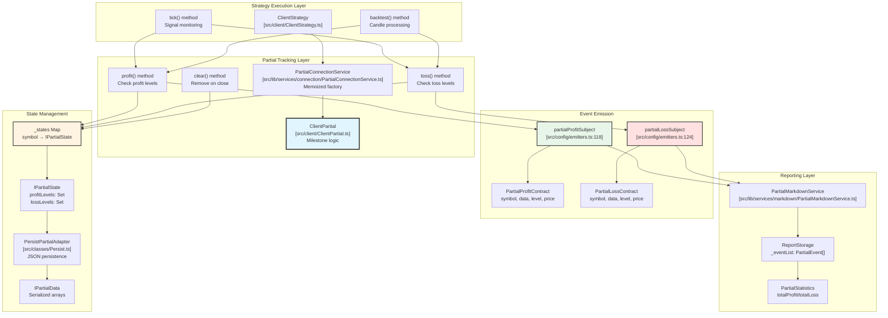
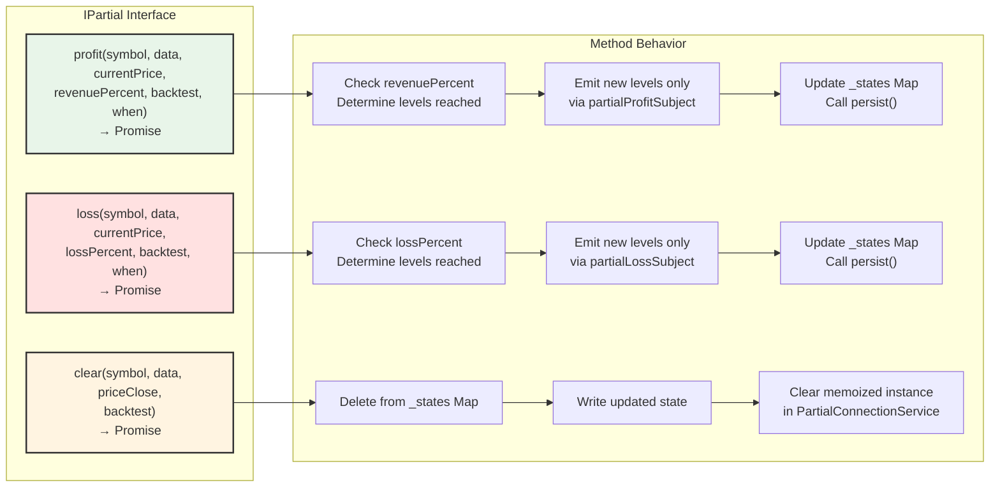
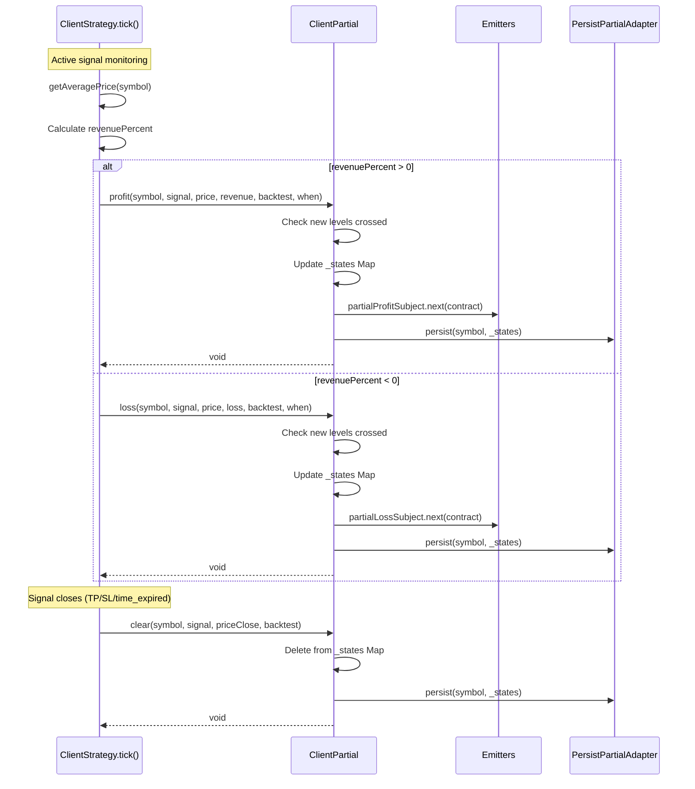
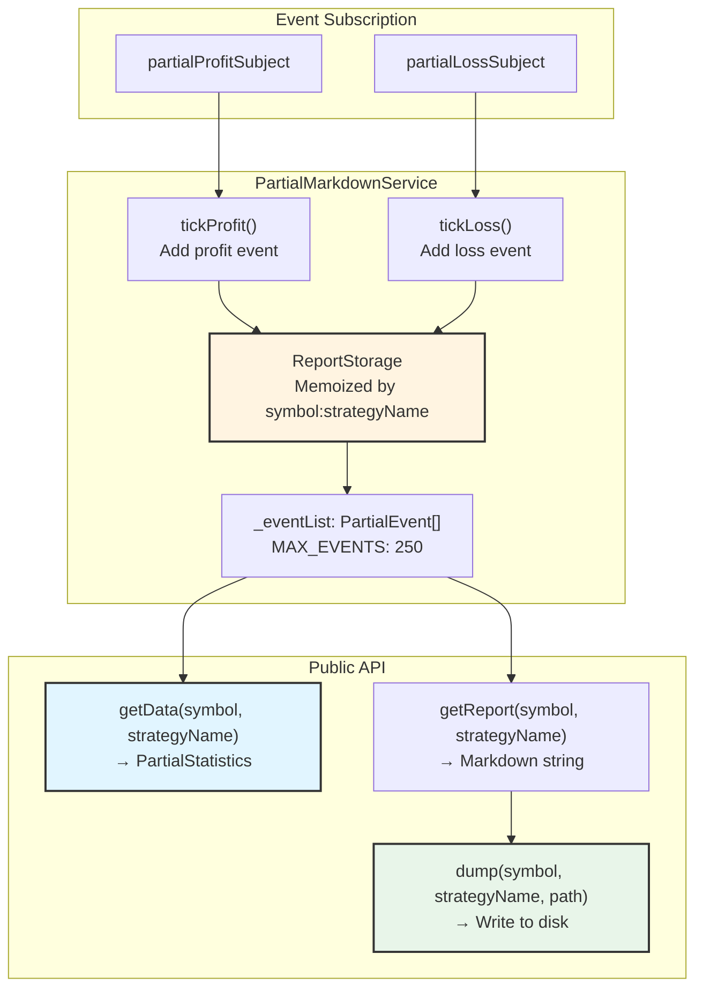
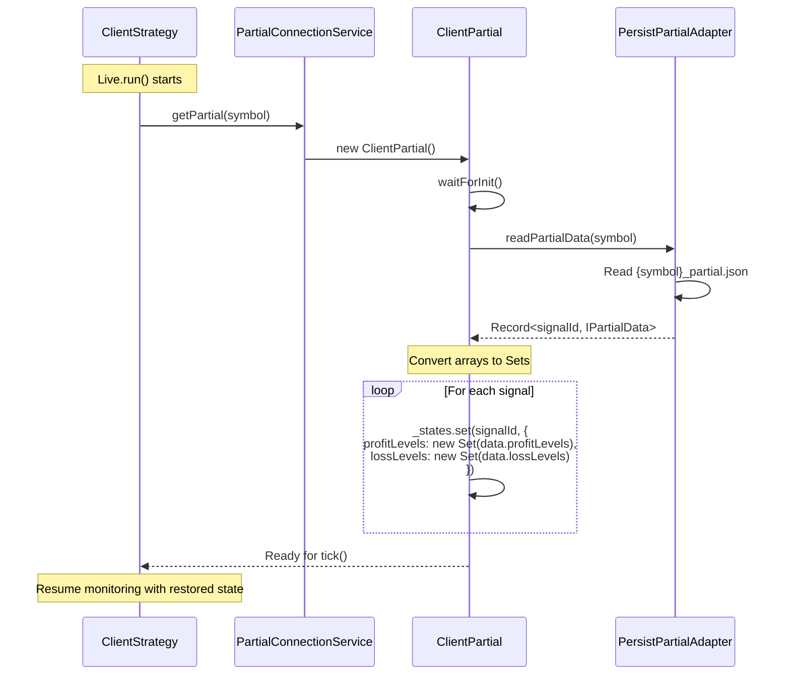

# Partial Profit and Loss

This page documents the partial profit/loss tracking system, which monitors intermediate milestone levels (10%, 20%, 30%, etc.) as trading signals move toward their take profit or stop loss targets. The system emits events when signals reach these thresholds, enabling real-time monitoring and analytics for unrealized gains/losses.

For information about final profit/loss calculation when signals close, see [Signal Lifecycle and State Machine](./03-signal-lifecycle-and-state-machine.md). For event subscription patterns, see [Event Listeners and Monitoring](./35-event-listeners-and-monitoring.md).

---

## System Purpose and Architecture

The partial profit/loss system tracks milestone levels for active signals without closing positions. When a signal's unrealized profit or loss crosses a 10% threshold (10%, 20%, 30%, up to 100%), the system:

1. Emits an event via `partialProfitSubject` or `partialLossSubject`
2. Records the milestone in persistent storage for crash recovery
3. Ensures each level is only reported once per signal (Set-based deduplication)
4. Provides markdown reports aggregating milestone events

This differs from the final PNL calculated when signals close - partial tracking monitors intermediate states during active signal monitoring.

---

## Component Architecture



**Component Flow**: `ClientStrategy` invokes `ClientPartial` methods during signal monitoring. `ClientPartial` maintains in-memory Sets tracking which levels have been reached, persists state via `PersistPartialAdapter`, and emits events through `partialProfitSubject`/`partialLossSubject`. `PartialMarkdownService` subscribes to these subjects for reporting.

---

## Milestone Level Enumeration

The `PartialLevel` type defines discrete milestone thresholds:

```typescript
type PartialLevel = 10 | 20 | 30 | 40 | 50 | 60 | 70 | 80 | 90 | 100;
```

When a signal's unrealized profit or loss percentage crosses one of these thresholds, the corresponding level is added to the tracking Set and an event is emitted. For example:

- Signal opens at $50,000
- Price moves to $55,500 → 11% profit → `profit(symbol, data, 55500, 11.0, false, now)` called → Level 10 emitted
- Price moves to $61,000 → 22% profit → `profit(symbol, data, 61000, 22.0, false, now)` called → Level 20 emitted
- Level 10 is NOT re-emitted (Set deduplication)

---

## IPartial Interface and Methods



**Method Contracts**:

| Method | Parameters | Purpose | Side Effects |
|--------|-----------|---------|--------------|
| `profit()` | `symbol`, `data: ISignalRow`, `currentPrice`, `revenuePercent`, `backtest`, `when` | Process profit state and emit events for new profit levels | Updates `_states` Map, persists to disk, emits via `partialProfitSubject` |
| `loss()` | `symbol`, `data: ISignalRow`, `currentPrice`, `lossPercent`, `backtest`, `when` | Process loss state and emit events for new loss levels | Updates `_states` Map, persists to disk, emits via `partialLossSubject` |
| `clear()` | `symbol`, `data: ISignalRow`, `priceClose`, `backtest` | Clear partial state when signal closes | Deletes from `_states` Map, persists updated state, clears memoized instance |

---

## State Management and Persistence

### IPartialState Internal Structure

```typescript
interface IPartialState {
  profitLevels: Set<PartialLevel>;  // In-memory deduplication
  lossLevels: Set<PartialLevel>;    // In-memory deduplication
}
```

The `_states` Map in `ClientPartial` uses signal IDs as keys:

```
_states: Map<string, IPartialState>
  "signal-uuid-1" → { profitLevels: Set(10, 20), lossLevels: Set() }
  "signal-uuid-2" → { profitLevels: Set(), lossLevels: Set(10) }
```

### Serialization via IPartialData

For persistence to disk, Sets are converted to arrays:

```typescript
interface IPartialData {
  profitLevels: PartialLevel[];  // Serializable form
  lossLevels: PartialLevel[];    // Serializable form
}
```

**Persistence Pattern**:
1. `ClientPartial._states` (in-memory Map with Sets) 
2. → Convert Sets to arrays → `IPartialData`
3. → `PersistPartialAdapter.persist()` → Write to `./dump/partial/{symbol}_partial.json`
4. On crash recovery: `waitForInit()` loads JSON → Convert arrays to Sets → Restore `_states`

---

## Integration with ClientStrategy



**Invocation Points in ClientStrategy**:

| File Location | Context | Partial Method Called |
|--------------|---------|----------------------|
| [src/client/ClientStrategy.ts:900-950]() | `tick()` during active signal monitoring | `profit()` or `loss()` based on `revenuePercent` sign |
| [src/client/ClientStrategy.ts:1100-1200]() | `backtest()` during candle processing | `profit()` or `loss()` during VWAP checks |
| [src/client/ClientStrategy.ts:1050-1080]() | Signal close (TP/SL/time_expired) | `clear()` to remove state |

---

## Event Emission Contracts

### PartialProfitContract

```typescript
interface PartialProfitContract {
  symbol: string;           // Trading pair
  data: ISignalRow;         // Complete signal data
  currentPrice: number;     // Market price when level reached
  level: PartialLevel;      // Milestone reached (10, 20, 30, etc)
  backtest: boolean;        // Execution mode
  timestamp: number;        // Event timestamp in ms
}
```

**Emitter**: `partialProfitSubject` declared at [src/config/emitters.ts:118]()

**Listener Function**: `listenPartialProfit(fn)` and `listenPartialProfitOnce(filterFn, fn)` at [src/function/event.ts:280-320]()

### PartialLossContract

```typescript
interface PartialLossContract {
  symbol: string;           // Trading pair
  data: ISignalRow;         // Complete signal data
  currentPrice: number;     // Market price when level reached
  level: PartialLevel;      // Milestone reached (10, 20, 30, etc)
  backtest: boolean;        // Execution mode
  timestamp: number;        // Event timestamp in ms
}
```

**Emitter**: `partialLossSubject` declared at [src/config/emitters.ts:124]()

**Listener Function**: `listenPartialLoss(fn)` and `listenPartialLossOnce(filterFn, fn)` at [src/function/event.ts:330-370]()

---

## PartialConnectionService Factory

The `PartialConnectionService` provides memoized `ClientPartial` instances to avoid creating multiple instances per symbol:

```typescript
class PartialConnectionService {
  private getPartial = memoize(
    ([symbol]) => symbol,
    (symbol: string) => new ClientPartial({
      logger: this.loggerService,
      onProfit: (symbol, data, price, level, backtest, timestamp) => {
        partialProfitSubject.next({ symbol, data, currentPrice: price, level, backtest, timestamp });
      },
      onLoss: (symbol, data, price, level, backtest, timestamp) => {
        partialLossSubject.next({ symbol, data, currentPrice: price, level, backtest, timestamp });
      }
    })
  );
}
```

**Memoization Key**: Symbol only (not symbol:strategyName), because partial tracking is per-signal, not per-strategy

**Instance Lifecycle**:
1. First call to `getPartial(symbol)` creates `ClientPartial` instance
2. Subsequent calls return cached instance
3. On `clear()`, instance is removed from memoization cache via [src/client/ClientPartial.ts:250-280]()

---

## Markdown Reporting

### PartialMarkdownService Architecture



### PartialStatistics Structure

```typescript
interface PartialStatistics {
  eventList: PartialEvent[];     // All profit/loss milestone events
  totalEvents: number;            // Total event count
  totalProfit: number;            // Count of profit milestone events
  totalLoss: number;              // Count of loss milestone events
}
```

**Event Storage Pattern**: Uses memoized `ReportStorage` instances keyed by `symbol:strategyName`, with bounded queue (MAX_EVENTS = 250) using FIFO eviction.

### Report Table Columns

| Column | Label | Format | Purpose |
|--------|-------|--------|---------|
| `action` | Action | "PROFIT" / "LOSS" | Event type |
| `symbol` | Symbol | Raw string | Trading pair |
| `strategyName` | Strategy | Raw string | Strategy identifier |
| `signalId` | Signal ID | UUID | Signal identifier |
| `position` | Position | "LONG" / "SHORT" | Trade direction |
| `level` | Level % | "+10%" / "-20%" | Milestone percentage |
| `currentPrice` | Current Price | "50000.12345678 USD" | Market price at milestone |
| `timestamp` | Timestamp | ISO 8601 | Event time |
| `mode` | Mode | "Backtest" / "Live" | Execution mode |

---

## Usage Examples

### Listening to Partial Events

```typescript
import { listenPartialProfit, listenPartialLoss } from 'backtest-kit';

// Subscribe to all profit milestones
const unsubProfit = listenPartialProfit((event) => {
  console.log(`${event.symbol} reached +${event.level}% profit`);
  console.log(`Signal ID: ${event.data.id}, Price: ${event.currentPrice}`);
});

// Subscribe to all loss milestones
const unsubLoss = listenPartialLoss((event) => {
  console.log(`${event.symbol} reached -${event.level}% loss`);
});

// One-time listener for specific condition
listenPartialProfitOnce(
  (event) => event.level === 50 && event.symbol === 'BTCUSDT',
  (event) => {
    console.log('BTCUSDT reached 50% profit milestone');
  }
);
```

### Generating Partial Reports

```typescript
import { Partial } from 'backtest-kit';

// Get statistics for symbol-strategy pair
const stats = await Partial.getData('BTCUSDT', 'my-strategy');
console.log(`Total profit events: ${stats.totalProfit}`);
console.log(`Total loss events: ${stats.totalLoss}`);

// Generate markdown report
const markdown = await Partial.getReport('BTCUSDT', 'my-strategy');
console.log(markdown);

// Save report to disk
await Partial.dump('BTCUSDT', 'my-strategy', './reports/partial');
// Writes to: ./reports/partial/BTCUSDT_my-strategy.md
```

---

## Strategy Callback Integration

Strategies can receive partial profit/loss events through callbacks:

```typescript
import { addStrategy } from 'backtest-kit';

addStrategy({
  strategyName: 'my-strategy',
  interval: '1m',
  getSignal: async (symbol, when) => {
    // Signal generation logic
    return null;
  },
  callbacks: {
    onPartialProfit: (symbol, data, currentPrice, revenuePercent, backtest) => {
      console.log(`Signal ${data.id} has ${revenuePercent}% profit`);
      console.log(`Current price: ${currentPrice}`);
    },
    onPartialLoss: (symbol, data, currentPrice, lossPercent, backtest) => {
      console.log(`Signal ${data.id} has ${lossPercent}% loss`);
      console.log(`Current price: ${currentPrice}`);
    }
  }
});
```

**Callback Timing**: Called from [src/client/ClientStrategy.ts:920-960]() during signal monitoring in `tick()` and `backtest()` methods, before partial events are emitted to subjects.

---

## Persistence and Crash Recovery

### File Structure

Partial state is persisted to:
```
./dump/partial/{symbol}_partial.json
```

Example file content:
```json
{
  "signal-uuid-1": {
    "profitLevels": [10, 20],
    "lossLevels": []
  },
  "signal-uuid-2": {
    "profitLevels": [],
    "lossLevels": [10]
  }
}
```

### Recovery Flow



**Atomic Write Pattern**: `PersistPartialAdapter` uses the same atomic write mechanism as `PersistSignalAdapter` - write to temp file, then rename to ensure no corruption on crash.

---

## Implementation Details

### Level Detection Algorithm

The `profit()` method in `ClientPartial` implements milestone detection:

```typescript
// Simplified from src/client/ClientPartial.ts:150-200
async profit(symbol: string, data: ISignalRow, currentPrice: number, 
             revenuePercent: number, backtest: boolean, when: Date) {
  
  // Get or create state for this signal
  const state = this._states.get(data.id) || { 
    profitLevels: new Set(), 
    lossLevels: new Set() 
  };
  
  // Determine which levels have been crossed
  const levelsToEmit: PartialLevel[] = [];
  for (const level of [10, 20, 30, 40, 50, 60, 70, 80, 90, 100]) {
    if (revenuePercent >= level && !state.profitLevels.has(level)) {
      state.profitLevels.add(level);
      levelsToEmit.push(level);
    }
  }
  
  // Emit events for new levels only
  for (const level of levelsToEmit) {
    this.params.onProfit(symbol, data, currentPrice, level, backtest, when.getTime());
  }
  
  // Persist updated state
  this._states.set(data.id, state);
  await this.persist(symbol);
}
```

**Key Property**: Once a level is added to the Set, it cannot be re-added, ensuring each milestone is reported exactly once per signal.

---

## Performance Considerations

### Memoization Strategy

| Service | Memoization Key | Cache Scope | Rationale |
|---------|----------------|-------------|-----------|
| `PartialConnectionService.getPartial()` | `symbol` | Per symbol | Shared across all strategies trading same symbol |
| `PartialMarkdownService.getStorage()` | `symbol:strategyName` | Per symbol-strategy pair | Separate reports for each strategy |

### Memory Management

- **In-Memory State**: `_states` Map grows with number of active signals, cleared on signal close via `clear()`
- **Event Storage**: Bounded at MAX_EVENTS = 250 per symbol-strategy pair in `PartialMarkdownService`
- **Persistence**: JSON file size grows with concurrent active signals, not cumulative signal count

### Event Emission Overhead

Partial events are emitted frequently during active signal monitoring (potentially every `tick()` call when price moves through thresholds). The queued processing pattern in listener functions ensures sequential execution without blocking the main monitoring loop.

